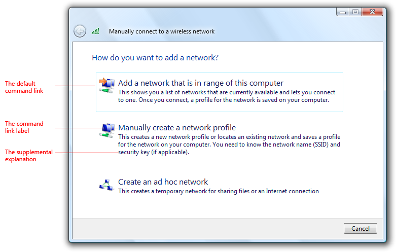
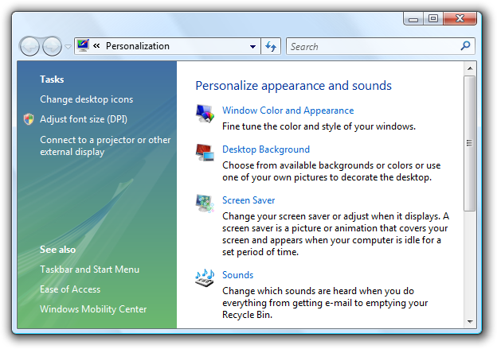
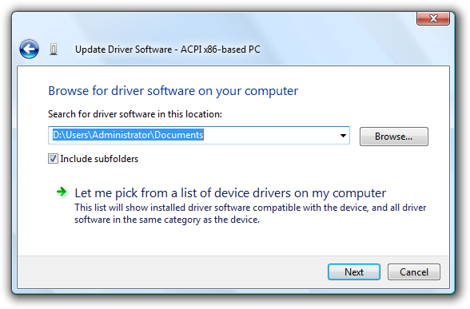
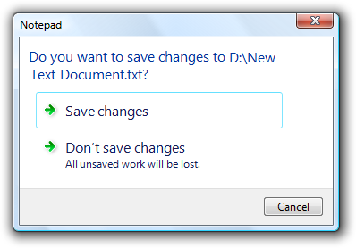
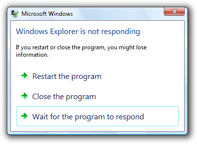
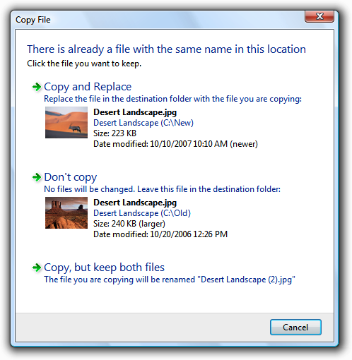

# Command Links

> [!NOTE]
> This design guide was created for Windows 7 and has not been updated for newer versions of Windows. Much of the guidance still applies in principle, but the presentation and examples do not reflect our [current design guidance](/windows/uwp/design/).

With command links, users select a single response to a main instruction and by doing so, move on to the next step in a task.

Command links have a clean, lightweight appearance that allows for descriptive labels, and are displayed with either a standard arrow or custom icon, and an optional supplemental explanation.

A typical set of command links.

Command links are similar to [radio buttons](ctrl-radio-buttons.md) in that they are used to select from a set of mutually exclusive, related choices. Like radio buttons, command links are always presented in sets, never individually. In appearance, command links have the lightweight appearance similar to regular [links](ctrl-links.md), without a frame or other strong click [affordance](glossary.md). Command links are also similar to [command buttons](ctrl-command-buttons.md), in that they can be the default "command button" and they can have an access key assigned. Like [commit buttons](glossary.md), on click they either close the window (for dialog boxes) or advance to the next page (for wizards and pages flows).

> [!Note]  
> Guidelines related to [links](ctrl-links.md) and [layout](vis-layout.md) are presented in separate articles.

 

## Is this the right control?

To decide, consider these questions:

-   **Are the options responses to the main instruction and related to the primary purpose of the window or page?** Must users respond to them to do something other than just navigating to a different page? If not, use another control such as command buttons or links. Command links aren't appropriate for secondary or optional choices, or pure navigation.

    

    While the Personalization Control Panel item looks like it is using command links, the options are regular links because this [hub page](winenv-ctrl-panels.md) is for pure navigation.

-   **Is the control used to choose one response from a set of mutually exclusive responses?** If not, use another control. To let users choose individual commands, use command buttons or links.
-   **For dialog boxes, does clicking the control close the window?** If not, use a control that doesn't require closing the window, such as radio buttons, command buttons, or links.

    **Incorrect:**

    

    Command links can't be used in property windows or tabbed dialogs because clicking the control closes the window.

-   **For wizards and page flows, does clicking advance to the next page without commitment?** Don't use command links to commit to a task; use commit buttons instead. Because command links look like links and users associate links with navigation within a page flow, links aren't appropriate for [commit pages](glossary.md) because users should always be able to back out.
-   **For wizards and page flows, are other pages using command links?** If so, and all other factors being equal, prefer command links for consistency across pages.
-   **Is the number of responses between two and five?** There should never be a single command link. Because command links are large controls and the screen space used is proportional to the number of options, keep the number of responses to five or fewer. For six or more options, use radio buttons, regular links, or a single-selection [list view](ctrl-list-views.md).

    

    In this example, the AutoPlay feature in Microsoft Windows uses a list view.

-   **Would a combination of radio buttons and a commit button be a better choice?** Radio buttons are a better choice when any of the following are true:
    -   **There is a strong default option that you want most users to select.** Users are less likely to change a default radio button than a default command link especially in a wizard, where users are accustomed to clicking Next to accept appropriate defaults. On the other hand, command links are a better choice if you want to encourage users to make an explicit choice.
    -   **Users need to interact with the choices (perhaps to see additional information) before making a decision.** For example, selecting a radio button might display a description about the option dynamically.

        

        In this example, selecting a radio button displays a description of the option.

    -   **There are secondary or related options on the page.** Command links tend to dominate the page, making it easy to overlook everything else. Furthermore, once a command link is clicked, it's impossible to select secondary options.

        **Incorrect:**

        

        In this example, there are two different ways to respond to the main instruction. A command link wasn't used for the first response because it would be difficult to select secondary options.

        **Correct:**

        

        In this example, radio buttons make the responses clear, while allowing users to select secondary options.

-   **For dialog boxes, would a group of commit buttons be a better choice?** Command links work better when the options require longer, more explanatory responses and supplemental explanations, but a group of commit buttons is a better choice if there are a few simple options.

    **Incorrect:**

    

    In this example, using command links for simple commands makes the dialog box unnecessarily complicated.

    **Correct:**

    

    In this example, using simple commit buttons gets right to the point.

    However, self-explanatory command links are always better choice when text is used to explain commit buttons.

    **Incorrect:**

    

    In this example, text is used to explain the commit buttons.

    **Correct:**

    

    In this example, the command links are self-explanatory.

> [!Note]  
> Command links require Windows Vista or later, so they aren't suitable for earlier versions of Windows. You can use regular links as a substitute.

 

In this example, regular links with an icon and a supplemental explanation are used as a substitute for command links in Windows XP.

## Design concepts

Just because command links allow you to use more descriptive labels and optional supplemental explanations doesn't mean you should. Consider the following example:

**Incorrect:**

This dialog box is seriously over-communicating.

This dialog box takes a simple question and unnecessarily complicates it with command link text. Users don't want to read all that text for such simple questions.

We can simplify this dialog box by applying three command link guidelines:

-   **Don't use a supplemental explanation that is a wordy restatement of the command link.** Use a supplemental explanation only when you can't make a command link self-explanatory. Providing a supplemental explanation for one command link doesn't mean that you have to provide them for all commands.
-   **Select the safest (to prevent loss of data or system access) and most secure response to be the default.** If safety and security aren't factors, select the most likely or convenient response.
-   **Provide an explicit Cancel button.** Don't use a command link for this purpose.

By applying these guidelines, we can eliminate the unnecessary supplemental explanations, make the most convenient response the default, and provide an explicit Cancel button.

**Better:**

An improved version with simpler command links.

While it's true that this version doesn't explain explicitly that not saving is counted as a loss, few users will change their decision based on this information, making this a good tradeoff.

This dialog box could be made even better by analyzing whether or not command links are even the right control to use in this case. Commit buttons are actually a better choice, because longer, more explanatory responses aren't needed.

**Best:**

The correct version uses commit buttons to get right to the point.

Command links have many advantages, but when used unwisely they lead to over-communication. For dialog boxes, consider using commit buttons first and use command links only if commit buttons don't do the job well.

**When used appropriately, command links should simplify and clarify your UI.** If the results are the opposite, take a step back, review the alternatives, and focus on what you really need to communicate.

**If you do only one thing...** Don't use command links to over-communicate. Command links should simplify and clarify the communication, not make it more complicated.

## Usage patterns

Command links have several usage patterns:

|                                                                                                                          |                                                                                                                                                                                                                                                                                                                                                                                                                                                                                                                                                                                                                                                                        |
|--------------------------------------------------------------------------------------------------------------------------|------------------------------------------------------------------------------------------------------------------------------------------------------------------------------------------------------------------------------------------------------------------------------------------------------------------------------------------------------------------------------------------------------------------------------------------------------------------------------------------------------------------------------------------------------------------------------------------------------------------------------------------------------------------------|
| **Page responses** Command links are used to respond to the main instruction and advance to the next page.    | with this pattern, the command links replace the next button, but there is still a cancel button. Page responses don't imply commitment. because command links look like links and users associate links with navigation within a page flow, links aren't appropriate for commit pages. users should always be able to back out.    In this example, command links are used to give descriptive responses to the main instruction. While radio buttons could be used here, command links allow users to respond with a single click.  |
| **Dialog box responses** Command links are used to respond to the main instruction and close the dialog box.  | with this pattern, the command links replace the commit buttons (such as ok), but there is still a cancel button. Unlike page flows, there is no way to back out of a dialog box-based response once it has been made. consequently, dialog box command links imply commitment.    In this example, command links are used to give descriptive responses to the main instruction. While radio buttons could be used here, command links allow users to choose with a single click.                                                    |
| **Detailed responses** A page or dialog response that includes detailed information.                          | on occasion, users may need more detailed information to choose their response.     In this example, detailed command links are used so that users can make informed decisions. The thumbnails and file details help users decide.                                                                                                                                                                                                                                                                                                          |

 

## Guidelines

### Interaction

-   **Display a busy pointer if the result of clicking a command link isn't instantaneous.** Without feedback, users might assume that the click didn't happen and click again.

### Presentation

-   **Always present command links in a set of two or more.** Logically, there is no reason to ask a question that has only one answer.

    **Incorrect:**

    

    In this example, the dialog box appears to be offering the user a choice, but there is just an instruction. This should be an informational dialog instead.

-   **Present the most commonly used command links first.** The resulting order should roughly follow the likelihood of use, but also have a logical flow.
    -   **Exception:** Command links that result in doing everything should be placed first.
-   **Provide an explicit Cancel button.** Don't use a command link for this purpose. Quite often users realize that they don't want to perform a task. Using a command link to cancel would require users to read all the command links carefully to determine which one means cancel. Having an explicit Cancel button allows users to cancel a task efficiently.

    **Incorrect:**

    

    In this example, the Don't exit command link should be a Cancel button.

-   **If providing an explicit Cancel button leaves a single command link, provide both a command link to cancel and a Cancel button.** Doing so makes it clear that users have a choice. Phrase this command link in terms of how it differs from the first response, instead of just "Cancel" or some variation.

    

    In this example, the second command link indicates that the user has a choice, but all it does is cancel. However, it is phrased in terms of how it differs from the first command link.

-   **Use Close instead of Cancel if you can't return the environment to its previous state, leaving no side effect.**
-   **Don't display disabled command links.** If a command link doesn't apply to the current context, remove it instead. If removing all the command links that don't apply leaves a single command link, either eliminate the window or page, or display a [confirmation](mess-confirm.md) if explicit user consent is needed.

### Icons

-   **All command links need an icon.** The icons help users distinguish command links from regular links and user interface text.
-   **Use the arrow icon only for command links.** Regular links shouldn't use the arrow icon unless they are being used as a substitute for command links in Windows XP.
-   **Use the security shield icon to indicate that a response requires immediate elevation.** For additional guidelines on using the security shield icon, see the [User Account Control](winenv-uac.md).
-   **Use custom icons only if they help users visually identify and differentiate the options.** Don't use custom icons if they aren't immediately recognizable or meaningful.

    **Incorrect:**

    

    In this example, the custom icons aren't immediately recognizable.

-   **For custom icons, use 16x16 or 32x32 pixel icons.** Use the larger icons if there is sufficient space and they benefit visually from the larger size. If you need security shield overlays, use 32x32 or 48x48 pixel icons.

    

    This example uses 32x32 pixel custom icons.

    

    This example uses 48x48 pixel custom icons, with a security shield overlay.

-   **Avoid mixing custom icons with the standard arrow icon on a window or a page.** If you use a custom icon on a surface, try to use all custom icons. However, prefer the standard arrow icon over meaningless custom icons.

### Default values

-   **Select the safest (to prevent loss of data or system access) and most secure response to be the default.** If safety and security aren't factors, select the most likely or convenient response.
-   **When practical, make the first response the default option** because users often expect that unless that order isn't logical.
-   **For dialog boxes, don't make a destructive action the default command link** unless there is an easy way to undo the action.

## Recommended sizing and spacing

## Labels

> [!Note]  
> Because command links are responses to a main instruction, you should craft a [good main instruction](text-ui.md) before determining its responses.

 

**Command link labels**

-   **Choose a concise label that clearly communicates and differentiates what the command link does.** It should be self-explanatory and correspond to the main instruction. Focus the labels on the differences among the responses. Users shouldn't have to figure out what the command link really means or how it differs from other command links.

    **Incorrect:**

    

    In this example, what is the difference between the second and third responses? Aren't you glad there's a Cancel button?

-   **Focus command link labels on helping users make the right decision.** Omit details that don't affect the choice. The labels don't have to be a complete specification of what will happen.
-   **Start command links with a verb.** Don't use click, however, because the label should communicate what the command link does, not how it works.
    -   **Exception:** If all the command links begin with the same verb or phrase, eliminate the redundant verb or phrase.
-   In general, **use positive phrasing** (providing a choice to do something). Negative phrasing (providing a choice not to do something) is acceptable if it makes the labels easier to understand.
-   **Use parallel phrasing and single line labels.** Long labels discourage reading and shouldn't be necessary. Also, moderately sized labels are easier to refer to in documentation.
-   **Use sentence-style capitalization.**
-   **Don't use ending punctuation unless the label is a question.**
-   **Assign a unique access key.** For guidelines, see [Keyboard](inter-keyboard.md).
-   **Don't use ellipses.** Ellipses mean that more information might be needed to perform the action. Properly used command links don't need ellipses because they have an immediate effect.
-   **If a response is strongly recommended, add "(recommended)" to the label.** Be sure to add to the label, not the supplemental explanation.
-   **If a response is intended only for advanced users, consider adding "(advanced)" to the label.** Be sure to add to the label, not the supplemental explanation.

**Tip:** You can evaluate command links by imagining that a friend stated the main instruction, and you responded with the command links. If responding with the command links would be unnatural or awkward, revise the command links and possibly the main instruction.

**Supplemental explanations**

-   If a command link requires further explanation, **provide a supplemental explanation**. Supplemental explanations describe why users might want to choose a response or what happens if a response is chosen.

    

    In this example, the supplemental explanation describes the implications of the option.

-   **Don't use a supplemental explanation that is wordy restatement of the command link.** Use a supplemental explanation only when you can't make a command link self-explanatory. Providing a supplemental explanation for one command link doesn't mean that you have to provide them for all.
-   **Focus supplemental explanations on helping users make the right decision.** Omit details that don't affect the choice. The supplemental explanations don't have to be a complete specification of what will happen.
-   **Use parallel phrasing and at most three lines of text.** Long supplemental explanations discourage reading and shouldn't be necessary.
-   **Use complete sentences and ending punctuation.**

**Command link group labels**

-   **Don't use group labels.** Main instructions act as the group label for command links.

## Documentation

When referring to command links:

-   Use the exact label text, including its capitalization, but don't include the access key underscore.
-   If the label includes an object name, either omit the object name or use placeholder text.
-   To describe the user interaction, use click.
-   When possible, format the label using bold text. Otherwise, put the label in quotation marks only if required to prevent confusion.

**Examples:** To copy the picture, click **Copy and Replace**.

Click **Reset the network adapter**. (For a command link labeled "Reset the network adaptor *adaptor name*".)

 

