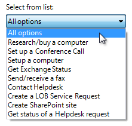

# Windows 7 Drop-down Lists & Combo Boxes

> [!NOTE]
> This design guide was created for Windows 7 and has not been updated for newer versions of Windows. Much of the guidance still applies in principle, but the presentation and examples do not reflect our [current design guidance](/windows/uwp/design/).

With a drop-down list or combo box, users make a choice among a list of mutually exclusive values. Users can choose one and only one option. With a standard drop-down list, users are limited to choices in the list, but with a combo box they can enter a choice that isn't in the list.

A typical combo box.

The following terms are important to understand as you read this article:

-   A standard list box is a box containing a list of multiple items, with multiple items visible.
-   A drop-down list is a list in which the selected item is always visible, and the others are visible on demand by clicking a drop-down button.
-   A combo box is a combination of a standard list box or a drop-down list and an editable [text box](ctrl-text-boxes.md), thus allowing users to enter a value that isn't in the list.
    -   An editable drop-down list is a combination of a drop-down list and an editable text box.
    -   An editable list box is a combination of a standard list box and an editable text box.

> [!Note]  
> Guidelines related to [layout](vis-layout.md) are presented in a separate article.

 

## Is this the right control?

To decide, consider these questions:

-   **Is the control used to choose one option from a list of mutually exclusive values?** If not, use another control. To choose multiple options, use a [standard multiple-selection list](ctrl-list-boxes.md), check box list, list builder, or add/remove list instead.
-   **Are the options commands?** If so, use a [menu button](ctrl-command-buttons.md) or split button instead. Use drop-down lists and combo boxes for objects (nouns) or attributes (adjectives), but not commands (verbs).
-   **Does the list present data, rather than program options?** Either way, a drop-down list or combo box is a suitable choice. By contrast, [radio buttons](ctrl-radio-buttons.md) are suitable only for a small number of program options.

**Drop-down lists**

-   **Is there a default option that is recommended for most users in most situations?** Is seeing the selected option far more important than seeing the alternatives? Consider using a drop-down list if you don't want to encourage users to make changes by hiding the alternatives. If not, consider radio buttons, a single-selection list, or an editable list box, which give more emphasis to the alternative choices.

    

    In this example, the highest color quality is the best choice for most users, so a drop-down list is a good choice to downplay the alternatives.

-   **Do you want to draw attention to the option?** If so, consider radio buttons, a single-selection list, or an editable list box, which tend to draw more attention by taking more screen space. Because drop-down lists are compact, they are good choices for options that you want to underemphasize.
-   **Is screen space at a premium?** If so, use a drop-down list because the screen space used is fixed and independent of the number of choices.
-   **Are there other drop-down lists on the window?** If so, consider using a drop-down list for consistency.

**Editable drop-down lists**

In addition to the principles just provided for drop-down lists, the following also apply:

-   **Are the possible choices constrained?** If so, use a normal drop-down list instead. Combo boxes are for unconstrained input, in which users may need to enter a value not currently in the list. Because the input is unconstrained, if users enter text that isn't valid you must handle the error with an error message.
-   **Can you enumerate the most likely choices in advance**? If not, use a text box instead.
-   **Is the drop-down list being used to list previous user input?** Unless users need to review the complete list of previous input, use a text box with the auto-complete option instead.

    

    In this example, users may need to review their previous input, so an editable drop-down list is a good choice.

    

    In this example, a text box with auto-complete is a good choice.

-   **Will users need assistance in selecting valid values?** If so, use a text box with a [Browse button](ctrl-command-buttons.md) instead.

    

    In this example, users can click "To" to help them select valid values.

-   **Is it important to encourage users to review the alternative choices or invite change?** If so, consider using an editable list box instead. With an editable drop-down list, users aren't going to be aware of the alternatives until the list is dropped.
-   **Do users need to locate an item rapidly in a large list?** (Win32 only) If so, use a combo box because users can select an item by typing its full name. By contrast, the Win32 drop-down list selects items based only by the last character typed (so typing "Jun" into a list of months would match November, not June). In this case, use a combo box even if the possible choices are constrained.

**Editable list boxes**

-   **Are the possible choices constrained?** If so, use a single-selection list or normal drop-down list instead. Combo boxes are for unconstrained input, where users may need to enter a value not currently in the list. Because the input is unconstrained, if users enter text that is not valid you must handle the error with an error message.
-   **Can you enumerate the most likely choices in advance?** If not, use a text box instead.
-   **Is it important to encourage users to review the alternative choices or invite change?** If not, consider an editable drop-down list instead.
-   **Do you want to draw attention to the option?** If not, consider an editable drop-down list instead. Because drop-down lists are compact, they are good choices for options that you want to underemphasize.
-   **Is screen space at a premium?** If so, use an editable drop-down list because the screen space used is fixed and independent of the number of choices.

For drop-down lists, **the number of items in the list isn't a factor in choosing the control** because they scale from thousands of items all the way down to one. Editable drop-down lists scale from thousands of items down to none, because users can enter a value that isn't in the list. Because drop-down lists can be used for data, the number of items might not be known in advance and perhaps cannot be guaranteed. **Always include at least three items in editable list boxes to justify the additional screen space.**

## Usage patterns

Drop-down lists and combo boxes have several usage patterns:

|   Usage     |    Example   |
|-------------------------------------------------------------------------------------------------------------------------------------|---------------------------------------------------------------------------------------------------------------------------------------------------------------------------------------------------------------------------------------------------------------------------------------------------------------------------------------------------------------------------------------------------------------------------------------------------------------------------------------------------------------------|
| **Drop-down list** a standard drop-down list, with a fixed set of predetermined values.                                   | When closed, only the selected item is visible. When users click the drop-down button, all the options become visible. To change the value, users can open the list and click another value.    In this example, the list is in its normal state.    In this example, the list has been dropped down.  |
| **Preview drop-down list** a drop-down list that previews the results of the selection to help users choose.              |   In these examples, the drop-down lists preview the results of the selection.                                                                                                                                                                                                                                                                                                                                            |
| **Editable drop-down list** a drop-down combo box, which allows users to enter a value that isn't in the drop-down list.  |   Examples of an editable drop-down list in edit and dropped-down modes.  Use this control when you want to give the flexibility of a text box, yet want to assist users by providing a convenient list of likely choices.                                                                                                    |
| **Editable list boxes** a regular combo box, which allows users to enter a value that isn't in the always visible list.   |   In these examples, the editable list boxes are always displayed.  This control is a better choice than the editable drop-down list when it is important to encourage users to review the alternative choices or invite change.                                                                                                                                                                       |

 

## Guidelines

### General

-   **Don't use the change of a drop-down list or combo box to**:
    -   Perform commands.
    -   Display other windows, such as a dialog box to gather more input.
    -   Dynamically display other controls related to the selected control ([screen readers](inter-accessibility.md) cannot detect such events).

### Presentation

-   **Sort list items in a logical order**, such as grouping highly related options together, placing most common options first, or using alphabetical order. Sort names in alphabetical order, numbers in numeric order, and dates in chronological order. Lists with 12 or more items should be sorted alphabetically to make items easier to find.

    **Correct:** 

    In this example, the list items are sorted by their spatial relationship.

    **Incorrect:** 

    In this example, there are so many list items that they need to be sorted in alphabetical order.

    **Correct:** 

    In this example, the list items are sorted in alphabetical order except for the option that represents all items.

-   **Place options that represent All or None at the beginning of the list, regardless of the sort order of the remaining items.**
-   **Enclose meta-options in parentheses.**

    

    In this example, "(None)" is a meta-option because it is not a valid value for the choice rather it describes that the option itself isn't being used.

-   **When disabling a drop-down list or combo box, also disable any associated labels and command buttons.**

### Drop-down lists

-   When a single drop-down list is used to change the view of an associated control, **change the view immediately on selection instead of requiring a separate command button.** Use a separate command button only if the list takes a significant amount of time to render. However, list headers and [menu buttons](ctrl-command-buttons.md) are the preferred controls for this purpose.
-   **Don't have blank list items** **use meta-options instead**. Users don't know how to interpret blank items, whereas the meaning of meta-options is explicit.

    **Correct:** 

    **Incorrect:** 

    In the incorrect example, the meaning of the blank option is unclear.

### Preview drop-down lists

-   **Use previews in the list items when it is better to show with images than describe using text alone.**

    

    In this example, the preview explains the options far better than text alone.

-   **Don't use unnecessary, unhelpful icons in previews**.

    **Incorrect:** 

    In this example, the preview icons are unnecessary because they don't communicate any information.

### Combo boxes

-   **Limit the length of the input text when you can.** For example, if the valid input is a number between 0 and 999, use a combo box that is limited to three characters.
-   **If there are many possible options, focus the list contents on the most likely options**. Because users can enter values that aren't in the list, combo boxes don't have to list all choices, just the likely choices or a representative sample.

    

    In this example, many valid choices aren't listed, such as 15, or half-size fonts such as 9.5.

### Default values

-   **Select the safest (to prevent loss of data or system access) and most secure option by default.** If safety and security aren't factors, select the most likely or convenient option.
    -   **Exception:** Display a blank default value if the control represents a property in a [mixed state](glossary.md), which happens when displaying a property for multiple objects that don't have the same setting.

## Prompts

A prompt is a label or short instruction placed inside an editable drop-down list as its default value. Unlike static text, prompts disappear from the screen once users type something into the combo box or it gets input focus.

A typical prompt.

Use a prompt when:

-   Screen space is at such a premium that using a label or instruction is undesirable, such as on a toolbar.
-   The prompt is primarily for identifying the purpose of the list in a compact way. It must not be crucial information that users need to see while using the combo box.

Don't use prompts just to direct users to select something from the list or to click buttons. For example, prompts like Select an option or Enter a filename and then click Send are unnecessary.

When using prompts:

-   Draw the prompt text in italic gray and real text in normal black. The prompt text must not be confused with real text.
-   Keep the prompt text concise. You can use fragments instead of full sentences.
-   Use [sentence-style capitalization](glossary.md).
-   Don't use ending punctuation or ellipsis.
-   The prompt text should not be editable, and should disappear once users click in or tab into the text box.
    -   **Exception:** The prompt is displayed if the text box has default input focus, and only disappears once the user starts typing.
-   The prompt text is restored if the text box is still empty when it loses input focus.

**Incorrect:**

In this example, screen space is not at a premium; once an editable drop-down list is filled out, it is difficult for users to remember what it is for; and the prompt text is editable and drawn the same way as real text.

## Recommended sizing and spacing

Recommended sizing and spacing for drop-down lists and combo boxes.

-   **Choose a width appropriate for the longest valid data.** Drop-down lists cannot be scrolled horizontally, so users can see only what is visible in the control. (Note, however, that combo boxes can have AutoScroll functionality enabled.)
-   **Include an additional 30 percent** (up to 200 percent for shorter text) for any text (but not numbers) that will be localized.
-   **Choose a list length that eliminates unnecessary vertical scrolling.** Because drop-down lists are displayed on demand, their lists should show up to 30 items. Editable list boxes (those that don't have a drop-down button) should show between 3 and 12 items.

## Labels

**Control labels**

-   Write the label as a word or phrase, not as a sentence, and end it with a colon. **Exceptions:**
    -   Editable drop-down lists with prompts located where space is at a premium.
    -   If a drop-down list or combo box is subordinate to a radio button or check box and is introduced by its label ending with a colon, don't put an additional label on the control.
-   Assign a unique [access key](glossary.md) for each label. For guidelines, see [Keyboard](inter-keyboard.md).
-   Use [sentence-style capitalization](glossary.md).
-   Position the label either to the left of or above the control, and align the label with the left edge of the control. If label is on the left, vertically align the label text with the control text.

    **Correct:** 

    In this example, the label is correctly aligned with the control text.

    **Incorrect:** 

    In this example, the label is incorrectly aligned with the control text.

-   You may specify units (seconds, connections, and so on) in parentheses after the label.
-   Don't make the content of the drop-down list or combo box (or its units label) part of a sentence, because this is not localizable.

**Option text**

-   Assign a unique name to each option.
-   Use [sentence-style capitalization](glossary.md), unless an item is a proper noun.
-   Write the label as a word or phrase, not as a sentence, and use no ending punctuation.
-   Use parallel phrasing, and try to keep the length about the same for all options.

**Instructional text**

-   If you need to add instructional text about a drop-down list or combo box, add it above the label. Use complete sentences with ending punctuation.
-   Use [sentence-style capitalization](glossary.md).
-   Additional information that is helpful but not necessary should be kept short. Place this information either in parentheses between the label and colon, or without parentheses below the control.

    

    This example shows additional information placed below the control.

## Documentation

When referring to drop-down lists:

-   Use the exact label text, including its capitalization, but don't include the access key underscore or colon; include either list or box, whichever is clearer.
-   For list options, use the exact option text, including its capitalization.
-   In programming and other technical documentation, refer to drop-down lists as drop-down lists. Everywhere else, use either list or box, whichever is clearer.
-   To describe user interaction, use click.
-   When possible, format the label and list options using bold text. Otherwise, put the label and options in quotation marks only if required to prevent confusion.

Example: In the **Font size** list, click **Large fonts**.

When referring to combo boxes:

-   Use the exact label text, including its capitalization, but don't include the access key underscore or colon; include the word box.
-   For list options, use the exact option text including its capitalization.
-   In programming and other technical documentation, refer to combo boxes as combo boxes. Everywhere else, use box.
-   To describe user interaction, use enter.
-   When possible, format the label and list options using bold text. Otherwise, put the label and options in quotation marks only if required to prevent confusion.

Example: In the **Font** box, enter the font you want to use.

 

