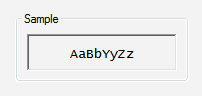

# Group Boxes

> [!NOTE]
> This design guide was created for Windows 7 and has not been updated for newer versions of Windows. Much of the guidance still applies in principle, but the presentation and examples do not reflect our [current design guidance](/windows/uwp/design/).

A group box is a labeled rectangular frame that surrounds a set of related controls. A group box is a way to show relationships visually; aside from possibly providing an access key for a group of controls, it provides no functionality.

A typical group box.

> [!Note]  
> Guidelines related to [layout](vis-layout.md) are presented in a separate article.

 

## Is this the right control?

While group boxes are a strong visual means of indicating relationships, overusing them adds visual clutter and greatly reduces the space available on a surface. They are visually heavy and should be used sparingly—only when there isn't a better solution.

A design trend in Windows is a simpler, cleaner appearance by eliminating unnecessary lines.

To decide whether a group box is necessary, consider these questions:

-   **Is there more than one control in the group?** If not, use a plain text label instead. A rare exception is to use a group box with a single control to maintain consistency with other group boxes on the same surface.

**Incorrect:** 

In this example, the group box has only a single control.

-   **Are the controls related? Does showing the relationship add clarity?** If not, present the controls separately outside of a group box.
-   **Are all the controls inside the group?** If so, indicate the relationship on the larger surface, such as the parent dialog box or page.

**Incorrect:** 

In this example, all the controls (aside from the commit buttons) in the dialog box are within the group box.

-   **Can you effectively communicate the relationships using layout alone?** If so, use [layout](vis-layout.md) instead. You can place related controls next to each other and put extra spacing between unrelated controls. You can also use headings and indenting to show hierarchical relationships.

In this example, layout alone is used to show control relationships.

-   **Can you effectively communicate the relationships using a separator?** If so, use a separator instead. A separator is a horizontal line that unifies the controls below it. Separators provide a simpler, cleaner look. However, unlike group boxes, they work best when they span the full width of the surface.
    -   **Developers:** You can implement a separator with an etched rectangle with a height of one.

In this example, labeled separators are used to show control relationships.

In this example, unlabeled separators are used to show control relationships.

-   **Can you effectively communicate the relationships without text?** If so, consider using graphic elements such as [backgrounds](vis-graphic.md) or aggregators.

## Guidelines

-   **Don't nest group boxes.** Use layout to show relationships within a group box.

**Incorrect:** 

In this example, the nested group boxes result in unnecessary visual clutter.

**Correct:** 

In this example, the same control relationship is shown using layout instead.

-   Don't put controls in group box labels.
    -   **Exception:** You can use a check box as a group box label if all of the controls inside the box are enabled and disabled by the check box.

**Incorrect:** 

In this example, a drop-down list is incorrectly placed on a group box. This example should use [tabs](https://msdn.microsoft.com/library/windows/desktop/aa511493.aspx) instead.

-   **Don't disable group boxes.** To indicate that a group of controls doesn't currently apply, disable all the controls within the group box, but not the group box itself. This approach is more accessible and can be supported consistently by all UI frameworks.

## Labels

-   Label all group boxes.
-   Don't assign an access key to the label. Doing so is unnecessary and makes the other access keys harder to assign. Instead, assign access keys to the controls within the group box.
    -   **Exception:** If a surface has many controls, there may not be enough access keys available. If so, reduce the number of access keys by assigning them to group boxes instead of the controls within the group boxes.
-   Use [sentence-style capitalization](glossary.md).
-   Write the label using a noun or a noun phrase, not as a sentence, and use no ending punctuation, including colons.
-   Use parallel phrasing for group box labels within the same surface.
-   Keep group box labels concise. Don't use instructional text as the label. You can have instructional text within the group box, however.
-   Don't repeat the group box label in control labels within the box. For example, if the group box is labeled Alignment, label the option buttons Left, Right, and so on, not Left alignment or Right alignment.
-   Don't refer to group boxes in user interface text.

## Documentation

When referring to group boxes:

-   Refer to group boxes only in programmer and other technical documentation. For group box, use two lowercase words.
-   Everywhere else, it is unnecessary to include the name of the group box in a procedure unless a dialog box contains more than one option with the same name. In such cases, use under with the group box name.
-   When possible, format the label using bold text. Otherwise, put the label in quotation marks only if required to prevent confusion.

Example: Under **Effects**, select **Hidden**.

 

 