# Links

> [!NOTE]
> This design guide was created for Windows 7 and has not been updated for newer versions of Windows. Much of the guidance still applies in principle, but the presentation and examples do not reflect our [current design guidance](/windows/uwp/design/).

With a *link*, users can navigate to another page, window, or Help topic; display a definition; initiate a command; or choose an option. A link is text or a graphic that indicates that it can be clicked, typically by being displayed using the visited or unvisited [link system colors](vis-color.md). Traditionally, links are underlined as well, but that approach is often unnecessary and falling out of favor to reduce visual clutter.

When users hover over a link, the link text appears as underlined (if it wasn't already) and the pointer shape changes to a [hand](inter-mouse.md).

A text link is the lightest weight clickable control, and is often used to reduce the visual complexity of a design.

> [!Note]  
> Guidelines related to [command links](ctrl-command-links.md) and [layout](vis-layout.md) are presented in separate articles.

 

## Is this the right control?

To decide, consider these questions:

-   **Is the link used to navigate to another page, window, or Help topic; display a definition; initiate a command; or choose an option?** If not, use another control.
-   **Would a command button be a better choice?** Use a [command button](ctrl-command-buttons.md) if:
    -   The control initiates an immediate action, including displaying a window, and that command relates to the primary purpose of the window.
    -   A window is displayed to gather input or making choices, even if for a secondary command.
    -   The label is short, consisting of four or fewer words, thus avoiding the awkward appearance of long buttons.
    -   The command is not inline.
    -   The control appears within a group of other related command buttons.
    -   The action is destructive or irreversible. Because users associate links with navigation (and the ability to back out), links aren't appropriate for commands with significant consequences.
    -   Similarly, in a [wizard](win-wizards.md) or [task flow](glossary.md), the command represents commitment. In such windows, command buttons suggest commitment whereas links suggest navigating to the next step.

## Design concepts

**Making links recognizable**

Links lack [affordance](glossary.md), which means **their visual properties don't suggest how they are used** and are understood only through experience. Links without an underline and link system colors appear as normal text; the only way to ascertain their behavior is from their presentation, their context, or by positioning the pointer over them.

Surprisingly, this lack of affordance is often a motivation for using links because they appear so lightweight, thereby reducing the visual complexity of a design. Links eliminate the visually heavy frame used by [command buttons](ctrl-command-buttons.md) and border used by other controls. For example, while you might use command buttons to make primary commands obvious, you might choose links for secondary commands to de-emphasize them.

The challenge is then to keep enough visual clues so users can recognize the links. The fundamental guideline is **users must be able to recognize links by visual inspection alone they shouldn't have to hover over an object or click it to determine if it is a link**.

Users can recognize a link by visual inspection alone if the link uses the [link system colors](vis-color.md) and at least one of the following visual clues:

-   Underlined text.
-   A graphic or bullet, such as with the [text with icon link](#usage-patterns) pattern.
-   Placement within a standard navigation, option, or command location, such as the [content area](glossary.md) of a window, or in a navigation bar, menu bar, toolbar, or page footer.

Users can also recognize a link by visual inspection with the following visual clues, but these clues aren't sufficient by themselves:

-   Text that suggests clicking, such as a command starting with an imperative verb like Show, Print, Copy, or Delete.
-   Placement within a block of normal text.

Of course, users can always determine a link through interaction either hovering or clicking. If discovery of a link isn't required for any significant tasks, you can de-emphasize such links.

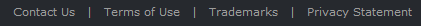

In this example, Contact Us, Terms of Use, Trademarks, and Privacy Statement are links. They are intentionally de-emphasized because they aren't required for any important tasks. The only clues that they are links are that they have a mouse pointer on hover and are positioned in a standard navigation area at the bottom of the window.

**Making links specific, relevant, and predictable**

Link text should indicate the result of clicking on the link.

Specific links are more compelling to users than general links, so **use link labels that give specific descriptive information about the result of clicking on the link**. However, make sure that your link text isn't so specific that it is misleading and discourages proper use.

Concise links are more likely to be read than verbose links. **Eliminate unnecessary text and detail.** Link labels don't have to be comprehensive.

To evaluate your link text:

-   Make sure the link text reflects the scenarios that the link supports.
-   Make sure the results of the link are predictable. Users shouldn't be surprised by the results.

**If you do only two things...**

1. Make links discoverable by visual inspection alone. Users shouldn't have to interact with your program to find links.

2. Use links that give specific descriptive information about the result of clicking on the link, using as much text as necessary. Users should be able to accurately predict the result of a link from its link text and optional [infotip](ctrl-tooltips-and-infotips.md).

## Usage patterns

Links have several functional patterns:

|                                                                                                                                                     |                                                                                                                                                                                                                                                                                                                                                                                                                                                                                                                                                                                                                                                                                                                                                                                                                                                                                                                                                                                                                  |
|-----------------------------------------------------------------------------------------------------------------------------------------------------|------------------------------------------------------------------------------------------------------------------------------------------------------------------------------------------------------------------------------------------------------------------------------------------------------------------------------------------------------------------------------------------------------------------------------------------------------------------------------------------------------------------------------------------------------------------------------------------------------------------------------------------------------------------------------------------------------------------------------------------------------------------------------------------------------------------------------------------------------------------------------------------------------------------------------------------------------------------------------------------------------------------|
| **Navigation links**  A link used to navigate to another page or window.                                                        | Clicking the link navigates inplace to another page, as in a browser window or wizard; or displays a new window. In contrast to task links, the navigation doesn't initiate a task but simply navigates to another place or proceeds with a task already in progress. Navigation implies safety because the user can always go back.  News headlines  In this example, clicking the link navigates to the News headlines page.                                                                                                                                                                                                                                                                                                                                                                                                                                                                                                                                                     |
| **Task links**  A link used to initiate a new command.                                                                          | Clicking the link either performs a command immediately, or displays a dialog box or page to gather more input. In contrast to navigation links, task links initiate a new task instead of continuing with an existing task. Tasks don't imply safetyusers can't revert to the previous state with a Back command. Task links are so called to prevent confusion with [command links](ctrl-command-links.md).   Login  In this example, clicking the link initiates a login command.                                                                                                                                                                                                                                                                                                                                                                                                                                                                                              |
| **Help links**  A text link used to display a Help topic.                                                                       | Clicking the link displays a Help article in a separate window.  What is a strong password?  In this example, clicking the link displays a Help window with the given topic.                                                                                                                                                                                                                                                                                                                                                                                                                                                                                                                                                                                                                                                                                                                                                                                                       |
| **Definition links**  a text link used to display a definition in an infotip when the user clicks on or hovers over the link.   | this pattern is useful for defining terms that may not be known to your users without adding screen clutter.    In this example, the infotip definition is displayed.                                                                                                                                                                                                                                                                                                                                                                                                                                                                                                                                                                                                                                                                                                                             |
| **Menu links**  a set of task links used to create a menu.                                                                      | because the context of the menu indicates a set of links, the text is usually not underlined (except on hover) and might not use the link system colors.  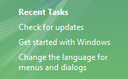  In this example, a set of links creates a menu.                                                                                                                                                                                                                                                                                                                                                                                                                                                                                                                                                                                                                                                                                                         |
| **Option links**  a selected option or its placeholder, where clicking the link invokes a command to change that option.        | unlike regular text links, the link changes its text to reflect the currently selected option and is always drawn using the unvisited link color.   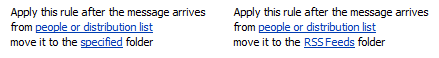  the example on the left shows a rule from the microsoft outlook rules wizard with placeholder options. after users click the links and select some options, the right-hand example updates the link text to show the results.  using option links is particularly suitable if the options have a variable format.   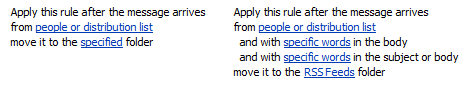  the example on the right shows that outlook rules have a variable format.   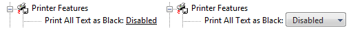  The example on the left shows an option link. It becomes a drop-down list when selected, as shown on the right.  |

 

Links also have several presentation patterns:

|                                                                                                        |                                                                                                                                                                                                                                                                                                                                                                                                                                                                                                                                                                                                                                                                                                                                                 |
|--------------------------------------------------------------------------------------------------------|-------------------------------------------------------------------------------------------------------------------------------------------------------------------------------------------------------------------------------------------------------------------------------------------------------------------------------------------------------------------------------------------------------------------------------------------------------------------------------------------------------------------------------------------------------------------------------------------------------------------------------------------------------------------------------------------------------------------------------------------------|
| **Plain text links**  consist only of text.                                        | this presentation is the most flexible because it can be used anywhere, including [inline](glossary.md).    In this example, the text color clearly identifies an inline link.                                                                                                                                                                                                                                                                                                                                                                                                                                                                  |
| **Text with icon links**  text with a preceding icon that indicates its function.  | because the graphic provides an additional visual indication of a link, it is easier to recognize as a link than a plain text link that isn't underlined. this pattern typically uses a 16x16 pixel icon.  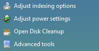  in this example, the icons provide an additional visual indication of a link.    In this example, the standard triangular Play symbol indicates that this text is a command.                                                                                                                                      |
| **Graphics-only links**  consist only of a graphic.                                | given the lack of a text link, there is no link color or underline to indicate the link. these links depend on either the graphic design to suggest clicking, or text within the graphic that suggests an action when users click. graphic-only links sometimes have a mouse over effect to indicate the link. this approach helps, but isn't discoverable by visual inspection alone.  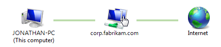  In this example, the link isn't discoverable by visual inspection alone.  **Due to their potential recognition and localization problems, graphics-only links are not recommended as the only way to perform a task.**   |

 

## Guidelines

### Interaction

-   **Display a busy pointer if the result of clicking a link isn't instantaneous.** Without feedback, users might assume that the click didn't happen and click again.

### Color

-   **Use the theme or link system colors for visited and unvisited links.** The meaning of these colors is consistent across all programs. If for any reason users don't like these colors (perhaps for accessibility reasons), they can change them themselves.
-   **For navigation links, use different colors for visited and unvisited links.** Keep the history of visited links only for the duration of the program instance. The visited color is important to indicate where users have already been, preventing them from unintentionally revisiting the same pages repeatedly.
-   **For other types of links, don't use the visited link color.** There isn't sufficient value in identifying "visited" commands, for example.
-   **Don't color text that isn't a link because users may assume that it is a link.** Use bold or a shade of gray where you'd otherwise use colored text.
-   **Exception**: You can use colored text if all links are either underlined or placed within standard navigation or command locations.

    **Incorrect:**

    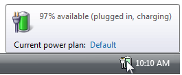

    In this example, blue text is incorrectly used for text that isn't a link.

-   **Use background colors that contrast with the link colors.** The [window system color](vis-color.md) is always a good choice.

    **Incorrect:**

    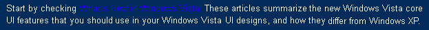

    In this example, the background color provides poor contrast with the link color.

### Underlining

-   **For links that are necessary to perform a primary task, provide visual clues so that users can recognize links by visual inspection alone.** These clues include underlining, graphics or bullets, and standard link locations. Users shouldn't have to hover over an object or attempt to click on it to determine if it is a link. Use underlined text if the link isn't obvious from its context.
-   **Don't underline text that isn't a link because users may assume that it is a link.** Use italics where you'd otherwise use underlined text. Reserve underlining only for links.
-   **When printing, don't print underlines or link colors.** Printed links have no value and are potentially confusing.

### Text with icon links

-   **Use the arrow icon only for command links.** Regular links shouldn't use the arrow icon unless they are being used as a substitute for [command links](ctrl-command-links.md) in Windows XP.
-   **Place the icon to the left of the text.** The icon needs to lead into the text visually.

**Correct:**

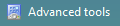

**Incorrect:**

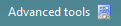

In the incorrect example, the icon doesn't lead into the text.

-   **Make the result of clicking the icon the same as clicking the text.** Doing otherwise would be unexpected and confusing.

### Graphics-only links

-   **Don't use graphics-only links.** Users have difficultly recognizing them as links and any text within the graphic (used to indicate their action when clicked) creates a localization problem.

### Navigation links

-   **Make sure navigation links don't require commitment.** Users should always be able to return to the initial state, either by using Back for inplace navigation or Cancel to close a new window.
-   **Link to specific content rather than general content.** For example, it is better to link to the relevant section of a document than to link to the beginning.
-   **Use a link only if the linked material is relevant, helpful, and not redundant.** Use restraint in navigation links don't use them just because you can.
-   **If a link navigates to an external site, put the URL in the infotip** so that users can determine the target of the link.
-   **Link only the first occurrence of the link text.** Redundant links are unnecessary and can make text difficult to read.

    **Correct:**

    The Pictures folder makes sharing your pictures easy. You can use the tasks in Pictures to send your pictures in e-mail or publish them in a secure, private location on the Web. You can also print your pictures directly from the Pictures folder.

    **Incorrect:**

    The Pictures folder makes sharing your pictures easy. You can use the tasks in Pictures to send your pictures in e-mail or publish them in a secure, private location on the Web. You can also print your pictures directly from the Pictures folder.

    In the correct example, only the first occurrence of the relevant text is linked.

    **Exceptions:**

    -   **If an instruction has a link, put the link in the instruction.**

        Using strong passwords is very important. For more information, see Strong Passwords.

        In this example, the link is in the instruction instead of the first occurrence.

    -   **Link to later occurrences if they are far away from the first.** For example, you can link redundantly in different sections within a Help topic.

### Task links

-   **Use task links for commands that aren't destructive or are easily reversible.** Because users associate links with navigation (and the ability to back out), links aren't appropriate for commands with significant consequences. Commands that display a dialog box or a confirmation are a good choice.

    **Correct:**

    Start

    Stop

    **Incorrect:**

    Delete file

    In the incorrect example, the command is destructive.

### Menu links

-   **Group related navigation and task links into menus.** A menu of related links placed within a standard navigation or command location makes it easier to find and understand the links than when they're placed separately.
-   **For selection-dependent menus, remove menu links that don't apply.** Don't disable them. Doing so eliminates clutter and users won't miss links that require selection.
-   **For selection-independent menus, disable menu links that don't apply.** Don't remove them. Doing so makes the menus more stable and such links easier to find.

    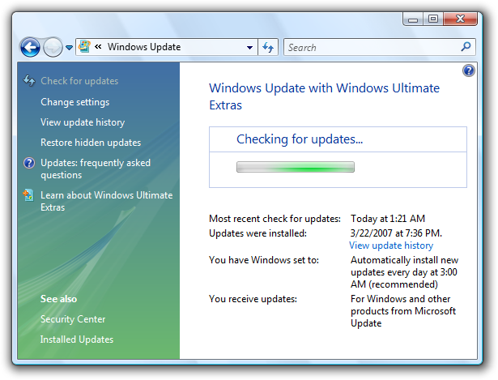

    In this example from Windows Update, an update is being performed, so the Check for updates command is disabled rather than removed.

### Link infotips

-   If a link requires further explanation, **provide the explanation in either a supplemental explanation in a separate text control or an** [infotip](ctrl-tooltips-and-infotips.md), but not both. Use complete sentences and ending punctuation. Providing both is unnecessary if the text is the same, and confusing if the text is different.

    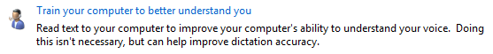

    In this example, a supplemental explanation provides further information about the link.

    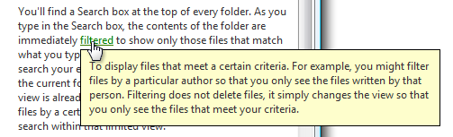

    In this example, an infotip provides further information.

-   **Don't provide an infotip that is merely a restatement of the link text.**

    **Incorrect:**

    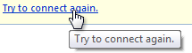

    In this example, the infotip risks annoying users by its repetitiveness.

## Text

-   Don't assign an [access key](glossary.md). Links are accessed using the Tab key.
-   **Use links that give specific descriptive information about the result of clicking on the link**, using as much text as necessary. The link text should indicate the result of clicking on the link. **Users should be able to accurately predict the result of a link from its link text and optional infotip.**

    **Incorrect:**

    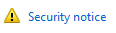

    In this example, even though the link appears important, its label is too general. Users are more likely to click a more specific link.

-   For inline links:
    -   Preserve the capitalization and punctuation of the text.
    -   Don't include ending punctuation in the link unless the text is a question.
    -   Link on the most relevant part of the text and choose link text that is large enough to be easy to click.

        **Correct:**

        Go to a newsgroup.

        **Incorrect:**

        Go to a newsgroup.

        In these examples, "Go" isn't the most relevant part of the text and it isn't large enough to make a good click target, whereas "newsgroup" is.

    -   **Avoid putting two different inline links next to each other.** Users are likely to believe they are a single link.

        **Incorrect:**

        For more information, see UX guidelines.

        In this example, "UX" and "guidelines" are two different links.

-   For independent links (not inline):
    -   Use [sentence-style capitalization](glossary.md).
    -   Don't use ending punctuation unless the link is a question.
    -   Use all the text as the link.
-   Use links that are clearly differentiated from the other links on the screen. Users should be able to accurately predict and differentiate between link targets.

    **Incorrect:**

    Find antivirus software

    Get antivirus software

    **Correct:**

    How to know if antivirus software is installed

    Install antivirus software

    In the incorrect example, the distinction between the two links is unclear.

-   Don't add Click or Click here to the link text. It isn't necessary because a link implies clicking. Also, Click here and here alone convey no information about the link when read by a screen reader.

    **Incorrect:**

    Click here for description.

    **Correct:**

    Description

    In the incorrect examples, "click here" goes without saying and conveys no information about the link.

**Navigation links**

-   **Start the link with a noun and clearly describe where clicking the link will go.** Don't use ending punctuation. On occasion you may need to start navigation links with a verb, but don't use verbs that reiterate navigation that is already implied by the fact of linking, such as View, Open, or Go to.
-   **Present a navigation link as a URL if it navigates to a Web page and you expect the target users to recall the URL and type it into a browser.** If possible, design such URLs to be short and easy to remember.
-   **If the link includes a URL to a Web site starting with "www," omit the https:// protocol name and use lowercase text.**

    **Incorrect:**

    https://www.microsoft.com

    `www.microsoft.com`

    **Correct:**

    microsoft.com

    In the incorrect examples, the "https://" and "www" go without saying.

**Task links**

-   **Start the link with an imperative verb and clearly describe the task that the link performs.** Don't use ending punctuation.
-   **End the link with an ellipsis if the command needs additional information (including a confirmation) for successful completion.** Don't use an ellipsis when the successful completion of the task is to display another window only when additional information is needed to perform the task.

    Print...

    In this example, the Print... command link displays a Print dialog box to gather more information.

    Print

    By contrast, in this example a Print command link prints a single copy of a document to the default printer without any further user interaction.

    **Proper use of ellipses is important to indicate that users can make further choices before performing the task, or can cancel the task entirely**. The visual cue offered by an ellipsis allows users to explore your software without fear.

-   **If necessary, end a task link with "now" to distinguish it from a navigation link.**

    Download files

    Download files now

    In this example, "Download files" navigates to a page for downloading files, whereas "Download files now" actually performs the command.

**Help links**

For guidelines and examples, see [Help](winenv-help.md).

**Link infotips**

-   Use full sentences and ending punctuation.

For more guidelines and examples, see [Tooltips and Infotips](ctrl-tooltips-and-infotips.md).

## Documentation

When referring to links:

-   Use the exact link text, including its capitalization, but don't include the ellipsis.
-   To describe user interaction, use click.
-   When possible, format the link text using bold text. Otherwise, put the link text in quotation marks only if required to prevent confusion.

Example: To start the scan, click **Scan a computer**.

 

