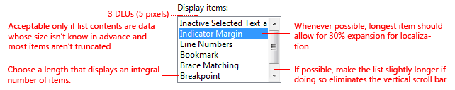
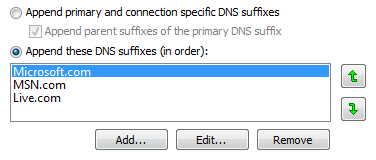
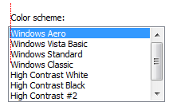
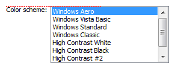
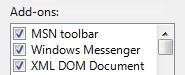

# List Boxes

> [!NOTE]
> This design guide was created for Windows 7 and has not been updated for newer versions of Windows. Much of the guidance still applies in principle, but the presentation and examples do not reflect our [current design guidance](/windows/uwp/design/).

With a list box, users can select from a set of values presented in a list that is always visible. With a single-selection list box, users select one item from a list of mutually exclusive values. With a multiple-selection list box, users select zero or more items from a list of values.

A typical single-selection list box.

> [!Note]  
> Guidelines related to [layout](vis-layout.md) and [list views](ctrl-list-views.md) are presented in separate articles.

 

## Is this the right control?

To decide, consider these questions:

-   **Does the list present data, rather than program options?** Either way, a list box is a suitable choice regardless of the number of items. By contrast, [radio buttons](ctrl-radio-buttons.md) or [check boxes](ctrl-check-boxes.md) are suitable only for a small number of program options.
-   **Do users need to change views, group, sort by columns, or change column widths and order?** If so, use a [list view](ctrl-list-views.md) instead.
-   **Does the control need to be a drag source or a drop target?** If so, use a list view instead.
-   **Do the list items need to be copied to or pasted from the clipboard?** If so, use a list view instead.

**Single-selection lists**

-   **Is the control used to choose one option from a list of mutually exclusive values?** If not, use another control. To choose multiple options, use a standard multiple-selection list, check box list, list builder, or add/remove list instead.
-   **Is there a default option that is recommended for most users in most situations?** Is seeing the selected option far more important than seeing the alternatives? If so, consider using a [drop-down list](/windows/desktop/uxguide/ctrl-drop) if you don't want to encourage users to make changes by hiding the alternatives.

In this example, the highest color quality is the best choice for most users, so a drop-down list is a good choice to downplay the alternatives.

-   **Does the list require constant interaction?** If so, use a single-selection list to simplify the interaction.

In this example, users are constantly changing the selected item in the Display items list to set the foreground and background colors. Using a drop-down list in this case would be very tedious.

-   **Does the setting seem like a relative quantity?Would users benefit from instant feedback** on the effect of setting changes? If so, consider using a [slider](ctrl-sliders.md) instead.
-   **Is there a significant hierarchical relationship between the list items?** If so, use a [tree view](ctrl-tree-views.md) control instead.
-   **Is screen space at a premium?** If so, use a drop-down list instead because the screen space used is fixed and independent of the number of list items.

**Standard multiple-selection lists and check box lists**

-   **Is multiple selection essential to the task or commonly used?** If so, use a check box list to make multiple selection obvious, especially if your target users aren't advanced. Many users won't realize that a standard multiple-selection list supports multiple selection. Use a standard multiple-selection list if the check boxes would draw too much attention to multiple selection or result in too much screen clutter.
-   **Is the stability of the multiple selection important?** If so, use a check box list, list builder, or add/remove list because clicking changes only a single item at a time. With a standard multiple selection list, it's very easy to clear all the selections even by accident.
-   **Is the control used to choose zero or more items from a list of values?** If not, use another control. For choosing one item, use a single-selection list instead.

**Preview lists**

-   **Are the options easier to select with images than with text alone?** If so, use a preview list.

**List builders and add/remove lists**

-   **Is the control used to choose zero or more items from a list of values?** If not, use another control. For choosing one item, use a single-selection list instead.
-   **Does the order of the selected items matter?** If so, the list builder and add/remove list patterns support order, whereas the other multiple-selection patterns do not.
-   **Is it important for users to see a summary of all the selected items?** If so, the list builder and add/remove list patterns display only the selected items, whereas the other multiple-selection patterns do not.
-   **Are the possible choices unconstrained?** If so, use an add/remove list so that users can choose values not currently in the list.
-   **Does adding a value to the list require a specialized dialog box for choosing objects?** If so, use an add/remove list and display the dialog box when users click Add.
-   **Is screen space at a premium?** If so, use an add/remove list instead because it uses less screen space by not always showing the set of options.

For list boxes, **the number of items in the list isn't a factor in choosing the control** because they scale from thousands of items all the way down to one for single-selection lists (and none for multiple-selection lists). Because list boxes can be used for data, the number of items might not be known in advance.

**Note:** Sometimes a control that looks like a list box is implemented using a list view and vice versa. In such cases, apply the guidelines based on usage, not implementation.

## Usage patterns

List boxes have several usage patterns:

| Label | Value |
|--------|-------|
| <strong>Single-selection lists</strong> Allow users to select one item at a time.   |   In this example, users can select only one display item.  | 
| <strong>Standard multiple-selection lists</strong> Allow users to select any number of items, including none.  | Standard multiple-selection lists have exactly the same appearance as single-selection lists, so there is no visual clue that a list box supports multiple selection. Because users have to discover this ability, this list pattern is best used for tasks where multiple selection isn't essential and is rarely used.   There are two different multiple-selection modes: <a href="glossary.md">multiple</a> and <a href="glossary.md">extended</a>. <strong>Extended selection mode</strong> is by far the more common, where the selection can be extended by dragging or with Shift+click and Ctrl+click to select groups of contiguous and non-adjacent values, respectively. In the <strong>multiple-selection mode</strong>, clicking any item toggles its selection state regardless of the Shift and Ctrl keys. Given this unusual behavior, multiple-selection mode is deprecated and you should use check box lists instead.   In this example, users can select any number of items using the multiple-selection mode.  | 
| <strong>Check box lists</strong> Like standard multiple-selection list boxes, check box lists allow users to select any number of items, including none.  | Unlike standard multiple-selection lists, the check boxes clearly indicate that multiple selection is possible. Use this list pattern for tasks where multiple selection is essential or commonly used.    In this example, users typically select more than one item so a check box list is used.  Given this clear indication of multiple selection, you might assume that check box lists are preferable to standard multiple-selection lists. In practice, few tasks require multiple selection or use it heavily; using a check box list in such cases draws too much attention to selection. Consequently, <strong>standard multiple-selection lists are far more common.</strong>  | 
| <strong>Preview lists</strong> Can be single or multiple selection, but they show a preview of the effect of the selection rather than just text.  |   In this example, a preview of each option clearly shows the effect of the choice, which is more effective than using text alone.  | 
| <strong>List builders</strong> Allow users to create a list of choices by adding one item at a time, and optionally setting the list order.  | A list builder consists of two single-selection lists: the list on the left is a fixed set of options and the list on the right is the list being built. There are two command buttons between the lists:  <ul><li>An <strong>Add</strong> button that moves the currently selected option to the list being built, inserted before the selected item. (Double-clicking on an option item has the same effect.)</li><li>A <strong>Remove</strong> button that removes the selected item from the built list and returns it to the option list. (Double-clicking on an item in the built list has the same effect.) The built list may optionally have <strong>Move Up</strong> and <strong>Move Down</strong> commands to order the list items.</li></ul>  In this example, a list builder is used to create a toolbar by selecting items from a set of available options and setting their order.  | 
| <strong>Add/remove lists</strong> Allow users to create a list of choices by adding one or more items at a time, and optionally setting the list order (like list builders).  | Unlike a list builder, clicking <strong>Add</strong> displays a dialog box to select items to add to the list. Using a separate dialog box allows for significant flexibility in choosing items you can use a specialized object picker or even a common dialog. Compared to the list builder, this variation is more compact but requires slightly more effort to add items.    In this example, users can add or remove tools from a menu, as well as set order.  While the list builder and add/remove list patterns are significantly heavier than the other multiple-selection lists, they offer two unique advantages: <ul><li>Users have control over the list order, both while building the list and after.</li><li>Users can review a summary of the selected items, which can be a significant benefit if the number of choices is large.</li></ul>Their disadvantages are that they require much more screen space and can be difficult to use when creating a large list of items from scratch. Consequently, they are best used to create short lists or modify lists that already exist.  | 

 

## Guidelines

### Presentation

-   **Sort list items in a logical order,** such as grouping related options together, placing most frequently used items first, or using alphabetical order. Sort names in alphabetical order, numbers in numeric order, and dates in chronological order. Lists with 12 or more items should be sorted alphabetically to make items easier to find.

**Correct:** 

In this example, the list box items are sorted by their spatial relationship.

**Incorrect:** 

In this example, there are so many list items that they should be sorted in alphabetical order.

**Correct:** 

In this example, the list items are easier to find because they are sorted in alphabetical order. However, the item "All Windows products" is at the beginning of the list, regardless of its sort order.

-   **Place options that represent All or None at the beginning of the list**, regardless of sort order of the remaining items.
-   **Enclose meta-options in parentheses.**

In this example, "(none)" is a meta-option because it is not a valid value for the choice rather it indicates that the option itself isn't being used.

-   **Don't have blank list items use meta-options instead.** Users don't know how to interpret blank items, whereas the meaning of meta-options is explicit.

**Incorrect:** 

In this example, the meaning of the blank item is unclear.

**Correct:** 

In this example, the "(none)" meta-option is used instead.

### Interaction

-   **Consider providing double-click behavior.** Double-clicking should have the same effect as selecting an item and performing its default command.
-   **Make double-click behavior redundant.** There should always be a command button or context menu command that has the same effect.
-   **If users can't do anything with the selected items, don't allow selection.**

**Correct:** 

This list box displays a read-only list of changes; there is no need for selection.

-   **When disabling a list box, also disable any associated labels and command buttons.**
-   **Don't use the change of the selected item in a list box to:**
    -   Perform commands.
    -   Display other windows, such as a dialog box to gather more input.
    -   Dynamically display other controls related to the selected control (screen readers cannot detect such events). **Exception:** You can dynamically change static text used to describe the selected item.

**Acceptable:** 

In this example, changing the selected item changes the description.

-   **Avoid horizontal scrolling.** Multicolumn lists rely on horizontal scrolling, which is generally harder to use than vertical scrolling. Multicolumn lists that require horizontal scrolling may be used when you have many alphabetically sorted items and sufficient screen space for a wide control.

**Acceptable:** 

In this example, multiple columns that require horizontal scrolling are used because there are many items and plenty of available screen space for a wide control.

### Multiple-selection lists

-   **Consider displaying the number of selected items below the list,** especially if users are likely to select several items. This information not only gives useful feedback, but it also clearly indicates that the list box supports multiple selection.

In this example, the number of selected items is displayed below the list.

-   You can provide other selection metrics that might be more meaningful, such as the resources required for the selections.

In this example, the disk space required to install the components is more meaningful than the number of items selected.

-   If there are potentially many list items and selecting or clearing all of them is likely, add Select all and Clear all command buttons.
-   For standard multiple-selection lists, don't use multiple-selection mode because this selection mode has been deprecated. For equivalent behavior, use a check box list instead.

### Default values

-   **Select the safest (to prevent loss of data or system access) and most secure option by default.** If safety and security aren't factors, select the most likely or convenient option.

**Exception:** Don't select any items if the control represents a property in a [mixed state](glossary.md), which happens when displaying a property for multiple objects that don't have the same setting.

## Recommended sizing and spacing

Recommended sizing and spacing for list boxes.

-   **Choose a list box width appropriate for the longest valid data.** Standard list boxes cannot be scrolled horizontally, so users can see only what is visible in the control.
-   **Include an additional 30 percent** (up to 200 percent for shorter text) for any text (but not numbers) that will be localized.
-   **Choose a list box height that displays an integral number of items.** Avoid truncating items vertically.
-   **Choose a list box height that eliminates unnecessary vertical scrolling.** List boxes should display between 3 and 20 items without the need for scrolling. Consider making a list box slightly longer if doing so eliminates the vertical scroll bar. Lists with potentially many items should display at least five items to facilitate scrolling by showing more items at a time and making the scroll bar easier to position.
-   **If users benefit from making the list box larger, make the list box and its parent window resizable.** Doing so allows users to adjust the list box size as needed. However, resizable list boxes should display no fewer than three items.

## Labels

**Control labels**

-   All list boxes need labels. Write the label as a word or phrase, not as a sentence; use a colon at the end of the label.

**Exception:** Omit the label if it is merely a restatement of a dialog box's [main instruction](glossary.md). In this case, the main instruction takes the colon (unless it's a question) and access key.

**Acceptable:** 

In this example, the list box label just restates the main instruction.

**Better:** 

In this example, the redundant label is removed, so the main instruction takes the colon and access key.

-   If a list box is subordinate to a radio button or check box and is introduced by that control's label ending with a colon, don't put an additional label on the list box control.

In this example, the list box is subordinate to a radio button and shares its label.

-   Assign a unique [access key](glossary.md). For guidelines, see [Keyboard](inter-keyboard.md).
-   Use [sentence-style capitalization](glossary.md).
-   Position the label either to the left of or above the control, and align the label with the left edge of the control.
    -   If label is on the left, vertically align the label text with the first line of text in the control.

**Correct:** 

In these examples, the label on top aligns with the left edge of the list box and the label on the left aligns with the text in the list box.

**Incorrect:** 

In these incorrect examples, the label on top aligns with the text in the list box and the label on the left aligns with the top of the list box.

-   For multiple-selection list boxes, use a label that clearly indicates multiple selection is possible. Check box list labels can be less explicit.

**Correct:** 

In this example, the label clearly indicates that multiple selection is possible.

**Incorrect:** 

In this example, the label provides no obvious information about multiple selection.

**Best:** 

In this example, the check boxes clearly indicate that multiple selection is possible, so the label doesn't have to be explicit.

-   You may specify units (seconds, connections, and so on) in parentheses after the label.

**Option text**

-   Assign a unique name to each option.
-   Use [sentence-style capitalization](glossary.md), unless an item is a proper noun.
-   Write the label as a word or phrase, not as a sentence, and use no ending punctuation.
-   Use parallel phrasing, and try to keep the length about the same for all options.

**Instructional and supplemental text**

-   If you need to add instructional text about a list box, add it above the label. Use complete sentences with ending punctuation.
-   Use [sentence-style capitalization](glossary.md).
-   Additional information that is helpful but not necessary should be kept short. Place this text either in parentheses between the label and colon, or without parentheses below the control.

In this example, supplemental text is placed below the list.

## Documentation

When referring to list boxes:

-   Use the exact label text, including its capitalization, but don't include the access key underscore or colon. Include the word list. Don't refer to a list box as a list box or a field.
-   For list items, use the exact item text, including its capitalization.
-   In programming and other technical documentation, refer to list boxes as list boxes. Everywhere else, use list.
-   To describe user interaction, use select.
-   When possible, format the label and list items using bold text. Otherwise, put the label and items in quotation marks only if required to prevent confusion.

Example: In the **Go to what** list, select **Bookmark**.

