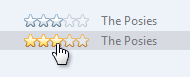

# Progressive Disclosure Controls

> [!NOTE]
> This design guide was created for Windows 7 and has not been updated for newer versions of Windows. Much of the guidance still applies in principle, but the presentation and examples do not reflect our [current design guidance](/windows/uwp/design/).

With a progressive disclosure control, users can show or hide additional information including data, options, or commands. Progressive disclosure promotes simplicity by focusing on the essential, yet revealing additional detail as needed.

Examples of progressive disclosure controls.

> [!Note]  
> Guidelines related to [layout](vis-layout.md), [menus](cmd-menus.md), and [toolbars](cmd-toolbars.md) are presented in separate articles.

 

## Is this the right control?

To decide, consider these questions:

-   **Do users need to see the information in some but not all scenarios, or some but not all of the time?** If so, displaying the information using progressive disclosure simplifies the baseline experience, yet allows users to access the information easily.

    

    In this example, the Windows Security app displays the important security status all the time, but uses progressive disclosure to display details on demand.

-   **If the information is displayed by default, are users ever likely to choose to hide it?** Are there scenarios where users will need more space? Are users sufficiently motivated to customize the user interface (UI)? If not, display the information without using progressive disclosure.

    **Incorrect:**

    

    In this example, users won't be motivated to hide the information.

-   **Is the additional information advanced, substantial, complex, or related to an independent subtask?** If so, consider displaying the information in a separate window using [command buttons](ctrl-command-buttons.md) or [links](ctrl-command-links.md) instead of using a progressive disclosure control. (Additional information is advanced if it is intended for advanced users. It's complex if it makes other information hard to read or lay out.)

    

    In this example, information about the software's name and publisher is meaningful primarily to advanced users, so links to separate windows are used.

-   **Is the additional information a sentence or sentence fragment that describes what an item does or how it can be used?** If so, consider using a [tooltip](ctrl-tooltips-and-infotips.md) or infotip.
-   **Is the additional information related to the current task, but independent of the currently displayed information?** If so, consider using [tabs](ctrl-tabs.md) instead. However, collapsible lists are often preferable to tabs because they are more flexible and scalable.
-   **Is showing or hiding the additional information essentially a data filter?** If so, consider using a [drop-down list](/windows/desktop/uxguide/ctrl-drop) or [check boxes](ctrl-check-boxes.md) instead to apply the filter to the entire list.

## Design concepts

The goals of progressive disclosure are to:

-   **Simplify a UI** by focusing on the essential, yet revealing additional detail as needed.
-   **Simplify a UI's appearance** by reducing the perception of clutter.

Both goals can be achieved by using progressive disclosure controls, where users click to see more detail. However, you can achieve the second goal of simplifying the appearance without using explicit progressive disclosure controls by:

-   **Showing contextual detail only in context.** For example, you can show contextual commands or toolbars automatically when relevant to the selected object or mode.
-   **Reducing the weight of affordances for secondary UI.** [Affordances](glossary.md) are visual properties that suggest how objects are used. The trend is to have UI that users can interact with in place, but to have all such UI drawn to scream "click me!" leads to too much visual clutter. For secondary UI, it is often better to use subtle affordances and give the full effects on mouse over.

    

    In this example, the Rating field is interactive, but doesn't appear so until mouse hover.

-   **Showing follow-up steps only after prerequisites are done.** This approach is best used with familiar tasks where users can confidently take the first steps.

    

    In this example, the user name and password page initially shows only the user name and optional password boxes. The confirmation and hint boxes are displayed after the user enters a password.

While progressive disclosure is a great way to simplify UIs, it has these risks:

-   **Lack of discoverability.** Users may assume that if they can't see something, it doesn't exist. Users may not hover or click if they don't see what they are looking for. There is always a chance that users might not click things like More options.
-   **Lack of stability.** Progressive disclosure should be expected or at least feel natural. If controls unexpectedly appear and disappear, the resulting UI can feel unstable.

### Progressive disclosure controls

Progressive disclosure controls are usually displayed without direct labels that describe their behavior, so users must be able to do the following based on the control's visual appearance alone:

-   Recognize that the control provides progressive disclosure.
-   Determine if the current state is expanded or collapsed.
-   Determine if additional information, options, or commands are needed to perform the task.
-   Determine how to restore the original state, if desired.

While users can determine the above by trial and error, you should try to make such experimentation unnecessary.

Progressive disclosure controls have a fairly weak [affordance](glossary.md), which means their visual properties suggest how they are used, albeit weakly. The following table compares the appearance of the common progressive disclosure controls:

| Control | Purpose  | Appearance | Glyph indicates |
|----------------------------------------------------------------------------------------------------------------------------------------------------------|-------------------------------------------------------------------------------------------------------------------------------------------------------------------------------------------------------------|--------------------------------------------------------------------------------------------------------------------------------|--------------------------------|
| **Chevrons**                    | **Show all:** Show or hide the remaining items in completely or partially hidden content. Items are either shown in place (using a single chevron) or in a pop-up menu (using a double chevron).  | Chevrons point in the direction where the action will occur.                                                         | Future state         |
| **Arrows**                        | **Show options:** Show a pop-up command menu.                                                                                                                                                     | Arrows point in the direction where the action will occur.                                                           | Future state         |
| **Plus and minus controls**    | **Expand containers:** Expand or collapse container content in place when navigating through a hierarchy.                                                                                         | Plus and minus symbols don't point, but the action always occurs to their right.                                     | Future state         |
| **Rotating triangles**                     | **Show details:** Show or hide additional information in place for an individual item. They are also used to expand containers.                                                                   | Rotating triangles somewhat resemble rotating levers, so they point in the direction where the action has occurred.  | Present state        |

 

**If you do only one thing...**

Users should be able to predict a progressive disclosure control's behavior correctly by inspection alone. To achieve this, select the appropriate usage patterns and apply their appearance, location, and behavior consistently.

## Usage patterns

Progressive disclosure controls have several usage patterns. Some of them are built into common controls.

### Chevrons

Chevrons show or hide the remaining items in completely or partially hidden content. Usually the items are shown in place, but they can also be shown in a pop-up menu. When in place, the item stays expanded until the user collapses it.

Chevrons are used in the following ways:

|      Usage                                                                                                                                                          |    Example                                                                                                                                                                                                                                                                                                             |
|----------------------------------------------------------------------------------------------------------------------------------------------------------------|-----------------------------------------------------------------------------------------------------------------------------------------------------------------------------------------------------------------------------------------------------------------------------------------------------------------|
| **In-place UI**  the associated object receives input focus and the single chevron is activated with the space bar.                        |   In these examples, the in-place single chevrons are positioned to the right of their associated control.                                                                             |
| **Command buttons with external labels**  the command button receives input focus and the single chevron is activated with the space bar.  |   In this example, the single chevron button is labeled and positioned to the left of the label. With this pattern, the button would be difficult to understand without its label.  |
| **Command buttons with internal labels**  the command button receives input focus and is activated with the space bar.                     |   In these examples, regular command buttons have the double chevron positioned to suggest their meaning.                                                                           |

 

### Arrows

Arrows show a pop-up command menu. The item stays expanded until the user makes a selection or clicks anywhere.

If the arrow button is an independent control, it receives input focus and is activated with the space bar. If the arrow button has a parent control, the parent receives input focus and the arrow is activated with Alt+down arrow and Alt+up arrow keys, as with the drop-down list control.

Arrows are used in the following ways:

|    Usage                                                                                   |    Example                                                                                                                                                                                                                                   |
|---------------------------------------------------------------------------------------|---------------------------------------------------------------------------------------------------------------------------------------------------------------------------------------------------------------------------------------|
| **Separate buttons**  the arrow is in a separate button control.  |   In these examples, separate arrow buttons positioned to the right indicate a command menu.                |
| **Command buttons**  the arrow is part of a command button.       |   In these examples, menu buttons and split buttons have the arrows positioned to the right of the text.  |

 

### Plus and minus controls

Plus and minus controls expand or collapse to show container content in place when navigating through a hierarchy. The item stays expanded until the user collapses it. Although these look like buttons, their behavior is in-place.

The associated object receives input focus. The plus is activated with the right arrow key, and the minus with the left arrow key.

Plus and minus controls are used in the following ways:

|       Usage                                                                                         |       Example                                                                                                                                                                                                                               |
|------------------------------------------------------------------------------------------------|--------------------------------------------------------------------------------------------------------------------------------------------------------------------------------------------------------------------------------------|
| **Collapsible trees**  a multi-level hierarchy to show container content.  |   In this example, the plus and minus controls are positioned to the left of the associated container.        |
| **Collapsible lists**  a two-level hierarchy to show container content.    |   In this example, the plus and minus controls are positioned to the left of the associated list header.  |

 

### Rotating triangles

Rotating triangles show or hide additional information in place for an individual item. They are also used to expand containers. The item stays expanded until the user collapses it.

The associated object receives input focus. The collapsed (right-pointing) triangle is activated with the right arrow key, and the expanded (downward-pointing) triangle with the left arrow key.

Rotating triangles are used in the following ways:

|     Usage                                                                                                       |    Example                                                                                                                                                                                                                             |
|------------------------------------------------------------------------------------------------------------|---------------------------------------------------------------------------------------------------------------------------------------------------------------------------------------------------------------------------------|
| **Collapsible trees**  a multi-level hierarchy to show container content.              |   In this example, the rotating triangles are positioned to the left of the associated container.        |
| **Collapsible lists**  a two-level hierarchy to show additional information in place.  |   In this example, the rotating triangles are positioned to the left of their associated list items.  |

 

### Preview arrows

Like chevrons, additional information is shown or hidden in place. The item stays expanded until the user collapses it. Unlike chevrons, the glyphs have a graphical representation of the action, typically with an arrow indicating what will happen.

In these examples from Microsoft Windows Media Player, the glyphs have arrows that suggest the action that will happen.

Preview arrows are best reserved for situations where a standard chevron doesn't adequately communicate the control's behavior, such as when the disclosure is complex or there is more than one type of disclosure.

## Guidelines

### General

-   **Select the progressive disclosure pattern based on its usage.** For a description of each usage pattern, see the previous table.
-   **Don't use links for progressive disclosure controls.** Use only the progressive disclosure controls presented in the Usage patterns section. However, do use links to navigate to [Help topics](winenv-help.md).

    **Correct:**

    

    **Incorrect:**

    

    In the incorrect example, a link is used to show more options in place. This usage would be correct if the link navigated to another page or dialog box, or displayed a Help topic.

### Interaction

-   **For chevrons and arrows that aren't directly labeled, use tooltips to describe what they do.**

    

    In this example, the tooltip indicates the effect of an unlabeled chevron control.

-   **If a user expands or collapses an item, make the state persist so it takes effect the next time the window is displayed**, unless users are likely to prefer starting in the default state. Make the state persist on a per-window, per-user basis.
-   **Make sure that all expanded content can be collapsed and vice versa, and that the inverse operation is obvious.** Doing so encourages exploration and reduces frustration. The best way to make the inverse operation obvious is to keep the control in the same fixed location. If you need to move the control, keep it in the same relative location within a visually distinct area.

    **Incorrect:**

    

    

    In this example, clicking the Replace button with the chevron reveals the **Replace with** text box. Once this is done, the Replace expander becomes the Replace command, so there is no way to restore the original state.

-   **Use only the access keys appropriate for the progressive disclosure pattern**, as listed in the Usage patterns section. Don't use Enter to activate progressive disclosure.

### Presentation

-   **Don't use triangular-shaped arrowheads for a purpose other than progressive disclosure.**

    **Incorrect:**

    

    Although this example isn't a progressive disclosure pattern, using an arrow here suggests that commands will be shown in a pop-up window.

    **Correct:**

    

    In this example, a bullet is correctly used instead.

-   **Remove (don't disable) progressive disclosure controls that don't apply in the current context.** Progressive disclosure controls should always deliver on their promise, so remove them when there isn't more information to give.

    **Incorrect:**

    

    In this example, a progressive disclosure control that doesn't apply is incorrectly disabled.

### Chevrons

-   **Use single chevrons to show or hide in place. Use double chevrons to show or hide using a pop-up menu.** You should always use double chevrons for command buttons with internal labels, however.

    **Correct:**

    

    **Incorrect:**

    

    In the incorrect example, a double chevron is used for in-place progressive disclosure.

    **Correct:**

    

    In this example, a double chevron is used for in-place progressive disclosure because it is a command button with an internal label.

-   **Provide a visual relationship between the chevron and its associated control.** Because in-place chevrons are placed to the right of their associated UI and right aligned, there can be quite a distance between a chevron and its associated control.

    **Correct:**

    

    In this example, there is a clear relationship between the in-place chevron and its associated UI.

    **Incorrect:**

    

    In this example, there is no clear visual relationship between the in-place chevron and its associated UI, so it seems to be floating in space.

### Arrows

-   **Don't use arrow graphics that could be confused with Back, Forward, Go, or Play.** Use simple triangular-shaped arrowheads (arrows without stems) on neutral backgrounds.

    **Correct:**

    

    These arrows are clearly progressive disclosure controls.

    **Incorrect (for progressive disclosure):**

    

    These arrows don't look like progressive disclosure controls.

    **Incorrect (for Back, Forward):**

    

    These arrows look like progressive disclosure controls, but they are not.

## Recommended sizing and spacing

Recommended sizing and spacing for progressive disclosure controls.

## Labels

-   For chevrons on a command button with an external label:
    -   Assign a unique [access key](glossary.md). For guidelines, see [Keyboard](inter-keyboard.md).
    -   Use [sentence-style capitalization](glossary.md).
    -   Write the label as a phrase and use no ending punctuation.
    -   Write the label so that it describes the effect of clicking the button, and change the label when the state changes.
    -   If the surface always displays some options, commands, or details, use the following label pairs:
        -   **More/Fewer options.** Use for options or a mixture of options, commands, and details.
        -   **More/Fewer commands.** Use for commands only.
        -   **More/Fewer details.** Use for information only.
        -   **More/Fewer <object name>.** Use for other object types, such as folders.
    -   Otherwise:
        -   **Show/Hide options.** Use for options or a mixture of options, commands, and details.
        -   **Show/Hide commands.** Use for commands only.
        -   **Show/Hide details.** Use for information only.
        -   **Show/Hide <object name>.** Use for other object types, such as folders.
-   For chevrons on a command button with an internal label, follow the standard [command button](ctrl-command-buttons.md) guidelines.

## Documentation

When referring to progressive disclosure controls:

-   If the control has a fixed label, refer to the control by its label only; don't try to describe the control. Use the exact label text, including its capitalization, but don't include the access key underscore.
-   If the control has no label or it isn't fixed, refer to the control by its type: chevron, arrow, triangle, or plus/minus button. If necessary, also describe the control's location. If the control appears dynamically, such as the [page space](glossary.md) control, start the reference by describing how to make the control appear.

    **Example:** To display the files within a folder, move the pointer to the start of the folder name, and then click the triangle next to the folder.

-   Don't refer to the control as a button, unless to contrast with other progressive disclosure controls that aren't buttons.
-   To describe user interaction, use click. If needed for clarity, use click...to expand or collapse.
-   When possible, format the label using bold text. Otherwise, put the label in quotation marks only if required to prevent confusion.

Examples:

-   (For a chevron) To determine the file size, click **Details**.
-   (For an arrow) To see all the options, click the arrow next to the **Search** box.
-   (For plus/minus) To view your picture, click **Pictures**.
