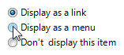
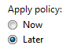
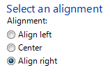
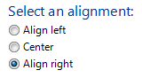

# Radio Buttons

> [!NOTE]
> This design guide was created for Windows 7 and has not been updated for newer versions of Windows. Much of the guidance still applies in principle, but the presentation and examples do not reflect our [current design guidance](/windows/uwp/design/).

With a radio button, users make a choice among a set of mutually exclusive, related options. Users can choose one and only one option. Radio buttons are so called because they function like the channel presets on radios.

A typical group of radio buttons.

A group of radio buttons behaves like a single control. Only the selected choice is accessible using the Tab key, but users can cycle through the group using the arrow keys.

> [!Note]  
> Guidelines related to [layout](vis-layout.md) and [keyboard navigation](inter-keyboard.md) are presented in a separate article.

 

## Is this the right control?

To decide, consider these questions:

-   **Is the control used to choose one option from a set of mutually exclusive choices?** If not, use another control. To choose multiple options, use [check boxes](ctrl-check-boxes.md), a [multiple-selection list](ctrl-list-boxes.md) or a check box list instead.
-   **Is the number of options between two and seven?** Since the screen space used is proportional to the number of options, keep the number of options in a group between two and seven. For eight or more options, use a [drop-down list](/windows/desktop/uxguide/ctrl-drop) or [single-selection list](ctrl-list-boxes.md).
-   **Would a check box be a better choice?** If there are only two options, you could use a single [check box](ctrl-check-boxes.md) instead. However, check boxes are suitable only for turning a single option on or off, whereas radio buttons can be used for completely different alternatives. If both solutions are possible:
    -   Use radio buttons if the meaning of the cleared check box isn't completely obvious.

        **Incorrect:**

        

        **Correct:**

        

        In the correct example, the choices are not opposites so radio buttons are the better choice.

    -   Use radio buttons on wizard pages to make the alternatives clear, even if a check box is otherwise acceptable.
    -   Use radio buttons if you have enough screen space and the options are important enough to be a good use of that screen space. Otherwise, use a check box or drop-down list.

        **Incorrect:**

        

        In this example, the options aren't important enough to use radio buttons.

        **Correct:**

        

        In this example, a check box is an efficient use of screen space for this peripheral option.

    -   Use a check box if there other check boxes on the page.

-   **Would a drop-down list be a better choice?** If the default option is recommended for most users in most situations, radio buttons might draw more attention to the options than necessary.
    -   Consider using a drop-down list if you don't want to draw attention to the options, or you don't want to encourage users to make changes. A drop-down list focuses on the current selection, whereas radio buttons emphasize all options equally.

        

        In this example, a drop-down list focuses on the current selection and discourages users from making changes.

    -   Consider a drop-down list if there are other drop-down lists on the page.

-   **Would a set of command buttons, command links, or a split button be a better choice?** If the radio buttons are used only to affect how a command is performed, it is often better to present the command variations instead. Doing so allows users to choose the right command with a single interaction.
-   **Do the options present program options, rather than data?** The options' values shouldn't be based on context or other data. For data, use a drop-down list or single-selection list.
-   If the control is used on a wizard page or control panel, **is the control a response to the main instruction and can users later change the choice?** If so, consider using command links instead of radio buttons to make the interaction more efficient.
-   **Are the values non-numeric?** For numeric data, use [text boxes](ctrl-text-boxes.md), [drop-down lists](/windows/desktop/uxguide/ctrl-drop), or [sliders](ctrl-sliders.md).

## Guidelines

### General

-   **List the options in a logical order,** such as most likely to be selected to least, simplest operation to most complex, or least risk to most. Alphabetical ordering is not recommended because it is language dependent and therefore not localizable.
-   **If none of the options is a valid choice, add another option to reflect this choice,** such as None or Does not apply.
-   **Prefer to align radio buttons vertically instead of horizontally.** Horizontal alignment is harder to read and localize.

    **Correct:**

    

    In this example, the radio buttons are aligned vertically.

    **Incorrect:**

    

    In this example, the horizontal alignment is harder to read.

-   **Reconsider using group boxes to organize groups of radio buttons**—this often results in unnecessary screen clutter.
-   **Don't use radio button labels as group box labels.**
-   **Don't use the selection of a radio button to:**
    -   Perform commands.
    -   Display other windows, such as a dialog box to gather more input.
    -   Dynamically show or hide other controls related to the selected control (screen readers cannot detect such events). However, you can change text dynamically based on the selection.

### Subordinate controls

-   Place subordinate controls to the right of or below (indented, flush with the radio button label) the radio button and its label. End the radio button label with a colon.

    

    In this example, the radio button and its subordinate control share the radio button label and its access key. In this case, the arrow keys move focus from the radio button to its subordinate text box.

-   **Leave dependent editable text boxes and drop-down lists enabled if they share the radio button's label.** When users type or paste anything into the box, select the corresponding option automatically. Doing so simplifies the interaction.

    

    In this example, entering a page number automatically selects Pages.

-   **Avoid nesting radio buttons with other radio buttons or check boxes.** If possible, keep all the options at the same level.

    **Correct:**

    

    In this example, the options are at the same level.

    **Incorrect:**

    

    In this example, using nested options adds unnecessary complexity.

-   If you do nest radio buttons with other radio buttons or check boxes, **disable these subordinate controls until the high-level option is selected.** Doing so avoids confusion about the meaning of the subordinate controls.

### Default values

-   Because a group of radio buttons represents a set of mutually exclusive choices, **always have one radio button selected by default. Select the safest (to prevent loss of data or system access) and most secure and private option.** If safety and security aren't factors, select the most likely or convenient option.
-   **Exceptions:** Don't have a default selection if:
    -   **There is no acceptable default option for safety, security, or legal reasons and therefore the user must make an explicit choice.** If the user doesn't make a selection, display an error message to force one.
    -   **The user interface (UI) must reflect the current state and the option hasn't been set yet.** A default value would incorrectly imply that the user doesn't need to make a selection.
    -   **The goal is to collect unbiased data.** Default values would bias data collection.
    -   **The group of radio buttons represents a property in a mixed state**, which happens when displaying a property for multiple objects that don't have the same setting. Don't display an error message in this case since each object has a valid state.
-   **Make the first option the default option**, since users often expect that—unless that order isn't logical. To do this, you might need to change the option labels.

    **Incorrect:**

    

    In this example, the default option isn't the first option.

    **Correct:**

    

    In this example, the option labels are reworded to make the first option the default option.

## Recommended sizing and spacing

Recommended sizing and spacing for radio buttons.

## Labels

### Radio button labels

-   Label every radio button.

<!-- -->

-   Assign a unique [access key](glossary.md) to each label. For guidelines, see [Keyboard](inter-keyboard.md).
-   Use [sentence-style capitalization](glossary.md).
-   Write the label as a phrase, not as a sentence, and use no ending punctuation.
    -   **Exception:** If a radio button label also labels a subordinate control that follows it, end the label with a colon.
-   Use parallel phrasing, and try to keep the length about the same for all labels.
-   Focus the label text on the differences among the options. If all the options have the same introductory text, move that text to the group label.
-   Use positive phrasing. For example, use do instead of do not, and print instead of do not print.
-   Describe just the option with the label. Keep labels brief so it's easy to refer to them in messages and documentation. If the option requires further explanation, provide the explanation in a [static text](glossary.md) control using complete sentences and ending punctuation.

    

    In this example, the options are explained using separate static text controls.

    > [!Note]  
    > Adding an explanation to one radio button doesn't mean that you have to provide explanations for all the radio buttons. Provide the relevant information in the label if you can, and use explanations only when necessary. Don't merely restate the label for consistency.

     

-   **If an option is strongly recommended, add "(recommended)" to the label.** Be sure to add to the control label, not the supplemental notes.
-   **If an option is intended only for advanced users, add "(advanced)" to the label.** Be sure to add to the control label, not the supplemental notes.
-   If you must use multi-line labels, align the top of the label with the radio button.
-   Don't use a subordinate control, the values it contains, or its units label to create a sentence or phrase. Such a design isn't localizable because sentence structure varies with language.

### Radio button group labels

-   Use the group label to explain the purpose of the group, not how to make the selection. Assume that users know how to use radio buttons. For example, don't say "Select one of the following choices".
-   All radio button groups need labels. Write the label as a word or phrase, not as a sentence, ending with a colon using static text or a group box.

    **Exception:** Omit the label if it is merely a restatement of a dialog box's [main instruction](glossary.md). In this case, the main instruction takes the colon (unless it's a question) and access key (if there is one).

    **Acceptable:**

    

    In this example, the radio button group label is just a restatement of the main instruction.

    **Better:**

    

    In this example, the redundant label is removed, so the main instruction takes the colon.

-   Don't assign an access key to the label. Doing so isn't necessary and it makes the other access keys harder to assign.
    -   **Exception:** If not all controls can have unique access keys, you can assign an access key to the label instead of the individual controls. For more information, see [Keyboard](inter-keyboard.md).

## Documentation

When referring to radio buttons:

-   Use the exact label text, including its capitalization, but don't include the access key underscore or colon.
-   In programming and other technical documentation, refer to radio buttons as radio buttons. Everywhere else use option buttons, especially in user documentation.
-   To describe user interaction, use click.
-   When possible, format the label using bold text. Otherwise, put the label in quotation marks only if required to prevent confusion.

Example: Click **Current page**, and then click **OK**.

 

 