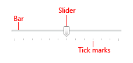
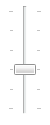
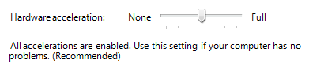
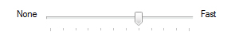
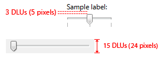
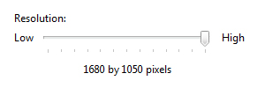

# Sliders (Design basics)

> [!NOTE]
> This design guide was created for Windows 7 and has not been updated for newer versions of Windows. Much of the guidance still applies in principle, but the presentation and examples do not reflect our [current design guidance](/windows/uwp/design/).

With a slider, users can choose from a continuous range of values. A slider has a bar that shows the range and an indicator that shows the current value. Optional tick marks show values.

A typical slider.

> [!Note]  
> Guidelines related to [layout](vis-layout.md) are presented in a separate article.

 

## Is this the right control?

Use a slider when you want your users to be able to **set defined, contiguous values (such as volume or brightness) or a range of discrete values (such as screen resolution settings).**

A slider is a good choice when you know that users think of the value as a relative quantity, not a numeric value. For example, users think about setting their audio volume to low or medium—not about setting the value to 2 or 5.

To decide, consider these questions:

-   **Does the setting seem like a relative quantity?** If not, use [radio buttons](ctrl-radio-buttons.md), or a [drop-down](/windows/desktop/uxguide/ctrl-drop) or [single-selection list](ctrl-list-boxes.md).
-   **Is the setting an exact, known numeric value?** If so, use a [numeric text boxes](ctrl-text-boxes.md).
-   **Would a user benefit from instant feedback on the effect of setting changes?** If so, use a slider. For example, users can choose a color more easily by immediately seeing the effect of changes to hue, saturation, or luminosity values.
-   **Does the setting have a range of four or more values?** If not, use radio buttons.
-   **Can the user change the value?** Sliders are for user interaction. If a user can't ever change the value, use a read-only [text box](ctrl-text-boxes.md) instead.

If a slider or a numeric text box is possible, use a numeric text box if:

-   Screen space is tight.
-   A user is likely to prefer using the keyboard.

Use a slider if:

-   Users will benefit from instant feedback.

## Guidelines

-   **Use a natural orientation.** For example, if the slider represents a real-world value that is normally shown vertically (such as temperature), use a vertical orientation.
-   **Orient the slider to reflect the culture of your users.** For example, Western cultures read from left to right, so for horizontal sliders, put the low end of the range on the left and the high end on the right. For cultures that read from right to left, do the opposite.
-   **Size the control so that a user can easily set the desired value.** For settings with discrete values, make sure the user can easily select any value using the mouse.
-   **Consider using a non-linear scale if the range of values is large and users will likely select values at one end of the range.** For example, time value might be 1 minute, 1 hour, 1 day, or 1 month.
-   **Whenever practical, give immediate feedback while or after a user makes a selection.** For example, the Microsoft Windows volume control beeps to indicate the resulting audio volume.
-   **Use labels to show the range of values.**

    **Exception:** If the slider is vertically oriented and the top label is Maximum, High, More, or equivalent, you can omit the other labels since the meaning is clear.

    

    In this example, the slider's vertical orientation makes the range labels unnecessary.

-   **Use tick marks when users need to know the approximate value of the setting.**
-   **Use tick marks and a value label when users need to know the exact value of the setting they choose.** Always use a value label if a user needs to know the units to make sense of the setting.

    

    In this example, a label is used to clearly indicate the selected value.

-   **For horizontally-oriented sliders, place tick marks under the slider.** For vertically-oriented sliders, place tick marks to the right for Western cultures; for cultures that read from right to left, do the opposite.
-   **Place the value label completely under the slider control so that the relationship is clear.**

    **Incorrect:**

    

    In this example, the value label isn't aligned under the slider.

-   **When disabling a slider, also disable any associated labels.**
-   **Don't use both a slider and a numeric text box for the same setting.** Use only the more appropriate control.

    **Exception:** Use both controls when the user needs both immediate feedback and the ability to set an exact numeric value.

-   **Don't use a slider as a progress indicator.**
-   **Don't change the size of the slider indicator from the default size.**

    **Incorrect:**

    

    In this example, a size smaller than the default is used.

    **Correct:**

    

    In this example, the default size is used.

-   **Don't label every tick mark.**

## Recommended sizing and spacing

Recommended sizing and spacing for sliders.

## Labels

### Slider labels

-   Use a static text label ending with a colon, or a group box label with no ending punctuation.
-   Assign a unique access key to each label. For assignment guidelines, see [Keyboard](inter-keyboard.md).
-   Use sentence-style capitalization.
-   Position the slider label either to the left of the slider, or above and aligned with the left edge of the slider (or its left range identifier, if present).

### Range labels

-   Label the two ends of the slider range, unless a vertical orientation makes this unnecessary.
-   Use only word, if possible, for each label.
-   Don't use ending punctuation.
-   Make sure these labels are descriptive and parallel. Examples: Maximum/Minimum, More/Less, Low/High, Soft/Loud.
-   Use sentence-style capitalization.
-   Don't assign access keys.

### Value labels

-   If you need a value label, display it below the slider.
-   Center the text relative to the control and include the units (such as pixels).

    

    In this example, the value label is centered under the slider and includes the units.

## Documentation

When referring to sliders:

-   Use the exact label text, including its capitalization, and include the word slider. Don't include the access key underscore or colon.
-   To describe user interaction, use move.
-   When possible, format the label using bold text. Otherwise, put the label in quotation marks only if required to prevent confusion.

Example: To increase your screen resolution, move the **Screen resolution** slider to the right.

## Related topics

<dl> <dt>

[Glossary](glossary.md)
</dt> </dl>

 

 