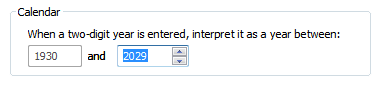

# Spin Controls

> [!NOTE]
> This design guide was created for Windows 7 and has not been updated for newer versions of Windows. Much of the guidance still applies in principle, but the presentation and examples do not reflect our [current design guidance](/windows/uwp/design/).

With a spin control, users can click arrow buttons to change incrementally the value within its associated [numeric text box](ctrl-text-boxes.md). The term spin box refers to the combination of a text box and its associated spin control.

A typical spin box.

Users often prefer spin controls because they can make changes without moving their hands from the mouse. When the spin control is paired with a text box, users can type or paste input directly in the text box, so use of the spin control is optional.

While spin controls are used for numeric input, the input doesn't have to be a pure whole number. The input can be decimal numbers and it can have negative signs, delimiters (such as colons or hyphens), and unit modifiers.

> [!Note]  
> Guidelines related to [text boxes](ctrl-text-boxes.md) and [layout](vis-layout.md) are presented in separate articles.

 

## Is this the right control?

To decide, consider these questions:

-   **Is the control used for numeric input?** If not, use another control, such as a [drop-down list](/windows/desktop/uxguide/ctrl-drop) or [slider](ctrl-sliders.md), to select from a fixed set of values. Use scroll bars for scrolling.
-   **Do users think of the value as a relative quantity, not a numeric value?** If so, use a slider instead. Use spin boxes only for exact, known numeric values. For example, users think about setting their audio volume to low or medium—not about setting the value to 2 or 5.
-   **Is the control paired with a text box?** If not, don't use. Spin controls shouldn't be used alone or with other types of controls besides a text box.

    **Incorrect:**

    

    In this example, a spin control is used to control a dynamic graphic.

-   **Are contiguous value ranges valid?** If not, use a drop-down list of valid values instead.

    

    In this example, not all disk drive numbers are valid, so a drop-down list is a better choice.

-   **Is using the spin control practical?** Using a spin control is practical for:

    -   Entering a small number, typically under 100.
    -   Making small changes to an existing or default value.

    While spin controls can be used for any numeric input, they are inefficient in situations other than these.

-   **Is the spin control helpful?** Is the control used in a context where users are likely to be using their mouse? If not, consider a spin control optional.
-   **Are the sibling controls drop-down lists?** If there are other drop-down lists, consider using a drop-down list for consistency.

    

    In this example, a spin box could be used, but a drop-down list is used for consistency.

-   **Are touch or pen users a primary target?** If so, consider using a drop-down list instead. The arrow buttons in a spin control are too small to be used efficiently with touch or a pen.

If a slider or a spin box is possible, use a spin box if:

-   Screen space is tight.
-   A user is likely to prefer using the keyboard.

Use a slider if:

-   Users will benefit from instant feedback.

## Guidelines

### General

-   **Use spin controls whenever they are practical and helpful.** See [Is this the right control?](#is-this-the-right-control)

    -   **Exception:** To be consistent with other text boxes on the same user interface (UI), use spin controls even if they aren't always practical.

    **Correct:**

    

    In this example, a spin control is used with the year control for consistency, even though it isn't always practical.

    **Incorrect:**

    

    In this example, the spin control is unusable.

-   **Always make a spin control the "buddy" of the text box.** Doing so places the spin control inside the text box.

    **Correct:**

    

    **Incorrect:**

    

    In the correct example, the spin control is placed inside its associated text box.

-   **Disable a spin control when its associated text box is disabled.** The spin control is a supplemental input method—never the only input method.

### Values

-   **Define the top button to increase the value by one unit and the bottom button to decrease by one unit.** Typically, the unit is one, but it should be the smallest common change in value. Ideally, the spin control should cover all valid values, and it should be more convenient than typing in the text.

    

    In this example, clicking a spin control changes the values by .1, which is the smallest common change in value. Using a smaller unit would cover the range of valid values but make the spin controls unusable.

-   **Use the spin control to limit input to valid values.** Using a spin control should never result in an incorrect value.
-   **At the end of a range of valid values, restart the range.** The spin control metaphor is that the user is spinning a wheel of values, hence this wheel-like behavior.
    -   **Exception:** Don't restart the range if the resulting value is certain to be incorrect.

        

        In this example, clicking the down arrow button doesn't restart the range (by going to the maximum value) because that value is certain to be incorrect.

-   **Use text instead of special numeric values.** Allow users to spin to these special values instead of having to know them and type them in.

    

    In this example, Never is a special value but users can spin to it.

-   **If the value has delimiters, the associated text box should have multiple input focus points.** Doing so allows the numeric segments to be manipulated individually.

    

    In this example, the spin control affects the values for hours, minutes, seconds, and A.M./P.M.—whichever has the focus.

-   **If the value has units, use the spin control to change those units as well.**

    

    In this example, the spin control can be used to change units.

## Labels

-   Apply the [text box labeling](ctrl-text-boxes.md) guidelines to label the associated text box. Spin controls are never labeled directly.

## Documentation

When referring to spin controls:

-   Don't refer to spin controls in user documentation. Instead, refer to the label of the associated text box.
-   Refer to spin controls and spin boxes only in programming and other technical documentation.

Example: In the **Date** box, type or select the part of the date you want to change.

## Related topics

<dl> <dt>

[Glossary](glossary.md)
</dt> </dl>

 

 