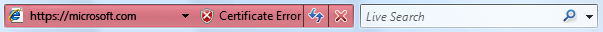
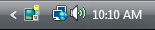

# Status Bars (Design basics)

> [!NOTE]
> This design guide was created for Windows 7 and has not been updated for newer versions of Windows. Much of the guidance still applies in principle, but the presentation and examples do not reflect our [current design guidance](/windows/uwp/design/).

A status bar is an area at the bottom of a primary window that displays information about the current window's state (such as what is being viewed and how), background tasks (such as printing, scanning, and formatting), or other contextual information (such as selection and keyboard state).

Status bars typically indicate status through text and icons, but they can also have progress indicators, as well as menus for commands and options related to status.

A typical status bar.

> [!Note]  
> Guidelines related to the [notification area](winenv-notification.md) are presented in a separate article.

 

## Is this the right user interface?

To decide, consider these questions:

-   **Is the status relevant when users are actively using other programs?** If so, use a [notification area icons](winenv-notification.md).
-   **Does the status item need to display notifications?** If so, you must use a notification area icon.
-   **Is the window a primary window?** If not, don't use a status bar. Dialog boxes, wizards, control panels, and property sheets shouldn't have status bars.
-   **Is the information primarily status?** If not, don't use a status bar. Status bars must not be used as a secondary [menu bar](cmd-menus.md) or [toolbar](cmd-toolbars.md).
-   **Does the information explain how to use the selected control?** If so, display the information next to the associated control using a supplemental explanation or instruction label instead.
-   **Is the status useful and relevant? That is, are users likely to change their behavior as a result of this information?** If not, either don't display the status, or put it in a log file.
-   **Is the status critical? Is immediate action required?** If so, display the information in a form that demands attention and cannot be easily ignored, such as a [dialog box](win-dialog-box.md) or within the primary window itself.

    

    A red address bar in Windows Internet Explorer.

-   **Is the program intended primarily for novice users?** Inexperienced users are generally unaware of status bars, so reconsider the use of status bars in this case.

## Design concepts

Status bars are a great way to provide status information without interrupting users or breaking their flow. However, status bars are easy to overlook. So easy, in fact, that many users don't notice status bars at all.

The solution to this problem isn't to demand the user's attention by using garish icons, animation, or flashing, but to design for this limitation. You can do this by:

-   **Making sure that the status information is useful and relevant.** If not, don't provide a status bar at all.
-   **Not using status bars for crucial information.** Users should never have to know what is in the status bar. If users must see it, don't put it in a status bar.

**If you do only one thing...**

Make sure that the status bar information is useful and relevant but not crucial.

## Usage patterns

Status bars have several usage patterns:

|                                                                                                                                    |                                                                                                                                                                                                                                 |
|------------------------------------------------------------------------------------------------------------------------------------|---------------------------------------------------------------------------------------------------------------------------------------------------------------------------------------------------------------------------------|
| **Current window status**  Show the source of what is being displayed along with any view modes                |   In this example, the status bar displays the path to the document.                                                          |
| **Progress**  Show the progress of background tasks, either with a determinate progress bar or an animation.   |   In this example, the status bar includes a progress bar to show the Web page loading into a Internet Explorer window.  |
| **Contextual information**  Show contextual information about what the user is currently doing.                |   In this example, Microsoft Paint shows the selection size in pixels.                                            |

 

## Guidelines

### General

-   Consider providing a View Status Bar command if only some users will need the status bar information. Hide the status bar by default if most users won't need it.
-   Don't use the status bar to explain menu bar items. This help pattern isn't discoverable.

### Presentation

-   Disable modal status that doesn't apply. Modal status includes keyboard and document states.
-   Remove non-modal status that doesn't apply.
-   Present status information in the following order: current window status; progress; and contextual information.

### Icons

-   Choose easily recognizable status icon designs. Prefer icons with unique outlines over square or rectangular shaped icons.
-   Use swaths of pure red, yellow, and green only to communicate status information. Otherwise, such icons are confusing.

    **Correct:**

    

    **Incorrect:**

    

    In the incorrect example, the red icon unintentionally suggests an error, creating confusion.

-   Use icon variations or overlays to indicate status or status changes. Use icon variations to show changes in quantities or strengths. For other types of status, use these standard overlays: 

    |                                                                                               |                                  |
    |-----------------------------------------------------------------------------------------------|----------------------------------|
    | **Overlay**                                                                         | **Status**             |
    |                  | Warning                |
    |                    | Error                  |
    |   | Disabled/Disconnected  |
    |         | Blocked/Offline        |

    

     

-   Don't change status too frequently. Status bar icons shouldn't appear noisy, unstable, or demand attention. The eye is sensitive to changes in the peripheral field of vision, so status changes need to be subtle.
-   For icons that provide important status information, prefer in-place labels.
-   Unlabeled status bar icons should have tooltips.

For more information, see [Icons](vis-icons.md).

### Interaction

-   Make a status bar area interactive to allow users direct access to related commands and options.
    -   Use a control that looks and behaves like a [menu button](ctrl-command-buttons.md) or a split button. These status bar areas must have a drop-down arrow to indicate that they are clickable.
    -   Display the menu on left-click on mouse down, not mouse up.
    -   Don't support right-clicking or double-clicking. Users don't expect such interactions in a status bar, so they aren't likely to attempt them.
-   Display tooltips on hover.

## Text

-   Generally, use concise labels. Cut any text that can be eliminated.
-   Prefer sentence fragments, without ending punctuation. Use full sentences (with ending punctuation) only when sentence fragments aren't significantly shorter.
-   For optional progress labels, indicate what the operation is doing with a label that starts with a verb (gerund form) and ends with an ellipsis. For example: "Copying...". This label may change dynamically if the operation has multiple steps or is processing multiple objects.
-   Don't use color, bold, or italic to emphasize status bar text.
-   For tooltip phrasing guidelines, see [Tooltips and Infotips](ctrl-tooltips-and-infotips.md).

## Documentation

Refer to status bars as status bars, not status lines or other variations. Example: "The current page number is displayed on the status bar."

 

