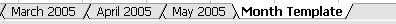
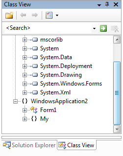
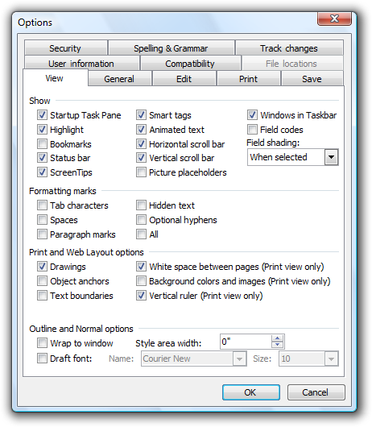
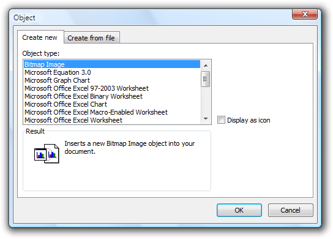
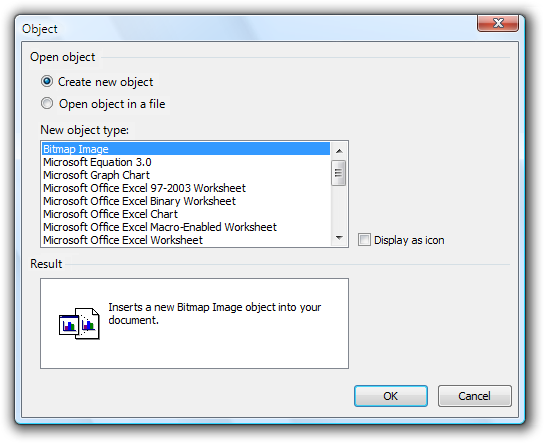

# Tabs

> [!NOTE]
> This design guide was created for Windows 7 and has not been updated for newer versions of Windows. Much of the guidance still applies in principle, but the presentation and examples do not reflect our [current design guidance](/windows/uwp/design/).

Tabs provide a way to present related information on separate labeled pages.

A typical set of tabs.

Tabs are usually associated with property windows (and vice versa), but tabs can be used in any type of window.

Tab controls represent the tabbed manila folders used to organize information in filing cabinets commonly found in the United States. (Manila folders aren't used worldwide.)

> [!Note]  
> Guidelines related to [layout](vis-layout.md), [tab menus](cmd-menus.md), [dialog boxes](win-dialog-box.md), and [property windows](win-property-win.md) are presented in separate articles.

 

## Is this the right control?

To decide, consider these questions:

-   **Can the controls comfortably fit on a single, reasonably sized page?** If so, use a single page.
-   **Is there only one tab?** If so, use a single page.
-   **Are the tabs related to each other in some obvious way?** If not, consider splitting the information into separate windows of related information.
-   **If used for settings, are settings on different pages completely independent?** Will changing a setting on one page affect settings on other pages? If they're not independent, use task pages or a [wizard](win-wizards.md) instead.
-   **Are the tabs mostly peers of each other, or is there a hierarchical relationship?** If hierarchical, consider using progressive disclosure or child [dialog boxes](win-dialog-box.md) to show related information.
-   **Are the tabs used to display steps within a task?** You can use "tabs" to display steps within a task only if they are presented to look like steps, and there is an obvious, alternative way to get to the text step, such as a Next button. Otherwise, if the steps are required, use pages in a page flow or a [wizard](win-wizards.md). If the steps are optional, display the optional steps using modal [dialog boxes](win-dialog-box.md) instead.
-   **Are the tabs different views of the same data?** If so, consider using a [split button](ctrl-command-buttons.md) or [drop-down list](/windows/desktop/uxguide/ctrl-drop) to change views. While tabs can be used effectively for changing views, the alternatives are more lightweight.

## Usage patterns

Tabs have several usage patterns:

|                                                                                                                                                                                                         |                                                                                                                                                                                                                                                                                                                                                                     |
|---------------------------------------------------------------------------------------------------------------------------------------------------------------------------------------------------------|---------------------------------------------------------------------------------------------------------------------------------------------------------------------------------------------------------------------------------------------------------------------------------------------------------------------------------------------------------------------|
| **Dynamic window surface**  like scroll bars, tabs can be used to increase the window surface area to show related information.                                                     | With this pattern, using tabs is conceptually similar to placing all the information on the tabs linearly on a single scrollable surface, with the tab labels as headings.     In this example, tabs effectively increase the window surface area.                           |
| **Multiple views**  like split buttons or drop-down lists, tabs can be used to show different views of the same or related information.                                             |   In this example, tabs change views within a document.                                                                                                                                                                                                          |
| **Multiple documents**  like multiple windows, tabs can be used to show different documents in a single window.                                                                     |     In these examples, tabs show different documents within a single application window.                                                                                        |
| **Exclusive options**  like radio buttons, tabs can be used to present multiple exclusive choices. in this pattern, only the selected tab applies and all other tabs are ignored.   |   In this example, tabs are used (incorrectly) as a substitute for radio buttons.  **This pattern is not recommended** because it uses a nonstandard behavior. The tabs behave as a setting instead of purely a way to navigate within the window.   |

 

**If you do only one thing...**

Make sure the information on the tabs is related, yet settings on different pages are independent. The last tab selected should have no special meaning.

## Guidelines

### General

-   **Use horizontal tabs if:**
    -   The window has seven or fewer tabs.
    -   **All the tabs fit on one row, even when the user interface (UI) is localized.**
-   **Use vertical tabs if:**
    -   The property window has eight or more tabs.
    -   **Using horizontal tabs would require more than one row.**

        

        In this example, vertical tabs accommodate eight or more tabs.

-   **Don't nest tabs or combine horizontal tabs with vertical tabs.** Instead, reduce the number of tabs, use only vertical tabs, or use another control such as a drop-down list.
-   **Don't scroll horizontal tabs.** Horizontal scrolling isn't readily discoverable. You may scroll vertical tabs, however.

    **Incorrect:**

    

    In this example, the horizontal tabs are scrolled.

-   For tabs on a resizable window or pane, put a scrollbar, when needed, on the page, not the window or pane. The tabs should always be visible and not scroll out of view.

    

    In this example, the tab page has the scrollbar, not the pane.

-   **Make sure the tabs look like tabs and not another type of control.**

    **Incorrect:**

    

    In this example, these tabs look like command buttons.

### Interaction

-   **When controls apply only to a page, place them within the border of the tabbed page.**
-   **When controls apply to the entire window, place them outside the tabbed page.**
-   **Don't assign effects to changing tabs.** Tabs must be accessible in any order. Changing the current tab should never have side effects, apply settings, or result in an error message.
-   **Don't assign a special meaning to the last tab selected.** Tab selection is for navigation the user's last tab selection isn't a setting.
-   **Don't make the settings on a page dependent on settings on other pages.** Put any dependent settings on the same page instead.
-   **If users are likely to start with the last tab displayed, make the tab persist and select it by default.** Make the settings persist on a per-window, per-user basis. Otherwise, select the first page by default.

### Icons

-   **Don't put icons on tabs.** Icons usually add unnecessary visual clutter, consume screen space, and often don't improve user comprehension. Only add icons that aid in comprehension, such as standard symbols.

    **Incorrect:**

    

    In this example, the icons add visual clutter and do little to improve user comprehension.

    **Exception:** You can use clearly recognizable icons if there might be insufficient space to display meaningful labels:

    **Correct:**

    

    In this example, the window is so narrow that icons better communicate the tabs than the labels.

-   **Don't use product logos for tab graphics.** Tabs aren't for [branding](exper-branding.md).

### Dynamic window surface pattern

-   **Don't use scroll bars on tab pages.** Tabs function similarly to scroll bars to increase the effective area of a window. One mechanism should be sufficient.
-   **Use concise tab labels.** Use one or two words that clearly describe the content of the page. Longer labels consume screen space, especially when the labels are localized.
-   **Use specific, meaningful tab labels.** Avoid generic tab labels that could apply to any tab, such as General, Advanced, or Settings.
-   **If a tab doesn't apply to the current context and users don't expect it to, remove it.** Doing so simplifies the UI and users won't miss it.

    **Incorrect:**

    

    In this example, the File Locations tab is incorrectly disabled when Microsoft Word is used as an e-mail editor. Rather than disabling this tab, it should be removed because users wouldn't expect to view or change file locations in this context.

-   **If a tab doesn't apply to the current context and users might expect it to:**

    -   Display the tab.
    -   Disable the controls on the page.
    -   Include text explaining why the controls are disabled.

    Don't disable the tab, because doing so isn't self-explanatory and prohibits exploration. Users looking for a specific value would be forced to look on all other tabs.

    

    In this example, none of the View options apply in Reading Layout. However, users might expect them to apply based on the tab label, so the page is displayed but the options are disabled.

### Multiple views and documents patterns

-   **Use the view or document names on tab labels.**
-   **Avoid excessively long tab names.** If necessary, either have a maximum name size or truncate the displayed tab label using ellipses. Longer labels consume screen space, especially when the labels are localized.
-   **If a tab doesn't apply to the current context, remove the tab.**

### Exclusive options pattern

-   **Don't use this pattern!** Use radio buttons or a drop-down list instead.

    **Incorrect:**

    

    In this example, tabs are incorrectly used as a substitute for radio buttons.

    **Correct:**

    

    In this example, radio buttons are correctly used instead.

## Labels

-   Label tabs based on their pattern. Use nouns rather than verbs, without ending punctuation. See the preceding pattern guidelines for more information.
-   Use sentence-style capitalization.
-   Don't assign an access key. Tabs are accessible through their shortcut keys (Ctrl+Tab, Ctrl+Shift+Tab, Ctrl+PgUp, Ctrl+PgDn). There is a shortage of good access key choices, so not assigning access keys to tabs makes it easier to assign them to other controls.

## Documentation

When referring to tabs:

-   Use the exact label text, including its capitalization, and include the word tab.
-   To describe user interaction, use click.
-   When possible, format the label using bold text. Otherwise, put the label in quotation marks only if required to prevent confusion.
-   Because multiple uses can be ambiguous, especially for a worldwide audience, use the noun tab alone to refer only to a tab control. For other uses, clarify the meaning with a descriptor: the Tab key, a tab stop, or a tab mark on the ruler.

Example: On the **Tools** menu, click **Options**, and then click the **View** tab.

