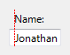
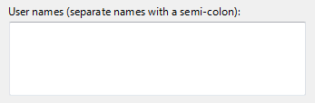

# Text Boxes

> [!NOTE]
> This design guide was created for Windows 7 and has not been updated for newer versions of Windows. Much of the guidance still applies in principle, but the presentation and examples do not reflect our [current design guidance](/windows/uwp/design/).

With a text box, users can display, enter, or edit a text or numeric value.

A typical text box.

> [!Note]  
> Guidelines related to [layout](vis-layout.md), [fonts](vis-fonts.md), and [balloons](ctrl-balloons.md) are presented in separate articles.

 

## Is this the right control?

To decide, consider these questions:

-   **Is it practical to enumerate all the valid values efficiently?** If so, consider a [single-selection list](ctrl-list-boxes.md), [list view](ctrl-list-views.md), [drop-down list](/windows/desktop/uxguide/ctrl-drop), editable drop-down list, or [slider](ctrl-sliders.md) instead.
-   **Is the valid data completely unconstrained? Or is the valid data constrained only by format (constrained length or character types)?** If so, use a text box.
-   **Does the value represent a data type that has a specialized common control?** Examples include date, time, or IPv4 or IPv6 address. If so, use the appropriate control, such as a date control rather than a text box.
-   If the data is numeric:
    -   **Do users perceive the setting as a relative quantity?** If so, use a slider.
    -   **Would the user benefit from instant feedback on the effect of setting changes?** If so, use a slider, possibly along with a text box. For example, users can easily choose a color using a slider because they can immediately see the effect of changes to hue, saturation, or luminosity values.

## Design concepts

While text boxes have the benefit of being very flexible, they have the drawback of having minimal constraints. The only constraints on an editable text box are:

-   You can optionally set the maximum number of characters.
-   You can optionally restrict input to numeric characters (0   9) only.
-   If you use a [spin control](ctrl-spin-controls.md), you can limit spin control choices to valid values.

Aside from their length and the optional presence of a spin control, text boxes don't have any visual clues that suggest the valid values or their format. This means relying on labels to convey this information to users. If users enter text that's not valid, you must handle the error with an error message.

As a general rule, **you should use the most constrained control that you can**. Use unconstrained controls like text boxes as a last resort. That said, when you are considering constraints, bear in mind the needs of global users. For example, a control that is constrained to United States ZIP Codes isn't globalized, but an unconstrained text box that accepts any postal code format is.

## Usage patterns

A text box is a flexible control with several possible uses.

<table>
<colgroup>
<col style="width: 50%" />
<col style="width: 50%" />
</colgroup>
<tbody>
<tr class="odd">
<td><strong>Data input</strong>  A single-line, unconstrained text box used to enter or edit short strings. </td>
<td>  A single-line, unconstrained text box. </td>
</tr>
<tr class="even">
<td><strong>Formatted data input</strong>  A set of short, fixed-sized, single-line text boxes used to enter data with a specific format.  </td>
<td>  A text box used for formatted data input. 
<blockquote>
[!Note] 
The <a href="glossary.md">auto-exit</a> feature automatically advances the input focus from one text box to the next. One disadvantage to this approach is that the data can't be copied or pasted as a single unit.
</blockquote>
   </td>
</tr>
<tr class="odd">
<td><strong>Assisted data input</strong>  A single-line, unconstrained text box used to enter or edit strings, combined with a command button that helps users select valid values. </td>
<td>  In this example, the Browse command helps users select valid values. </td>
</tr>
<tr class="even">
<td><strong>Textual input</strong>  A multi-line, unconstrained text box used to enter or edit long strings.  </td>
<td>  A multi-line, unconstrained text box. </td>
</tr>
<tr class="odd">
<td><strong>Numeric input</strong>  A single-line, numeric-only text box used to enter or edit numbers, with an optional <a href="ctrl-spin-controls.md">spin control</a> to facilitate mouse-based input.  </td>
<td>  A text box used for numeric input.  The combination of a text box and its associated spin control is called a <a href="ctrl-spin-controls.md">spin box</a>. </td>
</tr>
<tr class="even">
<td><strong>Password and PIN input</strong>  A single-line, unconstrained text box used to enter passwords and PINs securely. </td>
<td>  A text box used to enter passwords. </td>
</tr>
<tr class="odd">
<td><strong>Data output</strong>  A single-line, read-only text box, always displayed without a border, used to display short strings.  </td>
<td>Unlike static text, data displayed using a text box can be scrolled (useful if the data is wider than the control), selected, and copied.    A single-line, read-only text box used to display data. </td>
</tr>
<tr class="even">
<td><strong>Textual output</strong>  A multi-line, read-only text box used to display long strings.  </td>
<td>  A read-only text box used to display data. </td>
</tr>
</tbody>
</table>

 

## Guidelines

### General

-   **When disabling a text box, also disable any associated labels, instruction labels, spin controls, and command buttons.**
-   **Use auto-complete to help users enter data that is likely to be used repeatedly**. Examples include user names, addresses, and file names. However, don't use auto-complete for text boxes that may contain sensitive information, such as passwords, PINs, credit card numbers, or medical information.
-   **Don't make users scroll unnecessarily.** If you expect data to be larger than the text box and you can readily make the text box larger without harming the layout, size the box to eliminate the need for scrolling.

    **Incorrect:**

    

    In this example, the text box should be made much longer to handle its data.

-   Scroll bars:
    -   **Don't put horizontal scroll bars on multi-line text boxes.** Use vertical scrolling and line wrapping instead.
    -   **Don't put any scroll bars on single-line text boxes.**
-   **For numeric input, you may use a spin control.** For textual input, use a drop-down list or editable drop-down list instead.
-   **Don't use the auto-exit feature except for formatted data input.** The automatic shift of focus can surprise users.

### Editable text boxes

-   **Limit the length of the input text when you can.** For example, if the valid input is a number between 0 and 999, use a numeric text box that is limited to three characters. All parts of text boxes that use formatted data input must have a short, fixed length.
-   **Be flexible with data formats.** If users are likely to enter text using a wide variety of formats, try to handle all the most common ones. For example, many names, numbers, and identifiers can be entered with optional spaces and punctuation, and the capitalization often doesn't matter.
-   If you can't handle the likely formats, require a specific format by using formatted data input or indicate the valid formats in the label.

    **Acceptable:**

    

    In this example, a text box requires input in a specific format.

    **Better:**

    

    In this example, the formatted data input pattern is used to require a specific format.

    **Best:**

    

    In this example, a text box handles all likely formats.

-   Consider format flexibility when choosing the maximum input length. For example, a valid credit card number can use up to 19 characters so limiting the length to anything shorter would make it difficult to enter numbers using the longer formats.
-   **Don't use the formatted data input pattern if users are more likely to paste in long, complex data.** Rather, reserve the formatted data input pattern for situations where users are more likely to type the data.

    

    In this example, the formatted data input pattern isn't used, so that users can to paste IPv6 addresses.

-   **If users are more likely going to reenter the entire value, select all the text on input focus.** If users are more likely to edit, place the caret at the end of the text.

    

    In this example, users are more likely to replace than edit, so the entire value is selected on input focus.

    

    In this example, users are more likely to add keywords than replace the text, so the caret is placed at the end of the text.

-   **Always use a multi-line text box if new-line characters are valid input.**
-   **When the text box is for a file or path, always provide a Browse button.**

### Numeric text boxes

-   **Choose the most convenient unit and label the units.** For example, consider using milliliters instead of liters (or vice versa), percentages instead of direct values (or vice versa), and so on.

    **Correct:**

    

    In this example, the unit is labeled, but it requires users to enter decimal numbers.

    **Better:**

    

    In this example, the text box uses a more convenient unit.

-   **Use a spin control whenever it is helpful.** However, sometimes spin controls aren't practical, such as when users need to enter many large numbers. Use spin controls when:
    -   The input is likely to be a small number, typically under 100.
    -   Users are likely to make a small change to an existing number.
    -   Users are more likely to be using the mouse than the keyboard.
-   **Right-align numeric text whenever:**

    -   There is more than one numeric text box.
    -   The text boxes are vertically aligned.
    -   Users are likely to add or compare the values.

    **Correct:**

    

    In this example, the numeric text is right-aligned to make it easy to compare values.

    **Incorrect:**

    

    In this example, the numeric text is incorrectly left-aligned.

-   **Always right-align monetary values.**
-   **Don't assign special meanings to specific numeric values**, even if those special meanings are used internally by your application. Instead, use check boxes or radio buttons for an explicit user selection.

    **Incorrect:**

    

    In this example, the value -1 has a special meaning.

    **Correct:**

    

    In this example, a check box makes the option explicit.

### Password and PIN input

-   **Always use the password common control instead of creating your own.** Passwords and PINs require special treatment to be handled securely.

For more guidelines and examples, see [Balloons](ctrl-balloons.md).

### Textual output

-   **Consider using the white background system color for large, multi-line read-only text.** A white background makes the text easier to read. Lots of text on a gray background discourages reading.

For more information on background colors, see [Fonts](vis-fonts.md).

### Data output

-   **Don't use a border for single-line, read-only text boxes.** The border is a visual clue that the text is editable.
-   **Don't disable single-line, read-only text boxes.** This prevents users from selecting and copying the text to the clipboard. It also prevents users from scrolling the data if it exceeds the size of its boundaries.
-   **Don't set a tab stop on single-line, read-only text box unless the user is likely to need to scroll or copy the text.**

## Input validation and error handling

Because text boxes are usually not constrained to accept only valid input, you may need to validate the input and handle any problems. Validate the various types of input problems as follows:

-   If the user enters a character that isn't valid, ignore the character and display an [input problem balloon](ctrl-balloons.md) that explains the valid characters.

    

    In this example, a balloon reports an incorrect input character.

-   If the input data has a value or format that isn't valid, display an input problem balloon when the text box loses input focus.
-   If the input data is inconsistent with other controls on the window, give an error message when the entire input is complete, such as when users click OK for a modal dialog box.

**Don't clear invalid input data unless users aren't able to correct errors easily.** Doing so allows users to correct mistakes without starting over. For example, you should clear incorrect passwords and PINs because users can't correct them easily.

For more guidelines and examples, see [Error Messages](mess-error.md) and [Balloons](ctrl-balloons.md).

## Prompts

A prompt is a label or short instruction placed inside a text box as its default value. Unlike static text, prompts disappear from the screen once users type something into the text box or it gets input focus.

A typical prompt.

Use a prompt when:

-   Screen space is at such a premium that using a label or instruction is undesirable, such as on a toolbar.
-   The prompt is primarily for identifying the purpose of the text box in a compact way. It must not be crucial information that the user needs to see while using the text box.

Don't use prompts just to direct users to type something or to click buttons. For example, don't write prompt text that says Enter a filename and then click Send.

When using prompts:

-   Draw the prompt text in italic gray and the actual input text in normal black. The prompt text must not be confused with real text.
-   Keep the prompt text concise. You can use fragments instead of full sentences.
-   Use sentence-style capitalization.
-   Don't use ending punctuation or ellipsis.
-   The prompt text should not be editable and should disappear once users click in or tab into the text box.
    -   **Exception:** If the text box has default input focus, the prompt is displayed, and it disappears once the user starts typing.
-   The prompt text is restored if the text box is still empty when it loses input focus.

## Recommended sizing and spacing

Recommended sizing and spacing for text boxes.

The width of a text box is a visual clue of the expected input size. When sizing text boxes:

-   **Choose a width appropriate for the longest valid data.** In most situations, users shouldn't have to scroll the longest likely string they'll enter or view.
-   **Include an additional 30 percent** (up to 200 percent for shorter text) for any text (but not numbers) that will be localized.
-   **If the expected input has no particular size, choose a width that is consistent with the other text boxes or controls on the window.**
-   **Size multi-line text boxes to display an integral number of lines of text.**

## Labels

### Text box labels

-   All text boxes need labels. Write the label as a word or phrase, not as a sentence, ending with a colon, and using [static text](glossary.md).

    **Exceptions:**

    -   Text boxes with prompts located where space is at a premium.
    -   For labeling, a group of text boxes used for **formatted data input** should be treated as a single text box.
    -   If a text box is subordinate to a radio button or check box, and is introduced by its label ending with a colon, don't put an additional label on the text box.
    -   **Omit control labels that restate the main instruction.** In this case, the main instruction takes the colon (unless it's a question) and access key.

        **Acceptable:**

        

        In this example, the text box label is just a restatement of the main instruction.

        **Better:**

        

        In this example, the redundant label is removed, so the main instruction takes the colon and access key.

-   Assign a unique access key. For access key assignment guidelines, see [Keyboard](inter-keyboard.md).
-   Use sentence-style capitalization.
-   Position the label either to the left of or above the text box, and align the label with the left edge of the text box. If the label is on the left, vertically align the label text with the text box text.

    **Correct:**

    

    

    In these examples, the label on top aligns with the left edge of the text box, and the label on the left aligns with the text in the text box.

    **Incorrect:**

    

    

    In these incorrect examples, the label on top aligns with the text in the text box, and the label on the left aligns with the top of the text box.

-   You may specify units (for example, seconds or connections) in parentheses after the label.
-   If a text box accepts an arbitrarily small maximum number of characters, you can state the maximum input in the label. The text box width should also suggest the maximum size.

    

    In this example, the label gives the maximum number of characters.

-   Don't make the content of the text box (or its units label) part of a sentence, because this is not localizable.
-   If the text box can be used to enter several items, make it clear how to separate the items in the label.

    

    In this example, the item separator is given in the label.

-   For guidelines on indicating required input, see Required input in [Dialog Boxes](win-dialog-box.md).

### Instruction labels

-   If you need to add instructional text about a text box, add it above the label. Use complete sentences with ending punctuation.
-   Use sentence-style capitalization.
-   Additional information that is helpful but not necessary should be kept short. Place this information either in parentheses between the label and colon, or without parentheses below the text box.

    

    In this example, additional information is placed below the text box.

### Prompt labels

-   Keep the prompt text concise. You can use fragments instead of full sentences.
-   Use sentence-style capitalization.
-   Don't use ending punctuation or ellipsis.
-   If the prompt directs users to enter information that will be acted upon by a button next to the text box, simply place the button next to the text box. Don't use the prompt to direct users to click the button (for example, don't write prompt text that says, Drag a file and then click Send).

## Documentation

When referring to text boxes:

-   Use type to refer to user interactions that require typing or pasting; otherwise use enter if users can put information into the text box using other means, such as selecting the value from a list or using a Browse button.
-   Use select to refer to an entry in a read-only text box.
-   Use the exact label text, including its capitalization, and include the word box. Don't include the access key underscore or colon. Don't refer to a text box as a text box or a field.
-   When possible, format the label using bold text. Otherwise, put the label in quotation marks only if required to prevent confusion.

    Example: Type your password into the **Password** box, and then click **OK**.

-   If the text box requires a specific format, document only the most commonly used acceptable format. Let users discover any other formats on their own. You want to be flexible with data formats, but doing so should not result in complex documentation.

    **Correct:**

    Enter the part's serial number using the 1234-56-7890 format.

    **Incorrect:**

    Enter the part's serial number using any of the following formats:

    1234567890

    1234-56-7890

    1234 56 7890

