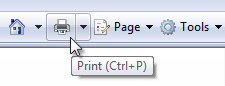
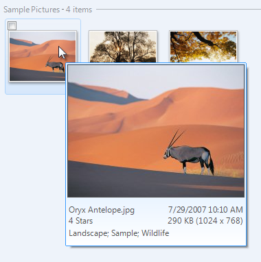
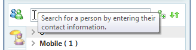
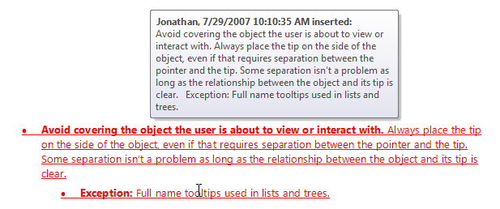
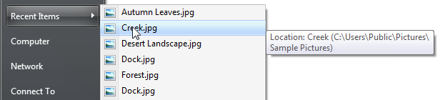
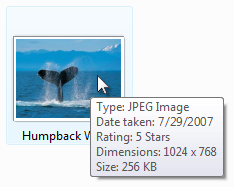

# Tooltips and Infotips

> [!NOTE]
> This design guide was created for Windows 7 and has not been updated for newer versions of Windows. Much of the guidance still applies in principle, but the presentation and examples do not reflect our [current design guidance](/windows/uwp/design/).

A tooltip is a small pop-up window that labels the unlabeled control being pointed to, such as unlabeled toolbar controls or command buttons.

A typical tooltip for a toolbar button.

Because tooltips have proved so useful, a related control called infotips exists, which provides more descriptive text than is possible with tooltips.

An infotip is a small pop-up window that concisely describes the object being pointed to, such as descriptions of toolbar controls, icons, graphics, links, Windows Explorer objects, Start menu items, and taskbar buttons. Infotips are a form of [progressive disclosure controls](ctrl-progressive-disclosure-controls.md), eliminating the need always to have descriptive text on screen.

A typical infotip.

For the purposes of this article, tooltips and infotips are referred to collectively as tips.

Tips help users understand unknown or unfamiliar objects that aren't described directly in the user interface (UI). They are displayed automatically when users hover the pointer over an object, and removed when users click the control or move the mouse, or when the tip times out.

**Developers:** There is no infotip control; infotips are implemented with the tooltip control. The distinction is in usage, not implementation.

> [!Note]  
> Guidelines related to [balloons](ctrl-balloons.md), [toolbars](cmd-toolbars.md), and [Help](winenv-help.md) are presented in separate articles.

 

## Is this the right control?

To decide, consider these questions:

-   **Is the information displayed based on pointer hover?** If not, use another control. Display tips only as the result of user interaction never display them on their own. By contrast, [balloons](ctrl-balloons.md) can display on their own (as they do with notifications), so they have a tail that identifies their source.
-   **Does a control have a text label?** If not, use a tooltip to provide the label. Note that most controls should be labeled and therefore not have tooltips. Toolbar controls and command buttons with graphic labels should have tooltips.
-   **Does an object benefit from a supplemental description or further information?** If so, use an infotip. However, the text must be supplemental that is, not essential to the primary tasks. If it is essential, put it directly in the UI so that users don't have to discover or hunt for it.
-   **Is the supplemental information an error, warning, or status?** If so, use another UI element, such as a balloon, [error message](mess-error.md), or [status bar](ctrl-status-bars.md). Notification area icon infotips are an exception because they can be used to show status information.
-   **Do users need to interact with the tip?** If so, use another control, such as a balloon. Users can't interact with tips because moving the mouse makes them disappear.
-   **Do users need to print the supplemental information?** If so, use another control, such as a static comment field. However, you can also use infotips to provide more direct access to this information.

    

    In this example, a static comment field in Microsoft Word allows users to print comments.

-   **Is the context such that users might find the tips annoying or distracting?** If so, consider using another solution including doing nothing at all. If you do use tips in such contexts, allow users to turn them off.

When used appropriately, tips improve communication with the user. **Never use tips as a substitute for good design.** If a graphic, button, or other object requires users to keep checking a tip to understand it, the design is bad. Fix the design instead.

## Design concepts

Tips are a powerful way to simplify a user interface. They provide information users need when they need it, with minimal effort on their part. Tips can help you use screen space more effectively and reduce screen clutter. However, poorly designed tips can be annoying, distracting, unhelpful, overwhelming, or in the way. The following design concepts are intended to show the difference.

### Discoverability

Tips display automatically when users hover the pointer over an object for a period of time. This time-delay mechanism makes tips very convenient, but it also reduces their discoverability.

Over time, users learn that certain standard objects like toolbar buttons, graphic buttons, Start menu items, and notification area icons have tips, so you can take their discoverability for granted.

It takes users longer to discover tips in nonstandard places. There is no visual clue, such as a hot spot or pointer change, that indicates that an object has a tip. Worse yet, some users move their mouse around a lot, especially when they are learning to navigate the UI. Users have to know that an object has a tip, either through past experience or by experimentation.

You can improve discoverability by using tips consistently, which in turn fosters predictability. If you provide tips for some objects, you should provide them for all similar objects for which users are likely to want supplemental information. Sometimes doing so can be challenging, because you must also make sure that the tips are helpful and not obvious.

If providing discoverable, consistently helpful tips proves to be a problem, consider alternative designs such as self-explanatory control labels or in-place supplemental text.

### Appropriate information

Information appropriate for tips has the following characteristics:

-   **Concise.** The pop-up windows used by tips are perfect for short sentences and sentence fragments, as well as formatted text. Large, unformatted blocks of text are difficult to read and overwhelming.
-   **Helpful.** Tip text must be informative. It shouldn't be obvious or just repeat what is already on the screen.
-   **Supplemental.** Because tip text isn't always visible, it should be supplemental information that users don't have to read. Important information should be communicated using self-explanatory control labels or in-place supplemental text.
-   **Static.** Users don't expect tips to change from one instance to the next, so they are unlikely to notice changes in dynamic content, such as status information. Notification area icon tips are a notable exception: Users are more likely to discover changes in tip information there because these icons primarily communicate status.

### Appropriate timeouts

The appropriate automatic display and removal of tips is crucial to the goal of users maintaining control of their UI environment. Tips have three timeout values:

-   **Initial.** The time the pointer must remain stationary for the tip to appear. The default time is 0.5 seconds.
-   **Reshow.** The time the pointer must remain stationary as the pointer moves from one target to another. The default time is 0.1 seconds.
-   **Removal.** The time after which the tip is automatically removed. The default time is 5 seconds.

Having too short initial and reshow values results in an annoying, disruptive experience because they would often be shown inadvertently, whereas too long results in tips feeling unresponsive or not being discovered. The default removal time works well for short tip text, as used in tooltips. Infotips have longer text, so they need longer display times.

### Appropriate placement

Tips should be placed near the object being hovered, usually at the pointer's tail or head if possible. However, they should never be placed in a way that interferes with what the user is doing by obscuring the object of interest. Preventing this problem might require you to move the tip away from the pointer but adjacent to the object. This isn't a problem as long as the relationship between the object and its tip is clear. Make sure users don't move the pointer just to get your program's tips to go away.

### Accessibility

Tips have an unusual effect on accessibility. While they are normally triggered by hovering the pointer over an object, tips are handled by [screen readers](inter-accessibility.md) for controls with keyboard access. When used appropriately for concise, helpful, static, supplemental information, tips can improve overall accessibility. In fact, the alt text tip pattern is the preferred way to make graphics accessible. However, when used inappropriately, they harm accessibility by making important or dynamic information harder to obtain.

Provide more than one way to access a control if that control requires a tip that doesn't have keyboard access.

In this example, users can print using the toolbar button (which isn't keyboard accessible) or the Print command keyboard shortcut.

**If you do only one thing...**

Design discoverable tips that display concise, helpful, static, supplemental information in the appropriate place at the appropriate time.

## Usage patterns

Tips have several usage patterns:

|    Usage                                                                                                                             |    Example                                                                                                                                                                                                                                                                                                                                                                                                                                                                                                                                                                                                                                                                                                                            |
|---------------------------------------------------------------------------------------------------------------------------------|--------------------------------------------------------------------------------------------------------------------------------------------------------------------------------------------------------------------------------------------------------------------------------------------------------------------------------------------------------------------------------------------------------------------------------------------------------------------------------------------------------------------------------------------------------------------------------------------------------------------------------------------------------------------------------------------------------------------------------|
| **Tooltips**  display the label of an unlabeled control or glyph.                                           | Because these tips serve as labels, their text follows the label guidelines for the underlying control.     in this example, the tooltip gives the command label.    in these examples, tooltips label graphic buttons.    In this example, the tooltip labels a glyph.  |
| **Infotips**  provide a supplemental description or explanation of an object or control.                    | Use infotips to describe or explain objects and controls such as [toolbar](cmd-toolbars.md) controls, [icons](vis-icons.md) (including icon overlays), [links](ctrl-links.md), [tabs](ctrl-tabs.md), [progressive disclosure controls](ctrl-progressive-disclosure-controls.md), and custom controls.       In these examples, infotips provide supplemental information about controls and objects.                                                                                         |
| **Alt text infotips**  describe a graphic for accessibility.                                                | This pattern is primarily for users who have some form of vision impairment, and may be using a screen reader.     In this example, the infotip describes the Start menu graphic.                                                                                                                                                                                                                                                                                                                                                                                                             |
| **Thumbnails**  display a small image of an item.                                                           | Thumbnails give an easily recognizable graphic representation of a window or document.     in this example, the windows taskbar gives thumbnail tips for its items.    In this example, Windows Photo Gallery gives thumbnail tips for its items.                                                                                                                                                                                                                       |
| **Detail infotips**  display detailed information about an object.                                          | Infotips are an effective way to show detailed information about an object, or to provide data.     In these examples, infotips give detailed information about an object or data.                                                                                                                                                                                                                                                                                                       |
| **Start Menu infotips**  describe an item on the start menu.                                                | The start menu consists of program names and important windows destinations, such as documents, pictures, and control panel. these tips describe start menu items, typically by giving a brief description of the program or destination as well as the primary tasks users can perform with it. these descriptions are also indexed by the start menu search box, further helping users find the programs they need.     In this example, the infotip describes what users can do with a program in the Start menu.                                                                                     |
| **Control Panel infotips**  describe a control panel category or task.                                      | These tips provide supplemental information to help users choose the right control panel category and item.     In this example, the infotip describes the User Accounts Control Panel category.                                                                                                                                                                                                                                                                                                                                                                                            |
| **Full name infotips**  display the full name of an item when the name is truncated or not fully visible.   | These tips allow you to display items in a more compact space, while reducing the need for horizontal scrolling. this is especially important when the content length is unknown because it is dynamic. unlike the other patterns, when used in lists and trees these tips are displayed directly over the source object.     In this example, an infotip is used to display the full item name on hover.                                                                                                                                                                                      |
| **Status infotips**  display status information for notification area icons.                                | Normally, tips should be static because users don't expect them to change from one instance to the next. **notification area icons are an exception** because these icons communicate status, and there is no other screen space available for status text.       In these examples, infotips give status information for notification area icons.                                                                                                                                   |

 

## Guidelines

### Timeouts

-   **Use the default initial and reshow timeouts. Exception:**
    -   Thumbnails that aren't redundant and displayed on the side of their associated object can be shown immediately (without any delay). However, use the default initial timeout for redundant thumbnails (such as a large thumbnail tip for a small graphic object) or thumbnails that cover their associated object.
-   **For tooltips, use the default five-second tip removal timeout.**
-   **For infotips, turn off the tip removal timeout. Developers:** Since you can't technically turn off the removal timeout, set it to its largest value.
-   For accessibility, if you need to set the timeout values to something other than the maximum value, make them multiples of the SPI\_GETMOUSEHOVERTIME and SPI\_GETMESSAGEDURATION system parameters instead of using fixed times. Doing so adjusts the timeouts to the speed of the user.

### Placement

-   **Avoid covering the object the user is about to view or interact with.** Always place the tip on the side of the object, even if that requires separation between the pointer and the tip. Some separation isn't a problem as long as the relationship between the object and its tip is clear.

    -   **Exception:** Full name tooltips used in lists and trees.

    **Incorrect:**

    

    **Correct:**

    

    In the correct example, the infotip is placed away from the Search box, even though that requires space between it and the caret.

    **Incorrect:**

    

    **Correct:**

    

    In the correct example, the underlying text is far more useful than the tip, so the infotip is placed well out of the way.

-   **For collections of items, avoid covering the next object that the user is likely to view or interact with.** For horizontally arranged items, avoid placing tips to the right; for vertically arranged items, avoid placing tips below.

    **Incorrect:**

    

    **Correct:**

    

    In the incorrect example, the tip covers the object the user is most likely to interact with next.

-   **For potentially distracting (often large) tips, make sure that the information is helpful for most users.** If that's not the case, either make the distracting tips optional or even eliminate them. Otherwise, most users will have to move the pointer away from the target object to get rid of the tip.

### Tooltips

-   **Use tooltips to provide labels for unlabeled controls.** Controls that commonly have tooltips are [toolbar buttons](cmd-toolbars.md), graphic buttons, and [progressive disclosure controls](ctrl-progressive-disclosure-controls.md). Controls with prompts are considered labeled, such as [text boxes](ctrl-text-boxes.md) and [combo boxes](/windows/desktop/uxguide/ctrl-drop). All other controls should have explicit labels.
-   Use sentence fragments without ending punctuation.
-   Use sentence-style capitalization.
    -   **Exception:** This guideline is new for Windows Vista. For legacy applications, you may use title-style capitalization if necessary to avoid mixing capitalization styles.
-   Add an [ellipsis](ctrl-command-buttons.md) if the label is for a command that needs additional information.
-   As with normal labels, **keep tooltips brief** typically five words or less but prefer specific labels over vague ones.

    **Acceptable:**

    

    **Better:**

    

    **Best:**

    

    **Incorrect:**

    

    In these examples, the best example is both concise and specific, whereas the incorrect example is unnecessarily verbose.

-   **Tooltips may also provide more detail for labeled toolbar buttons if doing so is helpful.** Don't just repeat or give a wordy restatement of what is already in the label.

    **Correct:**

    

    In this example, the tooltip explains what Search does.

    **Incorrect:**

    

    In this example, the tooltip just repeats what is already in the label.

-   **You don't have to give labeled controls tooltips simply for the sake of consistency.**

    

    In this example, the unlabeled toolbar buttons have tooltips, but the labeled ones don't.

-   Whenever appropriate, **make tooltips more helpful by providing keyboard shortcuts and default values.** Put this additional information in parentheses. Doing so makes tooltips helpful for labeled controls even when they otherwise just repeat the label. Don't consider this additional text when evaluating the conciseness of a tooltip.

    

    In this example, Word displays default values and keyboard shortcuts in the toolbar tooltips.

### Infotips

-   **For infotips in nonstandard places, favor consistency over helpfulness to improve discoverability.** Provide tips for all objects for which users are likely to want supplemental information, even if a few infotips might be obvious. Doing so avoids having users wait for an infotip that will never come.
    -   **Exception:** If only a few objects have helpful infotips, don't use infotips at all. Rather, use self-explanatory control labels or in-place supplemental text instead.
-   Use full sentences with ending punctuation.
    -   **Exception:** Notification area [icon infotips](winenv-notification.md) don't use ending punctuation.
-   Use sentence-style capitalization.
-   Use present tense, not future.
-   Use parallel grammatical constructions. Parallelism requires that words and phrases that have the same function have the same form.
    -   **Exception:** For the full name infotip pattern, the infotip text exactly matches the phrasing, capitalization, and punctuation of the underlying control.
-   **Avoid large infotips.** Large infotips are difficult to read, and difficult to position without interfering with the underlying object.
-   **Format infotips to make their content easier to read and scan.** Large blocks of unformatted text can be difficult to read.

    **Incorrect:**

    

    **Correct:**

    

    In the correct example, the formatted text is much easier to read and scan.

-   On first use within an infotip, spell out the names of acronyms, followed by the acronym in parentheses. Example: "Dynamic Host Configuration Protocol (DHCP)."

### Start Menu infotips

-   Use Start menu infotips to **describe the item concisely and list the primary tasks that users can perform with the item.**
-   **Be helpful.** Focus on what users can do. Don't just repeat the item name or even use it in the description at all.
-   **Be specific.** Avoid generic verbs and catch-all phrases like and other tasks. If the information is important, list it specifically; otherwise, assume that users understand that not everything is listed in the infotips.
-   **Be concise.** Use 25 words or less. Longer infotips discourage reading.
-   **Start with a present-tense, imperative verb** such as create, edit, show, and send. Prefer specific verbs over generic verbs such as manage and open, which really apply to most Start menu items. Get right to the point.

    **Incorrect:**

    

    **Better:**

    

    In the incorrect example, the infotip starts with a generic verb. The better example gets right to the point with specific verbs, but continues to use the unnecessary "and other" phrasing at the end of the tip.

-   **Don't use language that sounds like marketing.**

    **Incorrect:**

    

    In this example, the infotip sounds like marketing.

-   Because these infotips are indexed for the Start menu search box, **describe your program's important tasks using terms for which users are most likely to search. Consider using keywords and common synonyms.**

    **Incorrect:**

    

    **Correct:**

    

    In the correct example, the infotip has common synonyms.

-   Use sentence-style capitalization.
-   **Developers:** The Start menu infotip text comes from the item's Comment field.

### Quick Launch tooltips

-   **Use a tooltip with the format:** Launch (full program name)
-   Don't use ending punctuation.
-   Don't use additional text to describe the program or what it does. Because users choose the programs displayed in the Quick Launch bar, they already know their purpose.

### Control Panel infotips

-   Use Control Panel infotips to **concisely describe the Control Panel tasks and the hardware and software configured.**
-   **Control Panel names and icons must have infotips.** Individual tasks don't have tooltips.
-   **Be helpful.** Focus on what users can do. Don't just repeat the Control Panel item name or even use it in the description at all.
-   **Be specific.** Avoid generic verbs and catch-all phrases like and other hardware. If the information is important, list it specifically; otherwise, assume that users understand that not everything is listed in the infotips.

    **Incorrect:**

    

    **Correct:**

    

    In the correct example, the types of hardware configured are specifically listed.

-   **Be concise.** Use 25 words or less. Longer infotips discourage reading.
-   **Start with a present-tense, imperative verb.**

    **Correct:**

    Configure Internet display and connection settings.

    Adjust settings for vision, hearing, and mobility.

-   **Get right to the point.** Don't use language that applies to any Control Panel, such as "Use to view and configure settings for the appearance and functionality of your..." or "Provides options for you to..."
-   Don't use language that sounds like marketing.

    **Incorrect:**

    Your one-stop starting point for all your disk configuration needs.

-   Because these infotips are indexed for the Control Panel search box, **describe items using terms for which users are most likely to search.** Consider using common synonyms for popular tasks and objects.

    

    In this example, the item is described using terms for which users are most likely to search.

-   If a Control Panel item is likely to be confused with others, explain how it is different in the infotip.

    **Incorrect:**

    

    In this example, both Control Panel items configure sound, but the infotip doesn't clarify the difference.

    **Correct:**

    

    In this example, the difference between the two items is more evident because of the tip.

### Icons

Unlike previous versions of Windows, Windows Vista allows tips to have icons.

-   For tooltips, don't use icons.
-   For infotips, use icons only if they aid in recognition or comprehension, or provide context. Most infotips shouldn't have icons.

    

    In this example, the infotip has an icon to help associate the icon with its meaning.

-   The icon must use the [Aero-style](vis-icons.md) and have an unobtrusive appearance.

For general icon guidelines and examples, see [Icons](vis-icons.md).

## Documentation

When referring to tips:

-   In programming and other technical documentation, refer to the type of tip (tooltip or infotip). Everywhere else, simply call it a tip.
-   The following variations are incorrect: tool tip, Tooltip, and ToolTip.
-   To describe user interaction, use hover.

