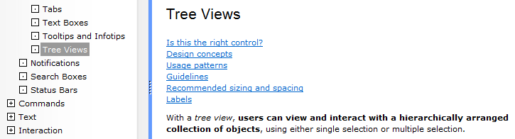
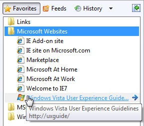
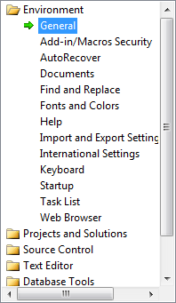
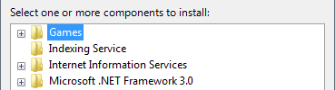

# Tree Views

> [!NOTE]
> This design guide was created for Windows 7 and has not been updated for newer versions of Windows. Much of the guidance still applies in principle, but the presentation and examples do not reflect our [current design guidance](/windows/uwp/design/).

With a tree view, users can view and interact with a hierarchically arranged collection of objects, using either single selection or multiple selection.

In a tree, objects that contain data are called leaf nodes and objects that contain other objects are called container nodes. A single, top-most container node is called the root node. Users can expand and collapse container nodes by clicking the plus and minus expander buttons.

A typical tree view.

> [!Note]  
> Guidelines related to [layout](vis-layout.md) and [menus](cmd-menus.md) are presented in separate articles.

 

## Is this the right control?

**Having hierarchical data doesn't mean that you must use a tree view.** Very often a [list view](ctrl-list-views.md) is a simpler, yet more powerful choice. List views:

-   Support several different views.
-   Support sorting data by any of the columns in Details view.
-   Support organizing data into groups, forming a two-level hierarchy.

**To use a list view, you can flatten hierarchical information using the following techniques:**

-   Remove the root node if present, because it often isn't necessary.
-   Use list view groups, tabs, [drop-down lists](/windows/desktop/uxguide/ctrl-drop), or [expandable headings](glossary.md) to replace the top-level containers.

    

    In this example, list view groups are used for the top-level containers.

    

    In this example, tabs are used for the top-level containers

    

    In this example, a drop-down list is used for the top-level containers.

-   If an associated control displays the content of the selected container, that control can display lower levels of the hierarchy.

    

    In this example, low-level containers are displayed in the document window.

**You must use a tree view if you need to display a hierarchy of more than two levels (not including the root node).**

To decide if a tree view is the right control, consider these questions:

-   **Is the data hierarchical?** If not, use another control.
-   **Does the hierarchy have at least three levels (not including the root)?** If not, consider alternatives such as list view groups, tabs, drop-down lists, or expandable headings.
-   **Do the items have auxiliary data?** If so, consider using a list view in the Details view mode to take full advantage of the auxiliary data.
-   **Does the lower-level data relate to independent subtasks?** If so, consider displaying the information in an associated control or in a separate window (displayed using [command buttons](ctrl-command-buttons.md) or [links](ctrl-command-links.md)).
-   **Are the target users advanced?** Advanced users are more proficient at using trees. If your application is aimed at novice users, avoid using tree views.
-   **Do the items have a single, natural, hierarchical categorization that's familiar to most users?** If so, the data is ideal for a tree view. If there is a need for multiple views or sorting, use a list view instead.
-   **Do users need to see the lower-level data in some but not all scenarios, or some but not all of the time?** If so, the data is ideal for a tree view.

> [!Note]  
> Sometimes a control that looks like a tree view is implemented using a list view. In such cases, apply the guidelines based on the usage, not on the implementation.

 

## Design concepts

Trees are intended to organize data and make it easy to find, yet it's difficult to make data within a tree easily discoverable. Keep the following principles in mind when deciding about tree views and their organization.

### Predictability and discoverability

**A tree view is based on the relationships between objects.** Trees work best when the objects form a clear, well known, mutually exclusive relationship in which every object maps to a single, easy-to-determine container.

**A significant problem is that an object can appear in different nodes.** For example, where would users expect to find a hardware device that plays music, has a large hard disk, and uses a USB port? Perhaps in any of several different container nodes, such as Multimedia, Storage, USB, and possibly in Hardware Resources. One solution is to place each object under the single most appropriate container regardless of the circumstances; another approach is to place each object under all containers that apply. The former promotes a simple, clean hierarchy and the latter promotes discoverability each has advantages and potential problems.

**Users may not completely understand the layout of the tree, but they will form a mental model of the relationships after interacting with the tree for a while.** If that mental model is incorrect, it leads to confusion. For example, suppose a music player can be found in the Multimedia, Storage, and USB containers. This arrangement improves discoverability. If a user first finds the device in Multimedia, the user may conclude that all devices like music players appear in the Multimedia container. The user will then expect similar devices, such as digital cameras, to appear in the Multimedia container and will become confused if that isn't the case.

**The challenge when designing a tree is to balance discoverability with a predictable user model that minimizes confusion.**

### Breadth vs. depth

Usability studies have shown that **users are more successful at finding objects in a tree that is broad than in a tree that is deep**, so when designing a tree you should prefer breadth over depth. Ideally, a tree should have no more than four levels (not counting the root node) and the most commonly accessed objects should appear in the first two levels.

### Other principles

-   When users find what they are looking for, they stop looking. They don't look to see where else an object might be found because they don't need to. Those users may assume that the first path they find is the only path.
-   Users have trouble finding objects in large, complex trees. Users will not perform an exhaustive, manual search to find objects in such trees; they stop once they think they've expended a reasonable effort. Consequently, large, complex trees need to be supplemented with other access methods, such as word search, an index, or filtering.
-   Some programs allow users to create their own trees. While such self-designed trees might be aligned with a user's mental model, they are often created haphazardly and poorly maintained. For example, while a file system, e-mail program, and Favorites list typically store similar types of information, users rarely bother to organize them in the same way.

**If you do only one thing...**

Carefully weigh the benefits and drawbacks of using tree views. Having hierarchically arranged data doesn't mean that you need to use a tree view.

## Usage patterns

Tree views have several usage patterns:

|                                                                                                                                                  |                                                                                                                                                                                                                                                                                                                                                                                                                                                                                                                                                                                                                                                                                                                                                                                                                                                                                                     |
|--------------------------------------------------------------------------------------------------------------------------------------------------|-----------------------------------------------------------------------------------------------------------------------------------------------------------------------------------------------------------------------------------------------------------------------------------------------------------------------------------------------------------------------------------------------------------------------------------------------------------------------------------------------------------------------------------------------------------------------------------------------------------------------------------------------------------------------------------------------------------------------------------------------------------------------------------------------------------------------------------------------------------------------------------------------------|
| **Tree views with only container nodes**  users can view and interact with one container at a time.                          | Typically, these tree views have an associated control that displays the content of the selected container, so users can interact with only one container at a time.     In this example, the tree view has only container nodes. The contents of the selected node are displayed in the associated list view control.                                                                                                                                                                                                                                                                                                                                                                                                                                                          |
| **Tree views with container and leaf nodes**  users can view and interact with containers and leaves.                        | Typically, these tree views have an associated control that displays the content of the selected container or leaf. allowing users to interact with leaves often makes it necessary to support multiple selection.     in this example, the tree view has both container and leaf nodes. since multiple selection is supported, the content of the opened items are displayed using [tabs](ctrl-tabs.md) in the associated control.  alternatively, the tree view can have an organized list, where the containers are headings and the leaves are options.     In this example, the tree leaves are options and the containers are option categories.  |
| **Check box tree views**  users can select any number of items, including none.                                              | The check boxes clearly indicate that multiple selection is possible. use this tree pattern when multiple selection is essential or commonly used.     In this example, a check box tree view allows selection of features to turn on or off.                                                                                                                                                                                                                                                                                                                                                                                                                                                                                                                                         |
| **Tree view builders**  users can create a tree by adding one container or leaf at a time and optionally setting the order.  | Many trees can be created or modified by users. some trees are built in place using context menus and drag-and-drop (such as the folders in windows explorer), whereas other trees are built using a specialized dialog box (such as the favorites list in windows internet explorer).     In this example from Internet Explorer, users can build their own list of favorites by using a dialog box.                                                                                                                                                                                                                                                                                                                                                                                      |
| **Tree views with alternative access methods**  users can find objects in ways other than using a hierarchical tree.         | As mentioned previously, users have trouble finding objects in large, complex trees, so such trees should be supplemented with other access methods, such as a word search, an index, or filtering.     in this example, users can also access information using a table of contents, an index, and favorites. for some users, the index and search tabs can be more useful than the contents tab.    In this example, the Windows Start menu also lets users access programs, files, and Web pages by typing part of the name into the Search box.                                                                                                              |

 

## Guidelines

### Presentation

-   **Within a container, sort the items in a logical order.** Sort names in alphabetical order, numbers in numeric order, and dates in chronological order.
-   **Use the Always Show Selection attribute** so that users can readily determine the selected item, even when the control doesn't have input focus.
-   **If the tree is acting as a table of contents, use the Single Expand attribute to simplify the management of the tree.** This way, only the relevant portion of the tree is expanded.
-   **Avoid presenting empty trees.** If a user creates a tree, initialize the tree with instructions or example items that users might need.

    

    In this example, the list is initially presented with examples.

-   **Don't make the container nodes collapsible if users have no reason to collapse them.** Doing so adds unnecessary complexity.
-   **If load performance is a problem, display only the first and second level containers of the tree by default.** You can then load additional data on demand when a user expands branches in the tree.
-   **If users expand or collapse a container, make that state persist so it takes effect the next time the tree view is displayed**, unless users are likely to prefer starting in the default state. Persistence should be on a per-tree view, per-user basis.
-   **If high-level containers have similar contents, consider using visual clues to differentiate them.**

    **Incorrect:**

    

    In this example, the Mailbox and Archive Folders have similar contents. Once the trees are further expanded, it is very difficult for users to know where they are in the tree, leading to confusion. Using slightly different icons in the different sections would address this problem.

-   **Reconsider connecting lines.** Although these lines clearly show relationships between container and leaf nodes, they add visual clutter without aiding comprehension significantly. Specifically, they don't help when nodes are close together, nor do they help when nodes are so far apart that scrolling is required.

    **Correct:**

    

    **Better:**

    

    The connecting lines do little to aid comprehension.

### Interaction

-   **Consider providing double-click behavior.** Double-clicking should have the same effect as selecting an item and performing its default command.
-   **Make double-click behavior redundant.** There should always be a command button or context menu command that has the same effect.
-   If an item requires further explanation, **provide the explanation in an infotip**.

    

    In this example, an infotip provides further information.

-   **Provide context menus of relevant commands.** Such commands include Cut, Copy, Paste, Remove or Delete, Rename, and Properties.
-   **When disabling a tree view, also disable any associated labels and command buttons.**

### Tree organization

-   **Use a natural hierarchical structure that's familiar to most users.**
-   **If you can't use such a structure, try to balance discoverability with a predictable user model that minimizes confusion.**
-   **To safely improve discoverability, place an item in multiple containers when:**
    -   The item isn't related to any other similar items (so users don't become confused by incorrect associations).
    -   There are only a few of such redundantly located items (so the tree doesn't become bloated).
-   **Use the simplest hierarchical structure that works well.** To do so:
    -   Place the most commonly accessed objects in the first two levels of the tree (not counting the root node), and place less commonly accessed objects farther down the hierarchy.
    -   Eliminate unnecessary or combine redundant intermediate-level containers.
-   **Prefer breadth over depth.** Ideally, a tree should have no more than four levels and the most commonly accessed objects should appear in the first two levels.
-   **Determine if you really need a root node.** Provide a root node if users need the ability to perform commands on the entire tree (possibly using a context menu on the root node). Otherwise, the tree is simpler and easier to use without it.
-   **If the tree has alternative access methods such as a word search or an index, optimize the tree for browsing by focusing on the most useful content.** With alternative access methods, the tree's content doesn't have to be comprehensive. Simplifying the tree makes it easier for users to find the most useful content.

### Check box tree views

-   **Display the number of selected items below the list**, especially if users are likely to select several items. This feedback helps users confirm that their selection is correct.

    

    In this example, the number of selected items is displayed below the tree. It is clear that two items are not selected.

-   If there are potentially many items and selecting or clearing all of them is likely, add Select all and Clear all command buttons.
-   **Use mixed-state check boxes to indicate partial selection of the items in a container.**

    **Correct:**

    

    In this example, the mixed-state check boxes are used to indicate partial selection.

## Recommended sizing and spacing

Recommended sizing and spacing for tree view controls.

-   **Choose a tree view width that avoids the need for horizontal scrolling** for most items when the tree is fully expanded.
-   **Include an additional 30 percent to accommodate localization.**
-   **Choose a tree view height that eliminates unnecessary vertical scrolling.** Consider making a tree view slightly longer (or even more so if there is available space) if doing so reduces the need for a vertical scroll bar.

    **Incorrect:**

    

    In this example, making the tree view slightly wider and longer would eliminate the scroll bars in most cases. In this particular tree, only one container can be opened at a time.

-   **If users benefit from making the tree view larger, make the tree view and its parent window resizable.** Doing so allows users to adjust the tree view size as needed.

## Labels

### Control labels

-   All tree views need labels. Write the label as a word or phrase, not as a sentence, ending with a colon, and using [static text](glossary.md).
-   Assign a unique access key. For assignment guidelines, see [Keyboard](inter-keyboard.md).
-   Use sentence-style capitalization.
-   Position the label above the control, and align the label with the left edge of the control.
-   For multiple-selection tree views, write the label so that it's clear that multiple selection is possible. Check box tree view labels can be less explicit.

    **Incorrect:**

    

    In this example, the label provides no information about multiple selection.

    **Better:**

    

    In this example, the label clearly indicates that multiple selection is possible.

    **Best:**

    

    In this example, the check boxes clearly indicate that multiple selection is possible, so the label doesn't have to be explicit.

### Data text

-   Use sentence-style capitalization.

### Instructional text

-   If you need to add instructional text about a tree view, add it above the label. Use complete sentences with ending punctuation.
-   Use sentence-style capitalization.
-   Supplemental explanations that are helpful but not necessary should be kept short. Place this information either in parentheses between the label and colon, after the main instruction if used instead of a label, or below the control.

    

    In this example, the supplemental explanation is below the control.

## Documentation

When referring to tree views:

-   Use the exact label text, including its capitalization, but don't include the access key underscore or colon. Include the word list or hierarchical list if the context requires making a distinction from regular lists.
-   For tree items, use the exact item text, including its capitalization.
-   Refer to tree views as tree views only in programming and other technical documentation. Everywhere else, use list or hierarchical list because the term tree is confusing to most users.
-   To describe user interaction, use select for the data, and expand and collapse for the plus and minus buttons.
-   When possible, format the label and tree items using bold text. Otherwise, put the label and items in quotation marks only if required to prevent confusion.

Example: In the **Contents** list, select **User Interface Design**.

When referring to check boxes in a tree view:

-   Use the exact label text including its capitalization, and include the words check box. Don't include the access key underscore.
-   To describe user interaction, use select and clear.
-   When possible, format the label using bold text. Otherwise, put the label in quotation marks only if required to prevent confusion.

Example: In the **Items to back up** list, select the **My Documents** check box.

