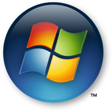
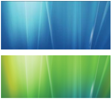
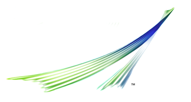
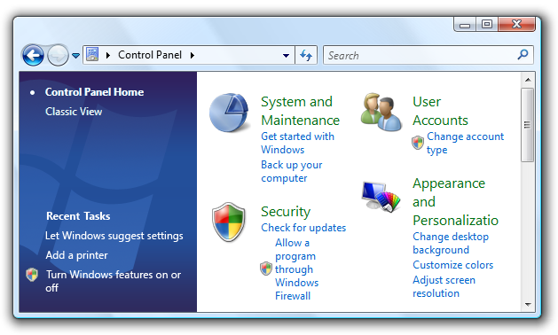
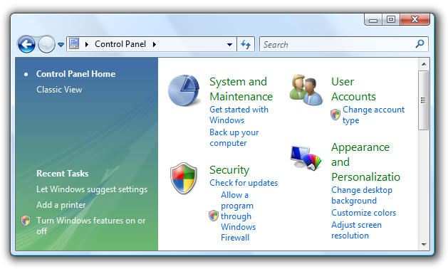
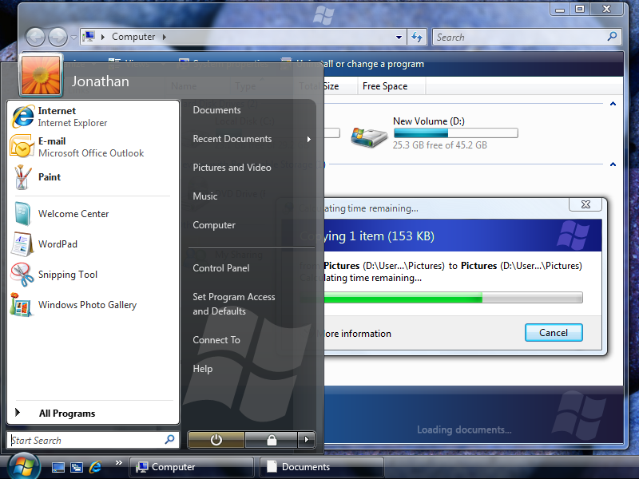

# Software Branding

> [!NOTE]
> This design guide was created for Windows 7 and has not been updated for newer versions of Windows. Much of the guidance still applies in principle, but the presentation and examples do not reflect our [current design guidance](/windows/uwp/design/).

Branding is the emotional positioning of a product as perceived by its customers. Successful branding requires skillful crafting of a product image, and is not achieved just through product logos and color schemes.

Branding is the emotional positioning of a product as perceived by its customers. Product branding is achieved through a combination of factors, including the product name and logo, use of color, text, graphics, and sound, the style of various other design elements, marketing, and most importantly, the attributes of the product experience itself.

Successful branding requires skillful crafting of a product image, and is not achieved simply by plastering a product logo on every surface and using the product's color scheme at every opportunity. Rather, meaningful and high-quality branding that enhances users' experience will be much more successful.

**Note:** Guidelines related to [icons](vis-icons.md), [fonts](vis-fonts.md), [color](vis-color.md), [animation](vis-animations.md) , [sound](https://msdn.microsoft.com/library/windows/desktop/aa511278.aspx), and [window frames](win-window-frames.md) are presented in separate articles.

## Design concepts

In a competitive marketplace, companies brand their products to help differentiate them from the competition. It would be naive to suggest that product branding in general is wrong or should be avoided, but it is fair to say that software branding is too often executed poorly. The goal of software branding is to associate the brand with the style and quality of the product and its experience. Too often, developers attempt to achieve this by drawing attention to the program itself. The result is to distract users instead of delight them.

### Attributes of good software branding

When well done, software branding has these attributes:

-   Establishes a clear, distinct style and personality.
-   Creates an emotional connection.
-   Has high quality.
-   Is strategically placed and consistently executed.
-   Aligns to the overall brand strategy.
-   Is long lasting...as enjoyable the thousandth time as it was the first.

By contrast, poor attempts at software branding have these attributes:

-   Has no obvious theme or point.
-   Is in the user's face.
-   Is annoying.
-   Is everywhere.
-   Has a custom look and feel without any user benefit.
-   Becomes quickly tiresome.

### Start with the product itself

Successful software branding starts with the design of product itself. A well-designed program has carefully crafted functionality aimed at an appropriate target audience. Unique functionality and extraordinary attention to detail make powerful branding statements. For more information, see [How to Design a Great User Experience](how-to-design-desktop-ux.md).

### Carefully choose the product's name

Great product names drive strong brands. A great software product name is memorable and concisely conveys the benefit of the product, providing distinction in a crowded market. Hire a branding professional to help you choose the right product name. In the long term, a well-chosen name is far more important to your branding effort than details like logos, color schemes, and control theming.

### What to brand

Software branding elements can be categorized as follows:

**Primary**

-   Product name
-   Product logo
-   Product color scheme
-   Product-specific sounds

Some primary branding elements from Windows Vista.

Primary branding elements tend to draw a lot of attention, so they should be used with restraint. **Limit your use of primary branding elements to a few strategic experiences.** Product-specific sounds aren't recommended for most programs.

**Secondary**

-   Element shapes
-   Icon and graphic styles
-   Secondary graphic elements
-   Accent colors
-   Animations
-   Transitions
-   Shadows
-   Backgrounds and transparency

Some secondary branding elements from Windows Vista.

Secondary branding elements tend to be more subtle, and because of that, they can be used more often. While some of these secondary branding elements may not have much impact individually, when taken together they can give your product character and style. Transitions can have more impact than fixed graphics, which users learn to ignore over time. Prefer the secondary level of branding over the primary level.

**Tertiary**

Finally, there is another category of branding elements to be aware of.

-   Custom window frames
-   Custom controls

While it's appropriate for certain types of programs (such as games) to create a completely distinct, immersive experience based on custom controls and windows, most programs should use the standard varieties. Having your programs look and act weird doesn't make for a strong brand identity. Rather, your goal should be to create a program with character—a product that stands out while fitting in.

### Where to brand

Not everything needs to be branded. A few strategically placed branding elements can make a more powerful impression than slapping uncoordinated branding elements everywhere.

Focus your branding effort on the special experiences in your program. These are the places that have the most emotional impact, such as:

-   The [first experiences](exper-first-exper.md), especially when the program is used for the very first time.
-   The main window or home page.
-   The start and completion of important tasks.
-   Important transitions between tasks or program areas.
-   Waiting time during long-running tasks.
-   Log in and log off.

### Where not to brand

While you can potentially use any element in your program as a branding opportunity, don't use the Windows desktop (including the [work area](glossary.md), [Quick Launch bar](glossary.md), or [notification area](winenv-notification.md)) for branding.

**The desktop is the user's entry point to Windows. Leave the user in control.** Use these entry points appropriately—never view them as ways to promote awareness of your program or its brand. For more information, see [Desktop](winenv-desktop.md).

### Use branding professionals

Branding is a specialized skill best done by experienced professionals. It is far better to expose your users to minimal branding than to use extensive branding that is annoying and ineffective. Work with your branding and marketing team to create a good end-to-end branding experience.

**If you do only five things...**

1.  Start with the product design. The most powerful branding statement is to satisfy your customers' needs especially well.
2.  Choose a good product name that is memorable, distinctive, and concisely conveys the benefit of the product.
3.  Think of branding in terms of experiences and making an emotional connection, not product logos and color schemes.
4.  Prefer secondary branding elements. Limit your use of primary branding elements to a few strategic experiences.
5.  Get help from a branding professional.

## Guidelines

### General

-   **Choose a good product name that is memorable, distinctive, and concisely conveys the benefit of the product.** This will be the foundation of your brand.
-   **Focus your branding effort on the special experiences in your program,** such as:
    -   The [first experiences](exper-first-exper.md), especially during setup and when the program is used for the first time.
    -   The main window or home page.
    -   The start and completion of important tasks.
    -   Important transitions between tasks or program areas.
    -   Log in and log off.
-   **Prefer secondary branding elements.** Limit your use of primary branding elements to a few strategic experiences. For example, consider using secondary graphics, transitions, and color instead of logos. Also, avoid prominent primary branding elements in places where users spend a lot of time because they may be perceived as clutter.

    **Acceptable:**

    

    **Better:**

    

    In the better example, a secondary graphic element is used instead of the product logo for Windows control panel items.

-   **Don't use branding that is distracting or harms usability or performance.**
-   **Don't use the Windows desktop for branding.** For more information, see [Desktop](winenv-desktop.md).

### Names and logos

-   **Limit the use of product and company logos in the user interface.** Don't plaster company or product logos on every UI surface.

    -   Limit product and company logos to at most two different surfaces, such as the main window or home page and the About box.
    -   Limit product and company logos to at most twice on any single surface.
    -   Limit product and company names to at most three times on any surface.

    **Incorrect:**

    

    In this example, the company name is overused.

    **Incorrect:**

    

    In this example, while individually the use of the logos is acceptable, the overall effect is overwhelming.

-   **Use small product and company logos.** Place the logo out of the user's workflow, and choose a size that is appropriate for its location.
-   **Use graphic logos.** Graphic logos are more stable than text logos because they aren't affected by font, text size, language pack, or theme changes.
-   **Don't use animated logos.**

### Controls

-   **Don't use custom controls for branding.** Rather, use custom controls when necessary to create a special immersive experience or when special functionality is needed.

    **Incorrect:**

    

    This example shows a custom control incorrectly used for branding.

### Splash screens

-   **Don't use splash screens for branding.** Avoid using splash screens because they may cause users to associate your program with poor performance. Use them only to give feedback and reduce the perception of time for programs that have unusually long load times.
-   **Don't use animated splash screens.** Users often assume that the animated splash screen is the reason for a long load time. Too often, that assumption is correct.

### Sound

-   **Generally, sound is not recommended just for branding.** If you do use sound for branding:
    -   **Play a sound only at program startup,** but only if the program was launched by the user.
    -   **Synchronize the sound to a visual event,** such as a UI transition like the display of a program window.

For more information, see [Sound](vis-sound.md).

 

 