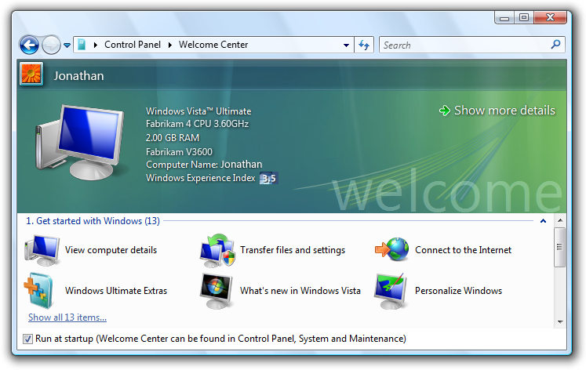
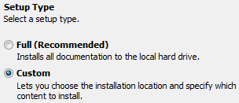

# First Experience

> [!NOTE]
> This design guide was created for Windows 7 and has not been updated for newer versions of Windows. Much of the guidance still applies in principle, but the presentation and examples do not reflect our [current design guidance](/windows/uwp/design/).

In the ideal first experience, users install your program and use it productively immediately, without answering a bunch of questions or learning a bunch of things.

A first experience user interface helps users transition from their first exposure to a new program or feature to everyday usage.

For Windows programs, the initial first experience occurs when users run the Setup program. Setup programs typically:

-   Require the user to accept an End User License Agreement (EULA).
-   Ask for a product key.
-   Present required configuration-related options, including installation of optional software.
-   Copy the software to the user's hard disk.
-   Present program options that apply to all users.

Part of a typical Windows setup experience.

The first experience then continues to the first use of the program or feature. This first use experience can:

-   Present program options that apply only to the current user.
-   Offer product or feature tutorials.

The first use experience.

**Note:** Guidelines related to [program options](win-property-win.md) are presented in a separate article.

## Is this the right user interface?

To decide, consider the following questions.

### Setup experience

Do the following conditions apply?

-   The correct settings are required to use the program, and they apply to all users.
-   The settings customize a core experience, or one that is crucial to the user's personal identification with the program.
-   There is no safe default, the user is likely to choose settings that aren't the default, or the default settings require user consent.
-   The user is unlikely to change settings after setup.
-   Changing the settings requires elevation.

If so, consider presenting the settings during the setup experience.

### First use experience

Do the following conditions apply?

-   The correct settings or tasks are required to use the program or feature, and they apply to individual users.
-   The settings customize a core experience, or one that is crucial to the user's personal identification with the program.
-   There is no safe default, the user is likely to choose settings that aren't the default, or the default settings require user consent.
-   Users are likely to make better choices within the context of the program than within setup.
-   The user is unlikely to change settings using Options.

If so, consider presenting the tasks and settings during the first use experience of the program or feature.

## Design concepts

In the ideal first experience, users install your program (or even just start it if it doesn't require installation) and use it productively immediately without answering a bunch of questions or learning a bunch of things.

This ideal is obtainable for most programs, so you should strive for this ideal experience whenever you can. However, this goal is often not obtainable for programs that require significant system integration, have many optional features, or have privacy implications. For example, if your program has features that might reveal personal information to untrusted parties, the tenets of [trustworthy computing](https://www.microsoft.com/mscorp/twc/default.mspx) require that you obtain user consent before enabling these features.

### Questions aren't choices

Questions require responses they must be answered before users can proceed. Questions during the first experience are hurdles that users must jump over before they can use your program productively. By contrast, choices are optional. Users don't have to respond to them, or can choose to see them only when they want to.

Thus, settings presented in the main flow of a setup wizard are questions, whereas settings outside the main setup flow or in a program options dialog box are choices. Unnecessary questions make your program's first experience cumbersome and long, effectively eliminating the positive anticipation and excitement users have about getting started with your program.

### Use the first experience when you must

Present settings and tasks to users during the first experiences when you must, but usually there are better alternatives:

|                                             |                                                                                                                                                    |
|---------------------------------------------|----------------------------------------------------------------------------------------------------------------------------------------------------|
| **First experience**              | **Alternatives**                                                                                                                         |
| Setup questions                   | Select appropriate defaults.  Allow users to change from program options.  Provide typical vs. custom setup paths.   |
| First use questions               | Select appropriate defaults, and allow users to change from program options.                                                             |
| First use tasks                   | Present contextually instead.                                                                                                            |
| First use feature advertisements  | Make the most common and important tasks discoverable and contextual.                                                                    |
| First use tutorials               | Make program features self-explanatory.                                                                                                  |
| Product registration              | Provide command in Help menu and About box.                                                                                              |

 

**If you do only one thing...**

Keep your first experience as simple as possible. Get your program working right away. Choose safe, secure, convenient defaults and ask questions during setup and first use only when you must.

You have only one chance to make a good first impression and that first impression is lasting.

## Guidelines

### General

-   **Limit first experiences to tasks and settings required to use a program or feature, and only include these when there is no better alternative.** See the previous table for alternatives.
    -   **Exception:** Add personalization or program customization settings to the first experience if their customization is part of the core experience or crucial to the user's personal identification with the program.

Windows asks users for the computer name and choice of background during setup because these settings help form an emotional connection to the product.

-   **Use the setup experience** for tasks and settings if they apply to all users or changing settings requires elevation.
-   **Use the first use experience** for tasks and settings if they apply to individual users.

### Presentation

-   **Prefer optional tasks and settings to required tasks and settings.** Avoid forcing users to configure your program.

    

    The Found New Hardware dialog box makes it optional to install driver software instead of making it a required task.

-   **Take optional tasks and settings out of the main task flow whenever practical.** For example, many setup programs provide a custom installation path to remove infrequently changed settings from the main task flow.

    

    A setup experience that facilitates main task flow if the user does not intend to customize the installation.

-   **Don't overwhelm users with tasks and settings:**
    -   **Start simple.** Begin with simple, personalization settings and progress towards more complex, technical tasks and settings. For example, Windows setup starts with personal information and ends with network configuration.
    -   **Use a contextual first experience** for tasks and settings if they apply only to features that aren't fundamental to the main program.

        

        Windows Live Messenger has a contextual setup for audio and video because they are used by secondary features.

-   **Don't present everything all at once.** Consolidate to use a single UI instead of multiple UI surfaces, or display tasks at different times instead of all at once.

    **Incorrect:**

    

    In this example, the first use experience is overwhelming.

-   **Express questions and options in terms of users' goals and tasks, not in terms of technology.** Provide options that users understand and clearly differentiate. Make sure to provide enough information for users to make informed decisions.
-   **If the need for personal information isn't obvious, explain why your program needs the information and how it will be used.**

    

    In this example, an e-commerce application explains how personal information will be used.

-   **Present first experiences full screen only if users can't productively perform other tasks.** For example, Windows setup is presented full screen to discourage users from performing other tasks while Windows is being installed. Most first experiences shouldn't be full screen.

### Settings

-   **For all settings, select the safest (to prevent loss of data or system access), most secure and private value by default.** If safety and security aren't factors, select the most likely or convenient value. Choosing good defaults is an effective way to simplify the first experience.
-   **Require users to opt in for:**

    -   Settings with legal implications, such as end user licensing agreements (EULAs). Such settings can't have default selections.
    -   Features that perform automatic system configuration changes, such as Windows automatic updates.
    -   Features that reveal personally identifiable information (PII) or system information.
    -   Changes to the user's desktop beyond adding entries to the Start menu, such as adding icons to the desktop or quick launch bar.
    -   Optional software, such as product enhancements, subscriptions, and third-party products.

    

    In this example, users opt in to product enhancements, subscriptions, and third-party products.

-   **If a setting is strongly recommended, add "(recommended)" to the label.** For radio buttons and check boxes, be sure to add to the control label, not the supplemental notes.
-   **If a setting is intended only for advanced users, add "(advanced)" to the label.** For radio buttons and check boxes, be sure to add to the control label, not the supplemental notes.

### Tasks

-   **Help users pass waiting time productively.**
    -   If the waiting time is typically between one and two minutes, consider providing helpful information while users are waiting, such as a presentation of what is new during setup.
    -   If the waiting time is typically longer than two minutes, make it easy for users to perform other tasks. Display the estimated wait time, recommend that users do something else in the meantime, and make task completion obvious by changing the screen significantly.
-   **Reconsider presenting tutorials during the first experience.** Most likely users want to use your program right away and are interested in tutorials at a later point.
-   **Don't use feature advertisement notifications in the first experience.** Instead of using a [feature advertisement notification](mess-notif.md), design the feature to be easier to discover in contexts where it is needed, or don't do anything special and let users discover the feature on their own.
-   **Don't use any notifications during the initial Windows experience.** To improve its first experience, Windows 7 suppresses all notifications displayed during the first few hours of usage. Design your program assuming users won't see any such notifications.

 

