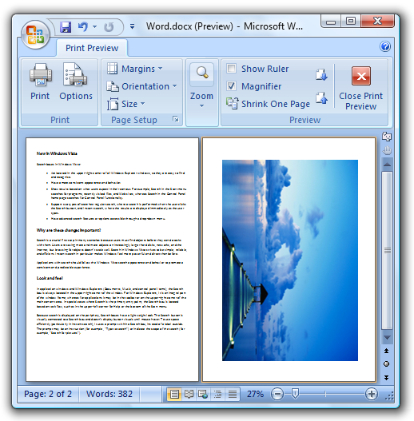

# Printing (Design basics)

> [!NOTE]
> This design guide was created for Windows 7 and has not been updated for newer versions of Windows. Much of the guidance still applies in principle, but the presentation and examples do not reflect our [current design guidance](/windows/uwp/design/).

Printing is the user experience on paper. It's easy to overlook, but it is an important part of the overall user experience.

In this article, *printing* refers to the user experience on paper, where output is directed to paper instead of the screen display. *Printer-friendly format* refers to modifications the program can make to screen display output that make it more suitable for paper output.

Despite the prediction that computing would result in the "paperless office," surprisingly enough we print now as much as ever. We distribute hard copies of Microsoft PowerPoint presentation decks, we print articles we discover online but wish to research more carefully later, we print important e-mails or resumes we have received in electronic form, and so on. While it's easy to overlook printing when designing a user interface, remember that printing is an important part of the overall user experience.

**Note:** Guidelines related to [common dialogs](win-common-dlg.md) are presented in a separate article.

## Is this the right user interface?

To decide if your program needs to support printing, consider these questions:

-   **What type of program are you designing?** The program type is a good indicator of the appropriate level of printing support. Document and image creation, viewing, and browsing programs need excellent printing support, whereas other types of programs may only need printing support to a lesser degree. (For a list of program types, see the [Printing patterns](#printing-patterns) section of this article.)
-   **Is the program used in scenarios that benefit from direct paper output?** If so, it's more convenient to add printing support to your program than to require users to copy the data to another program to print.

## Design concepts

### Design your program to eliminate unnecessary printing

There are many reasons why users need to print some which are good, some which are less so. Users should print because they want to, not because they must. Requiring users to print can be a sign of missing features. For example, in the past users had to print documents in order to make comments and suggest revisions, but now users can do these tasks directly within Microsoft Word documents. **Review your program's scenarios that involve printing, and to the best extent possible, make sure that the need to print is optional and not the result of missing features.**

It's also worth remembering that conserving resources like paper and ink is helpful environmentally and saves organizations money in the long run.

### Understand the differences between screen display and print

While there are many similarities between display output and printing, there are many differences as well. Print output:

-   **Has a high dpi.** Display output is usually at 96 or 120 dots per inch (dpi), whereas printer output is usually at 600 dpi or greater.
-   **Has different optimal fonts.** While well-designed fonts work well for both display and print, serif fonts are more readable at high resolutions for large amounts of text than sans serif fonts. Thus, large amounts of text primarily intended for print should use a serif font, whereas text primarily intended for display should use a sans serif font. For more information, see [Fonts](vis-fonts.md) (Segoe UI).
-   **Has aspect ratio.** Display usually has a low [aspect ratio](glossary.md) (4:3 or 5:4), whereas print uses a high aspect ratio (8.5:11 or 1:1.4142 based on the standard page sizes). This is because [portrait mode](glossary.md) printing is more common than [landscape mode](glossary.md).
-   **Has pages.** Consequently, print output:
    -   Has standard page sizes. The standard in the United States and Canada is 8.5"x11" paper; the standard everywhere else is A4 paper.
    -   Has page breaks.
    -   Has page margins.
    -   Has headers and footers.
    -   Has single- or double-sided output.
    -   May have multiple copies.
    -   May be printed out of order or selectively.
-   **Has many options.** Users may want to choose a printer and paper size, printer options (such as print quality, double-sided printing, and stapling), number of copies, page ranges, collation, and print format.
-   **Takes time and money.** It can take a significant amount of time to print a large document or a high-quality photo, and the cost of the paper and ink adds up over time. By contrast, display output is instantaneous and essentially free.
-   **May be black and white.** Many printers today are black and white, whereas few displays are monochrome.
-   **Is not interactive.** Users can't scroll pages or controls to see more content. They can't click links or buttons, or hover over controls. Interactive content has no value when printed.
-   **Can run out of paper, ink, or toner, or be offline.** Consequently, paper output needs more error handling and troubleshooting.

These differences may affect your printing design. Creating a good print experience requires more than just directing your program's output to the printer.

### WYSIWYG and the evolving requirements of screen display

Historically, the most fundamental principle for the printing user experience is known as WYSIWYG ("what you see is what you get"). This principle suggests that there should be a strong relationship between what is seen on the display and what is printed. Before WYSIWYG became a standard practice, there was often no relationship between the display and print versions of a document. Users had to print in order to see what the document really looked like on paper. Using WYSIWYG was a great improvement in productivity because most programs at the time were primarily designed for document creation and printing.

Today, it is common for Web sites to optimize for the display, and their printer-friendly format may appear much different. Furthermore, we have diverse computing devices (for example, smart phones and personal digital assistants) that often need output optimized for small displays. While WYSIWYG is still the best approach for document creation programs, for other programs it often makes more sense to optimize for a variety of target devices. For such programs, what you see on a PC display may be different from what you see on other device displays, which may be different from what you get on the printed page.

### Optimize for printing

Programs that don't employ a strict WYSIWYG print experience can still optimize for printing in the following ways:

-   Reformat the layout for the target page size.
-   Provide print preview, preferably with easy customization options allowing users to experiment directly in the print dialog (for example, dragging margins).
-   If appropriate, provide a printer-friendly format option.
    -   Consolidate separate partial documents into a single document.
    -   Remove backgrounds and other design elements such as ads, especially if they are unsuitable for a black and white printer.
    -   Remove interactive elements, such as navigation controls and command buttons.
    -   Make sure that all data is visible without scrollbars or hovering.

        **Display version:**

        

        **Printer-friendly version:**

        

        In the printer-friendly version, all the data is visible on the printed page, and the interactive elements are removed.

    -   Replace links with their text equivalent.

        **Acceptable:**

        For more information, see UX Guide.

        **Optimized for printing:**

        For more information, see UX Guide (https://msdn.microsoft.com/windowsvista/uxguide).

-   Convert light text on a dark background to dark text on a white background.

### Include the right print options

The Print options common dialog provides options to:

-   Select the printer and paper size.
-   Set printer properties.
-   Select the page range, number of copies, and collation.
-   Use both sides of the paper.

Your program may require additional options, such as document content options (which content to print), format options (how to print, including print quality, picture sizes, fitting to frame), and color options. If you need to provide additional options, do so by extending the Print options common dialog. Don't create a custom Print dialog box.

When designing the Print options, consider the experience when printing multiple documents. Chances are the next print job will be very similar to the last print job. Optimize the default settings for reprints and similar print jobs don't make users start over completely each time.

### Design print preview for performance and usability

**An incorrect print job wastes time and money. For document creation programs, users should be able to evaluate the results before doing the actual printing.** A print preview should allow users to:

-   Evaluate margins, page breaks, page orientation, headers, and footers.
-   Browse through all the pages.
-   Print directly from the print preview.

Some complex documents (such as computer-aided design \[CAD\] drawings) can take a long time to render. The performance of the preview is important a print preview can become quite tedious if it takes awhile to render each page. **Consequently, it's better to have a print preview that renders quickly and is accurate enough to allow users to evaluate the print results than to have a completely accurate preview that renders slowly.**

When designing the print preview, consider the whole task of preparing to print. What are users going to be looking for? What are they going to change? Document creation programs should provide an interactive print preview so that users can adjust frequently changed settings like margins and line breaks within the preview.

However, to the best extent possible, your program should do the right thing by default. When necessary, warn about printing situations that are unlikely to be what the user intended. Don't rely on users finding problems using the print preview. For example, suppose a spreadsheet has too many columns to print on a single page in portrait mode. While the program could present a confirmation dialog box, a better solution is to print in landscape mode automatically.

**If you do only five things...**

1.  Design a printing experience appropriate for your program type.
2.  Review your program's scenarios that involve printing and to the best extent possible, make the need to print optional.
3.  Provide useful printing extensions by customizing the Print common dialog. Don't create a custom Print dialog box for this purpose.
4.  Optimize the Print options for reprints and similar print jobs.
5.  Provide a preview feature whenever appropriate.

## Printing patterns

The type of program is the primary indicator of the appropriate printing experience:

| 
|
| <strong>Advanced document creation</strong>  Used to create, view, and print high-end documents. The ability to create high-quality printouts is one of the main reasons why the program exists. Targeted at expert users.   | <strong>User goals:</strong> Perfect results detailed control over the print output. <strong>Example:</strong> Microsoft Word <strong>Recommended printing experience:</strong> <ul><li>Output optimized for print (WYSIWYG).</li><li>Advanced document formatting features, with options to print large objects.</li><li>Advanced print options, including headers and footers. Document-related print options are saved within the document itself.</li><li>Fast, accurate, powerful print previews.</li></ul> | 
| <strong>Intermediate document creation</strong>  Used to create and view more complex documents. The ability to create good-quality printouts is important, but not necessarily one of the main reasons why the program exists. Targeted at intermediate users.   | <strong>User goals:</strong> Good results with minimal effort. Some control over the print output. <strong>Examples:</strong> Most Microsoft Office programs, such as Outlook and Excel. <strong>Recommended printing experience:</strong> <ul><li>Output optimized for print (WYSIWYG).</li><li>Some document formatting features, with ability to print large objects without truncation.</li><li>Some custom print options, including headers and footers.</li><li>Accurate, easy to use print previews.</li></ul> | 
| <strong>Simple document creation</strong>  Used to create and view simple documents. Targeted at all users.   | <strong>User goals:</strong> Basic printing support with standard printing options. Users expect good results without any tweaking. <strong>Examples:</strong> WordPad, Paint. <strong>Recommended printing experience:</strong> <ul><li>Output may be optimized for print (WYSIWYG), but this is not required.</li><li>Some document formatting features, with ability to print large objects without truncation.</li><li>Standard print options; custom print options are optional.</li><li>Simple or no print previews.</li></ul> | 
| <strong>Document viewers</strong>  Used to view documents. Users can't change the document content or format.   | <strong>User goals:</strong> Basic printing support with standard printing options. Users expect good results without any tweaking. Printing problems are handled automatically because users can't modify the document. <strong>Example:</strong> Windows Internet Explorer <strong>Recommended printing experience:</strong> <ul><li>Output may be optimized for print (WYSIWYG), but this is not required.</li><li>Program automatically handles page breaks, eliminates blank pages, handles large objects, and removes backgrounds and other design elements.</li><li>Standard print options; custom print options are optional.</li><li>Simple or no print previews.</li></ul> | 
| <strong>Utilities or line-of-business applications</strong>  Used to perform simple, specific tasks. Targeted at all users.   | <strong>User goals:</strong> Ability to export selected data efficiently. Users expect good results without any tweaking. Often for such programs, users are pleasantly surprised to find any printing support at all. <strong>Recommended printing experience:</strong> <ul><li>Printing support is optional depending upon supported scenarios.</li><li>Output may be optimized for print (WYSIWYG), but this is not required.</li><li>Some document formatting features. Might be acceptable if large objects are truncated.</li><li>Standard print options.</li><li>Print previews optional.</li></ul> | 

 

## Guidelines

### General

-   **Don't print blank pages or pages with just headers and footers.** However, print blank pages if the headers or footers contain page numbers and those page numbers might referenced elsewhere.
-   **Completely spool out any pending print jobs before shutting down a program.**

### Formatting pages

-   **Reformat text layout to fit within the target page size.** Never truncate text.
-   If users don't control the format of the document:
    -   **Automatically handle large objects by scaling, rotating, or splitting across pages.** For more guidelines about printing large objects, see [Oversized objects](#oversized-objects).
    -   **Optimize the page breaks to eliminate blank and nearly blank pages.**
    -   **Convert light text on a dark background to dark text on a white background.**
    -   **Remove backgrounds and other design elements,** especially if they are unsuitable for a black and white printer.
-   **If your program presents separate partial documents, provide a printer-friendly format option to consolidate them into a single document for printing.**
-   **Remove interactive elements:**
    -   Remove navigation controls and command buttons.
    -   Make sure that all data is visible without scrollbars.
    -   Replace links with their text equivalent.

        **Acceptable:**

        For more information, see UX Guide.

        **Optimized for printing:**

        For more information, see UX Guide (https://msdn.microsoft.com/windowsvista/uxguide).

        In this example, the link is replaced with its text equivalent in parentheses.

    -   Move useful information displayed on hover to inline.

### Oversized objects

Handling large objects, such as spreadsheets, graphics, and photos, is a problem unique to printing. Choose one of the following approaches:

-   **Scale the object to fit on the page.** This approach works well if the object is only slightly too large to print, keeping the object on a single page is important, and the object is still legible when scaled down.

    

    In this example, the large image is scaled to fit on the page.

-   **Rotate the page.** This approach works well when a few pages print better in landscape mode when in portrait mode (and vice versa).

    

    In this example, the large image is rotated to fit better on the page.

-   **Print the object on several pages.** The approach works well when the object can't be scaled, or shouldn't be scaled, and rotating the page doesn't help or isn't wanted. If the object has internal boundaries (such as the column and row dividers in a spreadsheet), break the pages on these boundaries instead of within the content. Also, repeat any elements required to understand the page, such as legends or column headers. When splitting an object on several pages, assign the page numbers in reading order (left to right, top to bottom).

    

    In this example, the large table is printed on two pages. Column headers persist from page to page to facilitate quick comprehension.

-   **Truncate the object** (printing only the part of the object still visible after truncation). This approach is the simplest solution to implement, but likely to be the least acceptable. Also note that truncating is never acceptable for text.

    

    In this example, the large image is truncated.

### Headers and footers

-   **Provide headers and footers for advanced and intermediate document creation programs.** Consider providing headers and footers for other types of programs if they are used for multipage documents.
-   **Make headers and footers customizable.** Allow users to define the left, center, and right portions.
    -   For headers, put the document name on the left side by default.
    -   For footers, put the document copyright or source on the left side, and the page number on the right side, by default.
-   **Use friendly file path and URLs.** Display spaces as spaces, not "%20."

### Print commands

-   **For menu bars and shortcut menus, use the Print command that displays the Print options common dialog.** Use an ellipsis to indicate that additional information is required.

    

    In this example, the Print command has an ellipsis to indicate that it will display the Print options common dialog to get more information.

-   **For toolbars used with a menu bar, use an immediate Print command.** Clicking the button prints a single copy of the document to the default printer. Such toolbar commands should be immediate. To indicate that the command is immediate, put the default printer in the tooltip. Users can access the full Print command from the menu bar.

    

    In this example, the Print command in a toolbar prints immediately instead of displaying the Print options common dialog. Putting the default printer in the tooltip provides textual reinforcement that the user is bypassing the dialog.

-   **For toolbars used without a menu bar, use a Print split button.** Clicking the button prints a single copy of the document to the default printer. Clicking the arrow portion of the button drops down a menu with full Print, Print preview, and Page setup commands.

    

    In this example, the Windows Internet Explorer toolbar uses a split button control to provide all the print commands.

-   **For the ribbon command user interface, put the Print command in the application menu.**

    

    For ribbons, the Print command is accessed using the application menu.

### Print options

-   **Don't create a custom Print options dialog box.** If you must provide additional options, extend the Print options common dialog. Don't use a separate dialog for additional print options.

**Incorrect:**

In this example, Fabrikam incorrectly uses a separate dialog for additional print options.

**Developers:** For information about how to extend the Print common dialog, see [PRINTDLGEX Structure](/windows/win32/api/commdlg/ns-commdlg-printdlgexa).

-   **When extending the Print options common dialog, don't duplicate any features already provided.**
-   **If users are likely to maintain settings from one print job to the next, make those settings the defaults.** For the first print job after program launch, use the standard default values, including the default printer. For subsequent print jobs in the program [instance](glossary.md), preserve the last selected printer and paper size. Don't preserve the number of copies or page ranges, because these are far less likely to be reselected later.
-   **Optimize the settings by removing options that currently don't apply.** Remove options that are inconsistent with the capabilities of the selected printer or characteristics of the current document. For example, a photo printing application could limit the combinations of paper size, paper type, and print quality that give the best results, so choosing a glossy paper option might remove envelopes from the paper formats. If for any reason users want to see all the options, you can provide this ability through a control such as a check box.

**Developers:** To learn how to determine the capabilities of the selected printer, see [Print Schema](../printdocs/print-schema.md).

-   **For advanced document creation programs, save the document-related print options within the document itself.** For these programs, the print options are an integral part of the document.
-   **For other types of programs, save settings on a per-user basis.**
-   **Consider selecting a non-default printer for specialized printing.** For example, a photo printing application could always select the printer last used by the program, regardless of the system default printer. Doing so assumes that the system default printer isn't likely to be a photo printer. Such programs should save the setting for the last selected printer.
-   **Don't lock up your program while detecting printer capabilities.** Doing so presents a poor user experience. Instead, either:
    -   Perform the printer capability detection in a separate thread.
    -   Time out after 10 seconds.
    -   Provide a dialog box to allow users to cancel.

In this example, the dialog box makes it easy to cancel the printer capability detection if the user decides the task is taking too long.

### Print previews

-   **Provide a print preview feature whenever appropriate.** All document creation programs benefit from print previews, but users don't expect them in simple document creation programs. For advanced document creation programs, consider having print preview support directly within the main program window.

In this example, Word has print preview support within the main program window.

-   Provide print preview features that allow users to:
    -   Evaluate margins, page breaks, page orientation, headers, and footers.
    -   Browse through all the pages.
    -   Print directly from the print preview.

Consider providing an interactive print preview so that users can adjust frequently changed settings like margins and line breaks directly within the preview.

-   **Have print preview pages render within one second.** It's better to have a print preview that renders quickly and is accurate enough to allow users to evaluate the print results than to have a completely accurate preview that renders slowly.
-   **For advanced document creation programs, consider extending the standard Print dialog box by incorporating preview functionality directly within it,** rather than creating a separate dialog for it.
-   **Provide an obvious button for closing preview mode.**

The Print Preview mode in Word has an obvious close preview command.

### Printing errors

**Note:** Once the print job has been spooled to the printer, Windows is responsible for any subsequent errors. Your program only has to handle errors that happen before the print job is spooled.

-   **Before spooling a print job, check for any potential printing problems the user can fix.** Present a clear, concise confirmation before continuing to print. Whenever possible, offer to fix the problem automatically. Doing so can prevent a waste of time and money.

## Text

-   For the option to print on both sides of the paper, label the option Print double-sided. Don't use the phrase Manual Duplex.

## Documentation

-   Use print, not print out, as a verb.
-   It's acceptable to use printout to refer to the result of a print job.
-   Use print queue, not printer queue.

