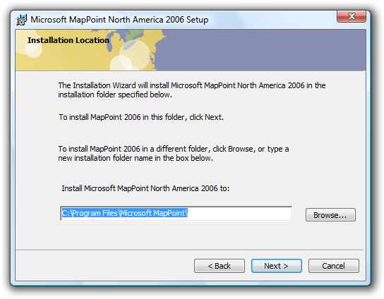

# Setup

> [!NOTE]
> This design guide was created for Windows 7 and has not been updated for newer versions of Windows. Much of the guidance still applies in principle, but the presentation and examples do not reflect our [current design guidance](/windows/uwp/design/).

Users don't enjoy installing software, so modern setup experiences need to be simple, efficient, and problem-free.

Setup usually refers to the experience of installing and initially configuring a program. However, setup can also refer to entire installation life cycle, including initial installation, incremental program updates (such as version upgrades or service packs), repairing, and uninstalling.

Most users regard setup as a necessary evil, to be performed as quickly as possible. The point of installing the program is to use it, not to make innumerable decisions about configuration and usage, or, worse yet, to spend a lot of time answering personal questions used for registration or marketing purposes.

A streamlined setup experience.

The setup experience combined with the first use of the program is known as the first experience. Your program should provide a streamlined first experience for users. Each question or step that isn't necessary or could be postponed delays them from using your program. Overly complex setup programs are relics from a different age.

**Note:** Guidelines related to the [first experience](exper-first-exper.md) using a program and [wizards](win-wizards.md) are presented in separate articles.

## Is this the right user interface?

While all Microsoft Windows programs need some sort of setup program, you have a choice of where to put program settings:

-   Setup
-   First use of the program
-   Centralized program options
-   In the context of using the feature

**Setup**

Present settings in setup if:

-   The correct settings are required to use the program, and they apply to all users.
-   Using default settings isn't acceptable, either because there is no safe default, users are likely to choose settings that aren't the default, or the default settings require user consent.
-   Users should, but aren't likely to, change important settings after setup.

**First use of the program**

Present settings on the program's first use if:

-   The correct settings are required to use the program, and they apply to individual users.
-   Using default settings isn't acceptable, either because there is no safe default, users are likely to choose settings that aren't the default, or the default settings require user consent.
-   Users should, but aren't likely to, change important settings using the program options.
-   The settings customize a core experience, or one that is crucial to a user's personal identification with the program.

For such settings, users are likely to make better choices within the context of the program than within setup.

**Centralized program options**

Present settings on the program's [options dialog box](win-property-win.md) if all of the following conditions apply:

-   There are default settings that work well for most users.
-   There are many settings and they apply across features and tasks.
-   Users are more likely to expect to find the settings in a centralized location.

**In the context of using the feature**

Present settings in the relevant context if all of the following conditions apply:

-   There are default settings that work well for most users.
-   There is a small number of self-contained settings for a specific feature.
-   Users are more likely to expect to find the settings with the associated feature than a centralized location.
-   There is an obvious place in the user interface (UI) to access the settings.

Through careful attention to the placement of configuration settings, you can reduce the burden on users during their first experience with your program.

## Design concepts

### Design a lightweight setup

Welcome, next, next, next, next, next, install, finish, congratulations! Does this setup experience sound familiar? Historically, setup programs have adopted this kind of inefficient design: a long sequence of screens, inviting users into a mindless sequence of clicks just to get through it.

If users describe the setup of your program with words like quick and simple, they are surely praising the experience. They would much rather be using your program than setting it up.

**Review your setup design for nonessential questions, options, pages, and paths, and be ruthless about eliminating them.** Perform user research to find out what options users really need, and make sure they aren't mindlessly clicking the Next button through all the pages. Defer any options or questions that are better addressed in the context of the running program.

Many setup programs offer standard pages not because they are necessary or helpful, but because they are standard. For example, welcome pages, summary pages, and congratulations pages often just add clicks. Instead, your setup program should add pages only if they are necessary to complete the setup task. For guidelines about types of setup pages and how to evaluate them, see [Page types](#page-types) later in this article.

In this example, the setup program eliminates the traditional Welcome page and gets right down to business.

While it might be necessary to offer different branches of setup (a speedy, typical experience and a more controllable, custom experience), make sure that you have enough custom options to warrant the extra complexity. Don't add branches unless you have to. A few unimportant options in a custom branch suggests the need to reorganize the setup design.

Another reason to streamline setup is that inexperienced users sometimes overanalyze options, fearing that a wrong choice could be irreversible or destructive. Forcing users to make decisions about things they don't understand or care about can make them feel anxious, incompetent, and even frustrated. Not a good first impression. It is better just to get them going quickly, feeling comfortable and confident as they explore the features in your program, and making better decisions about feature options at that time. For more guidelines, see [Streamlining setup](#streamlining-setup) later in this article.

Strive to make your setup experience as [simple as possible, but not simpler](/previous-versions//dn742474(v=vs.85)). Programs targeted at highly technical users may need a complex setup. For example, the Microsoft SQL Server team discovered that database administrators prefer to retain control over many setup options, such as file locations. Moreover, SQL Server is a large business application, with a number of components that differ widely in purpose and functionality. So while we want to keep things simple, setup needs to reflect the complexity of the product and the expectations and needs of its users.

Still, such complex setup programs should be the exception, not the rule. Most Windows programs should strive to start the setup process with a simple, single step.

### Setup phases

Well-designed setup programs let users perform other activities during the time-consuming task of downloading and copying files. To run unattended, setup programs are designed to have four separate phases:

-   **The decision phase.** Users indicate how they want the program installed and configured.
-   **The downloading phase.** For programs downloaded from the Internet. If the program has multiple applications or versions, users indicate what to download during the decision phase.
-   **The installation phase.** The setup program copies the files and makes the appropriate configuration changes.
-   **The completion phase.** Any remaining details, steps, or problems are addressed.

Because the installation phase might take a long time, this phase should be designed to run to completion without any user involvement. This means that all questions should be asked during the decision phase, and any problems that arise should be queued and dealt with in the completion phase. **If the installation phase takes more than one minute to complete, assume that users will be doing something else during the download and installation phases.**

**Incorrect:**

In this example, the setup program interrupts progress to ask a question that should have been asked during the decision phase.

### Present helpful progress

If users patiently wait through the installation phase of the setup experience, perhaps watching a progress bar to its apparent completion, only to witness the progress bar reset and start over, there's a real sense of betrayal. The reported progress was misleading and ultimately meaningless.

A variation on this painful scenario is the "brinksmanship" installation: users see progress reach, say, 99 percent complete, yet are forced to wait for a disproportionate amount of time before finally getting to 100 percent complete. So in terms of what is most important to the user, an implied promise about the amount of time to wait, the claim of 99 percent complete is deceptive.

During the downloading and installation phases, users typically have two things they want to know: should they wait or do something else, and is the setup going to be done soon. While there are enough variables in the setup process to prevent you from providing perfectly accurate progress information, the progress feedback needs to be accurate enough to answer these two questions and set appropriate expectations. In addition to a progress bar, you can include a brief statement about the overall time expected for the process.

In this example, the progress page includes a brief, general statement about how much time the installation could take.

Good setup programs use progress bars effectively to provide users with helpful information about the setup program's progress. For more guidelines, see [Progress Bars](progress-bars.md).

### Design for all setup scenarios

Modern setup programs must be designed to handle a variety of installation scenarios:

-   The user of the program is installing it from a disc or network file share.
-   The user of the program is downloading it from the Web.
-   An original equipment manufacturer (OEM) is including the program on the computer at the factory.
-   An IT professional is installing the program on many computers across an organization.
-   Someone other than the user is installing the program (for example, a parent on behalf of a child, or a co-worker who is using the same computer as another co-worker).

Given these scenarios, you shouldn't assume that users are always installing the program for themselves (making options about personal preferences inappropriate), going to be monitoring the process closely (making unattended setup important), or even want a graphical user interface for the task.

### Don't forget the uninstall experience

To complete the software setup lifecycle, users need to be able to remove software they don't want or no longer need. This is especially important if they didn't install the program themselves (for example, if it came pre-loaded on the computer).

### Handle technical support strategically

Installing your program is the one task that all your users must complete successfully. If users fail to install your program, either you need to provide them with costly technical support or they aren't your users anymore.

Design your setup program to provide your technical support team with the features and information they need to help users install successfully. These details shouldn't normally be exposed to users, but they should be readily accessible when needed.

**Incorrect:**

In this example, the progress bar is showing details meaningful only to technical support.

Keep the normal user experience simple—don't clutter it with information that has value only to technical support. Rather, record support information in a setup log file instead. And more importantly, help users avoid the need for technical support with clear, concise error messages that explain problems well and provide practical solutions. Provide links to Help articles when necessary. Consider providing a Repair option to your setup program to repair missing or corrupted files or settings.

**If you do only three things...**

1.  1. Make setup as simple and lightweight as possible. Remember that users don't enjoy setup, they endure it. Look carefully at every question, option, page, and path, and trim away everything that isn't essential to completing setup.
2.  2. Design for all setup scenarios, including unattended installations, scripted installations, and uninstall. For efficient unattended installations, make sure there is a clean separation between the setup phases.
3.  3. Design your setup program so that users can resolve setup problems on their own, but also log the information needed for technical support just in case. Keep in mind that setup is the one task that all users must complete successfully.

## Guidelines

### General

-   **Apply the standard wizard guidelines for wizard-based setup programs.** Use these guidelines to determine good page design, effective navigation, good control labels, use of main instructions, and use of help.
-   **Allow users to restart the setup program where they left off if it requires a lot of user input or takes a long time to complete.** If users restart the program after closing it before completion, restore previous user input, and restart where the setup was stopped.
-   **Don't display setup windows maximized.** Displaying a setup window maximized presumes that users will give setup their undivided attention, which is unlikely. Instead, choose a size that is appropriate for the content to maintain a simple appearance.

### Windows integration

-   **Name the setup file "Setup.exe".** "Install.exe" is an acceptable alternative. This enables Windows (and users) to recognize the file as a setup program.
    -   **Exception:** For programs downloaded from the Internet, help users manage and organize their Downloads folder by including the name of the program in the name of the setup file. For example, SetupVisualStudioExpress2008.exe.
-   **Copy program files to the proper file system locations.** Doing so allows users and Windows to find and organize the files better. For more information, see the [Windows File System Namespace Usage Guidelines](../fileio/naming-a-file.md#namespaces).

### User Account Control

-   **Digitally sign the setup executable file.** Signed executables have many advantages, including using a more specific User Account Control Elevation UI. For information about signing files, see [Introduction to Code Signing](/previous-versions/windows/internet-explorer/ie-developer/platform-apis/ms537361(v=vs.85)).
-   **If a setup might require elevation, elevate as late as possible.** Display the elevation UI only after the user has committed to an option that requires elevation. Usually, the elevation UI appears during the installation phase, not the decision phase. However, if a setup always requires elevation, elevate at its entry point.
-   **Always require elevation for uninstall.** Doing so prevents malware from uninstalling critical software without users knowing about it.
-   **Once elevated, stay elevated until elevated privileges are no longer necessary.** Users shouldn't have to elevate multiple times to perform complete a program installation.
-   **If special privileges are required for installation, verify the user's credentials and report any problems on the first or second page.** Don't let users perform a lot of work only to find that they don't have the right credentials to complete the installation.
-   **Require the least privileges possible.** For example, administrators are reluctant to install software that requires domain administrator credentials.

For more guidelines, see [User Account Control](winenv-uac.md).

### Restarting Windows

-   **Avoid restarting Windows.** Most programs should install without restarting Windows. The primary reason program installations or updates require a system restart is that some of the files involved are currently being used by a running program. In this case, a better alternative is to make users aware of the situation, allow users to close these programs, and retry the action. For more information about avoiding restarts, see [Restart Manager](../rstmgr/restart-manager-portal.md).
-   **If your setup must restart Windows:**
    -   **Use a single restart.** Delay the restart required by any prerequisites until the program and its updates are completely installed.
    -   **Let users determine when it happens.** Don't restart Windows automatically, because users may lose work. Make sure that it's clear to users that they have a choice.

        **Incorrect:**

        

        In this example, users don't appear to have a choice about when to restart Windows.

    -   **If the user chooses to not restart Windows immediately, present any final feedback as a success, not a failure.** While technically the installation isn't complete until restart, it was successful from the user's point of view.

### Streamlining setup

-   **Whenever practical, start the installation process with a single step.** For example, instead of adding a separate page in setup for the license terms, you may provide a link to them instead. If you link to the terms:
    -   Phrase the commit button as "Agree and install" to require explicit consent to accept the license terms.
    -   Ensure that the license agreement link cannot be broken by linking to a file local to the setup instead of a Web page.
    -   Provide the ability to print the license agreement from its display window.
-   **Eliminate unnecessary options and questions.**
    -   Postpone options that are more appropriate for the first use of the program or feature.

        

        In this example, Windows Media Player presents per-user privacy options on first use of the program.

    -   Don't ask users questions about the system state. Detect this information automatically instead, and ask users to verify only if there is a reason to change.
    -   Don't ask questions about unimportant details. For example, for typical Windows programs it is safe to assume that you should copy program files to the Program Files folder.

        **Incorrect:**

        

        In this example, setup should be streamlined by eliminating the request for file location input. Given the program's size, most users don't care, and simply click Next.

    -   Don't ask permission to do what you shouldn't do anyway. For example, most programs shouldn't include an option to put the program icon on the desktop.
    -   Don't confirm setup cancellation. If users click Cancel during setup, assume the cancellation was intentional and close the program without confirmation. If doing so risks losing significant time or effort, allow users to restart your setup program and pick up where they left off.

-   **Optimize for unattended installation.**
    -   Present all options and questions during the decision phase.
    -   For the download and installation phases, delay requiring user input to any problems encountered until the end of the phase. By doing so, users can leave the installation unattended until they return at their convenience.
-   **Eliminate unnecessary pages.** If most users always just click Next on a page, consider getting rid of the page. For guidelines about eliminating certain types of pages, see [Page types](#page-types).
-   **Eliminate unnecessary text.**
    -   Remove redundant text from instructions and labels.
    -   Don't explain basic Windows usage concepts, such as:
        -   How to interact with controls (examples: To begin, click Next; For more options, click Options; For more information, click Help).
        -   How wizards work (example: If you want to review or change any settings, click Back).
        -   How setup works (example: This program will copy the program files to your hard disk...).
-   **Eliminate unnecessary effort.**
    -   Provide good default values:
        -   Generally, select the most secure and private response to be the default.
        -   If safety and privacy aren't factors, select the most likely or convenient response.

            

            In this example, the user name and organization provided by default are obtained from the registry.

        -   If an option is strongly recommended, consider selecting it by default, or adding "(recommended)" to its label.

    -   Advance pages automatically when a page has no input and the task is done successfully, such as with download, installation, progress, and updates pages. Once the step is done, stay on these pages only to show problems.
    -   When practical, start the program automatically when setup is done, instead of showing a Congratulations or Completion page. When setup is run interactively, assume the user is installing your program in order to run it immediately, so running the program is the best feedback to show that setup is complete. Automatically running the program isn't practical when the setup installs more than one program (for example, a suite consisting of many programs), when setup isn't run interactively, or when the installation process isn't complete after setup.

### Page types

**Welcome and Getting Started pages**

-   **Eliminate Welcome pages.** While it's great to feel welcome, users typically just click Next without reading. And because users typically skip over these pages without reading, the text does little more than state the obvious, by design.

    **Incorrect:**

    

    In this example, there's nothing for the user to do but click Next.

-   **Use a Getting Started page only if you must inform users about prerequisites for installing.** Such prerequisites include installing required software or hardware, performing required system configuration changes and updates, performing a system backup to protect against data loss, or obtaining required information that the user isn't likely to have already.
-   **Whenever practical, provide the ability to perform the prerequisites directly from the setup program.** Users should have to perform the steps manually only if there isn't an alternative.
-   If a Welcome page or Getting Started page isn't used, **include the program name and description on whatever is the first page of the Setup program.** You can use welcoming language as introductory text as long as the page's purpose is clear.

**License terms pages**

-   **Write the license terms using clear, concise text.** Use plain language. Avoid "legalese."
-   **Present using a format that is easy to read and scan.** Don't use long passages of uppercase text.

    **Incorrect:**

    

    In this example, the uppercase text and large font size makes the terms difficult to read, forcing users to scroll more than necessary.

-   **Require explicit consent to accept the license terms.** License acceptance should never be selected by default. If radio buttons are used to indicate acceptance, leave the options cleared by default and require users to accept the terms before enabling the Next button.

    

    In this example, the Next button is disabled until users have explicitly accepted the license terms.

-   **Don't require users to scroll to the bottom of the license terms text before the Next button is enabled.** This imposes an unnecessary burden on users to understand why the Next button is disabled.
-   **Provide a Print command,** either with a command button or a context menu. Present the terms in a format optimized for printing.

**Product registration pages**

-   **Require users to register only if they must in order to use the program.** Clearly explain why users must register.
-   **Provide optional registration only if there is a clear user benefit,** such as to notify users of product updates. Leave this option cleared by default.
-   **Allow users to register later.** Provide a maximum of three reminders and allow users to dismiss the reminders with a single click.

**Scope pages (typical, custom, or minimum)**

-   **Prefer to eliminate this page.** Assume that most users want the typical setup experience (and design that experience so that it works well for most users).
-   If you must include a scope page:
    -   **Explain the differences among options in terms of functionality and disk space.** Users rely on the clarity of information on the scope page to ensure that they make the right choice.
    -   **Make sure that the custom options are necessary only for a small percentage of users, while most users can safely ignore them.** If not, the options should be in the typical setup path.
    -   **If users choose custom options, have the typical installation options selected by default.** Users regard the typical installation as the baseline, and want to customize by adding or removing options from that baseline.
-   If you must use a custom installation option, **consider using relative button sizing and placement to guide most users to the typical installation.**

    

    In this example, the page design visually reinforces the fact that most users should opt for the typical installation.

**Input pages**

-   **Reduce the number of setup options by doing the right thing by default.** For ways to eliminate options see [Streamlining setup](#streamlining-setup).
-   **Provide acceptable default values whenever possible.** Choose defaults that are secure and private, and are acceptable to most users without change.
-   **Unless your program has unusual requirements, strive to have a single page of questions and options.** But if your program requires several pages of questions and options, display them in the main wizard page flow. Don't try to reduce the number of pages technically by putting options in dialog boxes or using tabs.
-   
-   In this example, options are limited to a single page.
-   **Validate input as soon as possible:**
    -   Prohibit invalid characters on entry.
    -   Use [balloons](ctrl-balloons.md) to report problems with invalid text boxes.
    -   Validate related fields on a page when users click Next.
    -   Validate related fields across input pages as soon as problems can be detected.
-   **Give all editable file paths a Browse button.** Allow users to specify network paths.
-   **For the final input page, label the commit button Install, not Next.** Users shouldn't be surprised by when the installation starts. Before the commit point, make sure that users can easily change any settings.

**Start installation pages**

-   **Eliminate this page if it has no purpose other than to summarize the previous choices and begin installation.** If the input pages are clear and few in number, there should be no need to summarize them. Instead, the final input page should have the Install button, leading directly to the progress page.
-   **For complex installations targeted at IT professionals, provide an Installation page with a comprehensive list of changes that the setup program will perform.** Many IT professionals have strict change management control, so they need to know the effect installing the program will have in detail.

**Progress pages**

-   **Always provide a progress page,** even if the program installs quickly. Provide a separate progress page for [the downloading phase](#setup-phases) if there is one. Disable the Back (or Previous) and Next buttons while the setup is in progress, but leave the Cancel button enabled and responsive.

    

    A typical progress page.

-   **Use a single, determinate progress bar.** Follow the [determinate progress bar guidelines](progress-bars.md), including:
    -   Clearly indicate completion. Don't let a progress bar go to 100 percent unless the operation has completed.
    -   Don't restart progress. A progress bar loses its value if it restarts (perhaps because a step in the operation completes) because users have no way of knowing when the operation will complete. Instead, have all the steps in the operation share a portion of the progress and have the progress bar go to completion once.
-   **Provide a concise description of the current step above the progress bar.** For quick installations, such text is unnecessary; the progress bar alone is sufficient. For installations requiring a minute or longer, text can be helpful for users attending the setup.
    -   **Use sentence fragments, typically beginning with a verb, and ending with an ellipsis.** Examples: Copying files..., Installing required components....
    -   **Place text above the bar, not below.**

        **Incorrect:**

        

        In this example, the explanatory text should appear above the progress bar.

    -   **Refrain from cluttering the progress page with unnecessary details.** This page isn't for [technical support](#handle-technical-support-strategically), so there's no need to display registering GUIDs or specific files copied.

        **Incorrect:**

        

        In this example, technical details such as GUIDs are meaningless to users.

**Error pages**

-   **If setup fails with a significant problem, display an error page that explains the problems along with practical steps to resolve them.** Display the page with an error icon. Don't use a dialog box for this purpose.

    

    In this example, the setup failure is explained on an error page, along with some steps to resolve the problem.

-   **If setup completes with a minor recoverable problem, present the problem as an additional task instead of an error.** Use positive, success-oriented, encouraging language, not terms like error, failure, or problem. Don't use an error icon.

**Congratulations/Completion pages**

-   **When installing a single program interactively, start the program (and close the setup wizard) to indicate successful setup, instead of displaying a completion page. Exceptions:**
    -   Setups that are run from the command line should not start programs.
    -   Automatic updates (for example, Windows Update) shouldn't start programs.
    -   Group policy installation shouldn't start programs.
    -   Any IT professional setup scenarios (because they are not installing for their own use).
-   **If the setup has follow-up steps after installation, list them on a Completion page.** But to justify a Completion page, make sure users are likely to perform the steps, and that the steps genuinely need to be stated (that is, they are not obvious).

    **Incorrect:**

    

    In this example, an unnecessary Completion page states the obvious. Windows Update runs automatically, so there's no reason for users to run it manually.

-   **When installing a suite of programs, display a Completion page to indicate success and any follow-up steps that may be necessary.**

    

    In this example, setup has installed multiple programs, so it doesn't make sense to start one particular program automatically. A Completion page is more appropriate.

### Leaving users in control

-   **Don't gather personal information, such as that used for marketing purposes.** Setup isn't an opportunity to push your own agenda, cross-sell other program offerings, or conduct market research; you can damage the trust relationship with your users this way.
-   **Don't force users to opt out of installing optional features.** Allow them to [opt in](glossary.md) instead. For example, users should explicitly choose to install a Windows Desktop Gadget.
-   **Allow users to add or remove optional features using the setup program after initial setup.** Users can perform this task using the **Uninstall or change a program** control panel item.
-   **For customer experience improvement initiatives, explain what data is transmitted, how it is used, and how long it is kept.** Use a link to a privacy statement Help topic for this purpose.
-   **Avoid using sound,** because many installation scenarios are unattended, and because sound can be unnecessarily distracting even during attended installations.

### Security

-   **For Internet-based setup, provide any security updates automatically during initial setup.** Users should not have to update as a separate step.
-   **Avoid recommending that users turn off firewalls as a prerequisite to installing your program.**
-   If a firewall must be turned off, do the following:
    -   **Limit the duration of this condition to as short a time as possible.**
    -   **Explicitly point out when users can turn the firewall back on again.**

### Uninstall

-   **Uninstall should remove all traces of a program, including the following:**
    -   Program files, including the setup program.
    -   Start menu entries.
    -   Desktop icons and Quick Launch icons (if any).
    -   Registry settings.
    -   File associations.
-   **Uninstall should leave behind the following:**
    -   User created files, such as document files.
    -   Shared dynamic-link libraries stored in the System folder.

### Help and support

-   **Design your setup program not to need Help by asking clear, self-explanatory questions.** Reserve Help for advanced questions that really benefit from further explanation.
-   **Don't use readme files.** These files are now obsolete and users don't read them anyway. Instead, provide online content if needed.
-   **Link to appropriate Help topics or troubleshooting content from setup error messages.** Make sure the Help content provides a clear path to resolving the problem. For more information, see [Error Messages](mess-error.md).
-   **Create log files to capture information useful to technical support.** Don't clutter the setup UI with technical support-related details that are meaningless to most users. Use log files for this purpose instead.

### Text

-   **Be concise.** Setup wizards often overexplain features and options, using blocks of text that are difficult to scan quickly. **Exceptions:**
    -   Spell out all acronyms. Setup is often users' first experience with your program, so don't assume they understand jargon such as acronyms.
    -   Explain unfamiliar terminology and concepts, preferably in place but using Help topics if necessary.
-   **Prefer a friendly, professional tone; avoid an overly-technical tone.**

**Incorrect:**

Restrict installation on a per-user basis.

**Correct:**

Install only for me.

-   Don't use now in command button labels because the immediacy of the command can be taken for granted.
    -   **Exception:** When necessary, use now to differentiate commands that start a task from commands that perform a task immediately.

In this example, clicking the command button goes to a window or page that allows users to download.

In this example, clicking the command button performs the download immediately.

Only one command in a task flow should be labeled with now. So, for example, a **Download now** command should never be followed by another **Download now** command.

-   Use license terms, not license agreement, licensing agreement, end user license agreement, or EULA.

For more guidelines, see [Style and Tone](text-style-tone.md).

## Documentation

-   As a verb, set up is two words; as an adjective or noun, setup is one word.
-   The Setup program is capitalized and is not hyphenated.
-   Use install to refer to adding hardware or software to a computer system.
-   Don't use install as a noun. Use installation instead.
-   Use restart, not reboot. Indicate that it is the computer, not a program, that is restarting.

 

 