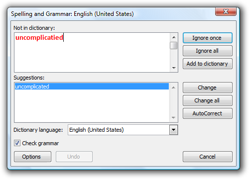
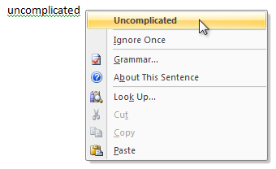

# How to design a great user experience for desktop applications

> [!NOTE]
> This design guide was created for Windows 7 and has not been updated for newer versions of Windows. Much of the guidance still applies in principle, but the presentation and examples do not reflect our [current design guidance](/windows/uwp/design/).

A great desktop application is powerful and, at the same time, simple. Through carefully balanced feature selection and presentation, you can achieve both power and simplicity.

**Powerful:**

**Powerful and simple:**

The ideal Windows-based application is both powerful and simple. Of course you want your application to be powerful and of course you want it to be simple, but can you achieve both? There is a natural tension between these goals, but that tension is far from irreconcilable. You can achieve both power and simplicity through carefully balanced feature selection and presentation.

## What makes an application powerful?

What does "power" really mean in terms of software? An application might be considered powerful if it is jam-packed full of features, having a tremendous breadth of functionality in an attempt to be all things to all users. Such a design is not likely to be successful because an untargeted feature set is unlikely to satisfy the needs of anyone. This is not the type of power that we are after.

An application is powerful when it has the right combination of these characteristics:

-   **Enabling.** The application satisfies the needs of its target users, enabling them to perform tasks that they couldn't otherwise do and achieve their goals effectively.
-   **Efficient.** The application enables users to perform tasks with a level of productivity and scale that wasn't possible before.
-   **Versatile.** The application enables users to perform a wide range of tasks effectively in a variety of circumstances.
-   **Direct.** The application feels like it is directly helping users achieve their goals, instead of getting in the way or requiring unnecessary steps. Features like shortcuts, keyboard access, and macros improve the sense of directness.
-   **Flexible.** The application allows users complete, fine-grained control over their work.
-   **Integrated.** The application is well integrated with Microsoft Windows, allowing it to share data with other applications.
-   **Advanced.** The application has extraordinary, innovative, state-of-the-art features that are not found in competing solutions.

Some of these characteristics depend upon the perception of the user and are relative to users' current capabilities. What is considered powerful may change over time, so today's advanced search feature might be commonplace tomorrow.

All these characteristics can be combined into our definition of power:

**An application is powerful when it enables its target users to realize their full potential efficiently.**

Thus, the ultimate measure of power is productivity, not the number of features.

Different users need help in achieving their full potential in different ways. What is enabling to some users might harm versatility, directness, and control for others. Well-designed software must balance these characteristics appropriately. For example, a desktop publishing system designed for nonprofessionals might use wizards to walk users through complex tasks. Such wizards enable the target users to perform tasks that they otherwise wouldn't be able to perform. By contrast, a desktop publishing system for professionals might focus on directness, efficiency, and complete control. For users of such an application, wizards may be limiting and frustrating.

**If you do only one thing...**

Understand your target users' goals and craft a feature set that enables them to achieve those goals productively.

## What makes a user experience simple?

We define simplicity as follows:

**Simplicity is the reduction or elimination of an attribute of a design that target users are aware of and consider unessential.**

In practice, simplicity is achieved by selecting the right feature set and presenting the features in the right way. This reduces the unessential, both real and perceived.

Simplicity is dependent upon the perception of users. Consider how the effect of an automatic transmission depends on a user's perspective:

-   For the typical driver (the target user), an automatic transmission eliminates the need for a manual gear shift and clutch, making a car much easier to drive. A manual gear shift and clutch are not essential to the task of driving, so they are removed to achieve simplicity.
-   For a professional race car driver, having direct control over the transmission is essential to being competitive. An automatic transmission negatively affects the car's performance, so it is not regarded as resulting in simplicity.
-   For a mechanic, an automatic transmission is a more complex mechanism, and therefore isn't easier to repair or maintain than a manual transmission. Unlike the mechanic, the target user is blissfully unaware of this internal complexity.

While different users regard the automatic transmission differently, it's successful because it eliminates the need for unessential knowledge, skill, and effort from its target users. For the typical driver, automatic transmission is a great feature because it just works.

### Simplicity vs. ease of use

Simplicity, when correctly applied, results in ease of use. But simplicity and ease of use are not the same concepts. Ease of use is achieved when users can perform a task successfully on their own without difficulty or confusion within a suitable amount of time. There are many ways to achieve ease of use, and simplicity—the reduction of the unessential—is just one of them.

All users, no matter how sophisticated, want to get their work done with a minimum amount of unnecessary effort. All users—even advanced users—are primarily motivated to get their work done, not to learn about computers or your application.

Simplicity is the most effective way to achieve ease of use, and ease of use equals use. Complex, hard-to-use features just don't get used. By contrast, simple, elegant designs that perform their function well are a joy to use. They invoke a positive, emotional response.

For example, consider the wireless networking support in Microsoft Windows XP. Microsoft could have added a wizard to walk users through the configuration process. This approach would have resulted in ease of use but not simplicity, because an unessential feature (the wizard) would have been added. Instead, Microsoft designed wireless networking to configure itself automatically. Users ultimately don't care about the configuration details, so long as it "just works" reliably and securely. This combination of power and simplicity in wireless networking technology has led to its popularity and rapid adoption.

**If you do only one thing...**

Start your design process with the simplest designs that do the job well.

If you're not satisfied with your current design, start by stripping away all the unessential elements. You will find that what remains is usually quite good.

## Obtaining simplicity while maintaining power

### Design principles

To obtain simplicity, always design for the probable, not the possible.

The possible

Design decisions based on what's possible lead to complex user interfaces like the Registry Editor, where the design assumes that all actions are equally possible and as a result require equal effort. Because anything is possible, user goals aren't considered in design decisions.

The probable

Design decisions based on the probable lead to simplified, goal- and task-based solutions, where the likely scenarios receive focus and require minimal effort to perform.

The simplicity design principle

**To obtain simplicity, focus on what is likely; reduce, hide, or remove what is unlikely; and eliminate what is impossible.**

What users will do is far more relevant to design than what they might do.

### Design techniques

To obtain simplicity while maintaining power, choose the **right set of features**, locate the features **in the right places**, and **reduce the effort** to use them. This section gives some common techniques to achieve these goals.

Choosing the right feature set

"Perfection is achieved, not when there is nothing more to add,

but when there is nothing left to take away." —Antoine de Saint-Exupery

The following design techniques give your users the features they need while achieving simplicity through actual reduction or removal:

-   **Determine the features your users need.** Understand your users' needs through goal, scenario, and task analysis. Determine a set of features that realizes these objectives.
-   **Remove unnecessary elements.** Remove elements that aren't likely to be used or have preferable alternatives.
-   **Remove unnecessary redundancy.** There might be several effective ways to perform a task. To achieve simplicity, make the hard decision and choose the best one for your target users instead of providing all of them and making the choice an option.
-   **Make it "just work" automatically.** The element is necessary, but any user interaction to get it to work is not because there is an acceptable default behavior or configuration. To achieve simplicity, make it work automatically and either hide it from the user completely or reduce its exposure significantly.

Streamlining the presentation

"The ability to simplify means to eliminate the unnecessary

so that the necessary may speak." —Hans Hofmann

Use the following design techniques to preserve power, while achieving simplicity through the perception of reduction or removal:

-   **Combine what should be combined.** Put the essential features that support a task together so that a task can be performed in one place. The task's steps should have a unified, streamlined flow. Break down complex tasks into a set of easy, clear steps, so that "one" place might consist of several UI surfaces, such as a wizard.
-   **Separate what should be separated.** Not everything can be presented in one place, so always have clear, well-chosen boundaries. Make features that support core scenarios central and obvious, and hide optional functionality or make it peripheral. Separate individual tasks and provide links to related tasks. For example, tasks related to manipulating photos should be clearly separated from tasks related to managing collections of photos, but they should be readily accessible from each other.
-   **Eliminate what can be eliminated.** Take a printout of your design and highlight the elements used to perform the most important tasks. Even highlight the individual words in the UI text that communicate useful information. Now review what isn't highlighted and consider removing it from the design. If you remove the item, would anything bad happen? If not, remove it!
-   Consistency, configurability, and generalization are often desirable qualities, but they can lead to unnecessary complexity. Review your design for misguided efforts in consistency (such as having redundant text), generalization (such as having any number of time zones when two is sufficient), and configurability (such as options that users aren't likely to change), and eliminate what can be eliminated.
-   **Put the elements in the right place.** Within a window, an element's location should follow its utility. Essential controls, instructions, and explanations should all be in context in logical order. If more options are needed, expose them in context by clicking a chevron or similar mechanism; if more information is needed, display an infotip on mouse hover. Place less important tasks, options, and Help information outside the main flow in a separate window or page. The technique of displaying additional detail as needed is called progressive disclosure.
-   **Use meaningful high-level combinations.** It is often simpler and more scalable to select and manipulate groups of related elements than individual elements. Examples of high-level combinations include folders, themes, styles, and user groups. Such combinations often map to a user goal or intention that isn't apparent from the individual elements. For example, the intention behind the High Contrast Black color scheme is far more apparent than that of a black window background.
-   **Select the right controls.** Design elements are embodied by the controls you use to represent them, so selecting the right control is crucial to efficient presentation. For example, the font selection box used by Microsoft Word shows both a preview of the font as well as the most recently used fonts. Similarly, the way Word shows potential spelling and grammar errors in place is much simpler than the dialog box alternative, as shown in the beginning of this article.

Reducing effort

"Simple things should be simple.

Complex things should be possible."—Alan Kay

The following design techniques result in reduced effort for users:

-   **Make tasks discoverable and visible.** All tasks, but especially frequent tasks, should be readily discoverable within the user interface. The steps required to perform tasks should be visible and should not rely on memorization.
-   **Present tasks in the user's domain.** Complex software requires users to map their problems to the technology. Simple software does that mapping for them by presenting what is natural. For example, a red-eye reduction feature maps directly to the problem space and doesn't require users to think in terms of details like hues and gradients.
-   **Put domain knowledge into the program.** Users shouldn't be required to access external information to use your application successfully. Domain knowledge can range from complex data and algorithms to simply making it clear what type of input is valid.
-   **Use text that users understand.** Well-crafted text is crucial to effective communication with users. Use concepts and terms familiar to your users. Fully explain what is being asked in plain language so that users can make intelligent, informed decisions.
-   **Use safe, secure, probable defaults.** If a setting has a value that applies to most users in most circumstances, and that setting is both safe and secure, use it as the default value. Make users specify values only when necessary.
-   **Use constraints.** If there are many ways to perform a task, but only some are correct, constrain the task to those correct ways. Users should not be allowed to make readily preventable mistakes.

### Simplicity does not mean simplistic

"Everything should be made as simple as possible,

but not simpler."—Albert Einstein

We believe that simplicity is crucial to an effective, desirable user experience—but it is always possible to take a good thing too far. The essence of simplicity is the reduction or elimination of the unessential. Removal of the essential just produces a poor design. If your "simplification" results in users becoming frustrated, confused, unconfident, or unable to complete tasks successfully, you have removed too much.

### Simplicity does mean more effort for you

"I have only made this letter longer because I have

not the time to make it shorter."—Blaise Pascal

Obtaining simplicity while preserving power often requires significant internal complexity. It is usually easier to design software that exposes all the technology plumbing than to design one that hides it—the latter requires an excellent understanding of your target users and their goals. Removing a feature requires discipline, as does deciding against adding that cool feature that really isn't practical. Simplicity requires making hard design choices instead of making everything configurable. Complex software often results from a misconception about users: that they value unused features or overly complex features they can't understand.

## Powerful and simple

Power is all about enabling your users and making them productive. Simplicity is all about removing the unessential and presenting features the right way. By understanding your target users and achieving the right balance of features and presentation, you can design Windows-based applications that do both.

 

 