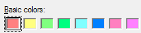
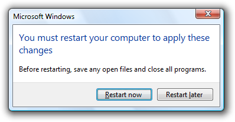

# Keyboard

> [!NOTE]
> This design guide was created for Windows 7 and has not been updated for newer versions of Windows. Much of the guidance still applies in principle, but the presentation and examples do not reflect our [current design guidance](/windows/uwp/design/).

The keyboard is the primary input device used for text input in Microsoft Windows. For accessibility and efficiency, most actions can be performed using the keyboard as well.

Keyboards can also refer to virtual, on-screen keyboards and writing pads used by computers without a physical keyboard, such as tablet-based computers.

The Windows Tablet and Touch Technology on-screen keyboard.

The Windows Tablet and Touch Technology writing pad.

There are six basic types of keys:

-   A character key sends a literal character to the window with input focus.
-   A modifier key combined with another key alters the meaning of its associated key, such as Ctrl, Alt, Shift, and the Windows logo key.
-   The navigation keys are the directional arrows, plus Home, End, Page Up, and Page Down.
-   The editing keys are Insert, Backspace, and Delete.
-   The function keys are F1 through F12.
-   System keys put the system into a mode or perform a system task, such as Print Screen, Caps Lock, and Num Lock.

Access keys are keys or key combinations used for accessibility to interact with all controls or menu items using the keyboard. Shortcut keys are keys or key combinations used by advanced users to perform frequently used commands for efficiency. Windows indicates access keys by underlining the access key assignment.

This example shows both access keys and shortcut keys.

To eliminate visual clutter, Windows hides access key underlines by default and displays them only when the Alt key is pressed. To maintain consistency with Windows, the images in UX Guide are also shown with the access key underlines hidden unless the guideline involves access keys.

To improve awareness of the access key assignments in your program throughout the development process, you can display them at all times. In Control Panel, go to the Ease of Access Center, and click **Make the keyboard easier to use**; then select the **Underline keyboard shortcuts and access keys** check box.

**Note:** Guidelines related to [accessibility](inter-accessibility.md) are presented in a separate article.

## Design concepts

### Elements of keyboard navigation

Users interact with a window using the keyboard by navigating to controls, making selections, and performing commands. The following elements work together to make this happen.

To illustrate the elements of keyboard navigation in the following list, we'll refer to this dialog box.

-   **Input focus.** The control with input focus receives most keyboard input. Input focus is indicated with a dotted rectangle called the focus rectangle. Some keyboard input is sent to controls that don't have input focus, as explained later.

    

    The first Basic colors control has input focus, as indicated with a dotted rectangle.

-   **Tab key and tab stops.** The Tab key is the primary mechanism for navigating within a window. The Tab key visits only those controls with a tab stop. All interactive controls should have tab stops (unless they are in a group), whereas non-interactive controls, such as labels, should not.
-   **Tab order.** All controls with tab stops are visited in tab order. Pressing Tab moves input focus to the next control in tab order, whereas pressing Shift+Tab moves input focus to the previous control.
-   **Control groups.** A set of related controls can be made into a group and be assigned a single tab stop. Control groups are used for sets of controls that behave like a single control, such as radio buttons. They can also be used when there too many controls to navigate efficiently with the Tab key alone.

    

    Basic colors and Custom colors are control groups, giving this dialog box five tab stops. There are so many controls that navigation would be inefficient without using control groups.

-   **Arrow keys.** The arrow keys move input focus among the controls within a group. Pressing the right arrow key moves input focus to the next control in tab order, whereas pressing the left arrow moves input focus to the previous control. Home, End, Up, and Down also have their expected behavior within a group. Users can't navigate out of a control group using arrow keys.
-   **Default buttons.** Windows with command buttons and command links have a single default button indicated by a highlighted border, which is the button that is clicked when the Enter key is pressed. There is a single default command button or command link assigned by default. However, the default button moves when the user tabs to another command button or command link. Consequently, any command button or command link with input focus is also always the default button.

    

    The OK button is normally the default button, as indicated by its highlighted border. However, if the user were to tab to the Cancel button, it would become the default button and would be activated with the Enter key.

-   **Spacebar, Enter, and Esc keys.** The spacebar activates the control with input focus, whereas the Enter key activates the default button. Pressing the Esc key cancels or closes the window.
-   **Access keys.** Access keys are used to interact with controls directly instead of navigating with Tab. They are combined with the Alt key and indicated with an underlined letter in their label.
-   **Access key labels.** While some controls contain their own labels, such as command buttons, check boxes, and radio buttons, other controls have external labels, such as list boxes and tree views. For external labels, the access key is assigned to the label, and if invoked, navigates to the next control in tab order. Buttons labeled OK, Cancel, and Close aren't assigned access keys because they are invoked with Enter and Esc.

    

    Pressing Alt+B navigates to the selected basic color, pressing Alt+D clicks the Define Custom Colors button, Enter invokes the OK button, and Esc invokes Cancel.

-   **Access key behavior.** When an access key is invoked and it is assigned uniquely, the associated control is clicked. If the assignment isn't unique, the associated control is given input focus. If the user types the same access key again, the next control in tab order with the same assignment is given input focus.

While this mechanism is fairly complicated, it is also fairly intuitive. Users pick up most these details right away, even though few can explain exactly how they work.

### Keyboard support for accessibility and advanced users

**In Windows, designing for the keyboard boils down to providing well-designed keyboard navigation, access keys for accessibility, and shortcut keys for advanced users.**

To ensure that your program's functionality is easily available to the widest range of users, including those who have disabilities and impairments, all interactive user interface (UI) elements must be keyboard accessible. Generally, this means that the most commonly used UI elements are accessible using a single access key or key combination, whereas less frequently used elements may require additional tab or arrow key navigation. For these users, comprehensiveness is more important than consistency.

To ensure that your program's functionality is efficient for experienced users, commonly used UI elements should also have shortcut keys for direct keyboard access. Experienced users often have a strong preference for using the keyboard, because keyboard-based commands can be entered more quickly and don't require removing their hands from the keyboard. For these users, efficiency and consistency are crucial; comprehensiveness is important only for the most frequently used commands.

There are subtle distinctions when designing keyboard access for these two groups, which is why Windows provides two independent direct keyboard access mechanisms. By using both access and shortcut keys effectively, you can give your programs efficient, consistent, comprehensive keyboard access that benefits everyone.

### Access keys

Access keys have the following characteristics:

-   They use the Alt key plus an alphanumeric key.
-   They are primarily for accessibility.
-   They are assigned to all menus and most dialog box controls.
-   They aren't intended to be memorized, so they are documented directly in the UI by underlining the corresponding control label character.
-   They have effect only in the current window, and navigate to the corresponding menu item or control.
-   They aren't assigned consistently because they can't always be. However, access keys should be assigned consistently for commonly used commands, especially commit buttons.
-   They are localized.

**Because access keys aren't intended to be memorized, they are assigned to a character that is early in the label to make them easy to find,** even if there is a keyword that appears later in the label.

**Correct:**

**Incorrect:**

In the correct example, the access key is assigned to a character that is early in the label.

### Shortcut keys

By contrast, shortcut keys have the following characteristics:

-   They primarily use Ctrl and Function key sequences (Windows system shortcut keys also use Alt+non-alphanumeric keys and the Windows logo key).
-   They are primarily for efficiency for advanced users.
-   They are assigned only to the most commonly used commands.
-   They are intended to be memorized, and are documented only in menus, tooltips, and Help.
-   They have effect throughout the entire program, but have no effect if they don't apply.
-   They must be assigned consistently because they are memorized and not directly documented.
-   They aren't localized.

**Because shortcut keys are intended to be memorized, the most frequently used shortcut keys ideally use letters from the first or most memorable characters within the command's keywords,** such as Ctrl+C for Copy and Ctrl+Q for Request.

Inconsistent meanings for well-known shortcut keys are frustrating and cause errors.

**Incorrect:**

In this example, Ctrl+F is the standard shortcut for Find, so assigning it to Forward is frustrating and error prone. Ctrl+W would be a better, memorable choice.

Finally, because they are intended to be memorized, **application-specific shortcut keys make sense only for programs and features that are run frequently enough for motivated users to memorize.** Infrequently used programs and features don't need shortcut keys. For example, setup programs and most wizards don't need any special shortcut key assignments, nor do infrequently used commands in a productivity application.

### Assigning access keys in dialog boxes

Whenever possible, assign unique access keys to all interactive controls except those that normally aren't assigned access keys. However, in English there are only 26 characters. Some characters may not appear in any of the labels, and there may not be distinctive characters in all the labels, reducing this number further. Also, you should plan to have a few unassigned characters to facilitate localization. Consequently, you can assign only about 20 unique access keys in a single dialog box.

If you have a dialog box with more than 20 interactive controls, either don't assign access keys to some controls, or, in rare situations, assign duplicate access keys.

When there are this many interactive controls, not all of them need an access key assigned.

Use the following general procedure to assign access keys:

-   First, assign access keys to the [commit buttons](glossary.md) and command links. Use the standard access key assignments table when it applies, otherwise use the first letter of the first word.
-   Skip the controls that aren't assigned access keys.
-   Assign unique access keys to the remaining controls (starting with the most frequently used):
    -   If possible, assign the access key according to the standard access key assignments table.
    -   Otherwise:
        -   Prefer characters that appear early in the label, ideally the first character of the first or second word.
        -   Prefer a distinctive consonant or a vowel, such as "x" in "Exit."
        -   Prefer characters with wide widths, as w, m, and capital letters.
        -   Avoid using characters that make the underline difficult to see, such as letters that are one pixel wide, letters with descenders, and letters next to a letter with a descender.
-   If not all controls can have unique access keys (start with the least frequently used):
    -   If there are groups of related controls, such as:
        -   A single set of radio buttons
        -   A set of related check boxes
        -   A set of related controls within a group box

Assign access keys to group labels instead of the individual controls. Normally, you would do the opposite. (In doing so, make sure there is a control group defined for these controls.)

-   If still not all controls can have unique access keys:
    -   You may assign non-unique access keys if:
        -   The controls would otherwise be too difficult to navigate to.
        -   The non-unique access keys don't conflict with the access keys of commonly used controls.
    -   Otherwise, the remaining controls can be accessed using Tab and arrow key navigation.

In this example, there are repetitive controls so access keys are assigned to the radio button groups.

### Preventing accidental commands

If a window displayed out of context (not user initiated) steals input focus, there is a good chance that this window will receive input intended for another window. Furthermore, access keys take effect when pressed without depressing the Alt key if the dialog box doesn't have any controls that take text input (such as text boxes and lists). So, in the following example, pressing "r" activates the Restart now button.

Clearly, such input may have significant unintended consequences.

**Incorrect:**

In this example, typing text with space, "r", or Enter accidentally restarts Windows.

Of course, the best solution to this problem is not to steal input focus. Instead, either flash the program's [taskbar button](winenv-taskbar.md) or display a notification to get the user's attention.

However, if you must display such a window, the best approach is to not assign a default button or access keys, and give initial input focus to a control other than a commit button.

**Correct:**

In this example, accidentally restarting Windows is much harder to do.

**If you do only six things...**

1.  Design good keyboard navigation, with a sensible tab order and appropriate control groups, initial input focus, and default buttons.
2.  Assign access keys to all menus and most controls.
3.  Assign the access keys to a character that appears early in the label, to make them easy to find.
4.  Assign shortcut keys to the most commonly used commands.
5.  Try to assign the shortcut keys to the first or most memorable characters within keywords.
6.  Give well-known shortcut keys a consistent meaning.

## Guidelines

### Interaction

-   **Don't use the Shift key to modify commands in menus or dialog boxes.** Doing so is undiscoverable and unexpected.

    **Incorrect:**

    

    In this example from Windows XP, holding the Shift key replaces Yes to All with No to All.

-   **Don't disable a control with input focus. Doing so may prevent the window from receiving keyboard input.** Instead, before disabling a control with input focus, move input focus to another control.
-   **If a window is displayed out of context, potentially surprising users, you may need to prevent significant unintended consequences:**
    -   Don't assign a default button.
    -   Don't assign access keys.
    -   Give initial input focus to a control other than a commit button.

### Keyboard navigation

-   **Always show the input focus indicator. Exception:** You can temporarily suppress the input focus indicator if:
    -   The input focus indicator is visually distracting (as with a large list view not in Details view).
    -   The Enter key's usage is likely preceded by other keyboard input, such as Alt or arrow keys.
    -   The input focus indicator is displayed upon any keyboard input.
-   **Assign initial input focus to the control that users are most likely to interact with first,** which is often the first interactive control. If the first interactive control isn't a good choice, consider changing the window's layout.
-   **Assign tabs stops to all interactive controls, including read-only edit boxes. Exceptions:**
    -   Group sets of related controls that behave as a single control, such as radio buttons. Such groups have a single tab stop.
    -   Properly contain groups so that the arrow keys cycle both forward and backward within the group and stay within the group.
-   **Tab order should follow reading order, which generally flows from left to right, top to bottom.** Consider making exceptions for commonly used controls by putting them earlier in the tab order. Tab should cycle through all the tab stops in both directions without stopping.
-   **Within a tab stop, the arrow key order should flow from left to right, top to bottom,** without exceptions. The arrow keys should cycle through all items in both directions without stopping.
-   **Present the commit buttons in the following order:**
    -   OK/\[Do it\]/Yes
    -   \[Don't do it\]/No
    -   Cancel
    -   Apply (if present)

where \[Do it\] and \[Don't do it\] are specific responses to the main instruction.

-   **Select the safest (to prevent loss of data or system access) and most secure command button or command link to be the default.** If safety and security aren't factors, select the most likely or convenient response.
-   **Keyboard navigation shouldn't change control values or result in an error message.** Never require users to change a control's initial value during navigation. Instead, initialize controls that validate on exit with valid values, and validate a control's value only when it has changed.

### Access keys

-   **Whenever possible, assign access keys for commonly used commands according to the following table.** While consistent access key assignments aren't always possible, they are certainly preferred especially for frequently used commands.

    |  Access key         | Command                             |
    |---------------------------|-------------------------------------------|
    | A               | About                           |
    | A               | Always on top                   |
    | A               | Apply                           |
    | B               | Back                            |
    | B               | Bold                            |
    | B or r          | Browse                          |
    | C               | Close                           |
    | C               | Copy                            |
    | C               | Copy here                       |
    | s               | Create shortcut                 |
    | s               | Create shortcut here            |
    | t               | Cut                             |
    | D               | Delete                          |
    | D               | Don't show this \[item\] again  |
    | E               | Edit                            |
    | x               | Exit                            |
    | E               | Explore                         |
    | F               | Fewer                           |
    | F               | File                            |
    | F               | Find                            |
    | n               | Find next                       |
    | F               | Font                            |
    | F               | Forward                         |
    | H               | Help                            |
    | t               | Help topics                     |
    | H               | Hide                            |
    | I               | Insert                          |
    | o               | Insert object                   |
    | I               | Italic                          |
    | L               | Link here                       |
    | x               | Maximize                        |
    | n               | Minimize                        |
    | M               | More                            |
    | M               | Move                            |
    | M               | Move here                       |
    | N               | New                             |
    | N               | Next                            |
    | N               | No                              |
    | O               | Open                            |
    | w               | Open with                       |
    | O               | Options                         |
    | u               | Page setup                      |
    | P               | Paste                           |
    | l               | Paste link                      |
    | s               | Paste shortcut                  |
    | s               | Paste special                   |
    | P               | Pause                           |
    | P               | Play                            |
    | P               | Print                           |
    | P               | Print here                      |
    | r               | Properties                      |
    | R               | Redo                            |
    | R               | Repeat                          |
    | R               | Restore                         |
    | R               | Resume                          |
    | R               | Retry                           |
    | R               | Run                             |
    | S               | Save                            |
    | a               | Save as                         |
    | a               | Select all                      |
    | n               | Send to                         |
    | S               | Show                            |
    | S               | Size                            |
    | p               | Split                           |
    | S               | Stop                            |
    | T               | Tools                           |
    | U               | Underline                       |
    | U               | Undo                            |
    | V               | View                            |
    | W               | Window                          |
    | Y               | Yes                             |

    

     

-   **Prefer characters with wide widths,** such as w, m, and capital letters.
-   **Prefer a distinctive consonant or a vowel,** such as "x" in "Exit."
-   **Avoid using characters that make the underline difficult to see,** such as (from most problematic to least problematic):
    -   Characters that are only one pixel wide, such as i and l.
    -   Characters with descenders, such as g, j, p, q, and y.
    -   Characters next to a letter with a descender.
-   When assigning access keys in wizard pages, remember to reserve "B" for Back and "N" for Next.
-   When assigning access keys in property pages, remember to reserve "A" for Apply, if used.

### Menu access keys

-   **Assign access keys to all menu items.** No exceptions.
-   **For dynamic menu items (such as recently used files), assign access keys numerically.**

    

    In this example, the Paint program in Windows assigns numeric access keys to recently used files.

-   **Assign unique access keys within a menu level.** You can reuse access keys across different menu levels.
-   **Make access keys easy to find:**
    -   For the most frequently used menu items, choose characters at the beginning of the first or second word of the label, preferably the first character.
    -   For less frequently used menu items, choose letters that are a distinctive consonant or a vowel in the label.

### Dialog box access keys

-   **Whenever possible, assign unique access keys to all interactive controls or their labels.**[Read-only text boxes](ctrl-text-boxes.md) are interactive controls (because users can scroll them and copy text), so they benefit from access keys. **Don't assign access keys to:**
    -   **OK, Cancel, and Close buttons.** Enter and Esc are used for their access keys. However, always assign an access key to a control that means OK or Cancel, but has a different label.

        

        In this example, the positive commit button has an access key assigned.

    -   **Group labels.** Normally, the individual controls within a group are assigned access keys, so the group label doesn't need one. However, assign an access key to the group label and not the individual controls if there is a shortage of access keys.
    -   **Generic Help buttons,** which are accessed with F1.
    -   **Link labels.** There are often too many links to assign unique access keys, and link underscores hide the access key underscores. Have users access links with the Tab key instead.
    -   **Tab names.** Tabs are cycled using Ctrl+Tab and Ctrl+Shift+Tab.
    -   **Browse buttons labeled "...".** These can't be assigned access keys uniquely.
    -   **Unlabeled controls,** such as spin controls, graphic command buttons, and unlabeled progressive disclosure controls.
    -   **Non-label static text or labels for controls that aren't interactive,** such as progress bars.

-   **Assign commit button access keys first to ensure that they have the standard key assignments.** If there isn't a standard key assignment, use the first letter of the first word. For example, the access key for Yes and No commit buttons should always be "Y" and "N", regardless of the other controls in the dialog box.
-   **For negative commit buttons (other than Cancel) phrased as a "Don't", assign the access key to the "n" in "Don't".** If not phrased as a "Don't", use the standard access key assignment or assign the first letter of the first word. By doing so, all Don'ts and No's have a consistent access key.
-   **To make access keys easy to find, assign the access keys to a character that appears early in the label,** ideally the first character, even if there is a keyword that appears later in the label.
-   **Assign at most 20 access keys,** so you have a few unassigned characters to facilitate localization.
-   **If there are too many interactive controls to assign unique access keys, you may assign non-unique access keys** if:
    -   The controls would otherwise be too difficult to navigate to.
    -   The non-unique access keys don't conflict with the access keys of commonly used controls.
-   **Don't use menu bars in dialog boxes.** It's difficult to assign unique access keys in this case, because the dialog box controls and menu items share the same characters.

### Shortcut keys

-   **Assign shortcut keys to the most commonly used commands.** Infrequently used programs and features don't need shortcut keys because users can use access keys instead.
-   **Don't make a shortcut key the only way to perform a task.** Users should also be able to use the mouse or the keyboard with Tab, arrow, and access keys.
-   **Don't assign different meanings to well-known shortcut keys.** Because they are memorized, inconsistent meanings for well-known shortcuts are frustrating and error prone.
-   **Don't try to assign system-wide program shortcut keys.** Your program's shortcut keys will have effect only when your program has input focus.
-   **Document all shortcut keys.** Document shortcuts in menu bar items, toolbar tooltips, and a single Help article that documents all shortcut keys used. Doing so helps users learn the shortcut key assignments they shouldn't be a secret.

    -   **Exception:** Don't display shortcut key assignments within context menus. Context menus don't display the shortcut key assignments because these menus are optimized for efficiency.

    

    The shortcut key is documented in the tooltip.

-   **If your program assigns many shortcut keys, provide the ability to customize the assignments.** Doing so allows users to reassign conflicting shortcut keys and migrate from other products. Most programs don't assign enough shortcut keys to need this feature.

### Choosing shortcut keys

-   **For well-known shortcut keys, use the standard assignments.**
-   **For non-standard key assignments, use the following recommended shortcut keys for more frequently used commands.** These shortcut keys are recommended because they don't conflict with the well-known shortcuts and are easy to press.
    -   Ctrl+G, J, K, L M, Q, R, or T
    -   Ctrl+any number
    -   F7, F8, F9, or F12
    -   Shift+F2, F3, F4, F5, F7, F8, F9, F11, or F12
    -   Alt+any function key except F4
-   **Use the following recommended shortcut keys for less frequently used commands.** These shortcut keys don't have conflicts, but are harder to press often requiring two hands.
    -   Ctrl+any function key except F4 and F6
    -   Ctrl+Shift+any letter or number
-   **Make frequently used shortcut keys easy to remember:**
    -   Use letters instead of numbers or function keys.
    -   Try to use a letter that is in the first word or most memorable character within the command's keywords.
-   **Use function keys for commands that have a small-scale effect,** such as commands that apply to the selected object. For example, F2 renames the selected item.
-   **Use Ctrl key combinations for commands that have a large-scale effect,** such as commands that apply to an entire document. For example, Ctrl+S saves the current document.
-   **Use Shift key combinations for commands that extend or complement the actions of the standard shortcut key.** For example, the Alt+Tab shortcut key cycles through open primary windows, whereas Alt+Shift+Tab cycles in the reverse order. Similarly, F1 displays Help, whereas Shift+F1 displays context-sensitive Help.
-   **When using arrow keys to move or resize an item, use Ctrl+arrow keys for more granular control.**

### Choosing shortcut keys (what not to do)

-   **Don't distinguish between key locations.** For example, Windows can distinguish between left and right Shift, Alt, Ctrl, [Windows logo](glossary.md), and [Application keys](glossary.md), as well as keys on the numeric keypad. Assigning behavior to only one key location is confusing and unexpected.
-   **Don't use the Windows logo modifier key for program shortcut keys.** Windows logo key is reserved for Windows use. Even if a Windows logo key combination isn't being used by Windows now, it may be in the future.
-   **Don't use the Application key as a shortcut key modifier.** Use Ctrl, Alt, and Shift instead.
-   **Don't use shortcut keys used by Windows for program shortcut keys.** Doing so will conflict with the Windows system shortcut keys when your program has input focus.
-   **Don't use Alt+alphanumeric key combinations for shortcut keys.** Such shortcut keys may conflict with access keys.
-   **Don't use the following characters for shortcut keys:** @ $ {} \[\] \\ ~ \| ^ ' < >. These characters require different key combinations across languages or are locale specific.
-   **Avoid complex key combinations,** such as three or more keys together (example: Ctrl+Alt+spacebar) or keys that are far apart on the keyboard (example: Ctrl+F5). Use simple shortcut keys for frequently used commands.
-   **Don't use Ctrl+Alt combinations,** because Windows interprets this combination in some language versions as an AltGR key, which generates alphanumeric characters.

### Keyboard and mouse combinations

-   For links, use Shift+click to navigate using a new window and Ctrl+click to navigate using a new tab. This approach is consistent with Windows Internet Explorer .

## Documentation

When referring to the keyboard:

-   Use on-screen keyboard to refer to a keyboard representation on the screen that the user touches to input characters.
-   Give keyboard combinations starting with the modifier key. Present modifier keys in the following order: Windows logo, Application, Ctrl, Alt, Shift. If the Numpad modifier is used, put that just before the key it modifies.
-   Don't use all capital letters for keyboard keys. Instead, follow the capitalization used by standard keyboards, or lowercase if the key is not labeled on the keyboard.
    -   For alphabetical key combinations, use an uppercase letter.
    -   Spell out Page Up, Page Down, Print Screen, and Scroll Lock.
    -   Spell out plus sign, minus sign, hyphen, period, and comma.
    -   For arrow keys, use left arrow, right arrow, up arrow, and down arrow. Don't use graphic labels for the arrow keys.
    -   Use Windows logo key and Application key to refer to the keys labeled with icons. Don't use graphic labels for these keys.

**Correct:**

spacebar, Tab, Enter, Page Up, Ctrl+Alt+Del, Alt+W, Ctrl+plus sign

**Incorrect:**

SPACEBAR, TAB, ENTER, PG UP, Ctrl+Alt+DEL, Alt+w, Ctrl++

-   Indicate key combinations with a plus sign, without spaces.

**Correct:**

Ctrl+A, Shift+F5

**Incorrect:**

Ctrl-A, Shift + F5

-   To show a key combination that includes punctuation that requires use of the Shift key, such as the question mark, add Shift to the combination and give the name or symbol of the shifted key. Using the name of the unshifted key, such as 4 rather than $, could be confusing to users or even wrong; for instance, the ? and / characters are not always shifted keys on every keyboard.

**Correct:**

Ctrl+Shift+?, Ctrl+Shift+\*, Ctrl+Shift+comma

**Incorrect:**

Ctrl+Shift+/, Ctrl+?, Ctrl+Shift+8, Ctrl+\*

-   At first mention, use the and key with the key name if necessary for clarity for example, the F1 key. At all subsequent references, refer to the key only by its name for example, press F1.
-   Refer specifically to access keys and shortcut keys in programming and other technical documentation. Don't use accelerator, mnemonic, or hot keys. Everywhere else use keyboard shortcut, especially in user documentation.

When referring to interaction:

-   Use press, not depress, strike, hit, or type, when pressing and immediately releasing a key initiates an action within the program or navigates within a document or UI.
-   Use type, not enter, to direct users to type text.
-   Use use in situations when press might be confusing, such as when referring to a type of key such as the arrow keys or function keys. In such cases, press might make users think they need to press all the keys simultaneously.
-   Use hold when pressing and holding a key, such as a modifier key.
-   Don't use press as a synonym for click.

Examples:

-   Type your name, and then press Enter.
-   Press Ctrl+F, and then type the text you want to search for.
-   To save your file, press Y.
-   To move the insertion point, use the arrow keys.

 

