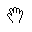
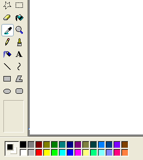

# Mouse and Pointers

> [!NOTE]
> This design guide was created for Windows 7 and has not been updated for newer versions of Windows. Much of the guidance still applies in principle, but the presentation and examples do not reflect our [current design guidance](/windows/uwp/design/).

The mouse is the primary input device used to interact with objects in Windows. Mouse functionality can also encompass other pointing devices, such as trackballs, touchpads and pointing sticks built into notebook computers, pens used with Windows Tablet and Touch Technology, and, on computers with touchscreens, even a user's finger.

> [!NOTE]
> Guidelines related to [accessibility](inter-accessibility.md), [pen](inter-pen.md), and [touch](inter-touch.md) are presented in separate articles.

Physically moving the mouse moves the graphic pointer (also referred to as the cursor) on the screen. The pointer has a variety of shapes to indicate its current behavior.

*Typical mouse pointers*

Mouse devices often have a primary button (usually the left button), a secondary button (usually the right), and a mouse wheel between the two. By positioning the pointer and clicking the primary and secondary buttons on the mouse, users can select objects and perform actions on them. For most interactions, pressing a mouse button while the cursor is over a target indicates the selected target, and releasing the button performs any action associated with the target.

All pointers, except the busy pointer, have a single pixel hot spot that defines the exact screen location of the mouse. The hot spot determines which object is affected by mouse actions. Objects define a hot zone, which is the area where the hot spot is considered to be over the object. Typically, the hot zone coincides with the borders of an object, but it may be larger to make user's intent easier to perform.

The caret is the flashing vertical bar that is displayed when the user is typing into a text box or other text editor. The caret is independent of the pointer (by default, Windows hides the pointer while the user is typing).

*The caret*

## Design concepts

### The mouse is intuitive

The mouse has been a successful input device because it is easy to use for the typical human hand. Pointer-based interaction has been successful because it is intuitive and allows for a rich variety of experiences.

**Well-designed user interface (UI) objects are said to have affordance, which are visual and behavioral properties of an object that suggest how it is used.** The pointer acts as a proxy for the hand, allowing users to interact with screen objects much like they would with physical objects. We humans have an innate understanding of how the human hand works, so if something looks like it can be pushed, we try to push it; if it looks like it can be grabbed, we try to grab it. Consequently, users can figure out how to use objects with strong affordance just by looking at them and trying them.

*Buttons and sliders have strong affordance*

By contrast, objects with poor affordance are harder to figure out. Such objects often require a label or instruction to explain them.

*link text and icons have poor affordance*

### Some aspects of mouse use are not intuitive

**Right-clicking, double-clicking, and clicking with Shift or Ctrl key modifiers are three mouse interactions that aren't intuitive**, because they have no real world counterparts. Unlike keyboard shortcuts and access keys, these mouse interactions usually aren't documented anywhere in the UI. This suggests that right-click, double-click, and keyboard modifiers shouldn't be required to perform basic tasks, especially by novice users. It also suggests that these advanced interactions must have consistent, predictable behavior to be used effectively.

### Single-click or double-click?

Double-clicking is used so extensively on the Windows desktop that it may not seem like an advanced interaction. For example, opening folders, programs, or documents in the file pane of Windows Explorer is performed by double-clicking. Opening a shortcut on the Windows desktop also uses double-clicking. By contrast, opening folders or programs in the Start menu requires a single click.

Selectable objects use single-click to perform selection, so they require a double-click to open, whereas non-selectable objects require only a single click to open. This distinction isn't understood by many users (clicking a program icon is clicking a program icon, right?) and as a result, some users just keep clicking on icons until they get what they want.

### Direct manipulation

Interacting with objects directly is referred to as direct manipulation. Pointing, clicking, selecting, moving, resizing, splitting, scrolling, panning, and zooming are common direct manipulations. By contrast, interacting with an object through its properties window or other dialog box could be described as indirect manipulation.

**However, where there is direct manipulation, there can be accidental manipulation and therefore the need for forgiveness.** Forgiveness is the ability to reverse or correct an undesired action easily. You make direct manipulations forgiving by providing undo, giving good visual feedback, and allowing users to correct mistakes easily. Associated with forgiveness is preventing undesired actions from happening in the first place, which you can do by using constrained controls and confirmations for risky actions or commands that have unintended consequences.

### Standard mouse button interactions

The standard mouse interactions depend on a variety of factors, including the mouse key clicked, the number of times it is clicked, its position during the clicks, and whether any keyboard modifiers were pressed. Here is a summary of how these factors usually affect interaction:

- For most objects, left double-clicking performs a single left click and performs the default command. The default command is identified in the context menu.
- For some types of selectable objects, each click expands the effect of the click. For example, single-clicking in a text box sets the input location, double-clicking selects a word, and triple-clicking selects a sentence or paragraph.
- Right-clicking displays an object's context menu.
- Keeping the mouse still while pointing results in hovering.
- Keeping the mouse still while pressing the mouse buttons indicates clicking and single object selection. Moving the mouse indicates moving, resizing, splitting, dragging, and multiple object selection.
- The Shift key extends selection contiguously.
- The Ctrl key extends selection by toggling the selection state of the clicked item without affecting the selection of other objects.

### Simple mouse interactions

The following table describes common mouse interactions and effects.

| Simple action | Interaction | Typical effect |
|:---|:---|:---|
| Pointing           | Position the pointer to a specific object without clicking any mouse buttons.                                                                                                                                                                                                                                       | Target displays its hover state and any dynamic affordances.                                                                                                                                                                                                                                                                                                                                                          |
| Hovering           | Position the pointer to a specific object without clicking any mouse buttons and without moving for at least a second.                                                                                                                                                                                              | Target displays its tooltip, infotip, or equivalent.                                                                                                                                                                                                                                                                                                                                                                  |
| Clicking           | Position the pointer to a specific, non-selectable object and press and release a mouse button without moving. Clicking takes effect on the mouse button release to allow users the opportunity to cancel the click by moving the mouse off the target. Therefore, mouse press only indicates the selected target.  | For single clicks with the primary button, activate the object. For double-clicks with the primary button, activate the object and perform the default command. For the secondary button, display the object's context menu.                                                                                                                                                                                          |
| Selecting          | Position the pointer to a specific, selectable object and press and release a mouse button.                                                                                                                                                                                                                         | For single clicks with the primary button, select the object. If the users drags the mouse, select a contiguous range of objects. For double-clicks with the primary button, select the object and perform the default command.  For text, the right primary button click sets the insertion point, the second selects word at the insertion point, and the third click selects the sentence or paragraph.  |
| Pressing           | Position the pointer to a specific object and press a mouse button without releasing.                                                                                                                                                                                                                               | For auto-repeat functions (such as pressing a scroll arrow to continuously scroll), activate repeatedly. Otherwise indicates the start of a move, resize, split, or drag, unless followed by a release without moving.                                                                                                                                                                                                |
| Wheeling           | Move mouse wheel.                                                                                                                                                                                                                                                                                                   | Window scrolls vertically in direction of mouse wheel movement.                                                                                                                                                                                                                                                                                                                                                       |

### Pointer shapes

The following table describes common pointer shapes and usages.

| Shape | Name | When used |
|:---|:---|:---|
|             | Normal select     | Used for most objects.                                              |
|      | Link select       | Used for text and graphics links because of their weak affordance.  |
|            | Text select       | Used for text to indicate a location between characters.            |
|   | Precision select  | Used for graphic and other two-dimensional interaction.             |

### Compound mouse interactions

The following table describes common mouse interactions.

| Compound action | Interaction | Typical effect | Pointers |
|:---|:---|:---|:---|
| Moving                 | If moving is a mode (entered by giving a command), enter the mode, position the pointer over a movable object, press button and move mouse, release mouse button. in this case, the pointer changes shape to indicate the mode.  otherwise, position the pointer over a movable object's grabber, press button and move mouse, release mouse button. in this case, the pointer doesn't need to change shape.  | object moves in direction of pointer movement.             | move    used to move a window in any direction.  pan    Used to move an object within a window in any direction.                                                                                                                                                                                                                                                                                                                                                                                                                                                        |
| Resizing               | Position the pointer over a resizable border or resize handle, press a mouse button and move mouse, and then release the mouse button.                                                                                                                                                                                                                                                                                  | object resizes in direction of pointer movement.           | vertical and horizontal resize    used to resize a single dimension.  diagonal resize    used to resize two dimensions simultaneously.  row and column resize    Used to resize a row or column in a grid.  |
| Splitting              | Position the pointer over a splitter, press a mouse button and move mouse, and then release the mouse button.                                                                                                                                                                                                                                                                                                           | split pane border moves in direction of pointer movement.  | window splitters    Used to resize a split pane vertically or horizontally.  |
| Dragging and dropping  | Position the pointer over a valid object for dragging, press a mouse button and move mouse to a drop target, and then release the mouse button.  | object is moved or copied to the drop target.              | normal select    used over valid drag targets. may also have an infotip to indicate specific effect.  unavailable    Used to indicate a surface isn't a valid drop target.  |

### Activity indicators

The following table shows pointers that users see when performing an action that takes longer than a couple of seconds to complete.

| Shape | Name | When used |
|:---|:---|:---|
|            | Busy pointer                   | Used to wait for a window to become responsive.                                   |
|   | Working in background pointer  | Used to point, click, press, or select while a task completes in the background.  |

### Hand pointers

Text and graphics links use a hand or "link select" pointer (a hand with the index finger pointing ) because of their weak affordance. While links may have other visual clues to indicate that they are links (such as underlines and special placement), displaying the hand pointer on hover is the definitive indication of a link.

**To avoid confusion, it is imperative not to use the hand pointer for other purposes.** For example, command buttons already have a strong affordance, so they don't need a hand pointer. The hand pointer must mean "this target is a link" and nothing else.

### Custom pointers

Windows supports the creation of custom pointers. For more details see, [Setting the Cursor Image](../learnwin32/setting-the-cursor-image.md) and [User Input: Extended Example](../learnwin32/user-input--extended-example.md).

Many applications provide a palette of controls with custom pointers to support application functionality.

*Microsoft Paint includes a palette of different functions, each with a unique pointer*

### Fitts' Law

Fitts' Law is a well known principle in graphical user interface design ergonomics that essentially states:

- The farther away a target is, the longer it takes to acquire it with the mouse.
- The smaller a target is, the longer it takes to acquire it with the mouse.

Thus, large targets are good. Be sure to make the entire target area clickable.

| Incorrect | Correct (the entire target is clickable) |
|:---|:---|
|  |  |

You can dynamically change the size of a target when pointing to make it easier to acquire.

*A target becomes larger when the user is pointing to make it easier to acquire*

And close targets are also good. Locate clickable items close to where they are most likely going to be used. In the following image, the color palette is too far away from the tool selector.

*The color palette is too far from where it is likely to be used*

Consider the fact that the user's current pointer location is as close as a target can be, making it trivial to acquire. Thus, context menus take full advantage of Fitts' law, as do the mini toolbars used by Microsoft Office.

*The current pointer location is always the easiest to acquire*

Also, consider alternative input devices when determining object sizes. For example, the minimum target size recommended for touch is 23x23 pixels (13x13 DLUs).

### Environments without a mouse

Not all Windows environments have a mouse. For example, kiosks rarely have a mouse and usually have a touchscreen instead. This means that users can perform simple interactions such as left-clicking and perhaps dragging-and-dropping. However, they can't hover, right-click, or double-click. This situation is easy to design for because these limitations are usually known in advance.

Using a mouse requires fine motor skills, and as a result, not all users can use a mouse. To make your software accessible to the broadest audience, make sure all interactions for which fine motor skills aren't essential can be performed using the keyboard instead.

For more information and guidelines, see [Accessibility](inter-accessibility.md).

**If you do only four things...**

1.  Give mouse interactions behaviors consistent with their standard effects, using the standard pointers whenever appropriate.
2.  Limit advanced mouse interactions (those requiring right clicks, multiple clicks, or modifier keys) to advanced tasks targeted at advanced users.
3.  Assign advanced mouse interactions consistent, predictable behaviors so that they can be used effectively.
4.  Make sure your program provides the ability to reverse or correct any undesired actions especially for destructive commands. Accidental actions are more likely when using direct manipulation.

## Guidelines

### Click affordance

- **Never require users to click an object to determine if it is clickable.** Users must be able to determine clickability by visual inspection alone.
  - Primary UI (such as commit buttons) must have a static click affordance. Users shouldn't have to hover to discover primary UI.
  - Secondary UI (such as secondary commands or progressive disclosure controls) can display their click affordance on hover.
  - [Text links](ctrl-links.md) should statically suggest link text, then display their click affordance (underline or other presentation change, with [hand pointer](#hand-pointers)) on hover.
  - [Graphics links](ctrl-links.md) only display a hand pointer on hover.
- **Use the hand (or "link select") pointer only for text and graphic links.** Otherwise, users would have to click on objects to determine if they are links.

### Standard mouse button interactions

The following table summarizes the mouse button interactions that apply in most cases:

| Interaction                                    | Effect                                                                                                                                                                                                                                                          |
|-------------------------------------|-----------------------------------------------------------------------------------------------------------------------------------------------------------------------------------------------------------------------------------------------------------|
| Hover                     | Target displays its tooltip, infotip, or equivalent.                                                                                                                                                                                            |
| Single left-click         | Activates or selects the object. For text, sets the insertion point.                                                                                                                                                                            |
| Single right-click        | Selects the object and displays its context menu.                                                                                                                                                                                               |
| Double left-click         | Activates or selects the object, and performs the default command. For text, selects word at the insertion point (a third click selects the sentence or paragraph).                                                                             |
| Double right-click        | Same as single right-click.                                                                                                                                                                                                                     |
| Shift single left-click   | For selectable objects, contiguously extends the selection. Otherwise, same as single left-click with possible modifications. For example, in Paint, drawing an oval with the Shift key modifier results in drawing a circle.                   |
| Shift single right-click  | Same as Shift single left-click.                                                                                                                                                                                                                |
| Shift double left-click   | Same as Shift single left-click, and performs the default command on the entire selection.                                                                                                                                                      |
| Shift double right-click  | Same as Shift single left-click.                                                                                                                                                                                                                |
| Ctrl single left-click    | For selectable objects, extends the selection by toggling the selection state of the clicked item without affecting the selection of other objects (therefore allowing selection that isn't contiguous). Otherwise, same as single left-click.  |
| Ctrl single right-click   | Same as Ctrl single left-click.                                                                                                                                                                                                                 |
| Ctrl double left-click    | Same as Ctrl single left-click, and performs the default command on the entire selection.                                                                                                                                                       |
| Ctrl double right-click   | Same as Ctrl single left-click.                                                                                                                                                                                                                 |

 

### Mouse interaction

- **Make click targets at least 16x16 pixels so that they can be easily clicked by any input device.** For [touch](inter-touch.md), the recommended minimum control size is 23x23 pixels (13x13 DLUs). Consider dynamically changing the size of small targets when the user is pointing to make them easier to acquire.

    In this example, the spin control buttons are too small to be used effectively with touch or a pen.

     

- **Make splitters at least five pixels wide so that they can be easily clicked by any input device.** Consider dynamically changing the size of small targets when the user is pointing to make them easier to acquire.

    In this example, the splitter in the Windows Explorer navigation pane is too narrow to be used effectively with a mouse or pen.

    

- **Provide users a margin of error spatially.** Allow for some mouse movement (for example, three pixels) when users release a mouse button. Users sometimes move the mouse slightly as they release the mouse button, so the mouse position just before button release better reflects the user's intention than the position just after.
- **Provide users a margin of error temporally.** Use the system double-click speed to distinguish between single and double clicks.
- **Have clicks take effect on mouse button up.** Allow users to abandon mouse actions by removing the mouse from valid targets before releasing the mouse button. For most mouse interactions, pressing a mouse button only indicates the selected target and releasing the button activates the action. Auto-repeat functions (such as pressing a scroll arrow to continuously scroll) are an exception.
- [Capture the mouse](/windows/win32/api/winuser/nf-winuser-setcapture) for selecting, moving, resizing, splitting, and dragging.
- Use the Esc key to let users abandon compound mouse interactions such as moving, resizing, splitting, and dragging.
- **If an object doesn't support double clicks but users are likely to assume it does, interpret a "double click" as one single click.** Assume the user intended a single action instead of two.

    Because users are likely to assume that taskbar buttons support double clicks, a "double click" should be handled as a single click.

    

- **Ignore redundant mouse clicks while your program is inactive.** For example, if the user clicks a button 10 times while a program is inactive, interpret that as a single click.
- **Don't use double drags or chords.** A double drag is a drag action commenced with a double-click, and a chord is when multiple mouse buttons are pressed simultaneously. These interactions aren't standard, aren't discoverable, are difficult to perform, and are most likely performed accidentally.
- **Don't use Alt as a modifier for mouse interactions.** The Alt key is reserved for toolbar access and access keys.
- **Don't use Shift+Ctrl as a modifier for mouse interactions.** Doing so would be too difficult to use.
- **Make hover redundant.** To make your program touchable, take full advantage of hover but only in ways that are not required to perform an action. This usually means that an action can also be performed by clicking, but not necessarily in exactly the same way. Hover isn't supported by most touch technologies, so users with such touchscreens can't perform any tasks that require hovering.

### Mouse wheel

- **Make the mouse wheel affect the control, pane, or window that the pointer is currently over.** Doing so avoids unintended results.
- **Make the mouse wheel take effect without clicking or having input focus.** Hovering is sufficient.
- **Make the mouse wheel affect the object with the most specific scope.** For example, if the pointer is over a scrollable list box control in a scrollable pane within a scrollable window, the mouse wheel affects the list box control.
- **Don't change the input focus when using the mouse wheel.**
- Give the mouse wheel the following effects:
  - For scrollable windows, panes, and controls:
    - **Rotating the mouse wheel scrolls the object vertically, where rotating up scrolls up.** For the wheel to have natural mapping, rotating the mouse wheel should never scroll horizontally because doing so is disorienting and unexpected.
      - **If the Ctrl key is pressed, rotating the mouse wheel zooms the object,** where rotating up zooms in and rotating down zooms out.
      - **Tilting the mouse wheel scrolls the object horizontally.**
  - For zoomable windows and panes (without scrollbars):
    - **Rotating the mouse wheel zooms the object,** where rotating up zooms in and rotating down zooms out.
    - Tilting the mouse wheel has no effect.
  - For tabs:
    - **Rotating the mouse wheel can change the current tab,** regardless of the orientation of the tabs.
    - Tilting the mouse wheel has no effect.
  - If the Shift and Alt keys are depressed, the mouse wheel has no effect.
- **Use the Windows system settings for the vertical scroll size (for rotating) and horizontal scroll size (for tilting).** These settings are configurable through the Mouse control panel item.
- **Make rotating the mouse wheel more rapidly result in scrolling more rapidly.** Doing so allows users to scroll large documents more efficiently.
- **For scrollable windows, consider having clicking the mouse wheel button put the window in "reader mode."** Reader mode plants a special scroll origin icon and scrolls the window in a direction and speed relative to the scroll origin.

*Internet Explorer supports reader mode, which features the scroll-origin icon*

### Hiding the pointer

- **Don't hide the pointer.** Exceptions:
  - Presentation applications running in full screen presentation mode may hide the pointer. However, the pointer must be restored immediately when users move the mouse, and can be rehidden after two seconds of inactivity.
  - Environments without a mouse (such as kiosks) can permanently hide the pointer.
- By default, Windows hides the pointer while the user is typing in a text box. This Windows system setting is configurable through the Mouse control panel item.

### Activity pointers

The activity pointers in Windows are the busy pointer () and the working in background pointer ().

- Display the busy pointer when users have to wait more than one second for an action to complete. Note that the busy pointer has no hot spot, so users can't click anything while it is displayed.
- Display the working in background pointer when users have to wait more than one second for an action to complete, but the program is responsive and there is no other visual feedback that the action isn't complete.
- Don't combine activity pointers with progress bars or progress animations.

### Caret

- **Don't display the caret until the text input window or control has input focus.** The caret suggests input focus to users, but a window or control can display the caret without input focus. Of course, don't steal input focus so that an out-of-context dialog box can display the caret.

    The Windows Credential Manager is displayed out of context with the caret but without input focus. As a result, users end up typing their password in unexpected places.

    

- **Place the caret where users are most likely to type first.** Usually this is either the last place the user was typing or at the end of the text.

### Accessibility

- For users who can't use the mouse at all, make the mouse redundant with the keyboard.
  - Users should be able to do everything with the keyboard that they can with the mouse, except actions for which fine motor skills are essential, such as drawing and game playing.
  - Users should be able to do everything with the mouse that they can with the keyboard, except efficient text entry.
- For users with limited ability to use the mouse:
  - Don't make double-clicking and dragging the only way to perform an action.

For more information and guidelines, see [Accessibility](inter-accessibility.md).

## Documentation

When referring to the mouse:

- Avoid using the plural mice; if you need to refer to more than one mouse, use mouse devices.
- Use mouse button to indicate the left mouse button. Don't use primary mouse button. Similarly, use right mouse button instead of secondary mouse button. Regardless of accuracy, users understand these terms and users who reprogram their buttons make the mental shift.
- Use wheel for the rotating part of the mouse wheel, and wheel button to refer to the clickable part.
- Use verbs such as click, point, and drag to refer to mouse actions. Users rotate the wheel vertically, tilt it horizontally, and click the wheel button.
- Use drag, not drag and drop, for the action of moving a document or folder. It is acceptable to use drag-and-drop as an adjective, as in "moving the folder is a drag-and-drop operation."
- Always hyphenate double-click and right-click as verbs.
- Use click, not click on. Click in (as in "click in the window") is acceptable.

When referring to mouse pointers:

- Refer to the mouse pointer as the pointer. Use cursor only in technical documentation.
- For pointers with activity indicators, use busy pointer for the pointer consisting of only an activity indicator, and working in background pointer for the combination pointer and activity indicator.
- For the other types of pointers, don't use descriptive labels to refer to the pointer. If necessary, use a graphic to describe how the mouse pointer can appear on the screen.

**Examples:**

- Point to the window border.
- Using the mouse, click the **Minimize** button.
- Hold down Shift and click the right mouse button.
- When the pointer becomes a , drag the pointer to move the split line.

## See also

- [Accessibility interaction guidelines](inter-accessibility.md)
- [Touch interaction guidelines](inter-touch.md)
- [Pen interaction guidelines](inter-pen.md)
- [Text links](ctrl-links.md)
- [Graphics links](ctrl-links.md)
- [Capture the mouse](/windows/win32/api/winuser/nf-winuser-setcapture)
- [Setting the Cursor Image](../learnwin32/setting-the-cursor-image.md)
- [User Input: Extended Example](../learnwin32/user-input--extended-example.md)