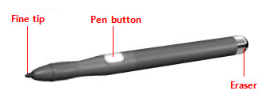
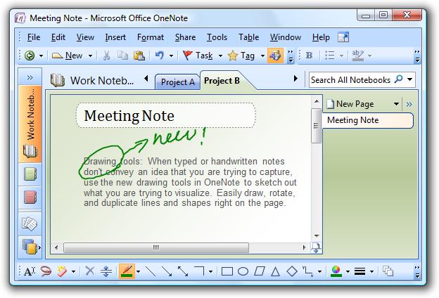
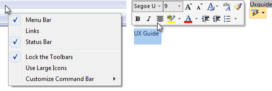
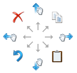
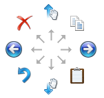
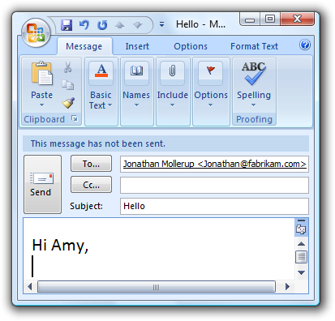
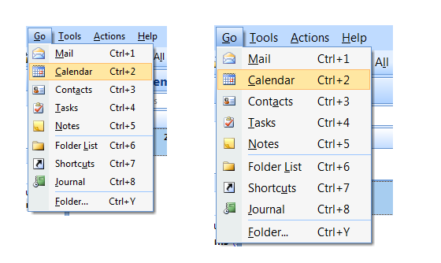
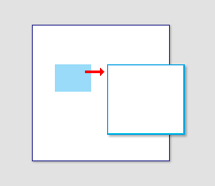
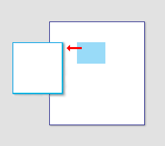

# Pen

> [!NOTE]
> This design guide was created for Windows 7 and has not been updated for newer versions of Windows. Much of the guidance still applies in principle, but the presentation and examples do not reflect our [current design guidance](/windows/uwp/design/).

All Microsoft Windows applications should be pen enabled. And doing so is easier than you think.

Pen input refers to the way Windows lets you interact directly with a computer using a pen. A pen can be used for pointing and also for gestures, simple text entry, and capturing free-form thoughts in digital ink.

The pen used for input has a fine, smooth tip that supports precise pointing, writing, or drawing in ink. The pen may also have an optional pen button (used to perform right-clicks) and eraser (used to erase ink). Most pens support hover.

A typical pen.

When the pen is used for handwriting, the user's strokes can be converted to text using handwriting recognition. The strokes can be kept just as they were written, with recognition performed in the background to support searching and copying as text. Such unconverted strokes are called digital ink.

An example of ink input.

Most Windows programs are already pen-friendly in that a pen can be used instead of a mouse, the pen works smoothly for most important tasks and interactions, and the program responds to gestures. A program becomes handwriting-friendly when it assists with handwritten text input. A program becomes ink-enabled when it can handle ink directly, instead of requiring that pen strokes be translated to text or equivalent mouse movements. This allows users to write, draw, and add comments in free-flowing, high-quality digital ink. Collecting ink is different than collecting mouse events, because ink requires higher resolution and a higher sample rate, and it can also add nuance with pressure and tilt. For information about creating handwriting friendly and ink-enabled programs, see [Integrating Ink](/previous-versions/windows/desktop/ms700674(v=vs.85)) and [Text Input Using the Pen](/previous-versions/windows/desktop/ms695501(v=vs.85)).

When positioning a pen, there is less need for a cursor because the tip represents itself. However, for targeting assistance, Windows provides a tiny pen cursor that indicates the current pen location. Unlike the mouse pointer it replaces, the pen cursor is not needed unless the pen is near the display, so it disappears after a few seconds of inactivity to allow an unobstructed view of information.

Most pen-friendly programs support gestures. A gesture is a quick movement of the pen on a screen that the computer interprets as a command, rather than as a mouse movement, writing, or drawing. One of the quickest and easiest gestures to perform is a flick. A flick is a simple gesture that results in navigation or an editing command. Navigational flicks include drag up, drag down, move back, and move forward, whereas editing flicks include copy, paste, undo, and delete.

All pointers except the busy pointer have a single pixel hot spot that defines the exact screen location of the pointer. The hot spot determines which object is affected by the interaction. Objects define a hot zone, which is the area where the hot spot is considered to be over the object. Typically, the hot zone coincides with the borders of an object, but it may be larger to make interaction easier.

**Because a pen can point more precisely than a finger, if your user interface works well for touch it will also work well for a pen.** Consequently, this article is primarily focused on adding pen support to programs that have already been designed for touch.

**Note:** Guidelines related to [mouse](inter-mouse.md), [accessibility](inter-accessibility.md), and [touch](inter-touch.md) are presented in separate articles.

## Design concepts

Using a pen for input has the following characteristics:

-   **Natural and intuitive.** Everyone knows how to point and tap with a pen. Object interactions are designed to correspond to how users interact with objects in the real world in a consistent manner.
-   **Expressive.** Strokes of a pen are easy to control, making writing, drawing, sketching, painting, and annotating easier than doing so with a mouse.
-   **More personal.** Just as a handwritten note or signature is more personal than a typed one, using a digitally handwritten note or signature is also more personal.
-   **Less intrusive.** Using a pen is silent, and consequently much less distracting than typing or clicking, especially in social situations such as meetings.
-   **Portable.** A computer with a pen capability can be more compact because most tasks can be completed without a keyboard, mouse, or touchpad. It can be more flexible because it doesn't require a work surface. It enables new places and scenarios for using a computer.
-   **Direct and engaging.** Using a pen makes you feel like you are directly interacting with the objects on the screen, whereas using a mouse or touchpad always requires you to coordinate hand movements with separate on-screen pointer movements which feels indirect by comparison.

**All Windows programs should have a good pen experience.** Users should be able to perform your program's most important tasks efficiently using a pen. Some tasks, like typing or detailed pixel manipulation, aren't appropriate for a pen, but they should at least be possible.

Fortunately, if your program is already well designed and is touch-friendly, providing good pen support is easy to do. For this purpose, a well-designed program:

-   **Has good mouse support.** The interactive controls have clear, visible affordances, and have hover states for pointer feedback. Objects have standard behaviors for the standard mouse interactions (single and double left-click, right-click, drag, and hover). The [pointer shape](inter-mouse.md) changes as appropriate to indicate the type of direct manipulation.
-   **Has good keyboard support.** The program makes users efficient by providing standard shortcut key assignments, especially for navigation and editing commands that can also be generated through gestures.
-   **Has controls large enough for touch.** The controls have a minimum size of 23x23 pixels (13x13 dialog units \[DLUs\]), and the most commonly used controls are at least 40x40 pixels (23x22 DLUs). To avoid unresponsive behavior, there should be no small gaps between targets the UI elements should be spaced so that adjacent targets are either touching or have at least 5 pixels (3 DLUs) of space between them.
-   **Is accessible.** Uses Microsoft Active Accessibility (MSAA) to provide programmatic access to the UI for assistive technologies. The program appropriately responds to theme and system metric changes.
-   **Works well and looks good in 120 dpi (dots per inch),** which is the recommended default display resolution for pen-enabled computers.
-   **Uses common controls.** Most common controls are designed to support a good pen experience. If necessary, the program uses well-implemented custom controls that are designed to support easy targeting and interactive manipulation.
-   **Uses constrained controls.** When designed for easy targeting, constrained controls like lists and sliders can be better than unconstrained controls like text boxes, because they reduce the need for text input.
-   **Provides appropriate default values.** The program selects the safest (to prevent loss of data or system access) and most secure option by default. If safety and security aren't factors, the program selects the most likely or convenient option, thereby eliminating unnecessary interaction.
-   **Provides text auto completion.** Provides a list of most likely or recently input values to make text input much easier.

Unfortunately, the converse is also true if your program isn't well designed, its shortcomings are going to be especially obvious to users who use a pen.

### Model for pen interaction

If you aren't experienced with using a pen, the best introduction is to learn by doing. Get a pen-enabled computer, put the mouse and keyboard aside, and do the tasks that you normally do using just a pen. Be sure to try both ink-enabled programs, such as Windows Journal, and programs that aren't ink-enabled. If you have a Tablet PC, experiment with holding it in different positions, such as on your lap, lying flat on a table, or in your arms while you're standing. Try using it in portrait and landscape orientation, and holding the pen for writing and just for pointing, in your left hand as well as your right.

As you experiment with using a pen, you'll discover that:

-   **Small controls are difficult to use.** The size of the controls greatly affects your ability to interact effectively. Controls that are 10x10 pixels work reasonably for a pen, but larger controls are even more comfortable to use. For example, [spin controls](ctrl-spin-controls.md) (15x11 pixels) are too small to use with a pen easily.
-   **Handedness is a factor.** Your hand sometimes covers things that you might want to see or interact with. For example, for right-handed users context menus are hard to use if they appear to the right of the click point, so it's better if they appear on the left. Windows allows users to indicate their handedness in the Tablet PC Settings control panel item.
-   **Task locality helps.** While you can move the pointer across a 14-inch screen with a 3-inch mouse movement, using a pen requires you to move your hand the full 14 inches. Repeatedly moving between targets that are far apart can be tedious, so it's much better to keep task interactions within the range of a resting hand whenever possible. Context menus are convenient because they require no hand movement.
-   **Text input and selection are difficult.** Lengthy text input is especially difficult using a pen, so auto-completion and acceptable default text values can really simplify tasks. Text selection can also be quite difficult, so tasks are easier when they don't require precise cursor placement.
-   **Small targets near the edge of the display can be very difficult to tap.** Some display bezels protrude, and some touchscreen technologies are less sensitive at the edges, making controls near the edge harder to use. For example, the Minimize, Maximize/Restore, and Close buttons on the title bar can be harder to use when a window is maximized.

### Control location

Task locality reduces tedious repeating cross-screen movements. To minimize hand movements, locate controls close to where they are most likely going to be used.

**Incorrect:**

In this example from Windows XP, the color palette is too far from where it is likely to be used.

Consider that the user's current location is the closest a target can be, making it trivial to acquire. Thus, context menus take full advantage of [Fitts' Law](inter-mouse.md), as do the mini-toolbars used by Microsoft Office.

The current pointer location is always the easiest to acquire.

Small targets near the display edge can be difficult to target, so avoid placing small controls near window edges. To ensure that controls are easy to target when a window is maximized, either make them at least 23x23 pixels (13x13 DLUs), or place them away from the window edge.

### Pen interactions

**System gestures**

System gestures are defined and handled by Windows. As a result, all Windows programs have access to them. These gestures have equivalent mouse, keyboard, and application command messages:

| System gesture                                                           | Synthesized equivalent message                                              |
|------------------------------------------------------------|-----------------------------------------------|
| Hover (when supported)                           | Mouse hover                         |
| Tap (down and up)                                | Mouse left-click                    |
| Double tap (down and up twice)                   | Mouse double left-click             |
| Press and hold (down, pause, up)                 | Mouse right-click                   |
| Drag (down, move, up)                            | Mouse left-drag                     |
| Press, hold, and drag (down, pause, move, up)    | Mouse right-drag                    |
| Select (down, move over selectable objects, up)  | Mouse select                        |

 

**Developers:** For more information, see [SystemGesture Enumeration](/previous-versions/ms552724(v=vs.100)).

**Flicks**

Flicks are simple gestures that are roughly the equivalent of keyboard shortcuts. Navigational flicks include drag up, drag down, move back, and move forward. Editing flicks include copy, paste, undo, and delete. To use flicks, your program only needs to respond to the related keystrokes commands.

The eight flick gestures and their default assignments in Windows 7. The navigation flicks were changed to correspond to panning (where the object moves with the gesture) instead of scrolling (where the object moves in the opposite direction of the gesture).

The eight flick gestures and their default assignments in Windows Vista.

The navigational flicks have natural mapping, so they are easy to learn and remember. The editing flicks are diagonals that require more precision and their mappings are not as natural (flick towards the Recycle Bin to delete, flick in the Back arrow direction to undo), so these aren't enabled by default. All flick actions can be customized using the Pen and Input Devices control panel item.

| Flick                                     | Synthesized equivalent message                                                            |
|--------------------------------------|-------------------------------------------------------------|
| Flick left                 | Forward command (Back command for Windows Vista)  |
| Flick right                | Back command (Forward command for Windows Vista)  |
| Flick up                   | Keyboard Scroll Down                              |
| Flick down                 | Keyboard Scroll Up                                |
| Flick up-left diagonal     | Keyboard Delete                                   |
| Flick down-left diagonal   | Keyboard Undo                                     |
| Flick up-right diagonal    | Keyboard Copy                                     |
| Flick down-right diagonal  | Keyboard Paste                                    |

 

**Application gestures**

Applications can define and handle other gestures as well. The Microsoft Gesture Recognizer can recognize over [40 gestures](../tablet/application-gestures-and-semantic-behavior.md). To use application gestures, your program must define the gestures it recognizes, and then handle the resulting events.

**Responsiveness and consistency**

**Responsiveness is essential for creating pen experiences that feel direct and engaging.** To feel direct, gestures must take effect immediately, and an object's contact points must stay under the pen smoothly throughout the gesture. Any lag, choppy response, loss of contact, or inaccurate results destroys the perception of direct manipulation and also of quality.

**Consistency is essential for creating pen experiences that feel natural and intuitive.** Once users learn a standard gesture, they expect that gesture to have the same effect across all applicable programs. To avoid confusion and frustration, never assign non-standard meanings to standard gestures. Instead, use custom gestures for interactions unique to your program.

**Editing ink and text**

Editing ink and text are among the most challenging interactions when using a pen. Using constrained controls, appropriate default values, and auto-completion eliminates or reduces the need to input text. But if your program involves editing text or ink, **you can make users more productive by automatically zooming input UI up to 150 percent by default when a pen is used.**

For example, an e-mail program could display UI at normal size, but zoom the input UI to 150 percent to compose messages.

In this example, the input UI is zoomed to 150 percent.

**If you do only four things...**

1.  1. Make your Windows programs have a good pen experience! Users should be able to perform your program's most important tasks efficiently using a pen (at least those tasks that don't involve a lot of typing or detailed pixel manipulation).
2.  2. Consider adding support for writing, drawing, and adding comments directly using ink in the most relevant scenarios.
3.  3. To create a direct and engaging experience, have gestures take effect immediately, keep contact points under the user's pen smoothly throughout the gesture, and have the effect of the gesture map directly to the user's motion.
4.  4. To create a natural and intuitive experience, support appropriate standard gestures and assign them their standard meanings. Use custom gestures for interactions unique to your program.

## Guidelines

### Control usage

-   **Prefer using common controls.** Most common controls are designed to support a good pen experience.
-   **Prefer constrained controls.** Use constrained controls like lists and sliders whenever possible, instead of unconstrained controls like text boxes, to reduce the need for text input.
-   **Provide appropriate default values.** Select the safest (to prevent loss of data or system access) and most secure option by default. If safety and security aren't factors, select the most likely or convenient option, thereby eliminating unnecessary interaction.
-   **Provide text auto-completion.** Provide a list of most likely or recently input values to make text input much easier.
-   **For important tasks that use multiple selection, if a standard multiple-selection list is normally used, provide an option to use a check box list instead.**
-   **Respect system metrics.** Use system metrics for all sizes don't hardwire sizes. If necessary, users can change the system metrics or dpi to accommodate their needs. However, treat this as a last resort because users shouldn't normally have to adjust system settings to make UI usable.

In this example, the system metric for menu height was changed.

### Control sizing, layout, and spacing

-   **For common controls, use the recommended control sizes.** These are large enough for a good pen experience, except for spin controls (which aren't usable with a pen but are redundant).
-   **Choose a layout that places controls close to where they are most likely going to be used.** Keep task interactions within a small area whenever possible. Avoid long distance hand movements, especially for common tasks and for drags.
-   **Use the recommended spacing.** The recommended spacing is pen-friendly.
-   **Interactive controls should either be touching or preferably have at least 5 pixels (3 DLUs) of space between them.** Doing so prevents confusion when users tap outside the intended target.
-   **Consider adding more than the recommended vertical spacing within groups of controls,** such as command links, check boxes, and radio buttons, as well as between the groups. Doing so makes them easier to differentiate.

### Interaction

-   **For programs designed to accept handwriting, enable default inking.** Default inking allows users to input ink by just starting to write, without having to tap, give a command, or do anything special. Doing so enables the most natural experience with a pen. For programs not designed to accept handwriting, handle pen input in text boxes as selection.
-   **Allow users to zoom the content UI** if your program has tasks that require editing text. Consider automatically zooming to 150 percent when a pen is used.
-   **Because gestures are memorized, assign them meanings that are consistent across programs.** Don't give different meanings to gestures with fixed semantics. Use an appropriate program-specific gesture instead.

### Handedness

-   **If a window is contextual, always display it near the object that it was launched from.** Place it out of the way so that the source object isn't covered by the window.
    -   If displayed using the mouse, when possible place the contextual window offset down and to the right.

        

        Show contextual windows near the object that it was launched from.

    -   If displayed using a pen, when possible place the contextual window so as not to be covered by the user's hand. For right-handed users, display to the left; otherwise display to the right.

        

        When using a pen, also show contextual windows so that they aren't covered by the user's hand.

-   **Developers:** You can distinguish between mouse events and pen events using the [GetMessageExtraInfo](../tablet/system-events-and-mouse-messages.md) API. You can determine the user's [handedness](/previous-versions/ms819495(v=msdn.10)) using the [SystemParametersInfo](/windows/win32/api/winuser/nf-winuser-systemparametersinfoa) API with SPI\_GETMENUDROPALIGNMENT.

### Forgiveness

-   **Provide an undo command.** Ideally, you should provide undo for all commands, but your program may have some commands whose effect cannot be undone.
-   **Provide good hover feedback.** Clearly indicate when the pen is over a clickable target. Such feedback is a great way to prevent accidental manipulation.
-   **Whenever practical, provide good feedback on pen down, but don't take actions until a move or pen up.** Doing so allows users to correct mistakes before they make them.
-   **Whenever practical, allow users to correct mistakes easily.** If an action takes effect on pen up, allow users to correct mistakes by sliding while the pen is still down.

## Documentation

When referring to pen input:

-   Refer to a pen-shaped stylus input device as a pen. On first mention, use tablet pen.
-   Refer to the button on the side of a pen as the pen button, not the barrel button.
-   Refer generically to the keyboard, mouse, trackball, pen, or finger as an input device.
-   Use tap (and double-tap) instead of click when documenting procedures specific to using a pen. Tap means to press the screen and then lift before a hold time. It may or may not be used to generate a mouse click. For interactions that don't involve the pen, continue to use click.

