# Touch

> [!NOTE]
> This design guide was created for Windows 7 and has not been updated for newer versions of Windows. Much of the guidance still applies in principle, but the presentation and examples do not reflect our [current design guidance](/windows/uwp/design/).

All Microsoft Windows applications should have a great touch experience. And creating such an experience is easier than you think.

Touch refers to using one or more fingers to provide input through a device display and interact with Windows and apps. A touch-optimized app has a UI and interaction model designed to accommodate the larger, less precise contact areas of touch, the various form factors of touch devices, and the many postures and grips users might adopt when using a touch device.

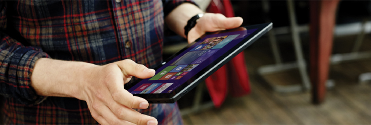

Each input device has its strengths. The keyboard is best for text input and giving commands with minimal hand movement. The mouse is best for efficient, precise pointing. Touch is best for object manipulation and giving simple commands. A pen is best for freeform expression, as with handwriting and drawing.

Windows 8.1 is optimized for responsiveness, accuracy, and ease of use with touch while fully supporting traditional input methods (such as mouse, pen, and keyboard). The speed, accuracy, and tactile feedback that traditional input modes provide are familiar and appealing to many users and potentially better suited to specific interaction scenarios.

You can find guidelines related to mouse, pen, and accessibility in separate topics.

When you think about the interaction experience for your app:

Don't assume that if a UI works well for a mouse, it also works well for touch. While good mouse support is a start, a good touch experience has a few additional requirements.

Do assume that if a UI works well for a finger, it also works well for a pen. Making your app touchable goes a long way to also provide good pen support. The primary difference is that fingers have a blunter tip, so they need larger targets.

With touch, you can manipulate objects and UI directly, which makes for a quicker, more natural and engaging experience.

## Provide a great touch experience

You should ensure users can perform critical and important tasks efficiently using touch input. However, specific app functionality, like text or pixel manipulation, might not be suitable for touch and can be reserved for the most suitable input device.

If you don't have much experience developing touch apps, it's best to learn by doing. Get a touch-enabled computer, put the mouse and keyboard aside, and use only your fingers to interact with your app. If you have a tablet, experiment with holding it in different positions, such as on your lap, lying flat on a table, or in your arms while you're standing. Try using it in portrait and landscape orientation.

Touch-optimized apps that work best with touch interaction are typically:

-   **Natural and intuitive.** Interactions are designed to correspond to how users interact with objects in the real world.
-   **Less intrusive.** Using touch is silent, and consequently much less distracting than typing or clicking.
-   **Portable.** Touch devices are more compact because many tasks can be completed without a keyboard, mouse, pen, or touchpad. They're also more flexible because a work surface isn't required.
-   **Direct and engaging.** Touch makes you feel like you are directly manipulating objects on the screen.
-   **Less accurate.** Users can't target objects as accurately with touch, compared to a mouse or pen.

Touch provides a natural, real-world feel to interaction. Direct manipulation and animation complete this impression, by giving objects a realistic, dynamic motion and feedback. For example, consider a card game. Not only is it convenient and easy to drag cards using a finger, the experience takes on an engaging real-world feel when you can toss, glide, and spin the cards just like you would a physical deck. And when you try to move a card that can't be moved, it's a better experience to have the card resist but not prevent movement, and settle back in place when released, to clearly indicate that the action was recognized but can't be done.

Fortunately, if your app is already well designed, providing a great touch experience is easy to do. For this purpose, a well-designed program:

-   **Ensures most important tasks can be performed efficiently using a finger** (at least the tasks that don't involve a lot of typing or detailed pixel manipulation).
-   **Uses large controls for touch.** Common controls have a minimum size of 23x23 pixels (13x13 DLUs), and the most commonly used controls are at least 40x40 pixels (23x22 DLUs). To avoid unresponsive behavior, UI elements should have at least 5 pixels (3 DLUs) of space between them. For other controls, make sure they have at least a 23x23 pixel (13x13 DLU) click target, even if their static appearance is much smaller. See standard control sizing.
-   **Supports Mouse input.** The interactive controls have clear, visible affordances. Objects have standard behaviors for the standard mouse interactions (single and double left-click, right-click, drag, and hover).
-   **Supports keyboard input.** The app provides standard shortcut key assignments, especially for navigation and editing commands that can also be generated through touch gestures.
-   **Ensures accessibility.** Uses UI Automation or Microsoft Active Accessibility (MSAA) to provide programmatic access to the UI for assistive technologies. The app responds appropriately to orientation, theme, locale, and system metric changes.
-   **Eliminates unnecessary interactions.** To prevent loss of data or system access, use the safest and most secure default values. If safety and security aren't factors, the app selects the most likely or convenient option.
-   **Provides touch equivalent for hover.** Don't rely on hover as the only way to perform an action.
-   **Ensures gestures take effect immediately.** Keep contact points under the user's fingers smoothly throughout the gesture, which provides the effect of the gesture mapping directly to the user's motion.
-   **Uses standard gestures whenever possible.** Custom gestures only for interactions unique to your app.
-   **Ensures undesired or destructive commands can be reversed or corrected.** Accidental actions are more likely when using touch.

## Guidelines for touch input

With touch, your Windows app can use physical gestures to emulate the direct manipulation of UI elements.

Consider these best practices when designing your touch-enabled app:

**Responsiveness is essential for creating touch experiences that feel direct and engaging.** To feel direct, gestures must take effect immediately, and an object's contact points must stay under the user's fingers smoothly throughout the gesture. The effect of touch input should map directly to the user's motion, so, for example, if the user rotates his fingers 90 degrees, the object should rotate 90 degrees as well. Any lag, choppy response, loss of contact, or inaccurate results destroys the perception of direct manipulation and also of quality.

**Consistency is essential for creating touch experiences that feel natural and intuitive.** Once users learn a standard gesture, they expect that gesture to have the same effect across all apps. To avoid confusion and frustration, never assign non-standard meanings to standard gestures. Instead, use custom gestures for interactions unique to your program.

Next we'll describe the Windows touch language, but before we go on, here's a short list of basic touch input terms.

-   **Gesture**

    A gesture is the physical act or motion performed on, or by, the input device (finger, fingers, pen/stylus, mouse, and so on). For example, to launch, activate, or invoke a command, you use a single finger tap for a touch or touchpad device (equivalent to a left-click with a mouse, a tap with a pen, or Enter on a keyboard).

-   **Manipulation**

    A manipulation is the immediate, real-time reaction or response an object or UI has to a gesture. For example, both the slide and swipe gestures typically cause an element or UI to move in some way.

    The final outcome of a manipulation, how it's manifested by the object on the screen and in the UI, is the interaction.

-   **Interaction**

    Interactions depend on how a manipulation is interpreted and the command or action that results from the manipulation. For example, objects can be moved using both the slide and swipe gestures, but the results differ depending on whether a distance threshold is crossed. Slide can be used to drag an object or pan a view while swipe can be used to select an item or display an app bar.

### The Windows touch language

Windows provides a concise set of touch interactions that are used throughout the system. Applying this touch language consistently makes your app feel familiar to what users already know. This increases user confidence by making your app easier to learn and use. To learn more about touch language implementation, see Gestures, manipulations, and interactions.

**Press and hold to learn**

The press and hold gesture displays detailed info or teaching visuals (for example, a tooltip or context menu) without committing to an action or command. Panning is still possible if a sliding gesture is started while the visual is displayed.

> [!IMPORTANT]
> You can use press and hold for selection in cases where both horizontal and vertical panning is enabled.

 

Entry state: One or two fingers in contact with the screen.

Motion: No motion.

Exit state: Last finger up ends the gesture.

Effect: Display more information.

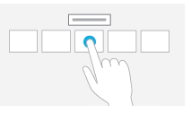

The press and hold gesture.

**Hover**

Hover is a useful interaction because it allows users to get additional information through tips before initiating an action. Seeing these tips makes users feel more confident and reduces errors.

Unfortunately, hover isn't supported by touch technologies, so users can't hover when using a finger. The simple solution to this problem is to take full advantage of hover, but only in ways that are not required to perform an action. In practice, this usually means that the action can also be performed by clicking, but not necessarily in exactly the same way.

In this example, users can see today's date by either hovering or clicking.

**Tap for primary action**

Tapping on an element invokes its primary action, for instance launching an app or executing a command.

Entry state: One finger in contact with the screen or touchpad and lifted before the time threshold for a press and hold interaction occurs.

Motion: No motion.

Exit state: Finger up ends the gesture.

Effect: Launch an app or execute a command.

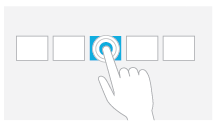

The tap gesture.

**Slide to pan**

Slide is used primarily for panning interactions but can also be used for moving (where panning is constrained to one direction), drawing, or writing. Slide can also be used to target small, densely packed elements by scrubbing (sliding the finger over related objects such as radio buttons).

Entry state: One or two fingers in contact with the screen.

Motion: Drag, with any additional fingers remaining in same position relative to each other.

Exit state: Last finger up ends the gesture.

Effect: Move the underlying object directly and immediately as the fingers move. Be sure to keep the contact point under the finger throughout the gesture.

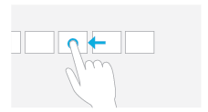

The pan gesture.

**Swipe to select, command, and move**

Sliding the finger a short distance, perpendicular to the panning direction (where panning is constrained to one direction), selects objects in a list or grid. Display the app bar with relevant commands when objects are selected.

Entry state: One or more fingers touch the screen.

Motion: Drag a short distance and lift before the distance threshold for a move interaction occurs.

Exit state: Last finger up ends the gesture.

Effect: Underlying object is selected, or moved, or app bar is displayed. Be sure to keep the contact point under the finger throughout the gesture.

The swipe gesture.

**Pinch and stretch to zoom**

The pinch and stretch gestures are used for three types of interactions: optical zoom, resizing, and semantic zoom.

Optical zoom adjusts the magnification level of the entire content area to get a more detailed view of the content. In contrast, resizing is a technique for adjusting the relative size of one or more objects within a content area without changing the view into the content area.

Semantic zoom is a touch-optimized technique for presenting and navigating structured data or content within a single view (such as the folder structure of a computer, a library of documents, or a photo album) without the need for panning, scrolling, or tree view controls. Semantic zoom provides two different views of the same content by letting you see more detail as you zoom in and less detail as you zoom out.

Entry state: Two fingers in contact with the screen at the same time.

Motion: Fingers move apart (stretch) or together (pinch) along an axis.

Exit state: Any finger up ends the gesture.

Effect: Zoom the underlying object in or out directly and immediately as the fingers separate or approach on the axis. Be sure to keep the contact points under the finger throughout the gesture.

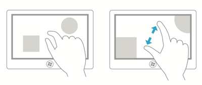

The zoom gesture.

**Turn to rotate**

Rotating with two or more fingers causes an object to rotate. Rotate the device itself to rotate the entire screen.

Entry state: Two fingers in contact with the screen at the same time.

Motion: One or both fingers rotate around the other, moving perpendicular to the line between them.

Exit state: Any finger up ends the gesture.

Effect: Rotate the underlying object the same amount as the fingers have rotated. Be sure to keep the contact points under the finger throughout the gesture.

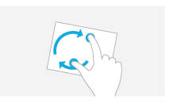

The rotation gesture.

Rotation makes sense only for certain types of objects, so it's not mapped to a system Windows interaction.

Rotation is often done differently by different people. Some people prefer to rotate one finger around a pivot finger, while others prefer to rotate both fingers in a circular motion. Most people use a combination of the two, with one finger moving more than the other. While smooth rotation to any angle is the best interaction, in many contexts, such as photo viewing, it's best to settle to the nearest 90 degree rotation once the user lets go. In photo editing, you can use a small rotation to straighten the photo.

**Swipe from edge for app commands**

Swiping the finger a short distance from the bottom or top edge of the screen reveals app commands in an app bar.

Entry state: One or more fingers touch the bezel.

Motion: Drag a short distance onto the screen and lift.

Exit state: Last finger up ends the gesture.

Effect: App bar is displayed.

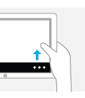

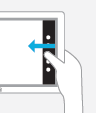

The swipe from edge gesture.

Developers: For more info, see [**DIRECTMANIPULATION\_CONFIGURATION**](/previous-versions/windows/desktop/api/directmanipulation/ne-directmanipulation-directmanipulation_configuration) enumeration.

### Control usage

Here, we provide some guidelines for optimizing controls for touch usage.

-   **Use common controls.** Most common controls are designed to support a good touch experience.
-   **Choose custom controls that are designed to support touch.** You might need custom controls to support your program's special experiences. Choose custom controls that:
    -   Can be sized large enough to for easy targeting and manipulation.
    -   When manipulated, move and react the way real-world objects move and react, such as by having momentum and friction.
    -   Are forgiving by allowing users to easily correct mistakes.
    -   Are forgiving of inaccuracy with clicking and dragging. Objects that are dropped near their destination should fall into the correct place.
    -   Have clear visual feedback when the finger is over the control.
-   **Use constrained controls.** Constrained controls like lists and sliders, when designed for easy touch targeting, can be better than unconstrained controls like text boxes because they reduce the need for text input.
-   **Provide appropriate default values.** Select the safest (to prevent loss of data or system access) and most secure option by default. If safety and security aren't factors, select the most likely or convenient option, thereby eliminating unnecessary interaction.
-   **Provide text auto completion.** Provides a list of most likely values, or most recently input values, to make text input much easier.
-   **For important tasks that use multiple selection**, if a standard multiple-selection list is normally used, provide an option to use a check box list instead.

### Control sizes and touch targeting

Due to the large surface area of the fingertip, small controls that are too close together can be difficult to target precisely.

As a general rule, a control size of 23x23 pixels (13x13 DLUs) is a good minimum interactive control size for any input device. By contrast, the spin controls at 15x11 pixels are much too small to be used effectively with touch.

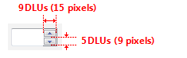

Keep in mind that the minimum size is really based on physical area, not layout metrics such as pixels or DLUs. Research indicates that the minimum target area for efficient, accurate interaction using a finger is 6x6 millimeters (mm). This area translates to layout metrics like this:

| Font             | Millimeters | Relative pixels | DLUs  |
|------------------|-------------|-----------------|-------|
| 9 point Segoe UI | 6x6         | 23x23           | 13x13 |
| 8 point Tahoma   | 6x6         | 23x23           | 15x14 |

 

Furthermore, research shows that a minimum size of 10x10 mm (about 40x40 pixels) enables better speed and accuracy, and also feels more comfortable to users. When practical, use this larger size for command buttons used for the most important or frequently used commands.

The goal isn't to have giant controls, just ones that are easily used with touch.

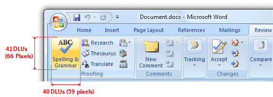

In this example, Microsoft Word uses buttons larger than 10x10 mm for the most important commands.

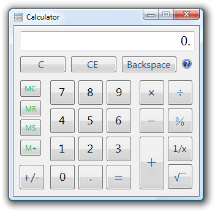

This version of Calculator uses buttons larger than 10x10 mm for its most frequently used commands.

There's no perfect size for touch targets. Different sizes work for different situations. Actions with severe consequences (such as delete and close) or frequently used actions should use large touch targets. Infrequently used actions with minor consequences can use small targets.

**Target size guidelines for custom controls**

| Size guideline                                                                                 | Description                                                                                                                                                                                                                                                                                 |
|----------------------------------------------------------------------------------|----------------------------------------------------------------------------------------------------------------------------------------------------------------------------------------------------------------------------------------------------------------------------------|
| 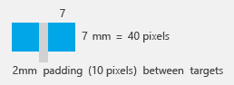       | **7x7 mm: Recommended minimum size**  7x7 mm is a good minimum size if touching the wrong target can be corrected in one or two gestures or within five seconds. Padding between targets is just as important as target size.                                |
| 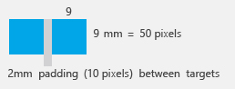  | **When accuracy matters**  Close, delete, and other actions with severe consequences can't afford accidental taps. Use 9x9 mm targets if touching the wrong target requires more than two gestures, five seconds, or a major context change to correct.      |
| 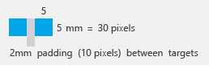                   | **When it just won't fit**  If you find yourself cramming things to fit, it's okay to use 5x5 mm targets as long as touching the wrong target can be corrected with one gesture. Using 2 mm of padding between targets is extremely important in this case.  |

 

**Target size guidelines for common controls**

-   **For common controls, use the recommended control sizes.** The recommended control sizing satisfies the 23x23 pixel (13x13 DLU) minimum size, except for check boxes and radio buttons (their text width compensates somewhat), spin controls (which aren't usable with touch, but are redundant), and splitters.

    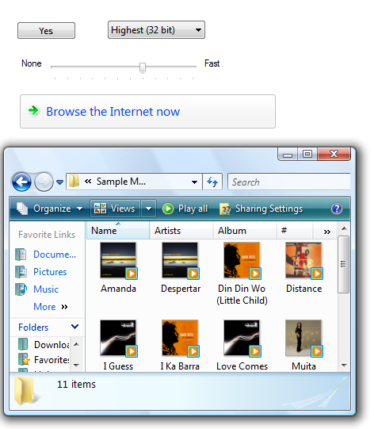

    The recommended control sizes are easily touchable.

-   **For command buttons used for the most important or frequently used commands, use a minimum size of 40x40 pixels (23x22 DLUs) whenever practical.** Doing so yields better speed and accuracy, and also feels more comfortable to users.

    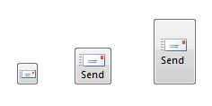

    Whenever practical, use larger command buttons for important or frequently used commands.

-   **For other controls:**

    -   **Use larger click targets.** For small controls, make the target size larger than the statically visible UI element. For example, 16x16 pixel icon buttons can have a 23x23 pixel click target buttons, and text elements can have selection rectangles 8 pixels wider than the text and 23 pixels high.

        Correct:

        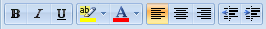

        Incorrect:

        

        Correct:

        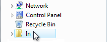

        In the correct examples, the click targets are larger than the statically visible UI elements.

    -   **Use redundant click targets.** It's acceptable for click targets to be smaller than the minimum size if that control has redundant functionality.

        For example, the progressive disclosure triangles used by the tree view control are only 6x9 pixels, but their functionality is redundant with their associated item labels.

        

        The tree view triangles are too small to be easily touchable, but they are redundant in functionality with their larger associated labels.

        Respect system metrics. Don't hardcode sizes. If necessary, users can change the system metrics or dpi to accommodate their needs. However, treat this as a last resort because users shouldn't normally have to adjust system settings to make UI usable.

        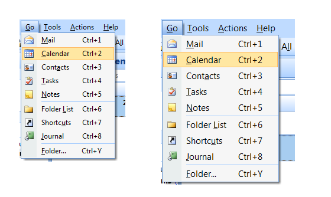

        In this example, the system metric for menu height was changed.

Editing text

Editing text is one of the most challenging interactions when using a finger. Using constrained controls, appropriate default values, and auto-completion eliminates or reduces the need to input text. But if your app involves editing text, you can make users more productive by automatically zooming input UI up to 150 percent by default when touch is used.

For example, an e-mail program could display UI at normal touchable size, but zoom the input UI to 150 percent to compose messages.

In this example, the input UI is zoomed to 150 percent.

### Control layout and spacing

The spacing between controls is a significant factor in making controls easily touchable. Targeting is quicker but less precise when using a finger as the pointing device, resulting in users more often tapping outside their intended target. When interactive controls are placed very close together but are not actually touching, users may click on inactive space between the controls. Because clicking inactive space has no result or visual feedback, users are often uncertain what went wrong.

**Dynamically adjust spacing based on the input device used.** This is particularly useful with transient UI such as menus and flyouts.

**Provide a minimum of 5 pixels (3 DLUs) of space between the target regions of interactive controls.** If small controls are too closely spaced, the user needs to tap with precision to avoid tapping the wrong object.

**Make controls within groups easier to differentiate by using more than the recommended vertical spacing between controls.** For example, radio buttons at 19 pixels high are shorter than the minimum recommended size of 23 pixels. When you have vertical space available, you can achieve roughly the same effect as the recommended sizing by adding an additional 4 pixels of spacing to the standard 7 pixels.

Correct:

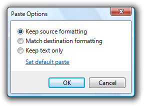

Better:

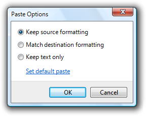

In the better example, the extra spacing between the radio buttons makes them easier to differentiate.

There may be situations in which extra spacing would be desirable when using touch, but not when using the mouse or keyboard. In such cases, only use a more spacious design when an action is initiated using touch.

**Choose a layout that places controls close to where they are most likely going to be used.** Keep task interactions within a small area whenever possible and locate controls close to where they are most likely going to be used. Avoid long distance hand movements, especially for common tasks and for drags.

Consider that the current pointer location is the closest a target can be, making it trivial to acquire. Thus, context menus take full advantage of Fitts' law, as do the mini-toolbars used by Microsoft Office.

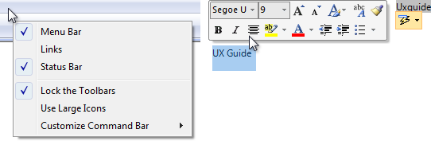

**Avoid placing small controls near the edge of the app or the display.** Small targets near edges can be difficult to touch (display bezels can interfere with edge gestures). To ensure that controls are easy to target when a window is maximized, either make them at least 23x23 pixels (13x13 DLUs) or place them away from the window edge.

**Use the recommended spacing.** The recommended spacing is touch-friendly. However, if your app can benefit from larger sizing and spacing, consider the recommended sizing and spacing to be minimums when appropriate.

**Provide at least 5 pixels (3 DLUs) of space between interactive controls.** Doing so prevents confusion when users tap outside their intended target.

Consider adding more than the recommended vertical spacing within groups of controls, such as command links, check boxes, and radio buttons, as well as between the groups. Doing so makes them easier to differentiate.

**Consider adding more than the recommended vertical spacing dynamically when an action is initiated using touch.** Doing so makes objects easier to differentiate, but without taking more space when using a keyboard or mouse. Increase the spacing by a third of its normal size or at least 8 pixels.

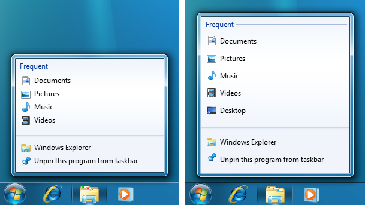

In this example, Windows 7 taskbar Jump Lists are more spacious when displayed using touch.

### Interaction

Using the correct controls gets you only part of the way to a touch-optimized app, you also need to consider the overall interaction model those controls support. Here are a few guidelines to help you with this.

-   **Make hover redundant.** Hover isn't supported by most touch technologies, so users with such touchscreens can't perform any tasks that require hovering.
-   **For apps that need text input, fully integrate the touch keyboard feature** by:
    -   Providing appropriate default values for user input.
    -   Providing auto-complete suggestions when appropriate.

    > [!Note]  
    > Developers: For more info about integrating the touch keyboard, see [**ITextInputPanel**](/windows/desktop/api/peninputpanel/nn-peninputpanel-itextinputpanel).

     

-   **Allow users to zoom the content UI if your program has tasks that require editing text.** Consider automatically zooming to 150 percent when touch is used.
-   **Provide smooth, responsive panning and zooming wherever appropriate.** Redraw quickly after a pan or zoom to remain responsive. Doing so is necessary to make direct manipulation feel truly direct.
-   **During a pan or zoom, make sure that the contact points stay under the finger throughout the gesture.** Otherwise, the pan or zoom is difficult to control.
-   **Because gestures are memorized, assign them meanings that are consistent across apps.** Don't give different meanings to gestures with fixed semantics. Use an appropriate app-specific gesture instead.

### Forgiveness

Direct manipulation makes touch natural, expressive, efficient, and engaging. However, where there is direct manipulation, there can be accidental manipulation and therefore the need for forgiveness.

Forgiveness is the ability to reverse or correct an undesired action easily. You make a touch experience forgiving by providing undo, giving good visual feedback, having a clear physical separation between frequently used commands and destructive commands, and allowing users to correct mistakes easily. Associated with forgiveness is preventing undesired actions from happening in the first place, which you can do by using constrained controls and confirmations for risky actions or commands that have unintended consequences.

-   **Provide an Undo command.** It's best to provide a simple way to undo all commands, but your app may have some commands whose effect cannot be undone.
-   **Whenever practical, provide good feedback on finger down, but don't take actions until finger up.** Doing so allows users to correct mistakes before they make them.
-   **Whenever practical, allow users to correct mistakes easily.** If an action takes effect on finger up, allow users to correct mistakes by sliding while the finger is still down.
-   **Whenever practical, indicate that a direct manipulation can't be performed by resisting the movement.** Allow the movement to happen, but have the object settle back in place when released to clearly indicate the action was recognized but can't be done.
-   **Have clear physical separation between frequently used commands and destructive commands.** Otherwise, users might touch destructive commands accidentally. A command is considered destructive if its effect is widespread and either it cannot be easily undone or the effect isn't immediately noticeable.
-   **Confirm commands for risky actions or commands that have unintended consequences.** Use a confirmation dialog box for this purpose.
-   **Consider confirming any other actions that users tend to do accidentally when using touch, and which either go unnoticed or are difficult to undo.** Normally, these are called routine confirmations and are discouraged based on the assumption that users don't often issue such commands by accident with a mouse or keyboard. To prevent unnecessary confirmations, present these confirmations only if the command was initiated using touch.

    Routine confirmations are acceptable for interactions that users often do accidentally using touch.

    Developers: You can distinguish between mouse events and touch events using the [**INPUT\_MESSAGE\_SOURCE**](/windows/win32/api/winuser/ns-winuser-input_message_source) API.

