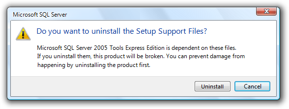
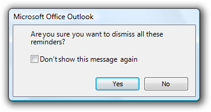

# Confirmations

> [!NOTE]
> This design guide was created for Windows 7 and has not been updated for newer versions of Windows. Much of the guidance still applies in principle, but the presentation and examples do not reflect our [current design guidance](/windows/uwp/design/).

A confirmation is a modal dialog box that asks if the user wants to proceed with an action.

A typical confirmation.

Confirmations have these essential characteristics:

-   They are displayed as the direct result of an action initiated by the user.
-   They verify that the user wants to proceed with the action.
-   They consist of a simple question and two or more responses.

Confirmations are most useful when the action requires the user to make a relevant and distinct choice that can't be made later. That choice often involves some element of risk that isn't obvious to the user, but risk isn't essential to confirmations. These elements are necessary to justify the interruption of responding to a modal dialog.

By contrast, [warning messages](mess-warn.md) present a condition that might cause a problem in the future. Their fundamental characteristic is that they involve risk:

-   They involve potential loss of one or more of the following:
    -   A valuable asset, such as data loss or financial loss.
    -   System access or integrity.
    -   Privacy or control over confidential information.
    -   User's time (a significant amount, such as 30 seconds or more).
-   They have unexpected or unintended consequences.
-   They require correct handling now because mistakes can't be easily fixed, and may even be irreversible.

If a confirmation involves risk, it can be considered a warning as well. Consequently, the warning message guidelines also apply.

**Note:** Guidelines related to [dialog boxes](win-dialog-box.md), [error messages](mess-error.md), [layout](vis-layout.md), and [warning messages](mess-warn.md) are presented in separate articles.

## Is this the right user interface?

To decide, consider these questions:

-   **Is the user being asked a question to proceed with an action that has two or more responses?** If not, the message isn't a confirmation.
-   **Is the UI presenting an error or problem that has occurred?** If so, use an [error message](mess-error.md) instead.
-   **Does proceeding with the action require the user to make a choice that doesn't have a suitable default?** If so, a confirmation may be appropriate.
-   **Is there an alternative design that eliminates the need for the confirmation?** The need for a confirmation sometimes indicates a design flaw. Often there is a better design alternative that doesn't need a confirmation.
-   **Is the user about to perform a risky action?** If so, a confirmation is appropriate if the action has significant consequences or cannot be easily undone.
-   **Is the user about to abandon a task?** If so, don't confirm. Assume users understand the consequences of not completing a task.
-   **Does the action have consequences that users might not be aware of?** If so, a confirmation may be appropriate.
-   **Given the current context, are users likely to be performing an action in error?** If so, a confirmation may be appropriate.
-   **Do users perform the action frequently?** If so, consider an alternative design. Frequent confirmations are annoying and have little value because users learn to respond without thinking.
-   **Does the action have security implications?** If so, a confirmation may be required even if the previous tests indicate otherwise.

## Design concepts

### Unnecessary confirmations are annoying

The first Windows confirmation ever created undoubtedly looked like this:

The original annoying confirmation.

This was a very bad start. If you want users to hate your program, just sprinkle confirmations like this throughout. To understand why, consider the user's point of view. The user just asked to perform an action by the definition of a confirmation so unless something was somehow clicked or pressed accidentally, of course the user wants to proceed.

Not only are unnecessary confirmations annoying, but they aren't effective in protecting the user from mistakes. Users quickly discover when a program has unnecessary confirmations and their natural response is to dismiss them as quickly as possible, often without reading. Consequently, such confirmations do little more than add an extra step to these tasks.

Don't use confirmations just because there is the possibility of users making a mistake. **Rather, confirmations are most effective when used to confirm actions that have significant or unintended consequences.** Good confirmations never state the obvious; they should communicate something users need to be aware of a good reason not to continue. And they are used only when they are really needed by an action, such as asking users to save changes only when there are changes worth saving. Doing so demands the user's attention only when it is truly warranted.

For other types of confirmations, there is often a better design alternative than forcing users to answer a question.

### Consider the design alternatives

Here are some design alternatives that eliminate the need for routine confirmations:

-   **Prevent errors.** Design tasks so that significant mistakes are difficult to do accidentally. For example, physically separate destructive commands from other commands, and require multiple actions to complete.
-   **Provide undo.** Provide the ability to revert actions. For example, deleting a file in Microsoft Windows usually doesn't require a confirmation because deleted files can be recovered from the Recycle Bin. Note that if an action is very easy to perform, just having users redo the action may be sufficient.
-   **Provide feedback.** Make undesirable outcomes obvious. Providing undo alone isn't sufficient if users don't realize when they make a mistake. For example, the effect of direct manipulation (such as a drag-and-drop operation) should always be obvious.
-   **Assume the probable outcome, but make it easy to change.** If you aren't sure what users want but there is a likely, safe, and secure choice, assume that choice, make it clear what happened, and make it easy to change using a context menu. For example, Microsoft Word assumes that users want to spell words correctly. If it recognizes a misspelled word and it knows the likely correct spelling, Word automatically makes the correction but allows users to revert.
-   **Eliminate the choice completely.** If the choice isn't important, users just won't care. Better to [simplify](/previous-versions//dn742474(v=vs.85)) your program and eliminate the choice.

### Make confirmations require thought

For a confirmation to have value, users need to understand the reason not to proceed. Sometimes the reason is obvious, as when users are closing a document with changes that haven't been saved:

In this example, the reason for the confirmation is obvious.

In other situations, the reason might not be so obvious.

When choosing commit button labels for dialog boxes, the [general guidelines](win-dialog-box.md) is to choose labels that are specific responses to the main instruction. This leads to efficient decision making because users have to read a minimum amount of text to proceed. However, this efficiency goal can be counterproductive for confirmations. Consider this example:

**Incorrect:**

In this example, the correct response requires thought.

If you present this confirmation immediately after the user gave the Uninstall command, the user's response is likely to be "Of course I want to uninstall!" The user will click Uninstall without giving it a second thought.

For confirmations, we don't want users making hasty, emotional decisions. To encourage users to think about their response, we need to provide a small decision-making speed bump. When practical, it's usually better to do this by carefully phrasing commit buttons. For example, we can use additional language to indicate that there is a reason not to continue.

**Better:**

In this example, "anyway" is added to the commit button label to indicate that the confirmation gives a reason not to continue.

If that approach isn't practical, we can use Yes/No commit buttons.

**Also better:**

In this example, using Yes/No commit buttons forces users to at least read the main instruction.

### Provide all the information

If you are going to ask a question, you must provide sufficient information for users to answer that question intelligently. Consider the Confirm File Replace dialog from Windows XP:

The Windows XP Confirm File Replace dialog box.

Does this confirmation provide all the information users might need to answer the question? Before you answer, consider the most common user scenarios:

-   Copy (or move) the other file, replacing the existing one.
-   Keep the existing file, without copying or moving the other file.
-   Keep or copy the newer file (top scenario).
-   Either keep the existing file or copy the other file, depending on criteria such as file contents and size.
-   Keep the existing file and copy the other file using a different name.
-   Cancel the operation if something is wrong or unexpected.

Users can achieve scenario 1 by clicking Yes and scenario 2 by clicking No. They can achieve scenario 3 by comparing the file dates and clicking the appropriate button, but notice how much thought it takes to determine the newer file and then determine the appropriate button especially for what is likely to be the most common scenario.

Scenarios 4, 5, and 6 are also surprisingly difficult. The file sizes are rounded off, so, for example, it is impossible to determine if these files have the same size or even if they are the same file. The icons are for the application used to open the file, so users would have to open the files to inspect and compare their content. Having thumbnails of the file content would be far more useful in answering the question.

The Copy File confirmation from Windows Vista does a much better job of handling these scenarios by providing more information and adding the option to keep both files:

The Windows Vista Copy File confirmation.

### Provide specific, useful information

If you are going to ask a question, ensure that users understand the question and the implications of the alternative responses. Consider this Windows Internet Explorer security confirmation:

A vague security confirmation.

This confirmation asks a question that users can't possibly answer intelligently. The user has requested that Windows Internet Explorer display a page, and this message advises against it implicitly through the wording of the text and by highlighting No as the default choice.

The specific security issue that the page poses is not sufficiently explained, so the risk of continuing isn't clear. What information in the confirmation would cause the user ever to click No? Because of the vagueness of the message, the confirmation isn't likely to discourage users from continuing, but will make them feel bad about doing so.

For this confirmation to be useful, it must provide more information specific information that might cause the user to decide not to proceed. In general, for each response in a confirmation, consider the scenarios that require it and make sure that there is sufficient information provided for users to want to choose it. Provide choices, not dilemmas.

### How to determine if a confirmation is necessary

Thinking through the scenarios and the likelihood of choosing each response suggests a systematic way to determine if a confirmation is necessary. If users are likely to select all of the responses, the confirmation is necessary and useful. However, if only one response is likely (say 98 percent of the time), the confirmation is clearly unnecessary and should be removed. Note that confirmations related to security, legal, and safety issues are possible exceptions.

Is this confirmation necessary? Will users ever select No? It's possible but very improbable. This confirmation should be removed.

**If you do only three things...**

1. Make sure your confirmation is really necessary. There should be a legitimate and clear reason not to proceed, and a chance that sometimes users won't.

2. If the reason for the confirmation isn't immediately obvious, choose commit buttons that encourage users to think about their response. Typically, this is done by phrasing the confirmation as a yes or no question and providing completely self-explanatory or Yes/No answers.

3. Consider all the scenarios and provide the information required to answer the question intelligently.

## Usage patterns

Confirmations have several usage patterns:

|   Usage                                                                                                                                                                    |    Example                                                                                                                                                                                                                                                                                                                                                                                                                                                                                                                                                                                                                                                                                                                                                                      |
|-----------------------------------------------------------------------------------------------------------------------------------------------------------------------|--------------------------------------------------------------------------------------------------------------------------------------------------------------------------------------------------------------------------------------------------------------------------------------------------------------------------------------------------------------------------------------------------------------------------------------------------------------------------------------------------------------------------------------------------------------------------------------------------------------------------------------------------------------------------------------------------------------------------------------------------------------------------|
| **Routine confirmations**  confirm that the user wants to proceed with a routine, low risk action.                                                | These confirmations are usually phrased "are you sure...?" and often have a don't show this message again check box to minimize their annoyance.       Examples of routine confirmations.  **Note:** This pattern is usually unnecessary and should be avoided.                                                                                                                                                                                                                                                                                         |
| **Risky action confirmations**  confirm that the user wants to proceed with an action that has some risk and can't be easily undone.              | Because they have risk, these confirmations usually have a warning icon.       Examples of risky action confirmations.                                                                                                                                                                                                                                                                                                                                                                                                                                      |
| **Unintended consequence confirmations**  confirm that the user wants to proceed with an action that has unexpected or unintended consequences.   | In addition to asking a question, these confirmations point out the unintended consequences. because they have unintended consequences, these confirmations usually have a warning icon.       examples of unintended consequence confirmations.  however, this pattern requires that the consequences are truly unintended.   **incorrect:**    The consequences are intended here, so this is a routine confirmation.  |
| **Clarifications**  clarify how the user wants to proceed with an action that has potentially ambiguous or unexpected consequences.               | Drag-and-drop operations can result in clarifications if the effect of the operation can be misinterpreted.       Examples of clarifications.  **Note:** This pattern should be avoided because it is better to design actions without ambiguous consequences and assume the most likely desired result.                                                                                                                                                                                                                                       |
| **Security confirmations**  confirm that the user wants to proceed with an action with security consequences.                                     |     Examples of security confirmations.                                                                                                                                                                                                                                                                                                                                                                                                                                                                                                                        |
| **Ulterior motive confirmations**  provide information about an action, but present it as a confirmation.                                         | While these dialog boxes are presented as confirmations, their real goal is user education or advertisement of features.     An example of an ulterior motive confirmation.  **Note:** This pattern is not recommended because there is usually a better, more direct alternative. For example, [animations](vis-animations.md) are a better way to show the relationship between cause and effect.                                                                                                                                                                                                                                       |

 

## Guidelines

### General

-   **Use "Save changes" confirmations only when there are significant changes.** Don't confirm changes that weren't directly made by the user, such as automatic document reformatting.

**Incorrect:**

This example is incorrect when used for an empty e-mail or document that wasn't changed by the user.

### Icons

-   Confirmations don't use title bar icons.
-   **The content area icon for a confirmation is based on its design pattern:**

    | Pattern                                                | Icon                                                                                                                                             |
    |--------------------------------------------------|----------------------------------------------------------------------------------------------------------------------------------------------|
    | Routine confirmations                  | No icon.                                                                                                                           |
    | Risky action confirmations             | Warning icon.                                                                                                                      |
    | Unintended consequence confirmations   | Use a warning icon if there is risk, the feature icon if available; otherwise, no icon.                                            |
    | Clarifications                         | If the confirmation involves a document, use the document's thumbnail; otherwise, use the feature icon if available, or no icon.   |
    | Security confirmations                 | Warning icon.                                                                                                                      |
    | Ulterior motive confirmations          | No icon.                                                                                                                           |

 

-   **Don't use warning icons for routine questions.** Doing so is counter to the encouraging [tone of Windows](text-style-tone.md) and makes using your program feel like a hazardous activity. Assume users understand the consequences of canceling a task before it is finished.

**Incorrect:**

In this example, a warning icon is used to ask a routine question.

### Commit buttons

-   **Use specific responses to the main instruction if the reason for the confirmation is obvious or can be made self explanatory.**

In this example, the reason for the confirmation is obvious, so Save and Don't save work well.

-   **Otherwise, use Yes and No buttons for confirmation responses.** Doing so makes users give the confirmation some thought before responding. Never use OK and Cancel for confirmations.

**Correct:**

In this example, using Yes/No commit buttons forces users to at least read the main instruction.

**Incorrect:**

In this example, using OK/Cancel is confusing.

-   **To close a program or restart Windows, use specific responses to the main instruction.** To prevent any misunderstanding, don't use Close or Yes/No for this purpose.

**Correct:**

**Incorrect:**

In the incorrect example, Yes is used to restart Windows.

### Command links

-   **For the clarifications pattern, consider using command links to make the alternatives clear.**

**Acceptable:**

**Better:**

In the better example, command links make the alternatives clear.

-   **Present the most commonly used command links first.** The resulting order should roughly follow the likelihood of use, but also have a logical flow.
-   If a command link requires further explanation, **provide a supplemental explanation.** Supplemental explanations describe why users might want to choose the option or what happens if the option is chosen.

For more guidelines and examples, see [Command Links](ctrl-command-links.md).

### Default values

-   **The default response for a confirmation is based on its design pattern:**

    | Pattern                                                 | Default response                                                                                |
    |--------------------------------------------------|---------------------------------------------------------------------------------|
    | Routine confirmations                  | Proceed.                                                              |
    | Risky action confirmations             | Don't proceed (or the safe choice).                                   |
    | Unintended consequence confirmations   | If consequences are significant, don't proceed; otherwise, proceed.   |
    | Clarifications                         | The most likely response.                                             |
    | Security confirmations                 | Don't proceed.                                                        |
    | Ulterior motive confirmations          | Proceed.                                                              |

 

### Don't show this message again

-   **Use this option only for the routine and ulterior motive confirmation patterns.** For the other patterns, if the information is necessary, it should always be displayed.
-   **Don't provide this option to justify displaying an unnecessary confirmation.** Just get rid of the confirmation instead.

**Incorrect:**

**Still incorrect:**

In these examples, adding a Don't show this message again option doesn't fix an unnecessary confirmation.

For more guidelines, see [Dialog Boxes](win-dialog-box.md).

### Bulk operations

-   For confirmations that apply to bulk operations, provide an option to apply the confirmation to the entire operation.

This example has an option for bulk operations.

-   Eliminate or postpone confirmations in a bulk operation.

**Incorrect:**

In this example, Windows Explorer in Windows XP confirms each read-only file during a bulk file move. Better just to copy the read-only files without asking, or postpone handling these files and present the confirmation at the end of the task.

### Progressive disclosure

-   **If you must include advanced information in a confirmation message, reveal it by using progressive disclosure buttons (for example, "Show details").** Doing so simplifies the confirmation for typical usage. Don't hide needed information because users might not find it.
-   **Don't use "Show details" unless there really is more detail.** Don't just restate the existing information in a different format.

For labeling guidelines, see [Progressive Disclosure](ctrl-progressive-disclosure-controls.md).

### User Account Control

-   **Don't use the User Account Control (UAC) elevation UI as a substitute for a confirmation.** If an action needs a confirmation, use a separate dialog box. During the [elevation UI](winenv-uac.md), users need to focus on whether they started task and if the program is trustworthy.
-   **Display the confirmation before the elevation UI.** Doing so eliminates unnecessary elevations.

## Text

### General

-   **Remove redundant text.** Look for redundant text in titles, main instructions, supplemental instructions, content areas, command links, and commit buttons. Generally, leave full text in instructions and interactive controls, and remove any redundancy from the other places.
-   **Don't use "warning" or "caution" in the text.** If users need to proceed with caution, indicate this using a warning icon instead.

**Incorrect:**

In this example, the term "warning" is unnecessary.

### Titles

-   **Use the title to identify the command or feature where the confirmation came from. Exceptions:**
    -   If a confirmation is displayed by many different commands, consider using the program name instead.
    -   If that title would be redundant or confusing with the main instruction, use the program name instead.

However, if the confirmation is from a long-running task and may display well after the task started, always use the command or feature to clearly identify the context.

-   **Don't use the title to explain what to do in the dialog** that's the purpose of the main instruction.
-   If it adds clarity, start the title with the word Confirm.
-   **For risky action confirmations, you may add the name of the object involved for extra emphasis.**

In this example, the drive to be formatted is included in the title.

-   Use [title-style capitalization](glossary.md), without ending punctuation.

### Main instructions

-   **The main instruction for a confirmation is based on its design pattern:**

    | Pattern                                                 | Main instruction                                                                                                                                                                                                                                                                                                                                                                                                          |
    |--------------------------------------------------|-----------------------------------------------------------------------------------------------------------------------------------------------------------------------------------------------------------------------------------------------------------------------------------------------------------------------------------------------------------------------------------------------------------|
    | Unintended consequence confirmations   | state the unintended consequence.  **exception:** if a question asking if the user wants to proceed clearly implies the unintended consequence, ask the question instead.     In this example, asking the user to proceed sufficiently conveys the consequences of the action.  |
    | All others                             | Ask a single question to determine if the user wants to proceed.                                                                                                                                                                                                                                                                                                                                |

 

-   **Be concise use only a single, complete sentence.** Strip the main instruction down to the essential information. If you must explain anything more, use a supplemental instruction.
-   **Be specific if there are objects involved, give their full names.**
-   **Use positive phrasing.** Positive phrasing is easier for users to understand.

**Correct:**

Do you want to enable file and printer sharing?

**Incorrect:**

Do you want to disable file and printer sharing?

However, phrasing must match the associated command, even if the command is negatively phrased; so, for example, use disable to confirm a Disable command.

-   While there are no strict rules for phrasing, **these common confirmation phrases have the indicated connotation:**

    | Phrase                                                            | Connotation                                                            |
    |-------------------------------------------------------------|-------------------------------------------------------------|
    | Are you sure you want to \[perform an action\]?   | Confirming the direct result of a user request.   |
    | Do you want to \[perform an action\]?             | Confirming a side effect of a user request.       |
    | Would you like to \[select a result\]?            | Need a clarification.                             |
    | \[Perform an action\]?                            | No connotation.                                   |

 

-   For risky action confirmations, use the term permanently to indicate that an action can't be undone.

In this example, "permanently" indicates that the action can't be undone.

-   Use [sentence-style capitalization](glossary.md).

### Supplemental instructions

-   **The supplemental instruction for a confirmation is based on its design pattern:**

    <table>
    <colgroup>
    <col style="width: 50%" />
    <col style="width: 50%" />
    </colgroup>
    <tbody>
    <tr class="odd">
    <td><strong>Pattern</strong> </td>
    <td><strong>Supplemental instruction</strong> </td>
    </tr>
    <tr class="even">
    <td>Unintended consequence confirmations  </td>
    <td>Ask a single question to determine if the user wants to proceed.  </td>
    </tr>
    <tr class="odd">
    <td>All others  </td>
    <td>Explain any non-obvious reasons why the user might not want to proceed. Such reasons include:  
    <ul>
    <li>Potential loss of one or more of the following:
    <ul>
    <li>A valuable asset, such as data loss or financial loss.</li>
    <li>System access or integrity.</li>
    <li>Privacy or control over confidential information.</li>
    </ul></li>
    <li>Actions that are irreversible.</li>
    </ul></td>
    </tr>
    </tbody>
    </table>

    

     

-   **Don't repeat the main instruction with slightly different wording.** Instead, omit the supplemental instruction if there is not more to add.
-   **For unintended consequence confirmations, consider using the term anyway to concisely indicate that there is a reason not to continue** in case the user overlooked the main instruction. See Design Concepts for more information.
-   Use complete sentences, sentence-style capitalization, and ending punctuation.

## Documentation

When referring to confirmations:

-   Refer to a confirmation by its title if the title is specific to the confirmation (that is, not the program name); otherwise, refer to it by its main instruction.
-   If necessary, you may refer to a confirmation dialog box as a message.
-   Use the exact text, including its capitalization.
-   When possible, format the text using bold. Otherwise, put the text in quotation marks only if required to prevent confusion.

Example: In the **Copy File** message, click the newer file.

