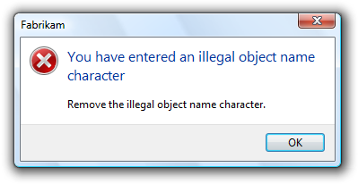
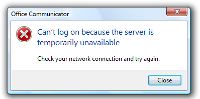
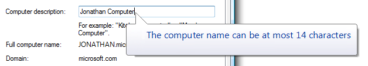
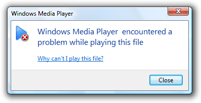
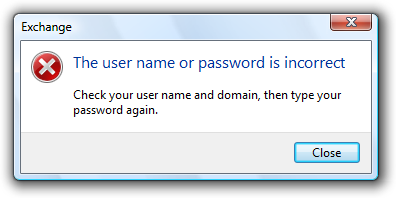
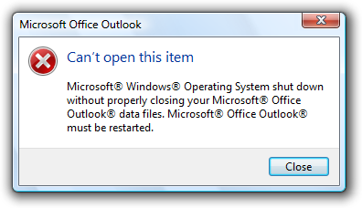
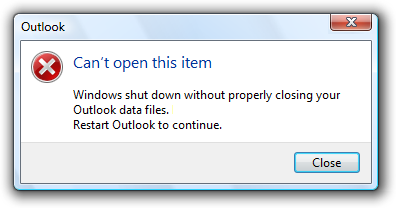
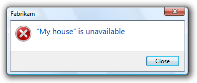

# Error Messages (Design basics)

> [!NOTE]
> This design guide was created for Windows 7 and has not been updated for newer versions of Windows. Much of the guidance still applies in principle, but the presentation and examples do not reflect our [current design guidance](/windows/uwp/design/).

An error message alerts users of a problem that has already occurred. By contrast, a warning message alerts users of a condition that might cause a problem in the future. Error messages can be presented using modal dialog boxes, in-place messages, notifications, or balloons.

A typical modal error message.

Effective error messages inform users that a problem occurred, explain why it happened, and provide a solution so users can fix the problem. Users should either perform an action or change their behavior as the result of an error message.

Well-written, helpful error messages are crucial to a quality user experience. Poorly written error messages result in low product satisfaction, and are a leading cause of avoidable technical support costs. Unnecessary error messages break users' flow.

**Note:** Guidelines related to [dialog boxes](win-dialog-box.md), [warning messages](mess-warn.md), [confirmations](mess-confirm.md), [standard icons](vis-std-icons.md), [notifications](mess-notif.md), and [layout](vis-layout.md) are presented in separate articles.

## Is this the right user interface?

To decide, consider these questions:

- **Is the user interface (UI) presenting a problem that has already occurred?** If not, the message isn't an error. If the user being alerted of a condition that might cause a problem in the future, use a warning message.
- **Can the problem be prevented without causing confusion?** If so, prevent the problem instead. For example, use controls that are constrained to valid values instead of using unconstrained controls that may require error messages. Also, disable controls when clicking would result in error, as long as it's obvious why the control is disabled.
- **Can the problem be corrected automatically?** If so, handle the problem and suppress the error message.
- **Are users likely to perform an action or change their behavior as the result of the message?** If not, the condition doesn't justify interrupting the user so it's better to suppress the error.
- **Is the problem relevant when users are actively using other programs?** If so, consider showing the problem using a [notification area icon](winenv-notification.md).
- **Is the problem not related to the current user activity, does it not require immediate user action, and can users freely ignore it?** If so, use an [action failure notification](mess-notif.md) instead.
- **Does the problem relate to the status of a background task within a primary window?** If so, consider showing the problem using a [status bars](ctrl-status-bars.md).
- **Are the primary target users IT professionals?** If so, consider using an alternative feedback mechanism, such as [log file](glossary.md) entries or e-mail alerts. IT professionals strongly prefer log files for non-critical information.

## Design concepts

**The characteristics of poor error messages**

It should be no surprise that there are many annoying, unhelpful, and poorly written error messages. And because error messages are often presented using modal dialogs, they interrupt the user's current activity and demand to be acknowledged before allowing the user to continue.

Part of the problem is that there are so many ways to do it wrong. Consider these examples from the Error Message Hall of Shame:

**Unnecessary error messages**

**Incorrect:**

This example from Windows XP might be the worst error message ever. It indicates that a program couldn't launch because Windows itself is in the process of shutting down. There is nothing the user can do about this or even wants to do about this (the user chose to shut Windows down, after all). And by displaying this error message, Windows prevents itself from shutting down!

**The problem:** The error message itself is the problem. Aside from dismissing the error message, there is nothing for users to do.

**Leading cause:** Reporting all error cases, regardless of users' goals or point of view.

**Recommended alternative:** Don't report errors that users don't care about.

**"Success" error messages**

**Incorrect:**

This error message resulted from the user choosing not to restart Windows immediately after program removal. The program removal was successful from the user's point of view.

**The problem:** There's no error from the user's point of view. Aside from dismissing the error message, there is nothing for users to do.

**Leading cause:** The task completed successfully from the user's point of view, but failed from the uninstall program's point of view.

**Recommended alternative:** Don't report errors for conditions that users consider acceptable.

**Completely useless error messages**

**Incorrect:**

Users learn that there was an error, but have no idea what the error was or what to do about it. And no, it's not OK!

**The problem:** The error message doesn't give a specific problem and there is nothing users can do about it.

**Leading cause:** Most likely, the program has poor error handling.

**Recommended alternative:** Design good error handling into the program.

**Incomprehensible error messages**

**Incorrect:**

In this example, the problem statement is clear, but the supplemental explanation is utterly baffling.

**The problem:** The problem statement or solution is incomprehensible.

**Leading cause:** Explaining the problem from the code's point of view instead of the user's.

**Recommended alternative:** Write error message text that your target users can easily understand. Provide solutions that users can actually perform. Design your program's error message experience don't have programmers compose error messages on the spot.

**Error messages that overcommunicate**

**Incorrect:**

In this example, the error message apparently attempts to explain every troubleshooting step.

**The problem:** Too much information.

**Leading cause:** Giving too many details or trying to explain a complicated troubleshooting process within an error message.

**Recommended alternative:** Avoid unnecessary details. Also, avoid troubleshooters. If a troubleshooter is necessary, focus on the most likely solutions and explain the remainder by linking to the appropriate topic in Help.

**Unnecessarily harsh error messages**

**Incorrect:**

The program's inability to find an object hardly sounds catastrophic. And assuming it is catastrophic, why is OK the response?

**The problem:** The program's tone is unnecessarily harsh or dramatic.

**Leading cause:** The problem is due to a bug that appears catastrophic from the program's point of view.

**Recommended alternative:** Choose language carefully based on the user's point of view.

**Error messages that blame users**

**Incorrect:**

Why make users feel like a criminal?

**The problem:** The error message is phrased in a way that accuses the user of making an error.

**Leading cause:** Insensitive phrasing that focuses on the user's behavior instead of the problem.

**Recommended alternative:** Focus on the problem, not the user action that led to the problem, using the passive voice as necessary.

**Silly error messages**

**Incorrect:**

In this example, the problem statement is quite ironic and no solutions are provided.

**The problem:** Error message statements that are silly or non-sequitors.

**Leading cause:** Creating error messages without paying attention to their context.

**Recommended alternative:** Have your error messages crafted and reviewed by a writer. Consider the context and the user's state of mind when reviewing the errors.

**Programmer error messages**

**Incorrect:**

In this example, the error message indicates that there is a bug in the program. This error message has meaning only to the programmer.

**The problem:** Messages intended to help the program's developers find bugs are left in the release version of the program. These error messages have no meaning or value to users.

**Leading cause:** Programmers using normal UI to make messages to themselves.

**Recommended alternative:** Developers must conditionally compile all such messages so that they are automatically removed from the release version of a product. Don't waste time trying to make errors like this comprehensible to users because their only audience is the programmers.

**Poorly presented error messages**

**Incorrect:**

This example has many common presentation mistakes.

**The problem:** Getting all the details wrong in the error message presentation.

**Leading cause:** Not knowing and applying the error message guidelines. Not using writers and editors to create and review the error messages.

The nature of error handling is such that many of these mistakes are very easy to make. It's disturbing to realize that most error messages could be nominees for the Hall of Shame.

**The characteristics of good error messages**

In contrast to the previous bad examples, good error messages have:

- **A problem.** States that a problem occurred.
- **A cause.** Explains why the problem occurred.
- **A solution.** Provides a solution so that users can fix the problem.

Additionally, good error messages are presented in a way that is:

- **Relevant.** The message presents a problem that users care about.
- **Actionable.** Users should either perform an action or change their behavior as the result of the message.
- **User-centered.** The message describes the problem in terms of target user actions or goals, not in terms of what the code is unhappy with.
- **Brief.** The message is as short as possible, but no shorter.
- **Clear.** The message uses plain language so that the target users can easily understand problem and solution.
- **Specific.** The message describes the problem using specific language, giving specific names, locations, and values of the objects involved.
- **Courteous.** Users shouldn't be blamed or made to feel stupid.
- **Rare.** Displayed infrequently. Frequently displayed error messages are a sign of bad design.

By designing your error handling experience to have these characteristics, you can keep your program's error messages out of the Error Message Hall of Shame.

**Avoiding unnecessary error messages**

Often the best error message is no error message. Many errors can be avoided through better design, and there are often better alternatives to error messages. It's usually better to prevent an error than to report one.

The most obvious error messages to avoid are those that aren't actionable. If users are likely to dismiss the message without doing or changing anything, omit the error message.

Some error messages can be eliminated because they aren't problems from the user's point of view. For example, suppose the user tried to delete a file that is already in the process of being deleted. While this might be an unexpected case from the code's point of view, users don't consider this an error because their desired outcome is achieved.

**Incorrect:**

This error message should be eliminated because the action was successful from the user's point of view.

For another example, suppose the user explicitly cancels a task. For the user's point of view, the following condition isn't an error.

**Incorrect:**

This error message should also be eliminated because the action was successful from the user's point of view.

Sometimes error messages can be eliminated by focusing on users' goals instead of the technology. In doing so, reconsider what an error really is. Is the problem with the user's goals, or with your program's ability to satisfy them? If the user's action makes sense in the real world, it should make sense in software too.

For example, suppose within an e-commerce program a user tries to find a product using search, but the literal search query has no matches and the desired product is out of stock. Technically, this is an error, but instead of giving an error message, the program could:

- Continue to search for products that most closely match the query.
- If the search has obvious mistakes, automatically recommend a corrected query.
- Automatically handle common problems such as misspellings, alternative spellings, and mismatching pluralization and verb cases.
- Indicate when the product will be in stock.

As long as the user's request is reasonable, a well designed e-commerce program should return reasonable results not errors.

Another great way to avoid error messages is by preventing problems in the first place. You can prevent errors by:

- **Using constrained controls.** Use controls that are constrained to valid values. Controls like lists, sliders, check boxes, radio buttons, and date and time pickers are constrained to valid values, whereas text boxes are often not and may require error messages. However, you can constrain text boxes to accept only certain characters and accept a maximum number of characters.
- **Using constrained interactions.** For drag operations, allow users to drop only on valid targets.
- **Using disabled controls and menu items.** Disable controls and menu items when users can easily deduce why the control or menu item is disabled.
- **Providing good default values.** Users are less likely to make input errors if they can accept the default values. Even if users decide to change the value, the default value lets users know the expected input format.
- **Making things just work.** Users are less likely to make mistakes if the tasks are unnecessary or performed automatically for them. Or if users make small mistakes but their intention is clear, the problem is fixed automatically. For example, you can automatically correct minor formatting problems.

**Providing necessary error messages**

Sometimes you really do need to provide an error message. Users make mistakes, networks and devices stop working, objects can't be found or modified, tasks can't be completed, and programs have bugs. Ideally, these problems would happen less often for example, we can design our software to prevent many types of user mistakes but it isn't realistic to prevent all of these problems. And when one of these problems does happen, a helpful error message gets users back on their feet quickly.

A common belief is that error messages are the worst user experience and should be avoided at all costs, but it is more accurate to say that user confusion is the worst experience and should be avoided at all costs. Sometimes that cost is a helpful error message.

Consider disabled controls. Most of the time, it is obvious why a control is disabled, so disabling the control is a great way to avoid an error message. However, what if the reason a control is disabled isn't obvious? The user can't proceed and there is no feedback to determine the problem. Now the user is stuck and either has to deduce the problem or get technical support. In such cases, it's much better to leave the control enabled and give a helpful error message instead.

**Incorrect:**

Why is the Next button disabled here? Better to leave it enabled and avoid user confusion by giving a helpful error message.

If you aren't sure whether you should give an error message, start by composing the error message that you might give. If users are likely either to perform an action or to change their behavior as a result, provide the error message. By contrast, if users are likely to dismiss the message without doing or changing anything, omit the error message.

**Designing for good error handling**

While crafting good error message text can be challenging, sometimes it is impossible without good error handling support from the program. Consider this error message:

**Incorrect:**

Chances are, the problem really is unknown because the program's error handling support is lacking.

While it's possible that this is a very poorly written error message, it more likely reflects the lack of good error handling by the underlying code there is no specific information known about the problem.

In order to create specific, actionable, user-centered error messages, your program's error handling code must provide specific, high-level error information:

- Each problem should have a unique error code assigned.
- If a problem has several causes, the program should determine the specific cause whenever possible.
- If the problem has parameters, the parameters must be maintained.
- Low-level problems must be handled at a sufficiently high level so that the error message can be presented from the user's point of view.

Good error messages aren't just a UI problem, they are a software design problem. A good error message experience isn't something that can be tacked on later.

**Troubleshooting (and how to avoid it)**

Troubleshooting results when a problem with several different causes is reported with a single error message.

**Incorrect:**

**Correct:**

Troubleshooting results when several problems are reported with a single error message.

In the following example, an item couldn't be moved because it was already moved or deleted, or access was denied. If the program can easily determine the cause, why put the burden on the user to determine the specific cause?

**Incorrect:**

Well, which is it? Now the user has to troubleshoot.

The program can determine if access was denied, so this problem should be reported with a specific error message.

**Correct:**

With a specific cause, no troubleshooting is required.

Use messages with multiple causes only when the specific cause cannot be determined. In this example, it would be difficult for the program to determine if the item was moved or deleted, so a single error message with multiple causes might be used here. However, it's unlikely that users are going to care if, for example, they couldn't move a deleted file. For these causes, the error message isn't even necessary.

**Handling unknown errors**

In some cases, you genuinely won't know the problem, cause, or the solution. If it would be unwise to suppress the error, it is better to be up front about the lack of information than to present problems, causes, or solutions that might not be right.

For example, if your program has an unhandled exception, the following error message is suitable:

If you can't suppress an unknown error, it is better to be up front about the lack of information.

On the other hand, do provide specific, actionable information if it is likely to be helpful most of the time.

This error message is suitable for an unknown error if network connectivity is usually the problem.

**Determine the appropriate message type**

Some issues can be presented as an error, warning, or information, depending on the emphasis and phrasing. For example, suppose a Web page cannot load an unsigned ActiveX control based on the current Windows Internet Explorer configuration:

- **Error.** "This page cannot load an unsigned ActiveX control." (Phrased as an existing problem.)
- **Warning.** "This page might not behave as expected because Windows Internet Explorer isn't configured to load unsigned ActiveX controls." or "Allow this page to install an unsigned ActiveX Control? Doing so from untrusted sources may harm your computer." (Both phrased as conditions that may cause future problems.)
- **Information.** "You have configured Windows Internet Explorer to block unsigned ActiveX controls." (Phrased as a statement of fact.)

**To determine the appropriate message type, focus on the most important aspect of the issue that users need to know or act upon.** Typically, if an issue blocks the user from proceeding, you should present it as an error; if the user can proceed, present it as a warning. Craft the [main instruction](text-ui.md) or other corresponding text based on that focus, then choose an icon ([standard](vis-std-icons.md) or otherwise) that matches the text. The main instruction text and icons should always match.

**Error message presentation**

Most error messages in Windows programs are presented using modal dialog boxes (as are most examples in this article), but there are other options:

- In-place
- Balloons
- Notifications
- Notification area icons
- Status bars
- Log files (for errors targeted at IT professionals)

Putting error messages in modal dialog boxes has the benefit of demanding the user's immediate attention and acknowledgement. However, this is also their primary drawback if that attention isn't necessary.

Do you really need to interrupt users so that they can click the Close button? If not, consider alternatives to using a modal dialog box.

Modal dialogs are a great choice when the user must acknowledge the problem immediately before continuing, but often a poor choice otherwise. Generally, you should prefer to use the lightest weight presentation that does the job well.

**Avoid overcommunicating**

Generally, [users don't read, they scan](vis-layout.md). The more text there is, the harder the text is to scan, and the more likely users won't read the text at all. As a result, it is important to reduce the text down to its essentials, and use progressive disclosure and Help links when necessary to provide additional information.

There are many extreme examples, but let's look at one more typical. The following example has most of the attributes of a good error message, but its text isn't concise and requires motivation to read.

**Incorrect:**

This example is a good error message, but it overcommunicates.

What is all this text really saying? Something like this:

**Correct:**

This error message has essentially the same information, but is far more concise.

By using Help to provide the details, this error message has an [inverted pyramid style](text-ui.md) of presentation.

For more guidelines and examples on overcommunicating, see [User Interface Text](text-ui.md).

**If you do only eight things**

1. Design your program for error handling.
2. Don't give unnecessary error messages.
3. Avoid user confusion by giving necessary error messages.
4. Make sure the error message gives a problem, cause, and solution.
5. Make sure the error message is relevant, actionable, brief, clear, specific, courteous, and rare.
6. Design error messages from the user's point of view, not the program's point of view.
7. Avoid involving the user in troubleshooting use a different error message for each detectable cause.
8. Use the lightest weight presentation method that does the job well.

**Usage patterns**

Error messages have several usage patterns:

| 
|
| <strong>System problems</strong>  The operating system, hardware device, network, or program has failed or is not in the state required to perform a task.   | Many system problems can be solved by the user:  <ul><li>Device problems can be solved by turning the device on, reconnecting the device, and inserting media.</li><li>Network problems can be solved by checking the physical network connect, and running <strong>Network diagnose and repair</strong>.</li><li>Program problems can be solved by changing program options or restarting the program.</li></ul>  In this example, the program can't find a camera to perform a user task.   In this example, a feature required to perform a task needs to be turned on.  | 
| <strong>File problems</strong>  A file or folder required for a task initiated by the user was not found, is already in use, or doesn't have the expected format.   |   In this example, the file or folder can't be deleted because it wasn't found.   In this example, the program doesn't support the given file format.  | 
| <strong>Security problems</strong>  The user doesn't have permission to access a resource, or sufficient privilege to perform a task initiated by the user.   |   In this example, the user doesn't have permission to access a resource.   In this example, the user doesn't have the privilege to perform a task.  | 
| <strong>Task problems</strong>  There is a specific problem performing a task initiated by the user (other than a system, file not found, file format, or security problem).   |   In this example, the Clipboard data can't be pasted into Paint.   In this example, the user can't install a software upgrade.  | 
| <strong>User input problems</strong>  The user entered a value that is incorrect or inconsistent with other user input.   |   In this example, the user entered an incorrect time value.   In this example, user input is not in the correct format.  | 

## Guidelines

### Presentation

- **Use task dialogs whenever appropriate** to achieve a consistent look and layout. Task dialogs require Windows Vista or later, so they aren't suitable for earlier versions of Windows. If you must use a message box, separate the main instruction from the supplemental instruction with two line breaks.

### User input errors

- **Whenever possible, prevent or reduce user input errors by:**
  - Using controls that are constrained to valid values.
  - Disabling controls and menu items when clicking would result in error, as long as it's obvious why the control or menu item is disabled.
  - Providing good default values.

**Incorrect:**

In this example, an unconstrained text box is used for constrained input. Use a slider instead.

- **Use modeless error handling (in-place errors or balloons) for contextual user input problems.**
- **Use balloons for non-critical, single-point user input problems detected while in a text box or immediately after a text box loses focus.**[Balloons](https://msdn.microsoft.com/library/windows/desktop/aa511451.aspx) don't require available screen space or the dynamic layout that is required to display in-place messages. Display only a single balloon at a time. Because the problem isn't critical, no error icon is necessary. Balloons go away when clicked, when the problem is resolved, or after a timeout.

In this example, a balloon indicates an input problem while still in the control.

- **Use in-place errors for delayed error detection,** usually errors found by clicking a commit button. (Don't use [in-place errors](glossary.md) for settings that are immediately committed.) There can be multiple in-place errors at a time. Use normal text and a 16x16 pixel error icon, placing them directly next to the problem whenever possible. In-place errors don't go away unless the user commits and no other errors are found.

In this example, an in-place error is used for an error found by clicking the commit button.

- **Use modal error handling (task dialogs or message boxes) for all other problems,** including errors that involve multiple controls or are non-contextual or non-input errors found by clicking a commit button.
- **When a user input problem is reported, set input focus to the first control with the incorrect data.** Scroll the control into view if necessary. If the control is a text box, select the entire contents. It should always be obvious what the error message is referring to.
- **Don't clear incorrect input.** Instead, leave it so that the user can see and correct the problem without starting over.
  - **Exception:** Clear incorrect password and PIN text boxes because users can't correct masked input effectively.

### Troubleshooting

- **Avoid creating troubleshooting problems.** Don't rely on a single error message to report a problem with several different detectable causes.
- **Use a different error message (typically a different supplemental instruction) for each detectable cause.** For example, if a file cannot be opened for several reasons, provide a separate supplemental instruction for each reason.
- **Use a message with multiple causes only when the specific cause can't be determined.** In this case, present the solutions in order of likelihood of fixing the problem. Doing so helps users solve the problem more efficiently.

### Icons

- **Modal error message dialogs don't have title bar icons.** Title bar icons are used as a visual distinction between primary windows and secondary windows.
- **Use an error icon.** Exceptions:
  - If the error is a user input problem displayed using a modal dialog box or balloon, don't use an icon. Doing so is counter to the encouraging tone of Windows. However, in-place error messages should use a small error icon (16x16 pixel) to clearly identify them as error messages.

     

     

     In these examples, user input problems don't need error icons.

     

     In this example, an in-place error message needs a small error icon to clearly identify it as an error message.

- If the problem is for a feature that has an icon (and not a user input problem), you can use the feature icon with an error overlay. If you do this, also use the feature name as the error's subject.

    

    In this example, the feature icon has an error overlay, and the feature is the subject of the error.

- **Don't use warning icons for errors.** This is often done to make the presentation feel less severe. Errors aren't warnings.

    **Incorrect:**

    

    In this example, a warning icon is incorrectly used to make the error feel less severe.

For more guidelines and examples, see [Standard Icons](vis-std-icons.md).

### Progressive disclosure

- **Use a Show/Hide details progressive disclosure button to hide advanced or detailed information in an error message.** Doing so simplifies the error message for typical usage. Don't hide needed information, because users might not find it.

In this example, the progressive disclosure button helps users drill down to more detail if they want it, or simplify the UI if they don't.

- **Don't use Show/Hide details unless there really is more detail.** Don't just restate the existing information in a more verbose format.
- **Don't use Show/Hide details to show Help information.** Use Help links instead.

For labeling guidelines, see [Progressive Disclosure Controls](ctrl-progressive-disclosure-controls.md).

**Don't show this message again**

- **If an error message needs this option, reconsider the error and its frequency.** If it has all the characteristics of a good error (relevant, actionable, and infrequent), it shouldn't make sense for users to suppress it.

For more guidelines, see [Dialog Boxes](win-dialog-box.md).

### Default values

- **Select the safest, least destructive, or most secure response to be the default.** If safety isn't a factor, select the most likely or convenient command.

### Help

- **Design error messages to avoid the need for Help.** Ordinarily users shouldn't have to read external text to understand and solve the problem, unless the solution requires several steps.
- **Make sure the Help content is relevant and helpful.** It shouldn't be a verbose restatement of the error message rather, it should contain useful information that is beyond the scope of the error message, such as ways to avoid the problem in the future. Don't provide a Help link just because you can.
- **Use specific, concise, relevant Help links to access Help content.** Don't use command buttons or progressive disclosure for this purpose.
- **For error messages that you can't make specific and actionable, consider providing links to online Help content.** By doing so, you can provide users with additional information that you can update after the program is released.

For more guidelines, see [Help](winenv-help.md).

### Error codes

- **For error messages that you can't make specific and actionable or they benefit from Help, consider also providing error codes.** Users often use these error codes to search the Internet for additional information.
- **Always provide a text description of the problem and solution.** Don't depend just on the error code for this purpose.

**Incorrect:**

In this example, an error code is used as a substitute for a solution text.

- **Assign a unique error code for each different cause.** Doing so avoids troubleshooting.
- **Choose error codes that are easily searchable on the Internet.** If you use 32-bit codes, use a hexadecimal representation with a leading "0x" and uppercase characters.

**Correct:**

1234

0xC0001234

**Incorrect:**

-1

-67113524

- **Use Show/Hide details to display error codes.** Phrase as Error code: <error code>.

In this example, an error code is used to supplement an error message that can benefit from further information.

### Sound

- **Don't accompany error messages with a sound effect or beep.** Doing so is jarring and unnecessary.
  - **Exception:** Play the Critical Stop sound effect if the problem is critical to the operation of the computer, and the user must take immediate action to prevent serious consequences.

## Text

**General**

- **Remove redundant text.** Look for it in titles, main instructions, supplemental instructions, command links, and commit buttons. Generally, leave full text in instructions and interactive controls, and remove any redundancy from the other places.
- **Use user-centered explanations.** Describe the problem in terms of user actions or goals, not in terms of what the software is unhappy with. Use language that the target users understand and use. Avoid technical jargon.

**Incorrect:**

**Correct:**

In these examples, the correct version speaks the user's language whereas the incorrect version is overly technical.

- **Don't use the following words:**
  - Error, failure (use problem instead)
  - Failed to (use unable to instead)
  - Illegal, invalid, bad (use incorrect instead)
  - Abort, kill, terminate (use stop instead)
  - Catastrophic, fatal (use serious instead)

These terms are unnecessary and contrary to the encouraging tone of Windows. When [used correctly](vis-std-icons.md), the error icon sufficiently communicates that there is a problem.

**Incorrect:**

**Correct:**

In the incorrect example, the terms "catastrophic" and "failure" are unnecessary.

- Don't use phrasing that blames the user or implies user error. Avoid using you and your in the phrasing. While the active voice is generally preferred, use the passive voice when the user is the subject and might feel blamed for the error if the active voice were used.

**Incorrect:**

**Correct:**

The incorrect example blames the user by using the active voice.

- **Be specific.** Avoid vague wording, such as syntax error and illegal operation. Provide specific names, locations, and values of the objects involved.

**Incorrect:**

File not found.

Disk is full.

Value out of range.

Character is invalid.

Device not available.

These problems would be much easier to solve with specific names, locations, and values.

- **Don't give possibly unlikely problems, causes, or solutions in an attempt to be specific.** Don't provide a problem, cause, or solution unless it is likely to be right. For example, it is better to say An unknown error occurred than something that is likely to be inaccurate.
- **Avoid the word "please,"** except in situations in which the user is asked to do something inconvenient (such as waiting) or the software is to blame for the situation.

**Correct:**

Please wait while Windows copies the files to your computer.

- **Use the word "sorry" only in error messages that result in serious problems for the user** (for example, data loss or inability to use the computer). Don't apologize if the issue occurred during the normal functioning of the program (for example, if the user needs to wait for a network connection to be found).

**Correct:**

We're sorry, but Fabrikam Backup detected an unrecoverable problem and was shut down to protect files on your computer.

- **Refer to products using their short names.** Don't use full product names or trademark symbols. Don't include the company name unless users associate the company name with the product. Don't include program version numbers.

**Incorrect:**

**Correct:**

In the incorrect example, full product names and trademark symbols are used.

- **Use double quotation marks around object names.** Doing so makes the text easier to parse and avoids potentially embarrassing statements.
  - **Exception:** Fully qualified file paths, URLs, and domain names don't need to be in double quotation marks.

**Correct:**

In this example, the error message would be confusing if the object name weren't in quotation marks.

- **Avoid starting sentences with object names.** Doing so is often difficult to parse.
- **Don't use exclamation marks or words with all capital letters.** Exclamation marks and capital letters make it feel like you are shouting at the user.

For more guidelines and examples, see [Style and Tone](text-style-tone.md).

**Titles**

- **Use the title to identify the command or feature from which the error originated.** Exceptions:
  - If an error is displayed by many different commands, consider using the program name instead.
  - If that title would be redundant or confusing with the main instruction, use the program name instead.
- **Don't use the title to explain or summarize the problem** that's the purpose of the main instruction.

**Incorrect:**

In this example, the title is being incorrectly used to explain the problem.

- Use title-style capitalization, without ending punctuation.

**Main instructions**

- **Use the main instruction to describe the problem in clear, plain, specific language.**
- **Be concise use only a single, complete sentence.** Pare the main instruction down to the essential information. You can leave the subject implicit if it is your program or the user. Include the reason for the problem if you can do so concisely. If you must explain anything more, use a supplemental instruction.

**Incorrect:**

In this example, the entire error message is put in the main instruction, making it hard to read.

- **Be specific if there are objects involved, give their names.**
- **Avoid putting full file paths and URLs in the main instruction.** Rather, use a short name (such as the file name) and put the full name (such as the file path) in the supplemental instruction. However, you can put a single full file path or URL in the main instruction if the error message doesn't otherwise need a supplemental instruction.

In this example, only the file name is in the main instruction. The full path is in the supplemental instruction.

- **Don't give the full file path and URL at all if it's obvious from the context.**

In this example, the user is renaming a file from Windows Explorer. In this case, the full file path isn't needed because it's obvious from the context.

- Use present tense whenever possible.
- Use sentence-style capitalization.
- Don't include final periods if the instruction is a statement. If the instruction is a question, include a final question mark.

**Main instruction templates**

While there are no strict rules for phrasing, try using the following main instruction templates whenever possible:

- [optional subject name] can't [perform action]
- [optional subject name] can't [perform action] because [reason]
- [optional subject name] can't [perform action] to "[object name]"
- [optional subject name] can't [perform action] to "[object name]" because [reason]
- There is not enough [resource] to [perform action]
- [Subject name] doesn't have a [object name] required for [purpose]
- [Device or setting] is turned off so that [undesired results]
- [Device or setting] isn't [available \| found \| turned on \| enabled]
- "[object name]" is currently unavailable
- The user name or password is incorrect
- You don't have permission to access "[object name]"
- You don't have privilege to [perform action]
- [program name] has experienced a serious problem and must close immediately

Of course, make changes as needed for the main instruction to be grammatically correct and comply with the main instruction guidelines.

**Supplemental instructions**

- Use the supplemental instruction to:
  - Give additional details about the problem.
  - Explain the cause of the problem.
  - List steps the user can take to fix the problem.
  - Provide measures to prevent the problem from reoccurring.
- **Whenever possible, propose a practical, helpful solution so users can fix the problem.** However, make sure the proposed solution is likely to solve the problem. Don't waste users' time by suggesting possible, but improbable, solutions.

**Incorrect:**

In this example, while the problem and its recommended solution are possible, they are very unlikely.

- **If the problem is an incorrect value that the user entered, use the supplemental instruction to explain the correct values.** Users shouldn't have to determine this information from another source.
- **Don't provide a solution if it can be trivially deduced from the problem statement.**

In this example, no supplemental instruction is necessary; the solution can be trivially deduced from the problem statement.

- **If the solution has multiple steps, present the steps in the order in which they should be completed.** However, avoid multi-step solutions because users have difficulty remembering more than two or three simple steps. If more steps are required, refer to the appropriate Help topic.
- **Keep supplemental instructions concise.** Provide only what users need to know. Omit unnecessary details. Aim for a maximum of three sentences of moderate length.
- **To avoid mistakes while users perform instructions, put the results before the action.**

**Correct:**

To restart Windows, click OK.

**Incorrect:**

Click OK to restart Windows.

In the incorrect example, users are more likely to click OK by accident.

- **Don't recommend contacting an administrator unless doing so is among the most likely solutions to the problem.** Reserve such solutions for problems that really can only be solved by an administrator.

**Incorrect:**

In this example, most likely the problem is with the user's network connection, so it's not worth contacting an administrator.

- **Don't recommend contacting technical support.** The option to contact technical support to solve a problem is always available, and doesn't need to be promoted through error messages. Instead, focus on writing helpful error messages so that users can solve problems without contacting technical support.

**Incorrect:**

In this example, the error message incorrectly recommends contacting technical support.

- Use complete sentences, sentence-style capitalization, and ending punctuation.

**Commit buttons**

- If the error message provides command buttons or command links that solve the problem, follow their respective guidelines in [Dialog Boxes](win-dialog-box.md).
- If the program must terminate as a result of the error, provide an Exit program button. To avoid confusion, don't use Close for this purpose.
- Otherwise, provide a Close button. Don't use OK for error messages, because this wording implies that problems are OK.
  - **Exception:** Use OK if your error reporting mechanism has fixed labels (as with the MessageBox API.)

## Documentation

When referring to errors:

- Refer to errors by their main instruction. If the main instruction is long or detailed, summarize it.
- If necessary, you may refer to an error message dialog box as a message. Refer to as an error message only in programming and other technical documentation.
- When possible, format the text using bold. Otherwise, put the text in quotation marks only if required to prevent confusion.

**Example:** If you receive a **There is no CD disc in the drive** message, insert a new CD disc in the drive and try again.
