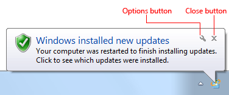
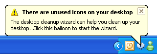
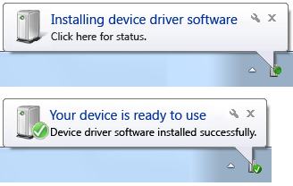

# Notifications (Design basics)

> [!NOTE]
> This design guide was created for Windows 7 and has not been updated for newer versions of Windows. Much of the guidance still applies in principle, but the presentation and examples do not reflect our [current design guidance](/windows/uwp/design/).

A notification informs users of events that are unrelated to the current user activity, by briefly displaying a balloon from an icon in the notification area. The notification could result from a user action or significant system event, or could offer potentially useful information from Microsoft Windows or an application.

The information in a notification is **useful and relevant, but never critical.** Consequently, notifications don't require immediate user action and users can freely ignore them.

A typical notification.

In Windows Vista and later, notifications are displayed for a fixed duration of 9 seconds. Notifications aren't displayed immediately when users are inactive or screen savers are running. Windows automatically queues notifications during these times, and displays the queued notifications when the user resumes regular activity. Consequently, you don't have to do anything to handle these special circumstances.

**Developers:** You can determine when the user is active using the SHQueryUserNotificationState API.

**Note:** Guidelines related to [notification area](winenv-notification.md), [taskbar](winenv-taskbar.md), and [balloons](ctrl-balloons.md) are presented in separate articles.

## Is this the right user interface?

To decide, consider these questions:

-   **Is the information the immediate, direct result of users' interaction with your application?** If so, display this synchronous information directly within your application instead using a [dialog box](win-dialog-box.md), [message box](glossary.md), [balloon](ctrl-balloons.md), or [in place](glossary.md) UI. Notifications are for asynchronous information only.

In this example, the Windows Firewall exceptions dialog box is displayed as a direct result of user interaction. A notification wouldn't be appropriate here.

-   **Is the information relevant only when users are actively using your application?** If so, display the information in your application's [status bar](ctrl-status-bars.md) or other status area.

In this example, Outlook displays its connection and synchronization state on its status bar.

-   **Is the information rapidly changing, continuous, real-time information?** Examples include processing progress, stock quotes, and sports scores. If so, don't use notifications because they aren't suitable for rapidly changing information.
-   **Is the information useful and relevant? Are users likely to change their behavior or avoid inconvenience as the result of receiving the information?** If not, either don't display the information or put it in a status window or log file.
-   **Is the information critical? Is immediate action required?** If so, display the information using an interface that demands attention and cannot be easily ignored, such as a modal dialog box or message box. If the program isn't active, you can draw attention to the critical information by [flashing the program's taskbar button](winenv-taskbar.md) three times and leaving it highlighted until the program is active.
-   **Are the primary target users IT professionals?** If so, use an alternative feedback mechanism such as [log file](glossary.md) entries or e-mail messages. IT professionals strongly prefer log files for non-critical information. Furthermore, servers are often managed remotely and typically run without any users logged on, making notifications ineffective.

## Design concepts

Effective notifications that promote a good user experience are:

-   **Asynchronous.** The event is not an immediate, direct result of users' current interaction with Microsoft Windows or your application.
-   **Useful.** There is a reasonable chance that users will perform a task or change their behavior as the result of the notification.
-   **Relevant.** The notification displays helpful information that users care about and don't already know.
-   **Not critical.** Notifications aren't modal and don't require user interaction, so users can freely ignore them.
-   **Actionable.** For those notifications that suggest performing an action, that action is initiated by clicking on the notification. However, the action can always be postponed.
-   **Appropriately presented.** The notification's presentation (duration, frequency, text, icon, and interactivity) matches its circumstances.
-   **Not annoying!** There is a fine line between gently informing users of an event and pestering them.

Unfortunately, there are too many annoying, inappropriate, useless, irrelevant notifications out there. Consider these notifications from the Windows XP Hall of Shame:

In these examples, Windows XP is ostensibly attempting to assist users with their initial configuration. However, these notifications pop up far too often and well after they are useful, so they are little more than unsolicited feature advertisements.

## User flow must be maintained

**Ideally, users immersed in their work won't see your notifications at all. Rather, they'll see your notifications only when their flow is already broken.**

In Flow: The Psychology of Optimal Experience, Mihaly Csikszentmihalyi says that users enter a flow state when they are fully absorbed in activity during which they lose their sense of time and have feelings of great satisfaction.

**Effective notifications help users maintain their flow by presenting useful, relevant information that can easily be ignored.** The notifications are presented in a low-key, peripheral way, and they don't require interaction.

Don't assume that if notifications are [modeless](glossary.md) a they can't be an annoying interruption. Notifications don't demand users' attention, but they certainly request it. You can break users flow by:

-   Displaying notifications that users don't care about.
-   Displaying a notification too often.
-   Using several notifications when a single notification is sufficient.
-   Using sound when displaying a notification.

In Windows 7, users have ultimate control over notifications. **If users find that a program's notifications are too annoying, they can choose to suppress all notifications from that program.** Make sure users don't do this to your program by presenting useful, relevant information and following these guidelines.

## Notifications must be ignorable

**Notifications don't require immediate user action and users can freely ignore them.**

Developers and designers often want to present their notifications in a way that users can't ignore. This goal completely undermines the primary benefit of notifications because it would break users' flow. If users are distracted by your notifications or feel obligated to read them, your notification design has failed.

**If you are concerned that users are ignoring your notifications, consider the following:**

-   If you are using notifications correctly and they don't require immediate user action, then having users choose to ignore them is by design. Don't change this.
-   If the event requires immediate user action, use an alternative user interface (UI) that users cannot ignore. See Is this the right user interface? for the alternatives.

## Use progressive escalation where applicable

If a notification is used for an event that users can safely ignore at first, but that must addressed eventually, an alternative UI should be used when the situation becomes critical. This technique is known as progressive escalation.

For example, the Windows power management system initially indicates a low battery by simply changing its notification area icon.

In these examples, Windows power management uses the notification area icon to notify users of progressively lower battery power.

As the battery power becomes lower, Windows warns users of weak battery power using a notification.

In this example, Windows power management uses a notification to tell users that their battery power is weak.

This notification appears while users still have several options. Users can plug in, change their power options, wrap up their work and shut down the computer, or ignore the notification and continue working. As the battery power continues to drain, the notification's text and icon reflect the additional urgency. However, once the battery power becomes so low that users must act immediately, Windows power management notifies users using a [modal](glossary.md) message box.

In this example, Windows power management uses a modal message box to notify users of critically low battery power.

**If you do only three things...**

1.  Use notifications only if you really need to. When you display a notification, you are potentially interrupting users or even annoying them. Make sure that interruption is justified.
2.  Use notifications for non-critical events or situations that don't require immediate user action. For critical events or situations that require immediate user action, use an alternative UI (such as a modal dialog box).
3.  If you use notifications, make it a good user experience. Don't try to force users to see your notifications. If users are so immersed in their work that they don't see your notifications, your design is good.

## Usage patterns

Notifications have several usage patterns:

| Label | Value |
|--------|-------|
| <strong>Action success</strong>  Notifies users when an asynchronous, user initiated action completes successfully.   | <strong>Correct:</strong>   In this example, Windows Update notifies users when their computer has been updated successfully. <strong>Incorrect:</strong>   In this example, Microsoft Outlook notifies users when a data file check is complete. What are users supposed to do now? And why warn users about successful completion? <strong>Show when:</strong> Upon completion of an asynchronous task. Notify users of successful actions only if they are likely to be waiting for completion, or after recent failures. <strong>Show how:</strong> Use the real-time option so that these notifications aren't queued when users are running a full-screen application or aren't actively using their computer. <strong>Show how often:</strong> Once. <strong>Annoyance factor:</strong> Low if success isn't expected due to recent failures, success is after a critical or highly unusual failure so user needs additional feedback, or user is waiting for completion; high if not. <strong>Alternatives:</strong> Give feedback "on demand" by displaying an icon (or changing an existing icon) in the notification area while the operation is being performed; remove the icon (or restore the previous icon) when the operation is complete.   | 
| <strong>Action failure</strong>  Notifies users when an asynchronous, user initiated action fails.   | <strong>Correct:</strong>   In this example, Windows activation notifies users of failure. <strong>Incorrect:</strong>   In this example, Microsoft Outlook used to notify users of a failure that they are unlikely to care about. <strong>Show when:</strong> Upon failure of an asynchronous task. <strong>Show how often:</strong> Once. <strong>Annoyance factor:</strong> Low if useful and relevant; high if the problem will immediately resolve itself or users otherwise don't care. <strong>Alternatives:</strong> Use a modal dialog box if users must address the failure immediately.   | 
| <strong>Non-critical system event</strong>  Notifies users of significant system events or status that can be safely ignored, at least temporarily.   |   In this example, Windows warns users of low battery power, but there is still plenty of time before they have take action. <strong>Show when:</strong> When an event occurs and the user is active, or a condition continues to exist. If resulting from a problem, remove currently displayed notifications immediately once the problem is resolved. As with action notifications, notify users of successful system events only if users are likely to be waiting for the event, or after recent failures. <strong>Show how often:</strong> Once when the event first occurs. If this results from a problem that users need to solve, redisplay once a day. <strong>Annoyance factor:</strong> Low, as long as the notification isn't displayed too often. <strong>Alternatives:</strong> If users must eventually resolve a problem, use progressive escalation by ultimately displaying a modal dialog box when resolution becomes mandatory.   | 
| <strong>Optional user task</strong>  Notifies users of asynchronous tasks they should perform. Whether optional or required, the task can be safely postponed.   |   In this example, Windows Update is notifying users of a new security update. <strong>Show when:</strong> When the need to perform a task is determined and the user is active. <strong>Show how often:</strong> Once a day for a maximum of three times. <strong>Annoyance factor:</strong> Low, as long as users consider the task important and the notification isn't displayed too often. <strong>Alternatives:</strong> If users must eventually perform the task, use progressive escalation by ultimately displaying a modal dialog box when the task becomes mandatory.   | 
| <strong>FYI</strong>  Notifies users of potentially useful, relevant information. You can notify users of information of marginal relevance if it is optional and users opt in.   | <strong>Correct:</strong>   In this example, users are notified when a new e-mail message is received. <strong>Correct:</strong>   In this example, users are notified when contacts come online and they chose to receive this optional information. <strong>Incorrect:</strong>   In this example, the information is useful only if the user already has high-speed USB ports installed. Otherwise, the user isn't likely to do anything different as the result of it. <strong>Show when:</strong> When the triggering event occurs. <strong>Show how:</strong> Use the real-time option so that these notifications aren't queued when users are running a full-screen application or aren't actively using their computer. <strong>Show how often:</strong> Once. <strong>Annoyance factor:</strong> Medium to high, depending upon users' perception of usefulness and relevance. Not recommended if there is a low probability of user interest. <strong>Alternatives:</strong> Don't notify users.   | 
| <strong>Feature advertisement</strong>  Notifies users of newly installed, unused system or application features.  | <strong>Don't use notifications for feature advertisements!</strong> Instead, use another way to make the feature discoverable, such as:  <ul><li>Design the feature to be easier to discover in contexts where it is needed.</li><li>Don't do anything special and let users discover the feature on their own.</li></ul><strong>Incorrect:</strong>   Don't use notifications for feature advertisements.  | 

 

## Guidelines

### General

-   **Select the notification pattern based on its usage.** For a description of each usage pattern, see the previous table.
-   **Don't use any notifications during the initial Windows experience.** To improve its first experience, Windows 7 suppresses all notifications displayed during the first few hours of usage. Design your program assuming users won't see any such notifications.

### What to notify

-   **Don't notify of successful operations, except in the following circumstances:**
    -   **Security.** Users consider security operations to be of the highest importance, so notify users of successful security operations.
    -   **Recent failure.** Users don't take successful operations for granted if they were failing immediately before, so notify users of success when the operation was recently failing.
    -   **Prevent inconvenience.** Report successful operations when doing so might avoid inconveniencing users. Consequently, notify users when a successful operation is performed in an unexpected way, such as when an operation is lengthy or completes earlier or later than expected.
-   **In other circumstances, either give no feedback for success or give feedback "on demand."** Assume that users take successful operations for granted. You can give feedback on demand by displaying an icon (or changing an existing icon) in the notification area while the operation is being performed, and removing the icon (or restoring the previous icon) when the operation is complete.
-   For the FYI pattern, **don't give a notification if users can continue to work normally or are unlikely to do anything different as the result of the notification.**

    **Incorrect:**

    

    In this example, the information is useful only if the user already has the ports installed. Otherwise, the user isn't likely to do anything different as the result of it.

    -   Exception: **You can notify users of information of questionable relevance if it is optional and users opt in.**

        **Correct:**

        

        In this example, users are notified when contacts come online and they chose to receive this optional information.

-   For the non-critical system event and FYI patterns, **use complete notifications for a single event.** Don't present several partial ones.

    **Incorrect:**

    

    These examples show just four of the eight notifications that were displayed by Windows XP when a user attaches a specific USB keyboard, each presenting incrementally more information.

    **Correct:**

    

    In this example, attaching a USB keyboard results in two complete notifications.

### When to notify

-   **Display a notification based on its design pattern:**

| Pattern              | When to notify          |
|--------------------------------------|--------------------------------------------------------------------------------------------------------------------------------------------------------------------------------------------------------------------|
| Action success             | Upon completion of an asynchronous task. Notify users of successful actions only if they are likely to be waiting for completion, or after recent failures.                                              |
| Action failure             | Upon failure of an asynchronous task.                                                                                                                                                                    |
| Non-critical system event  | When an event occurs and the user is active, or the condition continues to exist. If this results from a problem, remove the currently displayed notification immediately once the problem is resolved.  |
| Optional user task         | When the need to perform a task is determined and the user is active.                                                                                                                                    |
| FYI                        | When the triggering event occurs.                                                                                                                                                                        |

 

-   For the action failure pattern, **if the problem might correct itself within seconds, delay the failure notification for an appropriate amount of time.** If the problem corrects itself, report nothing. Notify only after enough time has passed that the failure is noticeable. If you report too early, most likely users won't notice the problem reported, but they will notice the unnecessary notification.

**Incorrect:**

When immediately followed by:

In this example, in Windows Vista the notification of no wireless connectivity is premature because it is often immediately followed by a notification of good connectivity.

-   For the action success and FYI patterns, **use the real-time option so that stale notifications aren't queued** when users are running a full-screen application or aren't actively using their computer.
-   For the non-critical system event pattern, **don't create the potential for notification storms by staggering events tied to well-known events such as user logon.** Instead, tie the event to some time period after the event. For example, you could remind users to register your product five minutes after user logon.

### How long to notify

In Windows Vista and later, notifications are displayed for a fixed duration of 9 seconds.

### How often to notify

-   **The number of times to display a notification is based on its design pattern:**

| Pattern           | How often to notify  |
|--------------------------------------|-----------------------------------------------------------------------------------------------------------------------------|
| Action success             | Once.                                                                                                             |
| Action failure             | Once.                                                                                                             |
| Non-critical system event  | Once when the event first occurs. If this results from a problem that users need to solve, redisplay once a day.  |
| Optional user task         | Once a day for a maximum of three times.                                                                          |
| FYI                        | Once.                                                                                                             |

 

-   **For optional user tasks, don't try to pester users into submission by constantly displaying notifications.** If the task is required, display a modal dialog box immediately instead of using notifications.

### Notification escalation

-   **Don't assume that users will see your notifications.** Users won't see them when:
    -   They are immersed in their work.
    -   They aren't paying attention.
    -   They are away from their computer.
    -   They are running a full-screen application.
    -   Their administrator has turned off all notifications for their computer.
-   **If users must eventually take some kind of action, use progressive escalation** to display an alternative UI that users cannot ignore.

### Interaction

-   **Make notifications clickable when:**
    -   **Users should perform an action.** Clicking the notification should display a window in which users can perform the action. This approach is preferred for the action failure and optional user task design patterns.
    -   **Users may want to see more information.** Clicking the notification should display a window in which users can view additional information.
-   **Always display a window when users click to perform an action.** Don't have clicking perform an action directly.
-   **Clicking to show more information should always show more information.** Don't just rephrase the information already in the notification.

### Icons

-   **For the action failure pattern, use the standard error icon.**
-   **For the non-critical system event patterns, use the standard warning icon.**
-   **For other patterns, use icons showing objects that relate to or suggest the subject**, such as a shield for security or a battery for power.
-   **Use icons based on your application or company branding if your target users will recognize them and there is no better alternative.**
-   For progressive escalation, **consider using icons with a progressively more emphatic appearance as the situation becomes more urgent.**
-   **Don't use the standard information icon.** That notifications are information goes without saying.
-   **Consider using large icons (32x32 pixels) when:**
    -   Users will quickly comprehend the icon rather than the text.
    -   The large icons convey their meaning more clearly and effectively than the standard 16x16 pixel icons.
    -   The icon uses the [Aero-style](vis-icons.md).

In this example, users can quickly comprehend the nature of the notification with a glance at the large icon.

### Notification queuing

**Note:** Notifications are queued whenever they cannot be displayed immediately, such as when another notification is being displayed, the user is running a full-screen application, or the user isn't actively using the computer. Real-time notifications remain in the queue for only 60 seconds.

-   **For the action success and FYI patterns, use the real-time option** so that the notification isn't queued for long. These notifications have value only when they can be displayed immediately.
-   **Remove queued notifications when they are no longer relevant.**
-   **Developers:** You can do this by setting the NIF\_INFO flag in uFlags and set szInfo to an empty string. There is no harm in doing this if the notification is no longer in the queue.

### System integration

-   If your application doesn't always have an icon in the [notification area](winenv-notification.md) when it's running, **display an icon temporarily during the asynchronous task or event that caused the notification.**

## Text

### Title text

-   **Use title text that briefly summarizes the most important information you need to communicate to users in clear, plain, concise, specific language.** Users should be able to understand the purpose of the notification information quickly and with minimal effort.
-   **Use text fragments or complete sentences without ending punctuation.**
-   **Use sentence-style capitalization.**
-   **Use no more than 48 characters (in English) to accommodate localization.** The title has a maximum length of 63 characters, but you must allow for 30 percent expansion when the English-language text is translated.

### Body text

-   **Use body text that gives a description (without repeating the information in the title) and, optionally, that gives specific details about the notification, and also lets users know what action is available.**
-   **Use complete sentences with ending punctuation.**
-   **Use sentence-style capitalization.**
-   **Use no more than 200 characters (in English) to accommodate localization.** The body text has a maximum length of 255 characters, but you must allow for 30 percent expansion when the English-language text is translated.
-   **Include essential information in the body text, such as specific object names.** (Examples: user names, file names, or URLs.) Users shouldn't have to open another window to find such information.
-   **Put double quotation marks around object names.**
    -   **Exception:** Don't use quotation marks when:
        -   The object name always uses [title-style capitalization](glossary.md), such as with user names.
        -   The object name is offset with a colon (example: Printer name: My printer).
        -   The object name can be easily determined from the context.
-   **If you must truncate object names to a fixed maximum size to accommodate localization, use an ellipsis to indicate truncation.**

    

    In this example, an object name is truncated using an ellipsis.

-   **Use the following phrasing if the notification is actionable:**
    -   If users can click the notification to perform an action:

        < brief description of essential information>

        \<optional details\>

        Click to \<do something\>.

        

        In this example, users can click to perform an action.

    -   If users can click the notification to see more information:

        < brief description of essential information>

        \<optional details\>

        Click for more information.

        

        In this example, users can click for more information.

-   **Don't say that the user "must" perform an action in a notification.** Notifications are for non-critical information that users can freely ignore. If users really must perform an action, don't use notifications.
-   **If users should perform an action, make the importance clear.**
-   For the action failure and non-critical system event patterns, **describe problems in plain language.**

    **Incorrect:**

    

    In this example, the problem is described using overly technical, yet unspecific language.

    **Correct:**

    

    In this example, the problem is described in plain language.

-   **Describe the event in a way that is relevant to the target users.** A notification is relevant if there's a reasonable chance that users will perform a task or change their behavior as the result of the notification. You can often accomplish this by describing notifications in terms of user goals instead of technological issues.

## Documentation

When referring to notifications:

-   Use the exact title text, including its capitalization.
-   Refer to the component as a notification, not as a balloon or an alert.
-   To describe user interaction, use click.
-   When possible, format the title text using bold text. Otherwise, put the title in quotation marks only if required to prevent confusion.

Example: When the **Critical updates are ready to install** notification appears, click the notification to start the process.

When referring to the notification area:

-   Refer to the notification area as the notification area, not the system tray.

 

