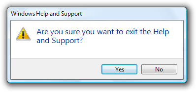
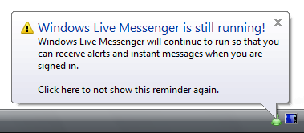
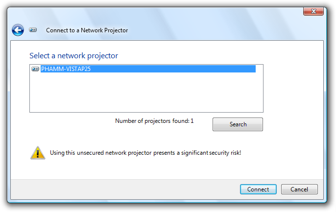
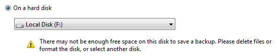
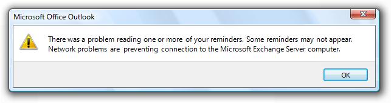

# Warning Messages

> [!NOTE]
> This design guide was created for Windows 7 and has not been updated for newer versions of Windows. Much of the guidance still applies in principle, but the presentation and examples do not reflect our [current design guidance](/windows/uwp/design/).

A warning message is a modal dialog box, in-place message, notification, or balloon that alerts the user of a condition that might cause a problem in the future.

A typical modal warning message.

The fundamental characteristic of warnings is that they involve the risk of losing one or more of the following:

-   A valuable asset, such as important financial or other data.
-   System access or integrity.
-   Privacy or control over confidential information.
-   User's time (a significant amount, such as 30 seconds or more).

By contrast, a confirmation is a modal dialog box that asks if the user wants to proceed with an action. Some types of warnings are presented as confirmations, and if so, the confirmation guidelines also apply.

**Note:** Guidelines related to [dialog boxes](win-dialog-box.md), [confirmations](mess-confirm.md), [error messages](mess-error.md)[standard icons](vis-std-icons.md), [notifications](mess-notif.md), and [layout](vis-layout.md) are presented in separate articles.

## Is this the right user interface?

To decide, consider these questions:

-   **Is the user being alerted of a condition that might cause a problem in the future?** If not, the message isn't a warning.
-   **Is the UI presenting an error or problem that has already occurred?** If so, use an error message instead.
-   **Are users likely to perform an action or change their behavior as the result of the message?** If not, the condition doesn't justify interrupting the user so it's better to suppress the warning.
-   **Is the condition the direct result of an action initiated by the user?** If not, consider using a [non-critical event notifications](mess-notif.md).
-   **Is the condition a special condition in a control?** If so, use a [balloon](ctrl-balloons.md) instead.
-   **For confirmations, is the user about to perform a risky action?** If so, a warning is appropriate if the action has significant consequences or cannot be easily undone.
-   **For other types of warnings, does the user need to act now or in the immediate future?** Don't display warnings if users can continue to work productively without immediate problems. Postpone the warning until the condition is more immediate and relevant.

## Design concepts

### Avoid overwarning

We overwarn in Microsoft Windows programs. The typical Windows program has warnings seemingly everywhere, warning about things that have little significance. In some programs, nearly every question is presented as a warning. Overwarning makes using a program feel like a hazardous activity, and it detracts from truly significant issues.

**Incorrect:**

Overwarning makes your program feel hazardous and look like it was designed by lawyers.

The mere potential for data loss or a future problem alone is insufficient to call for a warning. Additionally, any undesirable results should be unexpected or unintended, and not easily corrected. Otherwise, just about any user mistake could be construed to result in data loss or a potential problem of some kind and merit a warning.

### Characteristics of good warnings

Good warnings:

-   **Involve risk.** Good warnings alert users of something significant.

**Incorrect:**

So what? This confirmation assumes that users often exit programs by accident.

-   **Have immediate relevance.** Not only do users have to care, they have to care now. Users typically aren't interested in problems they might have later as long as they can do their work now.

**Incorrect:**

In this case, it's better just to warn the user in three hours.

-   **Lead to action.** There is something users must do or be aware of as the result of the warning. Perhaps they must take an action now or sometime in the immediate future. Perhaps they will perform a task differently as a result. The consequence of ignoring the warning should be clear. Warnings without actions just make users feel paranoid.

**Incorrect:**

Why is this notification a warning? What are users supposed to do (beside worry)?

-   **Are not obvious.** Don't display a warning to state the obvious consequence of an action. For example, assume users understand the consequences of not completing a task.

**Incorrect:**

Canceling an incomplete wizard means the task doesn't get done...who knew?

-   **Occur infrequently.** Constant warnings quickly become ineffective and annoying. Users often become more focused on getting rid of the warning than addressing the problem.

**Incorrect:**

Users are more likely to focus on getting rid of the warning than fixing the underlying problem.

A message that doesn't have these characteristics might still be a good message, just not a good warning.

### Determine the appropriate message type

Some issues can be presented as an error, warning, or information, depending on the emphasis and phrasing. For example, suppose a Web page cannot load an unsigned ActiveX control based on the current Windows Internet Explorer configuration:

-   **Error.** "This page cannot load an unsigned ActiveX control." (Phrased as an existing problem.)
-   **Warning.** "This page might not behave as expected because Windows Internet Explorer isn't configured to load unsigned ActiveX controls." or "Allow this page to install an unsigned ActiveX Control? Doing so from untrusted sources may harm your computer." (Both phrased as conditions that may cause future problems.)
-   **Information.** "You have configured Windows Internet Explorer to block unsigned ActiveX controls." (Phrased as a statement of fact.)

**To determine the appropriate message type, focus on the most important aspect of the issue that users need to know or act upon.** Typically, if an issue blocks the user from proceeding, you should present it as an error; if the user can proceed, present it as a warning. Craft the [main instruction](text-ui.md) or other corresponding text based on that focus, then choose an icon ([standard](vis-std-icons.md) or otherwise) that matches the text. The main instruction text and icons should always match.

### Be specific

Warnings are more compelling when the following information is specific and clear:

-   The source of the warning.
-   The specific condition and potential problem.
-   What the user should do about it.
-   What happens if the user doesn't do anything.

**Incorrect:**

In this example, what is the potential problem? What is the user supposed to do, aside from not using the projector over the network? Without more specific information, all the user can do is feel bad about proceeding.

**Correct:**

In this example, the problem and consequences are clear.

Sometimes there is a legitimate potential problem worthy of informing users about, but the solution and consequences aren't known for sure. Rather than give a vague warning, be specific by giving the most likely information or the most common example.

**Correct:**

In this example, the warning is made specific by providing the most likely solution.

However, in such cases, use wording that indicates that there are other possibilities. Otherwise, users might be misled.

**Incorrect:**

**Correct:**

In the incorrect example, users will be confused if the cable is clearly plugged in.

**If you do only two things...**

1. Don't overwarn. Limit warnings to conditions that involve risk and are immediately relevant, actionable, not obvious, and infrequent. Otherwise, remove or rephrase the message.

2. Provide specific, useful information.

## Usage patterns

Warnings have several usage patterns:

| Label | Value |
|--------|-------|
| <strong>Awareness</strong>  Make user aware of a condition or potential problem, but user may not have to do anything now.   |      Examples of awareness warnings.  Awareness warnings have the following presentation:  <ul><li><strong>Main instruction:</strong> Describe the condition or potential problem.</li><li><strong>Supplemental instruction:</strong> Explain the implication and why it is important.</li><li><strong>Commit buttons:</strong> Close.</li></ul> | 
| <strong>Error prevention</strong>  Make user aware of information that might prevent a problem, especially when making choices.   | Error prevention warnings are best presented using an in-place warning icon and explanatory text.     Examples of error prevention warnings.  | 
| <strong>Imminent problem</strong>  The user needs to do something now to prevent an imminent problem.   |   An example of an imminent problem warning.  Imminent problem warnings have the following presentation:  <ul><li><strong>Main instruction:</strong> Describe what the user needs to do now.</li><li><strong>Supplemental instruction:</strong> Explain the condition and why it is important.</li><li><strong>Commit buttons:</strong> A command button or command link for each option, or OK if the action occurs outside the dialog box.</li></ul> | 
| <strong>Risky action confirmation</strong>  Confirm that the user wants to proceed with an action that has some risk and can't be easily undone.   |   An example of risky action confirmation.  Risky action confirmations have the following presentation:  <ul><li><strong>Main instruction:</strong> Ask a question to determine if the user wants to proceed.</li><li><strong>Supplemental instruction:</strong> Explain any non-obvious reasons why the user might not want to proceed.</li><li><strong>Commit buttons:</strong> Yes, No.</li></ul>For guidelines on this pattern, see <a href="mess-confirm.md">Confirmations</a>.   | 

 

## Guidelines

### Presentation

-   **Choose the presentation UI based on the type of information:**

| User interface  | Best used for |
|-------------------------------|----------------------------------------------------------------------------------------------------------------------------------------|
| Modal dialog boxes  | Critical warnings (including confirmations) that users must respond to now.                                                  |
| In-place            | Information that might prevent a problem, especially when users are making choices.                                          |
| Banners             | Information that might prevent a problem, especially when related to completing a task.                                      |
| Notifications       | Significant events or status that can be safely ignored, at least temporarily.                                               |
| Balloons            | A control is in a state that affects input. This state is likely unintended and the user may not realize input is affected.  |

 

-   **For modal dialog boxes:**
    -   **Use task dialogs whenever appropriate to achieve a consistent look and layout.** Task dialogs require Windows Vista or later, so they aren't suitable for earlier versions of Windows.
    -   **Display only one warning message per condition.** For example, display a single warning that completely explains a condition instead of describing it one detail at a time per message. Displaying a sequence of warning dialogs for a single condition is confusing and annoying.
    -   **Don't display a warning more than once per condition.** Constant warnings quickly become ineffective and annoying. Users often become more focused on getting rid of the warning than addressing the problem. If you must warn repeatedly for a single condition, use [progressive escalation](mess-notif.md).
-   **Don't accompany warnings with a sound effect or beep.** Doing so is jarring and unnecessary.
    -   **Exception:** If the user must respond immediately, you can use a sound effect.

### Icons

-   Don't place a warning icon in the title bar of a dialog box.
-   **Use a warning icon.** Exceptions:
    -   If the warning is for a feature that has an icon, you can use the feature icon with a warning overlay.

        **Correct:**

        

        In this example, the feature icon has a warning overlay.

-   For modal dialog boxes with a warning footnote, put the warning icon in the footnote instead of the content area.

    **Correct:**

    

    In this example, the footnote has the warning icon.

For more guidelines and examples, see [Standard Icons](vis-std-icons.md).

### Don't show this message again

-   **If a warning dialog box needs this option, reconsider the warning and its frequency.** If it has all the characteristics of a good warning (involves risk, and is immediately relevant, actionable, not obvious, and infrequent), it shouldn't make sense for users to suppress it.

For more guidelines, see [Dialog Boxes](win-dialog-box.md).

### Progressive disclosure

-   **If you must include advanced information in a warning message, reveal it by using progressive disclosure buttons** (for example, "Show details"). Doing so simplifies the warning for typical usage. Don't hide needed information because users might not find it.
-   **Don't use "Show details" unless there really is more detail.** Don't just restate the existing information in a different format.

For labeling guidelines, see [Progressive Disclosure](ctrl-progressive-disclosure-controls.md).

### Default values

-   **Select the safest, least destructive, or most secure response to be the default.**

## Text

### General

-   **Remove redundant text.** Look for it in titles, main instructions, supplemental instructions, content areas, command links, and commit buttons. Generally, leave full text in instructions and interactive controls, and remove any redundancy from the other places.
-   **Don't use the terms "warning" or "caution" in the text.** When [used correctly](vis-std-icons.md), the warning icon sufficiently communicates that users must proceed with caution.

**Incorrect:**

In this example, the term "warning" is unnecessary.

### Titles

-   **Use the title to identify the command or feature where the warning came from.** Exceptions:
    -   If a warning is displayed by many different commands, consider using the program name instead.
    -   If that title would be redundant or confusing with the main instruction, use the program name instead.

**Incorrect:**

In this example, "Security Warning" doesn't identify the command or feature where the warning came from.

-   **Don't use the title to explain what to do in the dialog** that's the purpose of the main instruction.
-   Use [title-style capitalization](glossary.md), without ending punctuation.

### Main instructions

-   The main instruction for a warning is based on its design pattern:

| Pattern                        | Main instruction                                               |
|--------------------------------------|----------------------------------------------------------------------|
| Awareness                  | Describe the condition or potential problem.               |
| Imminent problem           | Describe what the user needs to do now.                    |
| Risky action confirmation  | Ask a question to determine if the user wants to proceed.  |

 

-   
-   In this example, the low battery notification is an awareness warning, so the main instruction describes the condition.
-   
-   In this example, the low battery dialog box is an imminent problem, so the main instruction describes what the user needs to do now.
-   **Be concise use only a single, complete sentence.** Strip the main instruction down to the essential information. If you must explain anything more, use a supplemental instruction.
-   **Use words like "now" and "immediately" if the user must act immediately.** Don't use these words if there is no urgency.
-   **Be specific if there are objects involved, give their full names.**
-   Use [sentence-style capitalization](glossary.md).

### Supplemental instructions

-   The supplemental instruction for a warning is based on its design pattern:

| Pattern            | Supplemental instruction                                            |
|--------------------------------------|------------------------------------------------------------------------------------|
| Awareness                  | Explain the implication and why it is important.                         |
| Imminent problem           | Explain the condition and why it is important.                           |
| Risky action confirmation  | Explain any non-obvious reasons why the user might not want to proceed.  |

 

-   **Don't repeat the main instruction with slightly different wording.** Instead, omit the supplemental instruction if there is not more to add.
-   Use complete sentences, sentence-style capitalization, and ending punctuation.

### Commit buttons

-   For warning dialog boxes, the commit buttons are based on its design pattern:

| Pattern               | Commit buttons        |
|--------------------------------------|-----------------------------------------------------------------------------------------------------------------|
| Awareness                  | Close. Don't use OK because it suggests that potential problems are OK.                               |
| Imminent problem           | A command button or command link for each option, or OK if the action occurs outside the dialog box.  |
| Risky action confirmation  | Yes, No.                                                                                              |

 

-   **Incorrect:**
-   
-   Problems aren't OK, so use Close instead.

## Documentation

When referring to warnings:

-   If the warning asks a question, refer to a warning by its question; otherwise, use the main instruction. If the question or main instruction is long or detailed, summarize it.
-   If necessary, you may refer to a warning dialog box as a message.
-   When possible, format the text using bold. Otherwise, put the text in quotation marks only if required to prevent confusion.

Example: In the **Do you want to display the nonsecure items?** message, click Yes.

 

