# Progress Bars

> [!NOTE]
> This design guide was created for Windows 7 and has not been updated for newer versions of Windows. Much of the guidance still applies in principle, but the presentation and examples do not reflect our [current design guidance](/windows/uwp/design/).

With a progress bar, users can follow the progress of a lengthy operation. A progress bar may either show an approximate percentage of completion (determinate), or indicate that an operation is ongoing (indeterminate).

Usability studies have shown that users are aware of response times of over one second. Consequently, you should consider operations that take two seconds or longer to complete to be lengthy and in need of some type of progress feedback.

A typical progress bar.

> [!Note]  
> Guidelines related to [layout](vis-layout.md) are presented in a separate article.

 

## Is this the right control?

To decide, consider these questions:

-   **Will the operation complete in about five seconds or less?** If so, use an [activity indicator](inter-mouse.md) instead, because displaying a progress bar for such a short duration would be distracting. If the operation usually takes five seconds or less but sometimes takes more, start with a busy pointer and convert to a progress bar after five seconds.
-   **Is an indeterminate progress bar used to wait for the user to complete a task?** If so, don't use a progress bar. Progress bars are for computer progress, not user progress.
-   **Is an indeterminate progress bar combined with an animation?** If so, use just the animation instead. The indeterminate progress bar is effectively a generic animation and adds no value to the animation.
-   **Is the operation a very lengthy (longer than two minutes) background task for which users are more interested in completion than progress?** If so, use a [notifications](mess-notif.md) instead. In this case, users do other tasks in the meantime and are not monitoring the progress. Using a notification allows users to perform other tasks without disruption. Examples of such lengthy operations include printing, backup, system scans, and bulk data transfers or conversions.
-   **When the operation is complete, will users be able to replay the results?** If so, use a slider instead. Examples of such operations include video and audio recording and playback.

    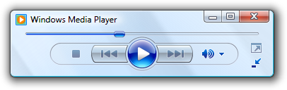

    In this example, a slider is used to indicate progress while playing sound. Doing so allows users to replay the results later.

## Design concepts

During a lengthy operation, users need a general idea of what the operation is doing. They also need to know:

-   That a lengthy operation has started.
-   That progress is being made and that the operation will eventually complete (and therefore hasn't locked up).
-   The approximate percentage of the operation that has been completed (and therefore the percentage remaining).
-   If they should cancel the operation if it isn't worth continuing to wait.
-   If they should continue to wait or do something else while the operation completes.

**Use determinate progress bars for operations that require a bounded amount of time,** even if that amount of time cannot be accurately predicted. Indeterminate progress bars show that progress is being made, but provide no other information. Don't choose an indeterminate progress bar based only on the possible lack of accuracy alone.

For example, suppose an operation requires five steps and each of those steps requires a bounded amount of time, but the amount of time for each step can vary greatly. In this case, use a determinate progress bar and show progress when each step completes proportional to the amount of time each step usually takes. Use an indeterminate progress bar only if a determinate progress bar would cause users to conclude incorrectly that the operation has locked up.

**If you do only one thing...**

Make sure that you provide progress feedback for lengthy operations and that the above information is clearly communicated. Use determinate progress bars whenever possible.

## Usage patterns

Progress bars have several usage patterns:

### Determinate progress bars

| Label | Value |
|--------|-------|
| <strong>Modal determinate progress bars</strong>  Indicate an operation's progress by filling from left to right and filling completely when the operation is complete.   | Because this feedback is <a href="glossary.md">modal</a>, users cannot perform other tasks in the window (or its parent if displayed in a modal dialog box) until the operation is complete.  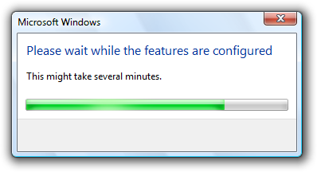  In this example, the progress bar gives feedback during configuration.   | 
| <strong>Modal determinate progress bars with a Cancel or Stop button</strong>  Allow users to halt the operation, perhaps because the operation is taking too long or isn't worth the wait.  | 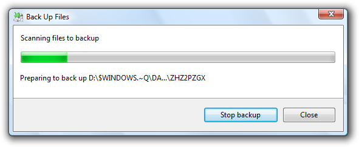  In this example, users can click Stop to halt the operation and leave the environment in its current state.  | 
| <strong>Modal determinate progress bars with a Cancel or Stop button and animation</strong>  Allow users to halt the operation, and include an animation to help users visualize the effect of an operation.  | 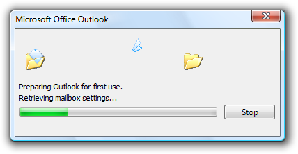  In this example, users can click Stop to halt the operation and leave the environment in its current state.  | 
| <strong>Modal determinate double progress bars</strong>  Indicate the progress of a multi-step operation by showing the progress of the current step in the first progress bar, and the overall progress in the second bar.  | Because the first progress bar provides little additional information and can be quite distracting, this pattern is not recommended. Instead, have all the steps in the operation share a portion of the progress and have a single progress bar go to completion once.  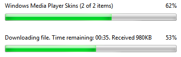  In this example, the first progress bar shows the progress of the current step and the second progress bar shows the overall progress. <blockquote>[!Note] This pattern is usually unnecessary and should be avoided.</blockquote>   | 
| <strong>Modeless determinate progress bars</strong>  Indicate an operation's progress by filling from left to right and filling completely when the operation is complete.  | Unlike with modal progress bars, users can perform other tasks while the operation is in progress. These progress bars can be displayed in context or on a status bar.  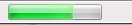  In this example, Windows Internet ExplorerWindows Internet Explorer displays its progress for loading a Web page on the status bar. Users can perform other tasks while the page is loading.  | 

 

### Indeterminate progress bars

|   Progress Bar Type  | Description             |
|-----------------------------------------------------------------------------------------------------------------------------------------------------------------------------------------|------------------------------------------------------------------------------------------------------------------------------------------------------------------------------------------------------------------------------------------------------------------------------------------------------------------------------------------------------------------------------------------------------------------------------------------------------------------------------------------------------------------------------------------------------------------------------------------------------------------|
| **Modal indeterminate progress bars**  Indicate an operation is in progress by showing an animation that continuously cycles across the bar from left to right.     | Used only for operations whose overall progress cannot be determined, so there is no notion of completeness. Determinate progress bars are preferable because they indicate the approximate percentage of the operation that has been completed, and help users determine if the operation is worth continuing to wait. They are also less visually distracting.   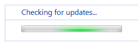  In this example, Windows Update uses a modal indeterminate progress bar to indicate progress while it looks for updates.  |
| **Modeless indeterminate progress bars**  Indicate an operation is in progress by showing an animation that continuously cycles across the bar from left to right.  | Unlike modal progress bars, users can perform other tasks while the processing is in progress. these progress bars can be displayed in context or on a status bar.     In this example, Microsoft Outlook uses a modeless indeterminate progress bar while filling in contact properties. Users can continue to use the property window while this work is in progress.                                                                                                                     |

 

### Meters

|   Type                                                                                       |   Description                                                                                                                                                                                                                                                                                                                                                                 |
|------------------------------------------------------------------------------------------|--------------------------------------------------------------------------------------------------------------------------------------------------------------------------------------------------------------------------------------------------------------------------------------------------------------------------------------------------------------------|
| **Meters**  Indicate a percentage that is not related to progress.   | This pattern isn't a progress bar, but it is implemented using the progress bar control. meters have a distinct look to differentiate them from true progress bars.   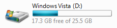  In this example, the meter shows the percentage of disk drive space used.  |

 

## Guidelines

### General

-   **Provide progress feedback when performing a lengthy operation.** Users should never have to guess if progress is being made.
-   **Clearly indicate real progress.** The progress bar must advance if progress is being made. If the range of expected completion times is large, consider using a non-linear scale to indicate progress for the longer times. You don't want users to conclude that your program has locked up when it hasn't.
-   **Clearly indicate lack of progress.** The progress bar must not advance if no progress is being made. You don't want users to wait indefinitely for an operation that is never going to complete.
-   **Provide useful progress details.** Provide additional progress information, but only if users can do something with it. Make sure the text is displayed long enough for users to be able to read it.

    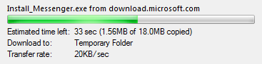

    In this example, users can see the transfer rate. The low transfer rate here suggests the need for using a high-bandwidth network connection.

-   **Don't provide unnecessary details.** Generally users don't care about the details of the operation being performed. For example, users of a setup program don't care about the specific file being copied or that system components are being registered because they have no expectations about these details. Typically, a well-labeled progress bar alone provides sufficient information, so provide additional progress information only if users can do something with it. Providing details that users don't care about makes the user experience overly complicated and technical. If you need more detailed information for debugging, don't display it in release builds.

    **Correct:**

    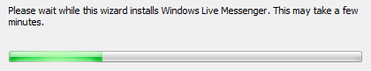

    In this example, the labeled progress bar is all that is needed.

    **Correct:**

    

    In this example, Windows Explorer is copying files the user selected, so displaying the filenames being copied is meaningful.

    **Incorrect:**

    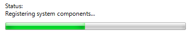

    In this example, a setup program is providing details that are meaningless to the user.

-   **Provide useful animations.** If done well, animations improve the user experience by helping users visualize the operation. Good animations have more impact than text alone. For example, the progress bar for the Outlook Delete command displays the Recycle Bin for the destination if the files can be recovered, but no Recycle Bin if the files can't be recovered.

    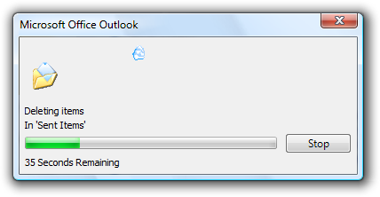

    In this example, the lack of a Recycle Bin reinforces that the files are being permanently deleted. This additional information wouldn't be communicated as effectively using text alone.

-   **Don't use unnecessary animations.** Animations can be misleading because they usually run in a separate thread from the actual task and therefore can suggest progress even if the operation has locked up. Also, if the operation is slower than expected, users sometimes assume that the animation is part of the reason. Consequently, only use animations when there is a clear justification; don't use them to try to entertain users.
-   **Position animations centered over the progress bar.** Put the animation above the progress bar labels, if you have any. If there is a Cancel or Stop button to the right of the progress bar, include the button when determining the center.
-   **Play a sound effect at the completion of an operation only if it is very lengthy (longer than two minutes), infrequent, and important.** If the user is likely to walk away from an important operation while it is processing, a sound effect restores the user's attention. Using a sound effect upon completion in other circumstances would be a distracting annoyance.
-   **Don't steal input focus to show a progress update or completion.** Users often switch to other programs while waiting and don't want to be interrupted. Background tasks must stay in the background.
-   **Don't worry about technical support.** Because the feedback provided by progress bars isn't necessarily accurate and is fleeting, progress bars aren't a good mechanism for providing information for technical support. Consequently, if the operation can fail (as with a setup program), don't provide additional progress information that is only useful to technical support. Instead, provide an alternative mechanism such as a log file to record technical support information.

    **Incorrect:**

    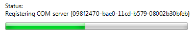

    In this example, the progress bar is showing details intended for technical support.

-   **Don't put the percentage complete or any other text on a progress bar.** Such text isn't accessible and isn't compatible with using themes.

    **Incorrect:**

    

    In this example, the percentage text on the progress bar isn't accessible.

-   **Don't combine a progress bar with a busy pointer.** Use one or the other, but not both at the same time.
-   **Don't use vertical progress bars.** Horizontal progress bars have a more natural mapping and better flow.

### Determinate progress bars

-   **Use determinate progress bars for operations that require a bounded amount of time,** even if that amount of time cannot be accurately predicted. Indeterminate progress bars show that progress is being made, but provide no other information. Don't choose an indeterminate progress bar based only on the possible lack of accuracy alone.
-   **Clearly indicate the progress phase.** The progress bar must be able to indicate if the operation is in the beginning, middle, or end of an operation. For example, progress bars that immediately shoot to 99 percent completion, then stay there for a long time are particularly uninformative and annoying. In these cases, the progress bar should be set initially to at most 33 percent to indicate that the operation is still in the beginning phase.
-   **Clearly indicate completion.** Don't let a progress bar go to 100 percent unless the operation has completed.
-   **Provide a time remaining estimate if you can do so accurately.** Time remaining estimates that are accurate are useful, but estimates that are way off the mark or bounce around significantly aren't helpful. You may need to perform some processing before you can give accurate estimates. If so, don't display potentially inaccurate estimates during this initial period.
-   **Don't restart progress.** A progress bar loses its value if it restarts (perhaps because a step in the operation completes) because users have no way of knowing when the operation will complete. Instead, have all the steps in the operation share a portion of the progress and have the progress bar go to completion once.

    **Incorrect:**

    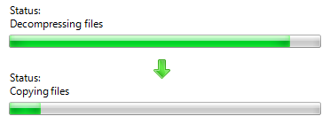

    In this example, the operation moved to the step of copying files and reset the progress bar for that step. Now users have no idea how much progress has been made or how much time is left.

-   **Don't back up progress.** As with a restart, a progress bar loses its value if it backs up. Always increase progress monotonically. However, you can have a time remaining estimate that increases (as well as decreases) because the rate of progress may vary.

### Indeterminate progress bars

-   **Use indeterminate progress bars only for operations whose overall progress cannot be determined.** Use indeterminate progress bars for operations that require an unbounded amount of time or that access an unknown number of objects. Use timeouts to give bounds to time-based operations.
-   **Convert to a determinate progress bar once the overall progress can be determined.** For example, if it takes significantly longer than two seconds to determine the number of objects, you can use an indeterminate progress bar while the objects are counted, and then convert to a determinate progress bar.
-   **Don't combine indeterminate progress bars with percent complete or time remaining estimates.** If you can provide this information, use a determinate progress bar instead.
-   **Don't combine indeterminate progress bars with animations.** An indeterminate progress bar is effectively a generic animation, so you should use one or the other but never both.

    **Correct:**

    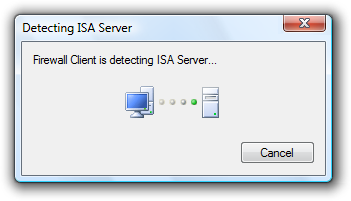

    In this example, only an animation is used to show that an operation is ongoing.

### Modeless progress bars

-   **If users can do something productive while the operation is in progress, provide modeless feedback.** You might need to disable a subset of functionality that requires the operation to complete.
-   **If the window has an address bar, display the modeless progress in the address bar.**

    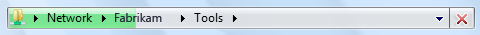

    In this example, modeless progress is shown in the address bar.

-   Otherwise, **if the window has a status bar, display the modeless progress in the status bar.** Put any corresponding text to its left in the status bar.

    

    In this example, modeless progress is shown in the status bar.

### Modal progress bars

-   **Place modal progress bars on progress pages or** [progress dialog boxes](win-dialog-box.md).
-   **Provide a command button to halt the operation if it takes more than a few seconds to complete, or has the potential never to complete.** Label the button Cancel if canceling returns the environment to its previous state (leaving no side effects), otherwise label the button Stop to indicate that it leaves the partially completed operation intact. You can change the button label from Cancel to Stop in the middle of the operation if at some point it isn't possible to return the environment to its previous state. Center the command button vertically with the progress bar instead of aligning their tops.

    **Correct:**

    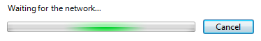

    In this example, halting the network connection has no side effect so Cancel is used.

    **Correct:**

    

    In this example, halting the copy leaves any copied files, so the command button is labeled Stop.

    **Incorrect:**

    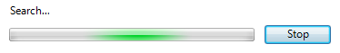

    In this example, halting the search leaves no side effect, so the command button should be labeled Cancel.

### Time remaining

For determinate progress bars:

-   **Use the following time formats.** Start with the first of the following formats where the largest time unit isn't zero, and then change to the next format once the largest time unit becomes zero.

    **For progress bars:**

    **If related information is shown in a colon format:**

    Time remaining: h hours, m minutes

    Time remaining: m minutes, s seconds

    Time remaining: s seconds

    **If screen space is at a premium:**

    h hrs, m mins remaining

    m mins, s secs remaining

    s seconds remaining

    **Otherwise:**

    h hours, m minutes remaining

    m minutes, s seconds remaining

    s seconds remaining

    **For title bars:**

    hh:mm remaining

    mm:ss remaining

    0:ss remaining

    This compact format shows the most important information first so that it isn't truncated on the taskbar.

-   **Make estimates accurate, but don't give false precision.** If largest unit is hours, give minutes (if meaningful) but not seconds.

    **Incorrect:**

    hh hours, mm minutes, ss seconds

-   **Keep the estimate up-to-date.** Update time remaining estimates at least every 5 seconds.
-   **Focus on the time remaining** because that is the information users care about most. Give total elapsed time only when there are scenarios where elapsed time is helpful (such as when the task is likely to be repeated). If the time remaining estimate is associated with a progress bar, don't have percent complete text because that information is conveyed by the progress bar itself.
-   **Be grammatically correct.** Use singular units when the number is one.

    **Incorrect:**

    1 minutes, 1 seconds

-   **Use sentence-style capitalization.**

### Progress bar colors

-   **Use red or yellow progress bars only to indicate the progress status, not the final results of a task.** A red or yellow progress bar indicates that users need to take some action to complete the task. If the condition isn't recoverable, leave the progress bar green and display an error message.
-   **Turn the progress bar red when there is a user recoverable condition that prevents making further progress.** Display a message to explain the problem and recommend a solution.
-   **Turn the progress bar yellow to indicate either that the user has paused the task or that there is a condition that is impeding progress** but progress is still taking place (as, for example, with poor network connectivity). If the user has paused, change the Pause button label to Resume. If progress is impeded, display a message to explain the problem and recommend a solution.

### Meters

-   **Use progress bars only for progress.** Use meters to indicate percentages that aren't related to progress.

## Recommended sizing and spacing

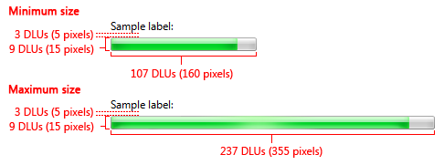

Recommended sizing and spacing for progress bars.

-   Always use the recommended progress bar height.
    -   **Exception:** You may use a different height if the parent window doesn't support the recommended height.
-   Use the minimum width if you want to make the progress bar unobtrusive.
-   Don't use widths longer than the maximum recommended. The progress bar doesn't have to fill the available space.
-   Center the progress bar horizontally if the window is much wider than the maximum recommended width.

## Labels

### Progress bar labels

-   **Use a concise label with a static text control to indicate what the operation is doing.** Start the label with a verb (for example, Copying) and end with an ellipsis. This label may change dynamically if the operation has multiple steps or is processing multiple objects.
-   Don't assign a unique [access key](glossary.md) because the control isn't interactive.
-   Use [sentence-style capitalization](glossary.md).
-   If the operation was not directly initiated by the user, you can include an additional label to give the context and apologize for the interruption. Start this extra label with the phrase, Please wait while. This label should not change during the operation.

    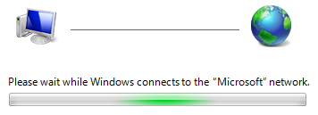

    In this example, the user is being asked to please wait because the user didn't directly initiate the operation.

-   Position the label above the progress bar and align the label with the left edge of the progress bar.

### Progress bar details

-   Provide details in static text, preceding the data with a label ending with a colon. Specify units (seconds, kilobytes, and so on) after the details text.

    **Correct:**

    

    In this example, the details are properly labeled.

    **Incorrect:**

    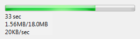

    In this example, the details aren't labeled, thus requiring users to determine their meaning.

-   Use [sentence-style capitalization](glossary.md).
-   Position the details below the progress bar and align the label with the left edge of the progress bar.
-   Don't give the percentage completed or remaining because that information is conveyed by the progress bar itself.

### Cancel button

-   Label the button Cancel if canceling returns the environment to its previous state (leaving no side effect); otherwise, label the button Stop to indicate that it leaves the partially completed operation intact.
-   You can change the button label from Cancel to Stop in the middle of the operation if at some point it isn't possible to return the environment to its previous state.

### Progress dialog box titles

-   If the progress bar is displayed in a modal dialog box, the dialog box title should be the name of the program or the name of the operation. Don't use what should be the progress bar label for the dialog box title.

    **Correct:**

    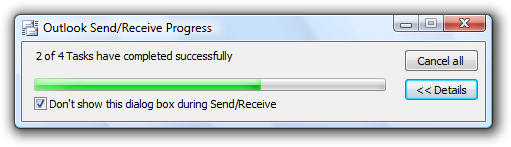

    In this example, the task name is used for the dialog box title.

    **Incorrect:**

    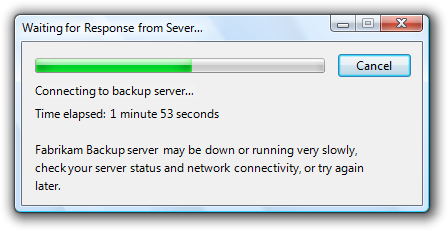

    In this example, the dialog box title text is a restatement of the progress bar label. The program name should be used instead.

-   If the progress bar is displayed in a modeless dialog box, optimize the title for display on the taskbar by concisely placing the distinguishing information first. Example: "66% Complete."

 

