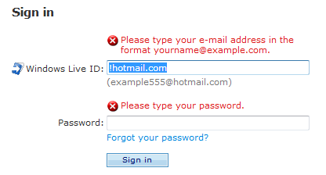

# Style and Tone

> [!NOTE]
> This design guide was created for Windows 7 and has not been updated for newer versions of Windows. Much of the guidance still applies in principle, but the presentation and examples do not reflect our [current design guidance](/windows/uwp/design/).

Tone in writing is the attitude that the writer conveys to the reader. It's not necessarily what you say, but how you say it. Tone is intended to create a specific response or emotion in the reader; it creates a personality that can either engage or repel users.

**Note:** Guidelines related to [user interface text](text-ui.md) are presented in a separate article.

## Design concepts

### The Windows tone

Use the Windows tone to inspire confidence by communicating to users on a personal level by being accurate, encouraging, insightful, objective, and user focused. The Windows tone also strives to be light, inspiring, straightforward, and trustworthy.

Don't use a distracting, condescending, or arrogant tone. Avoid the extremes of the "machine" voice (where the speaker is removed from the language) and the "sales rep" voice (where the writing tries to sell us something, to cajole us, to cheer us up, to gloss over everything as "simple.")

Research from Microsoft shows that in software, there is often:

-   **Overuse of computer terminology and jargon,** which many users don't understand or misinterpret.
-   **Inconsistent use of terminology.**
-   **Impenetrable, often unintentionally patronizing messages,** which users struggle to decipher.

These problems make users feel confused, unintelligent, disheartened, and ultimately disengaged from their experience with software.

Renewed attention to message quality, including the tone of the text, implies that language itself is an important ingredient in overall customer satisfaction. Support users with different levels of technical knowledge, especially novice users, to take advantage of all the things your program can do.

**If you do only one thing...**

Make sure that your text is accurate, encouraging, insightful, objective, and user-focused. Be straightforward and trustworthy, and where appropriate use a light and inspiring tone.

## Guidelines

### Use the Windows tone

Tone in your program should be:

-   **Accurate.** Users should feel reassured that the information is technically accurate. If the information isn't accurate, the user's experience with that specific task is spoiled, and he loses faith in any other assistance he reads from that source.
-   **Encouraging.** Use language that conveys that the software empowers users to do things, rather than allows them to do things. For example, use "you can" rather than "Windows lets you" or "this feature allows you." (Exception: it's okay to use "allow" when referring to features—such as security features—that permit or deny an action.)
-   **Insightful.** Users should believe that you (and by extension your application) know when a certain task is complicated and that you will guide them through it. At the same time, treat users as intelligent people who happen to need help with a particular problem.
-   **Objective.** Sometimes users want a richer explanation; often though they just want to know what they need to move on. This requires objectivity—to recognize that the goal (productivity, curiosity, enjoyment) is the user's goal, not the writer's. It also requires that you shed any predisposed notions about the user.
-   **User-focused.** Write from the user's perspective and preferably from the perspective of what you can do for the user. Users should feel that they will find information that is relevant and accessible to them.

You can further develop communication with your users by being:

-   **Light.** A light voice feels easy to deal with and quick to comprehend. It isn't difficult or burdensome, and it avoids straining to be profound or serious.
-   **Inspiring.** An inspiring voice motivates users, stimulating them to take action. A certain enthusiasm marks this kind of voice, giving it a more engaging personality than the machine-like tone users have often come to expect from their computers.
-   **Straightforward.** A straightforward voice is candid and open, free from pretense or deceit.
-   **Trustworthy.** A trustworthy voice is worthy of confidence, reliable, accurate, and honest. It only takes only a few inaccuracies to lose the user's trust, but it may take a long time to earn that trust back.

By contrast, be sure to avoid the following tones, which are much more likely to receive a negative reaction:

-   **Machine tone.** Feels like having an impersonal, inflexible exchange with a computer or robot.
-   **Corporate tone.** Feels like having a monologue with an all-powerful, all-knowing, impersonal corporation.
-   **Law enforcement tone.** Feels like being interrogated with a barrage of intrusive questions.
-   **Lawyerly tone.** Feels like being asked to perform some legally significant act.
-   **Sales rep tone.** Feels like being asked to buy or try something, with any concerns being glossed over.
-   **Superior, condescending, or angry tone.** Feels like the software is belittling users, talking down to them, or upset with them. Typically, this tone is very technical, draws unnecessary attention to the user's mistakes, and feels rude.
-   **Boastful tone.** Feels like the software is bragging about its accomplishments or otherwise drawing too much attention to itself.
-   **Flippant tone.** Feels like users' goals and emotions aren't being taken seriously, or their use of the program is being take for granted.

### Use real-world language

-   **Use everyday words when you can and avoid words you wouldn't say to someone else in person.** This is especially effective if you are explaining a complex technical concept or action. Imagine yourself looking over the user's shoulder and explaining how to accomplish the task.

    **Acceptable:**

    Use this procedure to change your password.

    **Better:**

    Follow these steps to change your password.

-   **Use short, plain words whenever possible.** Shorter words are more conversational, save space on screen, and are easier to scan.

    **Acceptable:**

    In addition, this section shows you...

    Digital cameras employ tiny microchips...

    Digital cameras utilize tiny microchips...

    **Better:**

    This section also shows you...

    Digital cameras use tiny microchips...

-   **Don't invent words or apply new meanings to standard words.** Assume that users are more familiar with a word's established meaning than with a special meaning given it by the technology industry. When an industry term is required, provide an in-context definition. Avoid jargon, but remember that some expressions specific to computer usage—hacker, burn a CD, and so on—are already part of everyday speech.

    **Incorrect:**

    You can use folders to bucketize your favorites.

    **Correct:**

    You can use folders to categorize your favorites.

-   **Don't use symbols as a substitute for simple words.**

    **Incorrect:**

    users & computers

    users + computers

    domain / workgroup

    \# of users

    **Correct:**

    users and computers

    domain or workgroup

    number of users

### Be precise

-   Choose words with a clear meaning.

    **Acceptable:**

    Since you created the table, you can make changes to it.

    Keep your firewall turned on, as turning it off could create a security risk.

    **Better:**

    Because you created the table, you can make changes to it.

    Keep your firewall turned on, because turning it off could create a security risk.

-   Omit needless words—don't use two or three words when one will do.

    **Verbose:**

    Follow these steps in order to change your password:

    **Better:**

    To change your password:

-   Avoid unnecessary adverbs.

    **Incorrect:**

    It isn't terribly hard to change your password.

    **Correct:**

    It isn't hard to change your password.

-   Choose single-word verbs over multi-word verbs.

    **Acceptable:**

    When you lock down your computer, ...

    **Better:**

    When you lock your computer, ...

-   Don't convert verbs to nouns and nouns to verbs.

    **Incorrect:**

    To password-protect your computer...

    To establish connectivity...

    **Correct:**

    To protect your computer with a password...

    To connect...

### Be consistent

-   Consistent terminology promotes learning and a better understanding of technical concepts. Inconsistency forces users to figure out whether different words and actions mean the same thing.

    Examples:

    switch, toggle

    start, run, launch, boot, execute

    enable, activate, turn on

    burn, copy

-   Consistent syntax helps set users' expectations. Once these expectations are set, users can more quickly parse text that uses consistent syntax. For example, if instructions are always written in the imperative form, users will learn to pay closer attention to imperative sentences.

### Contractions

-   Contractions lend a shorter, snappier, more conversational rhythm to writing. Use them as appropriate and in context. Don't use contractions with product names or other proper nouns.

### Colloquialisms, idioms, and slang

-   Consider using colloquialisms or slang only in special situations, such as product tours, setup screens, or content that won't be localized. Recent studies have shown that users enjoy the unexpected word or familiar phrase. Bear in mind that using colloquialisms and slang can be difficult and costly to translate effectively, so such language is best used judiciously.

    **Examples:**

    On the other hand, there are certain values in the registry that shouldn't be changed.

    With SDSL, the line is dedicated to your Internet use, so you won't experience rush-hour traffic jams on the Internet, as you might with cable service.

### Person

-   **Address the user as you, directly or indirectly.**
-   **Use the second person (you, your) to tell users what to do.** Often the second person is implied.

    **Examples:**

    Choose the pictures you want to print.

    Choose an account. (implied)

-   **Use the first person (I, me, my) to let users tell the program what to do.**

    **Example:**

    Print the photos on my camera.

-   **Use we judiciously.** The first-person plural can suggest a daunting corporate presence. However, it can be preferable to using the name of your application. Use we recommend rather than it is recommended.
-   **Avoid third-person references (the user)** because they create a more formal, less personal tone.

### Voice

-   **Use the active voice,** which emphasizes the person or thing doing the action. It is more direct and personal than the passive voice, which can be confusing or sound formal.

    **Acceptable:**

    Icons can be arranged by name in alphabetical order.

    When a Personal Digital Assistant (PDA) or laptop is plugged in...

    **Better:**

    You can arrange icons in alphabetical order by the icon name.

    When you plug in any Personal Digital Assistant (PDA) or laptop...

-   Use the passive voice only to avoid a wordy or awkward construction; when the action rather than the doer is the focus of the sentence; when the subject is unknown; or in error messages, when the user is the subject and might feel blamed for the error if the active voice were used.

    **Correct:**

    The new icon should appear in the upper-left corner.

    Updates must be downloaded and installed before they can work.

-   **Phrase statements in the positive form**, and emphasize what users can accomplish, rather than what they can't.

### Attitude toward the user

-   **Be polite, supportive, and encouraging.** The user should never feel condescended to, blamed, or intimidated.

    **Acceptable:**

    Cannot delete New Text Document: Access is denied.

    **Better:**

    This file is protected and cannot be deleted without specific permission.

-   **Strike the right balance: be warm toward the user without being too intimate or too business-like.** Imagine that you are helping a friend use the product for the first time. This person is not your best friend or significant other, but instead, a neighbor or family friend. Users should feel comfortable and at home when using your program, but the language should not feel presumptuous or too familiar.
-   **Limit please to situations that inconvenience the user in some way,** such as:

    -   The user is asked to do something inconvenient, such as waiting, repeating a task or updating a program.

        **Correct:**

        Please wait while Windows copies the files to your computer.

    -   The user can't complete a task because of a missing feature, design flaw, or program bug.

        **Correct:**

        Unable to save using the specified format. Please select another format.

    -   The user has gone out of his or her way to be helpful, as by participating in a customer feedback program or filing a bug report.

        **Correct:**

        To improve the Fabrikam Backup experience, please participate in the Fabrikam customer feedback program.

    You should also use please whenever its absence would be considered curt.

    

    In this example, the inline error messages would be curt without please.

-   **Use sorry only in error messages that result in serious problems for the user** (for example, data loss, the user can't continue to use the computer, or the user must get help from a technical representative). Don't apologize if the issue occurred during the normal functioning of the program (for example, if the user needs to wait for a network connection to be found).

    **Correct:**

    We're sorry, but Fabrikam Backup detected an unrecoverable problem and was shut down.

### Sentence structure and length

-   Because users often scan text, **make every word count.** Simple, concise sentences (and paragraphs) not only save space on the screen but are the most effective means of conveying that an idea or action is important. Use your best judgment—make sentences tight, but not so tight that the tone seems abrupt and unfriendly.
-   **Avoid repetition.** Review each window and eliminate duplicate words and statements. Don't avoid important text—be explicit whenever necessary—but don't be redundant and don't explain things that go without saying.
-   **Use sentence fragments if appropriate.** Sentence fragments are short and punchy—and, as they typically take the interrogative form, they are a good way of directly engaging the user.

    **Correct:**

    Save changes to "My Photos"?

    Ever saved a file and then not remembered where you saved it?

-   **Start sentences with conjunctions** (and, but, or) if you need to.
-   **Substitute lists and tables for complex sentences.** Lists (whether numbered or bulleted) and tables are clearer and easier to scan.
-   **Use parallel grammatical constructions.** Parallelism requires that words and phrases that have the same function have the same form. Use parallel language whenever you express ideas of equal weight, and for UI elements that are parallel in function (such as headings, labels, lists, or page titles).

    **Correct:**

    Listen

    Watch

    Share

    Collect

    These items are parallel because they are all single-word, imperative verbs.

    **Incorrect:**

    Music

    Video

    Share

    Listen

    These items are not parallel because Music and Video are nouns, but Share and Listen are verbs.

 

 