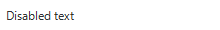
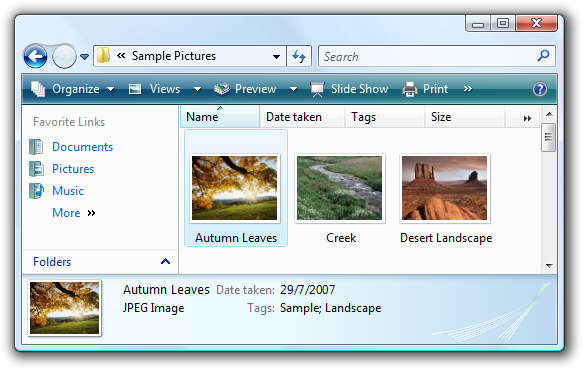
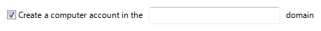
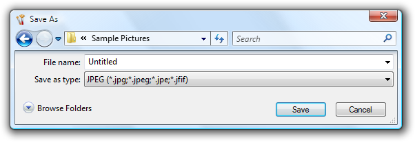
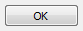

# User Interface Text

> [!NOTE]
> This design guide was created for Windows 7 and has not been updated for newer versions of Windows. Much of the guidance still applies in principle, but the presentation and examples do not reflect our [current design guidance](/windows/uwp/design/).

User interface text appears on UI surfaces. This text includes control labels and static text:

-   Control labels identify controls and are placed directly on or next to the controls.
-   Static text, which is so called because it is not part of an interactive control, provides users with detailed instructions or explanations so they can make informed decisions.

**Note:** Guidelines related to [style and tone](text-style-tone.md), [fonts](vis-fonts.md), and [comon control](controls.md) labels are presented in separate articles.

## Usage patterns

UI text has several usage patterns:

|                                                                                                                                                                                             |                                                                                                                                                                                                                                                                                                                                                                                                                                                                  |
|---------------------------------------------------------------------------------------------------------------------------------------------------------------------------------------------|------------------------------------------------------------------------------------------------------------------------------------------------------------------------------------------------------------------------------------------------------------------------------------------------------------------------------------------------------------------------------------------------------------------------------------------------------------------|
| **Title bar text**  use title bar text to identify a window or the source of a dialog box.                                                                              |   In this example, the title bar text identifies a window.                                                                                                                                                                                                                                                                                                              |
| **Main instructions**  use the prominent main instruction to explain concisely what to do in the window or page.                                                        | The instruction should be a specific statement, imperative direction, or question. good main instructions communicate the user's objective rather than focusing just on manipulating the ui.     In this example, the main instruction text directly engages the user with a question in terms of the user's own benefit or interest.              |
| **Supplemental instructions**  when necessary, use a supplemental instruction to present additional information helpful to understanding or using the window or page.   | You can provide more detailed information, provide context, and define terminology. supplemental instructions elaborate on the main instruction without simply re-wording it.     In this example, the supplemental instructions provide two possible courses of action to take in response to the information presented in the main instruction.  |
| **Control labels**  labels directly on or next to controls.                                                                                                             |   In this example, control labels identify desktop clock settings that users can select or modify.                                                                                                                                                                                                                                                                        |
| **Supplemental explanations**  an elaboration of the control labels (typically for command links, radio buttons, and check boxes).                                      |   In this example, the supplemental explanations clarify the choices.                                                                                                                                                                                                                                                                                              |

 

## Design concepts

Software developers often think of text as relegated to product documentation and technical support. "First we'll write the code, and then we'll hire someone to help us explain what we have developed." Yet in reality, important text is written earlier in the process, as the UI is conceived and coded. This text is, after all, seen more frequently and by more people than perhaps any other type of technical writing.

**Comprehensible text is crucial to effective UI.** Professional writers and editors should work with software developers on UI text as an integral part of the design process. Have them work on text early because text problems often reveal design problems. If your team has trouble explaining a design, quite often it is the design, not the explanation, that needs improving.

### A design model for UI text

As you think about UI text and its placement on your UI surfaces, consider these facts:

-   During focused, immersive reading, people read in a left-to-right, top-to-bottom order (in Western cultures).
-   When using software, users aren't immersed in the UI itself but in their work. Consequently, users don't read UI text they scan it.
-   When scanning a window, users may appear to be reading text when in reality they are filtering it. They often don't truly comprehend the UI text unless they perceive the need to.
-   Within a window, different UI elements receive different levels of attention. Users tend to read control labels first, especially those that appear relevant to completing the task at hand. By contrast, users tend to read static text only when they think they need to.

For a general design model, don't assume that users carefully read the text in a left-to-right, top-to-bottom order. Rather, assume that users start by quickly scanning the whole window, then read UI text in roughly the following order:

-   Interactive controls in the center
-   The [commit buttons](glossary.md)
-   Interactive controls found elsewhere
-   Main instruction
-   Supplemental explanations
-   Window title
-   Other static text in main body
-   Footnotes

You should also assume that once users have decided what to do, they will immediately stop reading and do it.

### Eliminate redundancy

Redundant text not only takes valuable screen space, but weakens the effectiveness of the important ideas or actions that you are trying to convey. It is also a waste of the reader's time, and all the more so in a context where scanning is the norm. **Windows strives to explain what users need to do once well and concisely.**

Review each window and eliminate duplicate words and statements, both within and across controls. Don't avoid important text be explicit wherever necessary but don't be redundant and don't explain the obvious.

### Avoid over-communication

Even if text isn't redundant, it can simply be too wordy in an effort to explain every detail. **Too much text discourages reading the eye tends to skip right over it ironically resulting in less communication rather than more.** In UI text, concisely communicate the essential information. If more information is necessary for some users or some scenarios, provide a link to more detailed [Help content](winenv-help.md), or perhaps to a glossary entry for clarification of a term.

**Incorrect:**

In this example, there is too much text to scan easily. Although not intended by the designer, there is so much text that users will most likely click Next without reading anything.

To avoid text that discourages reading, craft your text to make every word count. What doesn't add subtracts, so use simple, concise text.

### Use the inverted pyramid

Academic writing typically uses a "pyramid" structural style that lays down a foundation of facts, works with those facts, and builds up to a conclusion forming a pyramid-like structure. By contrast, journalists use an "inverted pyramid" style that starts with the conclusion the fundamental "takeaway" that readers must have. It then fills in progressively more detail that readers may be interested in perhaps just to scan. The advantage of this style is that it gets right to the point, and allows readers to stop reading at any point they choose and still understand the essential information.

You should apply the inverted pyramid structure to UI text. Get right to the point with the essential information, let users stop reading at any time they choose, and use a Help link to present the remainder of the pyramid.

In this example, the essential information is in the query of the main instruction text, additional helpful information is in the supplemental instructions, and details are available by clicking a Help link.

**If you do only five things...**

1.  Work on text early because text problems often reveal design problems.
2.  Design your text for scanning.
3.  Eliminate redundant text.
4.  Use easy-to-understand text; don't over-communicate.
5.  When necessary, provide links to Help content for more detailed information.

## Guidelines

### General

-   **Remove redundant text.** Look for redundant text in window titles, main instructions, supplemental instructions, content areas, command links, and commit buttons. Generally, leave full text in main instructions and interactive controls, and remove any redundancy from the other places.
-   **Avoid large blocks of UI text.** Ways of doing this include:
    -   Chunking text into shorter sentences and paragraphs.
    -   When necessary, providing [Help links](winenv-help.md) to useful, but not essential, information.
-   **Choose object names and labels that clearly communicate and differentiate what the object does.** Users shouldn't have to figure out what the object really means or how it differs from other objects.

    Incorrect:

    

    Better:

    

    In the incorrect example, the object names are not differentiated at all; the better example shows strong differentiation by product name.

-   **If you want to make sure that users read specific text related to an action, place it on an interactive control.**
    -   **Acceptable:**
    -   
    -   In this example, there's a chance that users won't read the text that explains what they're confirming.
    -   **Better:**
    -   
    -   In this example, you can be sure that at least users understand that they are about to format a disk.
-   **Use one space between sentences.** Not two.

### Text fonts, sizes, and colors

-   **Use blue text only for links and main instructions.**
-   **Use green text only for URLs in search results.**

The following fonts and colors are defaults for Windows.

| Pattern                                                                                     | Theme symbol                            | Font, Color                                                           |
|--------------------------------------------------------------------------------------|-----------------------------|------------------------------------------------------------|
|                | CaptionFont       | 9 pt. black (\#000000) Segoe UI                  |
|             | MainInstruction   | 12 pt. blue (\#003399) Segoe UI                  |
|        | Instruction       | 9 pt. black (\#000000) Segoe UI                  |
|                   | BodyText          | 9 pt. black (\#000000) Segoe UI                  |
|               | BodyText          | 9 pt. black (\#000000) Segoe UI, bold or italic  |
|                 | BodyText          | 9 pt. black (\#000000) Segoe UI, in a box        |
|                 | Disabled          | 9 pt. dark gray (\#323232) Segoe UI              |
|                          | HyperLinkText     | 9 pt. blue (\#0066CC) Segoe UI                   |
|                 | Hot               | 9 pt. light blue (\#3399FF) Segoe UI             |
|                  |                   | 11 pt. blue (\#003399) Segoe UI                  |
|   |                   | 11 pt. black (\#000000) Segoe UI                 |
|                 | (none)            | 9 pt. black (\#000000) Calibri                   |
|             | (none)            | 17 pt. black (\#000000) Calibri                  |

 

For more information and examples, see [Fonts](vis-fonts.md) and [Color](vis-color.md).

### Other text characteristics

**Bold**

-   **Use bold sparingly to draw attention to text users must read.** For example, users scanning down a list of radio button options may appreciate seeing the labels in bold, to stand out from text that adds supplemental information about each option. Be aware that using too much bold lessens its impact.
-   **With labeled data, use bold to emphasize whichever is more important for the data as a whole.**
    -   For mostly generic data (where the data has little meaning without its labels, as with numerals or dates), use bold labels and plain data so that users can more easily scan and understand the types of data.
    -   For mostly self-explanatory data, use plain labels and bold data so that users can focus on the data itself.
    -   Alternatively, you can use dark gray text to de-emphasize less important information instead of using bold to emphasize the more important information.

        

        In this example, instead of emphasizing the data using bold, the labels are de-emphasized by using dark gray.

-   **Not all fonts support bold, so it should never be crucial to understanding the text.**

**Italic**

-   Use to refer to text literally. Don't use quotation marks for this purpose.

    **Correct:**

    The terms document and file are often used interchangeably.

-   Use for [prompts](glossary.md) in [text boxes](ctrl-text-boxes.md) and [editable drop-down lists](/windows/desktop/uxguide/ctrl-drop).

    

    In this example, the prompt in the Search box is formatted as italic text.

-   Use sparingly to emphasize specific words to aid in comprehension.
-   **Not all fonts support italic, so it should never be crucial to understanding the text.**

**Bold italic**

-   Don't use in UI text.

**Underline**

-   Don't use, except for links.
-   Don't use for emphasis. Use italic instead.

### Punctuation

**Periods**

-   **Don't place at the end of control labels, main instructions, or Help links.**
-   Place at the end of supplemental instructions, supplemental explanations, or any other static text that forms a complete sentence.

**Question marks**

-   **Place at the end of all questions.** Unlike periods, question marks are used for all types of text.

**Exclamation points**

-   In business applications, avoid.
    -   **Exceptions:** Exclamation points are sometimes used in the context of download completion ("Done!") and to call attention to Web content ("New!").

**Commas**

-   In a list of three or more items, always put a comma after the next-to-last item in the list.

**Colons**

-   **Use colons at the end of external control labels.** This is particularly important for accessibility because some assistive technologies look for colons to identify control labels.
-   Use a colon to introduce a list of items.

**Ellipses**

-   **Ellipses mean incompleteness.** Use ellipses in UI text as follows:
    -   **Commands:** Indicate that a command needs additional information. Don't use an ellipsis whenever an action displays another window only when additional information is required. For more information, see [Command Buttons](ctrl-command-buttons.md).
    -   **Data:** Indicate that text is truncated.
    -   **Labels:** Indicate that a task is in progress (for example, "Searching...").

        **Tip:** Truncated text in a window or page with unused space indicates poor layout or a default window size that is too small. Strive for layouts and default window sizes that eliminate or reduce the amount of truncated text. For more information, see [Layout](vis-layout.md).

-   **Don't make ellipses interactive.** To show truncated text, let users resize the control to see more text or use a [progressive disclosure control](ctrl-progressive-disclosure-controls.md) instead.

**Quotation marks and apostrophes**

-   To refer to text literally, use italic formatting rather than quotation marks.
-   Put window titles and control labels in quotation marks only if required to prevent confusion and you can't format using bold instead.
-   For quotation marks, prefer double-quotation marks (" "); avoid single-quotation marks.

    **Correct:**

    Are you sure you want to delete "Sparky's cat folder"?

    **Incorrect:**

    Are you sure you want to delete 'Sparky's cat folder'?

### Capitalization

-   **Use title-style capitalization for titles, sentence-style capitalization for all other UI elements.** Doing so is more appropriate for the [Windows tone](text-style-tone.md).

    -   **Exception:** For legacy applications, you may use title-style capitalization for command buttons, menus, and column headings if necessary to avoid mixing capitalization styles.

        

    This generic example shows correct capitalization and punctuation for property sheets.

    

    This generic example shows correct capitalization and punctuation for dialogs.

-   **For feature and technology names, be conservative in capitalizing.** Typically, only major components should be capitalized (using title-style capitalization).

    **Correct:**

    Analysis Services, cubes, dimensions

    Analysis Services is a major component of SQL Server, so title-style capitalization is appropriate; cubes and dimensions are common elements of database analysis software, so it is unnecessary to capitalize them.

-   **For feature and technology names, be consistent in capitalizing.** If the name appears more than once on a UI screen, it should always appear the same way. Likewise, across all UI screens in the program, the name should be consistently presented.
-   Don't capitalize the names of generic user interface elements, such as toolbar, menu, scroll bar, button, and icon.
    -   **Exceptions:** Address bar, Links bar.
-   Don't use all capital letters for keyboard keys. Instead, follow the capitalization used by standard keyboards, or lowercase if the key is not labeled on the keyboard.

    **Correct:**

    spacebar, Tab, Enter, Page Up, Ctrl+Alt+Del

    **Incorrect:**

    SPACEBAR, TAB, ENTER, PG UP, CTRL+ALT+DEL

-   **Don't use all capital letters for emphasis.** Studies have shown that this is hard to read, and users tend to regard it as "screaming." For warnings, use a warning icon and a clearly-worded explanation of the situation. There is no need to add, for example, the term WARNING in all capital letters.

For more information, see the "Text" or "Labels" section in the specific UI component guidelines.

### Dates and times

-   **Don't hard-code the format of dates and times.** Respect the user's choice of locale and customization options for the date and time formats. The user selects these in the Region and Language control panel item.

    

    In these examples from Microsoft Outlook, both formats for the long date are correct. They reflect different choices users have made in the Region and Language control panel item.

-   **Use the long date format for scenarios that benefit from having additional information.** Use the short date format for contexts that don't have sufficient space for the long format. While users choose what information they would like to include in the long and short formats, designers choose which format to display in their programs based on the scenario and the context.

    

    In this example, the long date format helps users organize tasks and deadlines.

### Globalization and localization

Globalization means to create documents or products that are usable in any country, region, or culture. Localization means to adapt documents or products for use in a locale other than the country/region of origin. Consider globalization and localization when writing UI text. Your program may be translated into other languages and used in cultures very different from your own.

-   For controls with variable contents (such as list views and tree views), **choose a width appropriate for the longest valid data.**
-   **Include space enough in the UI surface for an additional 30 percent** (up to 200 percent for shorter text) for any text (but not numbers) that will be localized. Translation from one language to another often changes line length of text.
-   Don't compose strings from substrings at run time. Instead, use complete sentences so that there is no ambiguity for the translator.
-   **Don't use a subordinate control, the values it contains, or its units label to create a sentence or phrase.** Such a design is not localizable because sentence structure varies with language.

    **Incorrect:**

    

    **Correct:**

    

    In the incorrect example, the text box is placed inside the check box label.

-   Don't make only part of a sentence a link, because when translated, that text might not remain together. Link text should therefore form a complete sentence by itself.
    -   **Exception:** Glossary links can be inserted inline, as part of a sentence.

For more information, see the [Go Global Developer Center](https://msdn.microsoft.com/goglobal/).

### Title bar text

-   Choose the title bar text based on the type of window:
    -   **Top-level, document-centric program windows:** Use a "document name   program name" format. Document names are displayed first to give a document-centric feel.
    -   **Top-level program windows that are not document-centric:** Display the program name only.
    -   **Dialog boxes:** Display the command, feature, or program from which the dialog box came. Don't use the title to explain the dialog box's purpose that's the purpose of the main instructions. For more guidelines, see [Dialog Boxes](win-dialog-box.md).
    -   **Wizards:** Display the wizard name. Note that the word "wizard" should not be included in wizard names. For more guidelines, see [Wizards](win-wizards.md).
-   **For top-level program windows, if the title bar caption and icon are displayed prominently near the top of the window, you can hide the title bar caption and icon to avoid redundancy.** However, you still have to set a suitable title internally for use by Windows.
-   **For dialog boxes, don't include the words "dialog" or "progress" in the titles.** These concepts are implied and leaving these words off makes the titles easier for users to scan.

### Main instructions

-   **Use the main instruction to explain concisely what users should do in a given window or page.** Good main instructions communicate the user's objective rather than focusing just on manipulating the UI.
-   **Express the main instruction in the form of an imperative direction or specific question.**

    **Incorrect:**

    

    In this example, the main instruction simply states the name of the program; it doesn't explicitly invite a course of action for the user to take.

    **Exceptions:** Error messages, warning messages, and confirmations may use different sentence structures in their main instructions.

-   **Use specific verbs whenever possible.** Specific verbs (examples: connect, save, install) are more meaningful to users than generic ones (examples: configure, manage, set).
    -   For control panel pages and wizard pages, if you can't use a specific verb, you may prefer to omit the verb completely.

        **Acceptable:**

        Enter your locale, region, and language

        **Better:**

        Locale, region, and language

    -   For dialogs, such as error messages and warnings, don't omit the verb.

-   Don't feel obliged to use main instruction text if adding it would only be redundant or obvious from the context of the UI.

    

    In this example, the context of the UI is already very clear; there is no need to add main instruction text.

-   **Be concise use only a single, complete sentence.** Pare the main instruction down to the essential information. If you must explain anything more, consider using a supplemental instruction.
-   Use sentence-style capitalization.
-   **Don't include final periods if the instruction is a statement.** If the instruction is a question, include a final question mark.
-   **For progress dialogs, use a gerund phrase briefly explaining the operation in progress,** ending with an ellipsis. Example: "Printing your pictures..."
-   **Tip:** You can evaluate a main instruction by imagining what you would say to a friend when explaining what to do with the window or page. If responding with the main instruction would be unnatural, unhelpful, or awkward, rework the instruction.

For more information, see the "Main instruction" section in the specific UI component guidelines.

### Supplemental instructions

-   When necessary, **use a supplemental instruction to present additional information helpful to understanding or using the window or page,** such as:
    -   Providing context to explain why the window is being displayed if it is program or system initiated.
    -   Qualifying information that helps users decide how to act on the main instruction.
    -   Defining important terminology.
-   **Don't use a supplemental instruction if one isn't necessary.** Prefer to communicate everything with the main instruction if you can do so concisely.
-   **Don't repeat the main instruction with slightly different wording.** Instead, omit the supplemental instruction if there is nothing more to add.
-   Use complete sentences and sentence-style capitalization.

### Control labels

-   **Label every control or group of controls. Exceptions:**
    -   Text boxes and drop-down lists can be labeled using prompts.
    -   Progressive disclosure controls are generally unlabeled.
    -   **Subordinate controls use the label of their associated control.** Spin controls are always subordinate controls.
    -   **Omit control labels that restate the main instruction.** In this case, the main instruction takes the access key.

        **Acceptable:**

        

        In this example, the text box label is just a restatement of the main instruction.

        **Better:**

        

        In this example, the redundant label is removed, so the main instruction takes the access key.

-   Label placement:
    -   Balloons, check boxes, command buttons, group boxes, links, tabs, and tips are labeled directly by the control itself.
    -   Drop-down lists, list boxes, list views, progress bars, sliders, text boxes, and tree views are labeled above, flush left, or to the left.
    -   Progressive disclosure controls are usually unlabeled. Chevron buttons are labeled to the right.
-   **Assign a unique access key for each interactive control** except for links. For more information, see [Keyboard](inter-keyboard.md).
-   **Keep labels brief.** Note, however, that adding a word or two to a label can help clarity, and sometimes eliminates the need for supplemental explanations.
-   **Prefer specific labels over generic ones.** Ideally users shouldn't have to read anything else to understand the label.

    **Incorrect:**

    

    **Correct:**

    

    In the correct example, a specific label is used for the commit button.

-   **For lists of labels, such as radio buttons, use parallel phrasing,** and try to keep the length about the same for all labels.
-   **For lists of labels, focus the label text on the differences among the options.** If all the options have the same introductory text, move that text to the group label.

    **Incorrect:**

    

    **Correct:**

    

    The correct example moves the identical introductory phrasing to the label, so the two options are more cleanly differentiated.

-   **In general, prefer positive phrasing.** For example, use do instead of do not, and notify instead of do not notify.
    -   **Exception:** The check box label, "Don't show this message again," is widely used.
-   **Omit instructional verbs that apply to all controls of the given type.** Rather, focus labels on what is unique about the controls. For example, it goes without saying that users need to type into a text box control or that users need to click a link.

    **Incorrect:**

    

    **Correct:**

    

    In the incorrect examples, the control labels have instructional verbs that apply to all controls of their type.

-   In some cases, the following parenthetical annotations to control labels may be helpful:
    -   **If an option is optional, consider adding "(optional)" to the label.**
    -   **If an option is strongly recommended, add "(recommended)" to the label.** Doing so means the setting is optional, but should be set anyway.
    -   **If an option is intended only for advanced users, consider adding "(advanced)" to the label.**
-   You may specify units (seconds, connections, and so on) in parenthesis after the label.

    

    This example shows that the unit of measurement is megabytes (MB).

For more information, see the "Text" or "Labels" section in the specific UI component guidelines.

### Supplemental explanations

-   **Use supplemental explanations when controls require more information than can be conveyed by their label.** But don't use a supplemental explanation if one isn't necessary prefer to communicate everything with the control label if you can do so concisely. Typically, supplemental explanations are used with command links, radio buttons, and check boxes.
-   When necessary, **use bold in the control labels to make the text easier to scan** when there are supplemental explanations.

    

    In this example, the radio button labels are bold to make them easier to scan.

-   **Adding a supplemental explanation to one control in a group doesn't mean that you have to provide explanations for all the other controls in the group.** Provide the relevant information in the label if you can and use explanations only when necessary. Don't have supplemental explanations that merely restate the label for consistency.

    

    In this example, two controls in the group include supplemental explanations, but the third does not.

-   If a supplemental explanation follows a command link, write the supplemental text in second person.

    **Example:** Command link: Create wireless network settings and save to USB flash drive

    Supplemental explanation: This will create settings that you can transfer to the router with a USB flash drive. Do this only if you have a wireless router that supports USB flash drive configuration.

-   Use complete sentences and ending punctuation.

### Commit button labels

The following table shows the most common commit button labels and their usage.

<table>
<colgroup>
<col style="width: 25%" />
<col style="width: 25%" />
<col style="width: 25%" />
<col style="width: 25%" />
</colgroup>
<tbody>
<tr class="odd">
<td><strong>Button label</strong> </td>
<td><strong>Meaning</strong> </td>
<td><strong>When to use</strong> </td>
<td><strong>Access key</strong> </td>
</tr>
<tr class="even">
<td><strong>OK</strong> </td>
<td><ul>
<li>In dialog boxes: apply the changes or commit to the task and close the window.</li>
<li>In owner property windows: apply the pending changes (made since the window was opened or the last Apply) and close the window.</li>
<li>In owned property windows: keep the changes, close the window, and apply the changes when the owner window's changes are applied.</li>
</ul></td>
<td><ul>
<li>Use with windows that aren't task specific, such as property sheets.</li>
<li>For windows used to perform one specific task, use a specific label instead that starts with a verb (example: Print).</li>
<li>For windows in which users can't make changes, use Close.</li>
</ul></td>
<td>Enter </td>
</tr>
<tr class="odd">
<td><strong>Yes/No</strong> </td>
<td>Yes is the affirmative response to a yes or no question, whereas No is the negative response. </td>
<td><ul>
<li>Use Yes and No buttons only to respond to yes or no questions. Never use OK and Cancel for yes or no questions.</li>
<li>Prefer specific responses over Yes and No buttons. While there's nothing wrong with using Yes and No, specific responses can be understood more quickly, resulting in efficient decision making.</li>
<li>However, consider using Yes and No responses if the phrasing of specific responses turns out to be long or awkward.</li>
<li>Don't use Yes and No buttons if the meaning of the No response is unclear. If so, use specific responses instead.</li>
<li>Yes and No must always be used as a pair.</li>
</ul></td>
<td>Y and N </td>
</tr>
<tr class="even">
<td><strong>Cancel</strong> </td>
<td><ul>
<li>In dialog boxes: discard all changes or work in progress, revert to the previous state (leaving no noticeable side effect), and close the window.</li>
<li>In property sheets: discard all pending changes (made since the window was opened or the last Apply) and close the window.</li>
<li>In control panel items: discard all changes or work in progress, revert to the previous state, and return to the hub page from which the task was launched. If there is no such hub page, close the control panel item window instead.</li>
</ul></td>
<td><ul>
<li>Use when all pending changes or actions can be discarded and any side effects can be undone.</li>
<li>For changes that can't be discarded, use Close. For actions in progress that can be stopped, use Stop. If initially changes or actions can be discarded, you can use Cancel initially then change to Close or Stop once it can't be undone.</li>
</ul></td>
<td>Esc </td>
</tr>
<tr class="odd">
<td><strong>Close</strong> </td>
<td>Close the window. Any changes or side effects are not discarded. </td>
<td><ul>
<li>Use when changes or side effects can't be discarded. Use Close instead of Cancel for primary windows.</li>
<li>Use for windows in which users can't make changes.</li>
</ul></td>
<td>Alt+F4, Ctrl+F4 </td>
</tr>
<tr class="even">
<td><strong>Stop</strong> </td>
<td>Stop a currently running task and close the window. Any work in progress or side effects are not discarded. </td>
<td><ul>
<li>Use when work in progress and any side effects can't or won't be discarded, typically with progress bars or animations.</li>
</ul></td>
<td>Esc </td>
</tr>
<tr class="odd">
<td><strong>Apply</strong> </td>
<td>In owner property sheets: apply the pending changes (made since the window was opened or the last Apply), but leave the window open. Doing so allows users to evaluate the changes before closing the property sheet. In owned property sheets: don't use. </td>
<td><ul>
<li>Use only in property sheets.</li>
<li>Provide an Apply button only if the property sheet has settings (at least one) with effects that users can evaluate in a meaningful way. Typically, Apply buttons are used when settings make visible changes. Users should be able to apply a change, evaluate the change, and make further changes based on that evaluation. If not, remove the Apply button instead of disabling it.</li>
</ul></td>
<td>A </td>
</tr>
<tr class="even">
<td><strong>Next</strong> </td>
<td>In wizards and multi-step tasks: advance to the next step without committing to the task. </td>
<td><ul>
<li>Use only in wizards and multi-step tasks to advance to the next step without commitment.</li>
<li>The effect of a Next button can always be undone by clicking Back.</li>
</ul></td>
<td>N </td>
</tr>
<tr class="odd">
<td><strong>Finish</strong> </td>
<td>In wizards and multi-step tasks: close the window. If the task hasn't been performed yet, perform the task. If that task has already been performed, any changes or side effects are not discarded. </td>
<td><ul>
<li>Use only in wizards and multi-step tasks. However, the use of Finish is discouraged because there is usually a better, more specific commit button:
<ul>
<li>If clicking the button commits to the task (so the task hasn't already been performed), use a specific label that starts with a verb (examples: Print, Connect, Start) that is a response to the main instruction.</li>
<li>If the task has already been performed within the wizard, use Close instead.</li>
</ul></li>
<li>However, you can use Finish when:
<ul>
<li>The specific label is still generic, such as Save, Select, Choose, or Get.</li>
<li>The task involves changing a setting or collection of settings.</li>
</ul></li>
</ul></td>
<td>Enter </td>
</tr>
<tr class="even">
<td><strong>Done</strong> </td>
<td>Not applicable. </td>
<td><ul>
<li>Don't use. Done as a command is grammatically incorrect.</li>
</ul></td>
<td>Not applicable. </td>
</tr>
</tbody>
</table>

 

