# Animations and Transitions

> [!NOTE]
> This design guide was created for Windows 7 and has not been updated for newer versions of Windows. Much of the guidance still applies in principle, but the presentation and examples do not reflect our [current design guidance](/windows/uwp/design/).

Strategic use of animations and transitions can make your program easier to understand, feel smoother, more natural, and of higher quality, and be more engaging. But the gratuitous use of animations and transitions can make your program distracting and even annoying.

Animations give the appearance of motion or change over time. Use animation to give feedback, preview the effect of an action, show the relationship between objects, draw attention to change, or explain a task visually.

Microsoft Windows uses a background flash animation to give feedback that the object was clicked.

Transitions are animations used to keep users oriented during user interface (UI) state changes and object manipulations, and make those changes feel smooth instead of jarring. Good transitions feel natural, often giving the illusion that users are interacting with real-world objects.

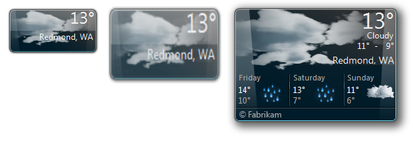

Windows Desktop Gadgets use smooth transitions between their concise and details states.

Generally, the best animations and transitions are used to communicate to users non-verbally, and to make state changes more natural and less noticeable. By contrast, the least effective are gratuitous in that they don't communicate anything or draw unnecessary attention. Animations are best used as a secondary form of communication. They should communicate information that is useful but not critical, and to be accessible, users should be able to determine equivalent information through other means.

**Note:** Guidelines related to [software branding](exper-branding.md), [sound](vis-sound.md), and [accessibility](inter-accessibility.md) are presented in separate articles.

## Is this the right user interface?

To decide, consider the following questions.

### Animations

Do the following conditions apply?

-   The animation visually communicates something useful, such as giving feedback, showing relationships, causes and effects, or drawing attention to important change.
-   Seeing the animation isn't essential. Equivalent information can be obtained in another way. Users might not benefit from the animation if:
    -   They have turned animations off.
    -   Their attention is elsewhere.
    -   They are visually impaired.
    -   The animation is obscured by another window.
    -   The animation isn't played due to insufficient system performance.
-   The animation doesn't affect the user's productivity. Either:
    -   It happens quickly (200 milliseconds or less).
    -   It doesn't interfere with interaction or it can be interrupted.
    -   The user has to wait anyway.
-   The animation doesn't affect the user's flow.
    -   It is either at the user's center of attention, or it draws attention to something outside the center of attention that is important or useful in completing a task.
    -   It is easily ignorable, not distracting or annoying.
    -   It doesn't become tiresome. Users still find it appropriate and enjoyable even after repeated viewing.

If so, consider using an animation.

### Transitions

Is an object or scene changing state, and do all of the above conditions for using animations as well as any of the following conditions apply?

-   The state change is conceptually disorienting, confusing, or otherwise hard to understand.
-   The state change is visually jarring, lacks continuity or smoothness, or flashes; or appears unnatural, unpolished, or of poor quality, especially if it involves a large screen area.
-   Using a transition would make the state change appear faster.
-   The state change is worthy of special user attention.

If so, consider using a transition.

## Design concepts

Animations and transitions are an effective way to communicate information visually that would otherwise require text to explain or might be missed by users.

**Incorrect:**

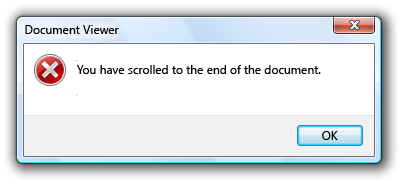

**Correct:**

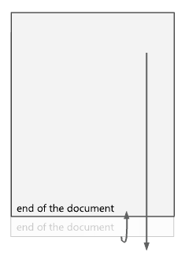

Using an animation communicates the same information, but in a natural, unobtrusive way. Which would you rather see a thousand times?

**Animations and transitions don't have to demand attention to be successful.** In fact, they are often used to avoid drawing attention to program mechanics that users don't need to be aware of. Many successful animations are so natural that users aren't even aware of them; rather users would only notice their absence. Frequency of occurrence increases the need for subtlety, so save effects that demand attention for infrequent events that really deserve the attention.

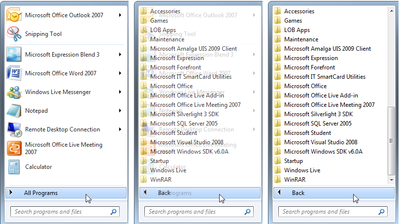

A Start menu transition that avoids drawing attention.

Beyond making your program easier to understand and feel smoother, **well-designed animations and transitions are a great way to add personality, character, and style to your program.** They can make the user experience more immersive and engaging by giving it a natural, real-world feel.

Windows 7 highlights taskbar buttons on hover based on the current mouse position and program icon color. This approach is visually attractive, yet subtle, conveying a humble personality.

**However, animations and transitions are most effective and welcome when they serve a clear purpose.** They should be used to improved usability, smoothness and flow, and the perception of quality, without harming performance significantly.

While some types of animations are used to draw the user's attention, make sure that attention is well deserved and worthy of interrupting the user's train of thought. The human eye is sensitive to motion, especially peripheral motion. It can be difficult for users to concentrate when there is a flashing taskbar button or a spinning notification area icon. **Avoid using animations to interrupt or distract users, or draw attention to things that don't warrant the user's attention.**

**Incorrect:**

Programs shouldn't flash their taskbar button unless users must do something important immediately. In this case, the only thing the user needs to do is activate the program.

**Use animations and transitions because your program needs them, not merely because you can.** And for accessibility, don't use animation as the only way to convey essential information. Make sure that users can obtain equivalent information in a different way.

### Attributes of good animations and transitions

Good animations and transitions strike the right balance among these attributes:

-   **Are clearly purposeful.** Good animations are there because they need to be, whether to communicate information, make an interaction feel real, or draw attention to something noteworthy. And purposeful animations are accurate; if an animation shows that a task is being done, it's because the task is in fact being done.

**Incorrect:**

In this example, the animation shows that a fully charged battery is being charged.

-   **Look smooth and continuous.** Good animations smoothly remove seams between scene or element state changes by showing relationships and providing a sense of place and context. Continuity helps users understand how they got where they are, and how to get back to where they came from.

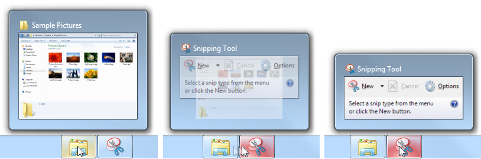

The Windows 7 taskbar window preview morphs for continuity as the user moves from one program to another.

-   **Are realistic.** Good animations simulate an object's real-world physical properties and behavior. This helps users predict and understand the results of their interactions. You don't have to model the real world exactly, but if you use realistic animations, you must keep them consistent with the real world. Users should never be surprised or confused by the results, especially with animations used for direct manipulation.

In this example, the "move out of the way" animation used by the Windows 7 taskbar feels more realistic than a static insertion point.

-   **Are authentic.** Even objects that aren't found in the real world can appear natural by being based on the real-world behavior of a different, but related, object. This metaphor only works if the relationship clearly communicates the intended purpose and behavior.

In this example, the window "squeegee" animation used by Windows 7 feels authentic because it is consistent with how glass windows might behave in the real world.

-   **Use natural mapping.** Natural mappings are either physical or cultural. A culturally-based natural mapping, for example, might start from the fact that in Western cultures, people read from left to right. Consequently, to express a time sequence of objects, the middle object is current, objects to the left are from the past, and objects to the right are in the future. Going forward in time is indicated by left-to-right movement.

In this example, the Windows Media Player control has a natural mapping because playing moves the position from left to right.

-   **Have personality.** Well-chosen animations are great ways to add personality, character, and style to your program. They can make the user experience more immersive and engaging. While the type of animation determines what it communicates, the specific way in which the animation is performed shows the program's personality. Good animations project the right personality for your program, whether serious or whimsical, or somewhere in between.

In this example, Zune's use of animated text and dynamic perspective help shape its personality.

-   **Look and feel responsive.** Good animations don't harm the user's productivity by blocking users from other interactions, or forcing users to watch. No matter how natural and engaging your program's animations are, nobody wants to wait for them exclusively. Good animations also look responsive without being jarring by having a fast start with a soft landing. Responsive animations also benefit from communicating their purpose quickly. Users shouldn't have to watch an animation for a long time just to figure out what it is doing or when it is done. For direct manipulation, responsive animations are essential to maintain a direct and engaging real-world feel. To feel direct, an object's contact points must stay under the pointer smoothly throughout the manipulation. Any lag, choppy response, or loss of contact destroys the perception of direct manipulation.

In this example, the touch panning transition feels responsive by keeping the contact point under the user's finger throughout the manipulation.

-   **Attract the right level of attention.** Good animations are usually subtle and draw only the attention required to fulfill their purpose. As a result, they aren't distracting, annoying, overly complex, overly long, or repetitive. They don't become tiresome after repeated viewings.

In this example, Windows search temporarily draws attention to matching search words, then fades down.

-   **Look special only if genuinely special.** Frequency increases the necessity for subtlety, so common interactions need simple animations that communicate a simple idea in a simple way. Reserve special, complex animations for special, infrequent experiences.

In this example, Windows uses an attention-getting animation at startup to make the experience feel special, but such an animation would be inappropriate elsewhere.

You'll know that you have achieved the right balance when the overall experience would be harmed if any of these attributes were removed.

### Creating an animation vocabulary

Good animations are about effective visual communication, and consistency is crucial to their effectiveness. If you use a specific transition, such as pushing a scene in from the right to advance to the next scene, that should be the only transition used for that purpose and that transition shouldn't be used for any other purpose. Assigning different meanings to the same animation harms its ability to communicate. By assigning specific animations and transitions to specific meanings, you are creating an animation vocabulary.

This issue applies to animations and transitions that have meaning, not to generic ones that users aren't likely to assign meaning to or those whose purpose is to be unnoticeable. For example, animations like fades and special effects like dissolves have no particular meaning, so they can be used freely.

A good vocabulary assigns animations that model an object's real world, physical behavior. If you need to assign an animation to an object or action that doesn't have a real world counterpart, choose an animation that shows how the object might behave were it real.

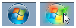

While the Start menu isn't a real world object, its hover effect lights up like a real-world object might when activated.

Each animation in a vocabulary needs to be clearly distinct. The animations should have similar behaviors only if their associated actions are similarly related. For example, movement transitions suggest navigation, so you can use movement transitions from different directions to indicate different types of navigation.

You'll know that your animations and transitions aren't communicating well when users find the results confusing, surprising, or unexpected. Generally, it's better to achieve a single purpose well than multiple purposes not so well.

Ideally, your animation vocabulary should be comprehensive across all areas of your program that need them. If only a few interactions have natural animations, that will draw attention to those that don't.

To learn more about the Windows animation vocabulary, see the [Usage patterns](#usage-patterns) section of this article.

### Designing the right personality

While the type of animation determines what it communicates, the specific way in which the animation is performed speaks to the program's personality and reinforces its brand.

Your program's personality should reflect the nature of its tasks and the personality of its users, so it's not an arbitrary choice. Rather, a well-designed personality should feel authentic; never try to force it. The personality should make an emotional connection to the user. Some factors to consider:

-   **Tasks:** Serious or fun; optional or required.
-   **Consequences:** Serious or minor.
-   **Cost:** Free or purchased; if purchased, moderately priced or expensive.
-   **User focus:** Relatively narrow group of target users, or wide, general audience.
-   **User environment:** Professional, casual, or home.
-   **User age:** Younger or older.
-   **Usage frequency:** Frequent or infrequent.

The combination of these factors helps determine an appropriate personality for your program. Here are some suitable combinations for common types of programs:

**Productivity applications**

Naturally, productivity applications must focus on productivity. While a few special experiences can stand out, most other animations should have these characteristics:

-   Small
-   Natural, realistic
-   Subtle, subdued
-   Fast, efficient
-   Relaxed

**Utilities**

Utilities are typically used briefly, so their use of animation can be more aggressive:

-   Realistic, illustrative, self-explanatory
-   Safe
-   Engaging

**Entertainment, games**

Because the goal of these programs is to engage and delight users, the animations and transitions can be much more aggressive by having these characteristics:

-   Large (possibly becoming an integral part of the experience)
-   Artificial, surreal
-   Impactful, vibrant
-   Emotional, playful, whimsical
-   Energetic

Making an emotional connection is so important for entertainment programs that it's acceptable to bend some rules if doing so helps make users fall in love with the program. For example, it's acceptable if an animation or transition becomes tiresome after the hundredth time if most users are unlikely to use the program that often.

Generally, animations and transitions that are small, natural, subdued, efficient, yet relaxed are the safest bet. Transitions with these characteristics typically take the shortest path from beginning to end, start quickly, end softly, and don't overshoot. Also, well designed transitions are designed to work well across the entire range of distances in which they will be used.

### Animation performance

When designing animations, make sure that they don't affect users' ability to use your program efficiently. Generally, make your animations slow enough to fulfill their purpose, but fast enough that they don't interfere with responsiveness, demand too much attention, or become tiresome.

**Incorrect:**

While this page turning animation has an engaging, real-world feel, it lessens users' productivity by taking longer to turn pages.

Brief transitions (200 milliseconds or less) are a special case (especially when they often work off of a delay) because users will be aware that they have to wait a split second for them. Users are willing to wait for such animations if:

-   The perceived wait is extremely brief (200 milliseconds or less).
-   The transition makes the interaction feel more smooth and natural.
-   The transition makes the interaction feel more responsive.
-   Any delay helps keep the user in control of the interaction.

Users will accept a brief delay for the taskbar button reordering animation because it is very brief and it makes the interaction feel more natural.

There are three ways in which animations can adversely affect performance: speed, responsiveness, and perception.

For speed, some animations are visual veneers over CPU-intensive tasks, so the last thing you should do is make these tasks slower with CPU-intensive animations. The most CPU-intensive animations ("heavy" animations) tend to:

-   Involve many elements moving independently.
-   Play for a long duration or distance.
-   Involve a large amount of screen space.
-   Are mathematically intensive.

Animations with less impact on performance:

-   Involve a single object.
-   Play for a short duration or distance.
-   Involve a small amount of screen space.
-   Aren't mathematically intensive.

To ensure good performance, heavy animations should be used only for tasks that aren't CPU intensive, whereas light animations can be used anywhere.

For responsiveness, most animations and transitions should be designed so that users can interact while the animation is running. Unless an animation is part of a process, make it independent of the user's primary interaction and allow users to interrupt it.

An animation might not adversely affect a task's performance in reality, yet users may have the perception that it does. For example, don't use an animation that appears heavy for a slow, CPU-intensive task even if it doesn't harm performance, because users might conclude that the animation is the reason the task is slow. **If something looks slow, it will feel slow, so it's better to use animations that feel simple, lightweight, and fast.** Using animations with snappy beginnings for CPU-intensive tasks helps.

**Risky:**

While the animation in the Windows file copy dialog doesn't harm file copy performance, it runs the risk of having users think that it does.

**Also risky:**

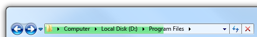

In this example, the sluggish looking progress animation in the Windows Explorer address bar makes some tasks look painfully slow.

Animations and transitions have no value if their quality is so poor that they make the experience less smooth and less engaging. To maintain their quality, animations should be designed to degrade gracefully whenever sufficient system resources aren't available. Animations can degrade by having variations that require fewer resources (such as shorter lengths or lower frame rates), or even not running at all. Regardless of the resources available, make sure the animations have high quality and look like animations instead of software bugs.

Finally, if users believe that your program's animations and transitions detract from their productivity, there's a good chance that some users will want to turn them off. To support this ability, respect the option to **Turn off all unnecessary animations** found in the Windows Ease of Access Center.

### Attracting the right level of attention

While only some types of animations and transitions are specifically designed to attract the user's attention, they should be designed to attract the right level of attention to fulfill their purpose well. What are the different ways to attract attention, and how do you pick the right one?

**Animation effects**

Different animation effects attract different levels of attention. The following list summarizes the most common methods, starting with the most attention-getting:

-   **Rapid flashing.** Demands immediate attention. Can break users' concentration no matter where the flashing is occurring.
-   **Moderate flashing.** Same, but demands less attention with lower frequency.
-   **Bouncing.** Noticeable in peripheral vision, and relatively demanding in nature. Users are likely to notice, but can continue to concentrate elsewhere only if duration is short.
-   **Motion.** Noticeable in peripheral vision, but not demanding. However, complex or 3-D motions attract more attention than simple or 2-D motions. Users are likely to notice, but can continue to concentrate elsewhere.
-   **Moderate pulsing.** Noticeable but not distracting in peripheral vision. Users can continue to concentrate elsewhere. Can pulse brightness, colors, and sizes.
-   **Slow pulsing/glowing.** Noticeable but subtle. Attracts more attention than a static effect, but users might not notice the animation unless they are already looking.
-   **Fade.** Even less noticeable. Attracts more attention than a static effect, but users might not notice the animation unless they are already looking.
-   **Static highlight/gleam.** Noticeable if users choose to look, but doesn't demand attention if it is elsewhere.
-   **Ambient/natural.** Purposefully not noticeable by having a natural, real-world appearance.

To determine the right approach for your program or feature, consider how these factors relate to your feature's scenarios.

For example, suppose you are designing an instant message program and someone just sent the user a message. This scenario requires the user's attention, it should be noticeable anywhere, and usually the user will want to respond quickly. This scenario suggests that a moderate flashing animation would be a good choice. By contrast, suppose you want to inform users that a print job has completed. Users should be able to continue to concentrate and work productively elsewhere, and it's acceptable if users don't notice. This scenario suggests that moderate to slow pulsing or glowing would be a good choice.

**Duration**

The appropriate duration for an attention getting animation depends upon the scenario and the specific type of animation used. The more attention an animation effect demands, the shorter the duration should be. While very subtle effects that demand little attention (like slow pulsing) can be played indefinitely, attention demanding effects should only be played between 1 and 3 seconds. Anything longer risks making the animation overwhelming and annoying.

In Windows 7, the taskbar flashes for attention for only a second. Any longer would be annoying.

**Effect decay**

You should design attention-getting animations based on the assumption that if users don't respond right away, it is because they are busy doing something else and don't want to be interrupted. Thus, your goal should be to attract attention without demanding it.

To get the right balance of attracting attention without demanding it, decay the intensity of an effect over time. For example, to attract attention you can make the effect initially strong, but then slow down the effect quickly. By doing so, the attractive power is mostly determined by the initial effect, but the user's overall impression is determined mostly by its finish.

In Windows 7, the taskbar flash effect slows down at the end.

### What about PowerPoint?

Microsoft PowerPoint transitions often deliberately violate these guidelines because they are designed to draw attention to slide transitions and require users to wait for them. Furthermore, they don't have any particular meaning so they communicate nothing beyond the fact that a slide is changing.

PowerPoint-style transitions, when used properly, have these purposes:

-   They break long presentations into smaller chunks by forcing the presenter to pause.
-   They draw the audience's attention toward changes in the presentation, helping people refocus if their minds have wondered.
-   They give the presentation a rhythm so that it doesn't feel monotonous or overwhelming.
-   Their style reflects the personality of the presenter or of the material.

While these are important goals for a presentation, such transitions would draw unnecessary attention in the UI of most types of programs, and would become tiresome quickly.

**Bottom line:** Don't use PowerPoint-style transitions as a model for your program.

**If you do only six things...**

1.  Use animations and transitions to make your program easier to understand, and feel smoother and more engaging. They should have a clear purpose. Don't use animations just because you can, or to draw unnecessary attention to your program.
2.  Define an animation vocabulary and use it consistently throughout your program. Use the Windows 7 animation vocabulary when appropriate.
3.  Use the characteristics of your animations to give your program personality and reinforce its brand.
4.  Make most animations simple, brief, and subtle. Remember that animations don't have to demand attention to be successful. If an animation is appropriate and natural, users will only notice its absence.
5.  Make your animations fast and responsive, and give them a lightweight feel. No matter how engaging your animations are, nobody is going to want to feel like they are waiting for them. Design heavier animations to have graceful degradation.
6.  Design for the long run. If an animation is annoying, distracting, or tiresome, redesign it or remove it.

## Usage patterns

Animations have several usage patterns:

|   Usage                                                                                                               |   Description                                     |
|------------------------------------------------------------------------------------------------------------------|----------------------------------------------------------------------------------------------------------------------------------------------------------------------------------------------------------------------------------------------------------------------------------------------------------------------------------------------------------------------------------------------------------------------------------------------------------------------------------------------------------------------------------------------------------------------------------------------------------------------------------------------------------------------------------------------|
| **Hover feedback**  to show where the interaction point is.                                  | Indicates that the interaction point is active. hover can be shown through a static effect as well.  windows vocabulary: display hover effect (bounding rectangle, highlight, enlargement) with a fade in/fade out effect for smoothness.     In the Zune digital media player, album covers highlight and add playback controls on hover.                                                                                                                                                                                                                  |
| **Click feedback**  to show that a clickable object is responsive and received a click.      | Indicates that an object has been clicked.  windows vocabulary: flash object background on click down event. to show touch contact, use a ripple effect.     Touch displays a ripple animation so that the user knows the interaction was recognized.                                                                                                                                                                                                                                                                                                          |
| **Selection feedback**  to show that an object is selected.                                  | Indicates that an object is selected. selection can be shown through a static effect as well.  windows vocabulary: draw selection rectangle with a fade in/fade out effect for smoothness.     In Zune, album covers blink on click, and then get a selection rectangle on selection.                                                                                                                                                                                                                                                                       |
| **Progress feedback**  to show that a task is being performed.                               | Progress feedback indicates that a task is making progress, typically with activity indicators, progress bars, or animations that illustrate the task. determinate progress feedback shows roughly how much of the task has been done and how much remains, whereas indeterminate progress only indicates that the task is being done.  windows vocabulary: spinning activity indicators, progress bars, progress backgrounds, illustration animations.   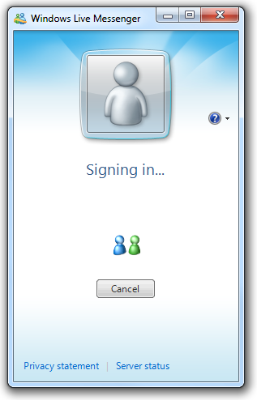  In this example, Windows Live Messenger displays indeterminate progress feedback during sign-in.  |
| **Attractor**  to show that something needs the user's attention.                            | Attract the right level of attention when significant objects are created or need attention (often due to change), or important or urgent events happen. see [attracting the right level of attention](#attracting-the-right-level-of-attention) for design techniques.  windows vocabulary: flashing, moving, pulsing, glowing, gleam.     The Windows Live toolbar animates on first appearance to make it obvious where it is.                                                                                                                                  |
| **Relationship**  to show the relationship between objects or causality in effects.          | Show relationships, especially when the relationship might not be understood or expected, in a way that's not distracting or confusing.  windows vocabulary: morphing, transportation, physical change such as flipping over, growing from a point source, shrinking to a point destination.     In this example, the animation shows the relationship between the gamma setting and its affect on the display.                                                                                                                                                     |
| **Illustration/Preview**  to explain visually a concept, task, or the effect of a command.   | An animation or video that explains a concept or how something works visually, either to supplement or replace a textual explanation. doing so allows users to perform tasks or choose commands efficiently and confidently.     In this example, the Tablet PC Input Panel "show me" commands use illustrations to show how to correct, delete, split, and join.                                                                                                                                                                                                         |

 

Transitions have several usage patterns:

|      Usage                                                                                                                                                                                                      |    Description                                                                                                                                                                                                                |
|------------------------------------------------------------------------------------------------------------------------------------------------------------------------------------------------------------|--------------------------------------------------------------------------------------------------------------------------------------------------------------------------------------------------------------------------------------------------------------------------------------------------------------------------------------------------------------------------------------------------------------------------------------------------------------------------------------------------------------------------------------------------------------------------------------------------------------------------------------------------------------------------------------------------------------------------------------------------------------------------------------------------------------------------------------------------------------------------------------------------------------------------------------------------------------------------------------------------|
| **Object grow/shrink/appear**  to change an object's size or state smoothly.                                                                                                           | Object changes between states, possibly while moving. transition keeps users oriented during changes.  windows vocabulary: morph, change size, object slides in or out.   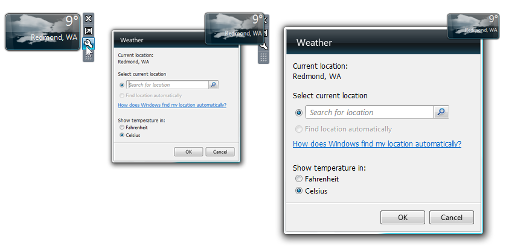  In this example, the Weather Gadget morphs from its concise state to display its Options dialog box.                                                                                                                                                                                                                                                                                                                                                                                                                                                                                                                                                                                     |
| **Content show/hide/change**  to show, hide, or change content smoothly, typically for progressive disclosure.                                                                         | Window interior reshapes to display more, less, or different content. transition keeps users oriented during changes.  windows vocabulary: pane slides in or out. flyout windows fade in and out. different content fades or rolls in.   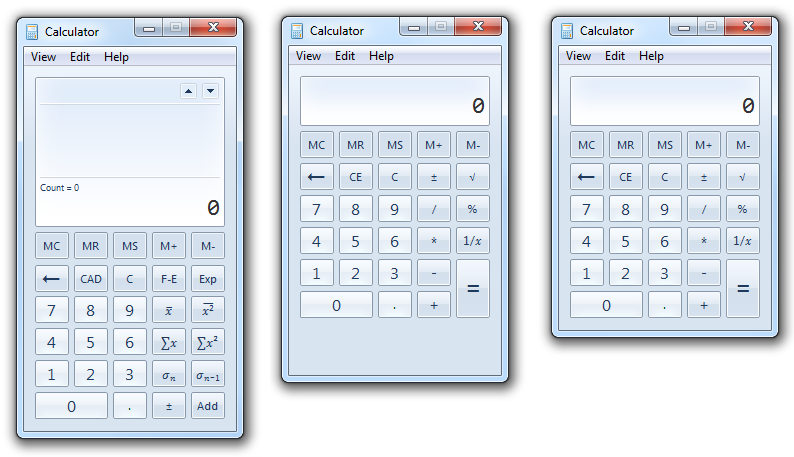  The Windows Calculator has a smooth transition between view modes.                                                                                                                                                                                                                                                                                                                                                                                                                                                                                                                                                             |
| **Control or affordance show/hide**  to smoothly show or hide controls or their affordances on hover or mouse move in order to simplify the normal visual appearance.                  | Display controls when users are hovering the pointer over a command area, or display affordances when users are hovering over a control. hovering over these areas indicates that the user intends to interact. affordances may hide if the pointer becomes stationary.     In this example, the Windows Media Player controls fade in on hover when in full screen mode.                                                                                                                                                                                                                                                                                                                                                                                                                                                                                                         |
| **Scene transitions**  to make a scene transition smooth and seamless in order to avoid attention.                                                                                     | Abrupt scene changes can be jarring, especially for large screen areas, so use scene transitions to create smoothness and continuity, and to provide context. scene transitions are designed to be natural and low key, to avoid calling attention to the process of transition itself.  windows vocabulary: fade in/out; cross fade; sliding in/left, out/right, up, down; pushes and covers.     In this example, the Windows desktop wallpaper gently cross-fades between images to make the transition feel smooth and controlled.                                                                                                                                                                                                                                                                                                                                |
| **Special scene transitions**  to draw attention to a scene change to make it special or refocus the user's attention.                                                                 | While most scene transitions should not call attention to the process of transition, some are designed to break the flow and draw attention in order to emphasize that something different is about to happen. to draw attention, special scene transitions are designed to be unnatural and have high visual impact.     In this example, PowerPoint uses attention-getting transitions to draw the audience into the change.                                                                                                                                                                                                                                                                                                                                                                                                                                            |
| **Direct manipulations**  to show the effect of direct manipulations (such as move, scroll/pan, rotate, and zoom).                                                                     | The transition shows the effect of the manipulation in real time. the effect should feel smooth, continuous, and consistent with the real world. moving and rotating may not be continuous in some places to indicate restrictions or likely preferred choices. zooming makes content larger or smaller, possibly changing the level of detail accordingly.     In this example, Magnifier zooms smoothly between levels.                                                                                                                                                                                                                                                                                                                                                                                                                                                            |
| **Incorrect direct manipulations**  to indicate that a direct manipulation (such as move, scroll/pan) was attempted but could not be done.                                             | The transition shows the manipulation being attempted, but reverts back to the original state. often the effect looks like the manipulation can't be performed due to some real-world physical restriction. these animations are used instead of text-based error messages, which would disrupt the real-world feel of the manipulation.  windows vocabulary: bounce     In this example, the document bounces to show that the user has reached the end.                                                                                                                                                                                                                                                                                                                                                                                                                |
| **Sort, filter, reorder transitions**  to indicate that the presentation or content of a collection of items has changed.                                                              | The transition shows (or for complex changes, suggests) the effect of the change.     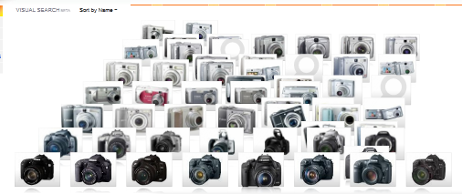    in this example, bing visual search uses a filter transition.    In this example, Windows Media Center uses a reorder transition as a special experience while a song is playing.                                                                                                                                                                                                                                                                                    |
| **Performance transitions**  to make an action appear to happen faster.                                                                                                                | While any transition has the potential for making an action appear to happen faster, the primary purpose of these transitions is to improve the perception of performance and responsiveness. a good technique is to show the task being performed in deliberate steps. by contrast, delaying the action, rendering the results in a haphazard manner, or using an activity indicator will feel slow.  windows vocabulary: perform action in stages, with smooth transitions between the stages.     In this example, a taskbar Jump List immediately displays the standard items, and then slides out to display the destinations once the list is ready. Doing so disguises the time required to build the list. By contrast, delaying the initial display would feel unresponsive, and displaying an incomplete list or progress feedback would feel much slower.  |
| **Special experiences**  to engage and delight users during infrequent, [special experiences](glossary.md) that are important to your program and have the user's full attention.      | While any transition has the potential for being a special experience, these transitions are best reserved for infrequent experiences that are truly special to your program. custom transitions are used to give a special feel. branding and personality are often important design elements. unlike other patterns, special experiences can demand attention, be heavy, and require users to wait a moment. consequently, these transitions wear out quickly if overused because the experience is no longer special.     In this example, Windows Media Center displays an animation while loading to immediately engage users.                                                                                                                                                                                                                                       |

 

## Guidelines

### Effective communication

-   **Define and use an animation vocabulary** to ensure that your animations and transitions have a consistent meaning, and use it consistently throughout your program. Most vocabularies should include entries for scene and object appearance and disappearance, navigation, basic interaction (hovering, selecting, clicking), object manipulation and interaction (moving, dropping, resizing, scrolling, panning, zooming, rotating, filtering), and attracting attention. Consistent meaning is crucial to effective communication.
-   **Whenever practical, use the Windows animation vocabulary.** While your program may have a different audience and different needs, often the benefits of consistency and familiarity outweigh the benefits of being different. If your program's vocabulary must be different, use the same basic animation types as Windows, but give them the right personality for your program.
-   **Don't assign specific meanings to generic animations and transitions in an animation vocabulary.** Generic transitions like fades and special effects like dissolves have no particular meaning (beyond appear or disappear), so they can be used freely.

    **Incorrect:**

    

    In this example, a cross-fade is incorrectly used to navigate to the next item. Because cross-fades have no particular meaning, this transition doesn't provide context.

-   **Make vocabulary entries clearly distinct.** Related actions may have similar effects (for example, zooming in and zooming out should have inverse transitions), but unrelated actions should have clearly distinct effects (for example, zooming should never be confused with rotating).
-   **Keep real-world effects realistic and consistent.** If you use realistic animations and transitions, keep the experience consistent with the real world. Users should never be surprised, confused, or mislead by the results. And for consistency, don't mix metaphors.
-   **Give inverse actions inverse animations.** Doing so meets user expectations and simplifies the vocabulary. For example, if a pane appears by sliding in, remove it by sliding out not with some other effect.
-   **Make animations comprehensible.** Users should be able to understand quickly the purpose of an animation. It's possible to make an animation too small, too brief (less than 50 milliseconds), or so subtle that users aren't able to comprehend their purpose. In such cases, either redesign to make the meaning clear, or remove.

    **Incorrect:**

    

    In this example, the effect is so small and subtle that few users can comprehend its purpose. Better to redesign or remove.

### Patterns

**Hover feedback**

-   **To appear responsive, strive to play animation within 50 milliseconds of entering or leaving the hover state.**
-   **To appear fast, make the duration of hover animations less than 50 milliseconds.**
-   **Use a fade in/fade out of hover effect.** Doing so makes hover effects clearly distinct from click and selection feedback.

**Click feedback**

-   **To appear responsive, strive to play animation within 50 milliseconds of click down event.** Click up events don't need click feedback.
-   **To appear fast, make the duration of click animations less than 50 milliseconds.**
-   **Use a background flash or blink effect.** Doing so makes click effects clearly distinct from hover and selection feedback. Because clicking requires hovering, make click feedback a smooth addition to hover feedback.

**Selection feedback**

-   **To appear responsive, strive to play animation within 50 milliseconds of selection or deselection.**
-   **To appear fast, make the duration of selection animations less than 50 milliseconds.**
-   **Use a fade in/fade out selection rectangle effect.** Doing so makes selection clearly distinct from hover and click feedback.

**Progress feedback**

-   **Use an activity indicator when an action can't be performed within a second.** Doing so indicates that the command has been received.
-   **Use a progress bar when a task will take more than five seconds.** For more guidelines, see [Progress Bars](progress-bars.md).
-   **Use progress feedback animations that help users visualize the effect of long-running tasks.** Avoid unnecessary progress feedback animations if an animation doesn't communicate anything helpful, use a progress bar instead.
-   **Have clearly identifiable completion and failure states.** Users must be able to determine these final states quickly.
-   **Stop showing progress when the underlying task isn't making progress.** Users need to be able to determine if progress isn't being made, and react accordingly.

**Attractors**

-   **Use attractors with restraint.** Unless the information is urgent, critical, or otherwise likely to affect the user's immediate behavior, it's usually better to change state inconspicuously and let users discover the change on their own. [Solve distractions, not discoverability](/windows/desktop/uxguide/how-to-design-desktop-ux).

    

    In this example, the wireless network notification area icon uses an animation for critical problems, but lets users discover weak signals on their own.

-   **Choose an animation that draws the right level of attention.** Attractor animations should draw just enough attention to themselves to fulfill their purpose, but no more. If the user must act immediately, choose an effect that demands attention no matter where the user is looking. For other situations, refer to the [Attracting the right level of attention](#attracting-the-right-level-of-attention) section to get the right combination of attention, noticeability, and urgency.

    **Incorrect:**

    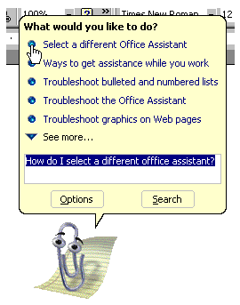

    The Microsoft Office Assistants attracted unnecessary attention to themselves.

-   **If the user doesn't respond, don't repeat the animation or use continuous animations.** Instead, assume that the user chose not to act now, but may act later. Continuous animations make it difficult for users to concentrate on anything else.

**Relationship animations**

-   **Use relationship animations to show where objects came from or where they went.**
-   **Relationship animations must start or end with the selected object.** Don't show relationships between objects the user isn't currently interacting with. If users notice at all, what they'll notice is the distraction.

**Illustrations/previews**

-   **Use previews to show the effect of a command without users having to perform it first.** By using helpful previews, you can improve the efficiency and ease of learning of your program, and reduce the need for trial-and-error.
-   **Use illustrations and previews that have a clear interpretation.** They have little value if confusing.
-   **Play only one illustration at a time** to avoid overwhelming users. If multiple simultaneous illustrations are possible, use mouse hover or a play button to let users indicate their interest.
-   **Play an illustration automatically if it is the main purpose of the window or page.** Otherwise, if it's optional, let users play it when they are ready.
-   **Play animations at the optimal speed**: not so fast they are difficult to understand, but not so slow they are tedious to watch.

**Object grow/shrink**

-   **Don't clip content during a resize.** Expand containers before adding content. Remove content before reducing containers.

    **Incorrect:**

    

    In this example, content is clipped during a resize.

**Content show/hide/change**

-   **Display important information statically.** Users shouldn't have to access important information through progressive disclosure.

**Control or affordance show/hide**

-   **Display important controls when the user positions the pointer anywhere within the window or pane, or, if full screen, on mouse move.** Users shouldn't have to hunt for these controls, so make their discovery certain.

    

    In this example, Windows Media Center displays its controls whenever the pointer is over the window.

-   **Display secondary controls or control affordances when the user positions the pointer on or near the commands.** For easy discoverability, make the location obvious and the target large.

    

    In this example, Windows Live Messenger displays a secondary command when the pointer is near the upper right corner.

**Scene transitions**

-   **Make physical scene transitions consistent with natural mapping.** People read from left to right in Western cultures, and hierarchical diagrams flow from top to bottom. Consequently, going forward in time is indicated by left-to-right movement. The following physical scene transitions have natural mapping:

    | Transition                          | Meaning                                     |
    |---------------------------|--------------------------------------|
    | From left       | Move back in task flow     |
    | From right      | Move forward in task flow  |
    | From top        | Move up task hierarchy     |
    | From bottom     | Move down task hierarchy   |

 

-   **If your program plays sound, design scene transitions and audio transitions together.** For example, if a scene fades out gradually, any sound should fade gradually as well. Don't ruin seamless visual transitions by having abrupt sound transitions. For more sound guidelines, see [Sound](vis-sound.md).

**Direct manipulations**

-   **When using physical gestures in the interaction (like tossing), design the animation to feel like a natural response to the gesture.** Link the interaction cause with the transition effect. Give the animation real-world physical characteristics such as acceleration, deceleration, momentum, resistance, weight, bounce, and rotation.
-   **To maintain a direct feel, keep an object's contact points under the pointer smoothly throughout the interaction.** Any lag, choppy response, or loss of contact destroys the perception of direct manipulation. Objects should never disappear while being manipulated.

**Sort, filter, or reorder transitions**

-   **For simple changes, show the entire transition.** Users will be able to follow the entire transition easily. Simple changes involve four items or fewer.
-   **For complex changes, emphasize the end of the motion as it slows down, and let the eye fill in the rest.** Doing so makes the motion feel much more responsive and orderly.

**Performance transitions**

-   **Consider performing slow transitions in two or three stages to make them appear faster and immediately interactive.** Use the following composition order when appropriate:
    -   External frame
    -   Background
    -   Initial content (using a temporary representation if necessary)
    -   Primary controls (so that users can interact immediately)
    -   Secondary controls and any remaining UI elements
    -   Final content (if a temporary representation was used) Use transitions like fades and slides to make the composition appear smooth, orderly, and refined.

When scrolling in "Bird's eye" view, Bing maps display a temporary grid background. Doing so allows users to continue to scroll immediately, well before the final content is rendered.

**Special experience animations**

-   **Reconsider animated splash screens (as well as static splash screens).** Often splash screens just draw attention to how long a program takes to load, and they wear out their welcome quickly. While splash screens are acceptable if they are displayed only when user interaction isn't possible, whenever practical a better alternative is to design your program so that users can interact with it immediately, even while it is still loading.
-   **Provide a Skip Introduction command if an animated splash screen takes more than three seconds.** Clicking anywhere on the splash screen should also dismiss it. Alternatively, use a short version of the animation after an initial period.

### Performance

-   **Don't make users wait for your program's animations and transitions.** Use brief animations and transitions (less than 200 milliseconds) whenever practical. Use faster animations (100 milliseconds) for more frequent operations. Design longer animations (more than one second usually the progress feedback, illustration, and special experience patterns) so that users can continue to work while they are running.
-   **Design long-running animations to make it clear to users that they can interact while the animation is running.** Users won't attempt to continue to work if the visual clues suggest that they can't.

    

    In this example from Windows Internet Explorer, the low-key progress bar in the status bar suggests that users don't have to wait for completion before they can interact.

-   **Use lightweight animations for CPU-intensive tasks.** Doing so gives full processing power to the task. Furthermore, users won't perceive that the lightweight animation is the reason why the task is CPU-intensive.
-   **Don't display an activity indicator during an animation or transition.** Doing so destroys the effect. Design animations and transitions so that they are able to start right away.
-   **Design animations to degrade gracefully whenever there are insufficient system resources.** Animations can degrade by having variations that require fewer resources (such as shorter lengths or lower frame rates), or even not running at all. Regardless of the resources available, make sure the animations have high quality and look like animations instead of software bugs.

    **Incorrect:**

    

    In this example, the window restore transition is used even though there aren't sufficient system resources to play it well. Consequently, the frozen frame appears to be a bug. If the resources aren't available, it's better to just display the window without a transition.

### Animation characteristics

Well-designed animations and transitions generally have these characteristics:

-   **Brief duration.** Most animations should be between 100 and 300 milliseconds, preferably either 1/6 second (167 milliseconds) or 1/4 second (250 milliseconds). (Special experiences and progress feedback can be longer.) Use faster animation times for more frequent operations. Generally, longer animations take more time to complete, take more time to understand, and feel slow.
-   **Responsiveness.** Animations should start within 50 milliseconds of the initiating event or user action. Longer start times feel unresponsive.
-   **Acceleration/deceleration.** To look natural, most animation effects need to accelerate when starting and decelerate when stopping. To look responsive, design animations to have fast starts. To appear controlled, design animations to have soft landings at the end. While this applies to motion effects, it also applies to any effect that suggests movement, such as zooms and even fades.

    

    Most animations should have fast starts and soft endings to have a responsive, yet controlled feel.

-   **Motion.** Animations portraying motion in particular need to accelerate and decelerate, so don't use linear motion unless animation duration is very short. Motions should take the shorts path from beginning to end, without overshooting. The full motion path is not always required. When appropriate, emphasize the end of the motion as it slows down, and let the eye fill in the rest. Doing so makes the motion feel much more responsive and orderly. When animating the motion of several objects simultaneously, give them slightly different paths with slightly different timings to feel more natural.
-   **Frame rate.** Most animations should use a frame rate of 20 frames per second. If the animation is for a special experience or is related to the main purpose of the program, consider using a higher rate of 24   30 frames per second to improve smoothness and realism.
-   **Scale.** Design animations to work well across their entire range of intended usage. For example, page transitions should be designed to work for all page sizes.
-   **Personality.** Design animations to feel natural, subdued, and efficient rather than artificial, whimsical, or slow.

### Animated text

-   While you may display text using a transition, **don't continuously animate text.** Animated text is often distracting and more difficult to read than static text. **Exceptions:**
    -   You may animate text in situations where it is traditionally animated, and you provide an accessible alternative.
    -   You may animate text if the purpose of the text is primarily decorative.

In this example, Zune animates text but its purpose is primarily decorative. There isn't a problem if users don't carefully read the text.

### Reducing power consumption

-   **Design your animations to reduce power consumption.** When designed properly, animations shouldn't increase power consumption significantly. To reduce power consumption:
    -   **Stop animating when the display is off.** The display may be off for the purpose of saving power.
    -   **Don't use long-running animations that aren't user initiated.** Animations that use high-resolution periodic timers reduce the efficiency of processor power management. Also, be sure to disable any high-resolution periodic timers when the animations are complete.
    -   **Suspend all animations when the system becomes idle.** The period of user inactivity to become idle is determined by Power Options in Control Panel.

### Accessibility

-   **Don't use animation as the only way to convey essential information.** Animations should communicate information that is useful but not critical, because they aren't accessible to users with visual impairments.
-   **Make sure equivalent information is available through other means,** such as:

    -   **By inspection.** Users can determine equivalent information by looking at the screen or objects involved in the animation.
    -   **By simple interaction.** Users can determine equivalent information by hovering, clicking, or double clicking.

    

    The Bing home page has an initial animation that reveals several hot spots. Users can also display the hot spots by moving the cursor near them.

    Note that "equivalent information" doesn't mean identical information. The information might be in a different format or require simple deduction.

-   **When appropriate, set input focus on the object changed during a transition.** Doing so enables assistive technologies to detect where the change happened. But don't change input focus when the user is using the keyboard.
-   **Don't use animations or transitions that flash or resize objects quickly.** Flashing and rapid screen changes can cause problems for people with seizure impairments and other neurological disorders.
-   **Allow users to turn off your program's animations and transitions.** To support this ability, respect the Turn off all unnecessary animations option in the Ease of Access Center in Windows.

    **Developers:** You can determine if animations are enabled using the SystemParametersInfo API.

-   **Design tasks assuming that users will turn your program's animations off.** Make sure that doing so doesn't disrupt the task flow significantly.

For more accessibility guidelines, see [Accessibility](inter-accessibility.md).

## Documentation

-   Avoid referring to animations whenever possible. Instead, refer to the object being animated and, if necessary, the type of animation.
-   Don't refer to transitions, except in technical documentation. Instead, refer to the object in its final or initial state.
-   If the user explicitly initiates an animation, use the verb play; otherwise use the verb use for technical documentation.

Examples:

-   You'll know that an item needs your attention when its icon starts bouncing.
-   First, select the photos that you would like to print (note that the photos are enlarged upon selection).
-   Use a cross-fade transition to change an object's state seamlessly.

