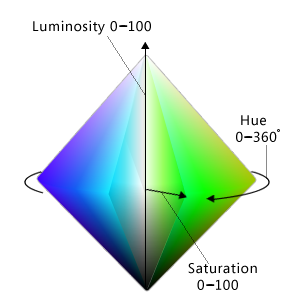
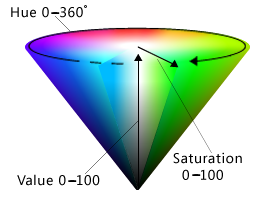
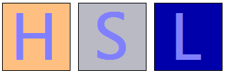
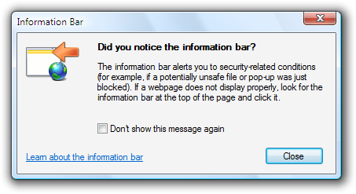

# Color

> [!NOTE]
> This design guide was created for Windows 7 and has not been updated for newer versions of Windows. Much of the guidance still applies in principle, but the presentation and examples do not reflect our [current design guidance](/windows/uwp/design/).

Color is an important visual element of most user interfaces. Beyond pure aesthetics, color has associated meanings and elicits emotional responses. To prevent confusion in meaning, color must be used consistently. To obtain the desired emotional responses, color must be used appropriately.

Color is often thought of in terms of a color space, where RGB (red, green, blue), HSL (hue, saturation, luminosity), and HSV (hue, saturation, value) are the most commonly used color spaces.

The RGB color space can be visualized as a cube.

While display technology uses RGB values and consequently developers often think of colors in terms of RGB, the RGB color space doesn't correspond to how people perceive color. For example, if you add red to dark cyan, the result isn't perceived as more red but as lighter cyan.

In this example, adding red to dark cyan makes it lighter, not more red. The RGB color space doesn't correspond to how people perceive color.

The HSL/HSV color spaces consist of three components: hue, saturation, and luminosity or value. These color spaces are often used instead of RGB because they better match how people perceive color.

The HSL color space forms a double cone that is white on the top, black on the bottom, and neutral in the middle:

-   **Hue:** The basic color in the color wheel, ranging from 0 to 360 degrees where both 0 and 360 degrees are red.

    

    The color wheel, where red is 0 degrees, yellow is 60 degrees, green is 120 degrees, cyan is 180 degrees, blue is 240 degrees, and magenta is 300 degrees.

-   **Saturation:** How pure (vs. dull) the color is, ranging from 0 to 100, where 100 is fully saturated and 0 is gray.
-   **Luminosity:** How light the color is, ranging from 0 to 100, where 100 is as light as possible (white, regardless of the hue and saturation) and 0 is as dark as possible (black).

    

    The HSL color space can be visualized as a double cone.

The HSV color space is similar, except that its space forms a single cone:

-   **Hue:** The basic color in the color wheel, ranging from 0 to 360 degrees where both 0 and 360 degrees are red.
-   **Saturation:** How pure (vs. dull) the color is, ranging from 0 to 100, where 100 is fully saturated and 0 is gray.
-   **Value:** How bright the color is, ranging from 0 to 100, where 100 is as bright as possible (which is half luminosity in the HSL space) and 0 is as dark as possible (black).

    

    The HSV color space can be visualized as a single cone.

In both HSL and HSV spaces, if saturation is 0 then luminosity specifies a shade of gray. In Windows, the HSL and HSV spaces are usually remapped to a scale between 0 to 240 so that colors can be represented with a 32-bit value.

**Note:** Guidelines related to [fonts](vis-fonts.md) and [accessibility](inter-accessibility.md) are presented in separate articles.

## Design concepts

Effective use of color can make your program's user interface (UI) more effective. Color can help users understand certain meanings at a glance. Color can also make your product appear more aesthetically pleasing and refined.

Unfortunately, it's all too easy to use color ineffectively, especially if you are not trained in visual design. Poor use of color results in designs that look unprofessional, dated, confusing, or just plain ugly. A poor use of color can be worse than not using color at all.

This section explains what you need to know to use color effectively.

### How color is used

Color is typically used in UI to communicate:

-   **Meaning.** The meaning of a message can be summarized through color. For example, color is often used to communicate status where red is a problem or error, yellow is caution or warning, and green is good.
-   **State.** An object's state can be indicated through color. For example, Windows uses color to indicate selection and hover states. Links within Web pages use blue for unvisited and purple for visited.
-   **Differentiation.** People assume that there is a relationship between items of the same color, so color coding is an effective way to differentiate between objects. For example, in a control panel item, task panes use a green background to visually separate them from the main content. Also, Microsoft Outlook allows users to assign different colored flags to messages.
-   **Emphasis.** Color can be used to draw users' attention. For example, Windows uses blue [main instructions](text-ui.md) to help them stand out from the other text.

Of course, color is often used in graphics for purely aesthetic reasons. While aesthetics are important, you should choose the colors of UI elements primarily based on what they mean, not how they look.

### Color interpretation

**Users' interpretation of color is often culturally dependent.** For example, in the United States, wedding attire for the bride is largely associated with the color white, while black is associated with funerals. However, long ago in Japan the color symbolism was just the opposite: white was the predominant color at funerals, and black was considered a color that brings good luck for weddings.

That said, **the interpretation of red, yellow, and green for status is consistent globally.** This is due to the [UNESCO Vienna Convention on Road Signs and Signals](https://www.unece.org/trans/conventn/signalse.pdf), which defines the worldwide convention for traffic lights (where red means stop, green means proceed, and yellow means proceed with caution). You can use these status colors without concern for culturally dependent interpretations.

Beyond the status colors, Windows assigns meanings to colors based on convention, as presented in the Guidelines section of this article. Be sure that your program's color usage is compatible with these color conventions.

### Color accessibility

Use of color affects the accessibility of your software to the widest possible audience. Users with blindness or low vision may not be able to see the colors well, if at all. Approximately 8 percent of adult males have some form of color confusion (often incorrectly referred to as "color blindness"), of which red-green color confusion is the most common.

The primary colors as seen with normal color vision.

The primary colors as seen with Protanopia (1% of male population).

The primary colors as seen with Deuteranopia (6% of male population).

The primary colors as seen with Tritanopia (1% of male population).

For more information, see [Can Color-Blind Users See Your Site?](/previous-versions/windows/internet-explorer/ie-developer/)

### Use color to reinforce visually

The best solution to the color interpretation and accessibility problems is to use color to visually reinforce the meaning of one of these primary methods of communication:

-   **Text.** Concise text is usually the most effective primary communication either directly on the UI or through a tooltip.

In this example, tooltip text is used to communicate an icon's meaning.

-   **Design.** Icons are easily distinguished by the designs, especially their outline shape.

In this example, the standard icons are readily distinguishable based on their designs.

-   **Location.** Relative location can also be used, but this approach is weaker than the alternatives. To be effective, the location should be standard and well known, as with traffic lights.

While color is the most obvious attribute of many designs, it must always be redundant.

### Designing with color

Ironically, the best way to design for color is to start by designing without color, using either [wireframes](glossary.md) or monochrome, and then add color later. Doing so helps ensure that information isn't being communicated using color alone. It also helps ensure that your printouts look great on monochrome printers.

### Use theme or system colors

While there are many complex factors in using color effectively, in Windows UI choosing color often boils down to simply choosing the appropriate [theme color](glossary.md) or [system color](glossary.md) according to a few simple rules. Users can then select and customize these color schemes as they choose.

By doing so, not only do you accommodate the color preferences of all your users, but you eliminate the burden of choosing the one perfect color scheme that works for all tastes, styles, and cultures (which, of course, is otherwise impossible).

**If you do only one thing...**

Choose colors by selecting the appropriate theme color or system color. Never use color as a primary method of communication, but as a secondary method to reinforce meaning visually. Design using wireframes or monochrome to help ensure that color is secondary.

### Use theme or system colors correctly

Assume that users choose theme or system colors based on their personal needs and that the theme or system colors are constructed appropriately. Based on this assumption, if you always choose theme or system colors based on their intended purpose and pair foregrounds with their associated backgrounds, the colors are guaranteed to be legible and respect users' wishes in all video modes, including [high-contrast mode](glossary.md). For example, the window text system color is guaranteed to be legible against the window background system color.

Specifically, always:

-   **Choose colors based on their purpose.** Don't choose colors based on their current appearance because that appearance can be changed by the user or future versions of Windows.
-   **Match foreground colors with their associated background colors.** Foreground colors are guaranteed to be legible only against their associated background colors. Don't mix and match foreground colors with other background colors, or worse yet, other foreground colors.
-   **Don't mix color types.** That is, always match theme colors with their associated theme colors, system colors with their associated system colors, and hardwired colors with other hardwired colors. For example, a theme text color isn't guaranteed to be legible against a hardwired background.
-   **If you must hardwire colors, handle high-contrast mode as a special case.**

**If you do only one thing...**

Always choose theme or system colors based on their intended purpose, and pair foregrounds with their associated backgrounds.

### Using other colors

While the Windows theme defines a comprehensive set of theme parts, you may find that your program needs colors that aren't defined in the theme file. While you could hardwire such colors, a better approach is to derive colors from the theme or system colors. Strategically using this approach gives you all the benefits of using theme and system colors, but with much more flexibility.

For example, suppose you need a window background that is darker than the theme window background color. In the HSL color space, having a darker color means a color with a lower luminosity. Thus, you can derive a darker window background color using the following steps:

-   Obtain the window background theme color RGB.
-   Convert the RGB to its HSL value.
-   Reduce the luminosity value (by, say, 20 percent).
-   Convert back to RGB values.

Using this approach, the derived color is guaranteed to be perceived as a darker shade of the original color (unless the original color was very dark to begin with.)

In this example, a darker window background color is derived from the theme color.

### Testing colors

To determine if your program's use of color is accessible and not used as a primary method of communication, we recommend using the [Fujitsu ColorDoctor](https://www.fujitsu.com/global/about/businesspolicy/tech/design/) or the [Vischeck](https://www.vischeck.com/) utilities to check for:

-   Overall dependency on color using the Gray scale filter.
-   Specific color confusion problems using the Protanopia, Deuteranopia, and Tritanopia filters.

To determine if your program's use of color is programmed correctly, test your program in the following modes:

-   Theming enabled using the default Windows theme.
-   Theming enabled using a non-default theme.
-   Theming disabled ("Windows Classic style" in the Theme Settings in the Personalization Control Panel item).
-   High Contrast Black (white text on a black background).
-   High Contrast White (black text on a white background).

All the screen elements should be legible and appear as expected, even immediately after mode changes.

## Guidelines

### General

-   **Never use color as a primary method of communication,** but as a secondary method to reinforce meaning visually.

### Using theme and system colors

-   Whenever possible, **choose colors by selecting the appropriate theme color or system color.** By doing so, you can always respect users' color preference.
-   **Choose theme and system colors based on their purpose.** Don't choose colors based on their current appearance, as that appearance can be changed by the user or future versions of Windows.
-   **Match foreground colors with their associated background colors.** Foreground colors are guaranteed to be legible only against their associated background colors. Don't mix and match foreground colors with other background colors, or worse yet, other foreground colors.
-   **Don't mix color types.** That is, always match theme colors with their associated theme colors, system colors with their associated system colors, and hardwired colors with other hardwired colors. For example, a theme text color isn't guaranteed to be legible against a hardwired background.
-   **If you must use a color that isn't a theme or system color:**
    -   **Prefer to derive the color from a theme or system color over hardwiring its value.** Use the process described earlier in this article, in Using other colors.
    -   **Handle high-contrast mode as a special case.**
-   **Handle theme changes.** Theme changes are handled automatically by windows with standard window frames and common controls. Windows with custom window frames, custom or owner-draw controls, and other use of color must handle theme changes explicitly.
    -   **Developers:** You can respond to theme change events by handling the WM\_THEMECHANGED message.

### Color meaning

-   While you should use theme and system colors (or derived colors) whenever you can, make sure any other use of color is compatible with the following use of color within Windows.

| Hue | Meaning | Use in Windows  |
|--------------------------------------|-------------------------------------------------------------------------------|-----------------------------------------------------------------------------------------------------------------------------------------------------------------|
| blue/green                 | Windows brand                                                       | Background: Windows branding.                                                                                                                         |
| glass, black, gray, white  | neutral                                                             | Background: standard window frames, Start menu, taskbar, Sidebar.  Foreground: normal text.                                                 |
| blue                       | start, commit                                                       | Background: default command buttons, search, log on.  Icons: information, Help.  Foreground: main instructions, links.            |
| red                        | error, stop, vulnerable, critical, immediate attention, restricted  | Background: status, stopped progress (progress bars).  Icons: error, stop, close window, delete, required input, missing, unavailable.      |
| yellow                     | warning, caution, questionable                                      | Background: status, paused progress (progress bars).  Icons: warning                                                                        |
| green                      | go, proceed, progress, safe                                         | Background: status, normal progress (progress bars).  Icons: go, done, refresh.  Foreground: Paths and URLs (in search results).  |
| purple                     | visited                                                             | Foreground: visited links (for links within Windows Internet Explorer and documents).                                                                 |

 

-   **To avoid communicating the previous meanings, choose colors have high mid to low saturation and high or low luminosity.** Users associate the previous meanings to colors that have full or high saturation and mid-level luminosity, so you can avoid these associations by choosing different shades.

In this example, there are three different shades of yellow, but only the highly saturated, mid-level luminosity shade communicates warning. The yellow folder icon doesn't feel like a warning.

### Using color with data

-   When helpful, **assign color to data to help users differentiate it.** Note that users will assume that data with similar colors have similar meanings.
-   **Assign colors by default that are easy to distinguish.** Generally, colors are easy to distinguish if they are far apart from each other in the HSL/HSV color spaces, while maintaining high contrast with their background:
    -   When choosing colors, prefer triad harmonies or complementary hues, but not adjacent hues.

        

        In this example, if the first color assignment is red, the next color should be blue, green, or cyan, but not magenta, purple, orange, or yellow.

    -   Colors have high contrast if there is a large difference in their hue, saturation, or luminosity.

        

        In this example, the light blue base color contrasts with backgrounds with large differences in hue, saturation, or luminosity.

    -   Using a white or very light background makes contrasting foreground colors easier to distinguish.

        

        In this example, white and light background colors make the foreground color easier to distinguish.

-   **Allow users to customize these color assignments** because color choice is subjective and a personal preference. If there are many coordinated colors, allow users to change them as a group using color schemes.
-   **Allow users to label these color assignments.** Doing so helps make them easier to identify and find.
-   **Unlike UI colors, data should not change when the system colors change.**

## Documentation

-   **Refer to UI elements by their names, not by their colors.** Such references aren't accessible and the system colors may change. If a UI element's name isn't well known or not descriptive enough, show a screenshot to clarify.

**Correct:**

**Incorrect:**

In the incorrect example, the message refers to the Windows Internet Explorer information bar by its color instead of its name.

