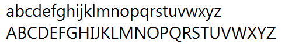
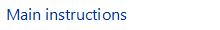
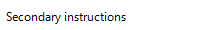
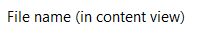
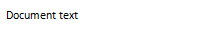
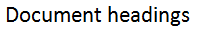

# Fonts

> [!NOTE]
> This design guide was created for Windows 7 and has not been updated for newer versions of Windows. Much of the guidance still applies in principle, but the presentation and examples do not reflect our [current design guidance](/windows/uwp/design/).

Users interact with text more than with any other element in Microsoft Windows. Segoe UI (pronounced "SEE-go") is the Windows system font. The standard font size has been increased to 9 point.

The Segoe UI font.

Segoe UI and Segoe are not the same font. Segoe UI is the Windows font intended for user interface text strings. Segoe is a branding font used by Microsoft and partners to produce material for print and advertising.

Segoe UI is an approachable, open, and friendly typeface, and as a result has better readability than Tahoma, Microsoft Sans Serif, and Arial. It has the characteristics of a humanist sans serif: the varying widths of its capitals (narrow E and S, for instance, compared with Helvetica, where the widths are more alike, fairly wide); the stress and letterforms of its lowercase; and its true italic (rather than an "oblique" or slanted roman, like many industrial-looking sans serifs). The typeface is meant to give the same visual effect on screen and in print. It was designed to be a humanist sans serif with no strong character or distracting quirkiness.

Segoe UI is optimized for ClearType, which is on by default in Windows. With ClearType enabled, Segoe UI is an elegant, readable font. Without ClearType enabled, Segoe UI is only marginally acceptable. This factor determines when you should use Segoe UI.

Segoe UI includes Latin, Greek, Cyrillic, and Arabic characters. There are new fonts, also optimized for ClearType, created for other character sets and uses. These include Meiryo for Japanese, Malgun Gothic for Korean, Microsoft JhengHei for Chinese (Traditional), Microsoft YaHei for Chinese (Simplified), Gisha for Hebrew, and Leelawadee for Thai, and the ClearType Collection fonts designed for document use.

Meiryo includes Latin characters based on Verdana. Malgun Gothic, Microsoft JhengHei, and Microsoft YaHei use a customized Segoe UI. Use of italic versions of these fonts is not recommended. Malgun Gothic, Microsoft JhengHei, and Microsoft YaHei are supplied in regular and bold styles only, meaning italic characters are synthesized by slanting the upright styles. Although Meiryo includes true italic and bold italics, these styles only apply to the Latin characters the Japanese characters remain upright when italic styling is applied.

A variation of Meiryo, called Meiryo UI, is preferred in the [ribbons](cmd-ribbons.md) command user interface.

To support locales using these character sets, Segoe UI is replaced with the correct fonts depending on each locale during the [localization](glossary.md) process.

To license Segoe UI and other Microsoft fonts for distribution with a Windows-based program, contact [Monotype](https://www.monotype.com/).

**Note:** Guidelines related to [style and tone](text-style-tone.md) and [user interface text](text-ui.md) are presented in separate articles.

## Design concepts

### Fonts, typefaces, point sizes, and attributes

In traditional typography, a font describes a combination of a typeface, a point size, and attributes. A typeface is the look of the font. Segoe UI, Tahoma, Verdana, and Arial are all typefaces. Point size refers to the size of the font, measured from the top of the ascenders to the bottom of the descenders, minus the internal spacing (called leading). A point is roughly 1/72 inch. Finally, a font can have attributes of bold or italic.

Informally, people often use font in place of typeface as done in this article but technically, Segoe UI is a typeface, not a font. Each combination of attributes is a unique font (for example, 9 point Segoe UI regular, 10 point Segoe UI bold, and so on).

### Serif and sans serif

Typefaces are either serif or sans serif. Serif refers to small turns that often finish the strokes of letters in a font. A sans serif typeface doesn't have serifs.

Readers generally prefer serif fonts used as body text within a document. The serifs provide a feeling of formality and elegance to a document. For UI text, the need for a clean appearance and the lower resolution of computer monitors makes sans serif typefaces the better choice.

### Contrast

Text is easiest to read when there is a large difference between the luminance of the text and the background. Black text on a white background gives the highest contrast dark text on a very light background can provide high contrast as well. This combination is best for primary UI surfaces.

Light text on a dark background offers good contrast, but not as good as dark text on a light background. This combination works well for secondary UI surfaces, such as Explorer task panes, that you want to de-emphasize relative to the primary UI surfaces.

**If you want to make sure users read your text, use dark text on a light background.**

### Affordances

Text can use the following [affordances](glossary.md) to indicate how it is used:

-   **Pointer.** The I-bar ("text select") pointer indicates that the text is selectable, whereas the left-pointing arrow ("normal select") pointer indicates that text isn't.
-   **Caret.** When text has input focus, the caret is the flashing vertical bar that indicates the insertion/selection point in selectable or editable text.
-   **Box.** A box around text that indicates that it's editable. To reduce the weight of the presentation, the box may be displayed dynamically only when the editable text is selected.
-   **Foreground color.** Light gray indicates that text is disabled. Non-gray colors, especially blue and purple, indicate that text is a link.
-   **Background color.** A light gray background weakly suggests that text is read-only, but in practice read-only text can have any color background.

These affordances are combined for the following meanings:

-   **Editable.** Text displayed in a box, with a text select pointer, a caret (on input focus), and usually on a white background.
-   **Read-only, selectable.** Text with a select pointer and a caret (on input focus).
-   **Read-only, non-selectable.** Text with an arrow pointer.
-   **Disabled.** Light gray text with an arrow pointer, sometimes on a gray background.

Read-only text traditionally has a gray background, but a gray background isn't necessary. In fact, a gray background can be undesirable, especially for large blocks of text, because it suggests that the text is disabled and discourages reading.

### Accessibility and the system font, sizes, and colors

The guidelines for making text accessible to users with disabilities or impairments can be boiled down to one simple rule: Respect the user's settings by always using the system font, sizes, and colors.

**If you do only one thing...**

Respect the user's settings by always using the system font, sizes, and colors.

**Developers:** From code, you can determine the system font properties (including its size) using the GetThemeFont API function. You can determine the system colors using the GetThemeSysColor API function.

Because you can't make any assumptions about users' system theme settings, you should:

-   Always base your font colors and backgrounds off system theme colors. Never make your own colors based on fixed RGB (red, green, blue) values.
-   Always match system text colors with their corresponding background colors. For example, if you choose COLOR\_STATICTEXT for the text color, you must also choose COLOR\_STATIC for the background color.
-   Always create new fonts based on proportional-sized variations of the system font. Given the system font metrics, you can create bold, italic, larger, and smaller variations.

**A simple way to ensure that your program respects users' settings is to test using a different font size and a high contrast color scheme.** All text should resize and display correctly in the chosen color scheme.

## Usage patterns

Text has several usage patterns:

|    Usage                                         |    Description                            |
|-----------------------------------------------------------------------------------------------------------------------------------------------------------------------------------------------------------------------------------------------------------|-------------------------------------------------------------------------------------------------------------------------------------------------------|
| **Title bar text**  Text on the title bar that identifies the window.                                                                                                                                                                 |                                                                              |
| **Main instructions**  Text that explains what to do on a page, window, or dialog box.                                                                                                                                                |                                                                      |
| **Secondary instructions**  Supplemental text that explains what to do on a page, window, or dialog box.                                                                                                                              |                                                                 |
| **Normal text**  Ordinary (read-only) text displayed in a user interface.                                                                                                                                                             |                                                                                 |
| **Emphasized text**  Bold text is used to make the text easier to parse and to draw attention to text users must read. italic text is used to refer to text literally (instead of quotation marks) and to emphasize specific words.   |                                                                             |
| **Editable text**  Text that users can edit is shown in a box. to reduce the weight of the presentation, the box may be displayed only when the editable text is selected.                                                            |                                                                               |
| **Disabled text**  Text that doesn't apply to the current context, such as labels for disabled controls. disabled text indicates that users (normally) shouldn't bother reading the text.                                             |                                                                               |
| **Links**  Text used to navigate to another page, window, or help topic, or initiate a command.                                                                                                                                       |     |
| **Group header**  Text used to group items in a list view.                                                                                                                                                                            |                                                                          |
| **File name**  File name text (in content view only).                                                                                                                                                                                 |                                                           |
| **Document text**  Text used in documents (as opposed to ui text).                                                                                                                                                                    |                                                                              |
| **Document headings**  Text used as a heading within a document.                                                                                                                                                                      |                                                                     |

 

## Guidelines

### Fonts and colors

-   **The following fonts and colors are defaults for Windows Vista and Windows 7.**

| Pattern | Theme symbol | Font, Color |
|-----------------------------------------------------------------------------------------------|-----------------------------|------------------------------------------------------------|
|                      | CaptionFont       | 9 pt. black (\#000000) Segoe UI                  |
|              | MainInstruction   | 12 pt. blue (\#003399) Segoe UI                  |
|         | Instruction       | 9 pt. black (\#000000) Segoe UI                  |
|                         | BodyText          | 9 pt. black (\#000000) Segoe UI                  |
|                     | BodyText          | 9 pt. black (\#000000) Segoe UI, bold or italic  |
|                       | BodyText          | 9 pt. black (\#000000) Segoe UI, in a box        |
|                       | Disabled          | 9 pt. dark gray (\#323232) Segoe UI              |
|                           | HyperLinkText     | 9 pt. blue (\#0066CC) Segoe UI                   |
|                 | Hot               | 9 pt. light blue (\#3399FF) Segoe UI             |
|                  |                             | 11 pt. blue (\#003399) Segoe UI                  |
|   |                             | 11 pt. black (\#000000) Segoe UI                 |
|                      | (none)            | 9 pt. black (\#000000) Calibri                   |
|             | (none)            | 17 pt. black (\#000000) Calibri                  |

 

-   **Choose fonts and optimize window layouts based on the UI technology and the target version of Windows:**

| UI technology | Target Windows version | Fonts to use and optimize for |
|--------------------------------------------|-------------------------------------------------------|------------------------------------------------------------------------------------------------------------------------------------------------------------------------------------------------------------------------------------------------------------------------------------------------------------------------------------------------------------------|
| Windows Presentation Foundation  | All                                         | Use WPF theme parts.                                                                                                                                                                                                                                                                                                                                   |
| Win32 or WinForms                | Windows Vista or later                      | Use the appropriate Segoe UI font.                                                                                                                                                                                                                                                                                                                     |
|                                            | Extensible components or pre-Windows Vista  | To target Windows XP and Windows 2000, use the 8 point MS Shell Dlg 2 pseudo font, which maps to Tahoma.  To target earlier versions of Windows, use 8 point MS Shell Dlg pseudo font, which maps to Tahoma on Windows 2000 and Windows XP, and to MS Sans Serif on Windows 95, Windows 98, Windows Millennium Edition, and Windows NT 4.0.  |

 

-   **Developers:**
    -   For elements that use fixed layout (such as Windows dialog templates and WinForms), hard code the appropriate font from the preceding table.
    -   For elements that use dynamic layout (such as Windows Presentation Foundation), use the theme fonts. Use theme APIs like DrawThemeText to draw text based on the theme symbol. Be sure to have an alternative based on system metrics in case the theme service isn't running.
-   **For Segoe UI, use a 9 point font size or larger.** The Segoe UI font is optimized for these sizes, so avoid using smaller sizes.
-   **Always match system text colors with their corresponding background colors.** For example, if you choose COLOR\_STATICTEXT for the text color, you must also choose COLOR\_STATIC for the background color.
-   **Always create new fonts based on proportional-sized variations of the system font.** Given the system font metrics, you can create bold, italic, larger, and smaller variations.
-   Display large blocks of read-only text (such as license terms) against a light background instead of a gray background. Gray backgrounds suggest that the text is disabled and discourages reading.
-   **Consider a maximum line length of 65 characters** to make the text easy to read. (Characters include letters, punctuation, and spaces.)

### Attributes

-   Most UI text should be plain without any attributes. Attributes may be used as follows:
    -   **Bold.** Use in control labels to make the text easier to parse. Use sparingly to draw attention to text users must read. Using too much bold lessens its impact.
    -   **Italic.** Use to refer to text literally instead of quotation marks. Use sparingly to emphasize specific words. Use for [prompts](glossary.md) in [text boxes](ctrl-text-boxes.md) and [editable drop-down lists](/windows/desktop/uxguide/ctrl-drop).
    -   **Bold italic.** Don't use.
    -   **Underline.** Don't use except for links. Use italic instead for emphasis.
-   Not all fonts support bold and italic, so they should never be crucial to understanding the text.

