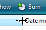

# Graphic Elements

> [!NOTE]
> This design guide was created for Windows 7 and has not been updated for newer versions of Windows. Much of the guidance still applies in principle, but the presentation and examples do not reflect our [current design guidance](/windows/uwp/design/).

*Graphic elements* show relationships, hierarchy, and emphasis visually. They include backgrounds, banners, glass, aggregators, separators, shadows, and handles.

An example with several types of graphic elements.

Graphic elements are usually not interactive. However, separators are interactive for resizable content and handles are graphics that show interactivity.

**Note:** Guidelines related to [group boxes](ctrl-group-boxes.md), [animations](vis-animations.md), [icons](vis-icons.md), and [branding](exper-branding.md) are presented in separate articles.

## Is this the right user interface?

While graphic elements are a strong visual means of indicating relationships, overusing them adds visual clutter and reduces the space available on a surface. They should be used sparingly.

A design trend in Microsoft Windows is a simpler, cleaner appearance by eliminating unnecessary graphics and lines.

To decide whether a graphic element is necessary, consider these questions:

-   **Is the design's presentation and communication just as clear and effective without the element?** If so, remove it.
-   **Can you effectively communicate the relationships using layout alone?** If so, use [layout](vis-layout.md) instead. You can place related controls next to each other and put extra spacing between unrelated controls. You can also use indenting to show hierarchical relationships.

In this example, layout alone is used to show control relationships.

-   **Is the communication effective without text?** If not, use a [group box](ctrl-group-boxes.md), labeled separator, or other [label](text-ui.md).

## Usage patterns

Graphic elements have several usage patterns:

| Element                                                                                                              |   Description                                                                                                                                                                                                                                                                                                                                                                                                                                                                                                           |
|---------------------------------------------------------------------------------------------------------------|-----------------------------------------------------------------------------------------------------------------------------------------------------------------------------------------------------------------------------------------------------------------------------------------------------------------------------------------------------------------------------------------------------------------------------------------------------------------------------------------------------------------|
| **Graphic illustrations**  use to communicate an idea visually.                           | Graphic illustrations are similar to icons except that they can be any size and usually aren't interactive.     In this example, a graphic illustration is used to suggest the nature of a feature.                                                                                                                                                                                                         |
| **Backgrounds**  use to emphasize or de-emphasize different types of content.             | Backgrounds can be used to emphasize important content.     in this example, a background is used to emphasize an important task.  backgrounds can also be used to de-emphasize secondary content.     In this example, secondary tasks are de-emphasized by locating them in a task pane.    |
| **Banners**  used to indicate important status.                                           | In contrast to backgrounds, banners emphasize primarily a single text string.     In this example, a banner is used to indicate that the page's settings are controlled by Group Policy.                                                                                                                                                                                                        |
| **Glass**  use strategically to reduce the visual weight of a window.                     | Glass can reduce the weight of a surface by focusing on the content instead of the window itself.     In this example, glass focuses the user's attention on the content instead of the controls.                                                                                                                                                                                                  |
| **Aggregators**  use to create a visual relationship between strongly related controls.   |   in this example, an aggregator background is used to emphasize the relationship between the back and forward buttons in explorer.    In this example, a boundary aggregator is used to emphasize the relationship among the controls, and make them feel like a single control instead of eight.  |
| **Separators**  use to separate weakly related or unrelated controls.                     | Separators can be either interactive or non-interactive. interactive separators between resizable content are known as splitters.     in this example, an interactive separator is used for resizable content.    In this example, the separator isn't interactive.                   |
| **Shadows**  use to make content stand out visually against its background.               |   In this example, shadows make the artwork stand out against the background.                                                                                                                                                                                                                                                                                                                                    |
| **Handles**  use to indicate that an object can be moved or resized.                      | Handles are always interactive and their behavior is suggested by the mouse pointer on hover.       In these examples, handles indicate that an object can be resized.                                                                                                                        |

 

## Guidelines

### General

-   **Don't convey essential information through graphic elements alone.** Doing so presents accessibility issues for users with visual disabilities or impairments.

### Graphic designs

-   **Graphics are most effective when they reinforce a single simple idea.** Complex graphics that require thought to interpret don't work well. Hieroglyphics are best left for cave drawings.

    **Incorrect:**

    

    In this example, a complex graphic from Windows XP ineffectively attempts to explain a complex trust decision.

-   **Don't use arrows, chevrons, button frames, or other affordances associated with interactive controls.** Doing so invites users to interact with your graphics.
-   **Avoid swaths of pure red, yellow, and green in your designs.** To avoid confusion, reserve these colors to communicate status. If you must use these colors for something other than status, use muted tones instead of pure colors.
-   **Use culturally neutral designs.** What may have a certain meaning in one country, region, or culture may not have the same meaning in another.
-   **Avoid using people, faces, gender, or body parts, as well as religious, political, and national symbols.** Such images may not easily translate or could be offensive.
-   **When you must represent people or users, depict them generically;** avoid realistic depictions.

### Backgrounds and banners

-   **To emphasize content, use dark text on a light background.** Black text on a light gray or yellow background works well.

    

    In this example, the link gets the user's attention because it is on a yellow background.

-   **To de-emphasize content, use light text on a dark background.** White text on a dark gray or blue background works well.

    

    In this example, the dark background de-emphasizes the content.

-   **If a gradient is used, make sure that the text color has good contrast across the entire gradient.**
-   **Always use a 16x16 pixel icon to draw attention to the banner.** Banners are too easy to overlook otherwise. For more guidelines and examples, see [Standard Icons](vis-std-icons.md).
-   **Use backgrounds and banners with caution.** While the intent of the background or banner may be to emphasize content, quite often the results are the opposite a phenomenon known as "banner blindness."

### Glass

-   **Consider using glass strategically in small regions touching the window frame without text.** Doing so can give a program a simpler, lighter, more cohesive look by making the region appear to be part of the frame.
-   **Don't use glass in situations where a plain window background would be more attractive or easier to use.**

### Separators

-   **Use vertical and horizontal lines for separators.** Be sure to have sufficient space between the separators and the content being separated.
-   For separators between sizable content (splitters), display the resize pointer on hover.

In these examples, resize pointers are shown on hover.

### Shadows

-   **Use only to make your program's most significant content or objects being dragged stand out visually against its background.** Consider shadows to be visual clutter in other circumstances.

### High dpi support

-   **Support 96 and 120 dots per inch (dpi) video modes.** Detect the dpi mode at startup and handle dpi change events. Windows is optimized for 96 and 120 dpi, and uses 96 dpi by default.
-   **Prefer to provide separate bitmaps rendered specifically for 96 and 120 dpi over scaling graphics.** At least provide 96 and 120 dpi versions for the most important, visible bitmaps, and either center or scale the others. Such applications are considered "high-dpi aware" and provide a better overall visual experience than programs that are automatically scaled by Windows.
    -   Developers: You can declare a program high-dpi aware (and prevent automatic scaling) setting the dpi aware flag in the program's manifest, or by calling the SetProcessDPIAware() API during program initialization. You can use macros to simplify selecting the right graphics. For Win32 bitmaps, you can use SS\_CENTERIMAGE to center or SS\_REALSIZECONTROL to scale.
-   Check your program in both 96 and 120 dpi for:
    -   Graphics that are too small or too large.
    -   Graphics being clipped, overlapped, or otherwise not fitting properly.
    -   Graphics that are poorly stretched ("pixilated").
    -   Text that is clipped or not fitting in graphic backgrounds.

## Text

-   **For accessibility and localization, don't use any text in graphics.** Make exceptions only to represent [branding](exper-branding.md) and text as an abstract concept.

 

