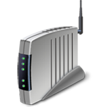

# Icons (Design basics)

> [!NOTE]
> This design guide was created for Windows 7 and has not been updated for newer versions of Windows. Much of the guidance still applies in principle, but the presentation and examples do not reflect our [current design guidance](/windows/uwp/design/).

Icons are pictorial representations of objects, important not only for aesthetic reasons as part of the visual identity of a program, but also for utilitarian reasons as shorthand for conveying meaning that users perceive almost instantaneously. Windows Vista introduces a new style of iconography that brings a higher level of detail and sophistication to Windows.

**Note:** Guidelines related to [standard icons](vis-std-icons.md) are presented in a separate article.

## Design concepts

Aero is the name for the user experience of Windows Vista, representing both the values embodied in the design of the aesthetics, as well as the vision behind the user interface (UI). Aero stands for: authentic, energetic, reflective, and open. Aero aims to establish a design that is both professional and beautiful. The Aero aesthetic creates a high quality and elegant experience that facilitates user productivity and even drives an emotional response.

Windows Vista icons differ from Windows XP-style icons in the following ways:

-   The style is more realistic than illustrative, but not quite photorealistic. Icons are symbolic images they should look better than photorealistic!
-   Icons have a maximum size of 256x256 pixels, making them suitable for high-dpi (dots per inch) displays. These high-resolution icons allow for high visual quality in list views with large icons.
-   Wherever practical, fixed document icons are replaced by thumbnails of the content, making documents easier to identify and find.
-   Toolbar icons have less detail and no perspective, to optimize for smaller sizes and visual distinctiveness.

Well-designed icons:

-   Improve the visual communication of your program.
-   Strongly impact users' overall impression of your program's visual design, and appreciation for its fit-and-finish.
-   Improve usability by making programs, objects, and actions easier to identify, learn, and find.

The following images depict what makes the Aero style of iconography in Windows Vista different from that used in Windows XP.

The Windows Vista icons (the lock and key on the left) are authentic, crisp, and detailed. They are rendered rather than drawn, but are not completely photorealistic.

The Windows Vista icons (the two on the left) are professional and beautiful, with attention to details that improve icon production quality.

These Windows Vista icons show optical balance and perceived accuracy in perspective and details. This allows them to look great big or small, up-close or from a distance. Moreover, this style of iconography works for high-resolution screens.

These examples show different types of icons, including a three-dimensional object in perspective, a front-facing (flat) icon, and a toolbar icon.

## Guidelines

### Perspective

-   **Icons in Windows Vista are either three-dimensional and shown in perspective as solid objects, or two-dimensional objects shown straight-on.** Use flat icons for files and for objects that are actually flat, like documents or pieces of paper.

    

    Typical 3D and flat icons.

-   **Three-dimensional objects are represented in perspective as solid objects, seen from a low birds-eye view with two vanishing points.**

    

    This example shows perspective and vanishing points typical of 3D icons.

-   **In the smaller sizes, the same icon may change from perspective to straight-on.** At the size of 16x16 pixels and smaller, render icons straight-on (front-facing). For larger icons, use perspective.

    -   **Exception:** Toolbar icons are always front-facing, even in larger sizes.

    

    This example shows how the same icon is treated differently, depending on size.

### Light source

-   **The light source for objects within the perspective grid is above, slightly in front of, and slightly to the left of the object.**
-   **The light source casts shadows that are slightly to the rear and right of the object's base.**
-   **All light rays are parallel, and strike the object along the same angle (like the sun).** The goal is to have a uniform lighting appearance across all icons and spotlight effects. Parallel light rays produce shadows that all have the same length and density, providing further unity across multiple icons.

### Shadows

**General**

-   **Use shadows to lift objects visually from the background, and to make 3D objects appear grounded, rather than awkwardly floating in space.**
-   **Use an opacity range of 30-50 percent for shadows.** Sometimes a different level of shadow should be used, depending on the shape or color of an icon.
-   **Feather or shorten the shadow if necessary, to keep it from being cropped by the icon box size.**
-   **Don't use shadows in icons at 24x24 or smaller sizes.**

    

    Typical icon shadows.

**Flat icons**

-   **Flat icons are generally used for file icons and flat real-world objects,** such as a document or a piece of paper.
-   **Flat icon lighting comes from the upper-left at 130 degrees.**
-   **Smaller icons (for example, 16x16 and 32x32) are simplified for readability.** However, if they contain a reflection within the icon (often simplified), they may have a tight drop shadow. The drop shadow ranges in opacity from 30-50 percent.
-   **Layer effects can be used for flat icons, but should be compared with other flat icons.** The shadows for objects will vary somewhat, according to what looks best and is most consistent within the size set and with the other icons in Windows Vista. On some occasions, it may even be necessary to modify the shadows. This will especially be true when objects are laid over others.
-   **A subtle range of colors may be used to achieve desired outcome.** Shadows help objects sit in space. Color impacts the perceived weight of the shadow, and may distort the image if it is too heavy.

The Drop Shadow option in the Layer Style dialog box, and a typical shadow for a flat icon.

**Basic flat icon shadow ranges**

| Characteristic                              | Range                                                         |
|-------------------------------|----------------------------------------------------------|
| Color               | Black                                          |
| Blend mode          | Multiply                                       |
| Opacity             | 22-50 percent, depending on color of the item  |
| Angle               | 120-130 (use global light)                     |
| Distance            | 3 for 256x256, ranging down to 1 for 32x32     |
| Spread              | 0                                              |
| Size                | 7 for 256x256, ranging down to 2 for 32x32     |

 

**Three-dimensional icons**

-   Create shadows for 3D icons on a case-by-case basis, with an effort to fit within a range of cast distance and feathering to fully transparent. Create the images in a size a bit smaller than the overall icon size demands to allow space for a drop shadow (for those sizes that will require one). Make sure the shadow doesn't end abruptly at the edge of the icon.

These examples help demonstrate variations created based on the shape and position of the object itself. The shadow sometimes needs to be feathered or shortened to keep it from being cropped by the icon box size.

### Color and saturation

-   **Colors are generally less saturated than they were Windows XP.**
-   **Use gradients to create a more realistic looking image.**
-   **Although there is no specific color palette for standard icons, remember that they need to work well together in many contexts and themes.** Prefer the standard set of colors; don't re-color standard icons, such as warning icons, because this disrupts users' ability to interpret meaning. For more guidelines, see [Color](vis-color.md).
-   **Icon files require 8-bit and 4-bit palette versions as well,** to support the default setting in a remote desktop. These files can be created through a batch process, but they should be reviewed, as some will require retouching for better readability.

    

    There is no strict color palette restriction. Only full-saturation (top right) is avoided.

-   Bit levels: ICO design for 32-bit (alpha included) + 8-bit + 4-bit (dithered down automatically pixel poke only most critical). Only a 32-bit copy of the 256x256 pixel image should be included, and only the 256x256 pixel image should be compressed to keep the file size down. Several icon tools offer compression for Windows Vista.
-   Bit levels: Toolbars 24-bit + alpha (1 bit mask), 8-bit and 4-bit.
-   Toolbars or AVI files: Use magenta (R255 G0 B255) as the background transparency color.

### Size requirements

**General**

-   **Pay special attention to high visibility icons,** such as main application icons, file icons that can appear in Windows Explorer, and icons appearing in the Start Menu or on the desktop.
    -   **Application icons and Control Panel items:** The full set includes 16x16, 32x32, 48x48, and 256x256 (code scales between 32 and 256). The .ico file format is required. For Classic Mode, the full set is 16x16, 24x24, 32x32, 48x48 and 64x64.
    -   **List item icon options:** Use live thumbnails or file icons of the file type (for example, .doc); full set.
    -   **Toolbar icons:** 16x16, 24x24, 32x32. Note that toolbar icons are always flat, not 3D, even at the 32x32 size.
    -   **Dialog and wizard icons:** 32x32 and 48x48.
    -   **Overlays:** Core shell code (for example, a shortcut) 10x10 (for 16x16), 16x16 (for 32x32), 24x24 (for 48x48), 128x128 (for 256x256). Note that some of these are slightly smaller but are close to this size, depending on shape and optical balance.
    -   **Quick Launch area:** Icons will scale down from 48x48 in Alt+Tab dynamic overlays, but for a more crisp version, add a 40x40 to .ico file.
    -   **Balloon icons:** 32x32 and 40x40.
    -   **Additional sizes:** These are useful to have on hand as resources to make other files (for example, annotations, toolbar strips, overlays, high dpi, and special cases): 128x128, 96x96, 64x64, 40x40, 24x24, 22x22, 14x14, 10x10, and 8x8. You can use .ico, .png, .bmp, or other file formats, depending on code in that area.

**For high dpi**

-   Windows Vista targets 96 dpi and 120 dpi.

The following tables show examples of scaling ratios applied to two common icon sizes. Note that not all of these sizes must be included in the .ico file. The code will scale larger ones down.

| dpi                   | Icon size                         | Scale factor                            |
|--------------------|--------------------------|-----------------------------|
| 96       | 16x16          | 1.0 (100%)        |
| 120      | 20x20          | 1.25 (125%)       |
| 144      | 24x24          | 1.5 (150%)        |
| 192      | 32x32          | 2.0 (200%)        |

 

| dpi                   | Icon size                         | Scale factor                            |
|--------------------|--------------------------|-----------------------------|
| 96       | 32x32          | 1.0 (100%)        |
| 120      | 40x40          | 1.25 (125%)       |
| 144      | 48x48          | 1.5 (150%)        |
| 192      | 64x64          | 2.0 (200%)        |

 

**.ico file sizes (standard)**

**.ico file sizes (special cases)**

**Annotations and overlays**

-   Annotations go in bottom-right corner of icon, and should fill 25 percent of icon area.
    -   **Exception:** 16x16 icons take 10x10 annotations.
-   Don't use more than one annotation over an icon.
-   Overlays go in bottom-left corner of icon, and should fill 25 percent of icon area.
    -   **Exception:** 16x16 icons take 10x10 overlays.

### Level of detail

-   16x16 size of many of these icons is still widely used and therefore important.
-   The details in an icon of this size must clearly show the key point of the icon.
-   As an icon gets smaller, transparency and some special details found in larger sizes should be sacrificed in order to simplify and get the point across.
-   Attributes and colors should be exaggerated and used to emphasize the key forms.

    

    At 16x16, the icon for the portable audio device could easily be mistaken for a cell phone so the ear piece is a key visual detail to show.

-   Simply scaling down from the 256x256 size does not work.
-   All sizes need relevant level of detail; the smaller the icon the more you need to exaggerate the defining details.

    

    

### Icon development

**Designing and producing icons**

-   **Hire an experienced graphic designer.** For great graphics, images, and icons work with experts. Experience in illustrations using vector art or 3D programs is recommended.
-   **Plan to do series of iterations,** from initial concept sketches, to in-context mock-ups, to final production review and fit-and-finish of icons in the working product.
-   **Think ahead icon creation can be expensive.** Gather all existing details and requirements, such as: the complete set of icons needed; the main function and meaning for each; families or clusters in the set you want to be apparent; brand requirements; the exact file names; image formats used in your code; and size requirements. Ensure up front that you can make the most of your time with the designer.
-   **Remember that the designer may not be familiar with your product, so provide functional information, screen shots, and spec sections, as appropriate.**
-   **Plan for geopolitical and legal reviews as appropriate.**
-   **Map out a timeframe and have regular communication.**

**From concept sketch to end-product**

-   Create concept sketches.
-   Try out the concept in different sizes.
-   Render in 3D if necessary.
-   Test sizes on different background colors.
-   Evaluate icons in the context of the real UI.
-   Produce final .ico file or other graphic resource formats.

**Tools**

-   **Pencil and paper:** Initial concept ideas, listed and sketched.
-   **3D Studio Max:** Render 3D objects in perspective.
-   **Adobe Photoshop:** Sketch and iterate, mock-up in context, and finalize details.
-   **Adobe Illustrator/ Macromedia Freehand:** Sketch and iterate, finalize details.
-   **Gamani Gif Movie Gear:** Produce .ico file (with compression if needed).
-   **Axialis Icon Workshop:** Produce .ico file (with compression if needed).
-   Microsoft Visual Studio doesn't support Windows Vista icons (there is no support for alpha channel or more than 256 colors).

**Production**

> [!TIP]
> Follow these steps to create a single .ico file that contains multiple image sizes and color depths.

**Step 1: Conceptualize**

-   Use established concepts where possible, to ensure consistency of meanings for the icon and its relevance to other uses.
-   Consider how the icon will appear in the context of the UI, and how it might work as part of a set of icons.
-   If revising an existing icon, consider whether complexity can be reduced.
-   Consider the cultural impact of your graphics. Avoid using letters, words, hands, or faces in icons. Depict representations of people or users as generically as possible, if needed.
-   If combining multiple objects into a single image in an icon, consider how the image will scale to smaller sizes. Use no more than three objects in an icon (two is preferred). For the 16x16 size, consider removing objects or simplifying the image to improve recognition.
-   Do not use the Windows flag in icons.

**Step 2: Illustrate**

-   To illustrate Windows Aero style icons, use a vector tool such as Macromedia Freehand or Adobe Illustrator. Use the palette and style characteristics as outlined earlier in this article.
-   Illustrate image using Freehand or Illustrator. Copy and paste the vector images into Adobe Photoshop.
-   Make and use a template layer in Photoshop to make sure that work is done within square regions of the regulated sizes.
-   Create the images in a size a bit smaller than the overall icon size demands to allow space for a drop shadow (for those sizes that require one).
-   Place images at the bottom of the squares, so that all icons in a directory are positioned consistently. Avoid cutting off shadows.
-   If you are adding another object to an image or a series, keep the main object in a fixed position, and place flat smaller sized images in a fixed position, such as the lower-left or upper-right depending on the case.

**Step 3: Create the 24-bit images**

-   Once you've pasted sizes in Photoshop, check the readability of images, especially at 16x16 and smaller sizes. Pixel-poking using percentages of colors may be required. Reduction of transparency may also be needed. It is common to exaggerate aspects at smaller sizes and to eliminate aspects as well, in order to focus on the key point.
-   The 8-bit icons will be displayed in any color mode lower than 32-bit and will not have the 8-bit alpha channel, so they may need to have their edges or more cleaned up because there's no anti-aliasing (edges may be jagged and image may be hard to read).
-   In Photoshop, duplicate the 24-bit image layer and rename the layer to 4-bit images. Index 4-bit images to the Windows 16 color palette.
-   Clean up images using only the colors from the 16 color palette. Outlines made from darker or lighter versions of the object's colors are usually preferable to grey or black.
-   If working on a bitmap, be sure that the background color isn't used in the image itself, because that color that will be the transparent color. Magenta (R255 G0 B255) is often used as the background transparency color.

**Step 4: Create the 8-bit and 4-bit images**

-   Now that the 24-bit images are ready to be made into 32-bit icons, 8-bit versions need to be created.
-   This is a great time to test contextual screen shots. It's amazing what can be discovered by viewing other icons or a family of icons in context. This step can save time and money. It is much better to catch issues before files go through production and are handed off.
-   Add the drop shadow to your images in sizes that require them.
-   Merge the drop shadow and the 24-bit images together.
-   Create a new Photoshop file for each size. Copy and paste the appropriate image. Save each file as a .psd file.
-   Do not merge the image layer with the background layer. It's helpful to include the size and color depth in the file name while working, but the file may ultimately need to be renamed.

**Step 5: Create the .ico file**

-   Choose the application that best meets needs and skills of artists. Remember that icons to be used in a shipping product must be created in a tool that has been purchased or licensed. This means that trial versions cannot be used.
-   Both of the products listed below have been used by designers who have produced icons for Windows Vista, and each offers the ability to export to Adobe Photoshop CS.
    -   Gamani Gif Movie Gear: Produce .ico file
    -   Axialis Icon Workshop: Produce .ico file
-   Visual Studio doesn't support Windows Vista icons (there is no support for alpha channel or more than 256 colors), so its use is not recommended.
-   Icon (.ico format) files must contain the 4- and 8-bit versions, as well as the 24-bit + alpha.
-   Save files as a "Windows icon (.ico)" no matter which icon creation program you choose to use.
-   Some iconographic assets may actually be bitmap strips, which also require an alpha channel (for example, for toolbars), or .png files saved with transparency. Not all are necessarily .ico format; check for what format is supported in code.

**Step 6: Evaluate**

-   Look at all sizes.
-   Look at the family together to evaluate family resemblance, optical balance, and distinction.
-   Look at in context to evaluate relative weights and visibility (make sure that one doesn't dominate).
-   Consider cases that may not be used now, but could be in the near future. Could this icon ever be annotated or have an overlay?
-   Look at in code.

### Icons in the context of list views, toolbars, and tree views

**List views**

-   For Windows Vista, use thumbnails for files holding content that is visually distinct at small scale, such that users can directly recognize the file they are looking for. (Use the Windows Thumbnailing application programming interface for this.)

    

-   Application icon overlays (not shown here) on thumbnails help association with the application for the file type, in addition to showing the file's preview.

**Note:** For files without visually distinct content, don't use thumbnails. Instead, use traditional symbolic file icons showing object representation and the associated application or type.

**Toolbars**

-   Icons that appear in a toolbar must have an optical balance in size, color, and complexity.
-   Test potential icons in a contextual screen shot to avoid any undesired dominance or imbalances.
-   Testing in screen shots easily helps avoid expensive iterations in code.
-   Review the icons in code as well. Motion and other factors can impact the success of an icon; in some cases further iterations may be needed.

In the above example, the optical balance has not yet been achieved.

Try iterations in context.

**Tree views**

-   Optical balance is needed to preserve the hierarchy in a tree view control.
-   Therefore, icons that are typically used in this context should be evaluated there. Sometimes a particular 16x16 icon should be made smaller because its shape has an optical dominance over others.
-   Compensation for optical imbalances is an important part of producing top quality icons.

 

