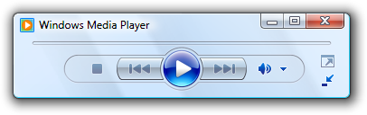
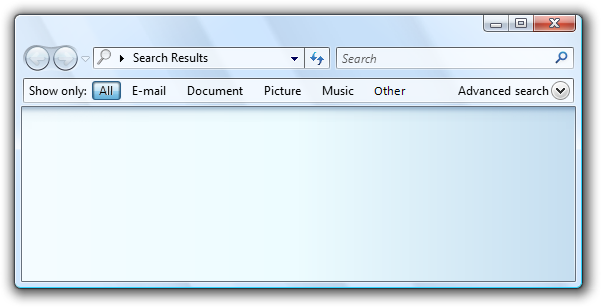
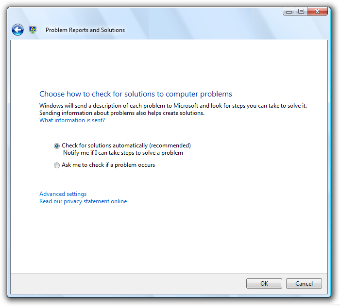
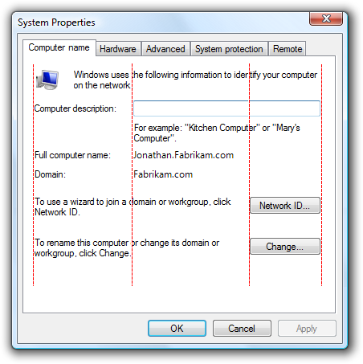
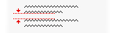

# Layout

> [!NOTE]
> This design guide was created for Windows 7 and has not been updated for newer versions of Windows. Much of the guidance still applies in principle, but the presentation and examples do not reflect our [current design guidance](/windows/uwp/design/).

Layout is the sizing, spacing, and placement of content within a window or page. Effective layout is crucial in helping users find what they are looking for quickly, as well as making the appearance visually appealing. Effective layout can make the difference between designs that users immediately understand and those that leave users feeling puzzled and overwhelmed.

**Note:** Guidelines related to [window management](win-window-mgt.md) are presented in a separate article. Recommended specific control sizing and spacing are presented in their respective guideline articles.

## Design concepts

### Visual hierarchy

A window or page has a clear visual hierarchy when its appearance indicates the relationship and priority of its elements. Without a visual hierarchy, users would have to figure out these relationships and priorities themselves.

Visual hierarchy is achieved by skillfully combining the following attributes:

-   **Focus.** The layout indicates where users need to look first.
-   **Flow.** The eye flows smoothly and naturally by a clear path through the surface, finding user interface (UI) elements in the order appropriate for their use.
-   **Grouping.** Logically related UI elements have a clear visual relationship. Related items are grouped together; unrelated items are separate.
-   **Emphasis.** UI elements are emphasized based on their relative importance.
-   **Alignment.** The UI elements have coordinated placement, so they are easy to scan and appear orderly.

Additionally, effective layout has these attributes:

-   **Device independence.** The layout appears as intended regardless of the font typeface or size, dots per inch (dpi), display, or graphic adaptor.
-   **Easy to scan.** Users can find the content they are looking for at a glance.
-   **Efficiency.** UI elements that are large need to be large, and elements that are small work well small.
-   **Resizability.** If helpful, a window is resizable and its content layout is effective no matter how large or small the surface is.
-   **Balance.** The content appears evenly distributed across the surface.
-   **Visual simplicity.** The perception that a layout is not more complicated than it needs to be. Users don't feel overwhelmed by the layout's appearance.
-   **Consistency.** Similar windows or pages use a similar layout, so users always feel oriented.

While sizing, spacing, and placement are simple concepts, the challenge with layout is to achieve the right mixture of these attributes.

In Windows, layout is communicated using device independent metrics such as dialog units (DLUs) and relative pixels.

### A design model for reading

**Users choose what they read by the content's appearance and organization.** To create an effective layout, you'll need to understand what users tend to read and why.

You can make layout decisions using this design model for reading:

-   People read in a left-to-right, top-to-bottom order (in Western cultures).
-   There are two modes of reading: immersive reading and scanning. The goal of immersive reading is comprehension.

    

    This diagram models immersive reading.

    By contrast, the goal of scanning is to locate things. The overall scan path looks like this:

    

    This diagram models scanning.

    

    If there is text running along the left edge of a page, users scan the left edge first.

-   When using software, users aren't immersed in the UI itself but in their work. Consequently, users usually don't read UI text they scan it. They then read bits of text comprehensively only when they believe they need to.
-   Users tend to skip over navigation panes on the left or right side of a page. Users recognize that they are there, but look at navigation panes only when they want to navigate.
-   Users tend to skip over large blocks of unformatted text without reading them at all.

    

    Users tend to skip over large blocks of text and navigation panes when they scan.

-   All things being equal, users first look in the upper left corner of a window, scan across the page, and end their scan in the lower right corner. They tend to ignore the lower left corner.

    

    All things being equal, users will read these numbers in the following order: 1, 2, 4, and 3.

-   But in interactive UI, not all things are equal so different UI elements receive different levels of attention. Users tend to look at interactive controls especially controls in the upper left and center of the window and prominent text first.

Users focus on the main interactive controls and the prominent main instruction, and look at other things only when they need to.

-   Users tend to read interactive control labels, especially those that appear relevant to completing the task at hand. By contrast, users tend to read static text only when they think they need to.
-   Items that appear different attract attention. Bold text and large text stands out from normal text. UI items with color or on a colored background stand out. Items with icons stand out from items without icons.
-   Users don't scroll unless they have a reason to. If the content [above the fold](glossary.md) doesn't provide a reason to scroll, they won't.
-   Once users have decided what to do, they immediately stop scanning and do it.
-   Because users stop scanning when they think they are done, they tend to ignore anything beyond what appears to be the point of completion.

Users stop scanning when they think they're done.

Of course, there will be exceptions to this general model. Eye tracking devices indicate that real users' behavior is quite erratic. The goal of this model is to help you make good decisions and tradeoffs, not to model user behavior accurately. But as you've read this list, hopefully you've recognized many of your own reading patterns, too.

### Designing for scanning

**Users don't read, they scan so you should design UI surfaces for scanning.** Don't assume that users will read the text as written in a left-to-right, top-to-bottom order but rather that they look at the UI elements that attract their attention.

To design for scanning:

-   Assume that users start by quickly scanning the whole window, then reading the UI elements in roughly the following order:
    -   Interactive controls in the center
    -   The commit buttons
    -   Interactive controls found elsewhere
    -   Main instruction
    -   Supplemental explanations
    -   Text presented with a warning icon
    -   Window title
    -   Other static text in main body
    -   Footnotes
-   Place UI elements that initiate a task in the upper-left corner or upper-center.
-   Place UI elements that complete a task in the lower-right corner.
-   Whenever possible, put crucial text on interactive controls instead of static text.
-   Avoid putting crucial information in the lower-left corner or at the bottom of a long scrollable control or page.
-   Don't present big blocks of text. Eliminate unnecessary text. Use the [inverted pyramid](text-ui.md) presentation style.
-   If you do something to attract users' attention, make sure that attention is warranted.

Whenever possible, work with this model rather than fighting it; but there will be times when you need to either emphasize or de-emphasize particular UI elements.

To emphasize primary UI elements:

-   Put primary UI elements in the [scan path](glossary.md).
-   Put any UI to initiate a task in the upper-left corner or upper-center.
-   Put commit buttons in the lower-right corner.
-   Put the remaining primary UI in the center.
-   Use controls that attract attention, such as command buttons, command links, and icons.
-   Use prominent text, including large text and bold text.
-   Put text users must read in interactive controls, or with icons, or on [banners](vis-graphic.md).
-   Use dark text on a light background.
-   Surround the elements with generous space.
-   Don't require any interaction, such as pointing or hovering, to see the element you are emphasizing.

    

    This example shows many ways to emphasize primary UI elements.

To de-emphasize secondary UI elements:

-   Put secondary UI elements outside the scan path.
-   Put anything users usually don't need to see in the lower-left corner or bottom of the window.
-   Use controls that don't attract attention, such as task links instead of command buttons.
-   Use normal or gray text.
-   Use light text on a dark background. White text on a dark gray or blue background works well.
-   Surround the elements with minimal space.
-   Consider using [progressive disclosure](ctrl-progressive-disclosure-controls.md) to hide secondary UI elements.

    

    This example shows many ways to de-emphasize secondary UI elements.

### Using screen space effectively

Using screen space effectively requires you to balance several factors: use too much space and a window feels heavy and wasteful, and even difficult to use based on [Fitts' Law](inter-mouse.md).

**Incorrect:**

In this example, the window is too large for its content.

On the other hand, use too little space and a window feels cramped, uncomfortable, and intimidating, and difficult to use if it requires scrolling and other manipulation to use.

**Incorrect:**

In this example, the window is too small for its content.

While critical UI must fit in the minimum supported [effective resolution](glossary.md), don't assume that using screen space effectively means that windows should be as small as possible they shouldn't be. **Effective layout has respect for open space and doesn't attempt to cram everything into the smallest space possible.** Modern displays have significant screen space and it makes sense to use this space effectively when you can. Consequently, err on the side of using too much screen space rather than too little. Doing so makes your windows feel lighter and more approachable.

You know a layout is using screen space effectively when:

-   Windows, window panes, and controls don't have to be resized to be usable. If the first thing users do is resize a window, pane, or control, its size is wrong.
-   Data isn't truncated. Most data in list views and tree views doesn't have ellipses, and data in other controls isn't clipped unless the data length is unusually large. Data that must be read to perform a task shouldn't be truncated.
-   The windows and controls are sized appropriately to eliminate unnecessary scrolling. There are few horizontal scrollbars and no unnecessary vertical scrollbars.
-   Controls mostly use their standard sizes. Strive to reduce the number of control sizes, by, for example, using only one or two command button widths on a surface.
-   The UI surface is balanced. There aren't large unused screen areas.

Choose window sizes that are just large enough to fulfill their purpose well. (And if the window is resizable, this goal applies to its default size.) **A combination of truncated data or scrollbars and plenty of available screen space is a clear sign of ineffective layout.**

### Control sizing

Usually the first step in using screen space effectively is to determine the right size for the various UI elements. Refer to the [Control sizing table](#recommended-sizing-and-spacing) as well as the recommended sizing in the specific control guideline articles.

Fitts' Law states that the smaller a target is, the longer it takes to acquire it with the mouse. Furthermore, for computers using Windows Tablet and Touch Technology, the "mouse" might actually be a pen or the user's finger, so you should consider alternative input devices when determining sizes for small controls. **A control size of 16x16 relative pixels is a good minimum size for any input device.** By contrast, the standard 15x9 relative pixel spin control buttons are too small to be used effectively by pens.

### Spacing

Providing generous (but not excessive) space makes the layout feel more comfortable and easier to parse. Effective space isn't unused space it plays an important role in improving the ability for users to scan, and also adds to visual appeal of your design. For guidelines, refer to the [Spacing table](#recommended-sizing-and-spacing).

For computers using Windows Tablet and Touch Technology, again the "mouse" might actually be a pen or the user's finger. Targeting is more difficult when using a pen or finger as the pointing device, resulting in users tapping outside the intended target. When interactive controls are placed very close together but are not actually touching, users may click on inactive space between the controls. Since clicking inactive space has no result or visual feedback, users are often uncertain what went wrong. If small controls are too closely spaced, the user needs to tap with precision to avoid tapping the wrong object. **To address these issues, the target regions of interactive controls should either be touching or have at least 3 DLUs (5 relative pixels) of space between them.**

You know a layout has good spacing when:

-   Overall, the UI surface feels comfortable and doesn't feel cramped.
-   The space appears uniform and balanced.
-   Related elements are close together and unrelated elements are relatively far apart.
-   There is no dead space between controls that are meant to be together, such as toolbar buttons.

### Resizable windows

Resizable windows are also a factor in using screen space effectively. Some windows consist of fixed content and don't benefit from being resizable, but windows with resizable content should be resizable. Of course, the reason users resize a window is to take advanced of the additional screen space, so the content should expand accordingly by giving more space to the UI elements that need it. Windows with dynamic content, documents, images, lists, and trees benefit the most from resizable windows.

In this example, resizing the window resizes the list view control.

That said, windows can be stretched too wide. For example, many control panel pages become unwieldy when the content is wider than 600 relative pixels. In this case, it's better not to resize the content area beyond this maximum width or change the content's origin as the window is resized larger. Instead, keep a maximum width and a fixed upper-left origin.

Text becomes difficult to read as the line length increases. For text documents, consider a maximum line length of 80 characters to make the text easy to read. (Characters include letters, punctuation, and spaces.)

**Incorrect:**

In this example, the long text length makes for difficult reading.

Finally, resizable windows also need to use screen space effectively when made smaller, by making resizable content smaller and by removing space from UI elements that can work effectively without it. At some point, the window or its UI elements become too small to be usable, so they should be assigned a minimum size or some elements should be removed completely.

In this example, the pane has a minimum size.

Some programs benefit from using a completely different presentation to make the content usable at smaller sizes.

In this example, Windows Media Player changes its format when the window becomes too small for the standard format.

### Focus

A layout has focus when there is one obvious place to look first. Focus is important to show users where to start scanning your window or page. Without clear focus, the user's eye will wander aimlessly. The focal point should be something important that users need to find and understand quickly, and should have the greatest visual emphasis. The upper-left corner is the natural focal point for most windows.

There should be only one focal point. Just as in real life, the eye can focus on only one thing at a time, users can't focus on multiple places simultaneously.

To make a UI element the focal point, you can give it visual emphasis by:

-   Placing it in the upper-left or upper-center portion of the surface.
-   Using interactive controls that are important and readily comprehensible.
-   Using prominent text, such as a main instruction.
-   Giving the controls default selection and initial input focus.
-   Placing the controls in a different colored background.

Consider Windows Search. The focal point for Windows Search should be the Search box because it is the starting point for the task. However, it is located in the upper-right corner to be consistent with the standard Search box placement. The Search box has input focus, but given its location in the scan path, that clue alone isn't sufficient.

To address this problem, there is prominent instruction in the upper-center portion of the window to direct users to the right location.

**Acceptable:**

In this example, a prominent instruction in the upper-center portion of the window directs users to the Search box.

Without the instructions, the window wouldn't have an obvious focal point.

**Incorrect:**

This example has no obvious focal point. Users don't know where to look.

If you give a UI element visual emphasis, make sure that attention is warranted. In the previous incorrect Windows Search example, the highlighted All button is in the upper-left corner and has the most visual emphasis, but it's not the intended focal point. Users may get stuck looking at this button trying to figure out what to do with it.

**Incorrect:**

Without the prominent instruction as the focal point, the highlighted All button is an unintentional focal point.

### Flow

A layout has flow when users are guided smoothly and naturally by a clear path through its surface, finding UI elements in the order appropriate for their use. Once users identify the focal point, they need to determine how to complete the task. The placement of the UI elements conveys their relationship and should mirror the steps to perform the task. Typically, this means the task's steps should flow naturally in a left-to-right, top-to-bottom order (in Western cultures).

You know a layout has good flow when:

-   The placement of the UI elements mirrors the steps users need to perform the task.
-   UI elements that initiate a task are in the upper-left corner or upper-center.
-   UI elements that complete a task are in the lower-right corner.
-   Related UI elements are together; unrelated elements are separate.
-   Required steps are in the main flow.
-   Optional steps are outside the main flow, possibly de-emphasized by using a suitable background or progressive disclosure.
-   Frequently used elements appear before infrequently used elements in the scan path.
-   Users always know what to do next. There are no unexpected jumps or breaks in the task flow.

**Incorrect:**

In this example, users don't know what to do next. There are unexpected jumps and breaks in the task flow.

**Correct:**

In this example, the presentation of the UI elements mirrors the steps to perform the task.

### Grouping

A layout has grouping when logically related UI elements have a clear visual relationship. Groups are important because it is easier for users to understand and focus on a group of related items than the items individually. Groups make a layout appear simpler and easier to parse.

You can show grouping in the following ways (in increasing heaviness):

-   **Layout.** You can group related controls next to each other and put extra spacing between unrelated controls.

    

    In this example, layout alone is used to show control relationships.

-   **Separators.** A separator is a horizontal or vertical line that unifies a group of controls. Separators provide a simpler, cleaner look. However, unlike group boxes, they work best when they span the full surface.

    

    In this example, labeled separators are used to show control relationships.

-   **Aggregators.** An aggregator is a graphic that creates a visual relationship between strongly related controls.

    

    In this example, a boundary aggregator is used to emphasize the relationship between the controls and make them feel like a single control instead of eight.

-   **Group boxes.** A group box is a labeled rectangular frame that surrounds a set of related controls.

    

    In this example, a group box surrounds and labels a set of related controls.

-   **Backgrounds.** You can use backgrounds to emphasize or de-emphasize different types of content.

    

    In this example, the control panel task pane is used to group related tasks and control panel items.

    To avoid visual clutter, the lightest weight grouping that does the job well is the best choice. For more information, see [Group Boxes](ctrl-group-boxes.md), [Tabs](ctrl-tabs.md), [Separators and Backgrounds](vis-graphic.md).

Regardless of the grouping style, you can use indenting to show the relationship of the controls within a group. Controls that are peers to each other should be left-aligned, and dependent controls are indented 12 DLUs or 18 relative pixels.

Dependent controls are indented 12 DLUS or 18 relative pixels, which by design is the distance between check boxes and radio buttons from their labels.

You know a layout has good grouping when:

-   The window or pages has at most 7 groups.
-   The purpose of each group is obvious.
-   The relationship of controls within each group is obvious, especially control dependency.
-   The grouping simplifies the content rather than making it more complex.

### Alignment

Alignment is the coordinated placement of UI elements. Alignment is important because it makes content easier to scan and affects users' perception of visual complexity.

There are several goals to consider when determining alignment:

-   **Ease in horizontal scanning.** Users can read horizontally and find related items next to each other, without any awkward gaps.
-   **Ease in vertical scanning.** Users can scan columns of related items and immediately find what they are looking for, with minimal horizontal eye movement.
-   **Minimal visual complexity.** Users perceive a layout to be visually complex if it has unnecessary vertical alignment grid lines.

### Horizontal alignment

**Left alignment**

Because of the left-to-right reading order, left alignment works well for most content. Left alignment makes columnar data easy to scan vertically.

**Right alignment**

Right alignment is the best choice for numeric data, especially [columns of numeric data](ctrl-text-boxes.md). Right alignment also works well for [commit buttons](glossary.md) as well as controls aligned with right window edge.

In this example, the Advanced search progressive disclosure control is right aligned because it is placed against the right window edge.

**Center alignment**

Center alignment is best reserved for situations where either left or right alignment is inappropriate or appears unbalanced.

In this example, the media player control is centered to give a balanced appearance.

Don't center window content just to fill space.

**Incorrect:**

In this example, content is incorrectly centered in a resizable window to fill space.

### Vertical alignment

**Element tops**

Because of the top-to-bottom reading order, top alignment works well for most content. Top alignment makes UI elements easy to scan horizontally.

**Text baselines**

When vertically aligning controls with text, align the text baselines to give a smooth horizontal reading flow.

**Correct:**

**Incorrect:**

In the correct example, the control and its label are vertically aligned by their text baselines.

You know a layout has good alignment when:

-   It is easy to scan both horizontally and vertically.
-   It has a simple visual appearance.

### Label alignment

The general alignment rules apply to control labels, but it is a common problem worthy of specific attention. Label alignment has these goals:

-   Ease in vertical scanning to find the right control.
-   Ease in horizontal scanning to associate labels with their controls.
-   Ease in localization, handling labels that differ in length across languages.
-   Works well with a mixture of different label lengths.
-   Makes efficient use of available space while avoiding truncated text.

The overall goal is to reduce the amount of eye movement required to find what users are likely looking for, but the nature of the controls and what users are looking for depends on the context.

There are four common label placement and alignment styles, each with its benefits:

-   Left-justified labels above controls
-   Left-justified labels on left of controls
-   Left-justified labels on left of controls, controls ragged on left
-   Right-justified labels on left of controls

**Left-justified labels above controls**

This style is the easiest to localize because the layout doesn't depend upon the length of the labels, but it takes the most vertical space.

This style takes the most vertical space but is easiest to localize. It's a better choice for labeling mostly interactive controls.

Best used when:

-   The controls being labeled are interactive (not just text).
-   The UI will be localized. This style often affords room to double or even triple the length of the label.
-   The UI is using a fixed layout technology (such as Win32).
-   There are ten or fewer controls. With more controls, the labels are hard to scan.
-   There is sufficient vertical space to accommodate the labels.
-   The layout needs to be free form, not just columns.

**Left-justified labels on left of controls**

This style is the easiest to scan vertically and it also works well when labels differ greatly in length, but it is harder to associate the label with its control. This style can use multi-line labels if necessary.

This style works well. However, there are two columns but visually it looks like there are four making the data appear more complex.

Best used when:

-   Users are likely to scan vertically to find specific labels.
-   Users aren't likely to read the labels and controls in a left-to-right, top-to-bottom manner.
-   There is sufficient horizontal space to accommodate the labels.
-   The labels vary significantly in length.
-   There are many controls, such as with forms.
-   There are few columns. Visually the labels and controls appear as two individual columns.

**Left-justified labels on left of controls, controls ragged on left**

This style makes it easy to scan the labels vertically and the labels and controls horizontally, and is very space efficient; but it is harder to scan the controls vertically. The controls are right-justified to take full advantage of the available space.

This style is compact and easy to read, but it's hard to scan controls vertically.

Best used when:

-   The UI is using a variable layout technology (such as Windows Presentation Foundation).
-   Users are likely to scan vertically to find specific labels.
-   Users are likely to read the labels and controls in a left-to-right, top-to-bottom manner.
-   Users aren't likely to scan the controls vertically.
-   The control text varies in length and would likely be truncated if another style were used.
-   The controls are read-only, such as read only text boxes. For other controls, this alignment will look sloppy. However, the controls may become editable on click.
-   There are many columns, but few controls in a column.

**Right-justified labels on left of controls**

This style is the easiest to read horizontally to associate the labels with their controls, but it is hard to scan the labels vertically and doesn't work well when labelsList with indented labels and controls differ greatly in length.

This style permits easy vertical scanning of the controls, but makes it hard to scan the labels vertically.

Best used when:

-   Users are likely to read the labels and controls in a left-to-right, top-to-bottom manner.
-   Users aren't likely to scan vertically to find specific labels, possibly because:
    -   There are few controls.
    -   The labels are well known.
    -   The controls are mostly self explanatory and are rarely blank (possibly having default values to prevent blank controls).
-   There is sufficient horizontal space to accommodate the labels.
-   The labels don't vary significantly in length.
-   There are many columns. Visually the labels and controls appear as a single column.

Before adopting any of these styles, however, consider two more factors:

-   Prefer a style that you can use consistently across your program.
-   Left-justified labels either above controls on left of controls are the most common styles, so they should be given preference.

### Balance

A window or page has balance when its content appears evenly distributed across its surface. If the surface physically had the same weighting as it has visually, a balanced layout wouldn't tip over to one side.

The most common balance problem is having too much content on the left side of a window or page. You can create balance in the following ways:

-   Using larger margins on the left side than the right.
-   Placing UI elements used to complete a task on the right.
-   Placing UI elements used throughout the task in the center.
-   Lengthening resizable or multi-line controls.
-   Using center-alignment strategically.

This well balanced wizard page layout shows a larger left margin than right to improve balance.

If these techniques don't achieve balance, consider reducing the width of the window or page to better match its content.

For resizable surfaces, don't center content just to achieve balance. Rather, maintain a fixed upper left origin, define a maximum surface area, and balance the content within the space used.

### Grids

A grid is an invisible underlying alignment system. Grids can be symmetrical, but asymmetric grids work just as well. When used by a single window or page, grids help organize content within a surface. When reused, grids create consistent layout across surfaces.

The number of grid lines affect the perception of visual complexity. A layout with fewer grid lines appears simpler than a layout with more grid lines.

**Visually complex:**

**Visually simple:**

Unnecessary grid lines create visual complexity.

You know a layout is using grids effectively when:

-   Windows or pages with similar content or function have similar layout.
-   Repeated design elements appear in similar locations across windows and pages.
-   There are no unnecessary vertical and horizontal alignment grid lines.

### Visual simplicity

Visual simplicity is the perception that a layout is not more complicated than it needs to be.

You know a layout has visual simplicity when it:

-   Eliminates unnecessary layers of window chrome.
-   Presents the content using at most seven easily identifiable groups.
-   Uses lightweight grouping, such as layout and separators instead of group boxes.
-   Uses lightweight controls, such as links instead of command buttons for secondary commands, and drop-down lists instead of lists for choices.
-   Reduces the number of vertical and horizontal alignment grid lines.
-   Reduces the number of control sizes, by, for example, using only one or two command button widths on a surface.
-   Uses progressive disclosure to hide UI elements until they are needed.
-   Uses sufficient space so that the window or page doesn't feel cramped.
-   Sizes windows and controls appropriately to eliminate unnecessary scrolling.
-   Uses a single font with a small number of sizes and text colors.

As a general rule, if a layout element can be eliminated without harming the effectiveness of the UI, it probably should be.

## Guidelines

### Screen resolution and dpi

-   **Support the minimum Windows effective resolution of 800x600 pixels.** For critical UIs that must work in safe mode, support an effective resolution of 640x480 pixels. Be sure to account for the space used by the taskbar by reserving 48 vertical [relative pixels](glossary.md) for windows displayed with the taskbar.
-   **Optimize resizable window layouts for an effective resolution of 1024x768 pixels.** Automatically resize these windows for lower screen resolutions in a way that is still functional.
-   **Be sure to test your windows in 96 dots per inch (dpi) (at 800x600 pixels), 120 dpi (at 1024x768 pixels), and 144 dpi (at 1200x900 pixels) modes.** Check for layout problems, such as clipping of controls, text, and windows, and stretching of icons and bitmaps.
-   **For programs with touch and mobile use scenarios, optimize for 120 dpi.** High-dpi screens are currently prevalent on touch and mobile PCs.

### Window size

-   **Choose a default window size appropriate for its contents.** Don't be afraid to use larger initial window sizes if you can use the space effectively.
-   **Use a balanced height to width aspect ratio.** An aspect ratio between 3:5 and 5:3 is preferred, although an aspect ratio of 1:3 can be used for message dialog boxes (such as errors and warnings).
-   **Use resizable windows whenever practical to avoid scroll bars and truncated data.** Windows with dynamic content, documents, images, lists, and trees benefit the most from resizable windows.
-   **For text documents, consider a maximum line length of 80 characters** to make the text easy to read. (Characters include letters, punctuation, and spaces.)
-   Fixed-sized windows:
    -   **Fixed-sized windows must be entirely visible and sized to fit within the work area.**
-   Resizable windows:
    -   **Resizable windows may be optimized for higher resolutions, but sized down as needed at display time to the actual screen resolution.**
    -   **Progressively larger window sizes must show progressively more information.** Make sure that at least one window portion or control has resizable content.
    -   **Keep the upper-left origin of the content fixed as the window is resized.** Don't move the origin to balance the content as the window size changes.
    -   **Set a maximum content size if the content can be too stretched too wide.** If the content becomes unwieldy, don't resize the content area beyond its maximum width or change the content's origin as the window is resized larger. Instead, keep a maximum width and a fixed upper-left origin.
    -   **Set a minimum window size if there is a size below which the content is no longer usable.** For resizable controls, set minimum resizable element sizes to their smallest functional sizes, such as minimum functional column widths in list views. Optional UI elements should be removed completely.
    -   **Consider altering the presentation to make the content usable at smaller sizes.**

        

        In this example, Windows Media Player changes its format when the window becomes too small for the standard format.

### Control size

-   **Make all interactive controls at least relative 16x16 pixels.** Doing so works well for all input devices, including Windows Tablet and Touch Technology.
-   **Size controls to avoid truncated data.** Don't truncate data that must be read to perform a task. Size list view columns to avoid truncated data.
-   **Size controls to eliminate unnecessary scrolling.** Make controls slightly larger if doing so eliminates a scrollbar. There should be few vertical scrollbars and no unnecessary horizontal scrollbars.

    

    In this example, the drop-down list is sized to eliminate the scrollbar.

-   **Reduce the number of control sizes on a surface.** Prefer using the [standard recommended control sizes](#recommended-sizing-and-spacing) and when necessary, use a few consistently sized larger or smaller controls. Try to use a single width for list boxes and tree views, and no more than three widths for command buttons and drop-down lists. However, text box and combo box widths should suggest the length of their longest or expected input.

    

    In this example, one list box and command button size is used consistently.

-   **For controls that are sized based on their text, include an additional 30 percent (up to 200 percent for shorter text) for any text that will be localized.** This guideline assumes the layout is designed using English text. Note also that this guideline refers to localized text, not numbers.
-   **Extend static text controls, check boxes, and radio buttons to the maximum width that will fit in the layout.** Doing so avoids truncation from variable length text and localization.

    **Incorrect:**

    

    In this example, control text is unnecessarily truncated.

### Control spacing

-   **If controls aren't touching, have at least 3 DLUs (5 relative pixels) of space between them.** Otherwise, users may click on inactive space between the controls. Since clicking inactive space has no result or visual feedback, users are often uncertain what went wrong.

### Placement

-   **Arrange the UI elements within a surface to flow naturally in a left-to-right, top-to-bottom order (in Western cultures).** The placement of the UI elements conveys their relationship and should mirror the steps to perform the task.
-   **Place UI elements that initiate a task in the upper-left corner or upper-center.** Give the UI element that users should look at first the greatest visual emphasis.
-   **Place UI elements that complete a task in the lower-right corner.**
-   **Place related UI elements together, and separate unrelated elements.**
-   **Place required steps in the main flow.**
-   **Place optional steps outside the main flow,** possibly de-emphasized by using a suitable background or progressive disclosure.
-   **Place frequently used elements before infrequently used elements** in the scan path.

### Focus

-   **Choose a single UI element that users need to look at first to be the focal point.** The focal point should be something important that users need to find and understand quickly.
-   **Place the focal point in the upper-left corner or upper-center.**
-   **Give the focal point the greatest visual emphasis,** such as prominent text, default selection, or initial input focus.

### Alignment

-   Normally, use left alignment.
-   Use right alignment for numeric data, especially columns of numeric data.
-   Use right alignment for commit buttons, as well as controls aligned with right window edge.
-   Use center alignment when either left or right alignment is inappropriate or appears unbalanced.
-   When vertically aligning controls with text, align the text baselines to give a smooth horizontal reading flow.
-   For label alignment, refer to the [Label alignment](#label-alignment) section in Design concepts.

### Accessibility

-   **Don't use layout as the only means to convey important information about a UI.** Users who have visual impairments may not be able to interpret this presentation. For example, make sure that controls labels communicate their relationship to other items.
-   **Don't embed subordinate controls within control labels to create a sentence or phrase.** Such associations are based purely on layout and aren't handled well by keyboard navigation or accessibility assistive technologies. Furthermore, this technique isn't localizable because sentence structure varies with language.

    **Incorrect:**

    

    In this example, the text box is incorrectly placed within the check box label.

    **Correct:**

    

    Here, the text box is placed after the check box label.

-   **Make grouping accessible.** Groups defined by window panes, group boxes, separators, text labels, and aggregators are automatically handled by accessibility aids. However, groups defined only by placement and backgrounds are not, and must be defined programmatically for accessibility.

For more guidelines, see [Accessibility](inter-accessibility.md).

## Recommended sizing and spacing

**Control sizing**

The following table lists the recommended sizes (width x height, or height if a single number) for common UI elements (for 9 pt. Segoe UI at 96 dpi). The widths based on the longest item in English add 30 percent for localization (up to 200 percent for shorter text) for any text (but not numbers) that will be localized.

| Example | Control | Dialog units | Relative pixels |
|-------------------------------------------------------------------------------------------------|----------------------------|---------------------------------------------------------------------------------------------------|------------------------------------------------------------------------------------------------------------|
|         | Check boxes      | 10                                                                                      | 17                                                                                               |
|                            | Combo boxes      | width of longest item + 30% x 14                                                        | width of longest item + 30% x 23                                                                 |
|                     | Command buttons  | 50 x 14                                                                                 | 75 x 23                                                                                          |
|    | Command links    | 25 (one line) or 35 (two lines)                                                         | 41 (one line) or 58 (two lines)                                                                  |
|                     | Drop-down lists  | width of longest valid data + 30% x 14                                                  | width of longest item + 30% x 23                                                                 |
|                           | List boxes       | width of longest item + 30% x an integral number of items (3 items minimum)             |                                                                                                            |
|              | List views       | columns widths that avoid truncated data x an integral number of items                  |                                                                                                            |
|                       | Progress bars    | 107 or 237 x 8                                                                          | 160 or 355 x 15                                                                                  |
|                        | Radio buttons    | 10                                                                                      | 17                                                                                               |
|                       | Sliders          | 15                                                                                      | 24                                                                                               |
|             | Text (static)    | 8                                                                                       | 13                                                                                               |
|                       | Text boxes       | width of longest or expected input + 30% x 14 (one line) + 10 for each additional line  | width of longest valid data + 30% x 23 relative pixels (one line) + 16 for each additional line  |
|   | Tree views       | width of longest item + 30% x an integral number of items (5 items minimum)             |                                                                                                            |

 

**Spacing**

The following table lists the recommended spacing between common UI elements (for 9 pt. Segoe UI at 96 dpi).

|                                                                                                   |                                                                                                       |                                                                                           |                                                                                           |
|---------------------------------------------------------------------------------------------------|-------------------------------------------------------------------------------------------------------|-------------------------------------------------------------------------------------------|-------------------------------------------------------------------------------------------|
|                                                                                                   | **Element**                                                                                 | **Dialog units**                                                                | **Relative pixels**                                                             |
|          | Dialog box margins                                                                          | 7 on all sides                                                                  | 11 on all sides                                                                 |
|    | Between text labels and their associated controls (for example, text boxes and list boxes)  | 3                                                                               | 5                                                                               |
|       | Between related controls                                                                    | 4                                                                               | 7                                                                               |
|     | Between unrelated controls                                                                  | 7                                                                               | 11                                                                              |
|    | First control in a group box                                                                | 11 down from the top of the group box; align vertically to the group box title  | 16 down from the top of the group box; align vertically to the group box title  |
|           | Between controls in a group box                                                             | 4                                                                               | 7                                                                               |
|                | Between horizontally or vertically arranged buttons                                         | 4                                                                               | 7                                                                               |
|     | Last control in a group box                                                                 | 7 above the bottom of the group box                                             | 11 above the bottom of the group box                                            |
|    | From the left edge of a group box                                                           | 6                                                                               | 9                                                                               |
|   | Text label beside a control                                                                 | 3 down from the top of the control                                              | 5 down from the top of the control                                              |
|     | Between paragraphs of text                                                                  | 7                                                                               | 11                                                                              |
|                                                                                                   | Smallest space between interactive controls                                                 | 3 or no space                                                                   | 5 or no space                                                                   |
|                                                                                                   | Smallest space between a non-interactive control and any other control                      | 2                                                                               | 3                                                                               |

 

 

