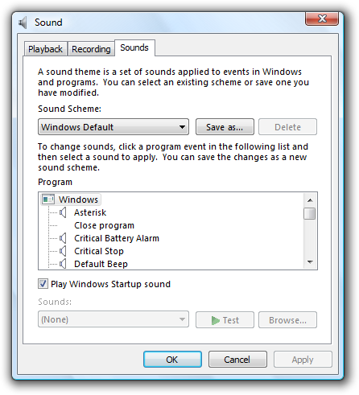
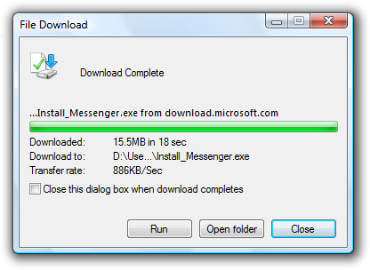
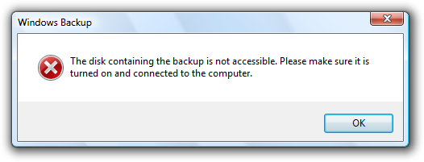
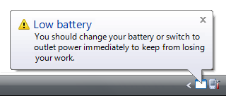
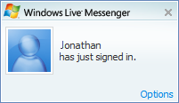
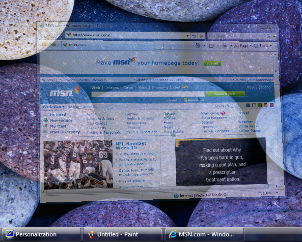
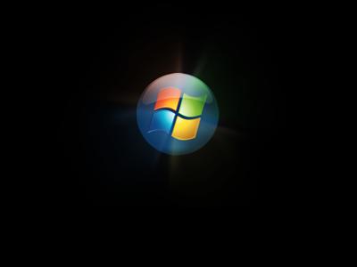
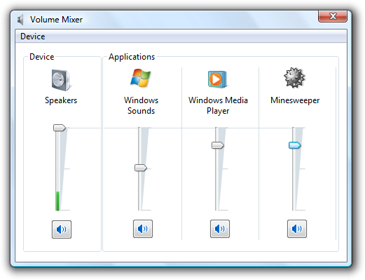

# Sound

> [!NOTE]
> This design guide was created for Windows 7 and has not been updated for newer versions of Windows. Much of the guidance still applies in principle, but the presentation and examples do not reflect our [current design guidance](/windows/uwp/design/).

*Sound* is the audio element of the user experience. When used appropriately, sound can be an effective form of communication that establishes a non-verbal and even emotional relationship with your users. Sounds can be used alone or as a supplement to visual UI. For example, adding a sound effect to a notification increases the likelihood that it will be noticed, especially if the user isn't looking at the screen when an event occurs.

From the Sounds tab of the Sound control panel item, users can make changes to their system sounds.

This article covers the use of sounds within a program as a response to events and user actions, and integrating a program's sound control with Windows. It doesn't cover the use of music or speech.

**Note:** Guidelines related to [notifications](mess-notif.md) and [branding](exper-branding.md) are presented in separate articles.

## Is this the right user interface?

To decide if you should use sound, consider these questions:

-   **Is there a clear user benefit to using sound?** Because the drawbacks of using sound can easily outweigh the benefits, use sound only when there is a clear advantage.
-   **Is the use of sound appropriate?** Does the use of sound draw attention to things that are worthy of attention? Would users miss the sound if it were absent? Focus on sounds that keep users informed, are likely to change their behavior, or provide useful feedback.
-   **Is the use of sound distracting?** Are there frequent, loud, jarring sounds? Are users likely to reduce the system volume or your program's volume as the result of your use of sound?
-   **Are you using sound as a primary form of communication?** In many cases, such as for users who have some level of hearing loss, sound should not be used as the primary means of communication. Sound is more effective as a supplement to other means of communication (such as text or visuals).
-   **Are the primary target users IT professionals?** Sound is usually ineffective for tasks targeted at IT professionals because many of their tasks run unattended. Furthermore, sound doesn't scale for them imagine running hundreds of tasks at a time and getting sounds when they complete or fail.

## Design concepts

Typically sound achieves any or all of the following purposes:

-   **Notification.** Sound can be associated with specific events. For example, a "new mail" sound tells users when mail arrives without disrupting their current task.
-   **Feedback.** Sound can provide feedback for specific user actions. For example, a subtle sound that plays when you release the slider on the volume control provides feedback about the level of the current setting.
-   **Branding.** Sound can be associated with specific content to brand your product, application, or service. Windows uses sound in this way for the startup of the operating system.
-   **Entertainment.** Sound is commonly used to enhance entertainment products and to make any product more engaging. For example, most games, training applications, and consumer products use sound to entertain users and enhance their experience.

Certain sounds can fulfill several of these purposes at once. The Windows Startup sound, for example, indicates that the startup process has completed and the desktop is ready for use. It also provides a powerful form of product branding and even momentarily engages users.

Sounds that fulfill none of these purposes should likely be eliminated.

### Inappropriate use of sound

**Despite the benefits of sound, appropriate use of sound requires significant restraint to do otherwise can make a program annoying and distracting.** Users will turn off their sound completely if they become annoyed by frequent, repetitive, jarring, disrupting, poorly designed sounds; in part this is because by its very nature, sound demands attention and is hard to ignore. For tips on finding a reasonable balance, see the [Sound design guidelines](#sound-design).

Because the drawbacks of using sound can easily outweigh the benefits, use sound only when there is a clear advantage. **When in doubt, don't use sound.**

### Make sound supplemental

Even if the sound is used appropriately, there are many situations where sound might not be effective for all users:

-   Some users may work in a noisy environment where the sounds cannot be heard.
-   Some users may work in a quiet environment that requires sound to be turned off or set at a low volume.
-   Some users may have hearing impairments or loss.
-   The computer may not have speakers.

For these reasons, **sound used for notifications and feedback should never be the only method of communication,** but rather should supplement visual or textual cues.

### Desirable characteristics of sound

In general, sounds should be:

-   mid to high frequency (600 Hertz \[Hz\] to 2 kilohertz \[kHz\]).
-   short (less than one second).
-   soft or moderate in volume.
-   meaningful.
-   pleasant, not alarming or jarring.
-   non-verbal.
-   non-repetitive.

With sound, less is more. **The ideal sound effect is one that users barely notice, but they would miss if it were absent.**

**A common misconception is that sounds for critical events need to be loud and jarring to get the user's attention.** This isn't true, because sound is really meant to be a supplemental means of communication. In the case of a critical error message, its presentation (perhaps in a modal dialog box), its icon (an error icon), and its text and tone all combine to communicate the nature of the error. An effective error sound can be slightly louder than the typical Windows sound, but need not be significantly louder.

### Characteristics of Windows sounds

Beyond this general call for minimalism, the Windows sound aesthetic uses light, pure tones, and glassy and airy sounds, with a soft fade-in and fade-out (soft "edges") to prevent abrupt, jarring, percussive effects. They are designed to feel subtle, gentle, and consonant. Windows sounds use echo, reverb, and equalization to attain a natural, ambient feel.

The default sound scheme for Windows doesn't generally use instrumental or recognizable everyday sounds that are overly specific or musical. Examples of sounds it avoids are musical instruments such as pianos or percussion instruments, animal sounds, environmental noises, speech, voices, movie-like sound effects, or other sounds of humans. Also, Windows sounds are not meant to be perceived as music (that is, as long, multi-note melodies). This makes Windows sounds functionally distinct from other types of sounds.

Because the Windows sounds were professionally designed to have the desirable characteristics and appeal to a broad audience, **consider using these built-in Windows sounds whenever appropriate.**

### Designing your own sounds

If you must create your own sounds, design them to have the previously described characteristics. Strive to make them complement their associated tasks or events.

Understand that creating original sounds is difficult to do well especially for sounds intended for a broad audience. Sound can be a polarizing design element. For every user who loves a sound, there will be many who dislike it.

**Design the sounds for your program as a group to feel like they are related variations on a theme.** Your program's auditory experience should be coordinated with its visual experience. Also, the "tone" of the sounds should be coordinated with the [tone of the text](text-style-tone.md). Consider how text with a pleasant, natural tone can be undermined when accompanied by harsh, alarming sounds.

**If you do only four things...**

1.  Use sound with restraint make sure there is a clear overall user benefit. When in doubt, don't use sound.
2.  Use the built-in Windows sounds whenever appropriate.
3.  If you design your own sounds, make sure they have the desirable sound characteristics and as a whole feel like variations on a theme.
4.  Don't assume that sounds need to be loud and jarring to get the user's attention.

## Usage patterns

Sounds have several usage patterns:

|     Sound Use                                                                                                                                                                 |  Example                                                                                                                                                                                                                                                                                                                                                                                                                                      |
|----------------------------------------------------------------------------------------------------------------------------------------------------------------------|----------------------------------------------------------------------------------------------------------------------------------------------------------------------------------------------------------------------------------------------------------------------------------------------------------------------------------------------------------------------------------------------------------------------------------------|
| **Action completion**  sonically notifies users when a long-running, user initiated action completes successfully.                               |   In this example, the dialog box plays a sound to notify users that the download has completed.                                                                                                                                                                                                                                       |
| **Action failure**  sonically notifies users when a long-running, user initiated action fails.                                                   |   In this example, Windows plays a sound to notify users that the backup operation has failed.                                                                                                                                                                                                                                   |
| **Important system event**  sonically alerts users of important system events or status that require immediate attention.                        |   In this example, users are alerted that their low battery requires immediate attention.                                                                                                                                                                                                                                                       |
| **FYI**  sonically notifies users of potentially useful, relevant information.                                                                   | Because this information usually doesn't require immediate attention, an fyi sound provides subtle feedback without breaking the user's flow.     In this example, a sound plays when a contact signs in to an instant messaging service.                                                                                  |
| **Sound effect**  sonically provides feedback to user interactions.                                                                              | Provides real-world or styled sound feedback that is appropriate for the interaction. sound effects often sound as though the user is manipulating a real-world, physical object. sometimes referred to as foley.     In this example, the minimize window sound effect sounds like a real-world object is being reduced in size.  |
| **Branding sounds**  a sound provided to enhance the user experience though emotional impact and, as a side effect, promote the product brand.   | Branding sounds are best when synchronized to visual events, especially ui transitions such as the display of a program window. true sound brands indicate the source of goods, similar to a trademarked word or logo, and are relatively uncommon.     In this example, Windows startup is a branded transitional experience.       |

 

## Guidelines

### Usage

-   **Use sound with restraint** make sure there is a clear overall user benefit. Focus on sounds that keep users informed, are likely to change their behavior, or provide useful feedback. When in doubt, don't use sound.
-   **Select the sound and its characteristics based on how it is being used.** For a description of each usage pattern, see the table in the previous section.
-   **For notifications and feedback, don't use sound as the only method of communication.** Rather, use sound as a supplemental method to reinforce visual or textual cues. Doing so ensures that users can see the information if they can't hear the sound.
-   **Don't play loud or harsh sounds frequently.** Doing so is unnecessary and results in a poor user experience. The more often a sound is played, the less obtrusive it should be. Sounds don't have to be loud or harsh to attract attention.
-   **Don't beep.** Beeping isn't appropriate for modern programs. Beeps can't have specific meanings assigned to them, and users can't control them.
    -   **Exception:** Critical system functions may beep to alert users of situations that they must attend to immediately, such as critically low battery power.

### Playback

-   **Don't repeat a sound more than two times consecutively.**
-   **For a consecutive sequence of related sound events, play a sound only on the first event.** Avoid using multiple sounds because they may collide with each other or otherwise result in an unpleasant user experience.

### Sound selection

-   **Choose pleasant sounds.** Don't use unpleasant, alarming sounds, such as buzzing, crashing, and breaking.
-   **Use sounds that are short** (less than one second).
-   **Use sounds that are roughly the same volume as the typical Windows sound.** Users dislike having to turn the volume down when starting a computer or a program, especially in public environments such as meetings and presentations. The Microsoft Windows sound files are located in the Media folder within the Windows folder.
-   **Don't choose sounds that require localization.** You can achieve this by using sounds that don't use speech or have culturally-dependent meanings or connotations.

### Windows system sounds

-   **Use the built-in Windows system sounds whenever appropriate.**
-   **Choose to use system sounds based on their associated meaning, not just on the sound itself.** System sounds must be used consistently.

### Sound design

When creating your own sounds:

-   **Create sounds with the desirable sound characteristics.**
-   **Compose sounds with mostly mid-range to high frequencies (600 Hz to 2 kHz).** Don't use low frequencies because they travel farther, are harder to locate, and can be alarming.
-   **Set the relative amplitude of normal sounds to the level of the typical Windows sound.** The Windows sounds have been appropriately leveled for home and work environments. Using different levels for your sounds will force users to make volume adjustments.
    -   Set important sounds to be slightly louder. Such sounds include action completions, action failures, and important system events.
    -   Set frequently occurring sounds to be slightly softer. These include FYIs, branding sounds, and sound effects.
-   **Choose sounds consistent with the meaning of the Windows sounds.** To create a custom version of a Windows sound, preserve the same pitch and interval, but change the orchestration or timbre. Don't assign different meanings to sounds with similar pitches and intervals as Windows sounds.
-   **Design the sounds for your program to feel like they are related variations on a theme.** Your program's auditory experience should be coordinated with its visual experience.
    -   **Design scene transitions and audio transitions together.** For example, if a scene fades out gradually, any sound should fade gradually as well. Don't ruin seamless visual transitions by having abrupt sound transitions.
-   **Sounds must be in .wav file format.** The 16-bit, 44.1 kHz stereo uncompressed pulse code modulation (PCM) format is recommended. If file size is important, use compressed or monaural (mono) formats, but be aware that there is an easily discernable quality loss that could reflect badly on your application.

### Mixing

-   **Don't have volume or mute controls in your program.** Instead, let users control relative volume settings among applications with the Windows volume mixer. If your program has a volume control, there will be multiple places where users adjust their settings, which may lead to confusion.

    

    The Windows volume mixer allows users to control the main volume setting as well as the volume for each program that is currently playing audio.

<!-- -->

-   **Exception:** If the primary purpose if your program is audio or video playback or creation, it may be useful to have a volume control in the program. Use a slider control for this purpose and provide immediate feedback when the user changes the volume.

### Windows integration

-   **Register your program's sounds in the Windows Sounds registry.** Doing so allows the Windows volume mixer to add a slider for your program.
-   **Register your program's custom sound events.** Doing so allows the Windows Sound control panel item to display them. Create the following key for each custom sound event: HKEY\_CURRENT\_USER \| AppEvents \| Event Labels \| EventName = Event Name.
-   **Don't hardwire the sounds for your program's sound events.** Instead, specify the sounds to be played using registry entries. Doing so allows users to customize the sound events through the Sound control panel item.
    -   **Exception:** You can choose to hardwire sounds used for branding.
-   **Don't provide a way for users to configure sounds within your program's options.** Rather, use the Windows Sounds control panel item for this purpose.
-   **Consider not assigning sounds to frequently occurring events by default.** Don't require users to configure their way out of an annoying initial experience.

### DirectSound programming issues

-   For DirectSound programs that have their own volume control, **set the program volume to 100 percent by default.** Doing so maximizes the dynamic range of your audio.
-   **Don't lock out other sound events by running your program in exclusive mode.** Doing so can prevent other programs from working correctly. For example, using exclusive mode prevents a computer from being used as a telephony device.

## Text

-   Don't use the phrase sound adapter. Use sound card instead.
-   Use device to refer generically to speakers, headphones, and microphones.
-   Use controller to refer to audio hardware that controls devices, such as sound cards and chipsets.
-   Use the phrase sound scheme to describe a collection of sounds for common program events, such as logging on or receiving new e-mail. Use the phrase desktop theme to describe a collection of visual elements and sounds for your computer desktop.
-   Use the term audio to refer broadly to speech, music, and sounds. Use the term sound to refer more narrowly to the program and Windows sounds described in this article.

 

