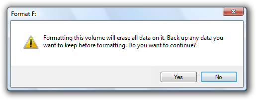
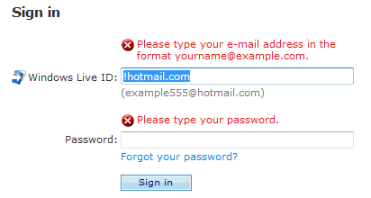

# Standard Icons

> [!NOTE]
> This design guide was created for Windows 7 and has not been updated for newer versions of Windows. Much of the guidance still applies in principle, but the presentation and examples do not reflect our [current design guidance](/windows/uwp/design/).

Standard icons are the error, warning, information, and question mark icons that are part of Windows.

The standard error, warning, information, and question mark icons.

The standard icons have these meanings:

-   **Error icon.** The user interface (UI) is presenting an error or problem that has occurred.
-   **Warning icon.** The UI is presenting a condition that might cause a problem in the future.
-   **Information icon.** The UI is presenting useful information.
-   **Question mark icon.** The UI indicates a Help entry point.

The standard icons are notable because they are built into many Windows application programming interfaces (APIs), such as [task dialogs](win-dialog-box.md), [message boxes](glossary.md), [balloons](ctrl-balloons.md), and [notifications](mess-notif.md). They are also commonly used on [in-place messages](glossary.md) and [status bars](ctrl-status-bars.md).

**Note:** Guidelines related to [icons](vis-icons.md) are presented in a separate article.

## Design concepts

There are several factors in choosing the appropriate standard icon which in part explains why they are so often used incorrectly. The most common mistakes are:

-   Using a warning icon for minor errors. Warnings are not "softened" errors.
-   Using a standard icon when it is better to use no icon at all. Not every message needs an icon.
-   Alarming users by giving warnings for minor issues or presenting routine questions as warnings. Doing so makes programs appear prone to hazard, and detracts from truly significant issues.

The remainder of this section explains how to think about standard icons in order to avoid these common mistakes.

### Message type vs. severity

Choose standard icons based the message type, not the severity of the underlying issue. The message types are:

-   **Error.** An error or problem that has occurred.
-   **Warning.** A condition that might cause a problem in the future.
-   **Information.** Useful information.

Consequently, an error message might take an error icon but never a warning icon. Don't use warning icons as a way to "soften" minor errors. So despite their difference in severity, "Incorrect font size" is an error, whereas "Continuing with this operation will set your house on fire" is a warning.

### Determining the appropriate message type

Some issues can be presented as an error, warning, or information, depending on the emphasis and phrasing. For example, suppose a Web page cannot load an unsigned ActiveX control based on the current Windows Internet Explorer configuration:

-   **Error.** "This page cannot load an unsigned ActiveX control." (Phrased as an existing problem.)
-   **Warning.** "This page might not behave as expected because Windows Internet Explorer isn't configured to load unsigned ActiveX controls." or "Allow this page to install an unsigned ActiveX Control? Doing so from untrusted sources may harm your computer." (Both phrased as conditions that may cause future problems.)
-   **Information.** "You have configured Windows Internet Explorer to block unsigned ActiveX controls." (Phrased as a statement of fact.)

**To determine the appropriate message type, focus on the most important aspect of the issue that users need to know or act upon.** Typically, if an issue blocks the user from proceeding, it is presented as an error; if the user can proceed, it's a warning. Craft the [main instruction](text-ui.md) or other corresponding text based on that focus, and then choose an icon (standard or otherwise) that matches the text. The main instruction text and icons should always match.

### Severity

While severity isn't a consideration when choosing among the error, warning, and information icons, **severity is a factor in determining if a standard icon should be used at all.**

Icons work best when used to communicate visually. (Note that for accessibility reasons, this visual communication must always be redundant with another form, such as text or sound.) Users should be able to tell at a glance the nature of the information and the consequences of their response, so we must differentiate critical errors and warnings from their ordinary counterparts. Critical errors and warnings have these characteristics:

-   They involve potential loss of one or more of the following:
    -   A valuable asset, such as data loss or financial loss.
    -   System access or integrity.
    -   Privacy or control over confidential information.
    -   User's time (a significant amount, such as 30 seconds or more).
-   They have unexpected or unintended consequences.
-   They require correct handling now, because mistakes can't be easily fixed and may even be irreversible.

To distinguish non-critical errors and warnings from critical ones, non-critical messages are usually displayed without an icon. Doing so draws attention to critical messages, makes critical and non-critical messages visually distinct, and is consistent with the [Windows tone](text-style-tone.md).

Not every message needs an icon. Icons are not a way to decorate messages.

The following is a good example of a critical warning because it meets the previously defined characteristics.

In this example, a critical warning alerts users of potential irreversible data loss.

However, the next example isn't critical because it is likely to be intentional and its results are easily undone.

**Incorrect:**

In this example, this [confirmation](mess-confirm.md) isn't critical because it's likely to be intentional and easily undone.

In a typical UI, most errors relate to user input errors. Most user input errors aren't critical because they are easily corrected, and users must correct them before continuing. Also, drawing too much attention to minor user mistakes is contrary to the Windows tone. Consequently, minor user input errors are usually displayed without an error icon. To reinforce their non-critical nature, we refer to these as user input problems.

In this example, this minor user input problem isn't critical, so it doesn't need an icon when presented in a dialog box.

### Avoid overwarning

We overwarn in Windows programs. The typical Windows program has warning icons seemingly everywhere, warning about things that have little significance. In some programs, nearly every question is presented as a warning. Overwarning makes using a program feel like a hazardous activity, and it detracts from truly significant issues.

The mere potential for data loss alone is insufficient to call for a warning icon. Additionally, any undesirable results should be unexpected or unintended and not easily corrected. Otherwise, just about any incorrectly answered question could be construed to result in data loss of some kind and merit a warning icon.

To focus warning icons on truly critical issues:

-   Make sure that the issue warrants heightened user attention. [Routine confirmations](mess-confirm.md) and questions shouldn't have warning icons.
-   Are users likely to behave differently as a result of the warning icon? Are users likely to consider the decision more carefully?

**Incorrect:**

In this example, are users likely to answer this question differently because of the warning icon?

-   Is there some significant action to do or decision to make? Warnings without actions just make users feel paranoid.

**Incorrect:**

Why is this notification a warning? What are users supposed to do (beside worry)?

### Context

Context is also a consideration in using standard icons because the context itself communicates information. Specifically:

-   While dialog boxes (including task dialogs and message boxes) and notifications don't need icons for non-critical errors, in-place errors always need error icons. Otherwise, such non-modal feedback would be too easy to overlook.
-   In-place warnings always need warning icons to distinguish them from regular text.
-   Dialog boxes, notifications, and balloons don't need information icons because they are clearly presenting information. By contrast, banners need 16x16 pixel information or other icons because such non-modal feedback would be too easy to overlook.

Because context is a significant factor in icon usage, the standard icon guidelines in this article are given in terms of their context.

### Evaluating standard icon appropriateness

When evaluating your UI text, read any standard icons as well. Read error icons as "error!", warning icons as "warning, be very careful here!", and information icons as "attention!". Then continue to read the remaining context, such as the main instruction, content area, and commit buttons. Make sure the meaning and the tone of each standard icon matches the meaning and the tone of its context. If they don't, you've found a problem.

**If you do only one thing...**

Make sure the meaning and the tone of each standard icon matches the meaning and the tone of its context. If they don't match, change or remove the icon.

## Guidelines

**Note:** For the following guidelines, "in-place" means on any normal window surface, such as within the content area of a wizard, property sheet, or control panel item page.

### General

-   Choose standard icons based their message type, not the severity of the underlying issue:
    -   **Error.** An error or problem that has occurred.
    -   **Warning.** A condition that might cause a problem in the future.
    -   **Information.** Useful information.
-   If an issue straddles different message types, focus on the most important aspect that users need to act on.
-   Icons must always match the main instruction or other corresponding text.

**Correct:**

**Incorrect:**

In the incorrect example, the standard warning icon doesn't match the main instruction (which gives an error).

### Icon size

-   **Choose the standard icon size based on the context:**
  

    | Context                         | When to use                                                                                        |
    |--------------------------|-----------------------------------------------------------------------------------------|
    | Dialog boxes   | Use 32x32 pixel for content area icons; 16x16 pixel for footnote area icons.  |
    | In-place       | Use 32x32 pixel for error pages; 16x16 pixel icons for all others.            |
    | Notifications  | Use 16x16 pixel icons.                                                        |
    | Balloons       | Use 16x16 pixel icons.                                                        |
    | Banners        | Use 16x16 pixel icons.                                                        |

 

### Error icons

-   **Use error icons only when an error or a problem has occurred:**

    | Context                           | When to use                                                                                                                                                                                                                                             |
    |----------------------------|----------------------------------------------------------------------------------------------------------------------------------------------------------------------------------------------------------------------------------------------|
    | Dialog boxes     | Use for critical errors only. (don't use standard icons for non-critical errors.)                                                  |
    | In-place errors  | Use for all errors.                                                                                                               |
    | Notifications    | Use for critical errors only. (for [action failures](https://msdn.microsoft.com/library/windows/desktop/aa511497.aspx).)     |
    | Balloons         | Don't use. Balloons shouldn't be used for critical errors, and they don't need error icons for non-critical errors.                                                                                                                |
    | Banners          | Don't use. Banners shouldn't be used for errors.                                                                                                                                                                                   |

 

-   Generally, error icons aren't needed for non-critical user input problems. However, icons are needed for in-place errors, because otherwise such contextual feedback would be too easy to overlook.
-   **For task dialogs, don't use error footnote icons.** Error icons must be presented in the content area only.

### Warning icons

-   **Use warning icons only when a condition might cause a problem in the future:**

    | Context                             |  When to use                                                                                                                                                                                      |
    |------------------------------|----------------------------------------------------------------------------------------------------------------------------------------------------------------------------------------|
    | Dialog boxes       | Use for all warnings.                                                       |
    | In-place warnings  | Use to identify the text as a warning.                                        |
    | Notifications      | Use for all warnings. (for [non-critical system events](glossary.md).)     |
    | Balloons           | Use for [special conditions](ctrl-balloons.md).                               |
    | Banners            | Use to draw attention to the banner.                                        |

 

-   **Don't use warning icons to "soften" non-critical errors.** Errors aren't warnings apply the error icon guidelines instead.
-   **For question dialogs, use warning icons only for questions with significant consequences.** Don't use warning icons for routine questions.

**Correct:**

**Incorrect:**

In the incorrect example, a warning icon is incorrectly used for a routine question.

-   **For task dialogs, you can use a warning footnote icon to alert users of risky consequences.** However, use a warning icon either in the content area or the footnote area, but not both.

In this example, a yellow security shield is used in a footnote.

### Information icons

-   **Use information icons only when the context isn't obviously presenting information:**

    | Context                         | When to use                                                                                                                                                  |
    |--------------------------|---------------------------------------------------------------------------------------------------------------------------------------------------|
    | Dialog boxes   | Don't use.                                                                                                                              |
    | In-place       | Don't use. Use either plain static text or a banner instead.                                                                            |
    | Notifications  | Don't use.                                                                                                                              |
    | Balloons       | Don't use.                                                                                                                              |
    | Banners        | use to draw attention to the banner.     |

 

-   Information icons aren't needed in dialog boxes, notifications, and balloons because their context sufficiently communicates that they are providing users with information.
-   **For task dialogs, don't use information footnote icons.** Footnotes are sufficiently visible and it goes without saying that they are information.

### Question mark icons

-   **Use the question mark icon only for Help entry points.** For more information, see the [Help entry point](winenv-help.md) guidelines.
-   **Don't use the question mark icon to ask questions.** Again, use the question mark icon only for Help entry points. There is no need to ask questions using the question mark icon anyway it's sufficient to present a main instruction as a question.
-   **Don't routinely replace question mark icons with warning icons.** Replace a question mark icon with a warning icon only if the question has significant consequences. Otherwise, use no icon.

 

