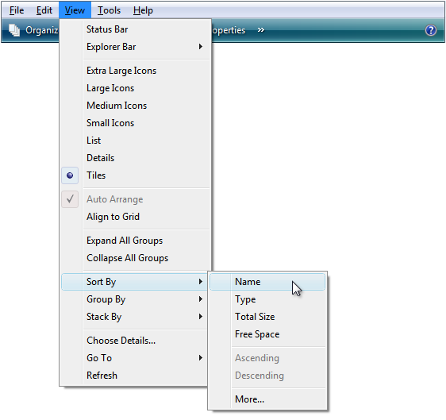
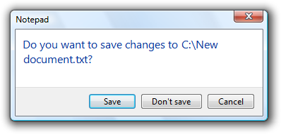
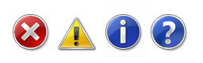

# Visual Index

> [!NOTE]
> This design guide was created for Windows 7 and has not been updated for newer versions of Windows. Much of the guidance still applies in principle, but the presentation and examples do not reflect our [current design guidance](/windows/uwp/design/).

Here are visual examples of many user interface elements discussed in UX Guide.

This index is divided into the following sections:

-   [Controls](#controls)
-   [Commands](#commands)
-   [Pointers](#pointers)
-   [Windows](#windows-environment)
-   [Windows Environment](#windows-environment)
-   [Visuals](#visuals)

## Controls

|                                                                                                                                                                             |
|-----------------------------------------------------------------------------------------------------------------------------------------------------------------------------|
| [balloons](ctrl-balloons.md)                                      |
| [check boxes](ctrl-check-boxes.md)                                                  |
| [command buttons](ctrl-command-buttons.md)                                              |
| [command links](ctrl-command-links.md)                                             |
| [drop-down lists and combo boxes](./ctrl-drop.md)                   |
| [group boxes](ctrl-group-boxes.md)                                  |
| [links](ctrl-links.md)                                            |
| [list boxes](ctrl-list-boxes.md)                                  |
| [list views](ctrl-list-views.md)                                                     |
| [notifications](mess-notif.md)                                   |
| [progress bars](progress-bars.md)                                   |
| [progressive disclosure controls](ctrl-progressive-disclosure-controls.md)    |
| [radio buttons](ctrl-radio-buttons.md)                          |
| [search boxes](ctrl-search-boxes.md)                                              |
| [sliders](ctrl-sliders.md)                                            |
| [spin controls](ctrl-spin-controls.md)                                               |
| [status bars](ctrl-status-bars.md)                                     |
| [tabs](ctrl-tabs.md)                                                                      |
| [text boxes](ctrl-text-boxes.md)                                           |
| [tooltips](ctrl-tooltips-and-infotips.md)                              |
| [infotip](ctrl-tooltips-and-infotips.md)                               |
| [tree views](ctrl-tree-views.md)                                                   |

 

## Commands

|                                                                                                                                 |
|---------------------------------------------------------------------------------------------------------------------------------|
| [menus](cmd-menus.md)    |
| [toolbars](cmd-toolbars.md)                   |
| [ribbons](cmd-ribbons.md)     |

 

## Pointers

|                                                                                                                                                       |
|-------------------------------------------------------------------------------------------------------------------------------------------------------|
| [working in background](inter-mouse.md)    |
| [busy](inter-mouse.md)                                |
| [activity indicator](inter-mouse.md)         |

 

## Windows

|                                                                                                                                                 |
|-------------------------------------------------------------------------------------------------------------------------------------------------|
| [dialog boxes](win-dialog-box.md)           |
| [property windows](win-property-win.md)    |
| [warning messages](mess-warn.md)          |
| [confirmations](mess-confirm.md)                  |

 

## Windows Environment

|                                                                                                                                                                 |
|-----------------------------------------------------------------------------------------------------------------------------------------------------------------|
| [taskbar](winenv-taskbar.md)                                                  |
| [user account control entry points](winenv-uac.md)    |
| [user account control consent ui](winenv-uac.md)        |
| **DEPRECATED:** Gadget (detailed/floating)                                |
| **DEPRECATED:** Gadget (concise/docked)                   |

 

## Visuals

|                                                                                                                                                  |
|--------------------------------------------------------------------------------------------------------------------------------------------------|
| [window frames](win-window-frames.md)    |
| [fonts](vis-fonts.md)                |
| [standard icons](vis-std-icons.md)       |

 

