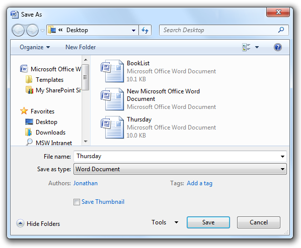
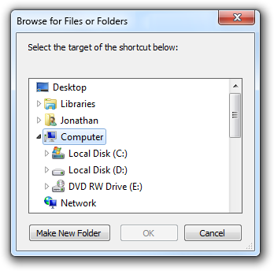

# Common Dialogs

> [!NOTE]
> This design guide was created for Windows 7 and has not been updated for newer versions of Windows. Much of the guidance still applies in principle, but the presentation and examples do not reflect our [current design guidance](/windows/uwp/design/).

The Microsoft Windows common dialogs consist of the Open File, Save File, Open Folder, Find and Replace, Print, Page Setup, Font, and Color dialog boxes.

## Open File

Open File is optimized for quickly finding items to use with a program.

## Save File

Save File closes the loop by saving a file with its metadata.

## Open Folder

Open Folder is specifically for choosing folders.

## Find and replace

Find allows users to search for text strings, whereas the Replace version optionally allows users to replace matches with another string.

## Print

Print allows users to select what to print, the number of copies to print, and the collation sequence, along with the ability to choose and configure printers.

## Page setup

Page setup allows users to select the paper size and source, page orientation, and margins.

## Font

Font displays the fonts and point sizes of the available installed fonts.

## Color

Color allows users to select a color, either through a predefined set of colors or by choosing a "custom" color.

## Design concepts

By using the common dialogs, you help give users a consistent experience across different programs. And by using the common dialogs well, you also help give users an efficient, enjoyable experience.

You can significantly improve users' experience with these dialogs by choosing the most appropriate defaults for:

-   Input values (examples: default folders, default file names).
-   Selected options (examples: selected printer, printing options).
-   Views (examples: showing pictures in thumbnail view, showing pictures without file names, sorting by date, column widths).
-   Presentation (examples: window size, location, and contents).

You must determine both the initial defaults and subsequent defaults. Initial default values are determined by your program and based on the target user's expected usage, whereas subsequent defaults are based on the actual usage. Past usage is the best indicator of future usage.

Are your program's defaults efficient? Monitor the number of steps users have to take to perform the most common tasks. If users have to repeat the same, potentially unnecessary steps every time they perform a task, your default values can be improved.

**If you do only one thing...**

Give users an efficient, enjoyable experience by selecting appropriate initial and subsequent defaults.

## Is this the right user interface?

**Yes! Use the common dialogs for a consistent user experience. Don't create your own.** It is especially difficult to create custom UIs that navigate the namespace correctly and securely. Note that you can customize the common dialogs if necessary.

For Windows Vista, the Open File and Save File have a new extensible architecture to make it easier to expose additional functionality. This mechanism is flexible enough to meet the minimum requirements of major independent software vendors (ISVs), but not be broken by future releases of Windows.

## Guidelines

### General

-   When appropriate, provide more direct or [modeless](glossary.md) alternatives. Allow users to:
    -   Open files by dropping them on your program.
    -   Save files using their current name and location with a Save command.
    -   Find the next occurrence of a string using the F3 key.
    -   Print one copy of an entire document to the default printer with a Print command.
    -   Change fonts and font attributes using a toolbar or palette window.
    -   Change colors using a toolbar or palette window.
-   Use the following commands to display common dialogs (given along with their preferred [access keys](glossary.md)):

|                              |                                               |
|------------------------------|-----------------------------------------------|
| **Common dialog**  | **Command**                         |
| Open File          | Open...                             |
| Save File          | Save as...                          |
| Open Folder        | Open folder... or Choose folder...  |
| Find and Replace   | Find... or Replace...               |
| Print              | Print...                            |
| Page Setup         | Page setup...                       |
| Font               | Font... or Choose font...           |
| Color              | Color... or Choose color...         |

 

-   You can use more specific commands, as appropriate. Example: for exporting a file, use the command Export file instead of Save as.
-   Set the dialog box title to reflect the command that launched it. Example: If Save File is launched from an Export file command, rename the dialog box to Export File.

### Open File

-   For the initial default folder, use a specialized folder (Pictures, Music, Videos) as appropriate, otherwise use Documents.
-   For subsequent default folders, use the last folder opened by the user using the program.
-   When opening photo files, suppress file names by default. Photos are usually identified by their thumbnails and their names typically aren't meaningful.

### Save File

-   For the initial default folder (if a new file is being saved for the first time), use the specialized folder (Pictures, Music, Videos) as appropriate, otherwise use Documents.
-   For temporary files, use the current user's temporary folder. Choose plain, but unique file names. Example: Use File0001.tmp instead of ~DF1A92.tmp.
    -   **Developers:** You can get the current user's temporary folder using the GetTempPath API function.
-   For the initial default file name, use a unique default name based on:
    -   The file's contents, if known. Example: The first words in a document.
    -   A pattern chosen by the user. Example: If the previous file was named "Hawaii 1.jpg", choose "Hawaii 2.jpg" as the next file.
    -   A generic pattern based on the file type. Example: "Photo1.jpg".
-   For subsequent defaults (if the file already exists), use the file's current folder and name.
-   When saving a file, preserve its creation date. If your program saves files by creating a temporary file, deletes the original, and renames the temporary file to the original file name, be sure to copy the creation date from the original file.
-   Use Save File if the user selects the Save command without specifying a file name.

### File types lists

**Note:** File types lists are used by Open File and Save File to determine the types of files displayed and the default file extension.

-   If the file types list is short (five or fewer), order the list by likelihood of usage. If the list is long (six or more), use an alphabetical order to make the types easy to find.
-   For Save File, include all variations of the supported file extensions, even if uncommon, and put the most common extension first. The file handling logic looks at this list to determine if the user supplied a supported file extension. Example: If a JPEG file types list includes only .jpg and .jpeg, the file test.jpe might be saved as test.jpe.jpg.
-   For Save File, the initial default file type is the most likely chosen by the target user. The subsequent default is the file's current type.
-   For Open File, the initial default file type is the most likely chosen by the target user. The subsequent default should be the last file type used.
-   For Open File, include an "All files" entry as the first item if users can open any file type, or may need to see all files in a folder at the same time. Consider providing other meta filters, such as "All pictures," "All music," and "All videos." Place these immediately after "All files."
-   Use the format "File type name (\*.ext1; \*.ext2)." The file type name should be the registered file type name, which you can view in the Folder Options control panel item. Example: "HTML document (\*.htm; \*.html)."
    -   **Exception:** For meta-filters, remove the file extension list to eliminate clutter. Examples: "All files," "All pictures," "All music," and "All videos."
-   Use [sentence-style capitalization](glossary.md) for the file type names, and lowercase for the file type extensions.

### Open Folder

-   **For new programs, use the Open Files dialog in the "pick folders" mode.** Doing so requires Windows Vista or later, so use the Open Folder dialog for programs that run in earlier versions of Windows.
    -   **Developers:** You can use the Open Files dialog in the "pick folders" mode by using the FOS\_PICKFOLDERS flag.

### Font

-   If necessary, you can filter the font list to show only the fonts available to your program.

### Persistence

-   Consider making the following values persistent to use as subsequent defaults:
    -   Input values (examples: default folders, default file names).
    -   Selected options (examples: selected printer, printing options).
    -   Views (examples: showing pictures in thumbnail view, showing pictures without file names, sorting by date, column widths).
    -   Presentation (examples: window size, location, and contents).

**Exception:** Don't make these values persist for common dialogs when their usage is such that users are far more likely to want to start completely over.

-   When determining default values, consider what target users are most likely to want based on the important scenarios. Also, consider scenarios within a program instance, across multiple instances (both consecutive or concurrent), and across multiple documents. Don't make values persist in circumstances that aren't likely to be helpful.
    -   **Example:** For a typical document-based application, it's helpful to use persistent Open File and Save File settings within a program instance and across consecutive instances, but keep concurrent instances independent. That way, users can work efficiently with several documents at a time.
-   Make the settings persist on a per-program, per-user basis.

 

