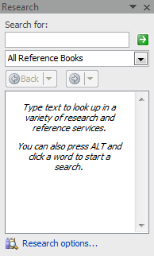
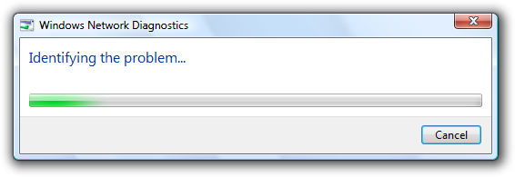
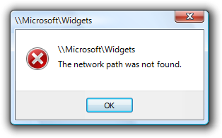
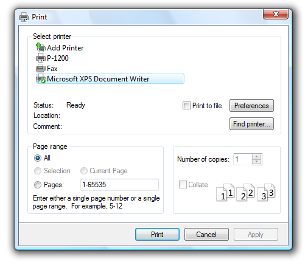
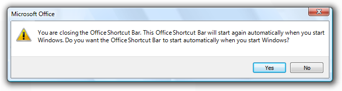
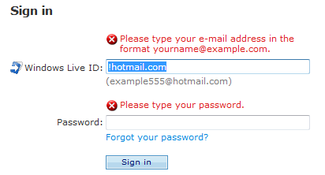

# Dialog Boxes (Design basics)

> [!NOTE]
> This design guide was created for Windows 7 and has not been updated for newer versions of Windows. Much of the guidance still applies in principle, but the presentation and examples do not reflect our [current design guidance](/windows/uwp/design/).

A dialog box is a secondary window that allows users to perform a command, asks users a question, or provides users with information or progress feedback.

A typical dialog box.

Dialog boxes consist of a title bar (to identify the command, feature, or program where a dialog box came from), an optional main instruction (to explain the user's objective with the dialog box), various controls in the content area (to present options), and commit buttons (to indicate how the user wants to commit to the task).

Dialog boxes have two fundamental types:

-   **Modal dialog boxes** require users to complete and close before continuing with the owner window. These dialog boxes are best used for critical or infrequent, one-off tasks that require completion before continuing.
-   **Modeless dialog boxes** allow users to switch between the dialog box and the owner window as desired. These dialog boxes are best used for frequent, repetitive, on-going tasks.

**A task dialog is a dialog box implemented using the task dialog application programming interface (API).** They consist of the following parts, which can be assembled in a variety of combinations:

-   A **title bar** to identify the application or system feature where the dialog box came from.
-   A **main instruction**, with an optional icon, to identify the user's objective with the dialog.
-   A **content area** for descriptive information and controls.
-   A **command area** for commit buttons, including a Cancel button, and optional More options and Don't show this &lt;item&gt; again controls.
-   A **footnote area** for optional additional explanations and help, typically targeted at less experienced users.

A typical task dialog.

**Task dialogs are recommended whenever appropriate because they are easy to create and they achieve a consistent look.** Task dialogs do require Windows Vista or later, so they aren't suitable for earlier versions of Microsoft Windows.

A task pane is like a dialog box, except that it is presented within a window pane instead of a separate window. As a result, task panes have a more direct, contextual feel than dialog boxes. Even though technically they are not the same, **task panes are so similar to dialog boxes that their guidelines are presented in this article**.

A typical task pane.

[Property windows](win-property-win.md) are a specialized type of dialog box used to view and change properties for an object, collection of objects, or a program. Additionally, property windows typically support several tasks, whereas dialog boxes typically support a single task or step in a task. Because their usage is specialized, **property windows are covered in a different set of guidelines**.

Dialog boxes can have [tabs](ctrl-tabs.md), and if so they are called tabbed dialog boxes. Property windows are determined by their presentation of properties, not by the use of tabs.

**Note:** Guidelines related to [layout](vis-layout.md), [window management](win-window-mgt.md), common dialog boxes, [property windows](win-property-win.md), [wizards](win-wizards.md), [confirmations](mess-confirm.md), [error messages](mess-error.md), and [warning messages](mess-warn.md) are presented in separate articles.

## Is this the right user interface?

To decide, consider these questions:

-   **Is the purpose to provide users with information, ask users a question, or allow users to select options to perform a command or task?** If not, use another user interface (UI).
-   **Is the purpose to view and change properties for an object, collection of objects, or a program?** If so, use a [property window](win-property-win.md) or [toolbar](cmd-toolbars.md) instead.
-   **Is the purpose to present a collection of commands or tools?** If so, use a toolbar or [palette window](glossary.md).
-   **Is the purpose to verify that the user wants to proceed with an action?** Is there a clear reason not to proceed and a reasonable chance that sometimes users won't? If so, use a [confirmation](mess-confirm.md).
-   **Is the purpose to give an error or warning message?** If so, use an [error message](mess-error.md) or [warning message](mess-warn.md).
-   Is the purpose to:
    -   Open files
    -   Save files
    -   Open folders
    -   Find or replace text
    -   Print a document
    -   Select attributes of a printed page
    -   Select a font
    -   Choose a color
    -   Browse for a file, folder, computer, or printer
    -   Search for users, computers, or groups in Microsoft Active Directory
    -   Prompt for a user name and password?

If so, use the appropriate [common dialog](win-common-dlg.md) instead. Many of these common dialogs are extensible.

-   **Is the purpose to perform a multi-step task that requires more than a single window?** If so, use a [task flow](glossary.md) or [wizard](win-wizards.md) instead.
-   **Is the purpose to inform users of a system or program event that isn't related to the current user activity, that doesn't require immediate user action, and users can freely ignore?** If so, use a [notification](mess-notif.md) instead.
-   **Is the purpose to show program status?** If so, use a [status bar](ctrl-status-bars.md) instead.
-   **Would it be preferable to use in-place UI?** Dialog boxes can break the user's flow by demanding attention. Sometimes that break in flow is justified, such as when the user must perform an action that is outside the current context. In other cases, a better approach is to present the UI in context, either directly with in-place UI (such as a task pane), or on demand using [progressive disclosure](ctrl-progressive-disclosure-controls.md).
-   **Is the purpose to display a non-critical user input problem or special condition?** If so, use a [balloon](ctrl-balloons.md) instead.
-   **For task flows, would it be preferable to use another page?** Generally you want a task to flow from page to page within a single window. Use dialog boxes to confirm in-place commands, to get input for in-place commands, and to perform secondary, stand-alone tasks that are best done independently and outside the main task flow.
-   **For selecting options, are users likely to change the options?** If not, consider alternatives, such as:
    -   Using the default options without asking, but allowing users to make changes later.
    -   Providing a version with options (for example, **Print...** in a menu) as well as a version without options (for example, **Print** in the toolbar). Generally, toolbar commands should be immediate and avoid displaying dialog boxes.
-   **For selecting options, is there a simpler, more direct way to present the options?** If so, consider alternatives, such as:
    -   Using a [split button](ctrl-command-buttons.md) to select variations of a command.
    -   Using a submenu for commands, check boxes, radio buttons and simple lists.

In these examples, submenus are used instead of dialog boxes for simple selections.

## Design concepts

When properly used, dialog boxes are a great way to give power and flexibility to your program. When misused, dialog boxes are an easy way to annoy users, interrupt their flow, and make the program feel indirect and tedious to use. **Modal dialog boxes demand users' attention.** Dialog boxes are often easier to implement than alternative UIs, so they tend to be overused.

**A dialog box is most effective when its design characteristics match its usage.** A dialog box's design is largely determined by its purpose (to offer options, ask questions, provide information or feedback), type (modal or modeless), and user interaction (required, optional response, or acknowledgment), whereas its usage is largely determined by its context (user or program initiated), probability of user action, and frequency of display.

To design effective dialog boxes, use the following elements effectively:

-   Dialog box text
-   Main instructions
-   Don't show this &lt;item&gt; again option

**If you do only one thing...**

Make sure that your dialog box design (determined by its purpose, type, and user interaction) matches its usage (determined by its context, probability of user action, and frequency of display).

## Usage patterns

Dialog boxes have several usage patterns:

-   Question dialogs (using buttons) ask users a single question or to confirm a command, and use simple responses in horizontally arranged command buttons.
-   Question dialogs (using command links) ask users a single question or to select a task to perform, and use detailed responses in vertically arranged command links.
-   Choice dialogs present users with a set of choices, usually to specify a command more completely. Unlike question dialogs, choice dialogs can ask multiple questions.
-   Progress dialogs present users with progress feedback during a lengthy operation (longer than five seconds), along with a command to cancel or stop the operation.
-   Informational dialogs display information requested by the user.

## Guidelines

### General

-   **Don't use scrollable dialog boxes.** Don't use dialog boxes that require the use of a scroll bar to be viewed completely during normal usage. Redesign the dialog box instead. Consider using [progressive disclosure](ctrl-progressive-disclosure-controls.md) or [tabs](ctrl-tabs.md).
-   **Don't have a menu bar or status bar.** Instead, provide access to commands and status directly on the dialog box itself, or by using context menus on the relevant controls.

    -   **Exception:** Menu bars are acceptable when a dialog box is used to implement a primary window (such as a utility).

    **Incorrect:**

    

    In this example, Find Certificates is a modeless dialog box with a menu bar.

-   If a dialog box requires immediate attention and the program isn't active, **flash its taskbar button three times to draw attention, and leave it highlighted.** Don't do anything else: don't restore or activate the window and don't play any sound effects. Instead, respect the user's window state selection and let the user activate the window when ready.
-   For more guidelines and examples, see [Taskbar](winenv-taskbar.md).

### Modal dialog boxes

-   **Use for critical or infrequent, one-off tasks that require completion before continuing.**
-   Use a [delayed commit model](glossary.md) so that changes don't take effect until explicitly committed.
-   **Implement using a task dialog whenever appropriate to achieve a consistent look.** Task dialogs do require Windows Vista or later, so they aren't suitable for earlier versions of Windows.

### Modeless dialog boxes

-   **Use for frequent, repetitive, on-going tasks.**
-   Use an [immediate commit model](glossary.md) so that changes take effect immediately.
-   For modeless dialogs, use an explicit Close command button in the dialog to close the window. For both, use a Close button on the title bar to close the window.
-   **Consider making modeless dialog boxes dockable.** Dockable modeless dialogs allow for more flexible placement.

Some modeless dialog boxes used in Microsoft Office are dockable.

### Multiple dialog boxes

-   **Don't display more than one owned choice dialog at a time from an owner choice dialog.** Displaying more than one makes the meaning of the commit buttons difficult for users to understand. You may display other types of dialog boxes (such question dialogs) as needed.
-   **For a sequence of related dialogs, consider using a multi-page dialog if possible.** Use individual dialogs if they aren't clearly related.

### Multi-page dialog boxes

-   Use a multi-page dialog box instead of individual dialog boxes when you have the following sequence of related pages:
    -   A single input page (optional)
    -   A progress page
    -   A single results page

The input page is optional because the task may have been initiated somewhere else. **Doing so gives the resulting experience a stable, simple, lightweight feel.**

In this example, Windows Network Diagnostics consists of progress and results pages.

-   **Don't use a multi-page dialog if the input page is a standard dialog.** In this case the consistency of using a standard dialog is more important.
-   **Don't use Next or Back buttons and don't have more than three pages.** Multi-page dialog boxes are for single-step tasks with feedback. They aren't [wizards](win-wizards.md), which are used for multi-step tasks. Wizards have a heavy, indirect feel compared to multi-page dialog boxes.
-   **On the input page, use specific command buttons or command links to initiate the task.**
-   **Use a Cancel button on the input and progress pages, and a Close button on the results page.**

**Developers:** You can create multi-page task dialogs using the [TDM\_NAVIGATE\_PAGE](../controls/tdm-navigate-page.md) message.

### Presentation

To make dialog boxes easy to find and access, clearly associate the dialog with its source, and work well with multiple monitors:

-   **Initially display dialogs "centered" on top of the owner window.** For subsequent display, consider displaying it in its last location (relative to the owner window) if doing so is likely to be more convenient.

Initially center dialogs on top of the owner window.

-   **If a dialog is contextual, display it near the object from which it was launched.** However, place it out of the way (preferably offset down and to the right) so that the object isn't covered by the dialog.

An object's properties are displayed near to the object.

-   **For modeless dialogs, display initially on top of the owner window to make it easy to find.** If the user activates the owner window, that may obscure the modeless dialog.
-   **If necessary, adjust the initial location so that the entire dialog is visible within the target monitor.** If a resizable window is larger than the target monitor, reduce it to fit.
-   **When a dialog is redisplayed, consider displaying it in the same state as last accessed.** On close, save the monitor used, window size, location, and state (maximized vs. restore). On redisplay, restore the saved dialog size, location, and state using the appropriate monitor. Also, consider making these attributes persist across program instances on a per-user basis.
-   **For resizable windows, set a minimum window size if there is a size below which the content is no longer usable.** Consider altering the presentation to make the content usable at smaller sizes.

In this example, Windows Media Player changes its format when the window becomes too small for the standard format.

-   **Don't use the Always on Top attribute.**
    -   **Exception:** Use only when a dialog box implements an essentially modal operation, but it needs to be suspended briefly to access the owner window. For example, when spell-checking a document, users may occasionally leave the spell check dialog box and access the document to correct errors.

For more information and examples, see [Window Management](win-window-mgt.md).

### Title bars

-   **Dialog boxes don't have title bar icons.** Title bar icons are used as a visual distinction between [primary windows](glossary.md) and [secondary windows](glossary.md).
    -   **Exception:** If a dialog box is used to implement a primary window (such as a utility) and therefore appears on the taskbar, it does have a title bar icon. In this case, optimize the title for display on the taskbar by concisely placing the distinguishing information first.
-   **Dialog boxes always have a Close button.** Modeless dialogs can also have a Minimize button. Resizable dialogs can have a Maximize button.
-   **Don't disable the Close button.** Having a Close button helps users stay in control by allowing them to close windows they don't want.
    -   **Exception:** For progress dialogs, you may disable the Close button if the task must run to completion to achieve a valid state or prevent data loss.
-   **The Close button on the title bar should have the same effect as the Cancel or Close button** within the dialog box. Never give it the same effect as OK.
-   If the title bar caption and icon are already displayed in a prominent way near the top of the window, you can hide the title bar caption and icon to avoid redundancy. However, you still have to set a suitable title internally for use by Windows.

### Interaction

-   **When displayed, user initiated dialog boxes should always take input focus.** Program initiated dialog boxes shouldn't take input focus because the user may be interacting with another window. Such interaction misdirected at the dialog box may have unintended consequences.
-   **Assign initial input focus to the control that users are most likely to interact with first**, which is usually (but not always) the first interactive control. Avoid assigning initial input focus to a Help link.
-   **For keyboard navigation, tab order should flow in a logical order, generally from left to right, top to bottom.** Usually tab order follows reading order, but consider making these exceptions:

    -   Put the most commonly used controls earlier in tab order.
    -   Put Help links at the bottom of a dialog box, after the commit buttons in tab order.

    When assigning order, assume that users display dialog boxes for their intended purpose; so, for example, users display choice dialogs to make choices, not to review and click Cancel.

-   **Pressing the Esc key always closes an active dialog box.** This is true for dialog boxes with Cancel or Close, and even if Cancel has been renamed to Close because the results can no longer be undone.

**Access keys**

-   **Whenever possible, assign unique access keys to all interactive controls or their labels.**[Read-only text boxes](ctrl-text-boxes.md) are interactive controls (because users can scroll them and copy text) so they benefit from access keys. **Don't assign access keys to:**
    -   **OK, Cancel, and Close buttons.** Enter and Esc are used for their access keys. However, always assign an access key to a control that means OK or Cancel, but has a different label.

        

        In this example, the positive commit button has an access key assigned.

    -   **Group labels.** Normally, the individual controls within a group are assigned access keys, so the group label doesn't need one. However, if there is a shortage of access keys, assign an access key to the group label and not the individual controls.
    -   **Generic Help buttons,** which are accessed with F1.
    -   **Link labels.** There are often too many links to assign unique access keys, and the underscores often used to signify links hide the access key underscores. Access links with the Tab key instead.
    -   **Tab names.** Tabs are cycled using Ctrl+Tab and Ctrl+Shift+Tab.
    -   **Browse buttons labeled "...".** These Browse buttons can't be assigned access keys uniquely.
    -   **Unlabeled controls,** such as spin controls, graphic command buttons, and unlabeled progressive disclosure controls.
    -   **Non-label static text or labels for controls that aren't interactive,** such as progress bars.

-   **Whenever possible, assign access keys for commonly used commands according to the Standard Access Key Assignments**. While consistent access key assignments aren't always possible, they are certainly preferred especially for frequently used dialog boxes.
-   **Assign commit button access keys first to ensure that they have the standard key assignments.** If there isn't a standard key assignment, use the first letter of the first word. For example, the access key for Yes and No commit buttons should always be "Y" and "N", regardless of the other controls in the dialog box.
-   **To make access keys easy to find, assign the access keys to a character that appears early in the label,** ideally the first character, even if there is a keyword that appears later in the label.
-   **Prefer characters with wide widths,** such as w, m, and capital letters.
-   **Prefer a distinctive consonant or a vowel,** such as "x" in Exit.
-   **Avoid using characters that make the underline difficult to see,** such as (from most problematic to least problematic):
    -   Letters that are only one pixel wide, such as i and l.
    -   Letters with descenders, such as g, j, p, q, and y.
    -   Letters next to a letter with a descender.

For more guidelines and examples, see [Keyboard](inter-keyboard.md).

### Progress dialogs

For long-running tasks, **assume that users will do something else while the task is completing**. Design the task to run unattended.

-   **Present users with progress feedback dialog box if an operation takes longer than five seconds to complete**, along with a command to cancel or stop the operation.
    -   **Exception:** For wizards and task flows, use a modal dialog for progress only if the task stays on the same page (as opposed to advancing to another page) and users can't do anything while waiting. Otherwise, use a progress page or in-place progress.
-   If the operation is a long-running task (over 30 seconds) and can be performed in the background, use a modeless progress dialog so that users can continue to use your program while waiting.
-   Modeless progress dialogs:
    -   Have a Minimize button on the title bar.
    -   Are displayed on the taskbar.
-   Implement modeless progress dialogs so that they continue to run even if the owner window is closed.

In this example, the file copy continues even if the owner window is closed.

-   **Provide a command button to halt the operation if it takes more than a few seconds to complete, or has the potential never to complete.** Label the button Cancel if canceling returns the environment to its previous state (leaving no side effects); otherwise, label the button Stop to indicate that it leaves the partially completed operation intact. You can change the button label from Cancel to Stop in the middle of the operation, if at some point it isn't possible to return the environment to its previous state.

In this example, halting the problem diagnosis has no side effect.

-   **Provide a command button to pause the operation if it takes more than several minutes to complete, and it impairs users' ability to get work done.** Doing so doesn't force the user to choose between completing the task and getting their work done.
-   **Gather as much information as you can before starting the task.**
-   **If recoverable problems are detected, have users deal with all problems found at the end of the task.** If that isn't practical, have users deal with problems as they happen.
-   **Don't abandon tasks as the result of recoverable errors.**

In this example, Windows Explorer allows users to continue with the task after a recoverable error.

-   **Indicate problems by turning the progress bar red.**

In this example, a removable disk was removed during a file copy.

-   **If the results are clearly apparent to users, close the progress dialog automatically on successful completion.** Otherwise, use feedback only to report problems:
    -   To display simple feedback, display the feedback in the progress dialog, and change the Cancel button to Close.
    -   To display detailed feedback, close the progress dialog box and display an informational dialog.

**Don't use a notification for completion feedback.** Use either a progress dialog or an [action success notification](mess-notif.md), but not both.

**Time remaining**

-   **Use the following time formats.** Start with the first of the following formats where the largest time unit isn't zero, then change to the next format once the largest time unit becomes zero.

**For progress bars:**

**If related information is shown in a colon format:**

Time remaining: h hours, m minutes

Time remaining: m minutes, s seconds

Time remaining: s seconds

**If screen space is at a premium:**

h hrs, m mins remaining

m mins, s secs remaining

s seconds remaining

**Otherwise:**

h hours, m minutes remaining

m minutes, s seconds remaining

s seconds remaining

**For title bars:**

hh:mm remaining

mm:ss remaining

0:ss remaining

This compact format shows the most important information first so that it isn't truncated on the taskbar.

-   **Make estimates accurate, but don't give false precision.** If largest unit is hours, give minutes (if meaningful) but not seconds.

**Incorrect:**

hh hours, mm minutes, ss seconds

-   **Keep the estimate up-to-date.** Update time remaining estimates at least every 5 seconds.
-   **Focus on the time remaining** because that is the information users care about most. Give total elapsed time only when there are scenarios where elapsed time is helpful (such as when the task is likely to be repeated). If the time remaining estimate is associated with a progress bar, don't have percent complete text because that information is conveyed by the progress bar itself.
-   **Be grammatically correct.** Use singular units when the number is one.

**Incorrect:**

1 minutes, 1 seconds

-   **Use sentence-style capitalization.**

For more information and examples, see [Progress Bars](progress-bars.md).

### Icons and graphics

**Graphics**

-   **Don't use large graphics that serve no purpose beyond filling space with eye candy.** Keep the appearance simple instead.

**Incorrect:**

In this example, the large graphic serves no purpose.

**Title bar icons**

-   **Dialog boxes don't have title bar icons.**
    -   **Exception:** If a dialog box is used to implement a primary window (such as a utility) and therefore appears on the taskbar, it does have a title bar icon.

**Body icons**

-   **Choose the body icon based on the design pattern:**

| Pattern | Body icon |
|--------------------------------------|----------------------------------------------------------------------------------------------------------------------------|
| **Question dialogs**       | Program, feature, object, warning icon (if potential loss of data or system access), security warning, or none.  |
| **Choice dialogs**         | None.                                                                                                            |
| **Progress dialogs**       | None (but may have an animation).                                                                                |
| **Informational dialogs**  | None.                                                                                                            |

 

-   **Incorrect:**

In this example, a warning icon is incorrectly used for a question that doesn't involve potential loss of data or system access.

- **Consider using icons to help users visually recognize your program's features.** This technique is most effective when the icons are easily recognizable and used in several locations within your program.

In this example, the yellow star icon represents Favorites. The icon is easily recognizable and is used consistently throughout Windows to represent Favorites.

-   **Use icons to help users recognize the object in question.**

In this example, the object's icon helps users recognize the type of file being opened or saved.

-   **Consider using icons to help make features self-explanatory.**

In this example, these icons help users visualize the effect of their features.

-   **Use an icon in About Box dialogs for application branding.**

In this example, a bitmap is used in the About Box to identify and brand the application.

**Footnote icons**

-   **If you have a footnote, consider using a footnote icon to summarize the footnote's subject.**

In this example, the footnote icon indicates that the question has security implications.

-   **Don't use a footnote icon that repeats the body icon.**
-   **Don't use the error or information standard icons.** Error conditions must be conveyed through the body icon and footnotes are always for information, making the information icon redundant. However, you can use the standard warning icon and the yellow security shield to alert users of risky consequences.

For more information and examples, see [Icons](vis-icons.md).

### Commit buttons

**Notes:**

-   These guidelines don't apply to question dialogs using command links, because that pattern uses command links instead of buttons.
-   \[Do it\] and \[Don't do it\] are affirmative and negative responses, respectively, to the main instruction.

**General**

-   **Choose the commit buttons based on the design pattern:**

    
| Label | Value |
|--------|-------|
| <strong>Pattern</strong>  | <strong>Commit buttons</strong>  | 
| <strong>Question dialogs (using buttons)</strong>  | One of the following sets of concise commands: Yes/No, Yes/No/Cancel, [Do it]/Cancel, [Do it]/[Don't do it], [Do it]/[Don't do it]/Cancel.  | 
| <strong>Question dialogs (using links)</strong>  | Cancel.  | 
| <strong>Choice dialogs</strong>  | <ul><li>Modal dialogs: OK/Cancel or [Do it]/Cancel</li><li>Modeless dialogs: Close button on dialog box and title bar</li><li>Task pane: Close button on title bar</li></ul> | 
| <strong>Progress dialogs</strong>  | Use Cancel if returns the environment to its previous state (leaving no side effect); otherwise, use Stop.  | 
| <strong>Informational dialogs</strong>  | Close.  | 

    

     

-   **All commit buttons except Apply result in closing the dialog box window.**
-   **Don't confirm commit buttons.** Doing so unnecessarily can be very annoying. **Exceptions:**

    -   The action is potentially catastrophic.
    -   The action is clearly inconsistent with other actions.
    -   If incorrect, the action may result in a significant loss of data, time, or effort on behalf of the user.

    For more guidelines and examples, see [Confirmations](mess-confirm.md).

-   **Don't disable commit buttons. Exceptions:**
    -   **If users must elevate to make a change, disable the positive commit buttons until the user makes a change.** Doing so prevents users from elevating just to close a window by forcing them to click Cancel.
    -   For more exceptions, see [Disabling or removing controls vs. giving error messages](#disabling-or-removing-controls-vs-giving-error-messages).
-   **Right-align commit buttons in a single row across the bottom of the dialog box,** but above the footnote area. Do this even if there is a single commit button (such as OK).

    **Incorrect:**

    

    In this example, the OK button is incorrectly centered.

-   **Present the commit buttons in the following order:**
    1.  OK/\[Do it\]/Yes
    2.  \[Don't do it\]/No
    3.  Cancel
    4.  Apply (if present)
    5.  Help (if present)
-   **If you have many related commit buttons, consolidate them using split buttons**.
-   **Have a clear separation from commit buttons (which close the window) and all other command buttons (such as Advanced).**

**Responding to main instructions**

-   **Use positive commit buttons that are specific responses to the main instruction, instead of generic labels such as OK or Yes/No.** Users should be able to understand the options by reading the button text alone. **Exceptions:**
    -   Use Close for dialogs that don't have settings, such as informational dialogs. Never use Close for dialogs that have settings.
    -   Use OK when the "specific" responses are still generic, such as Save, Select, or Choose. Use OK when changing a specific setting or a collection of settings.
    -   **For legacy dialog boxes without a main instruction, you can use generic labels such as OK.** Often such dialog boxes aren't designed to perform a specific task, preventing more specific responses.
    -   Certain tasks require more thought and careful reading for users to make informed decisions. This is usually the case with [confirmations](mess-confirm.md). **In such cases, you can purposely use generic commit button labels to force users to read the main instructions and prevent hasty decisions.**

        **Correct:**

        

        In this example, using Yes/No commit buttons forces users to at least read the main instruction.

-   **Alternatively, you can add the word "anyway" to the positive commit button label to indicate that the dialog box presents a reason not to proceed** and that users should read the dialog carefully before proceeding.

    **Correct:**

    

    In this example, "anyway" is added to the commit button label to indicate that users should proceed carefully.

-   **Use Cancel or Close for negative commit buttons instead of specific responses to the main instruction.** Quite often users realize that they don't want to perform a task once they see a dialog box. If Cancel or Close were relabeled to specific responses, users would have to carefully read all the commit buttons to determine how to cancel. **Labeling Cancel and Close consistently makes them easy to find.Exceptions:**
    -   **Don't use Yes/Cancel.** Always use Yes/No as a pair.
    -   **Use a specific response when Cancel is ambiguous.**
-   **Don't map generic labels to their specific meaning with text in the content area.** Instead, use specific commit button labels, or a question dialog using links if the labels are lengthy.

    **Incorrect:**

    

    In this example, OK is mapped to Continue, Cancel is mapped to Remain on Page.

**Yes and No buttons**

-   **Prefer specific responses to Yes and No buttons.** While there's nothing wrong with using Yes and No, specific responses can be understood more quickly, resulting in efficient decision making. However, [confirmations](mess-confirm.md) usually have Yes and No buttons to make users give the confirmation [some thought](mess-confirm.md) before responding.
-   **Use Yes and No buttons only to respond to yes or no questions.** The main instruction should be naturally expressed as a yes or no question. Never use OK and Cancel for yes or no questions.

    **Incorrect:**

    

    **Correct:**

    

    **Better:**

    

    In these examples, Yes and No are good responses to yes and no questions, but specific responses are even better.

-   **Consider phrasing the main instruction as a yes or no question if commit buttons with specific phrasing turn out to be long or awkward.** Alternatively, you can use command links for longer responses (five words or more) to the main instruction.

    **Incorrect:**

    

    **Correct:**

    

    The specific phrasing in the incorrect example is too long, so the correct example uses Yes and No.

-   **Don't use Yes and No buttons if the meaning of the No response is unclear.** If so, use specific responses instead.

**OK buttons**

-   **In modal dialogs, clicking OK means apply the values, perform the task, and close the window.**
-   **Don't use OK buttons to respond to questions.**
-   **Don't assign access keys to OK, because Enter is the access key for the default button.** Doing so makes the other access keys easier to assign.
-   **Label OK buttons correctly.** The OK button should be labeled OK, not Ok or Okay.
-   **Don't use OK buttons for errors or warnings.** Problems are never OK. Use Close instead.

    **Incorrect:**

    

    In this example, Close should be used instead of OK.

-   **Don't use OK buttons in modeless dialog boxes.** Rather, modeless dialogs should use task-specific commit buttons (for example, Find). However, some modeless dialog boxes require only a Close button.

**Cancel buttons**

-   **Clicking Cancel means abandon all changes, cancel the task, close the window, and return the environment to its previous state, leaving no side effect.** For nested choice dialog boxes, clicking Cancel in the owner choice dialog means any changes made by owned choice dialogs are also abandoned.
-   **Provide a Cancel button to let users explicitly abandon changes.** Dialog boxes need a clear exit point. Don't depend on users finding the Close button on the title bar.

    -   **Exception:** Don't provide a Cancel button for dialog boxes without settings. The OK and Close buttons have the same effect as Cancel in this case.

    **Incorrect:**

    

    In this example, having only a Close button on the title bar makes it appear as though users don't have a choice.

-   **Don't use Cancel buttons to respond to questions.**

    **Incorrect:**

    

    In this example, OK and Cancel are incorrectly used to respond to a Yes or No question.

-   **Don't assign access keys to Cancel, because Esc is the access key.** Doing so makes the other access keys easier to assign.
-   **Don't use Cancel buttons in modeless dialog boxes.** Rather, use Close instead.
-   **Don't disable the Cancel button.** Users should always be able to cancel dialog boxes.
    -   **Exception:** You may disable the Cancel button in a progress dialog if there is a period during which the operation can't be cancelled. However, a better solution is to design such operations to always be cancelable.

**Close buttons**

-   **Use Close buttons for modeless dialog boxes, as well as modal dialogs that cannot be cancelled.**
-   **Clicking Close means close the dialog box window, leaving any existing side effects.** Don't use Done, because it isn't an imperative construction. For nested choice dialog boxes, clicking Close in the owner choice dialog means any changes made by owned choice dialogs are preserved.
-   **Put an explicit Close button in the dialog box body.** Dialog boxes need a clear exit point. Don't depend on users finding the Close button on the title bar.
-   **Make sure the Close button on the title bar has the same effect as Cancel or Close.**
-   **Don't assign access keys to Close, because Esc is its the access key.** Doing so makes the other access keys easier to assign.

**Apply buttons**

-   **Don't use Apply buttons in dialog boxes that aren't property sheets or control panels.** The Apply button means apply the pending changes, but leave the window open. Doing so allows users to evaluate the changes before closing the window. However, only property sheet and control panels have this need.

    **Incorrect:**

    

    In this example, a choice dialog needlessly has an Apply button.

**Commit buttons for indirect dialog boxes**

**Note:** Indirect dialog boxes are displayed out of context, either as an indirect result of a task or the result of a problem with a system or background process. For indirect dialogs, the Cancel button is ambiguous because it could mean cancel the dialog or cancel the entire task.

-   **If users need to both cancel the dialog box and the task, give commit buttons to do both.** Label the button that cancels the dialog box with a negative response to the main instruction. Label the button that cancels the entire task with Cancel. Using Cancel allows the dialog box to be used in many contexts.

    **Correct:**

    

    In this example, this dialog box is displayed by Windows Paint as the result of a New or Exit command when the graphic hasn't been saved. Don't Save closes the dialog without saving, whereas Cancel cancels the New or Exit command.

    **Incorrect:**

    

    In this example, there is no way to cancel the task (closing Office Shortcut Bar) that led to displaying this dialog box. This dialog box needs a Cancel button.

-   **If users just need to cancel the dialog but not the task, use a button with a specific, negative response to the main instruction,** and don't have a Cancel button.

    

    In this example, this dialog box is displayed indirectly as the result of navigating to a Web page that installs an ActiveX control. Using Cancel would be ambiguous here, so Don't run is used instead.

For more information and examples, see [Command Buttons](ctrl-command-buttons.md).

### Command links

-   **Present a set of lengthy commands using command links, instead of command buttons or a combination of radio buttons and an OK button.** Doing so allows users to respond with a single click. However, this approach works only for a single question.
-   **Present the most commonly used command links first.** The resulting order should roughly follow the likelihood of use, but also have a logical flow.
    -   **Exception:** Command links that result in doing everything should be placed first.
-   If a command link requires further explanation, **provide a supplemental explanation.** Supplemental explanations describe why users might want to choose the command, or what happens if the command is chosen.
-   **Don't use supplemental explanations that are wordy restatements of the command link.** Use a supplemental explanation only when you can't make a command link self-explanatory. Providing a supplemental explanation for one command link doesn't mean that you have to provide them for all commands.

In this example, the supplemental explanation describes the implications of one of the options.

-   **Use phrases that start with a verb, without ending punctuation.**
-   **If a command is strongly recommended, consider adding "(recommended)" to the label.** Be sure to add to the link label, not the supplemental explanation.
-   **If a command is intended only for advanced users, consider adding "(advanced)" to the label.** Be sure to add to the link label, not the supplemental explanation.
-   **Always provide an explicit Cancel button**. Don't use a command link for this purpose.

**Incorrect:**

In this example, the dialog box uses a command link instead of a Cancel button.

For more information and examples, see [Command Links](ctrl-command-links.md).

### Don't show this &lt;item&gt; again

-   **Consider using a Don't show this &lt;item&gt; again option to allow users to suppress a recurring dialog box, only if there isn't a better alternative.** It is better always to show the dialog if users really need it, or simply eliminate it if they don't.
-   **Use this specific phrasing replace &lt;item&gt; with the specific item.** For example, Don't show this reminder again. When referring to a dialog box in general, use Don't show this message again.
-   **Clearly indicate when user input will be used for future default values** by adding the following sentence under the option: Your selections will be used by default in the future.
-   **Don't select the option by default. If the dialog box really should be displayed only once, do so without asking.** Don't use this option as an excuse to annoy users make sure the default behavior isn't annoying.

**Incorrect:**

In this example, the message should just be displayed once. No need to ask.

-   **Make the setting persist on a per-user basis.**
-   **If users select the option and click Cancel, this option does take effect.** This setting is a meta-option, so it doesn't follow the standard Cancel behavior of leaving no side effect. Note that if users don't want to see the dialog in the future, most likely they want to cancel it as well.
-   If users may need to restore these dialog boxes, provide a **Restore messages** command in the program's Options dialog box.

### Ask me later

-   Provide this option to dismiss a dialog box only when:
    -   **The dialog box is indirect**, so users are likely to be focused on another task.
    -   **Users must respond but not immediately**, so they can continue with their work.
    -   **The question requires sufficient thought or effort** such that users might make better decisions if given more time.
    -   **The dialog box or option will be presented automatically later** (so that users really are asked later).
-   **Incorrect:**
-   
-   In this example, the question is simple enough that adding an Ask me later option only complicates it.
-   Otherwise, expect users to respond now, but allow them to close the dialog box normally with either Cancel or Close. When used properly, this option should be rare.

### More/Fewer

-   **Use More/Fewer progressive disclosure buttons to show or hide advanced or rarely used options, commands, or details that target users typically don't need.** Doing so simplifies the dialog box for typical usage. Don't hide commonly used options, commands, or information because users might not find them.

In this example, rarely used options are hidden by default.

-   **Don't use More/Fewer controls unless there really is more detail to show.** Don't just restate the same information in a different format.
-   **Don't use More/Fewer controls to show Help.** Use Help links or footnotes instead.
-   **With task dialogs, avoid combining More/Fewer controls with Don't show this &lt;item&gt; again.** This combination has an awkward appearance.
-   For labeling guidelines, see [Progressive Disclosure](ctrl-progressive-disclosure-controls.md).

### Footnotes

-   **Use footnotes for information that's not essential to a dialog box's purpose, but that users may find helpful in making decisions.** Most users should be able to skip footnotes and still make informed decisions in their response to the dialog box.

In this example, the footnote information is supplemental, not essential.

### Disabling or removing controls vs. giving error messages

-   When a control doesn't apply in the current context, consider the following options:
    -   **Remove the control when there is no way for users to enable it, or users don't expect it to apply and its state doesn't change frequently.** Doing so simplifies the dialog box, and users won't miss it. Having a control appear and disappear frequently is annoying.
    -   **Disable the control when users expect it to apply or its state changes frequently, and users can easily deduce why the control is disabled.** An example of easy deduction is disabling a commit button when there is a single, empty text box that requires any input. You can use [balloons](ctrl-balloons.md) to display non-critical user input problems with text boxes and editable drop-down lists. However, if the problem can't be explained with a balloon or involves multiple controls, the deduction would no longer be easy.
    -   **Otherwise, leave the control enabled, but give an error message when it is used incorrectly.** Disabling in this case would make it difficult for users to understand why the control is disabled. Users would be forced to determine the problem through experimentation and deductive logic. It's better just to provide a helpful error message to explain the problem explicitly.
-   **Tip:** If you aren't sure whether you should disable a control or give an error message, start by composing the error message that you might give. If the error message contains helpful information that target users aren't likely to quickly deduce, leave the control enabled and give the error. Otherwise, disable the control.
-   **If you disable a control, also disable all associated controls**, such as its label, supplemental explanations, or command buttons. However, don't disable its [group boxes](ctrl-group-boxes.md), group label, or group explanation if there are any.

In this example, the disabled text box labels are also disabled, but their group label and group explanation are not.

### Required input

-   To indicate that users must provide information in a control, consider the following options:
    -   **Don't indicate anything, but handle missing required input with error messages.** This approach reduces clutter and works well if most input is optional or users aren't likely to skip controls, thus keeping the number of error messages low.
    -   **Indicate required input using an asterisk at the beginning of the label.** Explain the asterisk using either:

        -   A footnote at the bottom of the content area that says \* Required input.
        -   A tooltip on the asterisk that says Required input.

        This approach works well if there aren't many required controls, but poorly if most controls are required.

        

        In this example, asterisks are used to indicate required input.

    -   **If all controls require input, state "All input required" at an appropriate place at the top of the content area.** This approach reduces clutter for this specific case.
    -   **Indicate optional inputs with "(optional)" after the label.** This approach works well if most input is required, but poorly otherwise.

-   **For consistency, try to use the same method to indicate required input throughout your program.** Specifically, indicate either required or optional input as needed, but avoid using both within the same program.

### Error handling

-   Prevent errors by using controls that are constrained to valid user input. You can also help reduce the number of errors by providing reasonable default values.
-   Validate user input as soon as possible, and show errors as closely to the point of input as possible.
-   **Use modeless error handling (in-place errors or balloons) for user input problems.**
    -   **Use balloons for non-critical, single-point user input problems detected while in a text box or immediately after a text box loses focus.** Balloons don't require available screen space or the dynamic layout that is required to display in-place messages. Display only a single balloon at a time. Because the problem isn't critical, no error icon is necessary. Balloons go away when clicked, when the problem is resolved, or after a timeout.

        

        In this example, a balloon indicates an input problem while still in the control.

-   **Use in-place errors for delayed error detection**, usually errors found by clicking a commit button. (Don't use in-place errors for settings that are immediately committed.) There can be multiple in-place errors at a time. Use normal text and a 16x16 pixel error icon, placing them directly next to the problem whenever possible. In-place errors don't go away unless the user commits and no other errors are found.

    

    In this example, an in-place error is used for an error found by clicking the commit button.

-   **Use modal error handling (task dialogs or message boxes) for all other problems,** including errors that involve multiple controls, or are non-contextual or non-input errors found by clicking a commit button.
-   **When an input problem is found and reported, set input focus to the first control with the incorrect data.** Scroll the control into view if necessary.

For more information and examples, see [Error Messages](mess-error.md) and [Balloons](ctrl-balloons.md).

### Help

-   When providing user assistance, consider the following options (listed in their order of preference):
    -   Give interactive controls self-explanatory labels. Users are more likely to read the labels on interactive controls than any other text.
    -   Provide in-context explanations using [static text labels](text-ui.md).
    -   Provide a specific Help link to a relevant Help topic.
-   **Locate Help links at the bottom of the content area of the dialog box.** If the dialog box has a footnote and the Help link is related to it, place the Help link within the footnote.

    

    In this example, the Help link applies to the entire dialog.

    -   **Exception:** If a dialog box has several distinct groups of settings that have separate Help topics (perhaps within group boxes), locate the Help links at the bottom of the groups.

-   **Don't use general or vague Help topic links or generic Help buttons.** Users often ignore generic Help.

For more information and examples, see [Help](winenv-help.md).

### Default values

-   Include a default commit button on every dialog box.
-   For question dialogs:
    -   **Select the safest (to prevent loss of data or system access), most secure response to be the default.** If safety and security aren't factors, select the most likely or convenient response.
        -   **Exception:** Don't make a destructive response the default unless there is an easy, obvious way to undo the command.
-   For choice dialogs:
    -   For the initial default values, **select the safest (to prevent loss of data or system access) and most secure values for each control.** If safety and security aren't factors, select the most likely or convenient options.
    -   For the subsequent default values, **reselect the previously selected options if those values are likely to be repeated, and doing so is safe and secure.** Otherwise, select the initial default values.

In this example, users are most likely to choose the same printing settings as they did last time. However, the number of copies desired is likely to change, so this setting isn't reselected.

## Recommended sizing and spacing

-   **Support the minimum Windows Vista screen resolution of 800 x 600 pixels.** Layouts may be optimized for resizable windows using a screen resolution of 1024 x 768 pixels.
-   **Use resizable windows whenever practical to avoid scroll bars and truncated data.** Windows with dynamic content and lists benefit the most from resizable windows.
-   **Fixed-sized windows must be entirely visible and sized to fit within the work area.**
-   **Resizable windows may be optimized for higher resolutions, but sized down as needed at display time to the actual screen resolution.**
-   **Choose a default window size appropriate for its contents.** Don't be afraid to use larger initial window sizes if you can use the space effectively.

## Text

### General

-   **Remove redundant text.** Look for redundant text in titles, main instructions, supplemental instructions, content areas, command links, and commit buttons. Generally, leave full text in instructions and interactive controls, and remove any redundancy from the other places.
-   **Use positive phrasing.** Positive phrasing is easier for users to understand.

**Correct:**

Do you want to enable file and printer sharing?

**Incorrect:**

Do you want to disable file and printer sharing?

However, phrasing must match the associated command, even if the command is negatively phrased; so, for example, use disable to confirm a Disable command.

-   **If necessary, use the word "window" to refer to the dialog box itself.**
-   **Use the second person ("you/your") to tell users what to do** in the main instruction and content area. Often the second person is implied.

**Examples:**

Choose the pictures you want to print

Choose an account

-   **Use the first person ("I/me/my") to let users tell the program what to do** in controls in the content area that respond to the main instruction.

**Example:** Print the photos on my camera.

### Dialog box titles

-   **Use the title to identify the command, feature, or program where a dialog box came from.**
    -   If dialog is user initiated, identify it using the command or feature name. **Exceptions:**
        -   If a dialog box is displayed by many different commands, consider using the program name instead.
        -   If that title would be redundant with the main instruction, use the program name instead.
    -   If it is program or system initiated (and therefore out of context), identify it using the program or feature name to give context.
    -   Don't use the title to explain what to do in the dialog that's the purpose of the main instruction.
-   Use the exact command name for command-based names, but don't include the ellipsis if there is one. You can include the command's menu title if necessary to compose a good title. Example: for an Object... command in an Insert menu, use the title Insert Object.
-   **If a modeless dialog box appears on the taskbar, optimize the title for display on the taskbar** by concisely placing the distinguishing information first. Examples: "66% Complete," and "3 Reminders."
-   **Don't include the words "dialog" or "progress" in the title.** This is implied, and leaving it off makes it easier for users to scan.
-   Use [title-style capitalization](glossary.md), without ending punctuation.

### Main instructions

-   **Use the main instruction to explain concisely what to do in the dialog.** The instruction should be a specific statement, imperative direction, or question. Good instructions communicate the user's objective with the dialog rather than focusing purely on the mechanics of manipulating it.
-   **Omit the main instruction when the only thing you can say is obvious.** In such cases, the content of the dialog box is self-explanatory. For example, the File Open and File Save common dialogs don't need a main instruction because their context and design make their purpose obvious.
-   **Omit control labels that restate the main instruction.** In this case, the main instruction takes the access key.

**Acceptable:**

In this example, the text box label is just a restatement of the main instruction.

**Better:**

In this example, the redundant label is removed, so the main instruction takes the access key.

-   **Be concise use only a single, complete sentence.** Pare the main instruction down to the essential information. If you must explain anything more, use supplemental instruction.
-   **Use specific verbs whenever possible.** Specific verbs (examples: connect, save, install) are more meaningful to users than generic ones (examples: configure, manage, set).
-   Use [sentence-style capitalization](glossary.md).
-   **Don't include final periods if the instruction is a statement.** If the instruction is a question, include a final question mark.
-   **For progress dialogs, use a gerund phrase briefly explaining the operation in progress,** ending with an ellipsis. Example: Printing your pictures...
-   **Tip:** You can evaluate a main instruction by imagining what you would say to a friend. If responding with the main instruction would be unnatural, unhelpful, or awkward, rework the instruction.

### Supplemental instructions

-   **When necessary, use an optional supplemental instruction to present additional information helpful to understanding or using the page.** You can provide more detailed information and define terminology.
-   **If the appearance of the dialog box is program or system initiated (and therefore out of context), use the supplemental instruction to explain why the dialog has appeared.** For such dialogs, the context is usually not obvious.
-   **Don't repeat the main instruction with slightly different wording.** Instead, omit the supplemental instruction if there is not more to add.
-   Use complete sentences, sentence-style capitalization, and ending punctuation.

### Command links

-   **Choose concise link text that clearly communicates and differentiates what the command link does.** It should be self-explanatory and correspond to the main instruction. Users shouldn't have to figure out what the link really means or how it differs from other links.
-   **Always start command links with a verb.**
-   Use sentence-style capitalization.
-   Don't use ending punctuation.
-   **If necessary, provide any further explanation using complete sentences and ending punctuation.** However, add such explanations only when needed don't add explanations to all command links just because one command link needs one.

For more information and examples, see [Command Link](ctrl-command-links.md) guidelines.

### Commit buttons

-   **Use specific commit button labels that make sense on their own and are a response to the main instruction.** Ideally users shouldn't have to read anything else to understand the label. Users are far more likely to read command button labels than static text.
-   **Start commit button labels with a verb. Exceptions are OK, Yes, and No.**
-   Use sentence-style capitalization.
-   Don't use ending punctuation.
-   Assign a unique [access key](glossary.md).
    -   **Exception:** Don't assign access keys to OK and Cancel buttons because Enter and Esc are their access keys. Doing so makes the other access keys easier to assign.

## Documentation

When referring to dialog boxes:

-   In programming and other technical documentation, refer to dialog boxes as dialog boxes. Everywhere else, refer to dialog boxes by their title. If the title bar is hidden, refer to the dialog using the main instruction.
-   If you must refer to a dialog box in general, use window in user documentation. You can refer to a simple question dialog or confirmation as a message.
-   Use the exact title or main instruction text, including its capitalization.
-   When possible, format the title using bold text. Otherwise, put the title in quotation marks only if required to prevent confusion.

Example: In **Windows Security**, click **More Options**.

