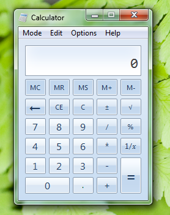
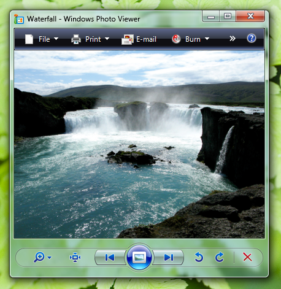
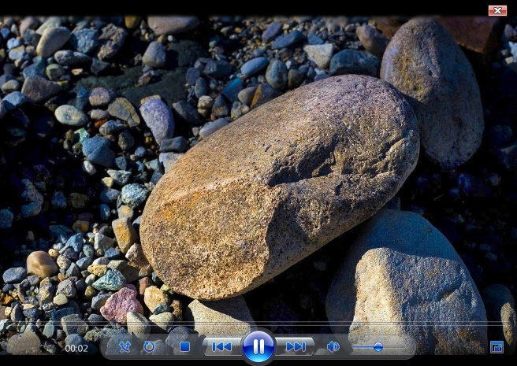
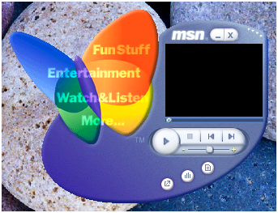
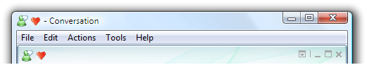

# Window Frames

> [!NOTE]
> This design guide was created for Windows 7 and has not been updated for newer versions of Windows. Much of the guidance still applies in principle, but the presentation and examples do not reflect our [current design guidance](/windows/uwp/design/).

Most programs should use standard window frames. Immersive applications can have a full screen mode that hides the window frame. Consider using glass strategically for a simpler, lighter, more cohesive look.

With a window frame, users can manipulate a window and view the title and icon to identify its contents.

A typical window frame.

**Note:** Guidelines related to [window management](win-window-mgt.md) and [branding](exper-branding.md) are presented in separate articles.

## Design concepts

### Glass window frames

The glass window frames are a striking new aspect of the Microsoft Windows aesthetic, aiming to be both attractive and lightweight. These translucent frames give windows an open, less intrusive appearance, helping users focus on content and functionality rather than the interface surrounding it.

Glass window frames.

You can use glass strategically in small regions within a window that touch the window frame. Such regions appear to be part of the window frame, even though technically they are part of the window's client area.

In this example, glass is used in the client area to make it look like part of the frame.

### Hidden frames

Sometimes the best window frame is no frame at all. This is often the case for the [primary window](glossary.md) of immersive [full screen](glossary.md) applications that aren't used in conjunction with other programs, such as media players, games, and kiosk applications.

Content viewers often benefit from having the option to show content full screen. Examples include Windows Internet Explorer , Windows Live Photo Gallery, Windows Movie Maker HD, Microsoft PowerPoint , and Microsoft Word.

In this example, Windows Media Player can display its content full screen.

### Custom frames

Most Windows applications should use the standard window frames. However, for immersive, full screen, stand-alone applications like games and kiosk applications, it may be appropriate to use custom frames for any windows that aren't shown full screen. The motivation to use custom frames should be to give the overall experience a unique feel, not just for [branding](exper-branding.md).

Custom frames are appropriate for immersive, full screen, stand-alone applications such as games.

## Guidelines

### Window frames

-   Use standard window frames.
    -   **Exception:** To give immersive full screen, stand-alone applications a unique feel:
        -   Consider hiding the window frame of the [primary window](glossary.md).
        -   Consider using custom frames for [secondary window](glossary.md).
        -   If a custom frame is appropriate, choose a design that is lightweight and doesn't draw too much attention to itself.

            **Incorrect:**

            

            In this example, the custom frame draws too much attention to itself.
-   Don't add controls to a window frame. Put the controls within the window instead.

    **Incorrect:**

    

    **Correct:**

    

    In the correct example, the control is within the client area instead of the window frame.

### Full screen mode

-   For programs that have an optional full screen mode, to enable full screen mode:
    -   Have a modal full screen command in the menu bar or toolbar. When the user clicks the command, show the command in its selected state.

        

        This example shows the full screen command along with its standard shortcut key.

-   Use F11 for the full screen shortcut key.
-   If there is a toolbar and full screen mode is commonly used, also have a graphic toolbar button with a Full screen tooltip.

    

    Examples of full screen toolbar buttons.

-   To revert back from full screen mode:
    -   Have a modal full screen command in the menu bar or toolbar. When the user clicks the command, show the command in its cleared state.
    -   Use F11 for the full screen shortcut key. If not already assigned, Esc can also be used for this purpose.

### Glass

Standard window frames use glass automatically in Windows, but you can also use glass in regions that touch the window frame.

-   **Consider using glass strategically in small regions touching the window frame without text.** Doing so can give a program a simpler, lighter, more cohesive look by making the region appear to be part of the frame.
-   
-   In this example, glass focuses the user's attention on the content instead of the controls.
-   **Don't use glass in situations where a plain window background would be more attractive or easier to use.**

**Correct:**

In this example, glass is used to give the Alt+Tab window a lightweight appearance. Glass works for this window because it consists of graphics and a single, strong text label.

**Incorrect:**

In this incorrect example, the use of glass is distracting. A plain window background would be a better choice.

 

 