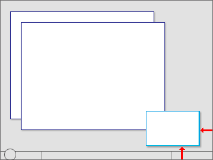
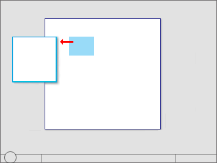
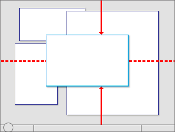

# Window Management

> [!NOTE]
> This design guide was created for Windows 7 and has not been updated for newer versions of Windows. Much of the guidance still applies in principle, but the presentation and examples do not reflect our [current design guidance](/windows/uwp/design/).

This article covers default placement of windows when initially displayed on the screen, their stacking order relative to other windows ([Z order](glossary.md)), their initial size, and how their display affects input focus.

For the following guidelines:

-   A top-level window has no owner window and is displayed on the taskbar. Examples: application windows. In Windows Vista and later, dialog boxes without owner windows and property sheets are also considered top-level.
-   An owned window has an owner window and isn't displayed on the taskbar. Examples: modal dialog boxes, modeless dialog boxes.
-   A user-initiated window is displayed as the direct result of a user's action. Otherwise, it is program initiated if initiated by a program, or system initiated if initiated by Microsoft Windows . For example, an Options dialog box is user initiated, but a meeting reminder is program initiated.
-   A contextual window is a user-initiated window that has a strong relationship to the object from which it was launched. For example, windows displayed by context menus or notification area icons are contextual, but windows displayed by menu bars are not.
-   The active monitor is the monitor where the active program is running.
-   The default monitor is the one with the Start menu, taskbar, and notification area.

## Design concepts

Window management is one of the most fundamental user activities. Before Windows Vista, windows were often given small default sizes and placed in the middle of the screen. That approach works well for older single, low-resolution monitors, but not for modern video hardware.

Windows is designed to support modern video hardware, which often runs at resolutions significantly higher than the minimum supported screen resolution and may have multiple monitors. Doing so:

-   Allows users to benefit fully from their advanced hardware.
-   Requires less effort from users to move their mouse across greater distances.
-   Makes window placement more predictable and therefore easier to find.

### The minimum supported screen resolution

The minimum [effective screen resolution](glossary.md) supported by Windows is 800x600 pixels. This means that fixed size windows should display fully at the minimum resolution (while reserving space for the taskbar), but resizable windows can be optimized for an effective resolution of 1024x768 pixels as long as they are functional at the minimum resolution.

While currently the most common physical screen resolutions for Windows PCs are 1024x768 pixels or greater, targeting 800x600 pixels allows Windows to:

-   Work well with all modern hardware, including small notebook PCs.
-   Support high dpi (dots per inch) settings.
-   Support larger fonts for accessibility.
-   Support hardware used on a global basis.

Choosing the minimum resolution to support requires striking the right balance. Targeting a higher resolution would result in a suboptimal experience for a significant percentage of modern hardware, whereas targeting a lower resolution would prevent designers from taking full advantage of the available screen space.

If you believe that your target users are using significantly higher resolutions than the Windows minimum, you can design your program to take full advantage of the extra screen space by using resizable windows that scale well.

## Guidelines

### General

-   **Support the minimum Windows effective resolution of 800x600 pixels.** For critical user interfaces (UIs) that must work in safe mode, support an effective resolution of 640x480 pixels. Be sure to account for the space used by the taskbar by reserving 48 vertical [relative pixels](glossary.md) for windows displayed with the taskbar.
-   **Optimize resizable window layouts for an effective resolution of 1024x768 pixels.** Automatically resize these windows for lower screen resolutions in a way that is still functional.
-   **Be sure to test your windows in 96 dpi (100 percent) at 800x600 pixels, 120 dpi (125 percent) at 1024x768 pixels, and 144 dpi (150 percent) at 1200x900 pixels.** Check for layout problems, such as clipping of controls, text, and windows, and stretching of icons and bitmaps.
-   **For programs with touch and mobile use scenarios, optimize for 120 dpi.** High-dpi screens are currently prevalent on touch and mobile PCs.
-   **Resizable windows no longer must show the resize glyph** in the lower-right corner, because:
    -   All sides and edges of a window are resizable, not just the lower-right corner.
    -   The glyph requires a status bar to display, yet many resizable windows don't provide status bars.
    -   The resizable window borders and resize pointers are more effective at communicating that a window is resizable than the resize glyph.

### Title bar controls

Use the title bar controls as follows:

-   **Close.** All primary and secondary windows with a standard window frame should have a Close button on the title bar. Clicking Close has the effect of canceling or closing the window.

In this example, the dialog box doesn't have a Close button in the title bar.

-   **Minimize.** All primary windows and long-running modeless secondary windows (such as progress dialogs) should have a Minimize button. Clicking Minimize reduces the window to its taskbar button. Consequently, windows that can be minimized require a title bar icon.
-   **Maximize/Restore down.** All resizable windows should have a Maximize/Restore down button. Clicking Maximize displays the window in its largest size, which for most windows is full screen; whereas clicking Restore down displays the window in its previous size. However, some windows don't benefit from using a full screen, so these windows should maximize to their largest useful size.

### Window size

-   **Choose a default window size appropriate for its contents.** Don't be afraid to use larger initial window sizes if you can use the space effectively.
-   **Use resizable windows whenever practical to avoid scroll bars and truncated data.** Windows with dynamic content and lists benefit the most from resizable windows.
-   **For text documents, consider a maximum line length of 65 characters** to make the text easy to read. (Characters include letters, punctuation, and spaces.)
-   Fixed-sized windows:
    -   **Must be entirely visible and sized to fit within the work area.**
-   Resizable windows:
    -   **May be optimized for higher resolutions, but sized down as needed at display time to the actual screen resolution.**
    -   **For progressively larger window sizes, must show progressively more information.** Make sure that at least one window portion or control has resizable content.
    -   **Should avoid default restored sizes that are maximized or near maximized.** Instead, choose a default size that is typically the most useful without being full screen. Assume that users will maximize the window instead of resizing to make it full screen.
    -   **Should set a minimum window size if there is a size below which the content is no longer usable.** For resizable controls, set minimum resizable element sizes to their smallest functional sizes, such as minimum functional column widths in list views.
    -   **Should change the presentation if doing so makes the content usable at smaller sizes.**

In this example, Windows Media Player changes its format when the window becomes too small for the standard format.

### Window location

-   **For the following guidelines, "centering" means to bias vertical placement slightly towards the top of the monitor, instead of placing exactly in the middle.** Put 45 percent of the space between the top of the monitor/owner and the window top, and 55 percent between the bottom of the monitor/owner and the window bottom. Do this because the eye is naturally biased towards the top of the screen.

    

    "Centering" means to bias vertical placement slightly towards the top of the monitor.

-   **If a window is contextual, always display it near the object that it was launched from.** Place it out of the way so that the source object isn't covered by the window.

    -   If displayed using the mouse, when possible place it offset down and to the right.

    

    Show contextual windows near the object that it was launched from.

    

    Windows launched from notification area icons are displayed near the notification area.

-   If displayed using a pen, when possible place it so as not to be covered by the user's hand. For right-handed users, display to the left; otherwise display to the right.

    

    When using a pen, also show contextual windows so that they aren't covered by the user's hand.

-   **Developers:** You can distinguish between mouse events and pen events using the [GetMessageExtraInfo](../tablet/system-events-and-mouse-messages.md) API. You can determine the user's [handedness](/previous-versions/ms819495(v=msdn.10)) using the [SystemParametersInfo](/windows/win32/api/winuser/nf-winuser-systemparametersinfoa) API with SPI\_GETMENUDROPALIGNMENT.
-   **Place progress dialogs out of the way in the lower-right corner of the active monitor.**

    

    Place progress dialogs in the lower-right corner.

-   **If a window isn't related to the current context or user action, place it away from the current pointer location.** Doing so prevents accidental interaction.
-   **If a window is a top-level application or document, always cascade its origin off the upper-left corner of the monitor.** If created by the active program, use the active monitor; otherwise, use the default monitor.

    

    Cascade top-level application or document windows off the upper-left corner of the monitor.

-   **If a window is a top-level utility, always display it "centered" in the monitor.** If created by the active program, use the active monitor; otherwise, use the default monitor.

    

    Center top-level utility windows.

-   **If a window is an owned window, initially display it "centered" on top of the owner window.** For subsequent display, consider displaying it in its last location (relative to the owner window) if doing so is likely to be more convenient.

    

    Initially center owned windows on top of the owner window.

-   **For modeless dialogs, always display initially on top of the owner window to make them easy to find.** However, if the user activates the owner window, that may obscure the modeless dialog.

    

    Display modeless dialogs initially on top of the owner window to make them easy to find.

-   **If necessary, adjust the initial location so that the entire window is visible within the target monitor.** If a resizable window is larger than the target monitor, reduce it to fit.

### Window order (Z order)

-   **Always place owned windows on top of their owner window.** Never place owned windows under their owner windows, because most likely users won't see them.
-   **Respect users' Z order selection. When users select a window, bring only the windows associated with that instance of the program (the window plus any owner or owned windows) to top of the Z order.** Don't change the order of any other windows, such as independent instances of same program.

### Window activation

-   **Respect users' window state selection. If an existing window needs attention, flash the taskbar button three times to draw attention and leave it highlighted, but don't do anything else.** Don't restore or activate the window. Don't use any sound effects. Instead, let users activate the window when they are ready.
    -   **Exception:** If the window doesn't appear on the taskbar, bring it to the top of all the other windows and flash its title bar instead.
-   **Restoring a primary window should also restore all its secondary windows**, even if those secondary windows have their own taskbar button. When restoring, place secondary windows on top of the primary window.

### Input focus

-   **Windows displayed by user-initiated actions should take input focus, but only if the window is rendered immediately** (within 5 seconds). Once the window is rendered, it can take input focus once.
    -   If a window renders slowly (more than 5 seconds), users are likely to perform another task while they wait. Taking focus at this point would be an annoyance, especially if done more than once.
-   **Windows that aren't immediately displayed or displayed by a system-initiated action shouldn't take input focus.** Instead, display on top without focus, and let users activate them when they are ready.
    -   **Exception:** Credential Manager.

### Persistence

-   **When a window is redisplayed, consider displaying it in the same state as last accessed.** When closing, save the monitor used, window size, location, and state (maximized vs. restore). When redisplaying, restore the saved window size, location, and state using the appropriate monitor. Also, consider making these attributes persist across program instances on a per-user basis. **Exceptions:**
    -   Don't save or make these attributes persist for windows when their usage is such that users are far more likely to want to start completely over.
    -   For programs likely to be used on Windows Tablet and Touch Technology computers, save two windows states for landscape and portrait modes. For more information, see [Designing for Varying Display Sizes](/previous-versions/windows/desktop/ms695587(v=vs.85)).
-   **If the current monitor configuration prevents displaying a window using its last state:**
    -   Try to display the window using its last monitor.
    -   If the window is larger than the monitor, resize the window as necessary.
    -   Move the location toward the upper-left corner to fit within the monitor as necessary.
    -   If the above steps don't solve the problem, revert to the default window placement guidelines. Consider restoring the previous size, if possible.

 

 