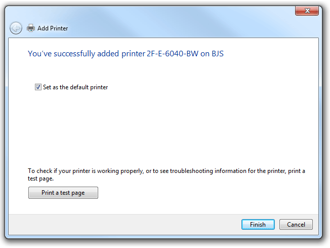
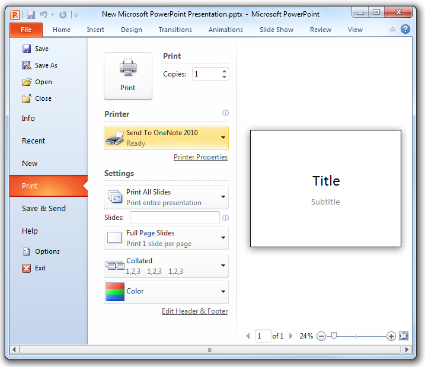
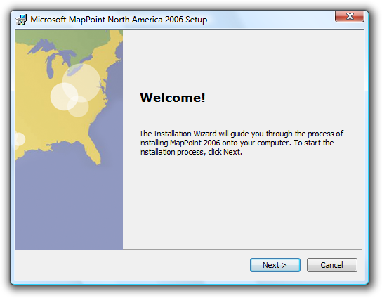

# Wizards

> [!NOTE]
> This design guide was created for Windows 7 and has not been updated for newer versions of Windows. Much of the guidance still applies in principle, but the presentation and examples do not reflect our [current design guidance](/windows/uwp/design/).

Despite that wonderful, whimsical name, wizards are not really a special form of user interface, and they have only a particular range of utility.

Wizards are used to perform multi-step tasks.

Multiple steps of a wizard are presented as a sequence of pages.

Wizards typically include the following types of pages:

-   Choice pages are used to gather information and allow users to make choices.
-   The Commit page is used to perform an action that cannot be undone by clicking Back or Cancel.
-   The Progress page is used to show the progress of a lengthy operation.

Modern wizard design places a premium on efficiency, making the Progress page optional for shorter operations, and often dispensing with the traditional [Welcome page](glossary.md) and [Congratulations page](glossary.md) at the beginning and end.

All wizard pages have these components:

-   A title bar to identify the name of the wizard, with a Back button in the upper-left corner, and a Close button with optional Minimize/Maximize and Restore buttons. Note that the title bar also includes an icon to identify it on the taskbar.
-   A main instruction to explain the user's objective with the page.
-   A content area with optional text and possibly other controls.
-   A command area with at least one commit button to commit to the task or proceed to the next step.

Although a wizard has multiple steps, these steps must all add up to a single task, from the user's point of view. This is the fundamental wizard design principle of "one wizard, one task."

Thus in this article, a task is the basic function of a wizard (for example, the task of a setup wizard is to install a program). Sub-tasks are aspects of the larger task (for example, a sub-task of a setup wizard may be to configure the program to be installed). Finally, each wizard page is considered a step in a given sub-task or task (for example, there may be two or three steps involved in configuring the program).

**Note:** Guidelines related to [setup](exper-setup.md), [dialog boxes](win-dialog-box.md), and [progress bars](progress-bars.md) are presented in separate articles.

## Is this the right user interface?

A wizard can be used for any task that requires multiple input steps. However, effective wizards have additional requirements:

-   **Does the wizard perform a single, atomic task?** Don't use interactions that aren't single tasks (a whole program should never be a wizard unless it performs a single task). Don't use wizards to combine independent tasks or largely unrelated steps.
-   **Can the number of required questions be reduced? Are there acceptable defaults that either work well for most cases or can be adjusted as needed later? Consequently, can the number of pages be reduced?** If so, try to simplify the task so that it can be presented on a single page (such as a dialog box), or eliminate the need for input completely (allowing for the task to be performed directly).
-   **Must the required questions be provided sequentially? Are there several probable, but optional questions?** If so, consider a dialog box or tabbed dialog box.

    **Correct:**

    

    The Microsoft PowerPoint Print options dialog box contains many user input options, so you could present them in a wizard. However, there is no need to provide them sequentially, so a dialog box is a better choice.

Wizards are a relatively heavy form of user interface; if there is a suitable, lighter-weight solution available, use it!

## Design concepts

### Overuse of wizards

Historically, wizards differed from ordinary UI in that they were designed to help users perform especially complex tasks (with steps residing in disparate locations) and often had built-in intelligence to help users succeed. Today, all UI should be designed to make tasks as simple as possible, so there is no need for a special UI just for this purpose.

Yet the belief persists that wizards are a special UI—largely because they are referred to as "wizards" (much more creative than, say, "dialogs" and "property windows"). Instead, it's better to consider them to be multi-step tasks and not draw special attention to that fact.

Before creating a wizard, consider whether users really must be interrupted from the main flow of the program. There may be a lighter, inline, contextual solution that will ultimately feel more helpful and efficient to users. For example, a badly designed feature in a program doesn't warrant a wizard to explain and simplify it; it warrants redesign of the feature itself. A wizard should not be used as a band-aid to fix a more basic problem with the program.

### Wizards do have appropriate functions

Wizards are one of the keys to simplifying the user experience. They allow you to take a complex operation, such as configuration of a program, and break it into a series of simple steps. At each point in the process, you can provide an explanation of what is needed, and display controls that allow the user to make selections and enter text.

Certain types of multi-step tasks lend themselves to the wizard form. For example, in Windows, several wizards involve connectivity functions (to the Internet or corporate network, or to peripheral devices such as printers and fax machines).

Connecting to a network is a typical task in Windows appropriate for a wizard.

Here the function of the wizard is to mediate between something known and stable (the out-of-box operating system) and something unknown and variable (connectivity arrangements with a phone company or Internet service provider). The complexity of computing ecosystems is significant enough now that it is genuinely helpful to use wizards to reduce that complexity.

Other types of tasks that work well as Windows wizards include high-end functionality (such as speech and handwriting recognition) and rich media experiences (such as configuring options for making and publishing movies). Wizards can also be deployed for more basic multi-step tasks, such as troubleshooting. In short, if different users are likely to want to experience your program in widely different ways, this can indicate the need for a wizard and its capacity for multiple user input points.

For your program, it is worth a little design time up-front to determine what function your wizard is serving, and whether that function really does rise to the level of deploying a wizard.

### Wizard length

Design questions naturally arise around the number and organization of pages and options. For example:

-   Is there an optimal number of pages for a wizard? Or at least a desirable range?
-   Should the wizard be concise and streamlined, so users can complete it as quickly as possible?
-   Should there be more pages that require fewer choices? Or fewer pages with more complexity? Which design is considered more usable?
-   Can you engineer faster wizard experiences by applying UI conventions such as tabbed pages?

Microsoft used to advise that wizards of three pages or fewer be designed as simple wizards, and those of four or more pages use an advanced wizard design (see the [Windows User Experience](/previous-versions/ms997609(v=msdn.10)) guidelines from 1999). But current wizard design standards dispense with what had been one of the key differences between the simple and advanced forms (the use of the Welcome and Congratulations pages), so these categories now feel inadequate, and the number of pages determining the design choice seems arbitrary.

Your wizard should be as long or short as the task requires; there is no fixed guideline for its length. A one-page wizard should really be presented as a dialog box, so two pages is probably the most condensed form possible for a wizard.

**Correct:**

This task has so few options that presenting it as a wizard would be wasteful. A dialog box is the appropriate form for this user interface.

At the other end of the spectrum, if you have a wizard that includes multiple decision points and branches, and frequently results in users losing track of their navigation path, you have exceeded a practical limit and should reduce the length of the wizard. Alternatively, you may be able to break the wizard up into several distinct tasks.

As you determine the most appropriate length for your wizard, pay particular attention to your target users. Programs for end users such as home consumers and office workers tend to use wizards to hide complexity; the wizards are as short as possible, with clean, simple page design, and pre-selected defaults for as many options as possible. By contrast, server wizards or programs intended for IT professionals tend to be longer and more complex. This group of target users has a much higher tolerance for making configuration decisions, and may in fact become suspicious if too much complexity is hidden.

If a wizard by nature simplifies a complex task, it should do so relatively minimally for a technically sophisticated audience, and relatively aggressively for a novice user base.

**Correct:**

This wizard page is well-designed for end users because it reduces a potentially complex subject to a simple, logical binary choice: either install or uninstall.

**Correct:**

In the setup wizard for Microsoft SQL Server 2008, page design is busier and the numerous choices require more thought, but the target audience is database administrators who expect tight control of feature selection.

Finally, pay attention to how frequently the particular task might be performed. An infrequent task may deploy a longer wizard, whereas frequent tasks should definitely favor brevity.

### Branching

For longer wizards, you may need to create branches of the task flow in which the sequence of pages may differ according to the user input provided "upstream." Branching is inherently dislocating for users, so you must design the user experience to convey stability. We recommend no more than two decision points that will cause branching in the entire wizard, and no more than one nested branch within a single branch.

For guidelines about creating a stable user experience within a branching wizard, see [Branching](#branching) in the Guidelines section of this article.

### Providing a navigation guide

Navigation guides can be useful when there are many steps in the task, and users may lose their place in the sequence, or simply want to know how much longer it will take to complete.

Navigation guides often appear as a list of pages or sections of the wizard, looking a bit like a table of contents, in a column or pane on the left side of each page. Although the list persists throughout the wizard (the same list of pages appears on each page), there is some visual means of indicating where the user currently is in the sequence (for example, using bold to distinguish the active page or section).

Navigation guides can be sequential or non-sequential. The sequential type presents the past pages along with the known future pages. You can present the future in terms of steps instead of pages if the steps are known and pages are dependent. You can then populate pages dynamically as they become known. Because the navigation sequence is fixed, the navigation guide isn't interactive.

Non-sequential navigation guides are interactive, so users can revisit previously viewed pages directly. They can also skip ahead of the navigation sequence for pages that are designed to be optional. Optional pages must have defaults that are acceptable in most circumstances. With this type of guide:

-   Previously viewed pages can always be viewed directly.
-   Future pages may not be viewed if they have prerequisites.
-   Pages that can be visited should be visibly distinguished from those that can't (such as by using links that are active or disabled), along with pages that are required or optional.

Users can become confused about the meaning of the Back button in this scenario. Does clicking Back lead you to the previous page or section in the navigation guide, or the last page or section viewed? Because Windows wizards now place the Back button in the upper-left corner of wizard pages, rather than in the lower-right corner with the other commit buttons, users think of Back functionality as they do on the Web. So the best solution is to give your Back button the Web navigation meaning (clicking Back should lead to the last page or section viewed), and use the wizard navigational guide for sequential navigation.

### Page integrity

Wizard design involves not only decisions pertaining to the entire task flow, like how to handle navigation and the branching experience, but also those pertaining to the individual pages that make up the wizard. **The most important principle for designing good wizard pages is that of integrity: the contents of a page should belong together.**

Wizard pages are significantly more usable if each one hangs together conceptually, dealing with only one aspect of the overall task. The [main instruction](glossary.md) is the primary means of achieving this. Clearly identify the goal or purpose of the page to users. [Supplemental instructions](glossary.md), and any controls on the page, all pertain directly to the main instruction. Although wizard pages should present users with options for which some thought is required, that effort doesn't feel like work because it is tightly focused by the integrity of the page itself.

Unfortunately wizard designers often mistake users' rapid clicking of the Next button as evidence of the usability, simplicity, and integrity of their pages. The ultimate wizard experience isn't Next, Next, Next, Next, Finish. While such an experience suggests that the defaults were well chosen, it also suggests that the wizard wasn't really necessary because all the choices are optional.

In terms of visuals and text, pare down these elements to the bare essentials. Resist the urge to bundle up multiple sub-tasks on a single page (the "burrito wizard") or to resort to tabs for presenting complex input requirements. A single page should cover a single sub-task of the overall task of the wizard.

**Incorrect:**

With three tabs of fairly dense user input required, this wizard page is trying to accomplish too much.

In most cases, maintain the size of each page throughout the wizard to foster a consistent look and feel. Although Windows wizards allow for resizable pages so that the size of a page matches the amount of content, only a few make use of this option.

And finally, maintain structural elements of each wizard page through the sequence. For example, don't move the Back button from the upper-left corner back down into the commit buttons area for a page or two. This level of layout consistency helps users feel stable within the wizard. Think of this as a baseline for the visual integrity of a page.

### Finding the right level of communication

Users have a low tolerance for reading big blocks of text on screen, and even less so within a UI surface whose express purpose is to move expeditiously through a task.

Wizards have a tendency to over-communicate. They take up a lot of space on the screen, which seems to encourage a drive to fill the space. It's like a variation on Parkinson's Law: UI text will expand to fill the space available.

One culprit in this excess is redundancy. Because of templates used in early wizard design, the same language might appear in multiple locations on a page, such as in the title bar, headings, body text, control labels, and so on.

It's worth it to hire a professional editor to prune your wizard text ruthlessly. Eliminate unnecessary questions and options on individual pages, and eliminate entire pages from the wizard as a whole (for example, the traditional Welcome and Congratulations pages). Get right to the point of the page with a concisely written main instruction, using language your target audience uses to describe the task, not the jargon of the technology or feature that you or your team uses internally. This user-centric approach is vital to improving the communication of your program's wizards.

Pay special attention to the tone of your wizard: sometimes the most lasting impressions of your program are the result not of what you say but how you say it! In wizards, users are comfortable with a friendly, conversational tone, with liberal use of the second-person pronoun ("you") when the program is asking for input. For more guidelines, see [Style and Tone](text-style-tone.md).

Reducing word count on the wizard page is generally commendable, but be careful not to go too far. If the task is important and warrants a wizard, users do appreciate having enough information to make wise choices. The following example shows how wizard text can be condensed without sacrificing meaning.

**Before:**

**After:**

The edited version of this wizard page provides a task-oriented main instruction, removes the unnecessary explanatory paragraph beneath the main instruction, and revises the check box label to clarify the check box's purpose.

**If you do only three things...**

1. Map the task you are trying to accomplish with the appropriate UI to do the job; don't simply default to a wizard when you think you need to collect a lot of input from users.

2. Think carefully about the length and structure of your wizard; prefer short, non-branching wizards to keep the experience as simple as possible, so users can get back to their primary task or interest in your program.

3. Ensure the integrity of each page in your wizard: the contents of a page should clearly belong together.

## Guidelines

### General

-   **Consider lightweight alternatives first, such as dialog boxes, task panes, or single pages.** You don't have to use wizards—you can provide helpful information and assistance in any UI.
-   **Use wizards for multi-step tasks.** Use multi-page dialog boxes for single-step tasks with feedback. For more guidelines, see [Dialog Boxes](win-dialog-box.md).

    **Correct:**

    

    

    In this example, Windows Network Diagnostics consists of progress and results pages. Because the task is only a single step, it does not require the navigational buttons that users need in a wizard. It is effectively presented as a multi-page dialog box.

### Window size

-   **Choose a window size that can display all the wizard pages without vertical or horizontal page scrolling.** While the controls on the page may require scrolling, the wizard pages themselves must not.
-   **Size windows large enough to perform their tasks comfortably.** Page layout shouldn't be cramped or require users to scroll or resize excessively.
-   **But don't make windows excessively large.** Larger windows make the task feel more complex and require additional movement for interaction.
-   **Use resizable windows for a wizard that can benefit from more screen space but doesn't require it.** Assign an appropriate minimum size. Resizable windows are helpful when pages require interacting with resizable content such as large list views.

    **Correct:**

    

    **Better:**

    

    In this example, resizing the window helps users see the full list.

-   **Consider using dynamically sized wizards whose page size changes as needed for its content.** Doing so allows a wizard to accommodate page layouts with a wide range of content.
-   **Prefer static sizing over dynamic if users may perceive the changes as a lack of stability in their experience of the wizard.** Visual stability often trumps accommodation of content. Most wizards should adopt standard, static window sizes, with dynamic sizing reserved for special cases.

### Wizard length

-   **Make your wizard as concise and streamlined as possible.** Get rid of unnecessary options and questions, and use smart defaults, to reduce the number of pages required for user input.
    -   **Exception:** IT professionals and other technical users have a higher tolerance for longer wizards and detailed input requirements.
-   **Make your wizard a minimum of two pages.** A one-page wizard should be redesigned as a dialog box instead.
-   **Don't reduce the wizard's page count simply by increasing the complexity of each page.** For example, a wizard page that includes three tabs requiring user input should be redesigned as three separate pages.
-   **Don't increase the wizard's page count by making each page so simple that users mindlessly click Next through the whole sequence.** This is a common wizard design flaw. If a wizard page does not require at least some degree of thought, it probably doesn't need to be in the wizard at all.

### Branching

-   **Prefer non-branching wizard design over branching.** Non-branching wizards tend to be simpler, shorter, and easy to navigate. Branching wizards make it more difficult for users to determine how many steps in the task, and where they are in the sequence.
-   **If you must branch, help users orient themselves by using one of the following techniques:**
    -   **Enumerate pages.** A common technique is to indicate the user's location in the sequence on each page, such as with the phrase Step X of Y. Ensure that the endpoint (Y) is stable. If it changes value, this undermines users' confidence.
    -   **Include the notion of sub-steps** (such as Step 2a of 6).
    -   **Make steps independent of pages, where each step may involve several pages.** For example, a travel service might employ wizard organization based on well-established e-commerce conventions for the industry.

        **Correct:**

        

        Logical labels can provide adequate orientation for users of a branching wizard.

    -   **Treat optional steps as persistent in the enumeration sequence.** For example, if a branch is just skipping a few optional steps, just skip the steps in the feedback as well, rather than renumbering. Thus if a user makes a choice on page 2 that results in making pages 3 and 4 optional, show steps 1, 2, 5, and 6 of 6. Don't renumber steps 5 and 6.
    -   **If the wizard employs a single branch, and the branch happens early in the task, start the sequence at that point, and then simply use the non-branching approach.** That is, beginning at the point of the branch, progress in sequence to the end of the branch.

-   **If you must branch, limit the number of branches to one or two within a single wizard.** Never include more than one branch within a branch (a "nested" branch).

### Commit buttons

-   **When users are committing to a task, use a commit button that is a specific response to the main instruction** (for example, Print, Connect, or Start). Don't use generic labels like Next (which doesn't imply commitment) or Finish (which isn't specific) for committing a task. The labels on these commit buttons should make sense on their own. Always start commit button labels with a verb. **Exceptions:**
    -   Use Finish when the specific responses are still generic, such as Save, Select, Choose, or Get.
    -   Use Finish to change a specific setting or a collection of settings.
-   **A single wizard can have multiple commit points, but a single point is preferred.**
-   **If necessary, you can rename or hide commit buttons on a page.** This flexibility is one advantage of new wizard design in Windows that was not available in older wizards. Note that hiding a commit button is different from disabling it.
-   **Avoid disabling a positive commit button.** Otherwise users have to deduce why the commit buttons are disabled. It's better to leave commit buttons enabled, and give a helpful error message whenever a problem arises. Disabling the button is only acceptable if the reason for doing so is obvious and unambiguous.
-   **Don't confuse navigational buttons (Next and Back) with commit buttons.** Next means to progress in the wizard without commitment; Back should always be available on the next page, and clicking Back should undo the effect of the last Next button. If that's not possible, users are making a commitment, and that is indicated through a specific label on the commit button. For more guidelines about the Next and Back buttons, see [Navigation](#providing-a-navigation-guide).

### Cancel buttons

-   **Don't ask users to confirm whether they really intend to cancel.** Doing so can be annoying. **Exceptions:**
    -   The action has significant consequences and, if incorrect, is not readily fixable.
    -   The action may result in a significant loss of the user's time or effort.
    -   The action is clearly inconsistent with other actions.
-   **Allow users to restart wizards in case they have cancelled by mistake.**
-   **Don't disable the Cancel button. Exceptions:**
    -   If cancelling is harmful, which might be the case when doing a task in self-contained wizards.
    -   If cancelling is impossible, which might be the case when the wizard doesn't have control over all steps.

### Close buttons

-   **Use Close for Follow-Up and Completion pages.** Don't use Cancel, because closing the window won't abandon any changes or actions done at this point. Don't use Done, because it isn't an imperative verb.
-   **Once the task has been performed, Cancel should become Close (for self-contained wizards).** The effect of Close is simply to close the window.

### Other controls

-   **Use command links only for choices, not commitments.** Specific commit buttons indicate commitment far better than command links in a wizard.
-   **When using command links, hide the Next button, but leave the Cancel button.**

### Using pages (vs. dialog boxes or inline UI)

-   **In general, prefer pages to dialog boxes.** Users expect wizards to be page-based.
-   **Use dialog boxes to assist in completing pages,** such as with object pickers and browsers.
-   **Use dialog boxes to give error messages that apply to the whole page, and result from clicking a commit button.**
-   **Use inline presentation for simple dynamic behaviors,** such as progressive disclosure and contextual UI.
-   **Use inline presentation for error messages that apply to specific controls.**

### Wizard pages

-   **Focus on efficient decision making.** Reduce the number of pages to focus on essentials. Consolidate related pages, and take optional pages out of the main flow. Having users click Next completely through your wizard may seem like a good experience at first, but if users never need to change the defaults, the pages are probably unnecessary.
-   **Design each page to have a single purpose and visual consistency.** For more information, see [Page integrity](#page-integrity).
-   **Don't use Welcome pages—make the first page functional whenever possible.** Use an optional Getting Started page only when:

    -   The wizard has prerequisites that are necessary to complete the wizard successfully.
    -   Users may not understand the purpose of the wizard based on its first Choice page, and there isn't room for further explanation.
    -   The main instruction for Getting Started pages is "Before you begin:".

    **Incorrect:**

    

-   Modern wizards opt for functional first pages. Here there is nothing to do but click Next. Why force users to pay this token tax on their valuable time?
-   **On pages in which users are asked to make choices, optimize for the most likely cases.** These types of pages should present actual choices, not just instructions.
    -   If you don't use a Getting Started page, explain the purpose of the wizard at the top of the first page of choices.
-   **Use Commit pages to make it clear when users are committing to the task.** Usually the Commit page is the last page of choices, and the Next button is relabeled to indicate the task being committed.
    -   Don't use Summary pages that merely summarize the user's previous selections, unless the task is risky (involving security, or loss of time or money) or there is a good chance that users need to review their selections.
-   **Use Progress pages to show the status of a lengthy operation.** Upon successful completion, the progress page should advance to the next step automatically. It should stay on the progress page only if there is a problem the user needs to see. Clicking Back to a progress page should have no side effect.
    -   **Use a single, determinate progress bar.** Follow the [determinate progress bar guidelines](progress-bars.md), including:
        -   Clearly indicate completion. Don't let a progress bar go to 100 percent unless the operation has completed.
        -   Don't restart progress. A progress bar loses its value if it restarts (perhaps because a step in the operation completes) because users have no way of knowing when the operation will complete. Instead, have all the steps in the operation share a portion of the progress and have the progress bar go to completion once.
    -   **Provide a concise description of the current step above the progress bar.** For quick operations, such text is unnecessary; the progress bar alone is sufficient. For operations requiring a minute or longer, text can be helpful.
        -   Use sentence fragments, typically beginning with a verb, and ending with an ellipsis. Examples: Copying files..., Installing required components....
        -   Place text above the bar, not below.
        -   **Incorrect:**
        -   
        -   In this example, the explanatory text should appear above the progress bar.
        -   Refrain from cluttering the progress page with unnecessary details. This page isn't for technical support; it's for users.
        -   **Incorrect:**
        -   
        -   In this example, technical details such as GUIDs are meaningless to users.
-   **Don't use Congratulations pages that do nothing but end the wizard.** If the wizard results are clearly apparent to users, just close the wizard on the final commit button.
    -   Use Follow-Up pages when there are related tasks that users are likely to perform as follow-up. Avoid familiar follow-up tasks, such as "Send an e-mail message."
    -   Use Completion pages only when the results aren't visible and there's no better way to provide feedback for task completion.
    -   Wizards that have Progress pages must use a Completion page or Follow-Up page to indicate task completion. For long-running tasks, close the wizard on the Commit page and use notifications to give feedback.
-   **Use Summary pages only if input is complex and users need to review, if the task involves significant risk (such as a financial transition), or if the wizard will take action based on user input that isn't obvious (to build trust through transparency).** Often, summary pages don't meet this relevancy bar, and can be omitted.
-   **Use error pages if the wizard can't be completed due to a problem from which recovery isn't possible.** On this page, explain what the problem is in clear language, free of technical jargon users won't understand. Also provide practical steps users can take to solve the problem. For more guidelines, see [Error Messages](mess-error.md).
    -   **Exception:** If the wizard completes with a minor problem from which recovery is possible, present the problem as an additional task instead of an error. Use positive, success-oriented, encouraging language, not terms like error, failure, or problem. Don't use an error icon.

### Navigation

-   **Use Next only when advancing to the next page without commitment.** Advancing to the next page is considered a commitment when its effect can't be undone by clicking Back or Cancel.
-   **Use Back only to correct mistakes.** Aside from correcting mistakes, users shouldn't have to click Back to make progress in a task.
-   **Preserve user selections through navigation.** For example, if the user makes changes, clicks Back and then Next, those changes should be preserved. Users don't expect to have to re-enter changes unless they explicitly chose to clear them.
-   **Don't disable the Back button unless repeating the steps is harmful.**
-   **Permit users to browse or revise choices in the following navigation scenarios:**
    -   User gives input, clicks commit button, clicks Back to review previous changes, doesn't change anything, and then clicks commit button again. Normally, this should be possible and the second commit should just advance to the next page (because the task has already been done).
    -   User gives input, clicks commit button, clicks Back to review previous changes, changes something, and then clicks commit button again. Normally, this should be possible and the second commit should redo the task with the changed input (replacing or undoing the effect of the first).

### Help

-   **Design wizard pages to provide enough information so that referring to documentation in program Help is unnecessary.** A wizard is already taking users away from their desired, direct interaction with the program; requiring users to seek external Help removes them even further from this state. Help should be the exception, not the rule.
-   **If you must provide an access point to Help, use a link in the lower-left portion of the content area of the page (above the command area).** This link should be brief, and usually phrased in the form of a question that users are most likely to want answered.
-   **Correct:**
-   
-   This link to Help is appropriate because basic background information like this would clutter the wizard page too much.

## Text

### General

-   Use you and your to refer to the user and the user's computer, document, settings, and so on. Don't use the first person (I, my) to refer to the computer or the wizard. However, it is acceptable to use the first person in options that the user selects. **Example:My use only** check box.
-   Every wizard page must have a [main instruction](glossary.md).

### Titles

-   Put the name of the wizard in the title bar. Use [title-style capitalization](glossary.md).
-   Titles shouldn't include punctuation, except for those with question marks.
-   Don't include the word Wizard in wizard titles. For example, use Connect to a Network instead of Network Setup Wizard.

### Buttons

-   Don't include text on the Back button. Use the arrow glyph instead, unlabeled.
-   Do include text on the Next button. Don't use glyphs (such as > or >>) in addition to the word Next.
-   Use specific commit button labels that make sense on their own and are a response to the main instruction. Ideally users shouldn't have to read anything else to understand the label. Users are far more likely to read command button labels than static text.
-   If possible, don't use the word Finish for the commit button label, because there is usually a better, more specific commit button:
    -   If clicking the button commits to the task (so the task hasn't already been performed), use a specific label that starts with a verb that is a response to the main instruction (examples: Print, Connect, Start).
    -   If the task has already been performed within the wizard, use Close instead.

        **Exceptions:**

        -   You can use Finish when the specific label is still generic, such as Save, Select, Choose, or Get.
        -   You can use Finish when the task involves changing a setting or collection of settings.

-   Start commit button labels with a verb. Exceptions are OK, Yes, and No.
-   Use [sentence-style capitalization](glossary.md).
-   Don't use ending punctuation.

## Documentation

-   Although most Windows wizards no longer have the word Wizard in the title, it's acceptable to refer to wizards as wizards in documentation. This reference should be lowercase.
-   **Correct:**
-   If you're setting up a network for the first time, you can get help by using the **Connect to a Network** wizard.
-   Some legacy wizards from earlier versions of Windows might include Wizard in the title. When referring to one of those wizards, it's acceptable to use the \[X\] Wizard to avoid saying the \[X\] Wizard wizard.
-   Refer to an individual screen within a wizard as a page.

 

 