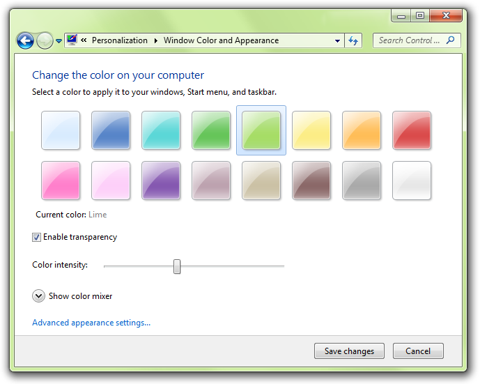

# Control Panels

> [!NOTE]
> This design guide was created for Windows 7 and has not been updated for newer versions of Windows. Much of the guidance still applies in principle, but the presentation and examples do not reflect our [current design guidance](/windows/uwp/design/).

Use control panel items to help users configure system-level features and perform related tasks. Programs that have a user interface should be configured directly from their UI instead.

With Control Panel in Microsoft Windows, users can configure system-level features and perform related tasks. Examples of system-level feature configuration include hardware and software setup and configuration, security, system maintenance, and user account management.

The term Control Panel refers to the entire Windows Control Panel feature. Individual control panels are referred to as control panel items. A control panel item is considered top-level when it is directly accessible from the control panel home page or a category page.

A typical control panel item.

The control panel home page is the main entry point for all control panel items. It lists the items by their category, along with the most common tasks. It is displayed when users click Control Panel in the Start menu.

A control panel category page lists the items within a single category, along with the most common tasks. It is displayed when users click a category name on the home page.

Control panel items are implemented using [task flows](glossary.md) or property sheets. For Windows Vista and later, task flows are the preferred user interface (UI).

**Developers:** To learn how to create control panel items, see [Control Panel Items](/previous-versions//bb776838(v=vs.85)).

**Note:** Guidelines related to [property sheets](win-property-win.md) are presented in a separate article.

## Is this the right user interface?

To decide, consider these questions:

-   **Is the purpose to configure system-level features?** If not, use another integration point. Make your application features configurable directly from the UI using options dialog boxes, instead of using Control Panel. For utilities that aren't used for setup, configuration, or related tasks (like troubleshooting), use the Start menu as the integration point.
-   **Does the system-level feature have its own UI?** If so, that UI is where users should go to make changes. For example, a system backup utility should be configured from its program options instead of from Control Panel.
-   **Will users need to change the configuration often?** If so (say, several times a week), consider alternative solutions, perhaps in addition to using Control Panel. For example, the Windows master volume setting can be configured directly from its icon in the notification area. Some settings can be configured automatically. In Windows Explorer, for example, the Compatibility tab for application properties allows an application to be run in 256 color mode instead of requiring users to change the video mode manually.
-   **Are the target users IT professionals?** If so, use a [Microsoft Management Console (MMC)](/previous-versions/windows/desktop/mmc/microsoft-management-console-start-page) snap-in instead, which is designed specifically for system management tasks. In some cases, the best solution is to have both a control panel item for general users and an MMC snap-in for IT professionals.

    

    In this example, the Local Users and Groups MMC snap-in provides user management targeted at IT professionals. Other users are more likely to use the User Accounts item in Control Panel.

-   **Is the feature an OEM feature used only during initial system configuration?** If so, use the Windows Welcome Center as the integration point.

Control panel items are necessary because many system-level features don't have a more obvious or direct integration point. Yet Control Panel shouldn't be viewed as the "one place" for all configuration settings. **Programs that have a user interface should be configured directly from their UI instead of using control panel items.**

**Incorrect:**

In this example, Windows Internet Explorer shouldn't be represented in Control Panel, because its own UI is a better integration point.

### Create a new control panel item or extend an existing one?

To decide, consider these questions:

-   **Can the functionality be expressed as tasks that can plug into an existing, extensible control panel item?** The following control panel items are extensible: Bluetooth Devices, Display, Internet, Keyboard, Mouse, Network, Power, System, Wireless (infrared).
-   **Do the properties and tasks replace the features of the existing extensible control panel item?** If so, you should extend the existing control panel item because that results in a simpler user experience. If not, create a new control panel item.

## Design concepts

**The Control Panel concept is based on a real-world metaphor.** A real-world control panel is a collection of controls (knobs, switches, gauges, and displays) used to monitor and control a device. Users of such control panels often need training to understand how to use them.

Unlike their real-world counterparts, **Windows control panel designs are optimized for first-time users.** Users don't perform most control panel tasks very often, so they usually don't remember how to do them and effectively have to relearn them every time.

To design a control panel item that is useful and easy to use:

-   Make sure the properties are necessary.
-   Present properties in terms of user goals instead of technology.
-   Present properties at the right level.
-   Design pages for specific tasks.
-   Design pages for Standard users and Protected administrators.

When designing and evaluating items to include in Control Panel, determine the common tasks that users perform and make sure there is a clear path to perform those tasks. Users typically perform the following types of tasks with control panel items:

-   Initial configuration
-   Infrequent changes (for most settings)
-   Frequent changes (for a few important settings)
-   Rolling back settings to an initial or previous state
-   Troubleshooting

**If you do only one thing...**

Design control panel pages for specific tasks, and present them in terms of user goals instead of technology.

## Usage patterns

For control panel items, you can use a task flow or a property sheet. Here are their usage patterns:

### Task flow patterns

Task flow items use a hub page to present the high-level choices, and spoke pages to perform the actual configuration.

**Hub pages**

-   Task-based hub pages. These hub pages present the most commonly used tasks. They are best used for a few commonly used or important tasks where users need more guidance and explanation. Hub pages don't have commit buttons. Hybrid task-based hub pages also have some properties or commands directly on them. Hybrid hub pages are strongly recommended when users are most likely to use Control Panel to access those properties and commands.
-   Object-based hub pages. These hub pages present the available objects using a list view control. They are best used when there could be several objects. Hub pages don't have commit buttons.

**Spoke pages**

-   Task pages. These spoke pages present a task or a step in a task with a specific, task-based main instruction. They are best used for tasks that benefit from additional guidance and explanation.
-   Form pages. These spoke pages present a collection of related properties and tasks based on a general main instruction. They are best used for features that have many properties and benefit from a direct, single-page presentation, such as advanced properties.

### Property sheet patterns

-   Property sheets are best used in legacy items with many settings targeted at advanced users. New items can achieve the same effect with a task flow using the form page pattern.

## Guidelines

### Property sheet control panel items

-   **Don't use property sheets for new control panel items.** Instead, use task flows to create a seamless experience and make full use of the categorization and search functionality of the control panel home page.

### Task flow control panel items

**General**

-   **Keep the most important content and controls visible without scrolling.** Users won't scroll to see page content unless they have a reason to. You can make commit buttons always visible by placing them in a [command area](glossary.md) instead of the content area. Don't break up pages just to avoid scrolling.
    -   **You can vertically scroll long pages,** as long as the most important controls are visible without scrolling.
    -   **Don't use horizontal scrolling.** Instead, redesign the page content and use vertical scrolling. Pages may have horizontal scrollbars only when made very narrow.
-   **To navigate between pages:**
    -   Use [task links](glossary.md) to start a task.
    -   Use task links or a Next button to navigate to the next page in a multi-step task.
    -   Use commit buttons to complete a task.
    -   Use the Back button in the menu bar to return to previously viewed pages. Do not add a Back button to the command area.
    -   Use the Address bar to return directly to the control panel home page.
    -   Use See also links in the task pane to navigate to pages in other control panel items. Otherwise, navigation should stay within a single control panel item.
-   **Put only the control panel home page in the Address bar.** Clicking that link returns to the control panel home page, abandoning any work in progress without a [confirmation](https://msdn.microsoft.com/library/windows/desktop/aa511273.aspx).
-   **Don't put a Close command button on control panel pages.** Users can close a control panel window using the Close button on the title bar.

**Task links and buttons**

-   **When a page has a small set of fixed options, use task links instead of a combination of radio buttons and a Next button.** This allows users to select a response with a single click.
-   You can put task links and buttons in the following places (in order of discoverability):
    -   The [command area](glossary.md) (for command buttons on spoke pages only).
    -   The [content area](glossary.md):
        -   Command buttons
        -   Task links
        -   Other links
    -   Links in the [task pane](glossary.md) (hub pages only).
-   **Base the location of task links and buttons on importance and need for discoverability.**
    -   **Put only commit buttons in the command area.**
    -   **Put essential tasks in the content area.** Command buttons tend to draw the most attention, so reserve them for commands users must see. Task links also draw attention, but less than command buttons.
    -   **Reserve the task pane and plain links for secondary (less important) tasks.** The task pane is the least discoverable area of a task page, and plain links aren't as visible as command buttons and task links.
-   For task links presented in the content area:
    -   **If there are more than seven links, group the links into categories.** Provide headings for each of the groups.
    -   **For fewer than seven links, present the links in a single group without a heading.**
-   **Present task links and buttons in a logical order.** List task links vertically, command buttons horizontally.
-   Within categories, **divide the commands into related groups.** Present the task groups by placing the most commonly used first, and within each group, place the most commonly used tasks first. **The resulting order should roughly follow the likelihood of use, but also have a logical flow.**
    -   **Exception:** Task links that result in doing everything should be placed first.
-   **If there are many task links, give the most important tasks a more prominent appearance** by using a 24x24 pixel icon and two lines of text. For less important tasks, use a 16x16 pixel icon, or no icon, and a single line of link text.

    

    In this example, important commands are given a more prominent appearance.

-   **Have clear physical separation between frequently used commands and destructive commands.** Otherwise, users might click destructive commands accidentally. You may need to reorder your commands somewhat to put destructive commands together.
-   **Provide the mechanism to undo commands directly on the page.** Users shouldn't have to navigate somewhere else to undo a mistake.
-   **For task links, use either all default task link icons or all custom icons.** Don't mix them. Consider using custom icons only if:
    -   They aid users in comprehending the tasks.
    -   They comply with the [Aero icon standards](vis-icons.md).
    -   They have an unobtrusive appearance.

**Dialog boxes**

When using task flows, you generally want a task to flow from page to page within a single window, but the following circumstances are exceptions. Use dialog boxes in the following circumstances:

-   To prompt users for an administrator user name and password. Always use the credential manager dialog box for this purpose. (Should be [modal](glossary.md).)
-   To confirm an in-place command using a task dialog or message box. (Should be modal.)
-   To get input for in-place commands, such as for New, Add, Save As, Rename, and Print commands.

    

    In this example, the Delete command is performed in a dialog box instead of a separate page.

-   To perform secondary, stand-alone tasks. Using a [modeless](glossary.md), secondary window allows such tasks to be performed independently and outside the main task flow.

### Hub pages

**General**

-   Use task-based hub pages when:
    -   **There are a small number of commonly used or important tasks.**
    -   **The configuration involves one or two objects** (examples: monitors, keyboard, mouse, game controllers).
    -   **The configuration applies system-wide** (examples: date and time, security, power options).
-   Use object-based hub pages when:
    -   **The configuration could involve several objects** (examples: user accounts, network connections, printers).
    -   **The configuration applies only to the selected object**.
-   **Don't use a hub page if the control panel item has a single page** that contains all the tasks and properties involved.

**Object lists**

-   **List items in a logical order.** Sort named objects in alphabetical order, numbers in numeric order, and dates in chronological order.
-   For object-based hubs, **provide object view commands in the task pane if the ability to change the view is important to the tasks**. The ability to change views is important if there are many objects and the default presentation doesn't work well for all scenarios. Users can change the list view even if there aren't explicit commands through the list view context menu, but it's less discoverable.

For more guidelines about presenting object lists, see [List Views](ctrl-list-views.md).

**Interaction**

-   **Don't put commit buttons on hub pages.** Hub pages are fundamentally launch points. Users never "commit" hub pages they are never done with them. And commit buttons on hub pages make any tasks initiated from a hub confusing (users will wonder if those tasks need to be committed).
    -   **Exception:** If changing a setting requires [elevation](glossary.md), provide an Apply button with a [security shield icon](winenv-uac.md). Disable the commit button once changes have been applied.
-   **Consider putting the most useful properties directly on hub pages.** Such hybrid hub pages are strongly recommended when users are most likely to use Control Panel to access those properties.

    

    In this example, the Power Options control panel item has the most useful settings directly on the hub page.

-   **Use an immediate commit model for any settings on hybrid hub pages so that changes are made immediately.** Again, users never commit a hub page. If a setting requires a commit button, don't put it on a hub page.
-   **Consider putting simple, "one-step" commands directly on hub pages instead of using navigation links.**
-   **Confirm in-place commands whose effects cannot be easily undone.** Use a [task dialog](win-dialog-box.md) or [message box](glossary.md).

    

    In this example, the Delete command is confirmed with a dialog box.

-   **For task-based hub pages, identify each task with a task link and an icon.** You can also provide an optional description for each link. However, try to make the task links self-explanatory and provide optional descriptions only to links that really need them.

    

    In this example, each task has a task link and an icon.

-   **For object-based hub pages, single-clicking selects objects, and double-clicking selects an object and navigates to its default page.** The default page is typically a property page or a task-based hub page.
-   **An object-based hub page may navigate to a task-based hub for the selected objects.** However, such secondary hubs should be avoided because they make a control panel item feel too indirect.

**Task panes**

Use task panes to present links to commands, views, and related control panel items.

-   For task panes in task-based hubs, present links in the following order:
    -   **Secondary commands**. Present primary tasks only in the content area. Use the task pane for secondary, optional tasks. Consider a task primary if users must discover it in important scenarios; secondary if it's acceptable for users not to discover it.
    -   **See also**. The optional links that navigate to related control panel items.
-   For task panes in object-based hubs, present links in the following order:
    -   **Object views**. The optional links used to control the presentation of the objects.
    -   **Fixed commands**. The commands that are independent of the currently selected objects.
    -   **Contextual commands**. The commands that depend on the currently selected objects, and are therefore not always displayed.
    -   **See also**. The optional links that navigate to related control panel items.
-   **Don't use task panes in spoke pages.** Unlike hub pages, spoke pages should be focused on completing the task. You don't want to encourage users to navigate away before completion.

**See also links**

-   **Provide See also links in the task pane to help users find related control panel items, or the right control panel item if they have the wrong one.** Link to items users are likely to associate with your control panel item.

    

    In this example, the Action Center control panel item links to related control panel items.

-   **Link to a specific task page if that is what users are more likely to recognize.** Otherwise, link to the entire control panel item. Use the control panel name without adding the phrase, control panel.

### Spoke pages

**General**

-   **Use task pages for commonly used or important tasks where users need more guidance and explanation.**
-   **Use form pages for features that have many settings and benefit from a direct, single-page presentation.** The ideal tasks for such pages typically involve obvious changes to a few simple properties.
-   **Don't use task panes in spoke pages.**

**Interaction**

-   **Try to limit main tasks to a single page.** If more than one page is required, you can:
    -   **Use intermediate spoke pages for additional or optional steps.** Intermediate spoke pages are committed by the final spoke page.
    -   **Use independent windows for independent auxiliary tasks.** Independent windows are committed on their own, and independently of the main task.

Doing so keeps the meaning of the commit buttons for the main task clear and unambiguous. Users should always be confident in understanding what they are committing to.

-   **Don't use See Also links within a task flow.** These link to related, but different, control panel items. Although navigating to a different item is acceptable in hub pages, it is not in spoke pages, because doing so interrupts the task.
-   **Don't use spoke pages for simple input or confirmations.** Use modal dialog boxes instead.

**Interaction (intermediate spoke pages)**

-   **Use task links or a Next button to navigate to the next page.** The way to proceed to the next step should always be obvious.
-   **You can have navigation links to optional task steps.** To avoid confusion when users commit to the task, those extra pages should be intermediate pages within the same control panel item. They shouldn't have commit buttons, but should be committed when the main task is committed.

**Interaction (final spoke pages)**

-   **Use commit buttons to complete a task.** Use a [delayed commit model](glossary.md) for spoke pages, so that changes aren't made until explicitly committed (if users navigate away using Back, Close, or the Address bar, changes are abandoned). The commit buttons are a visual clue that the user is about to complete a task. Don't use links for this purpose.
-   **Don't confirm commit buttons (including Cancel).** Doing so can be annoying. Exceptions:
    -   The action has significant consequences and, if incorrect, not readily fixable.
    -   The action may result in a significant loss of the user's time or effort.
    -   The action is clearly inconsistent with other actions.
-   **Don't confirm if users abandon changes** by navigating away using Back, Close, or the Address bar. However, you may confirm if a potentially unintended navigation may result in a significant loss of the user's time or effort.
-   **Don't use command or navigation links** (including See also links). On final spoke pages, users should explicitly complete or cancel the task. Users should not be encouraged to navigate somewhere else, because doing so would likely cancel the task implicitly.
-   **When users complete or cancel a task, they should be sent back to the hub page from which the task was launched.** If there is no such page, close the control panel window instead. Don't assume that spoke pages are always launched from another page.
-   **Remove the stale "committed" pages from the Windows Explorer Back stack** when you return users back to the page that the task was launched from. Users should never see the pages that they have already committed to when clicking the Back button. Users should always make additional changes by completely redoing the task instead of clicking Back to modify stale pages.
    -   **Developers:** You can remove these stale pages using the ITravelLog::FindTravelEntry() and ITravelLogEx::DeleteEntry() APIs.

**Commit buttons**

**Note:** Cancel buttons are considered to be commit buttons.

-   **Confirm tasks using commit buttons that are specific responses to the main instruction, instead of generic labels such as OK.** The labels on commit buttons should make sense on their own. Avoid using OK because it isn't a specific response to the main instruction, and therefore easier to misunderstand. Furthermore, OK is typically used with modal dialog boxes and incorrectly implies closing the control panel item window.
    -   **Exceptions:**
        -   Use OK for pages that don't have settings.
        -   Use OK when the specific response is still generic, such as Save, Select, or Choose, as when changing a specific setting or a collection of settings.
        -   Use OK if the page has radio buttons that are responses to the main instruction. To maintain the delayed commit model, you can't use task links on a final spoke page.

            

            In this example, the radio buttons, not the commit buttons, are responses to the main instruction.
-   **Provide a Cancel button to let users explicitly abandon changes.** While users can implicitly abandon a task by not confirming their changes, providing a Cancel button allows them to do so with greater confidence.
    -   **Exception:** Don't provide a Cancel button for tasks where users can't make changes. The OK button has the same effect as Cancel in this case.
-   **Don't use Close, Done, or Finish commit buttons.** These buttons are typically used with modal dialog boxes and incorrectly imply closing the control panel item window. Users can close the window using the Close button on the title bar. Also, Done and Finish are misleading because users are returned to the page where the task was launched from, so they aren't really done.
-   **Don't disable commit buttons.** Otherwise users have to deduce why the commit buttons are disabled. It's better to leave commit buttons enabled, and give a helpful error message whenever there is a problem.
-   **Make sure the commit buttons appear on the page without scrolling.** If the page is long, you can make commit buttons always visible by placing them in a [command area](glossary.md), instead of in the content area.

    

    In this example, content area size is unbounded, so the commit buttons are placed in the command area.

-   Right-align the commit buttons and use this order (from left to right): positive commit buttons, Cancel, and Apply.

**Preview buttons**

-   Make sure **the Preview button means to apply the pending changes now but restore the current settings if users navigate away from the page without committing to the changes.**
-   **You can use Preview buttons on any spoke page.** Hub pages don't need Preview buttons because they use an [immediate commit model](glossary.md).
-   **Consider using a Preview button instead of an Apply button for control panel pages.** Preview buttons are easier for users to understand and can be used on any spoke page.
-   **Provide a Preview button only if the page has settings (at least one) with effects that users can see.** Users should be able to preview a change, evaluate the change, and make further changes based on that evaluation.
-   **Always enable the Preview button.**

**Live previews**

A control panel item has live preview when the effect of changes on a spoke page can be seen immediately.

-   **Consider using live preview for display settings when:**
    -   The effect is obvious, typically because it applies to the entire monitor.
    -   The effect can be applied without significant delay.
    -   The effect is safe and can be undone easily.

        

        In this example, the effect of the Windows Color and Appearance settings is seen immediately. Doing so allows users to make changes with minimal effort.

-   **Use Save changes and Cancel for the commit buttons.** "Save changes" keeps the current settings, whereas Cancel reverts to the original settings. "Save changes" is used instead of OK to make it clear that any previewed changes haven't been applied yet.
-   **Don't provide an Apply button.** The live preview makes Apply unnecessary.
-   **Restore any changes if users navigate away** using Back, Close, or the Address bar. To preserve changes, users must commit them explicitly.

**Apply buttons**

-   Make sure **the Apply button means apply the pending changes (made since the task was started or the last Apply), but remain on the current page.** Doing so allows users to evaluate the changes before moving on to other tasks.
-   **Use Apply buttons only on final spoke pages.** Apply buttons should not be used on intermediate spoke pages to maintain an immediate commit model.
    -   **Exception:** You can use Apply buttons on a hybrid hub page if changing a setting requires [elevation](glossary.md). For more details, see [hub page interaction](#hub-pages).
-   **Provide an Apply button only if the page has settings (at least one) with effects that users can evaluate in a meaningful way.** Typically, Apply buttons are used when settings make visible changes. Users should be able to apply a change, evaluate the change, and make further changes based on that evaluation.
-   **Enable the Apply button only when there are pending changes;** otherwise, disable it.
-   **Assign "A" as the access key.**

### Control panel integration

To integrate your control panel item with Windows, you can:

-   **Register your control panel item (including its name, description, and icon)**, so that Windows is aware of it.
-   If your control panel item is top level (see below):
    -   Associate it with the appropriate **category page**.
    -   **Provide task links (including their name, description, keywords, and command line)** to indicate primary tasks and allow users to navigate directly to the tasks.
-   **Provide search terms** to help users find your task links using the Control Panel search feature.

    Note that you can provide this information only for individual control panel items you can't add or change this information for existing control panel items that you extend.

**Category pages**

-   **Add your control panel item to a category page only if:**

    -   Most users need it. Example: Network and Sharing Center
    -   It is used many times. Example: System
    -   It provides important functionality that isn't exposed elsewhere. Example: Printers

    Control panel items that meet these criteria are referred to as top level.

-   **Don't add your control panel item to a category page if:**

    -   It is rarely used or used for one-time setup. Example: Welcome Center
    -   It is targeted at advanced users or IT professionals. Example: Color Management
    -   It doesn't apply to the current hardware or software configuration. Example: Windows SideShow (if not supported by current hardware).

    Removing such control panel items from the category pages makes the top-level items easier to find. Given their usage, these control panel items are sufficiently discoverable through search or contextual entry points.

-   **Associate your top-level control panel item with the category under which users are most likely to look for it.** This decision should be based on user testing.
-   **Consider associating your top-level control panel item with the second most likely category as well.** You should associate a control panel item with two categories if users are likely to look for its main tasks in more than one place.
-   **Don't associate your control panel item with more than two categories.** The value of the categorization is undermined if control panel items appear in several categories.

**Task links**

-   **Associate your control panel item with its primary tasks.** You can display up to five tasks on a Category page, but additional tasks are used for control panel searching. Use the same phrasing as you do for task links, possibly removing some words to make the task links more succinct.
-   **Prefer to have task links lead to different places in your control panel item.** Having multiple links to the same place can be confusing.

**Search terms**

-   **Register search terms for your control panel item that users are most likely to use to describe it.** These search terms should include:

    -   The features or objects configured.
    -   The primary tasks.

    These search terms should be based on user testing.

-   **Also include common synonyms for these search terms.** For example, monitor and display are synonyms, so both words should be included.
-   **Include alternative spellings or word breaks.** For example, users might search for either web site and website. Consider providing common misspellings as well.
-   **Consider singular vs. plural noun forms.** The control panel search feature doesn't automatically search for both forms; supply the forms for which users are likely to search.
-   **Use simple present tense verbs.** If you register connect as a search term, the search feature won't automatically look for connects, connecting, and connected.
-   **Don't worry about case.** The search feature is not case-sensitive.

### Standard users and Protected administrators

**Many settings require administrator privileges to change.** If a process requires administrator privileges, Windows Vista and later requires [Standard users](glossary.md) and [Protected administrators](glossary.md) to elevate their privileges explicitly. Doing so helps prevent malicious code from running with administrator privileges.

For more information and examples, see [User Account Control](winenv-uac.md).

### Schemes and themes

A scheme is a named collection of visual settings. A theme is a named collection of settings across the system. Examples of schemes and themes include Display, Mouse, Phone and Modem, Power Options, and Sound and Audio Options.

-   **Allow users to create schemes when:**

    -   **Users are likely to change the settings.**
    -   **Users are most likely to change settings as a collection.**

    Schemes are useful when users are in a different environment, such as a different physical location (country/region, time zone); using their computer in a different situation (on batteries, docked/undocked); or using their computer for a different function (presentations, video playback).

-   **Provide at least one default scheme.** The default scheme should be well named and apply to most users in most circumstances. Users shouldn't have to create a scheme of their own.
-   **Provide a preview** or other mechanism so that users can see the settings within the scheme.

    

    In this example, the Personalization control panel item shows a preview of the desktop and appearance settings.

-   **Provide Save As and Delete commands.** A rename command isn't necessary users can rename schemes by saving under the desired name and deleting the original scheme.
-   If the settings can't be applied without a scheme, **don't allow users to delete all the schemes.** Users shouldn't have to create a scheme of their own.
-   If the schemes are not completely independent (for example, power schemes depend upon the current laptop mode of operation), **make sure there is an easy way to change settings that apply across all schemes.** For example with power schemes, make sure that users can set what happens when a portable computer's lid is closed in a single location.

### Miscellaneous

-   **Use Control Panel extensions for features that replace or extend existing Windows functionality.** The following control panel items are extensible: Bluetooth Devices, Display, Internet, Keyboard, Mouse, Network, Power, System, Wireless (infrared).

### Default values

-   **The settings within a control panel item must reflect the current state of the feature.** Doing otherwise would be misleading and possibly lead to undesired results. For example, if settings reflect the recommendations but not the current state, users might click Cancel instead of making changes, thinking that no changes are needed.
-   **Choose the safest (to prevent loss of data or system access) and most secure initial state.** Assume that most users won't change the settings.
-   **If safety and security aren't factors, choose the initial state that is most likely or convenient.**

## Text

### Item names

-   **Choose a descriptive name that clearly communicates and differentiates what the control panel item does.** Most names describe the Windows feature or object being configured, and are displayed in the Classic View of the control panel home page.
-   **Don't include the words "Settings," "Options," "Properties," or "Configuration" in the name.** This is implied, and leaving it off makes it easier for users to scan.

    **Incorrect:**

    Accessibility Options

    Modem Settings

    Power Options

    Regional and Language Options

    **Correct:**

    Accessibility

    Modem

    Power

    Regional Formats and Languages

    In the correct examples, unnecessary words are removed.

-   **If the control panel item configures related features, list only those features required to identify the item, and list the features the most likely to be recognized or used first.**

    **Incorrect:**

    Folder Options

    Phone and Modem Options

    **Correct:**

    Files and Folders

    Modem

    In the correct examples, the primary control panel item features are given emphasis.

-   Use [title-style capitalization](glossary.md).

### Page titles

**Note:** As with all Explorer windows, control panel page titles are displayed on the [address bar](glossary.md), but not the title bar.

-   **For hub pages, use the control panel item name.**
-   **For spoke pages, use a concise summary of the page's purpose.** Use the page's main instruction if it is concise; otherwise use a concise restatement of the main instruction.

    

    In this example, Power Options is used for the page title instead of the main instruction.

-   Use title-style capitalization.

### Task link text

The following guidelines apply to links to task pages, such as Category page task links and See also links.

-   **Choose concise task names that clearly communicate and differentiate the task.** Users shouldn't have to figure out what the task really means or how it differs from other tasks.

    **Incorrect:**

    Adjust display settings

    **Correct:**

    Screen resolution

    In the correct example, the wording conveys more precision.

-   **Retain similar language between task links and the pages they point to.** Users shouldn't be surprised by the page that is displayed by a link.
-   **For task pages, design the main instruction, commit buttons, and task links as a related set of text.**
    

    | Example                             |    Instruction                                                   |
    |------------------------------|-------------------------------------------------------|
    | Task link:         | Connect to a wireless network               |
    | Main instruction:  | Choose a network to connect to              |
    | Commit button:     | Connect                                     |
    | Task link:         | Set up parental controls                    |
    | Main instruction:  | Choose a user and set up parental controls  |
    | Commit button:     | Apply parental control                      |
    | Task link:         | Resolve your sync conflicts                 |
    | Main instruction:  | How do you want to resolve this conflict?   |
    | Commit button:     | Resolve                                     |

    

     

    These examples show the relationship of the task link text, main instruction, and commit button text.

-   While tasks often start with verbs, **consider omitting the verb on Category pages if it is a generic, configuration-related verb that doesn't help communicate the task.**

    **Specific, helpful verbs:**

    Add

    Check

    Connect

    Copy

    Create

    Delete

    Disconnect

    Install

    Remove

    Set up

    Start

    Stop

    Troubleshoot

    **Generic, unhelpful verbs:**

    Adjust

    Change

    Choose

    Configure

    Edit

    Manage

    Open

    Pick

    Set

    Select

    Show

    View

-   **If the task configures several related features, list only the features that are representative of the set.** Omit details that can be readily inferred.

    **Incorrect:**

    Speaker volume, mute, volume icon

    Speakers, microphones, MIDI, and sound schemes

    **Correct:**

    Speaker volume

    Speakers and microphones

    In the correct examples, only the representative features are given in the task link.

-   **You should phrase tasks in terms of technology only if target users would do so as well.**

    **Incorrect:**

    Connectoids

    Pixel depth

    dpi

    **Correct:**

    Printers

    Scanners

    Mouse

    The correct examples are technology-based terms that target users are likely to use, whereas the incorrect examples are not.

-   Use plural nouns only if the system can support more than one.
-   Use [sentence-style capitalization](glossary.md).
-   Don't use ending punctuation.

### Main instructions

-   **For the hub page, use the main instruction to explain the user's objective with the control panel item.** The main instruction should help users determine if they have selected the right control panel item. Keep in mind that users might have selected your control panel item in error and are actually looking for settings that are part of another control panel item.

    **Examples:**

    Keep your computer secure and up-to-date

    Optimize your computer so it's easier to see, hear, and control

-   **For spoke pages, use the main instruction to explain what to do on the page.** The instruction should be a specific statement, imperative direction, or question. Good instructions communicate the user's objective with the page rather than focusing purely on the mechanics of manipulating it.

    **Incorrect:**

    Pick a notification task

    **Correct:**

    Indicate how to handle incoming information

    The correct version better communicates the goal achieved by the page.

-   **Use specific verbs whenever possible.** Specific verbs are more meaningful to users than generic ones.
-   Use [sentence-style capitalization](glossary.md).
-   **Don't include final periods if the instruction is a statement.** If the instruction is a question, include a final question mark.

### Supplemental instructions

-   **For the hub page, use the optional supplemental instruction to further explain the purpose of the control panel item.**
-   **For spoke pages, use the optional supplemental instruction to present additional information helpful to understanding or using the page.** You can provide more detailed information and define terminology.
-   Use complete sentences and [sentence-style capitalization](glossary.md).

### Page text

-   **Don't restate the main instruction in the content area.**
-   **Use the word "page" to refer to the page itself.**
-   **Use the second person (you, your) to tell users what to do** in the main instruction and content area. Often the second person is implied.

    **Example:**

    Choose the pictures you want to print.

-   **Use the first person (I, me, my) to let users tell the control panel item what to do** in the content area that responds to the main instruction.

    **Example:**

    Print the photos on my camera.

### Task links

-   **Choose concise link text that clearly communicates and differentiates what the task link does.** It should be self-explanatory and correspond to the main instruction. Users shouldn't have to figure out what the link really means or how it differs from other links.
-   **Always start task links with a verb.**
-   Use [sentence-style capitalization](glossary.md).
-   Don't use ending punctuation.
-   **If the task link requires further explanation, provide the explanation in a separate text control** using complete sentences and ending punctuation. However, add such explanations only when needed don't add explanations to all task links because another task link needs one.

For more information and examples, see [Links](ctrl-command-links.md).

### Commit buttons

-   **Use specific commit button labels that make sense on their own and match the main instruction.** Ideally users shouldn't have to read anything else to understand the label. Users are far more likely to read command button labels than static text.
-   **Always start commit button labels with a verb.**
-   **Don't use Close, Done, or Finish.** These button labels are better suited for other types of windows.
-   Use [sentence-style capitalization](glossary.md).
-   Don't use ending punctuation.
-   Assign a unique [access key](glossary.md).
    -   **Exception:** Don't assign access keys to Cancel buttons, because Esc is its access key. Doing so makes the other access keys easier to assign.

## Documentation

When referring to the control panel home page or category pages:

-   In user documentation, refer to Control Panel, using title-style capitalization and omitting a preceding definite article the.

    **Example:**

    In Control Panel, open **Security Center**.

-   In programming and other technical documentation, refer to control panel home page and control panel category page, without capitalizing any of the words. A preceding definite article is optional.

For control panel items:

-   When referring to an individual control panel item, use "\[control panel item name\] in Control Panel" or generally "Control Panel item" in user documentation. Don't use applet, program, or control panel to refer to individual control panel items.
-   When referring to a control panel item's hub page, use "main \[control panel item name\] page."
-   When possible, format the control panel name using bold text. Otherwise, put the name in quotation marks only if required to prevent confusion.

Examples:

-   In Control Panel, open **Parental Controls**.
-   Return to the main **Parental Controls** page.

