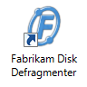
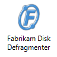

# Desktop

> [!NOTE]
> This design guide was created for Windows 7 and has not been updated for newer versions of Windows. Much of the guidance still applies in principle, but the presentation and examples do not reflect our [current design guidance](/windows/uwp/design/).

The desktop is the user's work area for their programs. It's not a way to promote awareness of your program or its brand. Don't abuse it!

The desktop is the onscreen work area provided by Microsoft Windows, analogous to a physical desktop. It consists of a [work area](glossary.md) and [taskbar](winenv-taskbar.md). The work area may span multiple monitors.

A typical Windows desktop.

The active monitor is the monitor where the active program is running. The default monitor is the one with the Start menu, taskbar, and notification area.

## Design concepts

The Windows desktop has the following program access points:

-   **Work area.** The onscreen area where users can perform their work, as well as store programs, documents, and their shortcuts. While technically the desktop includes the taskbar, in most contexts it refers just to the work area.
-   **Start button.** The access point for all programs and special Windows places (Documents, Pictures, Music, Games, Computer, Control Panel), with "most recently used" lists for quick access to recently used programs and documents.
-   **Quick Launch. Removed from Windows 7.** A direct access point for programs selected by the user.
-   **Taskbar.** The access point for running programs that have desktop presence. While technically the taskbar spans the entire bar from the Start button to the notification area, in most contexts taskbar refers to the area in between, containing the taskbar buttons. This area is sometimes referred to as the taskband.
-   **Deskbands. Not recommended.** Minimized functional, long-running programs, such as the Language Bar. Programs that minimize to deskbands don't display taskbar buttons when minimized.
-   **Notification area.** A short-term source for notifications and status, as well as an access point for system- and program-related features that have no presence on the desktop.

The Windows desktop access points include the Start button, taskbar, and notification area. Note the thumbnail feature of the taskbar button.

**The Windows desktop is a limited, shared resource that is the user's entry point to Windows. Leave users in control.** You should use its areas as intended—any other usage should be considered an abuse. Never view them as ways to promote awareness of your program or its [brand](exper-branding.md).

For Windows 7, Original Equipment Manufacturers (OEMs) and Independent Hardware Vendors (IHVs) can use Device Stage to design a customized, branded UI for the computer and devices, without cluttering users' desktops. OEMs in particular can use Device Stage PC to feature custom programs, service offerings, and support. For more information, see the [Microsoft Device Experience Development Kit](https://www.microsoft.com/whdc/device/DeviceExperience/Dev-Kit.mspx).

**If you do only one thing...**

-   Don't abuse the desktop—keep users in control. If your target users are likely to use your program frequently, provide an option during setup to put a shortcut on the desktop, unselected by default.

## Guidelines

-   **If your users are very likely to use your program frequently, provide an option during setup to put a program shortcut on the desktop.** Most programs won't be used frequently enough to warrant offering this option.
-   **Present the option unselected by default.** Requiring users to select the option is important because once undesired icons are on the desktop, many users are reluctant to remove them. This can lead to unnecessary desktop clutter.
-   **If users select the option, provide only a single program shortcut.** If your product consists of multiple programs, provide a shortcut only to the main program.
-   **Put only program shortcuts on the desktop.** Don't put the actual program or other types of files.

    **Correct:**

    

    **Incorrect:**

    

    In the incorrect example, the program, not a shortcut, is copied to the desktop.

-   **Choose a label that can be displayed without truncation.** Users shouldn't see an ellipsis.

    **Correct:**

    

    **Incorrect:**

    

    In the incorrect example, the program shortcut label is so long that it is truncated.

## Documentation

-   When referring to the desktop, use desktop, uncapitalized.
-   When referring to desktop shortcuts, use shortcut, uncapitalized.

 

 