# Help

> [!NOTE]
> This design guide was created for Windows 7 and has not been updated for newer versions of Windows. Much of the guidance still applies in principle, but the presentation and examples do not reflect our [current design guidance](/windows/uwp/design/).

Use Help as a secondary mechanism to help users complete and better understand tasks the primary mechanism being the UI itself. Apply these guidelines to make the content truly helpful and easy to find.

A Help system is composed of various types of content designed to assist users when they are unable to complete a task, want to understand a concept in more detail, or need more technical details than are available in the UI.

In this article, we refer to Help as secondary to UI. The UI is primary because that is where users first try to solve their problems. They consult the Help system only if they can't accomplish their task with the UI.

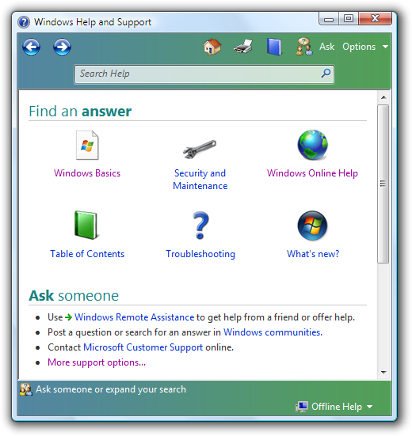

The Windows Help and Support home page, available from the Start menu.

**Note:** Guidelines related to [style and tone](text-style-tone.md) are presented in a separate article.

## Is this the right user interface?

To decide, consider these questions:

-   **How motivated are your target users?** The more highly motivated they are to discover functionality of your program and become intermediate or even advanced users of it, the more willing they will be to research answers to their questions by consulting Help topics.
-   **Are you using Help to fix a bad UI?** The better your UI, the less users will seek additional help. If your program has very clear, helpful primary UI (such as jargon-free error messages, well-written wizards, and unambiguous dialog boxes), you may not need a secondary Help system at all.
-   **Is your program relatively simple?** If so, consider incorporating all necessary assistance content into your primary UI surfaces. Users are more likely to seek additional help in programs that perform complex tasks.
-   **Is your application intended for developers, IT professionals, or other software experts?** These users tend to expect reference Help for programming language conventions and in-depth conceptual Help for mastery of features.

## Design concepts

If you decide to include Help in your program, integrate it into your overall design. The Help interface should be simple, efficient, and relevant; it should enable users to get help easily and then return to their task. Think of your Help system in terms of users' time: minimize disruption first by anticipating where they will encounter problems in your program, then solving those problems by incorporating fundamental assistance directly into your UI, and creating clear and consistent entry points into your more detailed Help.

Windows assistance was designed according to these principles. Here are some of the design changes to the Windows Help user experience:

-   More discoverable entry points to Help from the primary UI (especially new Help links from UI surfaces such as dialog boxes, error messages, and wizards). Help links take you directly to the pertinent topic in Help.
-   A Help button icon is available in the upper-right corner of most Control Panel hub pages, as well as shell folders.
-   Users can choose to get the most up-to-date Help content from Windows Online Help and Support when they're online.
-   Help topics are now task-based rather than feature-focused, so that users can accomplish their tasks quickly and efficiently.
-   Help topics are now largely based on known top user scenarios.
-   Help topics have a more relaxed and informal [tone](text-style-tone.md), using real-world language.
-   Help topics are designed for effective scanning, as users rarely read the content word-for-word.

### An analogy for Help

To think in greater depth about designing your Help system, consider an analogy from everyday life. You are lost in an unfamiliar city. What do you do? Many would react like this:

-   Get oriented; look for landmarks, street signs (names and pointers to places).
-   Look for maps.
-   Finally, as a last resort, ask for directions or call a friend.

The design of the city's "interface" affects your need for assistance. Well-labeled streets, explicit directions (pointers to hospitals, airports, museums, and the post office), and clear landmarks such as prominent geographical features or buildings help you find your way.

You ask for help as a last resort. It's an indication that the city's "interface" has failed by being poorly designed and confusing. You are more likely to ask for help in a place that has a specific label that suggests helpfulness. For example, you are more likely to ask for help in a place labeled "Directions" or "Information" than a general place like the City Hall even though just about anyone at City Hall could give you directions.

When you ask for help, chances are you are frustrated and just want to get to your intended destination. You probably aren't in the mood to spend time taking a tour of the city or learning about its history. Further, your motivation depends on the importance of the task. If you are trying to find your hotel room, you will do whatever it takes. However, if your goal is to find a place of minor importance, most likely you will just give up after a modest effort.

All of these aspects of finding your way in real space correspond to how users typically find their way in the virtual space of your program. Seeking help beyond the primary UI is by its very nature disorienting; do your best to mitigate such an experience by well-designed UI and intelligent "street signs" to direct users to the answers they need.

### Designing UI so that Help is unnecessary

Try to make Help unnecessary in the first place, by:

-   Making common tasks easy to discover and perform.
-   Providing clear [main instructions](text-ui.md).
-   Providing clear, concise control labels that are goal- and task-oriented.
-   Providing supplemental instructions and explanations where needed.
-   Anticipating avoidable problems by using controls constrained to valid choices, providing suitable default values, handling all input formats, and preventing errors.
-   Writing error messages that provide a clear solution or action for the user to take.
-   Avoiding confusing UI designs, such as tasks with poor flow or using controls that are disabled for no apparent reason.
-   Working with writers and editors early in the development cycle to create high-quality, consistent [UI text](text-ui.md) throughout your program.

Users shouldn't have to go somewhere else to figure out how to use your UI. Add essential information directly into the primary UI, rather than forcing users out of their immediate context and into the Help pane. If important information exists only in a Help topic, there's a good chance that users won't see it. For information that is optional and more explanatory, use Help links from the primary UI to the relevant Help topic for supplemental assistance.

### Considering user motivation

For most users, speed and efficiency are among the paramount virtues of good programs. Users want to get their work done. Generally, they are not interested in learning about the program and the technology for its own sake; their patience extends only insofar as that program serves their own interests and solves problems at hand.

Design your Help system to match your users' motivation. For example, consider a user who has strolled up to a kiosk at a museum. If she cannot figure out how to perform the task quickly, she is likely just to give up and walk away. She is unlikely to spend time using Help. Alternatively, a highly-motivated user has a higher tolerance for time spent researching your Help system for answers. A business user who must balance the books, for example, is probably willing to consult Help content to get the most out of that new accounting application.

### Writing content for scanning

Write Help topics knowing that they will be scanned for specific information, not read word-for-word. Write concisely, getting to the point quickly, and providing information that users can act on.

-   Write "how-to" topics using numbered steps in a consistent format so that users recognize they are getting procedural assistance.
-   Write reference topics with ease-of-scanning in mind, using tables, for example, to present UI options or language syntax.
-   Write conceptual topics that are logically organized by subheadings, so that the user can skip whole sections of lesser interest.

In all Help content, it is easier to scan bulleted lists than standard paragraph blocks of text; use bullet lists judiciously, though, not as a crutch for unorganized material.

### Creating content that matters

Given that no Help system can anticipate every question that every user might have, focus most of the content on answering the top questions in the top scenarios for your target users. For example, effective searching and how to establish network connectivity (among other tasks) may be highly sought-after topics. Also, focus on tasks within your top user scenarios, rather than documenting a feature or technology exhaustively for its own sake.

**Tip:** Technical support is a good source for Help content. Help desks often keep records of frequently asked questions about particular programs or tasks that users are trying (and failing) to accomplish.

It isn't necessary to provide help for every feature in the UI. **Quite often, unhelpful Help results from trying to create Help for everything.** If the UI is well designed, most of these Help topics won't be very helpful; they will just restate the obvious.

If there is more than one way to perform a task, in most cases you can just document the most common way used by inexperienced users. Exceptions to this include accessibility considerations (documenting keyboard equivalents of mouse actions, for example), and platform considerations (documenting for the tablet form factor, for example, or for server environments in which the command line can substitute for the graphical user interface).

Remember that users often don't think of the problems they are encountering in exactly the same terms as you do. For example, users may find it strange to think of themselves as an "account." Be sure to design your search and indexing functionality, then, to account for likely terminology variations and synonyms.

Between the primary UI and the Help system, though, terms should be very similar if not identical. Users can be confused when the Help system language doesn't correlate very closely to what they are seeing on the screen.

### Writing compelling Help link text

When you link to a Help topic from your primary UI, be sure to write compelling Help link text. Clear and specific language inspires confidence. Users tend to believe that generic Help links (a button with the word "Help" or "Learn more" on it) will not lead to the right information without a significant investment of time.

**If you do only five things...**

1.  Design your UI so that users don't need Help.
2.  Make your Help helpful by focusing the content on the top questions in the top scenarios for your target users.
3.  Present the Help content so that it is easy to scan.
4.  Understand that you don't have to provide help for every feature in the UI.
5.  Make the Help entry points discoverable and compelling.

## Usage patterns

Different kinds of content serve different purposes.

|                                                                                                              |                                                                                                                                                                                                                                                                                                                                                                                       |
|--------------------------------------------------------------------------------------------------------------|---------------------------------------------------------------------------------------------------------------------------------------------------------------------------------------------------------------------------------------------------------------------------------------------------------------------------------------------------------------------------------------|
| **Procedural Help**  provides the steps for carrying out a task.                         | Procedural help should focus on "how" information rather than "what" or "why."   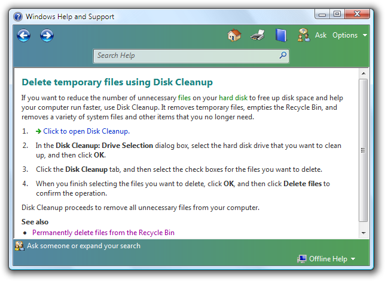  In this example, the Help topic describes how to use a feature of the Disk Cleanup utility, providing steps to follow in sequence.                                               |
| **Conceptual Help**  provides background information, feature overviews, or processes.   | Conceptual help should provide "what" or "why" information beyond that needed to complete a task.   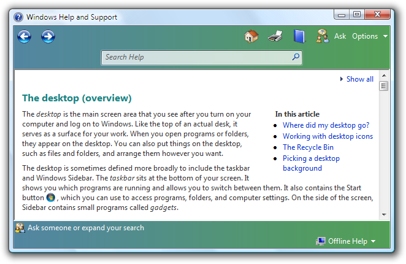  In this example, the Help topic defines what the desktop is, and provides additional detail about what it contains and why users interact with it.            |
| **Reference Help**  serves as an online reference book.                                  | You can use reference help to document a programming language or programming interfaces.   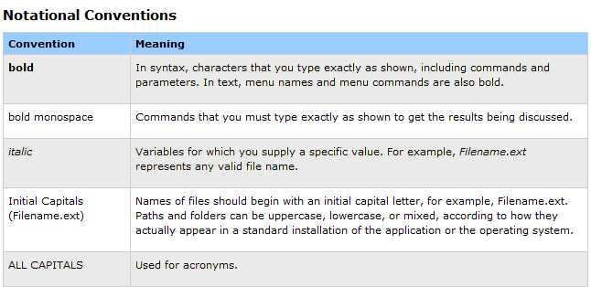  In this example, the Help topic lists typographic conventions in use for this particular language or application, providing the information in an easy-to-scan table.  |

 

## Guidelines

### Entry points

-   **Link to specific, relevant Help topics.** Don't link to the Help home page, the table of contents, a list of search results, or a page that just links to other pages. Avoid linking to pages structured as a large list of frequently asked questions, because it forces users to search for the one that matches the link they clicked. Don't link to specific Help topics that aren't relevant and helpful to the task at hand. Never link to empty pages.
-   **Don't put Help links on every window or page for the sake of consistency.** Providing a Help link in one place doesn't mean that you have to provide them everywhere.
-   **Use Help links for dialog boxes, error messages, wizards, and property sheets.** If the Help link applies to specific controls, place it under them, left-aligned. If the Help link applies to the entire window, place it at the bottom left corner of the window's content area.

    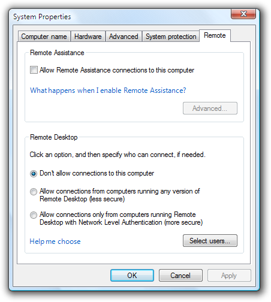

    In this example, the second Help link applies to a group of controls.

    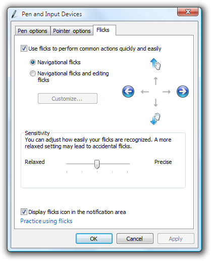

    In this example, the Help link applies to the entire window.

-   **Use Help links instead of generic textual references to Help whenever technically possible.**

    **Correct:**

    How can I repair disk errors?

    **Incorrect:**

    For more information about repairing disk errors, see Help and Support.

-   **Use a Help button with the Help icon for the hub pages of control panel items.** Place it in the upper-right corner. These buttons don't have a label, but have a tooltip that reads Help.

    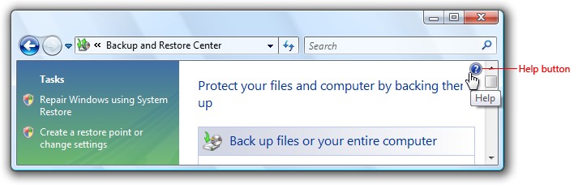

    A control panel item with a Help button.

-   **F1 Help is optional.** Users have grown accustomed to finding Help information related to the immediate context of the UI on the screen by pressing the F1 key, which is labeled Help on standard keyboards. You can include F1 Help if, for example, usability studies show that your users expect to find it, or your program UI is complex enough to benefit from contextual assistance.
-   **Programs with menu bars can have a Help menu category.** For Help menu guidelines, see [Menus](cmd-menus.md).

    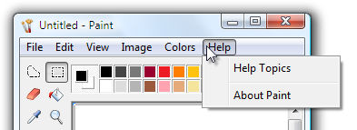

    In this example, the Windows Paint accessory has a Help menu category.

-   **For keyboard accessibility, provide tab stops for Help buttons and links.**
-   Help button and link behavior should be as follows: Help pane opens and a dedicated Help topic is displayed; the UI that invoked the Help pane should remain open to preserve the contextual experience.
-   **Don't use the following obsolete Help entry point styles: "Learn more" or "Learn more about..." links, generic Help buttons, and context-sensitive Help buttons on the title bar.** Although they have been used in the past, usability studies have determined that users tend to ignore them. Use links to specific Help topics instead. For guidelines about writing good Help links, see [Help links](#text).

    **Incorrect:**

    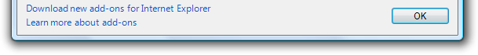

    Don't use "Learn more" or "Learn more about..." links.

    **Incorrect:**

    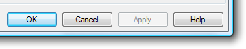

    Don't use generic Help buttons.

    **Incorrect:**

    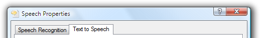

    Don't use context-sensitive Help buttons on the title bar.

### Content

-   **Don't create obvious content.** Help topics that repeat what is in the primary UI don't add value.
-   **Don't create content that the user can't act on in some way.**
    -   **Exception:** Some conceptual content delivers important background information without necessarily leading to user action.
-   **Avoid vague resolutions to problems.** For example, "contact your system administrator" or "reinstall the application" tend to frustrate users.
    -   **Exception:** Recommend contacting the system administrator if that is the only practical solution, and system administrators expect to be contacted for the problem.
-   **Avoid content that addresses highly unlikely user scenarios.** Develop your main Help content for what you anticipate will be normal usage; note important exceptions to expected usage, but treat this content as a lower priority.
-   **Gather feedback from your users about how helpful your Help topics are.** Allow users to rate individual topics. Conduct [usability studies](glossary.md) on your documentation to ascertain problems involving quality and discoverability of content.
    -   **Tip:** User feedback is also a great way to generate more task-based content, focused on what users are actually doing with your program, as opposed to feature-based content, focused simply on a description of the technology.
-   **Provide multiple ways of accessing your content.** A table of contents, an index, and a [search](ctrl-search-boxes.md) mechanism are three of the most common methods of improving discoverability.
-   **If there is more than one way to perform a task, in most cases you can just document the most common way used by inexperienced users.**

### Icons

-   Use the Help icon only for Explorer windows and the hub pages of control panel items. Don't use the Help icon with Help links.

**Correct:**

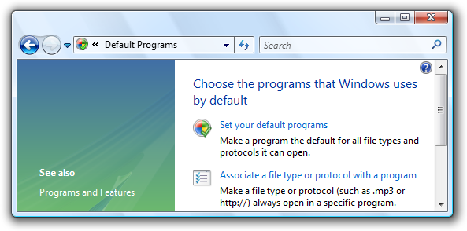

In this example, a Windows Explorer window uses a Help icon to provide access to Help.

**Incorrect:**

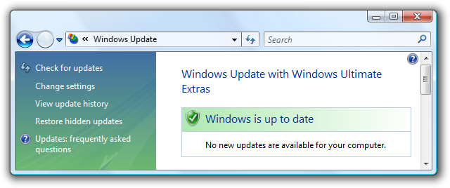

In this example, the Help icon on the lower-left is used incorrectly with a Help link.

## Text

**Help links**

-   Provide specific information about the content of the Help topic, using as much relevant, concise text as necessary. Users often ignore generic Help links. Make sure the results of the link are predictable users shouldn't be surprised by the results.

    -   **Exception:** You can use "More information" to supplement instructions that are directly in the UI, especially if providing specific information in the Help link leads to unnecessary repetition or makes the link less compelling.

    **Incorrect:**

    A strong password has at least six mixed-case letters, numbers, and symbols. What is a strong password?

    **Correct:**

    A strong password has at least six mixed-case letters, numbers, and symbols. More information

    In the incorrect example, the Help link is repetitive. It asks a question that is really already answered.

-   Whenever possible, phrase Help link text in terms of the primary question answered by the Help content. Don't use "Learn more about," "Tell me more about," or "Get help with this" phrasing.

    **Incorrect:**

    Learn more about adding exceptions

    **Correct:**

    What are the risks of allowing exceptions?

    How do I add exceptions?

    In the correct examples, the link is phrased in terms of the primary question answered by the Help topic.

-   If the most relevant information can be summarized succinctly, put the summary directly in the UI instead of using a Help link. However, you can use a Help link to provide supplemental information.

    **Incorrect:**

    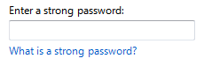

    **Correct:**

    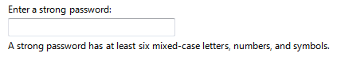

    **Better:**

    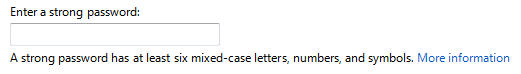

    The correct example summarizes the Help information succinctly, greatly improving the likelihood that users will read it. The better example provides a Help link for more information on this complex subject.

-   Phrase Help links to clearly indicate assistance. Help links should never read like action links.
-   Use the entire Help link for the link text, not just the keywords.

    **Correct:**

    What are the risks of allowing exceptions?

    **Incorrect:**

    What are the risks of allowing exceptions?

    In the correct example, the entire Help link sentence is used for the link text.

    -   **Exception:** Help links to external Web sites should simply use the name of the site or page as the link. Any text introducing the name of the site need not be included in the link itself.

-   Help links don't have to match Help topic headings exactly, but there should be a strong and obvious connection between the two. Design links and headings in pairs for this reason.

    **Correct:**

    How can I improve the performance of this feature? (link text)

    Configuring this feature for optimal performance (topic heading)

    **Incorrect:**

    How can I improve the performance of this feature? (link text)

    Complete overview of this feature (topic heading)

    In the incorrect example, the Help topic heading substantially differs in scope from the Help link text, and could be disorienting.

-   If the Help content is online, make that clear in the link text. Doing so helps make the result of the links predictable.

    **Correct:**

    For additional formats and tools, go to the Microsoft Web site.

    **Incorrect:**

    Where can I find additional formats and tools?

-   Use complete sentences.
-   Don't use ending punctuation, except for question marks.
-   Don't use ellipses for Help links or commands.

**Help content**

-   Format UI elements using bold to make them easy to identify. This is especially useful for procedural Help topics, allowing users to scan through procedures and quickly see pertinent UI elements.
-   Format captions using italic. This applies to tables, art, screenshots, and other graphic elements that benefit from brief textual explanation.
-   Refer to Help simply as Help. Generally, don't use the phrase online Help unless you are in fact referring to content on your Web site.

 

