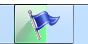
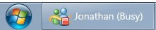
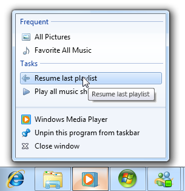
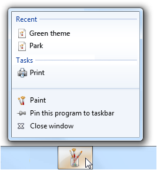
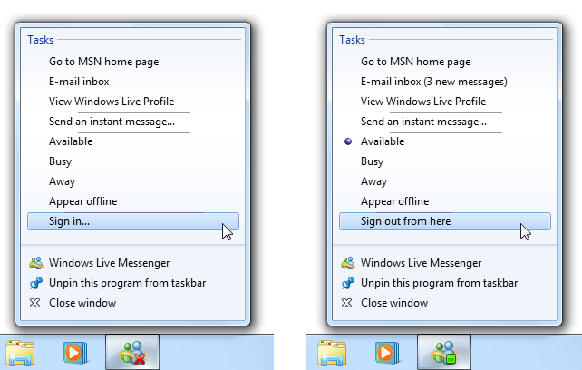
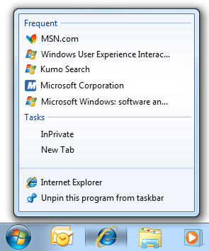
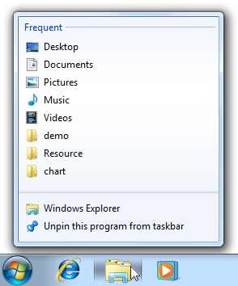
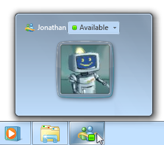

# Taskbar

> [!NOTE]
> This design guide was created for Windows 7 and has not been updated for newer versions of Windows. Much of the guidance still applies in principle, but the presentation and examples do not reflect our [current design guidance](/windows/uwp/design/).

The taskbar is the access point for programs displayed on the desktop. With the new Windows 7 taskbar features, users can give commands, access resources, and view program status directly from the taskbar.

The taskbar is the access point for programs displayed on the desktop, even if the program is minimized. Such programs are said to have desktop presence. With the taskbar, users can view the open primary windows and certain secondary windows on the desktop, and can quickly switch between them.

The Microsoft Windows taskbar.

The controls on the taskbar are referred to as taskbar buttons. When a program creates a primary window (or a secondary window with certain characteristics), Windows adds a taskbar button for that window and removes it when that window closes.

Programs designed for Windows 7 can take advantage of these new taskbar button features:

-   Jump Lists provide quick access to frequently used destinations (like files, folders, and links) and commands through a context menu accessible from the program's taskbar button and Start menu item even if the program isn't currently running.
-   Thumbnail toolbars provide quick access to frequently used commands for a particular window. Thumbnail toolbars appear in the taskbar button's thumbnail.
-   Overlay icons show change of status on the program's taskbar button icon.
-   Progress bars show progress for long-running tasks on the program's taskbar button.
-   Sub-window taskbar buttons allow users to use taskbar button thumbnails to switch directly to window tabs, project windows, multiple-document interface (MDI) child windows, and secondary windows.
-   Pinned taskbar buttons allow users to pin program buttons to the taskbar to provide quick access to programs even when they aren't running.

Technically, the taskbar spans the entire bar from the Start button to the notification area; more commonly, however, the taskbar refers only to the area containing the taskbar buttons. For multiple monitor configurations, only one monitor has a taskbar, and that monitor is the default monitor.

**Note:** Guidelines related to [desktop](winenv-desktop.md), [notification area](winenv-notification.md), and [window management](win-window-mgt.md) are presented in separate articles.

## Is this the right user interface?

Programs designed for Windows 7 can take advantage of these taskbar button features. Ask yourself the following key questions to determine whether or not to use them:

**Jump Lists**

-   **Do users often need to start new tasks using your program?** If so, consider providing a Jump List. While Jump Lists can be used for other purposes, most scenarios involve starting a new task.
-   **Do users often need to access recently or frequently used files, folders, links, or other resources?** If so, consider providing a Jump List to access these useful resources.

    

    In this example, Windows Internet Explorer uses a Jump List to present frequently visited pages.

-   **Do users often need quick access to a small number of your program's commands while using other programs, even if your program isn't running?** If so, consider providing a Jump List with these frequently used commands. These commands must work even if your program isn't running, and must apply to the entire program, not a specific window. As an alternative, consider providing a thumbnail toolbar for commands that apply to a specific window.

    

    In this example, the Sticky Notes accessory allows users to create a new note quickly while using other programs.

-   **Are you promoting new, single use, or hard to find features?** If so, don't use Jump Lists because they aren't intended for this purpose. Instead, improve the discoverability of such commands directly in the program.

**Thumbnail toolbars**

Do all of the following conditions apply?

-   **Do the commands apply to a specific window?** Thumbnail toolbars are for commands that apply to existing tasks, whereas Jump List commands are for starting new tasks.
-   **Do users need to interact with a running task quickly while using other programs?** If so, thumbnail toolbars are a good choice. Thumbnail toolbars can present a maximum of seven commands, but a maximum of five commands is generally preferred.
-   **Are the commands immediate?** That is, do they not require additional input? Thumbnail toolbars need to have immediate commands to be efficient, whereas Jump Lists work better with commands that require additional input.

    **Incorrect:**

    

    Commands that require additional input don't work well on thumbnail toolbars.

-   **Are the commands direct?** That is, can users interact with them using a single click? Toolbars need to have direct commands to be efficient.
-   **Are the commands well represented by icons?** Thumbnail toolbar commands are presented using icons not text labels, whereas Jump List commands are represented by text labels.

    **Incorrect:**

    

    In this example, the command isn't well represented by icons.

**Overlay icons**

-   **Does the program have "desktop presence"?** If not, use a notification area icon instead. If so, consider using an overlay icon instead of putting status on the notification area icon for programs designed for Windows 7. Doing so ensures that the icon will always be visible (when large icons are used), and consolidates the program with its status in one place.
-   **Is the overlay icon displayed temporarily to show a change of status?** If so, an overlay icon may be appropriate, depending on the following factors:
    -   **Is the status useful and relevant while using other programs?** If not, display the information in the program's [status bars](ctrl-status-bars.md) or other program status area.

        

        In this example, the status bar is used because the status isn't useful when using other programs.

    -   **Is the status showing progress?** If so, use a taskbar button progress bar instead.
    -   **Is the status critical? Is immediate action required?** If so, display the information in a way that demands attention and cannot be easily ignored, such as a [dialog box](win-dialog-box.md).

**Progress bars**

-   **Is the progress feedback useful and relevant while using other programs?** That is, are users likely to monitor the progress while using other programs, and change their behavior as a result? Such useful and relevant status is usually displayed using a modeless progress dialog box or a dedicated progress page, but not with a busy pointer, activity indicator, or progress bar on a status bar. If the status isn't useful when using other programs, just display the progress feedback directly in the program itself.

    **Correct:**

    

    **Incorrect:**

    

    In the incorrect example, the taskbar button progress bar isn't very useful.

-   **Is the task continuous?** If the task never completes, there's no need to show its progress. Examples of continuous tasks include antivirus scans that aren't initiated by users, and file indexing.

    **Incorrect:**

    

    In this example, a continuous task doesn't need to show progress.

**Sub-window taskbars**

-   **Does your program contain tabs, project windows, MDI child windows, or secondary windows that users would often want to switch to directly?** If so, giving these windows their own taskbar button thumbnails may be appropriate.

## Design concepts

### Using Jump Lists and thumbnail toolbars effectively

Jump Lists and thumbnail toolbars help users access resources and perform commands more efficiently. However, when designing how your program supports these features, don't take improved efficiency for granted. If users can't accurately predict which feature has the command they need, or they have to check multiple places, eventually users will become frustrated and stop using these features.

Jump Lists and thumbnail toolbars work together most effectively when they are:

-   **Clearly differentiated.** Users know when to look for a destination or command in a Jump List, and when to look in a thumbnail toolbar. There is a clear purpose for each, so users rarely confuse the contents of the two. Generally, Jump Lists are used to start new tasks, whereas thumbnail toolbars are used to interact with running tasks while using other programs.
-   **Useful.** The destinations and commands offered are the ones that users need. If users aren't likely to need something, it isn't included. Don't use the maximum number of items if they aren't needed.
-   **Predictable.** The destinations and commands offered are the ones that users expect to find. Users rarely have to look in more than one place.
-   **Well organized.** Users are able to find what they are looking for quickly. They use descriptive yet concise labels, and suitable icons to aid recognition.

Be sure to do user research to make sure you've got it right. If you ultimately find that you can't design Jump Lists and thumbnail toolbars together that achieve these goals, consider providing only one of them. It's better to have one predictable way to give commands than two confusing ones.

## Guidelines

### Taskbar buttons

-   **Make the following window types appear on the taskbar (for Windows 7, by using a taskbar button thumbnail):**
    -   Primary windows (which includes dialog boxes without owners)
    -   Property sheets
    -   Modeless progress dialog boxes
    -   Wizards
-   **For Windows 7, use taskbar button thumbnails to group the following window types with the primary window taskbar button it was launched from.** Each program (specifically, each program perceived as a separate program) should have a single taskbar button.

    -   Secondary windows
    -   Workspace tabs
    -   Project windows
    -   MDI child windows

    **Correct:**

    

    In this example, a secondary window is grouped with its primary window's taskbar button.

    **Incorrect:**

    

    In this example, Control Panel is incorrectly grouped with Windows Explorer. Users perceive these as separate programs.

    **Incorrect:**

    

    In this example, Windows Backup incorrectly uses two taskbar buttons for a single program.

-   **Restoring a primary window should also restore all its secondary windows,** even if those secondary windows have their own taskbar buttons. When restoring, place secondary windows on top of the primary window.
-   **For Windows 7, programs that normally have desktop presence may temporarily display a taskbar button to show status.** Do so only if your program is normally displayed on the desktop and users frequently interact with it. A program that normally runs without desktop presence should use its notification area icon instead, even though it might not always be visible.

    **Incorrect:**

    

    In this example, Windows Sync Center incorrectly uses a temporary taskbar button to display status. It should use its notification area icon instead.

### Icons

-   **Design your program icon to look great on the taskbar.** Ensure it is meaningful, and reflects its function and your brand. Make it distinct, make it special, and ensure it renders well in all icon sizes. Spend the time necessary to get it right. Follow the [Aero-style icon guidelines](vis-icons.md).
-   **If your program uses overlay icons, design your program's base icon to handle overlays well.** Overlay icons are displayed in the lower right corner, so design the icon so that area can be obscured.

    

    In this example, the program's taskbar button icon doesn't have important information in the lower right area.

-   **Don't use overlays in your program's base icon,** whether your program uses overlay icons or not. Using an overlay in the base icon will be confusing because users will have to figure out that it's not communicating status.

    **Incorrect:**

    

    In this example, the program's base icon looks like it is showing status.

For general icon guidelines and examples, see [Icons](vis-icons.md).

### Overlay icons

-   **Use overlay icons to indicate useful and relevant status only.** Consider the display of an overlay icon to be a potential interruption of the user's work, so the status change must be important enough to merit a potential interruption.

    **Incorrect:**

    

    In these examples, the overlay icon isn't important enough to merit a potential interruption.

-   **Use overlay icons for temporary status.** The overlay icons lose their value if displayed constantly, so normal program status should not show an icon. Remove the overlay icon when the icon:

    -   **Is for a problem:** Remove the icon once the problem has been resolved.
    -   **Alerts that something is new:** Remove the icon once the user has activated the program.

    **Exception:** Your program can constantly display an overlay icon if users always need to know its status.

    

    In this example, Windows Live Messenger always displays an overlay icon so that users can always check their reported presence.

-   **Don't display an icon to indicate that a problem has been solved.** Instead, simply remove any previous icon indicating a problem. Assume that users normally expect your program to run without problems.
-   **Display either overlay icons or notification area icons, but never both.** Your program may support both mechanisms for backward compatibility, but if your program displays status using overlay icons, it shouldn't also use notification area icons for status.

    **Incorrect:**

    

    In this example, the new mail icon is displayed redundantly.

-   **Don't flash the taskbar button to draw attention to a status change.** Doing so would be too distracting. Let users discover overlay icons on their own.
-   **Prefer standard overlay icons to indicate status or status changes.** Use these standard overlay icons: 

    | Overlay | Status |
    |---------------------------------------------------------------------------------------------------|----------------------------------|
    |                 | Warning                |
    |                   | Error                  |
    |   | Disabled/Disconnected  |
    |         | Blocked/Offline        |

    

     

-   **For custom overlay icons, choose an easily recognizable design.** Use high-quality 16x16 pixel, full color icons. Prefer icons with distinctive outlines over square or rectangular shaped icons. Apply the other [Aero-style icon guidelines](vis-icons.md) as well.
-   **Keep the design of custom overlay icons simple.** Don't try to communicate complex, unfamiliar, or abstract ideas. If you can't think of a suitable custom icon, use a standard icon error or warning icon instead when appropriate. These icons can be used effectively to communicate many types of status.
-   **Don't change status too frequently.** Overlay icons shouldn't appear noisy, unstable, or demand attention. The eye is sensitive to changes in the peripheral field of vision, so status changes need to be subtle.
    -   **Don't change the icon rapidly.** If underlying status is changing rapidly, have the icon reflect high-level status.

        **Incorrect:**

        

        In this example, the rapidly changing overlay icon demands attention.

    -   **Don't use animations.** Doing so is too distracting.
    -   **Don't flash the icon.** Doing so is too distracting. If an event requires immediate attention, use a dialog box instead. If the event otherwise needs attention, use a notification.

### Taskbar button flashing

-   **Use taskbar button flashing sparingly to demand the user's immediate attention to keep an ongoing task running.** It's hard for users to concentrate while a taskbar button is flashing, so assume that they will interrupt what they are doing to make it stop. While flashing a taskbar button is better than stealing input focus, flashing taskbar buttons are still very intrusive. Make sure the interruption is justified, such as to indicate that the user needs to save data before closing a window. Inactive programs should rarely require immediate action. Don't flash the taskbar button if the only thing the user has to do is activate the program, read a message, or see a change in status.
-   **If immediate action isn't required, consider these alternatives:**
    -   Use an [action success notification](mess-notif.md) to indicate that a task has completed.
    -   Do nothing. Just wait for users to attend to the issue the next time they activate the program. This is often the best choice.
-   **If an inactive program requires immediate attention, flash its taskbar button to draw attention and leave it highlighted.** Don't do anything else: don't restore or activate the window and don't play any sound effects. Instead, respect the user's window state selection and let the user activate the window when ready.
-   **For secondary windows that have a taskbar button, flash its button instead of the primary window's taskbar button.** Doing so allows users to attend to the window directly.
-   **For secondary windows that don't have a taskbar button, flash the primary window's taskbar button and bring the secondary window on top of all the other windows for that program.** Secondary windows that require attention must be topmost to ensure that users see them.
-   **Flash only one taskbar button for one window at a time.** Flashing more than one button is unnecessary and too distracting.
-   **Remove the taskbar button highlight once the program becomes active.**
-   **When the program becomes active, make sure there is something obvious to do.** Typically, this objective is accomplished by displaying a dialog box that asks a question or initiates an action.

### Quick Launch shortcuts

-   **Put program shortcuts in the Quick Launch area only if users opt in.** Because Quick Launch was removed from Windows 7, programs designed for Windows 7 shouldn't add program shortcuts to the Quick Launch area or provide options to do so.

### Jump Lists

**Design**

-   **Design Jump Lists to satisfy your users' goals for their everyday tasks.** Consider:
    -   **Your program's purpose.** Think about what users are most likely to do next. For document creation programs, users are likely to return to recently used documents. For programs that show existing content, users may want access to resources they use frequently. For other programs, users might be likely to do tasks they haven't done before, such as read new messages, watch new videos, or check their next meeting.
    -   **What users care about most.** Think about why users would use the Jump List instead of other means. For example, users are more likely to care about destinations they explicitly identified as important (such as Web addresses users placed on their links bar or in Favorites, or typed in). They are less likely to care about those obtained indirectly or with little effort (such as Web addresses visited through redirection or by clicking links).

        **Correct:**

        

        **Incorrect:**

        

        In the incorrect example, the Jump List contains many destinations that users aren't likely to care about.

-   **Don't make destinations too granular.** Making destinations too narrow and specific can result in redundancy, with several ways to go to the same place. For example, instead of listing individual Web pages, list top-level home pages instead; instead of listing songs, list albums.

    **Correct:**

    

    **Incorrect:**

    

    In the incorrect example, listing songs in a Jump List will fill it with a single album.

-   **Don't fill all the available Jump List slots if you don't need to.** Focus Jump List content on the most useful items if your program has only three useful items, provide only three. The more items in a Jump List, the more effort required to find any specific item.

    

    In this example, the Sticky Notes accessory provides a single Jump List command, because that's all that is needed.

-   **Provide tooltips only when needed to help users understand Jump List items.** Avoid redundant tooltips because they are an unnecessary distraction. For more tooltip guidelines, see [Tooltips and Infotips](ctrl-tooltips-and-infotips.md).

    **Incorrect:**

    

    In this example, the Jump List tooltip is redundant.

**Jump List features vs. program features**

-   **Don't make destinations and commands available only through Jump Lists.** The same destinations and commands should be available directly from the program itself.
-   **Use consistent names for destinations and labels for commands.** Jump List items should be labeled the same as the equivalent items accessed directly from the program.
-   **Enable your program to handle destinations and commands even when the program isn't running.** Doing so is necessary for a consistent, dependable, and convenient experience.

**Grouping**

-   **Provide at least one and at most three groups.** Jump List items are always grouped to label their purpose. Having more than three groups makes items harder to find.
-   **Use standard group names when appropriate.** Standard group names are familiar and easier for users to understand.

    Commands are given the Tasks group name, which is assigned by Windows and therefore can't be changed.

    **Correct:**

    

    **Incorrect:**

    

    Recent is the better group name because it is familiar, and the subtle distinction between history and recent isn't worth making.

**Commands**

-   **Provide a fixed set of commands regardless of program running state, current document, or current user.** The commands should apply to the entire program, not to a specific window or document. Doing so is necessary for a consistent, dependable, and convenient experience. Commands shouldn't be removed or disabled.

    **Exceptions:** You may substitute or remove commands when:

    -   A set of mutually exclusive commands share a single command slot, as long as one command always applies.
    -   Commands don't apply until specific features have been used, as long as the commands otherwise always apply.

    **Incorrect:**

    

    In this example, Print isn't a good Jump List command because it depends on the current document.

    **Correct:**

    

    In this example, Sign in and Sign out are mutually exclusive commands. Also, separators are used to group related commands.

-   **Use the following standard command labels when appropriate.** Standard command labels are easier for users to understand.
-   **Present the commands in a logical order.** Common orders include by frequency of use or order of use. Place highly related commands next to each other. Within the Tasks group, put separators between groups of related commands as needed.
-   **Don't provide commands for opening or closing the program.** These commands are built into all Jump Lists.

**Command icons**

-   **Within the Tasks group, provide a command icon only when it helps users understand, recognize, or differentiate commands,** especially when there is an established icon for the command used within the program.

    -   **Exception:** If your program uses both destinations (which always have icons) and commands, consider providing icons for all commands if not doing so would look awkward.

    **Incorrect:**

    

    In this example, Internet Explorer should provide icons for all commands to avoid an awkward appearance.

**Destinations**

-   **Provide a dynamic set of destinations that are specific to the current user, but independent of the program running state or current document.** As mentioned previously, make sure they fit your program's purpose, are what users care about the most, and have the right level of specificity.
-   **When suitable, use an "automatic" destination list.** Automatic destinations are managed by Windows, but your program controls the specific destinations that are passed on.
    -   Consider using Recent for document creation programs where users are likely to return to recently used destinations.

        

        In this example, Windows Notepad uses Recent destinations.

    -   Consider using Frequent for programs that show existing content, where users are likely to return to items that they use often. Frequent destinations are sorted in order of frequency, most frequent first.

        

        In this example, Windows Explorer uses Frequent destinations.

    -   Use Frequent if Recent would result in many useless destinations. Frequent lists are more stable, and the better choice when users go to many different destinations, but aren't likely to return to rarely used ones.

        **Incorrect:**

        

        Using Recent in Windows Internet Explorer would result in many useless destinations.

    -   If Recent or Frequent are equally suitable choices, use Recent because that approach is easier for users to understand and is more predictable.
    -   If using Recent, and the program has an equivalent in the File menu, make the lists have the same contents in the same order. To users, these should appear to be the same lists.

-   **When necessary, use a custom destination list.** Your program has complete control over a custom destination list's contents and sort order, and therefore can base the list on any factors.
    -   Create custom versions of Recent or Frequent if those are suitable, but the automatic management doesn't work well for your program. For example, your program may need to track a variety of factors beyond open file commands. In this case, use the same name (Recent or Frequent) and sort order because users won't be aware of the difference.
    -   Otherwise, use a different type of destination to better satisfy your user's goals. Often, these lists help users perform tasks that they haven't done before, such as read new messages, watch new videos, or check their next meeting.

        

        In this example, Windows Media Center lists the recently recorded shows that the user hasn't seen yet.

    -   Choose a sort order that corresponds to the user's mental model of the list. For example, a to-do style list would have the next thing to do listed first. If there is no clear mental model, sort the destination list in alphabetical order.

-   **Don't use multiple destination lists that give different views of the same data.** Rather, multiple destination lists should have mostly different data to support difference scenarios. For example, you can provide a Recent list or a Frequent list, but not both. Doing so is wasteful if overlapping items are present, but confusing if overlapping items are removed.

    **Incorrect:**

    

    In this example, providing different views of the same destinations is wasteful.

    **Correct:**

    

    In this example, the destination lists have different data for different tasks.

-   **If your program has a command to clear data for privacy, clear the Destinations lists as well.** Destination lists may contain sensitive data.

### Thumbnail toolbars

**Interaction**

-   **Provide up to seven of the most important, frequently used commands that apply to the window shown in the thumbnail.** Don't feel obligated to provide as many commands as you can if your program has only three important, frequently used commands, provide only three.

    **Incorrect:**

    

    In this example, the thumbnail toolbar has commands that aren't important.

-   **Use commands that are direct and immediate.** These commands should have an immediate effect clicking the command should not display a drop-down menu or dialog box for more input.

    **Incorrect:**

    

    Thumbnail toolbar commands must have an immediate effect.

-   **Disable commands that don't apply to the current context, or that would directly result in an error.** Don't hide such commands because doing so makes the toolbar presentation unstable.
-   **Don't dismiss the thumbnail when users click a command if they are likely to review the results or immediately click another command.** Remove the thumbnail for commands that indicate that the user is finished for now, such as with commands that display other windows.

    

    In this example, clicking Next in Windows Media Player continues to display the thumbnail because users might want to give other commands.

    

    In this example, clicking Chat in Windows Live Messenger dismisses the thumbnail because users are most likely to send a message.

**Presentation**

-   **Make sure thumbnail toolbar icons conform to the Aero-style icon guidelines.** For each command, provide high-quality 16x16, 20x20, and 24x24 pixel, full color icons. The larger versions are used in high-dpi display modes.
-   **Make sure the icons are clearly visible against the toolbar background color in both normal and hover states.** Always evaluate icons in context and in the high-contrast modes.
-   **Choose command icon designs that clearly communicate their effect.** Well-designed command icons are self-explanatory to help users find and understand commands efficiently.
-   **Choose icons that are recognizable and distinguishable.** Make sure the icons have distinctive shapes and colors. Doing so helps users find the commands quickly, even if they don't remember the icon symbol. After initial use, users shouldn't have to rely on tooltips to distinguish between the commands.
-   **Provide a tooltip to label each command.** A good tooltip labels the unlabeled control being pointed to. For guidelines and examples, see [Tooltips and Infotips](ctrl-tooltips-and-infotips.md).

### Progress bars

-   **Follow the general progress bar guidelines,** including not restarting or backing up progress, and using a red progress bar to indicate a problem.
-   **Avoid using indeterminate progress bars.** Indeterminate progress bars show activity, not progress. Reserve indeterminate progress bars for those rare situations where users don't take activity for granted.

For more guidelines, see [Progress Bars](progress-bars.md).

## Text

### Window titles

When choosing window titles, consider the title's appearance on the taskbar:

-   Optimize titles for display on the taskbar by concisely placing the distinguishing information first.
-   For modeless progress dialog boxes, first summarize the progress. Example: "66% Complete."
-   Avoid window titles that have awkward truncations.

    **Incorrect:**

    

    In this example, the truncated window title has unfortunate results.

### Jump List commands

-   **Start commands with a verb.**
-   **Use sentence-style capitalization.**

For more command label guidelines, see [Menus](cmd-menus.md).

## Documentation

When referring to the taskbar:

-   Refer to the entire bar as the taskbar (a single compound word in lowercase).
-   Refer to items on the taskbar specifically by their label, or generally as taskbar buttons.
-   When possible, format the taskbar labels using bold text. Otherwise, put the label in quotation marks only if required to prevent confusion.
-   Refer to overlay icons as taskbar button icons. Don't refer to them as notifications, even if their purpose is to notify users. However, you can say that these icons notify users of specific events.

Example: The New Mail taskbar button icon notifies you that a new e-mail message has arrived.

 

