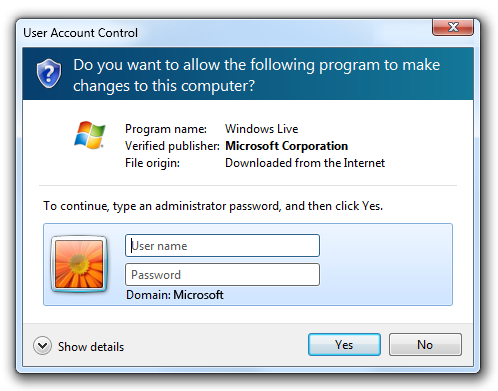
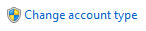
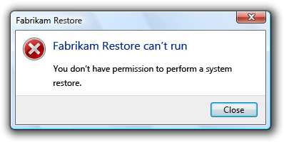

# User Account Control

> [!NOTE]
> This design guide was created for Windows 7 and has not been updated for newer versions of Windows. Much of the guidance still applies in principle, but the presentation and examples do not reflect our [current design guidance](/windows/uwp/design/).

A well designed User Account Control experience helps prevent unwanted system-wide changes in a way that is predictable and requires minimal effort.

With User Account Control (UAC) fully enabled, interactive administrators normally run with least user privileges, but they can self-elevate to perform administrative tasks by giving explicit consent with the Consent UI. Such administrative tasks include installing software and drivers, changing system-wide settings, viewing or changing other user accounts, and running administrative tools.

In their least-privileged state, administrators are referred to as Protected administrators. In their elevated state, they are referred to as Elevated administrators. By contrast, Standard users can't elevate by themselves, but they can ask an administrator to elevate them using the Credential UI. The Built-in Administrator account doesn't require elevation.

The Consent UI, used to elevate Protected administrators to have administrative privileges.

The Credential UI, used to elevate Standard users.

UAC provides the following benefits:

-   It reduces the number of programs that run with elevated privileges, therefore helping to prevent users from accidentally changing their system settings, and helping to prevent "malware" from gaining system-wide access. When elevation is denied, malware is only able to affect the current user's data. Without elevation, malware can't make system-wide changes or affect other users.
-   For [managed environments](glossary.md), well designed UAC experiences allow users to be more productive when running as Standard users by removing unnecessary restrictions.
-   It gives Standard users the ability to ask administrators to give them permission to perform administrative tasks within their current session.
-   For home environments, it enables better parental control over system-wide changes, including what software is installed.

**Developers:** For implementation information, see [Redesign Your UI for UAC Compatibility](/previous-versions/bb756990(v=msdn.10)).

In Windows Vista, Protected administrators can choose to be notified about all system changes or none. The UAC default setting is to notify about all changes, no matter what their origin. When you're notified, your desktop will be dimmed, and you must either approve or deny the request in the UAC dialog box before you can do anything else on your computer. The dimming of your desktop is referred to as the [secure desktop](glossary.md) because other programs can't run while it's dimmed.

Windows 7 introduces two intermediate UAC settings for Protected administrators, in addition to the two from Windows Vista. The first is to notify users only when a program is making the change, so administrators are automatically elevated when they make a change themselves. This is the UAC default setting in Windows 7, and it also makes use of the secure desktop.

The second intermediate setting in Windows 7 is the same as the first except that it doesn't use the secure desktop.

Windows 7 introduces two intermediate UAC settings.

**Note:** Guidelines related to writing [code to support User Account Control](/previous-versions/aa905330(v=msdn.10)) are presented in a separate article.

## Design concepts

**Goals**

A well designed User Account Control experience has the following goals:

-   **Eliminate unnecessary elevation.** Users should have to elevate only to perform tasks that require administrative privileges. All other tasks should be designed to eliminate the need for elevation. Often legacy software requires administrator privileges unnecessarily by writing to the HKLM or HKCR registry sections, or the Program Files or Windows System folders.
-   **Be predictable.** Standard users need to know which tasks require an administrator to perform or cannot be performed at all in managed environments. Administrators need to know which tasks require elevation. If they can't predict the need for elevation accurately, they are more likely to give consent for administrative tasks when they shouldn't.
-   **Require minimal effort.** Tasks that require administrative privileges should be designed to require a single elevation. Tasks that require multiple elevations quickly become tedious.
-   **Revert to least privileges.** Once a task that requires administrative privileges is complete, the program should revert to the least privilege state.

**Elevation task flow**

When a task requires elevation, it has the following steps:

1.  **Entry point.** Tasks that require immediate elevation when UAC is fully enabled have entry points marked with the UAC shield. In this case, users should expect to see an Elevation UI immediately after clicking such commands and they should be extra cautious when they see Elevation UI from tasks that don't have a shield.

    

    In this example, the parental control and user accounts control panel items require elevation.

    When UAC is partially enabled or turned off completely, the UAC shield is still displayed to indicate that the task involves system-level changes and therefore requires elevation, even if the user might not see Elevation UI. Always displaying the UAC shield for tasks that require elevation keeps the UI simple and predictable.

2.  **Elevation.** For Protected Administrators, the task requests consent using the Consent UI. For Standard users, the task requests administrator credentials using the Credential UI.

    

    These examples show the Credential UI and the Consent UI.

3.  **Separate elevated process.** Internally, a new elevated process is created to perform the task.
4.  **Revert to least privilege.** If necessary, revert to least privilege to complete any steps that don't require elevation.

Note that tasks don't "remember" elevated states. For example, if the user navigates back and forth over an elevation entry point in a wizard, the user must elevate each time.

## Usage patterns

User Account Control has several usage patterns (in order of preference):

1.  **Work for Standard users.** Design the feature for all users by limiting its scope to the current user. By limiting settings to the current user (as opposed to system-wide), you eliminate the need for an Elevation UI entirely, and enable users to complete the task.

    **Incorrect:**

    

    In this example, Windows XP users had to have administrative privileges to view or change the current time zone.

    **Correct:**

    

    In this example, the time zone feature was redesigned in Windows 7 and Windows Vista to work for all users.

2.  **Have separate UI elements for Standard users and administrators.** Clearly separate Standard user tasks from administrative tasks. Give all users access to useful read-only information. Clearly identify administrative tasks with the UAC shield.

    

    In this example, the System control panel item shows its state to all users, but changing the system-wide settings requires elevation.

3.  **Allow Standard users to attempt task, and to elevate on failure.** If Standard users can view the information and are able to make some changes without elevation, allow them to access the UI and have them elevate only if the task fails. This approach is suitable when Standard users have limited access, such as with properties of their own files in Windows Explorer. It is also suitable for settings on Control Panel hybrid hub pages.

    

    In this example, the user attempted to change program file properties but didn't have sufficient privileges. The user can elevate and try again.

4.  **Work for administrators only.** Use this approach only for administrator features and programs! If a feature is intended only for administrators (and has no navigation paths or useful read-only information for Standard users), you can prompt for administrator credentials at the entry point before showing any UI. Use this approach for lengthy wizards and [page flows](glossary.md) when all paths require administrative privileges.

    If the entire program is for administrators only, mark it to prompt for administrator credentials in order to launch. Windows displays such program icons with the UAC shield overlay.

    

    In this example, the program requires administrative privileges to launch.

## Guidelines

### UAC shield icon

-   **Display controls with the UAC shield to indicate that the task requires immediate elevation when UAC is fully enabled,** even if UAC isn't currently fully enabled. If all paths of a wizard and [page flow](glossary.md) require elevation, display the UAC shield at the task's entry point. Proper use of the UAC shield helps users predict when elevation is required.
-   **If your program supports multiple versions of Windows, display the UAC shield if at least one version requires elevation.** Because Windows XP never requires elevation, consider removing the UAC shields for Windows XP if you can do so consistently and without harming performance.
-   **Don't display the UAC shield for tasks that don't require elevation in most contexts.** Because this approach will sometimes be misleading, the preferred approach is to use a properly shielded contextual command instead.

    

    Because the New folder command requires elevation only when used in system folders, it is displayed without a UAC shield.

-   The UAC shield can be displayed on the following controls:

    **Command buttons:**

    

    A command button that requires immediate elevation.

    **Command links:**

    

    A command link that requires immediate elevation.

    **Links:**

    

    A link that requires immediate elevation.

    **Menus:**

    

    A drop-down menu that requires immediate elevation.

-   Because tasks don't remember elevated states, **don't change the UAC shield to reflect state.**
-   **Display the UAC shield even if User Account Control has been turned off or the user is using the Built-in Administrator account.** Consistently displaying the UAC shield is easier to program, and provides users with information about the nature of the task.

### Elevation

-   **Whenever possible, design tasks to be performed by Standard users without elevation.** Give all users access to useful read-only information.
-   **Elevate on a per task basis, not on a per setting basis.** Don't mix Standard user settings with administrative settings in a single page or dialog box. For example, if Standard users can change some but not all settings, split those settings out as a separate UI surface.

    **Incorrect:**

    

    In this example, Standard user settings are incorrectly mixed with administrative settings.

    **Correct:**

    

    In this example, the settings for changing the date and time are in a separate dialog box, available only to administrators. The time zone settings are available to Standard users, and are not mixed with administrative settings.

-   **Don't consider the need to elevate when determining if a control should be displayed or disabled.** This is because:
    -   In unmanaged environments, assume that Standard users could elevate by asking an administrator. Disabling controls that require elevation would prevent users from having administrators elevate.
    -   In managed environments, assume that Standard users can't elevate at all. Removing controls that require elevation would prevent users from knowing when to stop looking.
-   **To eliminate unnecessary elevation:**
    -   **If a task might require elevation, elevate as late as possible.** If a task needs a [confirmation](mess-confirm.md), display the elevation UI only after the user has confirmed. If a task always requires elevation, elevate at its entry point.
    -   **Once elevated, stay elevated until elevated privileges are no longer necessary.** Users shouldn't have to elevate multiple times to perform a single task.
    -   **If users must elevate to make a change but choose not to make any changes, leave the positive commit buttons enabled but handle the commit as a cancel.** Doing so eliminates users having to elevate just to close a window.
    -   **Incorrect:**
    -   
    -   In this example, the Save Changes button is disabled to avoid an unnecessary elevation, but becomes enabled when users change the selection. However, the disabled commit button makes it look like users really don't have a choice.
-   **Don't display an error message when tasks fail because users chose not to elevate.** Assume that users intentionally chose not to proceed, so they won't regard this situation as an error.

    **Incorrect:**

    

    In this example, Fabrikam Restore incorrectly gives an error message when the user decides to not elevate.

-   **Don't display warnings to explain that users might need to elevate their privileges to perform tasks.** Let users discover this fact on their own.
-   **Display the UAC shield and elevation UI based on the following table:**

    | Object | Circumstance | Where to put UAC shield | When to elevate |
    |-----------------------|------------------------------------------------------------------------------------------------------------------------------------------------------------------|-----------------------------------------------------------------------------------------------------------------------------------------------------------------------------------------------------------------------|------------------------------------------------------------------------------------------------------|
    | Program     | Entire program is for administrators only.                                                                                                             |   UAC shield overlay on program icon.                                                                        | Display elevation UI at launch.                                                            |
    | Command     | Entire command is for administrators only.                                                                                                             |   UAC shield on command button or link.                                                                       | Display elevation UI when command button or link is clicked, but after any confirmations.  |
    | Command     | Command displays useful read-only information appropriate for all users, but changes require administrative privileges.                                |   UAC shield on command button or link to make changes.                                                       | Display elevation UI when command button is clicked, but after any confirmations.          |
    | Command     | Standard users can view the information and possibly make some changes without elevation. allow standard users to attempt, and to elevate on failure.  |   Don't show the UAC shield for the command, but show it for the elevation entry point if the command fails.  | Display elevation UI when user retries the command.                                        |
    | Task step   | All subsequent steps require elevation.                                                                                                                |   UAC shield on Next button (or equivalent).                                                                 | Display elevation UI when Next or other commit button is clicked.                          |
    | Task step   | Some branches require elevation.                                                                                                                       |   UAC shield on command links that require elevation.                                                               | Display elevation UI when command links with UAC shield are clicked.                       |

    

     

### Elevation UI

-   **If the user provides an account that isn't valid (name or password) or doesn't have administrator privileges, just redisplay the Credential UI.** Don't display an error message.
-   **If the user cancels the Credential UI, return the user back to the original UI.** Don't display an error message.
-   If User Account Control has been turned off and a Standard user attempts to perform a task that requires elevation, provide an error message that states "This task requires administrator privileges. To perform this task, you must log on using an administrator account."

In this example, User Account Control has been turned off so an error message explains that the user must use an administrator account.

### Wizards

-   **Don't elevate multiple times.** Once a wizard is elevated, it should stay elevated.
-   If the task is performed within the wizard, put a UAC shield on the Commit page's "Next" button (which should be given a more [specific label](win-wizards.md)). When the user commits:
    -   If the next page is a Progress page, advance to that page and modally display the elevation UI. After successful elevation, perform the task.
    -   If the next page is a Completion page, advance to that page (but temporarily replace its contents with "Waiting for permission...") and modally display the elevation UI. After successful elevation, perform the task, and then display the Completion page contents.
    -   If the user cancels the elevation UI, return to the Commit page. Doing so allows the user to try again.
-   If the task is performed after the wizard completes, put a UAC shield on the Commit page's "Finish" button (which should be given a more [specific label](win-wizards.md)). When the user commits:
    -   Remain on the Commit page and modally display the elevation UI. After successful elevation, close the wizard.
    -   If the user cancels the elevation UI, return to the Commit page. Doing so allows the user to try again.
-   For lengthy wizards intended only for administrators, you can prompt for administrator credentials at the entry point before showing any UI.

## Text

-   **Don't use an ellipsis just because a command requires elevation.** The need to elevate is indicated with the UAC shield.

## Documentation

When referring to User Account Control:

-   Refer to the feature as User Account Control (on first mention) or UAC (on subsequent mention), not Least-privileged User Account or LUA.
-   Refer to non-administrators as Standard users.
-   Refer to built-in computer administrators as Built-in administrators.

In user documentation:

-   Refer to the act of giving consent to perform an administrative task as giving permission.

In programming and other technical documentation:

-   Refer to the act of giving consent to perform an administrative task as elevation.
-   In the context of UAC, refer to administrators as Protected administrators when not elevated, and Elevated administrators after elevation.
-   Refer to the dialog box used to enter passwords as the Credential UI. Refer to the dialog box used to give consent as the Consent UI. Refer to both generally as Elevation UI.

