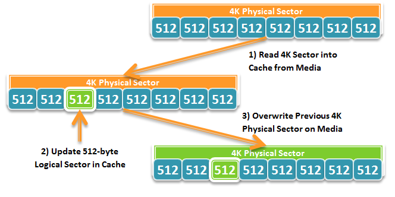
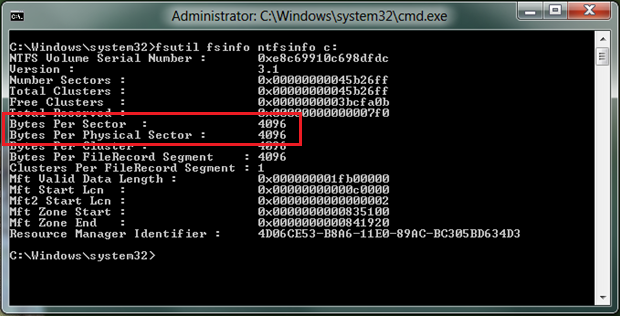

# Advanced format (4K) disk compatibility update

## Platforms

**Clients**   Windows XP, Windows Vista, Windows 7, Windows 7 SP1, Windows 8  
**Servers**   Windows Server 2003, Windows Server 2008, Windows Server 2008 R2, Windows Server 2008 R2 SP1, Windows Server 2012, Windows Server 2012 R2, Windows Server 2016  


## Description

This article is an updated version of the article titled  512-byte Emulation (512e) Disk Compatibility Update  which was released for Windows 7 SP1 and Windows Server 2008 R2 SP1. This update contains much new info, some of which is applicable only to Windows 8 and Windows Server 2012.

Areal densities are increasing yearly, and with the recent advent of 3 TB disks, the error correction mechanisms used to deal with the decreasing signal-to-noise-ratio (SNR) are becoming space inefficient; that is, an increased amount of overhead is required to ensure the media is usable. One of the storage industry solutions for improving this error correction mechanism is to introduce a different physical media format that includes a larger physical sector size. This new physical media format is called Advanced Format. Therefore, it is no longer safe to make any assumptions regarding the sector size of modern storage devices, and developers will need to study the assumptions underlying their code to determine if there is an impact.

This topic introduces the effect of Advanced Format storage devices on software, discusses what apps can do to help support this type of media, and discusses the infrastructure that Microsoft introduced with Windows Vista, Windows 7, and Windows 8 to enable developers to support these types of devices. While the material presented in this topic provides guidelines for improving compatibility with Advanced Format disks, the info applies generally to all systems with Advanced Format disks running Windows Vista, Windows 7, and Windows 8.

**Summary of new large sector related features**

The below list summarizes the new features delivered as part of Windows 8 and Windows Server 2012 to help improve customer and developer experience with large sector disks. More detailed description for each item follow.

-   Builds upon the Windows 7 SP1 support for 4K disks with emulation (512e), and provides full inbox support for disks with 4K sector size without emulation (4K Native). Some supported apps and scenarios include:
    -   Ability to install Windows to and boot from a 4K sector disk without emulation (4K Native Disk)
    -   VHD and new VHDX file format
    -   Full HyperV support
    -   Windows backup
    -   Full support in the NT file system (NTFS)
    -   Full support with new Storage Spaces and Pools (SSP)
    -   Full support with Windows Defender
-   Provides a new API to query for physical sector size (FileFsSectorSizeInformation):
    -   Available for network volumes
    -   Can be issued to any file handle
    -   Available for unprivileged apps
    -   Friendlier usage model
-   Includes enhanced  fsutil  command line utility to query for logical and physical sector size of volume with alignment info (basic version of utility without alignment info is available for Windows 7 with Microsoft KB 982018 and Windows Server 2008 R2 with Microsoft KB 982018)

**Introduction to advanced format (4K) disks**

One of the problems of introducing this change in the media format is the potential for introducing compatibility issues with existing software and hardware. As a temporary compatibility solution, the storage industry is initially introducing disks that emulate a regular 512-byte sector disk, but make available info about the true sector size through standard ATA and SCSI commands. As a result of this emulation, there are, in essence, two sector sizes:

**Logical sector:** The unit that is used for logical block addressing for the media. We can also think of it as the smallest unit of write that the storage can accept. This is the  emulation.   
**Physical sector:** The unit for which read and write operations to the device are completed in a single operation. This is the unit of atomic write.  
 Most current Windows APIs, such as IOCTL\_DISK\_GET\_DRIVE\_GEOMETRY will return the logical sector size, but the physical sector size can be retrieved through the <a href="/windows-hardware/drivers/ddi/content/ntddstor/ni-ntddstor-ioctl_storage_query_property">IOCTL\_STORAGE\_QUERY\_PROPERTY</a> control code, with the relevant info contained in the BytesPerPhysicalSector field in the <a href="/windows/desktop/api/winioctl/ns-winioctl-storage_access_alignment_descriptor">STORAGE\_ACCESS\_ALIGNMENT\_DESCRIPTOR</a> structure. This is discussed in more detail later in the article.

**Initial types of large sector media**

The storage industry is quickly ramping up efforts to transition to this new Advanced Format type of storage for media having a 4 KB physical sector size. Two types of media will be released to the market:

**4 KB native:** This media has no emulation layer and directly exposes 4 KB as its logical and physical sector size. The overall issue with this new type of media is that the majority of apps and operating systems do not query for and align I/Os to the physical sector size, which can result in unexpected failed I/Os.  
**512-byte emulation (512e):** This media has an emulation layer as discussed in the previous section and exposes 512-bytes as its logical sector size (similar to a regular disk today), but makes its physical sector size info (4 KB) available. The overall issue with this new type of media is that the majority of app and operating systems do not understand the existence of the physical sector size, which can result in a number of issues as will be discussed below.  
**Overall Windows support for large sector media**

This table documents the official Microsoft support policy for various media and their resulting reported sector sizes. See this [KB article](https://support.microsoft.com/kb/2510009) for details.


| Common Names                                  | Reported Logical Sector Size | Reported Physical Sector Size | Windows Version with Support                                                                                                                                                                                                                                                                             |
|-----------------------------------------------|------------------------------|-------------------------------|----------------------------------------------------------------------------------------------------------------------------------------------------------------------------------------------------------------------------------------------------------------------------------------------------------|
| 512-byte Native, 512n                         | 512 bytes                    | 512 bytes                     | All Windows versions                                                                                                                                                                                                                                                                                     |
| Advanced Format, 512e, AF, 512-byte Emulation | 512 bytes                    | 4 KB                          | Windows Vista w/ MS KB 2553708 <br/> Windows Server 2008\* w/ MS KB 2553708 <br/> Windows 7 w/ MS KB 982018 <br/> Windows Server 2008 R2* w/ MS KB 982018 <br/> All Windows versions from Windows 7 SP1 and beyond. <br/> All Server versions from Server 2008 R2 SP1 and beyond. <br/> <br/> \*Except for Hyper-V. See the ["Application support requirements for large-sector drives"](https://support.microsoft.com/help/2510009/microsoft-support-policy-for-4k-sector-hard-drives-in-windows) section. |
| Advance Format, AF, 4K Native, 4Kn            | 4 KB                         | 4 KB                          | All Windows versions from Windows 8 and beyond <br/> All Server versions from Windows Server 2012 and beyond <br/>                                                                                                                                                                                                                                                      |
| Other                                         | Not 4 KB or 512 bytes        | Not 4 KB or 512 bytes         | Not supported                                                                                                                                                                                                                                                                                            |


 

> [!Note]  
> While not stressed in the preceding table, Windows XP, Windows Server 2003, and Windows Server 2003 R2 do not support 512e or 4Kn media. While the system may boot up and be able to operate minimally, there may be unknown scenarios of functionality issues, data loss, or sub-optimal performance. Thus, Microsoft strongly cautions against using 512e media with Windows XP or other products based on the Windows XP codebase (such as Windows Home Server 1.0, Windows Server 2003, Windows Server 2003 R2, Windows XP 64-bit Edition, Windows XP Embedded, Windows Small Business Server 2003, and Windows Small Business Server 2003 R2).

 

## How emulation works: read-modify-write (RMW)

A storage medium has a certain unit within which the physical medium can be modified. That is, the media can only be written, or rewritten, in units of the physical sector size. Thus, writes that are not performed at this unit level would require additional steps, which we will walk through the example below.

In this scenario, an app needs to update the contents of a Datastor record located within a 512-byte logical sector. This diagram illustrates the steps necessary for the storage device to complete the write:



As illustrated above, this process involves some work by the storage device that can result in a performance loss. To avoid this additional work, apps must be updated to:

-   Query for the physical sector size
-   Ensure writes are aligned to that reported physical sector size

While this may initially appear to be only a performance issue, there can be more serious issue. Let s discuss this in the next section.

**Resiliency: the hidden cost of read-modify-write**

Resiliency speaks of the ability of an app to recover state between sessions. We have seen what is necessary for a 512e storage device to perform a 512-byte sector write   the Read-Modify-Write cycle. Let s look at what would happen if the process of overwriting the previous physical sector on the media was interrupted. What would be the consequences?

-   Because most hard disk drives update in place, the physical sector   that is, the portion of the media where the physical sector was located   could have been corrupted with incomplete info due to a partial overwrite. Put another way, you can think of it as potentially having lost all 8 logical sectors (which the physical sector logically contains).
-   While most apps with a data store are designed with the capability to recover from media errors, the loss of eight sectors, or put another way, the loss of eight commit records, can potentially make it impossible for the data store to recover gracefully. An administrator may need to manually restore the database from a backup or may even need to perform a lengthy rebuild.
-   One more important impact is that the act of another app causing a Read-Modify-Write cycle can potentially cause your data to be lost   even if your app is not running! This is simply because your data and the other app s data could be located within the same physical sector.

With this in mind, it is important that app software reevaluate any assumptions taken in the code, and be aware of the logical-physical sector size distinction, along with some interesting customer scenarios discussed later in this article.

**Doing the right thing (avoiding read-modify-write)**

While some storage vendors may be introducing some levels of mitigation within certain 512e storage devices to try to ease the performance and resiliency issues of the Read-Modify-Write cycle, there is only so much any mitigation can handle in terms of workload. As such, apps should not rely on this mitigation as a long-term solution. Moreover, there is no guarantee that all classes of disks will have this mitigation in place, nor is there a guarantee that the mitigation is well-designed.

The solution to this is not in-drive mitigation, but to design apps to do the right set of things to help support this type of media. This section discusses common scenarios where apps may have issues with large sector disks, and suggests an avenue of investigation to try and resolve each issue.

**Issue 1: the partition is not aligned to a physical sector boundary**

When the administrator/user partitions the disk, the first partition may not have been created on an aligned boundary. This may cause all subsequent writes to become unaligned to physical sector boundaries. As of Windows Vista SP1 and Windows Server 2008, the first partition is placed at the first 1024 KB of the disk (for disks 4GB or larger, otherwise the alignment is 64 KB) that is aligned to a 4 KB physical sector boundary. However, given the default partitioning in Windows XP, a 3rd party partitioning utility or incorrect usage of Windows APIs, created partitions may not be aligned to a physical sector boundary. Developers will need to ensure that the correct APIs are used to help ensure alignment. The recommended APIs to help ensure partition alignment are outlined below.

The IVdsPack::CreateVolume and IVdsPack2::CreateVolume2 APIs do not use the specified alignment parameter when a new volume is created, but rather use the alignment value default for the operating system (Pre-Windows Vista SP1 will use 63 bytes, and post Windows Vista SP1 will use the defaults stated above). Instead, use the IVdsCreatePartitionEx::CreatePartitionEx or IVdsAdvancedDisk::CreatePartition APIs that use the specified alignment parameter for those apps that need to create partitions.

The best way to help ensure that alignment is correct is to do it right when initially creating the partition. Otherwise your app will need to take alignment into account when performing writes or at initialization   which can be a very complex process.

**Issue 2: unbuffered writes not aligned to physical sector size**

The simplest issue is that unbuffered writes are not aligned to the reported physical sector size of the storage media. Buffered writes, on the other hand, are aligned to the page size   4 KB   which coincidently is the physical sector size of the first generation of large sector media. However, most apps with a data store perform unbuffered writes, and thus will need to ensure these writes are performed in units of the physical sector size.

Some examples of scenarios where the resulting app I/O is unaligned:

**Commit records are padded to 512-byte sectors:** Apps with a data store typically have some form of commit record that either maintains info about metadata changes or maintains the structure of the data store. In order to ensure that the loss of a sector does not affect multiple records, this commit record is typically padded out to a sector size. With a disk with a larger physical sector size, the app will need to query for the physical sector size as shown in the prior section, and ensure each commit record is padded to that size. With a 4K disk, this ensures I/Os do not fail. With a 512e disk, not only does this avoid the Read-Modify-Write cycle, it helps ensure that if a physical sector was lost, only one Commit Record would be lost.  
**Log files are written to in unaligned chunks:** Unbuffered I/O is typically used when updating or appending to a log file. Apps can either switch to buffered I/O, or internally buffer the log updates to units of the physical sector size to avoid failed I/Os or triggering a Read-Modify-Write.  
 To help determine if your app issues unbuffered I/O, make sure to include the FILE\_FLAG\_NO\_BUFFERING flag in the *dwFlagsAndAttributes* parameter when you are call the CreateFile function.

Moreover, if you are currently aligning the writes to the sector size, this sector size is most likely just the logical sector size, as most existing APIs that query for the sector size of the media just query the unit of addressing   that is, the logical sector size. The sector size of interest here is the physical sector size, which is the real unit of atomicity. Some examples of APIs that retrieve the logical sector size are:

-   GetDiskFreeSpace, GetDiskFreeSpaceEx
-   FileFsVolumeInformation
-   IOCTL\_DISK\_GET\_DRIVE\_GEOMETRY, IOCTL\_DISK\_GET\_DRIVE\_GEOMETRY\_EX
-   IVdsDisk::GetProperties, IVdsDisk3::GetProperties2

Here s how you can query for the physical sector size:

**Preferred method for Windows 8**

With Windows 8, Microsoft has introduced a new API that enables developers to easily integrate 4K support within their apps. This new API supports even greater numbers of scenarios than the legacy method for Windows Vista and Windows 7 discussed below. This API enables these calling scenarios:

-   Calling from an unprivileged app
-   Calling to any valid file handle
-   Calling to a file handle on a remote volume over SMB2
-   Simplified programming model

The API is in the form of a new info class, FileFsSectorSizeInformation, with associated structure FILE\_FS\_SECTOR\_SIZE\_INFORMATION, defined as follows:


```
typedef struct _FILE_FS_SECTOR_SIZE_INFORMATION {  
    ULONG LogicalBytesPerSector;  
    ULONG PhysicalBytesPerSectorForAtomicity;  
    ULONG PhysicalBytesPerSectorForPerformance;  
    ULONG FileSystemEffectivePhysicalBytesPerSectorForAtomicity;  
    ULONG Flags;  
    ULONG ByteOffsetForSectorAlignment;  
    ULONG ByteOffsetForPartitionAlignment;  
} FILE_FS_SECTOR_SIZE_INFORMATION, *PFILE_FS_SECTOR_SIZE_INFORMATION;
```


**Legacy method for Windows 7 and Windows Vista**

Windows Vista and Windows Server 2008 introduced APIs to query for the physical sector size of the attached storage device for AHCI-based storage controllers. With Windows 7 and Windows Server 2008 R2, as of SP1 (or Microsoft Knowledge Base 982018), this support is extended to Storport-based storage controllers. Microsoft has provided a [code sample](/windows/desktop/api/winioctl/ns-winioctl-storage_access_alignment_descriptor) on MSDN detailing how an app can query for the physical sector size of the volume.

While the code sample above allows you to get the physical sector size of the volume, you should do some basic sanity checking of the reported physical sector size before using it, as it has been observed that some drivers may not return correctly formatted data:

-   Make sure that the reported physical sector size is >= the reported logical sector size; if it is not, your app should use a physical sector size equal to the reported logical sector size
-   Make sure that the reported physical sector size is a power of two; if it is not, your app should use a physical sector size equal to the reported logical sector size
-   If the physical sector size is a power-of-two value between 512-bytes and 4 KB, you should consider using a physical sector size rounded down to the reported logical sector size
-   If the physical sector size is a power-of-two value greater than 4 KB, you should evaluate your app s ability to handle this scenario before using that value; otherwise, you should consider using a physical sector size rounded down to 4 KB

Using this IOCTL to get the physical sector size does have several limitations. It:

-   Requires elevated privilege; if your app is not running with privilege, you may need to write a Windows Service Application as noted above
-   Does not support SMB volumes; you may also need to write a Windows Service Application to support physical sector size querying on these volumes
-   Cannot be issued to any file handle (the IOCTL must be issued to a Volume Handle)

**Issue 3: file formats relying on 512-byte sectors**

Some apps with standard file formats (such as VHD 1.0) may have these files hard-coded to assume a 512-byte sector size. Thus, updates and writes to this file would result in a Read-Modify-Write cycle on the device  which will potentially result in performance and resiliency issues for your customers. However, there are ways for an app to provide support for operating on this type of media, for example:

-   Use buffering to ensure that writes are performed in units of the physical sector size
-   Implement an internal Read-Modify-Write that can help ensure that updates are performed in units of the reported physical sector size
-   If possible, pad records out to a physical sector, in such a way that the padding would be interpreted as empty space
-   Consider redesigning a version of the app data structure with support for larger sectors

**Issue 4: the reported physical sector size can change between sessions**

There are many scenarios where the reported physical sector size of the underlying storage that hosts the Datastor may change. The most common of these is when you migrate the Datastor to another volume, or even across the network. A change in the reported physical sector size may be an unexpected event for many apps and potentially can result in some apps failing to re-initialize.

This is not the easiest scenario to support, and is mentioned here as an advisory. You should consider the mobility requirements of your customers and adjust your support accordingly to help ensure customers are not negatively impacted by using 4K native or 512e media.

**How a user can retrieve the logical and physical sector size for a volume**

In-box with Windows is a utility to display the sector size info for a volume. Versions of Windows with supported  fsutil  are:

-   Windows 8
-   Windows Server 2012
-   Windows 7 SP1 with Microsoft KB 982018
-   Windows 7 with Microsoft KB 982018
-   Windows Server 2008 R2 SP1 with Microsoft KB 982018 (v3)
-   Windows Server 2008 R2 with Microsoft KB 982018 (v3)
-   Windows Vista with Microsoft KB 2553708
-   Windows Server 2008 with Microsoft KB 2553708

To get the sector size info, call the utility as follows from an elevated command prompt:


```
fsutil fsinfo ntfsinfo <drive letter>
```


A 4K Sector Disk with 512-byte Emulation has the  Bytes Per Sector  field set to 512 and the  Bytes Per Physical Sector  field set to 4096 as follows:


A 4K Native Disk has the  Bytes Per Sector  and  Bytes Per Physical Sector  fields both set to 4096 as follows:



> [!Note]  
> If the  Byte Per Physical Sector  field displays  Not Supported  then either the storage driver does not support IOCTL\_STORAGE\_QUERY\_PROPERTY, or there was an error in retrieving the info.

 

## Resources

-   [Windows General Support Statement](https://support.microsoft.com/kb/2510009)
-   [Microsoft KB 982018](https://support.microsoft.com/kb/982018)
-   [Hotfix for Windows 7 and Windows Server 2008 R2](https://support.microsoft.com/kb/982018)
-   [HyperV Support Statement](https://support.microsoft.com/kb/2515143)
-   [General information about the IOCTL\_STORAGE\_QUERY\_PROPERTY control code](/windows-hardware/drivers/ddi/ntddstor/ni-ntddstor-ioctl_storage_query_property)
-   [IOCTL\_STORAGE\_QUERY\_PROPERTY Control Code](/windows/win32/api/winioctl/ni-winioctl-ioctl_storage_query_property)
-   [General information about the STORAGE\_ACCESS\_ALIGNMENT\_DESCRIPTOR structure](/windows-hardware/drivers/ddi/ntddstor/ns-ntddstor-_storage_access_alignment_descriptor)
-   [Description of the standard terminology used to describe Microsoft software updates](https://support.microsoft.com/kb/824684/)
-   [WDK sample code with details for how to extract the reported storage access alignment info from the STORAGE\_ACCESS\_ALIGNMENT\_DESCRIPTOR structure when making a call to the IOCTL\_STORAGE\_QUERY\_PROPERTY control code](/windows/win32/api/winioctl/ns-winioctl-storage_access_alignment_descriptor)
-   [General information about ImageX Command-Line Options](/previous-versions/windows/it-pro/windows-7/dd799302(v=ws.10))
-   [Intel Chipset driver requirements to support 4 KB Sector Drives](https://www.intel.com/support/chipsets/imsm/sb/CS-031502.htm)

 

